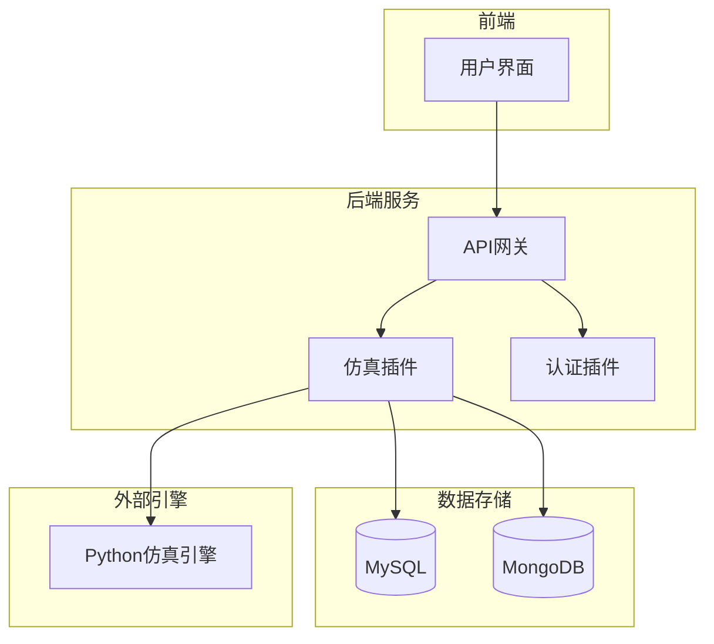
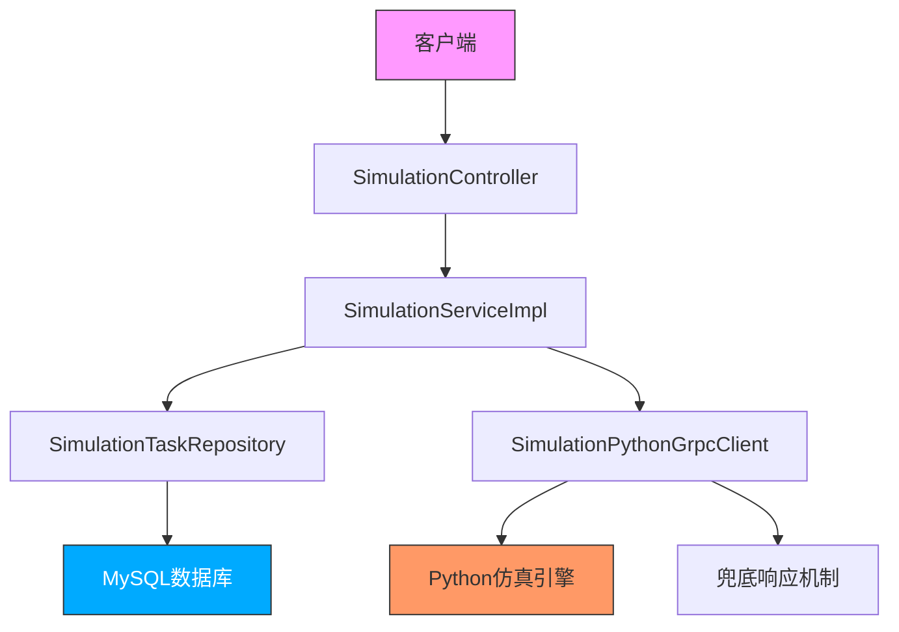
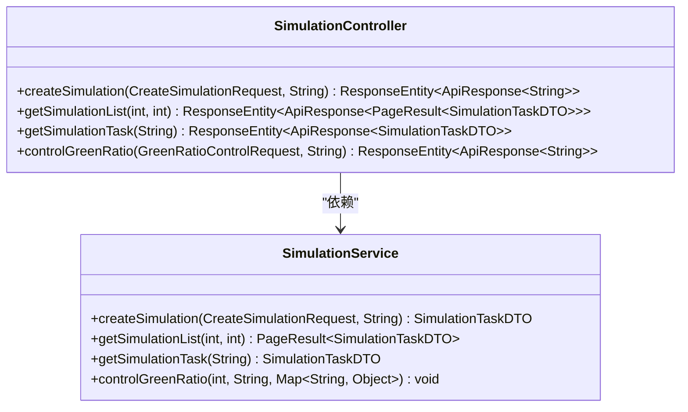
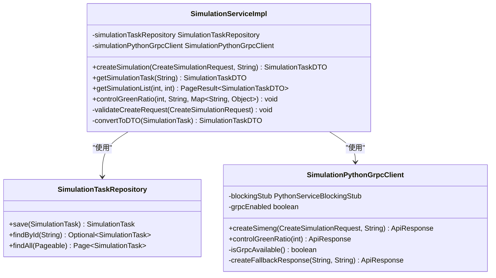
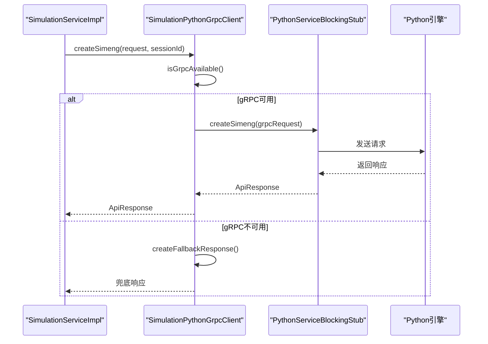
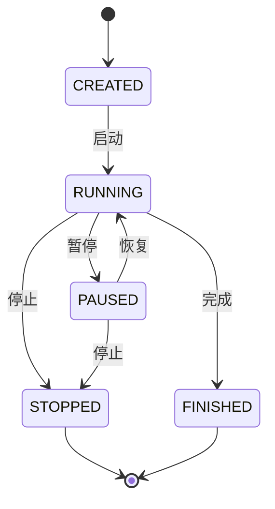
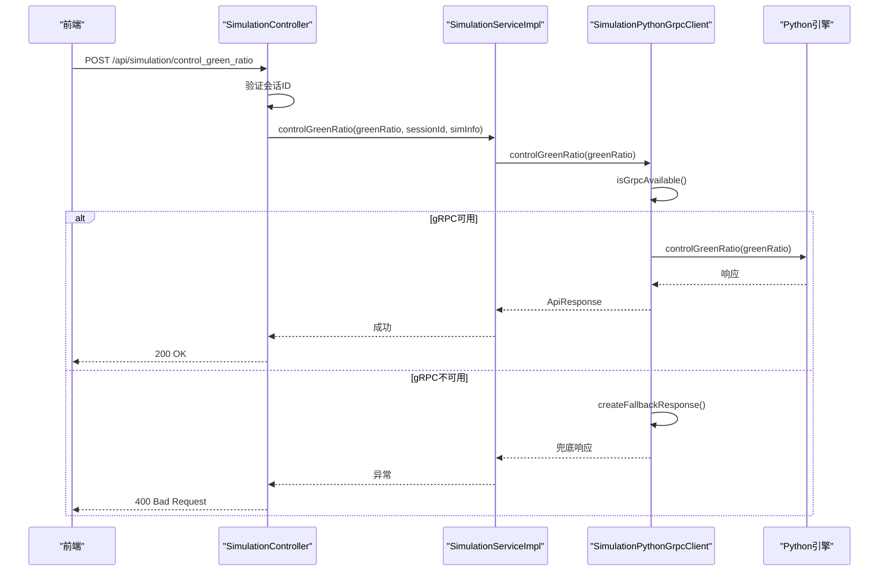
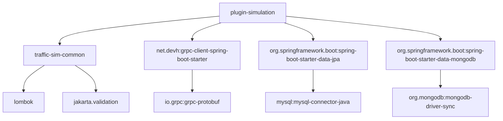

# 仿真任务管理

<cite>
**本文档引用文件**  
- [SimulationController.java](file://plugins/plugin-simulation/src/main/java/com/traffic/sim/plugin/simulation/controller/SimulationController.java)
- [SimulationServiceImpl.java](file://plugins/plugin-simulation/src/main/java/com/traffic/sim/plugin/simulation/service/SimulationServiceImpl.java)
- [SimulationPythonGrpcClient.java](file://plugins/plugin-simulation/src/main/java/com/traffic/sim/plugin/simulation/grpc/SimulationPythonGrpcClient.java)
- [SimulationTask.java](file://plugins/plugin-simulation/src/main/java/com/traffic/sim/plugin/simulation/entity/SimulationTask.java)
- [SimulationTaskRepository.java](file://plugins/plugin-simulation/src/main/java/com/traffic/sim/plugin/simulation/repository/SimulationTaskRepository.java)
- [python_service.proto](file://plugins/plugin-simulation/src/main/proto/python_service.proto)
- [CreateSimulationRequest.java](file://traffic-sim-common/src/main/java/com/traffic/sim/common/dto/CreateSimulationRequest.java)
- [GreenRatioControlRequest.java](file://traffic-sim-common/src/main/java/com/traffic/sim/common/dto/GreenRatioControlRequest.java)
- [SimulationTaskDTO.java](file://traffic-sim-common/src/main/java/com/traffic/sim/common/dto/SimulationTaskDTO.java)
- [application.yml](file://traffic-sim-server/src/main/resources/application.yml)
- [GrpcClientConfig.java](file://plugins/plugin-simulation/src/main/java/com/traffic/sim/plugin/simulation/config/GrpcClientConfig.java)
</cite>

## 目录
1. [简介](#简介)
2. [项目结构](#项目结构)
3. [核心组件](#核心组件)
4. [架构概述](#架构概述)
5. [详细组件分析](#详细组件分析)
6. [依赖分析](#依赖分析)
7. [性能考虑](#性能考虑)
8. [故障排除指南](#故障排除指南)
9. [结论](#结论)

## 简介
本文档详细说明交通仿真系统中的仿真任务管理功能，重点涵盖任务创建、控制与状态查询机制。系统通过`SimulationController`接收前端请求，委托`SimulationServiceImpl`处理业务逻辑，并通过`SimulationPythonGrpcClient`调用外部Python仿真引擎。文档将深入分析任务状态机、控制指令传递机制、gRPC通信流程及容错策略。

## 项目结构
本系统采用微服务架构，核心仿真功能由`plugin-simulation`模块实现，通过gRPC与外部Python引擎通信。公共DTO和异常定义位于`traffic-sim-common`模块，主服务入口在`traffic-sim-server`。数据库使用MySQL存储任务元数据，MongoDB存储仿真结果。

**图示来源**  
- [SimulationController.java](file://plugins/plugin-simulation/src/main/java/com/traffic/sim/plugin/simulation/controller/SimulationController.java)
- [application.yml](file://traffic-sim-server/src/main/resources/application.yml)

**本节来源**  
- [project_structure](file://project_structure)

## 核心组件
系统核心组件包括`SimulationController`（API入口）、`SimulationServiceImpl`（业务逻辑）、`SimulationPythonGrpcClient`（gRPC客户端）、`SimulationTask`（实体）和`SimulationTaskRepository`（数据访问）。这些组件协同完成仿真任务的全生命周期管理。

**本节来源**  
- [SimulationController.java](file://plugins/plugin-simulation/src/main/java/com/traffic/sim/plugin/simulation/controller/SimulationController.java)
- [SimulationServiceImpl.java](file://plugins/plugin-simulation/src/main/java/com/traffic/sim/plugin/simulation/service/SimulationServiceImpl.java)
- [SimulationTask.java](file://plugins/plugin-simulation/src/main/java/com/traffic/sim/plugin/simulation/entity/SimulationTask.java)

## 架构概述
系统采用分层架构，从上至下分为控制器层、服务层、gRPC客户端层和外部引擎层。`SimulationController`接收HTTP请求并验证参数，`SimulationServiceImpl`处理业务逻辑并持久化任务状态，`SimulationPythonGrpcClient`负责与Python引擎通信，实现了清晰的关注点分离。

**图示来源**  
- [SimulationController.java](file://plugins/plugin-simulation/src/main/java/com/traffic/sim/plugin/simulation/controller/SimulationController.java)
- [SimulationServiceImpl.java](file://plugins/plugin-simulation/src/main/java/com/traffic/sim/plugin/simulation/service/SimulationServiceImpl.java)
- [SimulationPythonGrpcClient.java](file://plugins/plugin-simulation/src/main/java/com/traffic/sim/plugin/simulation/grpc/SimulationPythonGrpcClient.java)

## 详细组件分析

### 仿真控制器分析
`SimulationController`是仿真任务的API入口，提供创建、查询和控制接口。它使用Spring MVC注解处理HTTP请求，集成Swagger生成API文档，并通过`@CookieValue`获取会话ID进行身份验证。

#### 控制器类图

**图示来源**  
- [SimulationController.java](file://plugins/plugin-simulation/src/main/java/com/traffic/sim/plugin/simulation/controller/SimulationController.java)
- [SimulationService.java](file://traffic-sim-common/src/main/java/com/traffic/sim/common/service/SimulationService.java)

**本节来源**  
- [SimulationController.java](file://plugins/plugin-simulation/src/main/java/com/traffic/sim/plugin/simulation/controller/SimulationController.java)

### 仿真服务实现分析
`SimulationServiceImpl`是核心业务逻辑实现，负责任务创建、状态管理和控制指令转发。它使用`@Transactional`确保数据一致性，通过`SimulationTaskRepository`持久化任务状态，并利用`SimulationPythonGrpcClient`与外部引擎通信。

#### 服务实现类图

**图示来源**  
- [SimulationServiceImpl.java](file://plugins/plugin-simulation/src/main/java/com/traffic/sim/plugin/simulation/service/SimulationServiceImpl.java)
- [SimulationTaskRepository.java](file://plugins/plugin-simulation/src/main/java/com/traffic/sim/plugin/simulation/repository/SimulationTaskRepository.java)
- [SimulationPythonGrpcClient.java](file://plugins/plugin-simulation/src/main/java/com/traffic/sim/plugin/simulation/grpc/SimulationPythonGrpcClient.java)

**本节来源**  
- [SimulationServiceImpl.java](file://plugins/plugin-simulation/src/main/java/com/traffic/sim/plugin/simulation/service/SimulationServiceImpl.java)

### gRPC客户端分析
`SimulationPythonGrpcClient`封装了与Python仿真引擎的gRPC通信，实现了关键的容错机制。当gRPC服务不可用时，客户端返回兜底响应而非抛出异常，确保主应用的可用性。

#### gRPC客户端序列图

**图示来源**  
- [SimulationPythonGrpcClient.java](file://plugins/plugin-simulation/src/main/java/com/traffic/sim/plugin/simulation/grpc/SimulationPythonGrpcClient.java)
- [python_service.proto](file://plugins/plugin-simulation/src/main/proto/python_service.proto)

**本节来源**  
- [SimulationPythonGrpcClient.java](file://plugins/plugin-simulation/src/main/java/com/traffic/sim/plugin/simulation/grpc/SimulationPythonGrpcClient.java)

### 仿真任务实体分析
`SimulationTask`实体定义了仿真任务的核心属性，包括任务ID、名称、地图信息、状态和用户关联。状态字段采用字符串枚举，支持CREATED、RUNNING、PAUSED、STOPPED、FINISHED等状态。

#### 任务状态机

**图示来源**  
- [SimulationTask.java](file://plugins/plugin-simulation/src/main/java/com/traffic/sim/plugin/simulation/entity/SimulationTask.java)

**本节来源**  
- [SimulationTask.java](file://plugins/plugin-simulation/src/main/java/com/traffic/sim/plugin/simulation/entity/SimulationTask.java)

### 控制指令分析
绿信比控制通过`controlGreenRatio`接口实现，前端发送0-100的整数值，经`SimulationController`验证后，由`SimulationServiceImpl`转发给`SimulationPythonGrpcClient`，最终通过gRPC调用Python引擎。

#### 控制指令序列图

**图示来源**  
- [SimulationController.java](file://plugins/plugin-simulation/src/main/java/com/traffic/sim/plugin/simulation/controller/SimulationController.java)
- [GreenRatioControlRequest.java](file://traffic-sim-common/src/main/java/com/traffic/sim/common/dto/GreenRatioControlRequest.java)
- [python_service.proto](file://plugins/plugin-simulation/src/main/proto/python_service.proto)

**本节来源**  
- [SimulationController.java](file://plugins/plugin-simulation/src/main/java/com/traffic/sim/plugin/simulation/controller/SimulationController.java)
- [GreenRatioControlRequest.java](file://traffic-sim-common/src/main/java/com/traffic/sim/common/dto/GreenRatioControlRequest.java)

## 依赖分析
系统依赖关系清晰，各层之间耦合度低。`plugin-simulation`依赖`traffic-sim-common`共享DTO，通过gRPC依赖外部Python引擎。数据库依赖通过Spring Data JPA实现，配置依赖通过`application.yml`集中管理。

**图示来源**  
- [pom.xml](file://plugins/plugin-simulation/pom.xml)
- [application.yml](file://traffic-sim-server/src/main/resources/application.yml)

**本节来源**  
- [pom.xml](file://plugins/plugin-simulation/pom.xml)
- [application.yml](file://traffic-sim-server/src/main/resources/application.yml)

## 性能考虑
系统在性能方面进行了多项优化：使用HikariCP连接池管理数据库连接，配置gRPC长连接保持，通过`@Lazy`延迟初始化gRPC存根。异常处理中区分了业务异常和系统异常，避免不必要的资源消耗。

## 故障排除指南
### gRPC连接失败
当Python引擎未启动或端口被占用时，gRPC连接会失败。系统会自动返回兜底响应，日志中会记录警告信息。解决方案：
1. 确认Python引擎已启动
2. 检查`application.yml`中gRPC地址配置
3. 验证防火墙设置

### 任务状态不一致
可能由于异步操作导致状态更新延迟。解决方案：
1. 检查数据库事务边界
2. 验证状态更新逻辑
3. 增加状态同步机制

**本节来源**  
- [SimulationPythonGrpcClient.java](file://plugins/plugin-simulation/src/main/java/com/traffic/sim/plugin/simulation/grpc/SimulationPythonGrpcClient.java)
- [SimulationServiceImpl.java](file://plugins/plugin-simulation/src/main/java/com/traffic/sim/plugin/simulation/service/SimulationServiceImpl.java)

## 结论
仿真任务管理系统设计合理，实现了任务创建、控制和查询的完整功能。通过gRPC与外部引擎通信，采用容错机制确保系统可用性。状态管理清晰，异常处理完善，为交通仿真提供了可靠的基础设施。