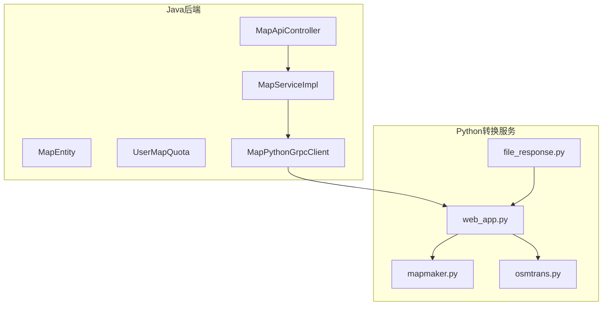
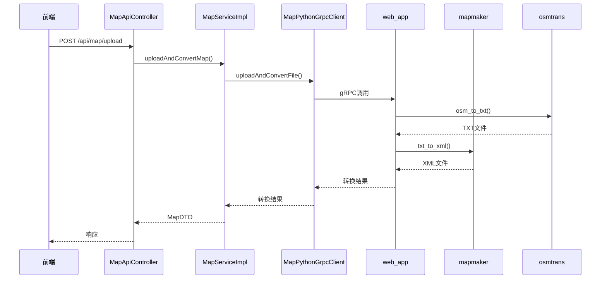
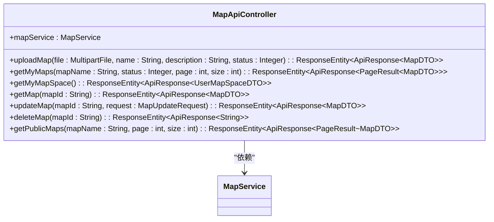
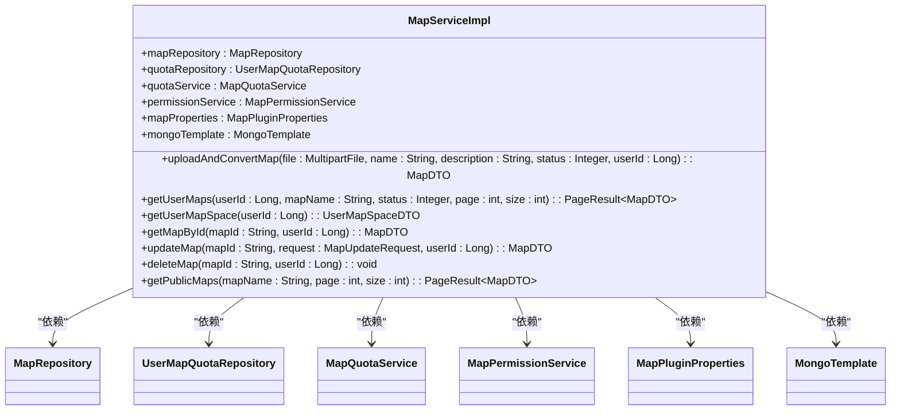
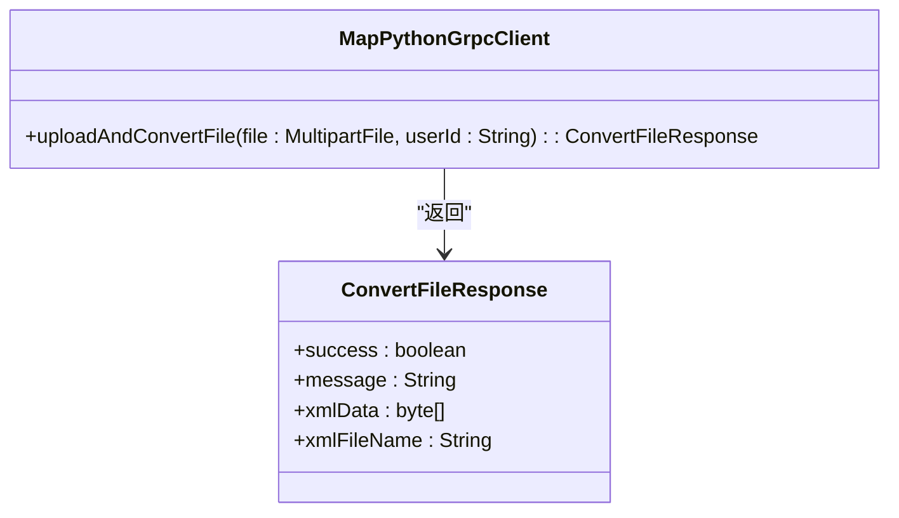
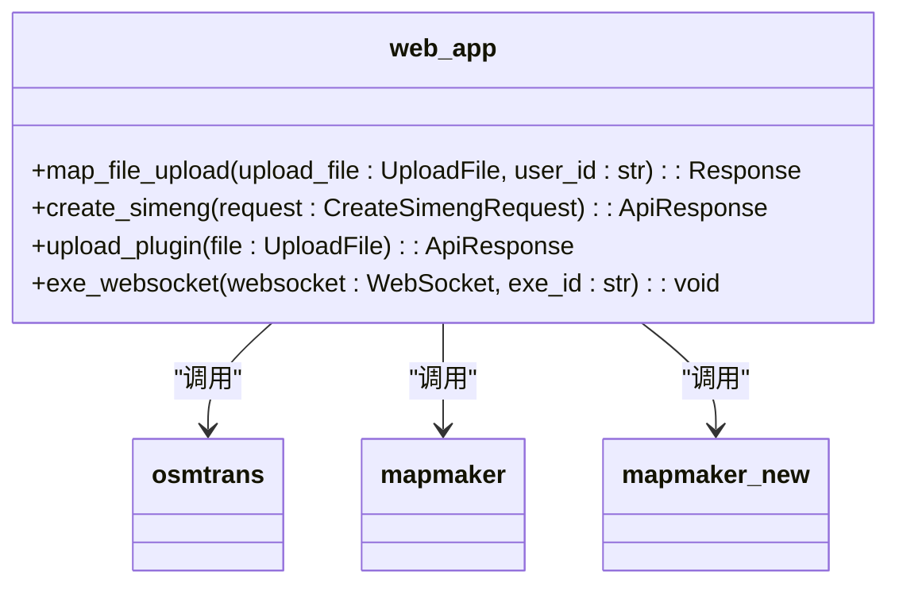
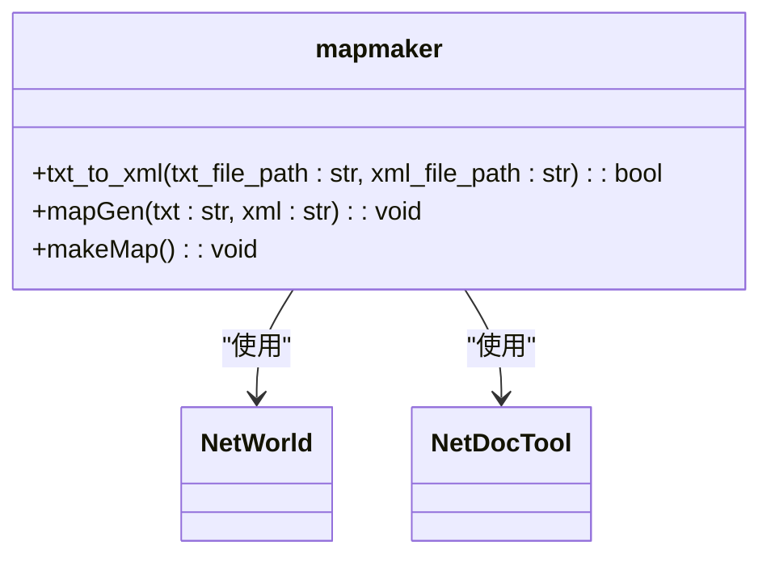
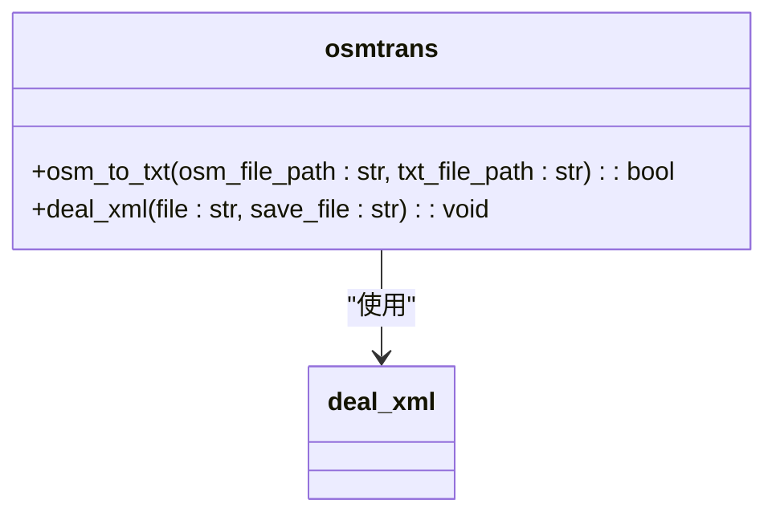
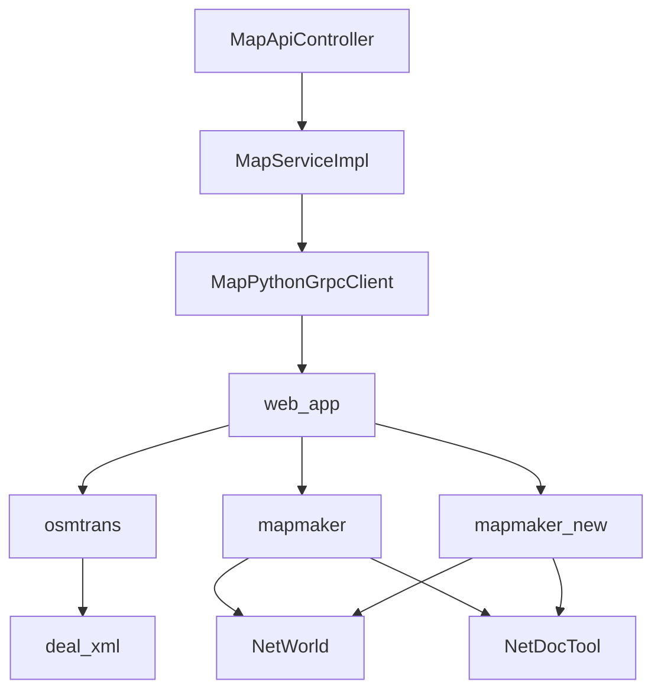

# 地图管理

<cite>
**本文档引用的文件**
- [MapApiController.java](file://plugins/plugin-map/src/main/java/com/traffic/sim/plugin/map/controller/MapApiController.java)
- [MapServiceImpl.java](file://plugins/plugin-map/src/main/java/com/traffic/sim/plugin/map/service/MapServiceImpl.java)
- [MapPythonGrpcClient.java](file://plugins/plugin-map/src/main/java/com/traffic/sim/plugin/map/client/MapPythonGrpcClient.java)
- [web_app.py](file://map_convert_services/web_app.py)
- [mapmaker.py](file://map_convert_services/map_utils/mapmaker.py)
- [MapEntity.java](file://plugins/plugin-map/src/main/java/com/traffic/sim/plugin/map/entity/MapEntity.java)
- [UserMapQuota.java](file://plugins/plugin-map/src/main/java/com/traffic/sim/plugin/map/entity/UserMapQuota.java)
- [MapQuotaService.java](file://plugins/plugin-map/src/main/java/com/traffic/sim/plugin/map/service/MapQuotaService.java)
- [MapPluginProperties.java](file://plugins/plugin-map/src/main/java/com/traffic/sim/plugin/map/config/MapPluginProperties.java)
- [python_service.proto](file://plugins/plugin-simulation/src/main/proto/python_service.proto)
- [osmtrans.py](file://map_convert_services/map_utils/osmtrans.py)
- [file_response.py](file://map_convert_services/utils/file_response.py)
</cite>

## 目录
1. [简介](#简介)
2. [项目结构](#项目结构)
3. [核心组件](#核心组件)
4. [架构概述](#架构概述)
5. [详细组件分析](#详细组件分析)
6. [依赖分析](#依赖分析)
7. [性能考虑](#性能考虑)
8. [故障排除指南](#故障排除指南)
9. [结论](#结论)

## 简介
本文档深入分析交通模拟系统中的地图管理功能，涵盖从地图上传到转换存储的完整流程。文档详细解释了`MapApiController`如何接收地图文件并调用`MapServiceImpl`进行处理，描述了`MapPythonGrpcClient`如何通过gRPC与Python地图转换服务通信。同时，文档详细说明了`web_app.py`中Flask应用如何接收gRPC请求并调度`mapmaker.py`等工具进行OSM数据转换，分析了`MapEntity`的持久化结构和`UserMapQuota`配额控制机制。通过实际调用链路示例，展示了前端→Java服务→gRPC→Python脚本的数据流转过程，并指出了常见问题如文件格式错误、转换超时的排查方法。

## 项目结构
地图管理功能分布在多个模块中，主要涉及Java后端服务和Python转换服务。Java部分位于`plugins/plugin-map`目录，包含控制器、服务、实体和客户端组件。Python转换服务位于`map_convert_services`目录，包含Web应用、转换工具和实用程序。

**图源**
- [MapApiController.java](file://plugins/plugin-map/src/main/java/com/traffic/sim/plugin/map/controller/MapApiController.java)
- [MapServiceImpl.java](file://plugins/plugin-map/src/main/java/com/traffic/sim/plugin/map/service/MapServiceImpl.java)
- [MapPythonGrpcClient.java](file://plugins/plugin-map/src/main/java/com/traffic/sim/plugin/map/client/MapPythonGrpcClient.java)
- [web_app.py](file://map_convert_services/web_app.py)
- [mapmaker.py](file://map_convert_services/map_utils/mapmaker.py)
- [osmtrans.py](file://map_convert_services/map_utils/osmtrans.py)
- [file_response.py](file://map_convert_services/utils/file_response.py)

**章节源**
- [MapApiController.java](file://plugins/plugin-map/src/main/java/com/traffic/sim/plugin/map/controller/MapApiController.java)
- [MapServiceImpl.java](file://plugins/plugin-map/src/main/java/com/traffic/sim/plugin/map/service/MapServiceImpl.java)
- [MapPythonGrpcClient.java](file://plugins/plugin-map/src/main/java/com/traffic/sim/plugin/map/client/MapPythonGrpcClient.java)
- [web_app.py](file://map_convert_services/web_app.py)

## 核心组件
地图管理功能的核心组件包括`MapApiController`、`MapServiceImpl`、`MapPythonGrpcClient`、`web_app.py`、`mapmaker.py`和`osmtrans.py`。这些组件协同工作，实现从地图上传到转换存储的完整流程。

**章节源**
- [MapApiController.java](file://plugins/plugin-map/src/main/java/com/traffic/sim/plugin/map/controller/MapApiController.java)
- [MapServiceImpl.java](file://plugins/plugin-map/src/main/java/com/traffic/sim/plugin/map/service/MapServiceImpl.java)
- [MapPythonGrpcClient.java](file://plugins/plugin-map/src/main/java/com/traffic/sim/plugin/map/client/MapPythonGrpcClient.java)
- [web_app.py](file://map_convert_services/web_app.py)
- [mapmaker.py](file://map_convert_services/map_utils/mapmaker.py)
- [osmtrans.py](file://map_convert_services/map_utils/osmtrans.py)

## 架构概述
地图管理功能的架构分为三层：前端、Java后端和Python转换服务。前端通过HTTP请求上传地图文件，Java后端接收请求并调用`MapServiceImpl`进行处理，`MapServiceImpl`通过`MapPythonGrpcClient`调用Python转换服务，Python转换服务使用`mapmaker.py`和`osmtrans.py`进行OSM数据转换。

**图源**
- [MapApiController.java](file://plugins/plugin-map/src/main/java/com/traffic/sim/plugin/map/controller/MapApiController.java)
- [MapServiceImpl.java](file://plugins/plugin-map/src/main/java/com/traffic/sim/plugin/map/service/MapServiceImpl.java)
- [MapPythonGrpcClient.java](file://plugins/plugin-map/src/main/java/com/traffic/sim/plugin/map/client/MapPythonGrpcClient.java)
- [web_app.py](file://map_convert_services/web_app.py)
- [mapmaker.py](file://map_convert_services/map_utils/mapmaker.py)
- [osmtrans.py](file://map_convert_services/map_utils/osmtrans.py)

## 详细组件分析

### MapApiController分析
`MapApiController`是地图管理功能的入口点，负责接收前端的HTTP请求。它提供了上传地图、获取地图列表、获取地图空间信息等接口。

**图源**
- [MapApiController.java](file://plugins/plugin-map/src/main/java/com/traffic/sim/plugin/map/controller/MapApiController.java)
- [MapService.java](file://traffic-sim-common/src/main/java/com/traffic/sim/common/service/MapService.java)

**章节源**
- [MapApiController.java](file://plugins/plugin-map/src/main/java/com/traffic/sim/plugin/map/controller/MapApiController.java)

### MapServiceImpl分析
`MapServiceImpl`是地图管理功能的核心服务，负责处理地图的上传、转换、存储和配额管理。它调用`MapPythonGrpcClient`与Python转换服务通信。

**图源**
- [MapServiceImpl.java](file://plugins/plugin-map/src/main/java/com/traffic/sim/plugin/map/service/MapServiceImpl.java)
- [MapRepository.java](file://plugins/plugin-map/src/main/java/com/traffic/sim/plugin/map/repository/MapRepository.java)
- [UserMapQuotaRepository.java](file://plugins/plugin-map/src/main/java/com/traffic/sim/plugin/map/repository/UserMapQuotaRepository.java)
- [MapQuotaService.java](file://plugins/plugin-map/src/main/java/com/traffic/sim/plugin/map/service/MapQuotaService.java)
- [MapPermissionService.java](file://plugins/plugin-map/src/main/java/com/traffic/sim/plugin/map/service/MapPermissionService.java)
- [MapPluginProperties.java](file://plugins/plugin-map/src/main/java/com/traffic/sim/plugin/map/config/MapPluginProperties.java)
- [MongoTemplate.java](file://spring-data-mongodb/src/main/java/org/springframework/data/mongodb/core/MongoTemplate.java)

**章节源**
- [MapServiceImpl.java](file://plugins/plugin-map/src/main/java/com/traffic/sim/plugin/map/service/MapServiceImpl.java)

### MapPythonGrpcClient分析
`MapPythonGrpcClient`是Java后端与Python转换服务之间的桥梁，通过gRPC协议进行通信。它负责将地图文件发送到Python服务并接收转换结果。

**图源**
- [MapPythonGrpcClient.java](file://plugins/plugin-map/src/main/java/com/traffic/sim/plugin/map/client/MapPythonGrpcClient.java)

**章节源**
- [MapPythonGrpcClient.java](file://plugins/plugin-map/src/main/java/com/traffic/sim/plugin/map/client/MapPythonGrpcClient.java)

### web_app.py分析
`web_app.py`是Python转换服务的入口点，使用FastAPI框架提供Web服务。它接收gRPC请求，调用`osmtrans.py`和`mapmaker.py`进行OSM数据转换。

**图源**
- [web_app.py](file://map_convert_services/web_app.py)
- [osmtrans.py](file://map_convert_services/map_utils/osmtrans.py)
- [mapmaker.py](file://map_convert_services/map_utils/mapmaker.py)
- [mapmaker_new.py](file://map_convert_services/map_utils/mapmaker_new.py)

**章节源**
- [web_app.py](file://map_convert_services/web_app.py)

### mapmaker.py分析
`mapmaker.py`是地图转换的核心工具，负责将TXT格式的路网数据转换为引擎所需的XML格式。它提供了`txt_to_xml`函数，用于执行转换操作。

**图源**
- [mapmaker.py](file://map_convert_services/map_utils/mapmaker.py)
- [NetWorld.py](file://map_convert_services/map_utils/NetWorld.py)
- [NetDocTool.py](file://map_convert_services/map_utils/NetDocTool.py)

**章节源**
- [mapmaker.py](file://map_convert_services/map_utils/mapmaker.py)

### osmtrans.py分析
`osmtrans.py`是OSM数据转换工具，负责将OSM格式的路网数据转换为TXT格式。它提供了`osm_to_txt`函数，用于执行转换操作。

**图源**
- [osmtrans.py](file://map_convert_services/map_utils/osmtrans.py)
- [deal_xml.py](file://map_convert_services/map_utils/deal_xml.py)

**章节源**
- [osmtrans.py](file://map_convert_services/map_utils/osmtrans.py)

## 依赖分析
地图管理功能的依赖关系复杂，涉及多个模块和组件。Java后端依赖于`MapServiceImpl`、`MapPythonGrpcClient`等组件，Python转换服务依赖于`web_app.py`、`mapmaker.py`、`osmtrans.py`等组件。

**图源**
- [MapApiController.java](file://plugins/plugin-map/src/main/java/com/traffic/sim/plugin/map/controller/MapApiController.java)
- [MapServiceImpl.java](file://plugins/plugin-map/src/main/java/com/traffic/sim/plugin/map/service/MapServiceImpl.java)
- [MapPythonGrpcClient.java](file://plugins/plugin-map/src/main/java/com/traffic/sim/plugin/map/client/MapPythonGrpcClient.java)
- [web_app.py](file://map_convert_services/web_app.py)
- [osmtrans.py](file://map_convert_services/map_utils/osmtrans.py)
- [mapmaker.py](file://map_convert_services/map_utils/mapmaker.py)
- [mapmaker_new.py](file://map_convert_services/map_utils/mapmaker_new.py)
- [deal_xml.py](file://map_convert_services/map_utils/deal_xml.py)
- [NetWorld.py](file://map_convert_services/map_utils/NetWorld.py)
- [NetDocTool.py](file://map_convert_services/map_utils/NetDocTool.py)

**章节源**
- [MapApiController.java](file://plugins/plugin-map/src/main/java/com/traffic/sim/plugin/map/controller/MapApiController.java)
- [MapServiceImpl.java](file://plugins/plugin-map/src/main/java/com/traffic/sim/plugin/map/service/MapServiceImpl.java)
- [MapPythonGrpcClient.java](file://plugins/plugin-map/src/main/java/com/traffic/sim/plugin/map/client/MapPythonGrpcClient.java)
- [web_app.py](file://map_convert_services/web_app.py)
- [osmtrans.py](file://map_convert_services/map_utils/osmtrans.py)
- [mapmaker.py](file://map_convert_services/map_utils/mapmaker.py)
- [mapmaker_new.py](file://map_convert_services/map_utils/mapmaker_new.py)

## 性能考虑
地图管理功能的性能主要受文件大小、转换复杂度和网络延迟的影响。大文件上传和复杂转换可能导致超时，建议优化文件上传和转换流程，增加超时重试机制。

**章节源**
- [MapServiceImpl.java](file://plugins/plugin-map/src/main/java/com/traffic/sim/plugin/map/service/MapServiceImpl.java)
- [MapPythonGrpcClient.java](file://plugins/plugin-map/src/main/java/com/traffic/sim/plugin/map/client/MapPythonGrpcClient.java)
- [web_app.py](file://map_convert_services/web_app.py)

## 故障排除指南
常见问题包括文件格式错误、转换超时和权限不足。文件格式错误通常由于上传的文件不符合要求，转换超时可能由于文件过大或网络延迟，权限不足则需要检查用户权限设置。

**章节源**
- [MapApiController.java](file://plugins/plugin-map/src/main/java/com/traffic/sim/plugin/map/controller/MapApiController.java)
- [MapServiceImpl.java](file://plugins/plugin-map/src/main/java/com/traffic/sim/plugin/map/service/MapServiceImpl.java)
- [MapPythonGrpcClient.java](file://plugins/plugin-map/src/main/java/com/traffic/sim/plugin/map/client/MapPythonGrpcClient.java)
- [web_app.py](file://map_convert_services/web_app.py)

## 结论
地图管理功能通过Java后端和Python转换服务的协同工作，实现了从地图上传到转换存储的完整流程。通过详细的组件分析和依赖关系图，可以更好地理解系统的架构和工作原理。建议优化性能和增加故障排除机制，以提高系统的稳定性和用户体验。