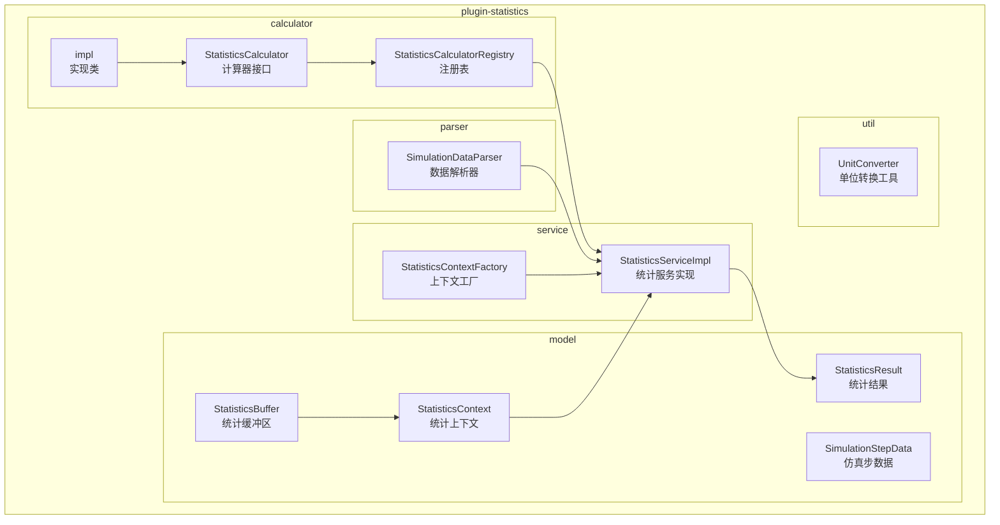
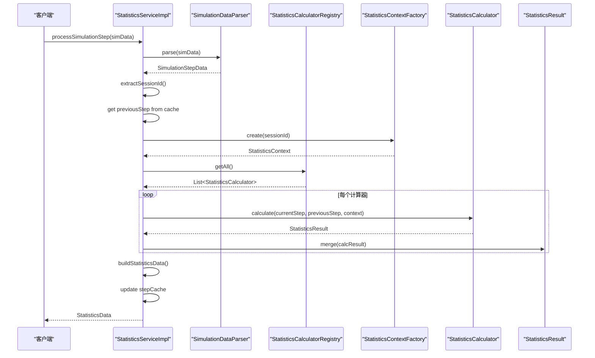
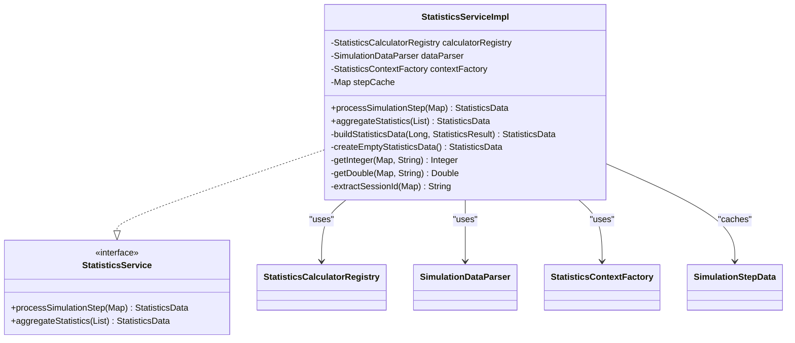
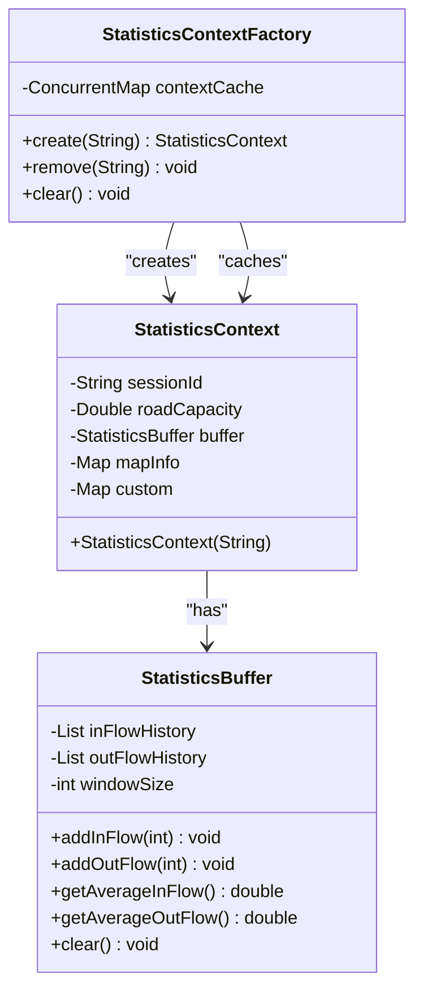
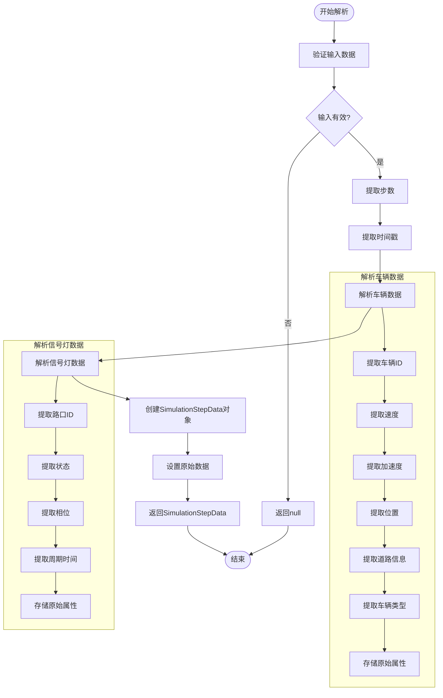
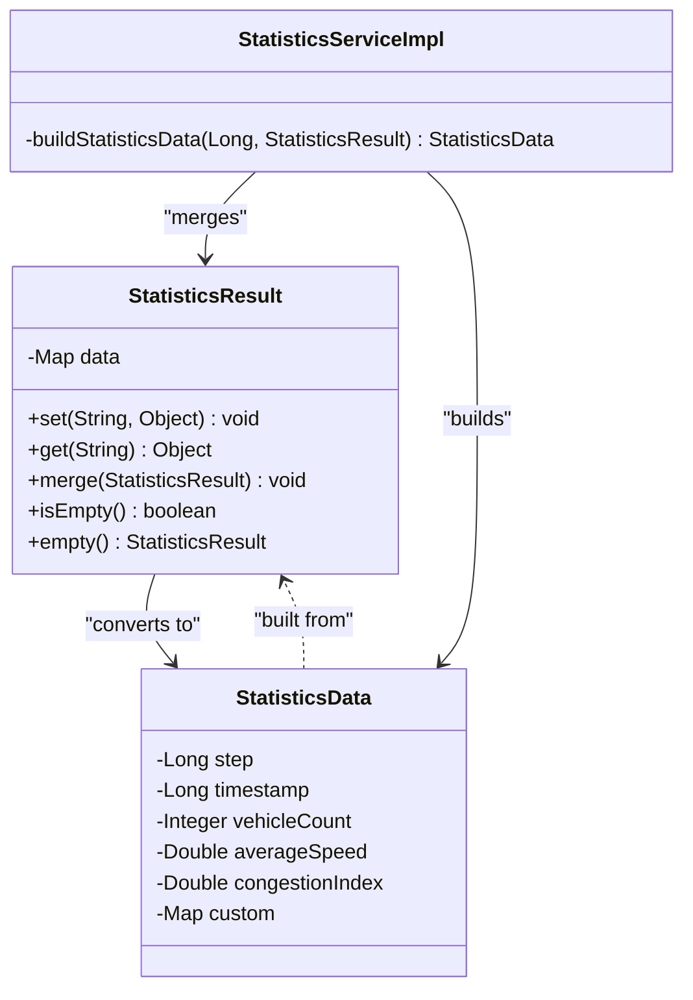

# 实时统计分析

<cite>
**本文档引用的文件**  
- [StatisticsServiceImpl.java](file://plugins/plugin-statistics/src/main/java/com/traffic/sim/plugin/statistics/service/StatisticsServiceImpl.java)
- [StatisticsCalculatorRegistry.java](file://plugins/plugin-statistics/src/main/java/com/traffic/sim/plugin/statistics/calculator/StatisticsCalculatorRegistry.java)
- [StatisticsContext.java](file://plugins/plugin-statistics/src/main/java/com/traffic/sim/plugin/statistics/model/StatisticsContext.java)
- [SimulationDataParser.java](file://plugins/plugin-statistics/src/main/java/com/traffic/sim/plugin/statistics/parser/SimulationDataParser.java)
- [StatisticsResult.java](file://plugins/plugin-statistics/src/main/java/com/traffic/sim/plugin/statistics/model/StatisticsResult.java)
- [StatisticsCalculator.java](file://plugins/plugin-statistics/src/main/java/com/traffic/sim/plugin/statistics/calculator/StatisticsCalculator.java)
- [SimulationStepData.java](file://plugins/plugin-statistics/src/main/java/com/traffic/sim/plugin/statistics/model/SimulationStepData.java)
- [StatisticsBuffer.java](file://plugins/plugin-statistics/src/main/java/com/traffic/sim/plugin/statistics/model/StatisticsBuffer.java)
- [StatisticsContextFactory.java](file://plugins/plugin-statistics/src/main/java/com/traffic/sim/plugin/statistics/service/StatisticsContextFactory.java)
- [SpeedCalculator.java](file://plugins/plugin-statistics/src/main/java/com/traffic/sim/plugin/statistics/calculator/impl/SpeedCalculator.java)
- [FlowCalculator.java](file://plugins/plugin-statistics/src/main/java/com/traffic/sim/plugin/statistics/calculator/impl/FlowCalculator.java)
- [AccelerationCalculator.java](file://plugins/plugin-statistics/src/main/java/com/traffic/sim/plugin/statistics/calculator/impl/AccelerationCalculator.java)
- [DelayCalculator.java](file://plugins/plugin-statistics/src/main/java/com/traffic/sim/plugin/statistics/calculator/impl/DelayCalculator.java)
- [InOutCalculator.java](file://plugins/plugin-statistics/src/main/java/com/traffic/sim/plugin/statistics/calculator/impl/InOutCalculator.java)
- [QueueCalculator.java](file://plugins/plugin-statistics/src/main/java/com/traffic/sim/plugin/statistics/calculator/impl/QueueCalculator.java)
- [StopCalculator.java](file://plugins/plugin-statistics/src/main/java/com/traffic/sim/plugin/statistics/calculator/impl/StopCalculator.java)
- [UnitConverter.java](file://plugins/plugin-statistics/src/main/java/com/traffic/sim/plugin/statistics/util/UnitConverter.java)
- [StatisticsPluginAutoConfiguration.java](file://plugins/plugin-statistics/src/main/java/com/traffic/sim/plugin/statistics/config/StatisticsPluginAutoConfiguration.java)
</cite>

## 目录
1. [项目结构](#项目结构)
2. [核心组件](#核心组件)
3. [架构概述](#架构概述)
4. [详细组件分析](#详细组件分析)
5. [依赖分析](#依赖分析)
6. [性能考虑](#性能考虑)
7. [故障排除指南](#故障排除指南)
8. [结论](#结论)

## 项目结构

交通仿真系统的实时统计分析功能位于 `plugins/plugin-statistics` 模块中，采用分层架构设计，各组件职责明确。



**图表来源**  
- [StatisticsCalculator.java](file://plugins/plugin-statistics/src/main/java/com/traffic/sim/plugin/statistics/calculator/StatisticsCalculator.java)
- [StatisticsCalculatorRegistry.java](file://plugins/plugin-statistics/src/main/java/com/traffic/sim/plugin/statistics/calculator/StatisticsCalculatorRegistry.java)
- [StatisticsServiceImpl.java](file://plugins/plugin-statistics/src/main/java/com/traffic/sim/plugin/statistics/service/StatisticsServiceImpl.java)
- [SimulationDataParser.java](file://plugins/plugin-statistics/src/main/java/com/traffic/sim/plugin/statistics/parser/SimulationDataParser.java)
- [StatisticsContext.java](file://plugins/plugin-statistics/src/main/java/com/traffic/sim/plugin/statistics/model/StatisticsContext.java)
- [StatisticsResult.java](file://plugins/plugin-statistics/src/main/java/com/traffic/sim/plugin/statistics/model/StatisticsResult.java)
- [StatisticsBuffer.java](file://plugins/plugin-statistics/src/main/java/com/traffic/sim/plugin/statistics/model/StatisticsBuffer.java)
- [StatisticsContextFactory.java](file://plugins/plugin-statistics/src/main/java/com/traffic/sim/plugin/statistics/service/StatisticsContextFactory.java)
- [UnitConverter.java](file://plugins/plugin-statistics/src/main/java/com/traffic/sim/plugin/statistics/util/UnitConverter.java)

**章节来源**  
- [plugins/plugin-statistics](file://plugins/plugin-statistics)

## 核心组件

实时统计分析系统基于策略模式构建，实现了动态指标计算架构。`StatisticsServiceImpl` 作为核心服务，接收仿真数据并分发给不同的 `StatisticsCalculator` 实现类进行处理。系统通过 `StatisticsCalculatorRegistry` 管理所有计算器的注册与查找，使用 `StatisticsContext` 封装计算所需的上下文环境。`SimulationDataParser` 负责解析原始仿真数据，而 `StatisticsResult` 则用于聚合和推送计算结果。

**章节来源**  
- [StatisticsServiceImpl.java](file://plugins/plugin-statistics/src/main/java/com/traffic/sim/plugin/statistics/service/StatisticsServiceImpl.java)
- [StatisticsCalculatorRegistry.java](file://plugins/plugin-statistics/src/main/java/com/traffic/sim/plugin/statistics/calculator/StatisticsCalculatorRegistry.java)
- [StatisticsContext.java](file://plugins/plugin-statistics/src/main/java/com/traffic/sim/plugin/statistics/model/StatisticsContext.java)
- [SimulationDataParser.java](file://plugins/plugin-statistics/src/main/java/com/traffic/sim/plugin/statistics/parser/SimulationDataParser.java)
- [StatisticsResult.java](file://plugins/plugin-statistics/src/main/java/com/traffic/sim/plugin/statistics/model/StatisticsResult.java)

## 架构概述

实时统计分析系统采用策略模式和依赖注入架构，实现了高内聚、低耦合的设计。系统通过 Spring 框架自动扫描和注册所有 `StatisticsCalculator` 实现类，利用 `StatisticsCalculatorRegistry` 进行统一管理。当仿真数据到达时，`StatisticsServiceImpl` 协调各个组件完成数据处理流程。



**图表来源**  
- [StatisticsServiceImpl.java](file://plugins/plugin-statistics/src/main/java/com/traffic/sim/plugin/statistics/service/StatisticsServiceImpl.java)
- [SimulationDataParser.java](file://plugins/plugin-statistics/src/main/java/com/traffic/sim/plugin/statistics/parser/SimulationDataParser.java)
- [StatisticsCalculatorRegistry.java](file://plugins/plugin-statistics/src/main/java/com/traffic/sim/plugin/statistics/calculator/StatisticsCalculatorRegistry.java)
- [StatisticsContextFactory.java](file://plugins/plugin-statistics/src/main/java/com/traffic/sim/plugin/statistics/service/StatisticsContextFactory.java)
- [StatisticsResult.java](file://plugins/plugin-statistics/src/main/java/com/traffic/sim/plugin/statistics/model/StatisticsResult.java)

## 详细组件分析

### 统计服务实现分析

`StatisticsServiceImpl` 是实时统计分析的核心组件，负责协调整个数据处理流程。该服务实现了 `StatisticsService` 接口，通过依赖注入获取 `StatisticsCalculatorRegistry`、`SimulationDataParser` 和 `StatisticsContextFactory` 等关键组件。



**图表来源**  
- [StatisticsServiceImpl.java](file://plugins/plugin-statistics/src/main/java/com/traffic/sim/plugin/statistics/service/StatisticsServiceImpl.java)
- [StatisticsService.java](file://traffic-sim-common/src/main/java/com/traffic/sim/common/service/StatisticsService.java)

**章节来源**  
- [StatisticsServiceImpl.java](file://plugins/plugin-statistics/src/main/java/com/traffic/sim/plugin/statistics/service/StatisticsServiceImpl.java)

### 统计计算器注册表分析

`StatisticsCalculatorRegistry` 是系统的核心注册中心，负责管理所有统计计算器的生命周期。该组件使用线程安全的 `ConcurrentHashMap` 存储计算器实例，确保在高并发环境下也能安全地进行注册和查找操作。

```mermaid
classDiagram
class StatisticsCalculatorRegistry {
-Map<String, StatisticsCalculator> calculators
+register(StatisticsCalculator) void
+getAll() List<StatisticsCalculator>
+get(String) StatisticsCalculator
+contains(String) boolean
}
class StatisticsCalculator {
<<interface>>
+calculate(SimulationStepData, SimulationStepData, StatisticsContext) StatisticsResult
+getName() String
+getCalculatedFields() List<String>
}
StatisticsCalculatorRegistry --> StatisticsCalculator : "stores"
StatisticsCalculatorRegistry ..> StatisticsCalculator : "manages"
class SpeedCalculator {
+calculate(SimulationStepData, SimulationStepData, StatisticsContext) StatisticsResult
+getName() String
+getCalculatedFields() List<String>
}
class FlowCalculator {
+calculate(SimulationStepData, SimulationStepData, StatisticsContext) StatisticsResult
+getName() String
+getCalculatedFields() List<String>
}
class AccelerationCalculator {
+calculate(SimulationStepData, SimulationStepData, StatisticsContext) StatisticsResult
+getName() String
+getCalculatedFields() List<String>
}
class DelayCalculator {
+calculate(SimulationStepData, SimulationStepData, StatisticsContext) StatisticsResult
+getName() String
+getCalculatedFields() List<String>
}
class InOutCalculator {
+calculate(SimulationStepData, SimulationStepData, StatisticsContext) StatisticsResult
+getName() String
+getCalculatedFields() List<String>
}
class QueueCalculator {
+calculate(SimulationStepData, SimulationStepData, StatisticsContext) StatisticsResult
+getName() String
+getCalculatedFields() List<String>
}
class StopCalculator {
+calculate(SimulationStepData, SimulationStepData, StatisticsContext) StatisticsResult
+getName() String
+getCalculatedFields() List<String>
}
StatisticsCalculator <|-- SpeedCalculator
StatisticsCalculator <|-- FlowCalculator
StatisticsCalculator <|-- AccelerationCalculator
StatisticsCalculator <|-- DelayCalculator
StatisticsCalculator <|-- InOutCalculator
StatisticsCalculator <|-- QueueCalculator
StatisticsCalculator <|-- StopCalculator
```



**图表来源**  
- [StatisticsCalculatorRegistry.java](file://plugins/plugin-statistics/src/main/java/com/traffic/sim/plugin/statistics/calculator/StatisticsCalculatorRegistry.java)
- [StatisticsCalculator.java](file://plugins/plugin-statistics/src/main/java/com/traffic/sim/plugin/statistics/calculator/StatisticsCalculator.java)
- [SpeedCalculator.java](file://plugins/plugin-statistics/src/main/java/com/traffic/sim/plugin/statistics/calculator/impl/SpeedCalculator.java)
- [FlowCalculator.java](file://plugins/plugin-statistics/src/main/java/com/traffic/sim/plugin/statistics/calculator/impl/FlowCalculator.java)
- [AccelerationCalculator.java](file://plugins/plugin-statistics/src/main/java/com/traffic/sim/plugin/statistics/calculator/impl/AccelerationCalculator.java)
- [DelayCalculator.java](file://plugins/plugin-statistics/src/main/java/com/traffic/sim/plugin/statistics/calculator/impl/DelayCalculator.java)
- [InOutCalculator.java](file://plugins/plugin-statistics/src/main/java/com/traffic/sim/plugin/statistics/calculator/impl/InOutCalculator.java)
- [QueueCalculator.java](file://plugins/plugin-statistics/src/main/java/com/traffic/sim/plugin/statistics/calculator/impl/QueueCalculator.java)
- [StopCalculator.java](file://plugins/plugin-statistics/src/main/java/com/traffic/sim/plugin/statistics/calculator/impl/StopCalculator.java)

**章节来源**  
- [StatisticsCalculatorRegistry.java](file://plugins/plugin-statistics/src/main/java/com/traffic/sim/plugin/statistics/calculator/StatisticsCalculatorRegistry.java)

### 统计上下文分析

`StatisticsContext` 封装了统计计算所需的上下文环境，包括会话ID、道路容量、统计缓冲区和地图信息等。`StatisticsContextFactory` 负责创建和管理上下文实例，使用 `ConcurrentHashMap` 缓存上下文以提高性能。



**图表来源**  
- [StatisticsContext.java](file://plugins/plugin-statistics/src/main/java/com/traffic/sim/plugin/statistics/model/StatisticsContext.java)
- [StatisticsBuffer.java](file://plugins/plugin-statistics/src/main/java/com/traffic/sim/plugin/statistics/model/StatisticsBuffer.java)
- [StatisticsContextFactory.java](file://plugins/plugin-statistics/src/main/java/com/traffic/sim/plugin/statistics/service/StatisticsContextFactory.java)

**章节来源**  
- [StatisticsContext.java](file://plugins/plugin-statistics/src/main/java/com/traffic/sim/plugin/statistics/model/StatisticsContext.java)
- [StatisticsBuffer.java](file://plugins/plugin-statistics/src/main/java/com/traffic/sim/plugin/statistics/model/StatisticsBuffer.java)
- [StatisticsContextFactory.java](file://plugins/plugin-statistics/src/main/java/com/traffic/sim/plugin/statistics/service/StatisticsContextFactory.java)

### 数据解析器分析

`SimulationDataParser` 负责将原始的 Map 格式仿真数据解析为结构化的 `SimulationStepData` 对象。解析器提取步数、时间戳、车辆数据和信号灯数据，并构建完整的仿真步数据模型。



**图表来源**  
- [SimulationDataParser.java](file://plugins/plugin-statistics/src/main/java/com/traffic/sim/plugin/statistics/parser/SimulationDataParser.java)
- [SimulationStepData.java](file://plugins/plugin-statistics/src/main/java/com/traffic/sim/plugin/statistics/model/SimulationStepData.java)

**章节来源**  
- [SimulationDataParser.java](file://plugins/plugin-statistics/src/main/java/com/traffic/sim/plugin/statistics/parser/SimulationDataParser.java)

### 统计结果分析

`StatisticsResult` 用于封装统计计算的结果，采用 `Map<String, Object>` 存储各种统计指标。结果对象支持合并操作，允许将多个计算器的结果整合到一个统一的结果集中。



**图表来源**  
- [StatisticsResult.java](file://plugins/plugin-statistics/src/main/java/com/traffic/sim/plugin/statistics/model/StatisticsResult.java)
- [StatisticsData.java](file://traffic-sim-common/src/main/java/com/traffic/sim/common/model/StatisticsData.java)
- [StatisticsServiceImpl.java](file://plugins/plugin-statistics/src/main/java/com/traffic/sim/plugin/statistics/service/StatisticsServiceImpl.java)

**章节来源**  
- [StatisticsResult.java](file://plugins/plugin-statistics/src/main/java/com/traffic/sim/plugin/statistics/model/StatisticsResult.java)

## 依赖分析

实时统计分析模块与其他系统组件存在明确的依赖关系。该模块依赖于 `traffic-sim-common` 模块中的共享模型和接口，同时被主应用和其他插件所依赖。

```mermaid
graph TD
subgraph "plugin-statistics"
StatisticsServiceImpl
StatisticsCalculatorRegistry
SimulationDataParser
StatisticsContextFactory
UnitConverter
end
subgraph "traffic-sim-common"
StatisticsService
StatisticsData
ApiResponse
end
subgraph "主应用"
TrafficSimApplication
end
StatisticsServiceImpl --> StatisticsService : "implements"
StatisticsServiceImpl --> StatisticsData : "returns"
StatisticsServiceImpl --> ApiResponse : "wraps"
StatisticsCalculatorRegistry --> StatisticsCalculator : "manages"
SimulationDataParser --> SimulationStepData : "creates"
StatisticsContextFactory --> StatisticsContext : "creates"
UnitConverter --> StatisticsCalculator : "used by"
TrafficSimApplication --> StatisticsServiceImpl : "uses"
TrafficSimApplication --> StatisticsCalculatorRegistry : "configures"
```

**图表来源**  
- [StatisticsServiceImpl.java](file://plugins/plugin-statistics/src/main/java/com/traffic/sim/plugin/statistics/service/StatisticsServiceImpl.java)
- [StatisticsCalculatorRegistry.java](file://plugins/plugin-statistics/src/main/java/com/traffic/sim/plugin/statistics/calculator/StatisticsCalculatorRegistry.java)
- [SimulationDataParser.java](file://plugins/plugin-statistics/src/main/java/com/traffic/sim/plugin/statistics/parser/SimulationDataParser.java)
- [StatisticsContextFactory.java](file://plugins/plugin-statistics/src/main/java/com/traffic/sim/plugin/statistics/service/StatisticsContextFactory.java)
- [UnitConverter.java](file://plugins/plugin-statistics/src/main/java/com/traffic/sim/plugin/statistics/util/UnitConverter.java)
- [StatisticsService.java](file://traffic-sim-common/src/main/java/com/traffic/sim/common/service/StatisticsService.java)
- [StatisticsData.java](file://traffic-sim-common/src/main/java/com/traffic/sim/common/model/StatisticsData.java)
- [TrafficSimApplication.java](file://traffic-sim-server/src/main/java/com/traffic/sim/TrafficSimApplication.java)

**章节来源**  
- [pom.xml](file://plugins/plugin-statistics/pom.xml)
- [pom.xml](file://traffic-sim-common/pom.xml)
- [pom.xml](file://traffic-sim-server/pom.xml)

## 性能考虑

实时统计分析系统在高频率数据计算场景下面临性能挑战，需要重点关注以下几个方面：

1. **缓存优化**：系统使用 `stepCache` 缓存上一步的仿真数据，避免重复解析，同时 `StatisticsContextFactory` 使用 `ConcurrentHashMap` 缓存上下文实例，减少对象创建开销。

2. **并发处理**：`StatisticsCalculatorRegistry` 使用线程安全的 `ConcurrentHashMap` 存储计算器实例，确保在多线程环境下安全访问。

3. **批量处理**：`aggregateStatistics` 方法支持批量聚合多个时间步的统计数据，减少频繁的计算和I/O操作。

4. **内存管理**：`StatisticsBuffer` 使用滑动窗口机制，限制历史数据的存储量，防止内存无限增长。

5. **异常处理**：每个计算器的计算过程都包含异常捕获，确保单个计算器的故障不会影响整体统计流程。

**章节来源**  
- [StatisticsServiceImpl.java](file://plugins/plugin-statistics/src/main/java/com/traffic/sim/plugin/statistics/service/StatisticsServiceImpl.java)
- [StatisticsContextFactory.java](file://plugins/plugin-statistics/src/main/java/com/traffic/sim/plugin/statistics/service/StatisticsContextFactory.java)
- [StatisticsBuffer.java](file://plugins/plugin-statistics/src/main/java/com/traffic/sim/plugin/statistics/model/StatisticsBuffer.java)

## 故障排除指南

### 常见问题及解决方案

1. **数据解析失败**
   - **症状**：`SimulationDataParser.parse()` 返回 null
   - **原因**：输入数据为空或格式不正确
   - **解决方案**：检查输入数据的完整性和格式，确保包含必要的字段如 "step"、"vehicles" 等

2. **统计结果为空**
   - **症状**：`StatisticsResult` 为空或缺少预期指标
   - **原因**：相关计算器未正确注册或计算逻辑有问题
   - **解决方案**：检查 `StatisticsCalculatorRegistry` 的日志，确认所有计算器已成功注册

3. **性能下降**
   - **症状**：统计处理延迟增加
   - **原因**：数据量过大或计算器实现效率低下
   - **解决方案**：优化计算器算法，考虑异步处理或批量计算

4. **上下文丢失**
   - **症状**：跨步计算结果不一致
   - **原因**：`StatisticsContext` 缓存被意外清除
   - **解决方案**：检查 `StatisticsContextFactory` 的使用，避免调用 `clear()` 或 `remove()` 方法

**章节来源**  
- [StatisticsServiceImpl.java](file://plugins/plugin-statistics/src/main/java/com/traffic/sim/plugin/statistics/service/StatisticsServiceImpl.java)
- [SimulationDataParser.java](file://plugins/plugin-statistics/src/main/java/com/traffic/sim/plugin/statistics/parser/SimulationDataParser.java)
- [StatisticsContextFactory.java](file://plugins/plugin-statistics/src/main/java/com/traffic/sim/plugin/statistics/service/StatisticsContextFactory.java)

## 结论

实时统计分析系统通过策略模式实现了灵活的动态指标计算架构。`StatisticsServiceImpl` 作为核心协调者，接收仿真数据并分发给注册的 `StatisticsCalculator` 实现类。`StatisticsCalculatorRegistry` 提供了计算器的注册和查找机制，支持系统的可扩展性。`StatisticsContext` 封装了计算所需的上下文环境，包括会话信息、道路容量和统计缓冲区。`SimulationDataParser` 负责将原始数据解析为结构化格式，而 `StatisticsResult` 则用于聚合和推送计算结果。

该架构具有良好的扩展性，可以通过实现新的 `StatisticsCalculator` 接口来添加自定义统计指标。系统在设计上考虑了性能优化，使用缓存机制减少重复计算，并通过异常处理确保系统的稳定性。未来可以进一步优化异步处理能力，支持更高频率的数据计算需求。