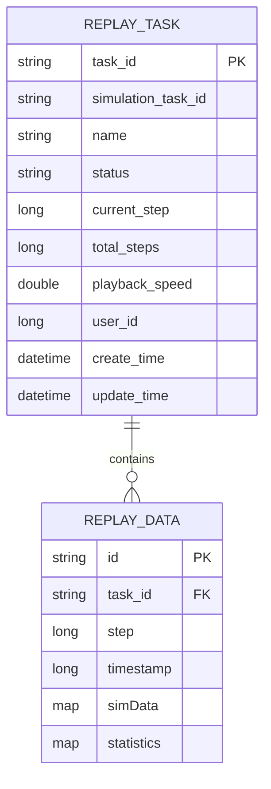
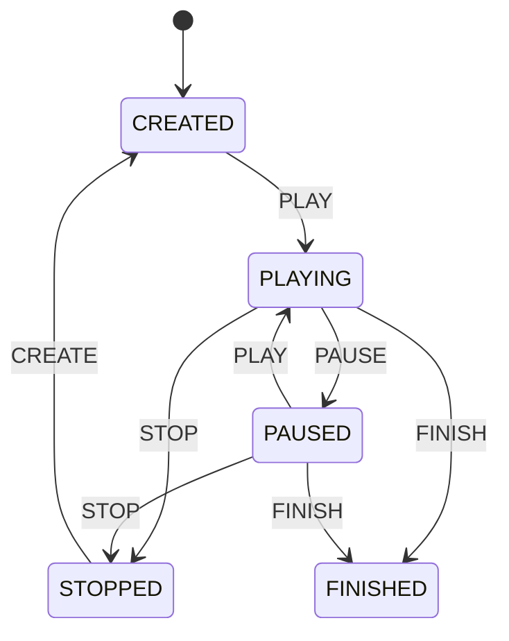
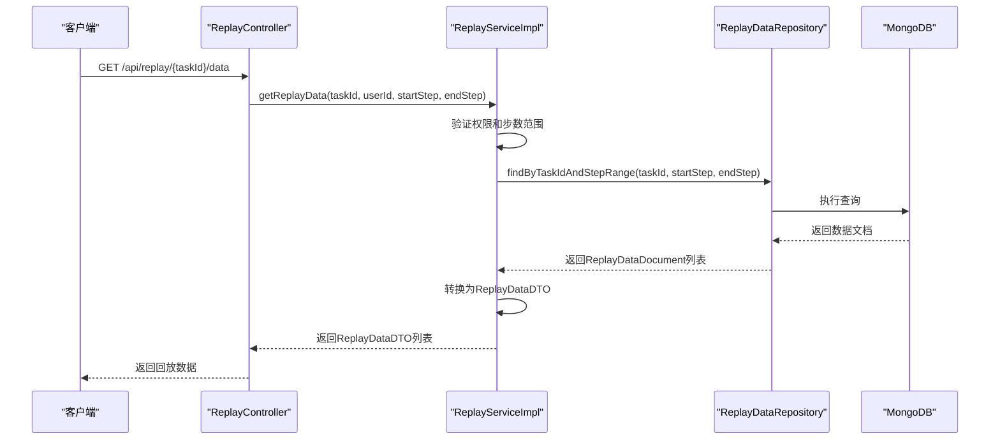
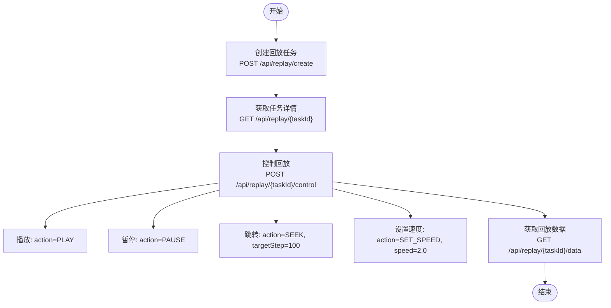
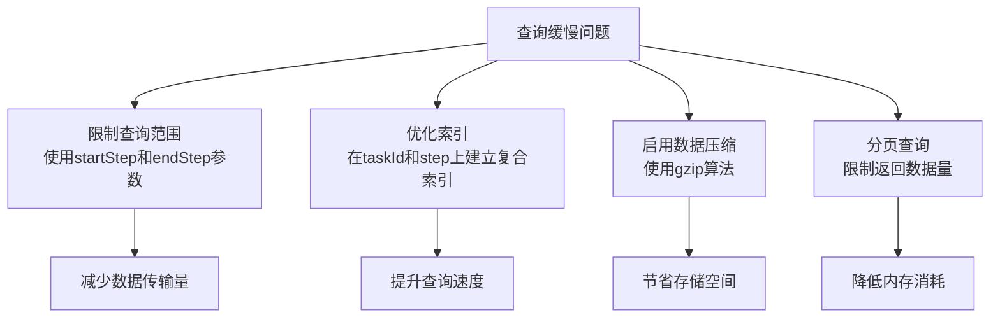

# 数据回放

<cite>
**本文档引用文件**   
- [ReplayController.java](file://plugins/plugin-engine-replay/src/main/java/com/traffic/sim/plugin/replay/controller/ReplayController.java)
- [ReplayServiceImpl.java](file://plugins/plugin-engine-replay/src/main/java/com/traffic/sim/plugin/replay/service/ReplayServiceImpl.java)
- [ReplayDataDocument.java](file://plugins/plugin-engine-replay/src/main/java/com/traffic/sim/plugin/replay/document/ReplayDataDocument.java)
- [ReplayDataRepository.java](file://plugins/plugin-engine-replay/src/main/java/com/traffic/sim/plugin/replay/repository/ReplayDataRepository.java)
- [ReplayTask.java](file://plugins/plugin-engine-replay/src/main/java/com/traffic/sim/plugin/replay/entity/ReplayTask.java)
- [ReplayDataService.java](file://plugins/plugin-engine-replay/src/main/java/com/traffic/sim/plugin/replay/service/ReplayDataService.java)
- [ReplayPluginProperties.java](file://plugins/plugin-engine-replay/src/main/java/com/traffic/sim/plugin/replay/config/ReplayPluginProperties.java)
- [README.md](file://plugins/plugin-engine-replay/README.md)
</cite>

## 目录
1. [简介](#简介)
2. [核心组件](#核心组件)
3. [数据存储设计](#数据存储设计)
4. [回放任务生命周期管理](#回放任务生命周期管理)
5. [数据流恢复机制](#数据流恢复机制)
6. [API使用示例](#api使用示例)
7. [性能优化建议](#性能优化建议)

## 简介
数据回放功能是交通仿真系统中的重要组成部分，它允许用户回顾和分析历史仿真数据。该功能通过`ReplayController`接收回放任务创建请求，并由`ReplayServiceImpl`管理`ReplayTask`的完整生命周期。系统使用MongoDB存储大量时序回放数据，通过`ReplayDataDocument`设计实现高效的数据存储与查询。`ReplayDataRepository`提供了丰富的查询接口，支持按步数范围获取回放数据。回放过程中，系统实现了精确的时间轴控制和状态同步机制，确保数据恢复的准确性和一致性。

## 核心组件

数据回放功能由多个核心组件构成，包括控制器、服务实现、数据文档和存储库等。`ReplayController`作为API入口，处理所有回放相关的HTTP请求。`ReplayServiceImpl`负责业务逻辑的实现和任务生命周期的管理。`ReplayDataDocument`定义了存储在MongoDB中的数据结构，而`ReplayDataRepository`则提供了对这些数据的访问接口。

**本文档引用文件**   
- [ReplayController.java](file://plugins/plugin-engine-replay/src/main/java/com/traffic/sim/plugin/replay/controller/ReplayController.java)
- [ReplayServiceImpl.java](file://plugins/plugin-engine-replay/src/main/java/com/traffic/sim/plugin/replay/service/ReplayServiceImpl.java)
- [ReplayDataDocument.java](file://plugins/plugin-engine-replay/src/main/java/com/traffic/sim/plugin/replay/document/ReplayDataDocument.java)
- [ReplayDataRepository.java](file://plugins/plugin-engine-replay/src/main/java/com/traffic/sim/plugin/replay/repository/ReplayDataRepository.java)

## 数据存储设计

数据回放功能采用混合存储策略，将元数据存储在MySQL中，而大量的时序数据则存储在MongoDB中。这种设计充分利用了两种数据库的优势：MySQL提供事务支持和结构化查询，适合存储任务元数据；MongoDB则擅长处理非结构化数据和高吞吐量的读写操作，适合存储海量的时序回放数据。

**图表来源**
- [ReplayTask.java](file://plugins/plugin-engine-replay/src/main/java/com/traffic/sim/plugin/replay/entity/ReplayTask.java#L18-L73)
- [ReplayDataDocument.java](file://plugins/plugin-engine-replay/src/main/java/com/traffic/sim/plugin/replay/document/ReplayDataDocument.java#L16-L44)

## 回放任务生命周期管理

回放任务的生命周期由`ReplayServiceImpl`全面管理，包括创建、查询、控制和删除等操作。任务状态通过枚举`ReplayStatus`定义，包含CREATED、PLAYING、PAUSED、STOPPED和FINISHED五种状态。状态转换遵循严格的规则，确保系统的稳定性和数据的一致性。

**图表来源**
- [ReplayTask.java](file://plugins/plugin-engine-replay/src/main/java/com/traffic/sim/plugin/replay/entity/ReplayTask.java#L77-L100)
- [ReplayServiceImpl.java](file://plugins/plugin-engine-replay/src/main/java/com/traffic/sim/plugin/replay/service/ReplayServiceImpl.java#L106-L169)

## 数据流恢复机制

回放过程中的数据流恢复机制是系统的核心功能之一。当用户请求回放数据时，系统首先验证权限和步数范围的有效性，然后从MongoDB中检索相应的数据。时间轴控制通过`currentStep`字段实现，确保数据按正确的顺序恢复。状态同步机制保证了多个客户端同时回放时的一致性体验。

**图表来源**
- [ReplayController.java](file://plugins/plugin-engine-replay/src/main/java/com/traffic/sim/plugin/replay/controller/ReplayController.java#L88-L102)
- [ReplayServiceImpl.java](file://plugins/plugin-engine-replay/src/main/java/com/traffic/sim/plugin/replay/service/ReplayServiceImpl.java#L87-L104)
- [ReplayDataRepository.java](file://plugins/plugin-engine-replay/src/main/java/com/traffic/sim/plugin/replay/repository/ReplayDataRepository.java#L21-L23)

## API使用示例

以下示例展示了如何通过API启动回放任务并获取历史数据。首先创建回放任务，然后通过控制接口管理回放过程，最后查询所需的回放数据。

**图表来源**
- [ReplayController.java](file://plugins/plugin-engine-replay/src/main/java/com/traffic/sim/plugin/replay/controller/ReplayController.java)
- [ReplayControlRequest.java](file://plugins/plugin-engine-replay/src/main/java/com/traffic/sim/plugin/replay/dto/ReplayControlRequest.java)

## 性能优化建议

针对数据量过大导致查询缓慢的问题，系统提供了多种优化策略。首先，通过配置文件中的`batchStepSize`参数控制批量查询的步数，避免一次性加载过多数据。其次，利用MongoDB的索引机制，在`taskId`和`step`字段上建立复合索引，显著提升查询性能。此外，系统支持数据压缩功能，通过`compressionEnabled`和`compressionAlgorithm`配置项减少存储空间占用。

**图表来源**
- [ReplayPluginProperties.java](file://plugins/plugin-engine-replay/src/main/java/com/traffic/sim/plugin/replay/config/ReplayPluginProperties.java#L16-L67)
- [ReplayDataRepository.java](file://plugins/plugin-engine-replay/src/main/java/com/traffic/sim/plugin/replay/repository/ReplayDataRepository.java#L21-L23)