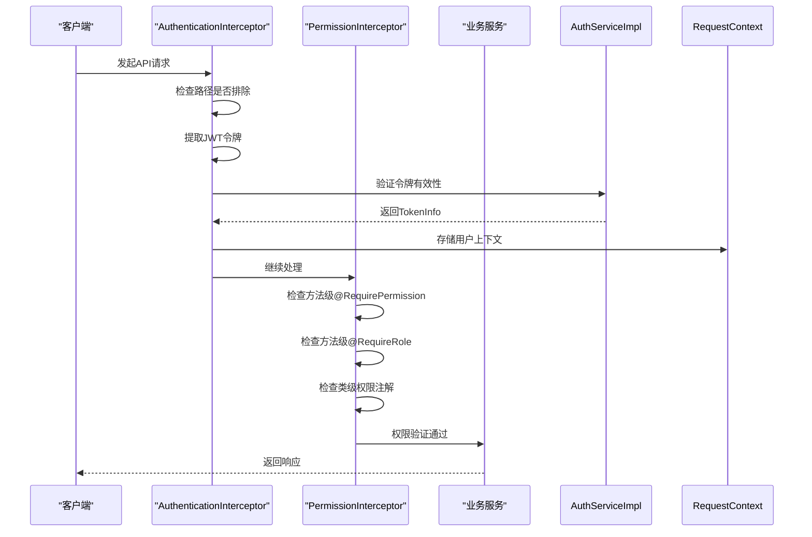
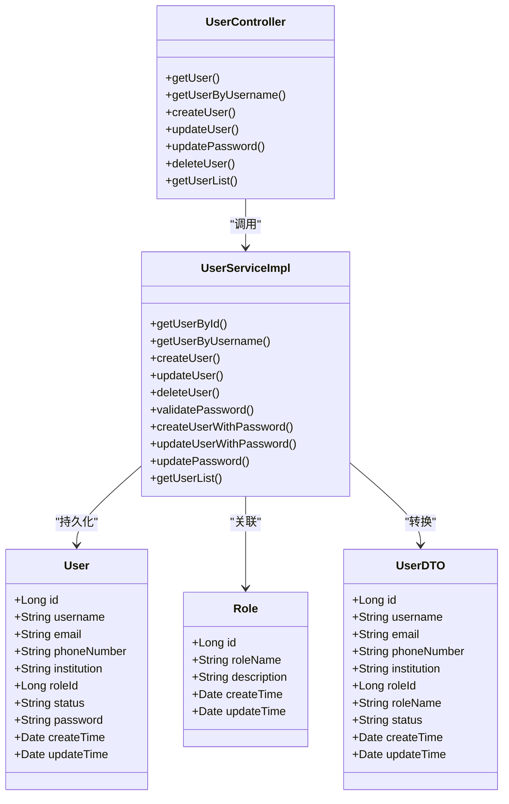
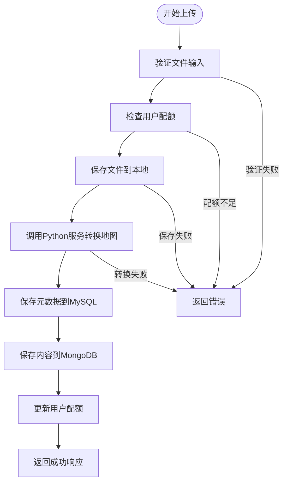
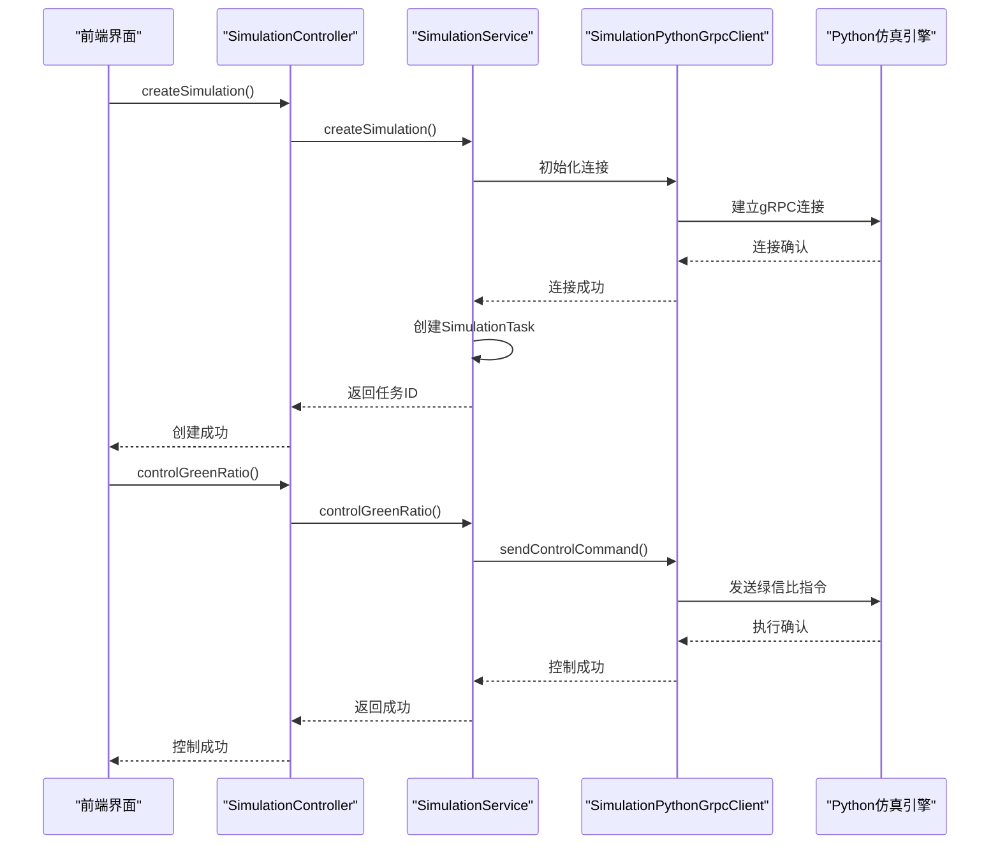
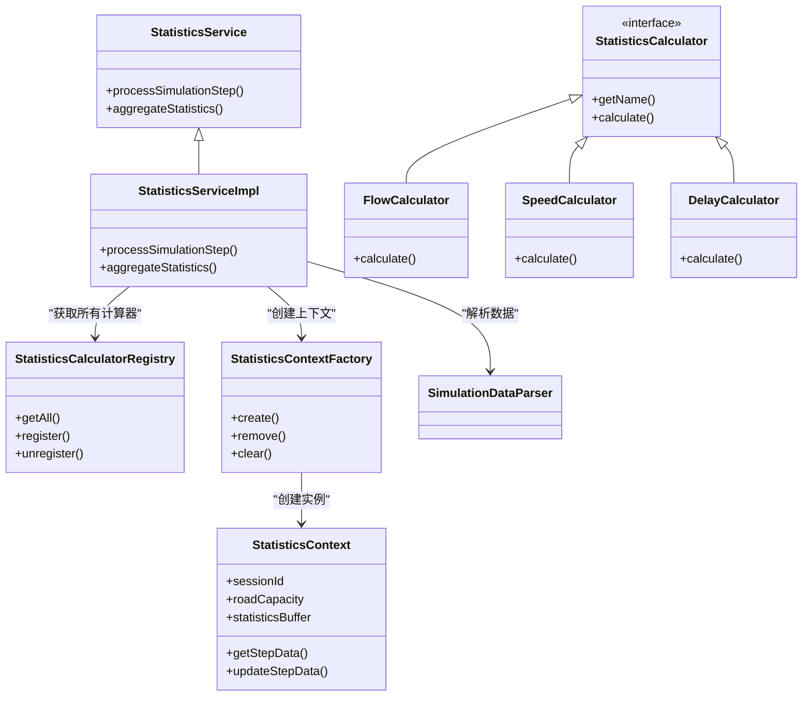
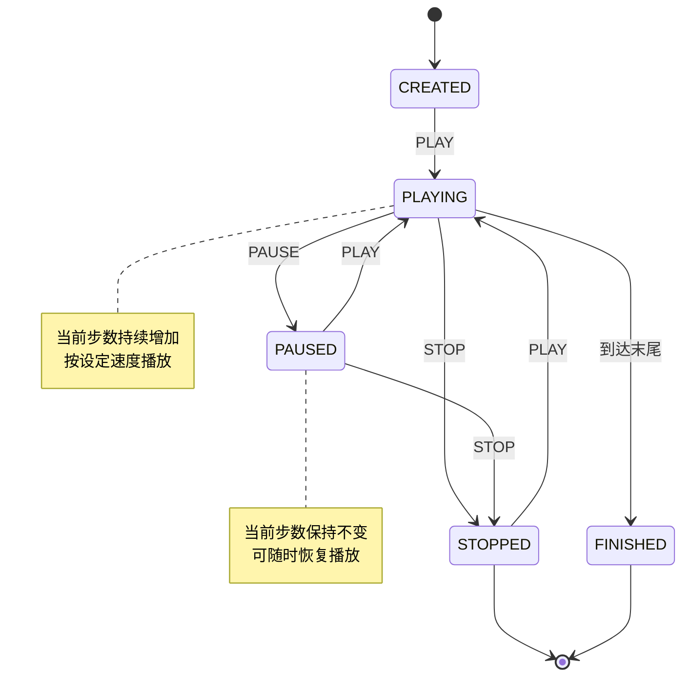

# 核心功能

<cite>
**本文档引用的文件**  
- [AuthController.java](file://plugins/plugin-auth/src/main/java/com/traffic/sim/plugin/auth/controller/AuthController.java)
- [AuthServiceImpl.java](file://plugins/plugin-auth/src/main/java/com/traffic/sim/plugin/auth/service/AuthServiceImpl.java)
- [AuthenticationInterceptor.java](file://plugins/plugin-auth/src/main/java/com/traffic/sim/plugin/auth/interceptor/AuthenticationInterceptor.java)
- [PermissionInterceptor.java](file://plugins/plugin-auth/src/main/java/com/traffic/sim/plugin/auth/interceptor/PermissionInterceptor.java)
- [JwtTokenService.java](file://plugins/plugin-auth/src/main/java/com/traffic/sim/plugin/auth/service/JwtTokenService.java)
- [UserController.java](file://plugins/plugin-user/src/main/java/com/traffic/sim/plugin/user/controller/UserController.java)
- [UserServiceImpl.java](file://plugins/plugin-user/src/main/java/com/traffic/sim/plugin/user/service/UserServiceImpl.java)
- [MapController.java](file://plugins/plugin-map/src/main/java/com/traffic/sim/plugin/map/controller/MapController.java)
- [MapServiceImpl.java](file://plugins/plugin-map/src/main/java/com/traffic/sim/plugin/map/service/MapServiceImpl.java)
- [SimulationController.java](file://plugins/plugin-simulation/src/main/java/com/traffic/sim/plugin/simulation/controller/SimulationController.java)
- [StatisticsServiceImpl.java](file://plugins/plugin-statistics/src/main/java/com/traffic/sim/plugin/statistics/service/StatisticsServiceImpl.java)
- [StatisticsContextFactory.java](file://plugins/plugin-statistics/src/main/java/com/traffic/sim/plugin/statistics/service/StatisticsContextFactory.java)
- [ReplayTask.java](file://plugins/plugin-engine-replay/src/main/java/com/traffic/sim/plugin/replay/entity/ReplayTask.java)
- [ReplayDataRepository.java](file://plugins/plugin-engine-replay/src/main/java/com/traffic/sim/plugin/replay/repository/ReplayDataRepository.java)
- [ReplayServiceImpl.java](file://plugins/plugin-engine-replay/src/main/java/com/traffic/sim/plugin/replay/service/ReplayServiceImpl.java)
</cite>

## 目录
1. [认证授权功能](#认证授权功能)
2. [用户管理功能](#用户管理功能)
3. [地图管理功能](#地图管理功能)
4. [仿真任务功能](#仿真任务功能)
5. [实时统计功能](#实时统计功能)
6. [数据回放功能](#数据回放功能)

## 认证授权功能

该功能模块实现了基于JWT的认证授权体系，包含令牌生成、验证流程以及拦截器协同工作机制。

**认证流程**：
1. 用户通过`AuthController`发起登录请求
2. `AuthServiceImpl`验证用户凭据并创建`TokenInfo`
3. `JwtTokenService`生成访问令牌和刷新令牌
4. 令牌存储在`refreshTokenStore`中，访问令牌返回给客户端

**JWT令牌机制**：
- 访问令牌有效期由`authProperties.getJwt().getExpire()`配置
- 刷新令牌有效期更长，用于获取新的访问令牌
- 令牌包含用户ID、用户名、角色、权限列表和过期时间等声明
- 使用HMAC-SHA算法进行签名验证

**拦截器协同工作**：
`AuthenticationInterceptor`和`PermissionInterceptor`共同保护API端点：

**拦截器执行顺序**：
1. `AuthenticationInterceptor.preHandle()`首先执行
   - 检查请求路径是否在排除列表中（如登录、注册等）
   - 从Authorization头或请求参数中提取JWT令牌
   - 调用`AuthService.validateToken()`验证令牌
   - 将用户信息存入`RequestContext`请求上下文
2. `PermissionInterceptor.preHandle()`随后执行
   - 从`RequestContext`获取当前用户信息
   - 检查方法级别的`@RequirePermission`和`@RequireRole`注解
   - 检查类级别的权限和角色注解
   - 验证用户是否具有所需权限或角色

**登出机制**：
- 访问令牌被添加到`invalidatedTokens`失效令牌映射中
- 刷新令牌从`refreshTokenStore`中移除
- 后续使用已失效令牌的请求将被拒绝

**Section sources**
- [AuthController.java](file://plugins/plugin-auth/src/main/java/com/traffic/sim/plugin/auth/controller/AuthController.java#L1-L118)
- [AuthServiceImpl.java](file://plugins/plugin-auth/src/main/java/com/traffic/sim/plugin/auth/service/AuthServiceImpl.java#L1-L263)
- [AuthenticationInterceptor.java](file://plugins/plugin-auth/src/main/java/com/traffic/sim/plugin/auth/interceptor/AuthenticationInterceptor.java#L1-L125)
- [PermissionInterceptor.java](file://plugins/plugin-auth/src/main/java/com/traffic/sim/plugin/auth/interceptor/PermissionInterceptor.java#L1-L134)
- [JwtTokenService.java](file://plugins/plugin-auth/src/main/java/com/traffic/sim/plugin/auth/service/JwtTokenService.java#L1-L118)

## 用户管理功能

该功能模块实现了完整的用户生命周期管理，包括注册、信息更新和密码管理。

**用户注册流程**：
1. 客户端通过`UserController.createUser()`提交注册请求
2. `UserServiceExt.createUserWithPassword()`执行注册逻辑
3. 验证用户名和邮箱的唯一性
4. 对密码进行加密存储
5. 设置默认用户状态和角色
6. 保存用户实体到数据库

**用户信息更新流程**：
1. 客户端通过`UserController.updateUser()`提交更新请求
2. `UserServiceExt.updateUserWithPassword()`执行更新逻辑
3. 验证邮箱的唯一性（如果更新了邮箱）
4. 更新用户基本信息和角色
5. 如果提供了新密码，则更新加密后的密码
6. 保存更新后的用户实体

**密码管理流程**：
- 密码更新通过`UserController.updatePassword()`接口
- `UserServiceExt.updatePassword()`方法负责实际更新
- 新密码经过`PasswordEncoder`加密后存储
- 密码强度验证在`AuthServiceImpl.validatePasswordStrength()`中实现
- 支持最小长度、大小写字母、数字和特殊字符等复杂度要求

**用户查询功能**：
- 支持通过ID或用户名获取单个用户信息
- 提供分页查询用户列表的功能
- 可按用户状态过滤查询结果
- 管理员权限可查询所有用户

**数据模型**：
- `User`实体包含基本信息：用户名、邮箱、手机号、机构、角色ID、状态等
- `UserDTO`作为数据传输对象，包含用户信息及角色名称
- `Role`实体定义系统角色及其权限

**Section sources**
- [UserController.java](file://plugins/plugin-user/src/main/java/com/traffic/sim/plugin/user/controller/UserController.java#L1-L119)
- [UserServiceImpl.java](file://plugins/plugin-user/src/main/java/com/traffic/sim/plugin/user/service/UserServiceImpl.java#L1-L331)

## 地图管理功能

该功能模块实现了地图文件的上传、转换和存储全过程。

**地图上传与转换流程**：
1. 客户端上传地图文件
2. `MapServiceImpl.uploadAndConvertMap()`处理上传请求
3. 验证文件类型和大小限制
4. 检查用户地图配额
5. 保存文件到本地存储
6. 调用Python服务进行地图格式转换
7. 创建地图实体并保存到数据库
8. 更新用户配额信息

**文件存储机制**：
- 文件按用户ID组织存储目录
- 使用UUID生成唯一文件名防止冲突
- 存储路径配置在`MapPluginProperties`中
- 支持的文件类型由`allowedExtensions`配置项定义
- 最大文件大小由`maxFileSize`配置项限制

**地图配额管理**：
- `UserMapQuota`实体跟踪用户的地图使用情况
- `MapQuotaService`负责配额检查和更新
- 每个用户有最大地图数量和总存储空间限制
- 上传新地图时检查配额，删除地图时释放配额

**权限控制**：
- `MapPermissionService`实现地图访问权限检查
- 支持私有、公开和禁用三种地图状态
- 用户只能访问自己创建的私有地图
- 公开地图可供所有用户查看
- 管理员可以禁用违规地图

**数据存储**：
- 地图元数据存储在MySQL数据库的`map_entity`表中
- 地图文件内容存储在MongoDB的`maps`集合中
- `MapRepository`负责MySQL数据访问
- `MongoTemplate`用于MongoDB操作

**Section sources**
- [MapController.java](file://plugins/plugin-map/src/main/java/com/traffic/sim/plugin/map/controller/MapController.java#L1-L155)
- [MapServiceImpl.java](file://plugins/plugin-map/src/main/java/com/traffic/sim/plugin/map/service/MapServiceImpl.java#L1-L395)

## 仿真任务功能

该功能模块实现了与外部Python仿真引擎的gRPC通信机制。

**gRPC通信架构**：
- `SimulationPythonGrpcClient`作为gRPC客户端
- 与Python仿真引擎建立长连接
- 使用Protocol Buffer定义通信协议
- 支持同步和异步调用模式

**任务创建流程**：
1. 客户端通过`SimulationController.createSimulation()`创建任务
2. 验证会话ID的有效性
3. `SimulationService.createSimulation()`处理创建请求
4. 初始化gRPC客户端连接
5. 发送仿真初始化指令
6. 创建`SimulationTask`实体并持久化
7. 返回任务ID给客户端

**实时控制功能**：
- 绿信比控制通过`controlGreenRatio()`接口实现
- 客户端发送绿信比调整请求
- 请求包含目标绿信比值和仿真上下文
- 通过gRPC通道实时发送控制指令
- 引擎动态调整信号灯配时

**会话管理**：
- 使用Cookie中的`id`作为会话标识
- 每个会话对应一个仿真任务
- 会话ID用于关联用户操作和仿真实例
- 会话超时机制确保资源及时释放

**错误处理**：
- gRPC调用异常被捕获并转换为业务异常
- 网络连接问题触发重连机制
- 仿真引擎故障返回特定错误码
- 客户端收到结构化错误响应

**Section sources**
- [SimulationController.java](file://plugins/plugin-simulation/src/main/java/com/traffic/sim/plugin/simulation/controller/SimulationController.java#L1-L134)

## 实时统计功能

该功能模块实现了基于策略模式的统计计算和动态计算器选择机制。

**策略模式实现**：
- `StatisticsCalculator`接口定义统计计算契约
- 多个具体实现类：`FlowCalculator`、`SpeedCalculator`、`DelayCalculator`等
- `StatisticsCalculatorRegistry`管理所有计算器实例
- 运行时动态注册和发现计算器

**统计上下文管理**：
- `StatisticsContextFactory`负责创建和管理`StatisticsContext`
- 上下文按会话ID缓存，避免重复创建
- 包含道路容量、历史数据缓冲区等共享状态
- 支持上下文的创建、获取、移除和清空操作

**统计处理流程**：
1. 接收仿真步骤数据
2. `SimulationDataParser`解析原始数据
3. 从缓存获取上一步数据用于差值计算
4. `StatisticsContextFactory`创建或获取上下文
5. 遍历所有注册的计算器并执行计算
6. 合并各计算器的结果
7. 构建标准化的`StatisticsData`响应
8. 更新步骤数据缓存

**计算器类型**：
- `FlowCalculator`：计算交通流量和通行量
- `SpeedCalculator`：计算平均速度和速度分布
- `DelayCalculator`：计算车辆延误时间
- `QueueCalculator`：计算排队长度和密度
- `StopCalculator`：计算停车次数和时间
- `AccelerationCalculator`：计算加速度变化
- `InOutCalculator`：计算区域内外车辆数

**Section sources**
- [StatisticsServiceImpl.java](file://plugins/plugin-statistics/src/main/java/com/traffic/sim/plugin/statistics/service/StatisticsServiceImpl.java#L1-L195)
- [StatisticsContextFactory.java](file://plugins/plugin-statistics/src/main/java/com/traffic/sim/plugin/statistics/service/StatisticsContextFactory.java#L1-L49)

## 数据回放功能

该功能模块实现了回放任务的生命周期管理和历史数据存储机制。

**回放任务生命周期**：
- **CREATED**：任务创建，准备就绪
- **PLAYING**：正在播放回放数据
- **PAUSED**：播放已暂停，可恢复
- **STOPPED**：已停止，可重新开始
- **FINISHED**：播放完成，到达末尾

**任务控制操作**：
- **PLAY**：开始或恢复播放
- **PAUSE**：暂停当前播放
- **STOP**：停止播放并重置到起始位置
- **SEEK**：跳转到指定步数位置
- **SET_SPEED**：设置播放速度（倍速）

**数据存储机制**：
- `ReplayTask`实体存储任务元数据
- `ReplayDataDocument`存储具体的回放步骤数据
- 任务元数据存储在MySQL的`replay_task`表中
- 回放数据存储在MongoDB的`replay_data`集合中
- 支持按任务ID和步数范围查询数据

**服务层关键逻辑**：
- `ReplayServiceImpl.createReplayTask()`：创建新回放任务
- `ReplayServiceImpl.getReplayData()`：获取指定范围的回放数据
- `ReplayServiceImpl.controlReplay()`：执行播放控制命令
- `ReplayServiceImpl.deleteReplayTask()`：删除回放任务及关联数据

**权限验证**：
- 所有操作都验证用户对任务的所有权
- 使用`findByTaskIdAndUserId()`确保用户只能访问自己的任务
- 删除任务时同时清理MongoDB中的回放数据

**Section sources**
- [ReplayTask.java](file://plugins/plugin-engine-replay/src/main/java/com/traffic/sim/plugin/replay/entity/ReplayTask.java#L1-L102)
- [ReplayDataRepository.java](file://plugins/plugin-engine-replay/src/main/java/com/traffic/sim/plugin/replay/repository/ReplayDataRepository.java#L1-L41)
- [ReplayServiceImpl.java](file://plugins/plugin-engine-replay/src/main/java/com/traffic/sim/plugin/replay/service/ReplayServiceImpl.java#L1-L206)