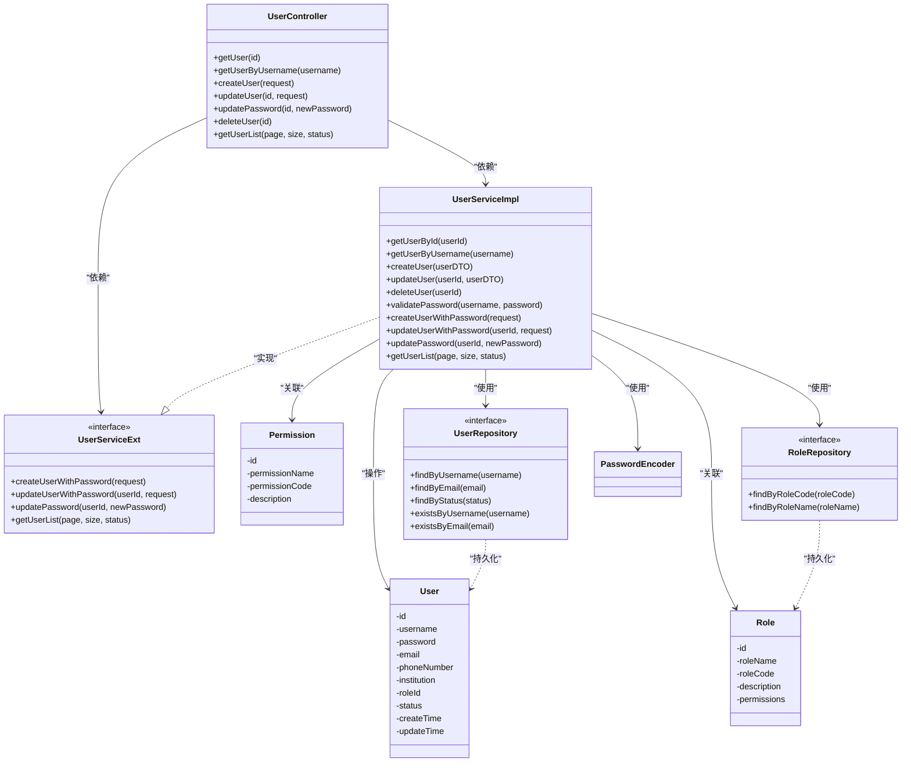
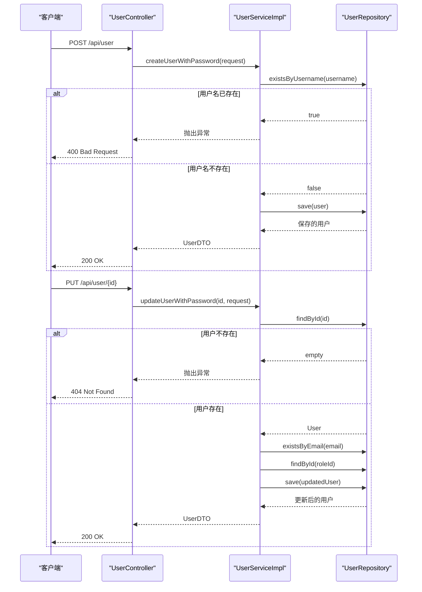
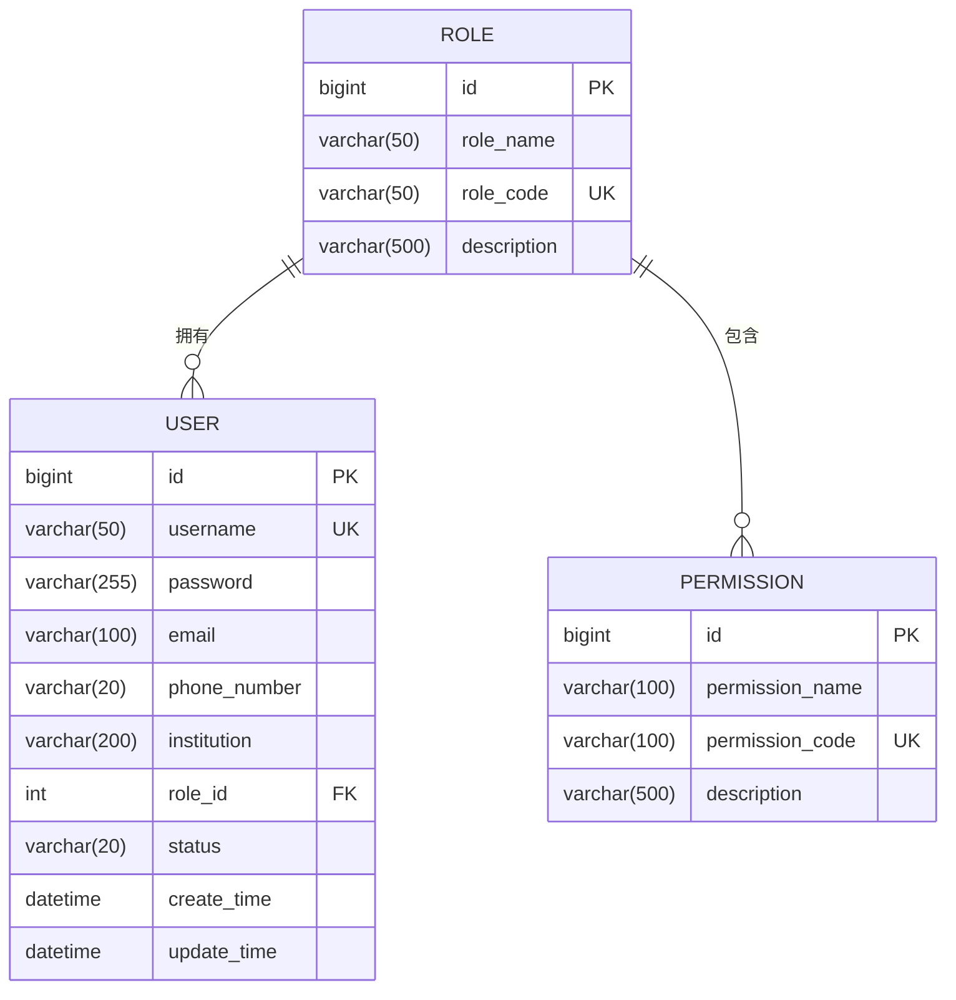
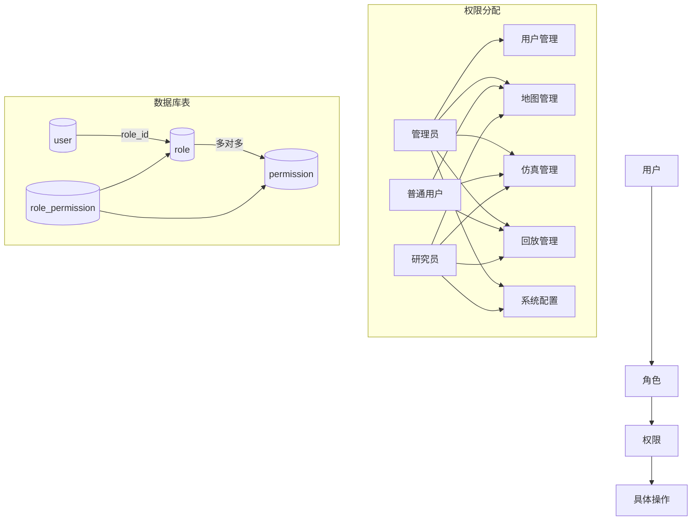
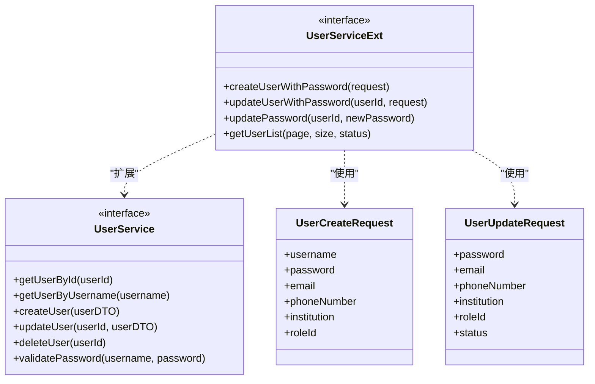
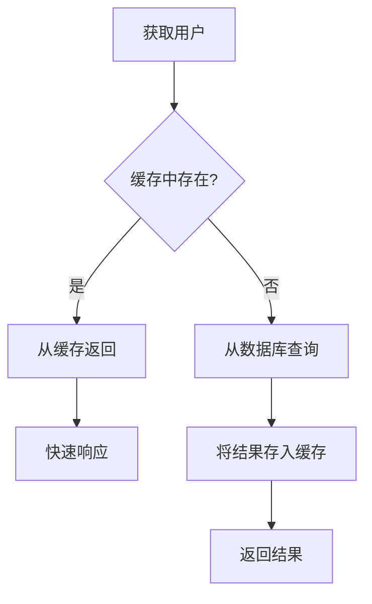

# 用户管理

<cite>
**本文档引用文件**  
- [UserController.java](file://plugins/plugin-user/src/main/java/com/traffic/sim/plugin/user/controller/UserController.java)
- [UserServiceImpl.java](file://plugins/plugin-user/src/main/java/com/traffic/sim/plugin/user/service/UserServiceImpl.java)
- [User.java](file://plugins/plugin-user/src/main/java/com/traffic/sim/plugin/user/entity/User.java)
- [Role.java](file://plugins/plugin-user/src/main/java/com/traffic/sim/plugin/user/entity/Role.java)
- [Permission.java](file://plugins/plugin-user/src/main/java/com/traffic/sim/plugin/user/entity/Permission.java)
- [UserServiceExt.java](file://plugins/plugin-user/src/main/java/com/traffic/sim/plugin/user/service/UserServiceExt.java)
- [UserCreateRequest.java](file://plugins/plugin-user/src/main/java/com/traffic/sim/plugin/user/dto/UserCreateRequest.java)
- [UserUpdateRequest.java](file://plugins/plugin-user/src/main/java/com/traffic/sim/plugin/user/dto/UserUpdateRequest.java)
- [UserRepository.java](file://plugins/plugin-user/src/main/java/com/traffic/sim/plugin/user/repository/UserRepository.java)
- [RoleRepository.java](file://plugins/plugin-user/src/main/java/com/traffic/sim/plugin/user/repository/RoleRepository.java)
- [UserStatus.java](file://traffic-sim-common/src/main/java/com/traffic/sim/common/constant/UserStatus.java)
- [UserDTO.java](file://traffic-sim-common/src/main/java/com/traffic/sim/common/dto/UserDTO.java)
- [init.sql](file://infrastructure/init.sql)
- [ErrorCode.java](file://traffic-sim-common/src/main/java/com/traffic/sim/common/constant/ErrorCode.java)
- [ApiResponse.java](file://traffic-sim-common/src/main/java/com/traffic/sim/common/response/ApiResponse.java)
</cite>

## 目录
1. [简介](#简介)
2. [核心组件](#核心组件)
3. [REST API 接口说明](#rest-api-接口说明)
4. [用户实体与数据库映射](#用户实体与数据库映射)
5. [权限体系设计](#权限体系设计)
6. [扩展服务设计意图](#扩展服务设计意图)
7. [使用示例](#使用示例)
8. [常见问题处理](#常见问题处理)
9. [性能优化建议](#性能优化建议)
10. [总结](#总结)

## 简介

本系统提供完整的用户生命周期管理功能，支持用户的创建、更新、查询和删除操作。通过 `UserController` 暴露 RESTful 接口，`UserServiceImpl` 实现核心业务逻辑，包括密码加密存储、状态变更和权限分配。用户信息持久化到 MySQL 数据库，通过 JPA 进行数据访问。系统采用角色-权限模型实现细粒度的访问控制。

## 核心组件

系统用户管理模块由多个核心组件构成，包括控制器、服务实现、数据访问层和实体类，共同完成用户全生命周期的管理。



**图示来源**  
- [UserController.java](file://plugins/plugin-user/src/main/java/com/traffic/sim/plugin/user/controller/UserController.java)
- [UserServiceImpl.java](file://plugins/plugin-user/src/main/java/com/traffic/sim/plugin/user/service/UserServiceImpl.java)
- [UserServiceExt.java](file://plugins/plugin-user/src/main/java/com/traffic/sim/plugin/user/service/UserServiceExt.java)
- [User.java](file://plugins/plugin-user/src/main/java/com/traffic/sim/plugin/user/entity/User.java)
- [Role.java](file://plugins/plugin-user/src/main/java/com/traffic/sim/plugin/user/entity/Role.java)
- [Permission.java](file://plugins/plugin-user/src/main/java/com/traffic/sim/plugin/user/entity/Permission.java)
- [UserRepository.java](file://plugins/plugin-user/src/main/java/com/traffic/sim/plugin/user/repository/UserRepository.java)
- [RoleRepository.java](file://plugins/plugin-user/src/main/java/com/traffic/sim/plugin/user/repository/RoleRepository.java)

**本节来源**  
- [UserController.java](file://plugins/plugin-user/src/main/java/com/traffic/sim/plugin/user/controller/UserController.java)
- [UserServiceImpl.java](file://plugins/plugin-user/src/main/java/com/traffic/sim/plugin/user/service/UserServiceImpl.java)
- [User.java](file://plugins/plugin-user/src/main/java/com/traffic/sim/plugin/user/entity/User.java)
- [Role.java](file://plugins/plugin-user/src/main/java/com/traffic/sim/plugin/user/entity/Role.java)
- [Permission.java](file://plugins/plugin-user/src/main/java/com/traffic/sim/plugin/user/entity/Permission.java)

## REST API 接口说明

`UserController` 类暴露了以下 RESTful 接口用于用户管理：



**图示来源**  
- [UserController.java](file://plugins/plugin-user/src/main/java/com/traffic/sim/plugin/user/controller/UserController.java)
- [UserServiceImpl.java](file://plugins/plugin-user/src/main/java/com/traffic/sim/plugin/user/service/UserServiceImpl.java)
- [UserRepository.java](file://plugins/plugin-user/src/main/java/com/traffic/sim/plugin/user/repository/UserRepository.java)

**本节来源**  
- [UserController.java](file://plugins/plugin-user/src/main/java/com/traffic/sim/plugin/user/controller/UserController.java)

### 接口详情

| 接口路径 | HTTP方法 | 功能描述 | 请求参数 | 响应类型 |
|---------|---------|---------|---------|---------|
| `/api/user/{id}` | GET | 根据用户ID获取用户信息 | `id`: 用户ID（路径参数） | `ApiResponse<UserDTO>` |
| `/api/user/username/{username}` | GET | 根据用户名获取用户信息 | `username`: 用户名（路径参数） | `ApiResponse<UserDTO>` |
| `/api/user` | POST | 创建新用户 | `UserCreateRequest`（请求体） | `ApiResponse<UserDTO>` |
| `/api/user/{id}` | PUT | 更新用户信息 | `id`: 用户ID（路径参数）<br>`UserUpdateRequest`（请求体） | `ApiResponse<UserDTO>` |
| `/api/user/{id}/password` | PUT | 更新用户密码 | `id`: 用户ID（路径参数）<br>`newPassword`: 新密码（查询参数） | `ApiResponse<String>` |
| `/api/user/{id}` | DELETE | 删除用户 | `id`: 用户ID（路径参数） | `ApiResponse<String>` |
| `/api/user/list` | GET | 分页获取用户列表 | `page`: 页码（查询参数，默认1）<br>`size`: 每页数量（查询参数，默认10）<br>`status`: 用户状态（查询参数，可选） | `ApiResponse<PageResult<UserDTO>>` |

## 用户实体与数据库映射

`User` 实体类与数据库中的 `user` 表进行映射，定义了用户的核心属性和约束。



**图示来源**  
- [User.java](file://plugins/plugin-user/src/main/java/com/traffic/sim/plugin/user/entity/User.java)
- [Role.java](file://plugins/plugin-user/src/main/java/com/traffic/sim/plugin/user/entity/Role.java)
- [Permission.java](file://plugins/plugin-user/src/main/java/com/traffic/sim/plugin/user/entity/Permission.java)
- [init.sql](file://infrastructure/init.sql)

**本节来源**  
- [User.java](file://plugins/plugin-user/src/main/java/com/traffic/sim/plugin/user/entity/User.java)
- [init.sql](file://infrastructure/init.sql)

### 字段约束说明

| 字段名 | 数据类型 | 约束 | 说明 |
|-------|--------|------|------|
| id | BIGINT | 主键，自增 | 用户唯一标识 |
| username | VARCHAR(50) | 非空，唯一 | 用户名，登录凭证 |
| password | VARCHAR(255) | 非空 | 加密存储的密码 |
| email | VARCHAR(100) | 可为空 | 用户邮箱 |
| phone_number | VARCHAR(20) | 可为空 | 用户电话 |
| institution | VARCHAR(200) | 可为空 | 用户所属机构 |
| role_id | INT | 可为空，外键 | 用户角色ID |
| status | VARCHAR(20) | 非空，默认'NORMAL' | 用户状态 |
| create_time | DATETIME | 非空 | 创建时间 |
| update_time | DATETIME | 可为空 | 更新时间 |

实体类通过 JPA 注解实现与数据库表的映射：
- `@Entity` 标识为实体类
- `@Table(name = "user")` 指定对应的数据表
- `@Id` 和 `@GeneratedValue` 定义主键策略
- `@Column` 定义字段属性和约束
- `@PrePersist` 和 `@PreUpdate` 注解方法在保存和更新时自动设置时间戳

## 权限体系设计

系统采用基于角色的访问控制（RBAC）模型，通过 `Role` 和 `Permission` 实体实现权限管理。



**图示来源**  
- [Role.java](file://plugins/plugin-user/src/main/java/com/traffic/sim/plugin/user/entity/Role.java)
- [Permission.java](file://plugins/plugin-user/src/main/java/com/traffic/sim/plugin/user/entity/Permission.java)
- [init.sql](file://infrastructure/init.sql)

**本节来源**  
- [Role.java](file://plugins/plugin-user/src/main/java/com/traffic/sim/plugin/user/entity/Role.java)
- [Permission.java](file://plugins/plugin-user/src/main/java/com/traffic/sim/plugin/user/entity/Permission.java)
- [init.sql](file://infrastructure/init.sql)

### 角色与权限关系

系统预定义了三种角色及其权限：

| 角色 | 角色代码 | 描述 | 拥有权限 |
|------|---------|------|---------|
| 管理员 | ADMIN | 系统管理员，拥有所有权限 | 用户管理、地图管理、仿真管理、回放管理、系统配置 |
| 普通用户 | USER | 普通用户，拥有基本权限 | 地图管理、仿真管理、回放管理 |
| 研究员 | RESEARCHER | 研究员，拥有高级权限 | 地图管理、仿真管理、回放管理、系统配置 |

权限通过 `role_permission` 关联表进行管理，实现了角色与权限的多对多关系。这种设计允许灵活地调整角色权限，而无需修改代码。

## 扩展服务设计意图

`UserServiceExt` 接口及其实现 `UserServiceImpl` 中的相关方法提供了扩展功能，解决了核心服务接口的局限性。



**图示来源**  
- [UserServiceExt.java](file://plugins/plugin-user/src/main/java/com/traffic/sim/plugin/user/service/UserServiceExt.java)
- [UserServiceImpl.java](file://plugins/plugin-user/src/main/java/com/traffic/sim/plugin/user/service/UserServiceImpl.java)
- [UserCreateRequest.java](file://plugins/plugin-user/src/main/java/com/traffic/sim/plugin/user/dto/UserCreateRequest.java)
- [UserUpdateRequest.java](file://plugins/plugin-user/src/main/java/com/traffic/sim/plugin/user/dto/UserUpdateRequest.java)

**本节来源**  
- [UserServiceExt.java](file://plugins/plugin-user/src/main/java/com/traffic/sim/plugin/user/service/UserServiceExt.java)
- [UserServiceImpl.java](file://plugins/plugin-user/src/main/java/com/traffic/sim/plugin/user/service/UserServiceImpl.java)
- [UserCreateRequest.java](file://plugins/plugin-user/src/main/java/com/traffic/sim/plugin/user/dto/UserCreateRequest.java)
- [UserUpdateRequest.java](file://plugins/plugin-user/src/main/java/com/traffic/sim/plugin/user/dto/UserUpdateRequest.java)

### 设计目的

1. **密码处理分离**：核心 `UserService` 接口的 `createUser` 和 `updateUser` 方法使用 `UserDTO`，而 `UserDTO` 不包含密码字段（出于安全考虑）。`UserServiceExt` 提供了专门处理密码的方法，实现了关注点分离。

2. **请求参数优化**：`UserCreateRequest` 和 `UserUpdateRequest` DTO 类专门用于创建和更新操作，包含了业务逻辑所需的字段，并添加了 JSR-303 验证注解，确保输入数据的有效性。

3. **分页查询支持**：`getUserList` 方法提供了分页查询功能，支持按状态过滤，满足前端展示需求，避免一次性加载过多数据。

4. **单一职责原则**：将密码更新等特定操作分离到独立方法中，遵循单一职责原则，使代码更易于维护和测试。

## 使用示例

以下示例展示如何通过 API 进行用户 CRUD 操作。

```mermaid
sequenceDiagram
participant Frontend as "前端应用"
participant UserController as "UserController"
participant UserServiceImpl as "UserServiceImpl"
participant UserRepository as "UserRepository"
Frontend->>UserController : POST /api/user
activate UserController
UserController->>UserServiceImpl : createUserWithPassword(request)
activate UserServiceImpl
UserServiceImpl->>UserRepository : existsByUsername(username)
activate UserRepository
UserRepository-->>UserServiceImpl : false
deactivate UserRepository
UserServiceImpl->>UserRepository : save(user)
UserRepository-->>UserServiceImpl : savedUser
deactivate UserRepository
UserServiceImpl-->>UserController : UserDTO
deactivate UserServiceImpl
UserController-->>Frontend : 200 OK {data : user}
deactivate UserController
Frontend->>UserController : GET /api/user/1
activate UserController
UserController->>UserServiceImpl : getUserById(1)
activate UserServiceImpl
UserServiceImpl->>UserRepository : findById(1)
activate UserRepository
UserRepository-->>UserServiceImpl : user
deactivate UserRepository
UserServiceImpl-->>UserController : UserDTO
deactivate UserServiceImpl
UserController-->>Frontend : 200 OK {data : user}
deactivate UserController
Frontend->>UserController : PUT /api/user/1
activate UserController
UserController->>UserServiceImpl : updateUserWithPassword(1, request)
activate UserServiceImpl
UserServiceImpl->>UserRepository : findById(1)
activate UserRepository
UserRepository-->>UserServiceImpl : user
deactivate UserRepository
UserServiceImpl->>UserRepository : save(updatedUser)
UserRepository-->>UserServiceImpl : updatedUser
deactivate UserRepository
UserServiceImpl-->>UserController : UserDTO
deactivate UserServiceImpl
UserController-->>Frontend : 200 OK {data : updatedUser}
deactivate UserController
Frontend->>UserController : DELETE /api/user/1
activate UserController
UserController->>UserServiceImpl : deleteUser(1)
activate UserServiceImpl
UserServiceImpl->>UserRepository : deleteById(1)
activate UserRepository
UserRepository-->>UserServiceImpl : void
deactivate UserRepository
UserServiceImpl-->>UserController : void
deactivate UserServiceImpl
UserController-->>Frontend : 200 OK {msg : "用户删除成功"}
deactivate UserController
```

**图示来源**  
- [UserController.java](file://plugins/plugin-user/src/main/java/com/traffic/sim/plugin/user/controller/UserController.java)
- [UserServiceImpl.java](file://plugins/plugin-user/src/main/java/com/traffic/sim/plugin/user/service/UserServiceImpl.java)
- [UserRepository.java](file://plugins/plugin-user/src/main/java/com/traffic/sim/plugin/user/repository/UserRepository.java)

**本节来源**  
- [UserController.java](file://plugins/plugin-user/src/main/java/com/traffic/sim/plugin/user/controller/UserController.java)
- [UserServiceImpl.java](file://plugins/plugin-user/src/main/java/com/traffic/sim/plugin/user/service/UserServiceImpl.java)

### 创建用户

```http
POST /api/user HTTP/1.1
Content-Type: application/json

{
  "username": "zhangsan",
  "password": "123456",
  "email": "zhangsan@example.com",
  "phoneNumber": "13800138000",
  "institution": "交通研究院",
  "roleId": 1
}
```

成功响应：
```json
{
  "res": "ERR_OK",
  "msg": "用户创建成功",
  "data": {
    "id": 1,
    "username": "zhangsan",
    "email": "zhangsan@example.com",
    "phoneNumber": "13800138000",
    "institution": "交通研究院",
    "roleId": 1,
    "roleName": "管理员",
    "status": "NORMAL",
    "createTime": "2024-01-01T10:00:00",
    "updateTime": "2024-01-01T10:00:00"
  },
  "timestamp": 1704084000000
}
```

### 查询用户列表

```http
GET /api/user/list?page=1&size=10&status=NORMAL HTTP/1.1
```

响应：
```json
{
  "res": "ERR_OK",
  "msg": "ok",
  "data": {
    "list": [
      {
        "id": 1,
        "username": "zhangsan",
        "email": "zhangsan@example.com",
        "phoneNumber": "13800138000",
        "institution": "交通研究院",
        "roleId": 1,
        "roleName": "管理员",
        "status": "NORMAL",
        "createTime": "2024-01-01T10:00:00",
        "updateTime": "2024-01-01T10:00:00"
      }
    ],
    "total": 1,
    "page": 1,
    "size": 10
  },
  "timestamp": 1704084000000
}
```

## 常见问题处理

系统对常见问题进行了妥善处理，确保数据一致性和用户体验。

### 用户名重复

当尝试创建已存在的用户名时，系统会抛出业务异常：

```mermaid
flowchart TD
A[创建用户] --> B{用户名已存在?}
B --> |是| C[抛出 BusinessException]
C --> D[错误码: ERR_EXIST]
D --> E[错误消息: "用户名已存在"]
E --> F[返回 400 Bad Request]
B --> |否| G[继续创建流程]
```

**本节来源**  
- [UserServiceImpl.java](file://plugins/plugin-user/src/main/java/com/traffic/sim/plugin/user/service/UserServiceImpl.java)
- [ErrorCode.java](file://traffic-sim-common/src/main/java/com/traffic/sim/common/constant/ErrorCode.java)

### 非法状态变更

系统定义了有效的用户状态，并在更新时进行验证：

```java
// UserStatus.java 中定义的有效状态
public class UserStatus {
    public static final String NORMAL = "NORMAL";
    public static final String BANNED = "BANNED";
    public static final String BLOCKED = "BLOCKED";
}
```

在更新用户时，如果提供了无效的状态值，系统会保存该值但不会进行特殊处理。建议前端在提交前验证状态值的有效性。

### 角色不存在

当为用户分配不存在的角色ID时，系统会进行验证并抛出异常：

```mermaid
flowchart TD
A[更新用户] --> B{角色ID存在?}
B --> |否| C[抛出 BusinessException]
C --> D[错误码: ERR_NOT_FOUND]
D --> E[错误消息: "角色不存在"]
E --> F[返回 404 Not Found]
B --> |是| G[继续更新流程]
```

**本节来源**  
- [UserServiceImpl.java](file://plugins/plugin-user/src/main/java/com/traffic/sim/plugin/user/service/UserServiceImpl.java)
- [RoleRepository.java](file://plugins/plugin-user/src/main/java/com/traffic/sim/plugin/user/repository/RoleRepository.java)

## 性能优化建议

为提高用户管理功能的性能，建议采取以下优化措施：

### 缓存用户信息

对于频繁访问的用户信息，建议引入缓存机制：



可以使用 Redis 作为缓存层，缓存用户基本信息（不包含密码），设置合理的过期时间（如 30 分钟），并在用户信息更新或删除时及时清除缓存。

### 数据库索引优化

确保数据库表上有适当的索引以支持高效查询：

```sql
-- 用户表索引
CREATE UNIQUE INDEX uk_username ON user(username);
CREATE INDEX idx_role_id ON user(role_id);
CREATE INDEX idx_status ON user(status);
CREATE INDEX idx_create_time ON user(create_time);

-- 角色表索引
CREATE UNIQUE INDEX uk_role_code ON role(role_code);

-- 权限表索引
CREATE UNIQUE INDEX uk_permission_code ON permission(permission_code);
```

这些索引已在 `init.sql` 脚本中定义，确保了按用户名、角色、状态等常用条件查询的性能。

### 分页查询

对于用户列表查询，始终使用分页，避免一次性加载过多数据：

```java
// UserServiceImpl.java 中的分页实现
Pageable pageable = PageRequest.of(pageIndex, pageSize, Sort.by(Sort.Direction.DESC, "createTime"));
Page<User> userPage = userRepository.findAll(pageable);
```

**本节来源**  
- [UserServiceImpl.java](file://plugins/plugin-user/src/main/java/com/traffic/sim/plugin/user/service/UserServiceImpl.java)
- [init.sql](file://infrastructure/init.sql)

## 总结

本文档全面介绍了交通仿真系统的用户管理功能，涵盖了从 REST API 接口到核心业务逻辑，再到数据库映射和权限体系的各个方面。系统通过 `UserController` 提供用户生命周期管理的完整 API，`UserServiceImpl` 实现了密码加密、状态管理等核心逻辑，`UserServiceExt` 扩展了特定场景下的功能需求。基于角色-权限模型的访问控制体系确保了系统的安全性。通过合理的异常处理和潜在的性能优化措施，系统能够稳定高效地支持用户管理需求。