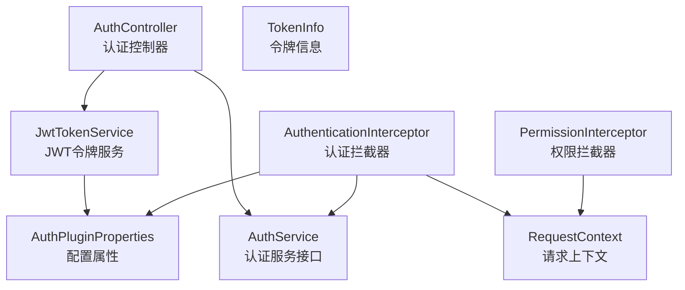
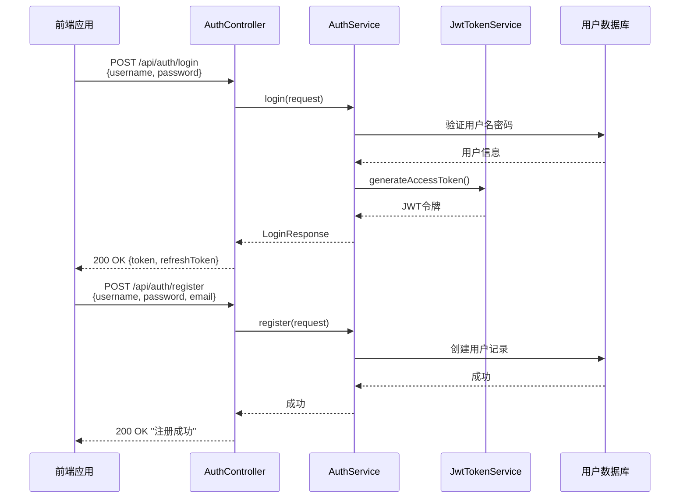
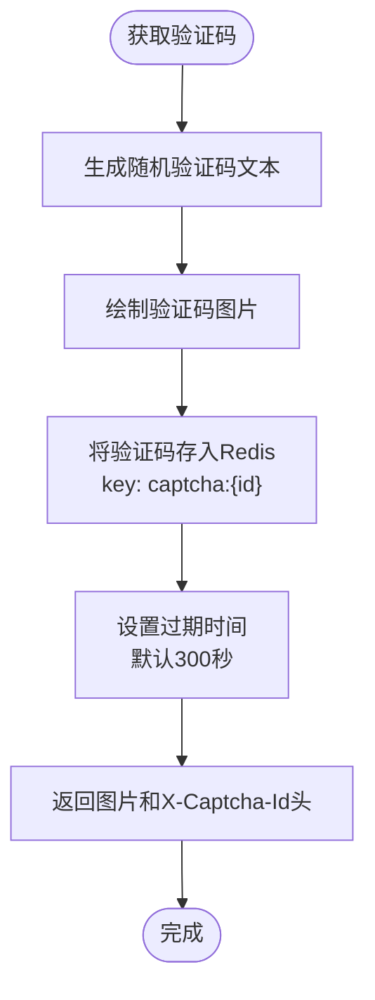
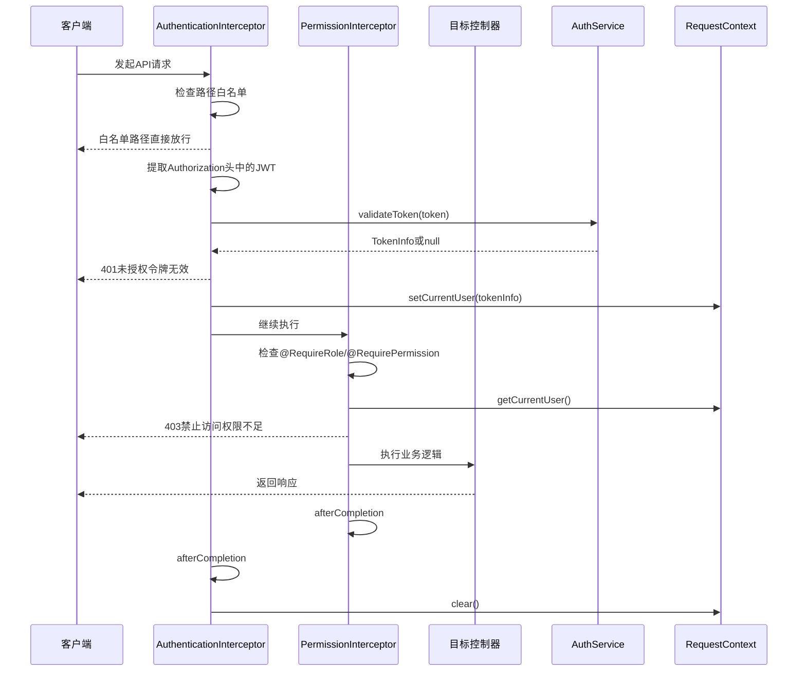
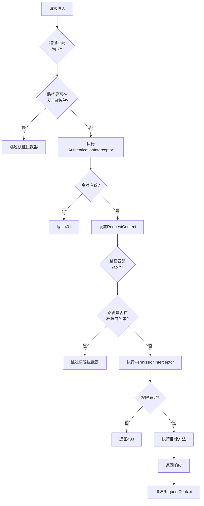
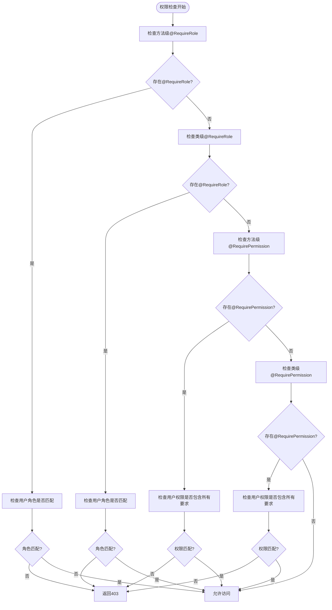
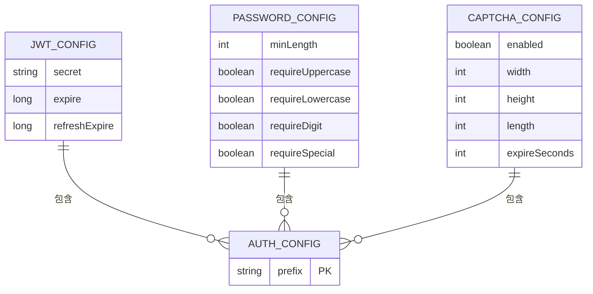
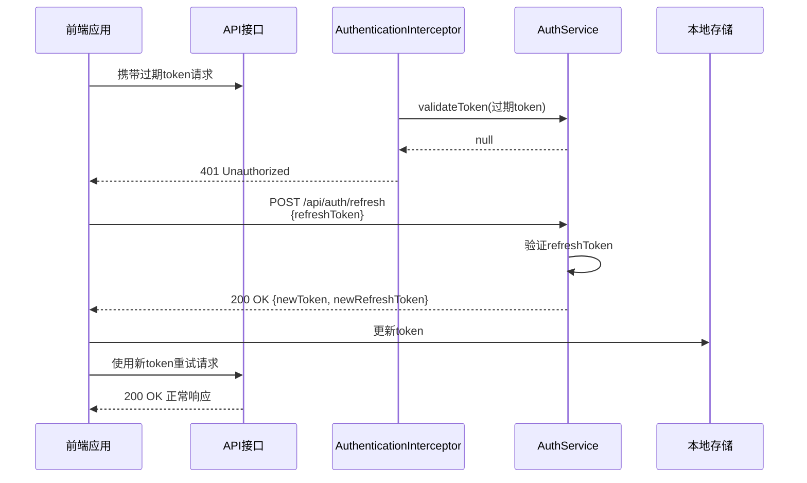

# 认证与授权

<cite>
**本文档中引用的文件**
- [AuthController.java](file://plugins/plugin-auth/src/main/java/com/traffic/sim/plugin/auth/controller/AuthController.java)
- [JwtTokenService.java](file://plugins/plugin-auth/src/main/java/com/traffic/sim/plugin/auth/service/JwtTokenService.java)
- [AuthenticationInterceptor.java](file://plugins/plugin-auth/src/main/java/com/traffic/sim/plugin/auth/interceptor/AuthenticationInterceptor.java)
- [PermissionInterceptor.java](file://plugins/plugin-auth/src/main/java/com/traffic/sim/plugin/auth/interceptor/PermissionInterceptor.java)
- [RequestContext.java](file://plugins/plugin-auth/src/main/java/com/traffic/sim/plugin/auth/util/RequestContext.java)
- [RequireRole.java](file://plugins/plugin-auth/src/main/java/com/traffic/sim/plugin/auth/annotation/RequireRole.java)
- [RequirePermission.java](file://plugins/plugin-auth/src/main/java/com/traffic/sim/plugin/auth/annotation/RequirePermission.java)
- [AuthPluginProperties.java](file://plugins/plugin-auth/src/main/java/com/traffic/sim/plugin/auth/config/AuthPluginProperties.java)
- [AuthPluginAutoConfiguration.java](file://plugins/plugin-auth/src/main/java/com/traffic/sim/plugin/auth/config/AuthPluginAutoConfiguration.java)
- [AuthService.java](file://traffic-sim-common/src/main/java/com/traffic/sim/common/service/AuthService.java)
- [TokenInfo.java](file://traffic-sim-common/src/main/java/com/traffic/sim/common/service/TokenInfo.java)
- [LoginRequest.java](file://traffic-sim-common/src/main/java/com/traffic/sim/common/dto/LoginRequest.java)
- [RegisterRequest.java](file://traffic-sim-common/src/main/java/com/traffic/sim/common/dto/RegisterRequest.java)
</cite>

## 目录
1. [简介](#简介)
2. [核心组件](#核心组件)
3. [认证流程分析](#认证流程分析)
4. [JWT令牌机制](#jwt令牌机制)
5. [拦截器链设计](#拦截器链设计)
6. [权限控制机制](#权限控制机制)
7. [安全配置项](#安全配置项)
8. [常见问题与解决方案](#常见问题与解决方案)
9. [总结](#总结)

## 简介
本系统实现了基于JWT（JSON Web Token）的完整认证与授权体系，为交通模拟平台提供安全的用户身份验证和细粒度权限控制。系统采用Spring Boot拦截器机制构建了双层安全防护：`AuthenticationInterceptor`负责JWT令牌的解析与验证，`PermissionInterceptor`实现基于注解的权限与角色控制。用户通过`AuthController`提供的登录接口获取JWT令牌，后续请求通过Authorization头携带令牌进行认证。整个认证流程与业务逻辑解耦，通过`RequestContext`在请求生命周期内传递用户上下文信息。

## 核心组件

本系统认证与授权功能由多个核心组件协同工作，形成完整的安全体系。

**组件关系图**


**组件来源**
- [AuthController.java](file://plugins/plugin-auth/src/main/java/com/traffic/sim/plugin/auth/controller/AuthController.java)
- [JwtTokenService.java](file://plugins/plugin-auth/src/main/java/com/traffic/sim/plugin/auth/service/JwtTokenService.java)
- [AuthenticationInterceptor.java](file://plugins/plugin-auth/src/main/java/com/traffic/sim/plugin/auth/interceptor/AuthenticationInterceptor.java)
- [PermissionInterceptor.java](file://plugins/plugin-auth/src/main/java/com/traffic/sim/plugin/auth/interceptor/PermissionInterceptor.java)
- [RequestContext.java](file://plugins/plugin-auth/src/main/java/com/traffic/sim/plugin/auth/util/RequestContext.java)
- [AuthPluginProperties.java](file://plugins/plugin-auth/src/main/java/com/traffic/sim/plugin/auth/config/AuthPluginProperties.java)

## 认证流程分析

系统提供了完整的用户认证流程，包括登录、注册、验证码获取和登出功能。

### 登录与注册流程


**流程说明**
1. 用户通过`/api/auth/login`接口提交用户名和密码
2. `AuthController`调用`AuthService`的`login`方法进行认证
3. 认证成功后，生成包含用户信息的JWT访问令牌和刷新令牌
4. 用户通过`/api/auth/register`接口注册新账户
5. 系统对密码进行加密存储，并可配置密码复杂度要求

**代码来源**
- [AuthController.java](file://plugins/plugin-auth/src/main/java/com/traffic/sim/plugin/auth/controller/AuthController.java#L39-L54)
- [LoginRequest.java](file://traffic-sim-common/src/main/java/com/traffic/sim/common/dto/LoginRequest.java)
- [RegisterRequest.java](file://traffic-sim-common/src/main/java/com/traffic/sim/common/dto/RegisterRequest.java)

### 验证码机制
系统实现了图形验证码功能，用于防止暴力破解攻击。



**特性说明**
- 验证码图片通过`/api/auth/captcha`接口获取
- 服务器返回验证码ID在`X-Captcha-Id`响应头中
- 验证码存储在Redis中，具有指定过期时间
- 登录时需同时提供验证码文本和ID进行验证

**代码来源**
- [AuthController.java](file://plugins/plugin-auth/src/main/java/com/traffic/sim/plugin/auth/controller/AuthController.java#L59-L74)
- [CaptchaService.java](file://plugins/plugin-auth/src/main/java/com/traffic/sim/plugin/auth/service/CaptchaService.java)

## JWT令牌机制

系统采用JWT标准实现无状态的用户认证，令牌中包含用户身份信息。

### JWT令牌结构
```mermaid
classDiagram
class TokenInfo {
+String userId
+String username
+String role
+String[] permissions
+Long issuedAt
+Long expiresAt
}
class JwtTokenService {
-AuthPluginProperties authProperties
+String generateAccessToken(TokenInfo)
+String generateRefreshToken(TokenInfo)
+TokenInfo parseToken(String)
+boolean validateToken(String)
}
class AuthPluginProperties {
+Jwt jwt
+Password password
+Captcha captcha
}
class AuthPluginProperties$Jwt {
+String secret
+Long expire
+Long refreshExpire
}
TokenInfo <|-- JwtTokenService : "作为参数"
JwtTokenService --> AuthPluginProperties : "依赖配置"
AuthPluginProperties --> AuthPluginProperties$Jwt : "内部类"
```

**实现细节**
- `JwtTokenService`负责JWT令牌的生成、解析和验证
- 令牌签名使用HMAC-SHA256算法，密钥可配置
- 访问令牌和刷新令牌有不同的过期时间
- 令牌中包含用户ID、用户名、角色和权限列表等声明

**代码来源**
- [JwtTokenService.java](file://plugins/plugin-auth/src/main/java/com/traffic/sim/plugin/auth/service/JwtTokenService.java)
- [TokenInfo.java](file://traffic-sim-common/src/main/java/com/traffic/sim/common/service/TokenInfo.java)
- [AuthPluginProperties.java](file://plugins/plugin-auth/src/main/java/com/traffic/sim/plugin/auth/config/AuthPluginProperties.java)

## 拦截器链设计

系统通过Spring MVC拦截器实现请求的认证与授权控制，采用责任链模式。

### 拦截器执行流程


**拦截器配置**


**代码来源**
- [AuthenticationInterceptor.java](file://plugins/plugin-auth/src/main/java/com/traffic/sim/plugin/auth/interceptor/AuthenticationInterceptor.java)
- [PermissionInterceptor.java](file://plugins/plugin-auth/src/main/java/com/traffic/sim/plugin/auth/interceptor/PermissionInterceptor.java)
- [AuthPluginAutoConfiguration.java](file://plugins/plugin-auth/src/main/java/com/traffic/sim/plugin/auth/config/AuthPluginAutoConfiguration.java)

## 权限控制机制

系统实现了基于注解的细粒度权限控制，支持方法级别和类级别的权限管理。

### 权限注解设计
```mermaid
classDiagram
class RequireRole {
+String[] value()
}
class RequirePermission {
+String[] value()
}
class PermissionInterceptor {
+boolean preHandle()
+boolean hasRole()
+boolean hasPermission()
}
RequireRole <|-- PermissionInterceptor : "通过反射获取"
RequirePermission <|-- PermissionInterceptor : "通过反射获取"
note right of RequireRole
用于标记需要特定角色
的方法或类
@RequireRole("ADMIN")
end note
note right of RequirePermission
用于标记需要特定权限
的方法或类
@RequirePermission({"USER : READ", "USER : WRITE"})
end note
```

**权限检查逻辑**


**使用示例**
```java
@RestController
@RequireRole("ADMIN")
public class AdminController {
    
    @GetMapping("/users")
    @RequirePermission("USER:READ")
    public List<User> getUsers() {
        // 只有ADMIN角色且具有USER:READ权限的用户才能访问
    }
    
    @PostMapping("/users")
    @RequirePermission({"USER:READ", "USER:WRITE"})
    public User createUser(@RequestBody User user) {
        // 需要同时具有USER:READ和USER:WRITE权限
    }
}
```

**代码来源**
- [RequireRole.java](file://plugins/plugin-auth/src/main/java/com/traffic/sim/plugin/auth/annotation/RequireRole.java)
- [RequirePermission.java](file://plugins/plugin-auth/src/main/java/com/traffic/sim/plugin/auth/annotation/RequirePermission.java)
- [PermissionInterceptor.java](file://plugins/plugin-auth/src/main/java/com/traffic/sim/plugin/auth/interceptor/PermissionInterceptor.java)

## 安全配置项

系统提供了灵活的安全配置选项，可通过配置文件进行调整。

### 配置项说明


**配置参数表**
| 配置项 | 默认值 | 说明 |
|--------|--------|------|
| `plugin.auth.jwt.secret` | traffic-sim-jwt-secret-key-change-in-production | JWT签名密钥，生产环境必须修改 |
| `plugin.auth.jwt.expire` | 3600 | 访问令牌过期时间（秒） |
| `plugin.auth.jwt.refreshExpire` | 86400 | 刷新令牌过期时间（秒） |
| `plugin.auth.password.minLength` | 6 | 密码最小长度 |
| `plugin.auth.password.requireUppercase` | false | 是否需要大写字母 |
| `plugin.auth.password.requireLowercase` | false | 是否需要小写字母 |
| `plugin.auth.password.requireDigit` | false | 是否需要数字 |
| `plugin.auth.password.requireSpecial` | false | 是否需要特殊字符 |
| `plugin.auth.captcha.enabled` | true | 是否启用验证码 |
| `plugin.auth.captcha.width` | 120 | 验证码图片宽度 |
| `plugin.auth.captcha.height` | 40 | 验证码图片高度 |
| `plugin.auth.captcha.length` | 4 | 验证码字符长度 |
| `plugin.auth.captcha.expireSeconds` | 300 | 验证码过期时间（秒） |

**白名单路径**
- `/api/auth/login`：登录接口
- `/api/auth/register`：注册接口
- `/api/auth/captcha`：验证码接口
- `/swagger-ui/**`：Swagger文档
- `/v3/api-docs/**`：OpenAPI文档
- `/error`：错误处理

**代码来源**
- [AuthPluginProperties.java](file://plugins/plugin-auth/src/main/java/com/traffic/sim/plugin/auth/config/AuthPluginProperties.java)

## 常见问题与解决方案

### Token过期处理
**问题描述**：访问令牌过期后，客户端需要重新登录，影响用户体验。

**解决方案**：实现刷新令牌机制


### 跨域认证失败
**问题描述**：前端与后端跨域时，Authorization头无法正确传递。

**解决方案**：
1. 后端配置CORS支持Authorization头
```java
@Configuration
public class CorsConfig {
    @Bean
    public CorsConfigurationSource corsConfigurationSource() {
        CorsConfiguration configuration = new CorsConfiguration();
        configuration.setAllowedOriginPatterns(Arrays.asList("*"));
        configuration.setAllowedMethods(Arrays.asList("*"));
        configuration.setAllowedHeaders(Arrays.asList("*"));
        configuration.setExposedHeaders(Arrays.asList("X-Captcha-Id"));
        configuration.setAllowCredentials(true);
        UrlBasedCorsConfigurationSource source = new UrlBasedCorsConfigurationSource();
        source.registerCorsConfiguration("/**", configuration);
        return source;
    }
}
```
2. 前端请求时设置withCredentials
```javascript
axios.interceptors.request.use(config => {
    config.withCredentials = true;
    return config;
});
```

### RequestContext内存泄漏
**问题描述**：ThreadLocal变量未清理可能导致内存泄漏。

**解决方案**：在拦截器的afterCompletion方法中清理
```java
@Override
public void afterCompletion(HttpServletRequest request, 
                          HttpServletResponse response, 
                          Object handler, 
                          Exception ex) {
    // 清理请求上下文
    RequestContext.clear();
}
```

## 总结
本系统的认证与授权机制设计合理，采用了行业标准的JWT技术实现无状态认证，通过Spring拦截器链实现了清晰的职责分离。`AuthenticationInterceptor`和`PermissionInterceptor`分别负责认证和授权，`RequestContext`利用ThreadLocal确保了用户信息在请求处理过程中的线程安全性。基于注解的权限控制提供了灵活的细粒度访问控制能力，而完善的配置体系使得安全策略可以根据实际需求进行调整。整体设计遵循了开闭原则，易于扩展和维护，为交通模拟平台提供了可靠的安全保障。