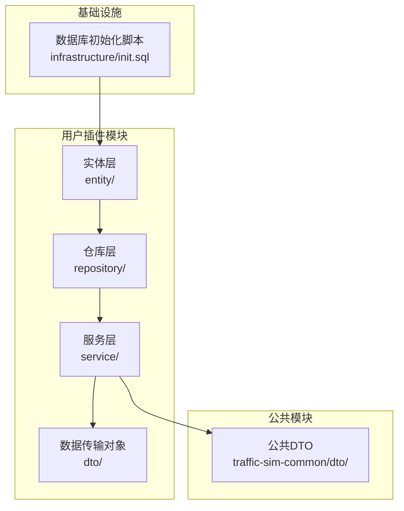
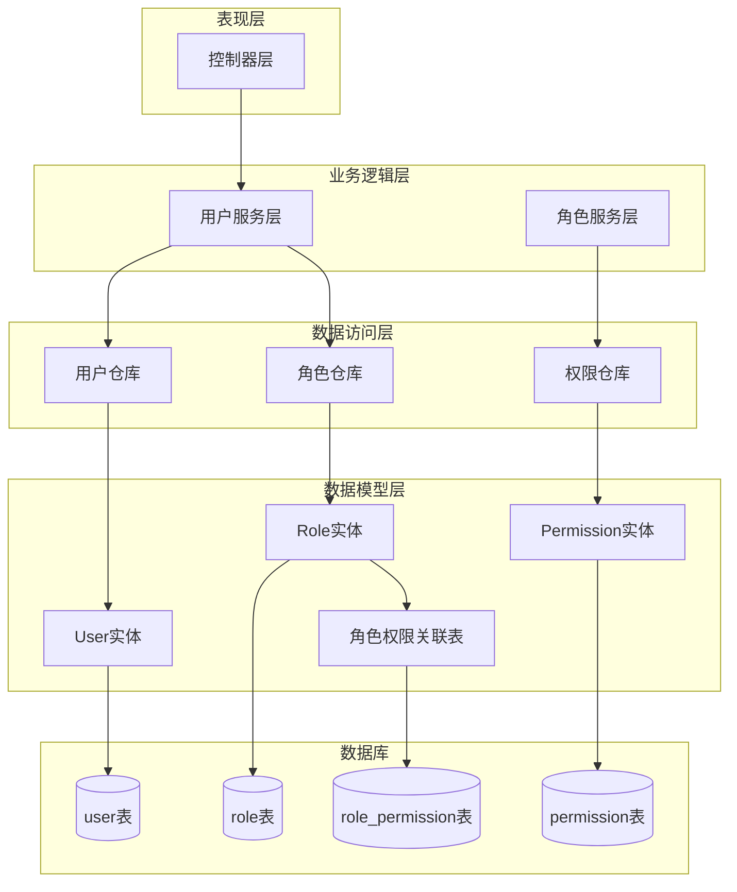
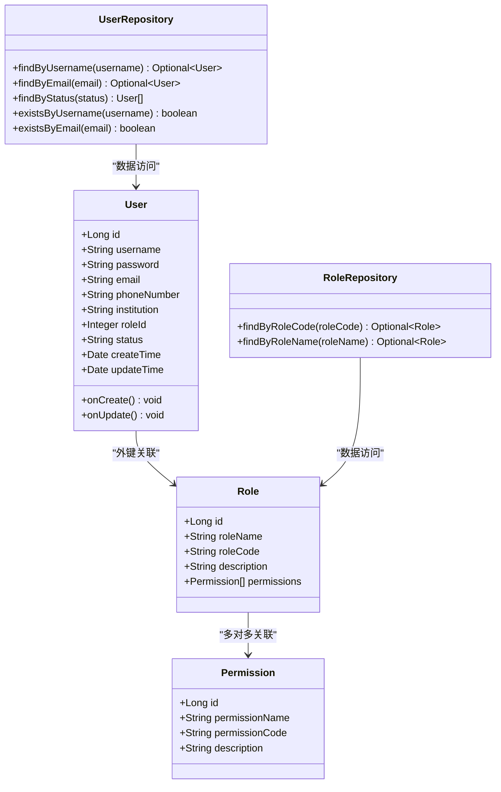
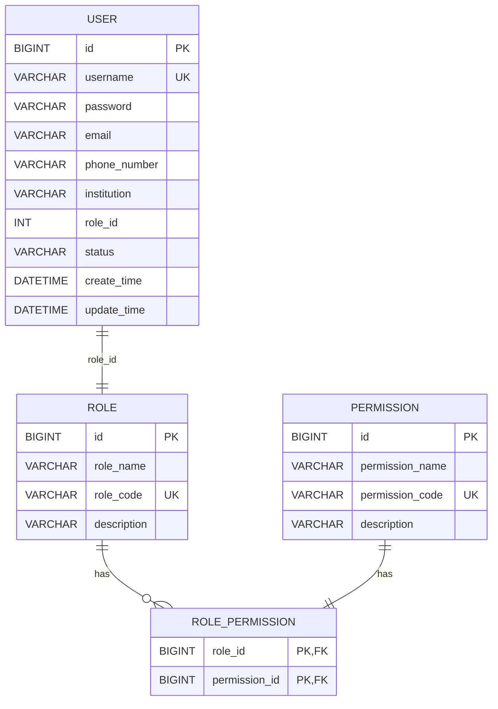
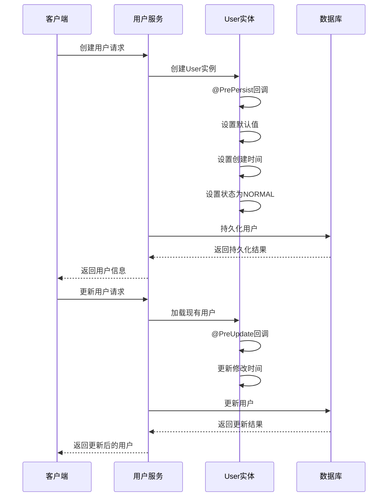
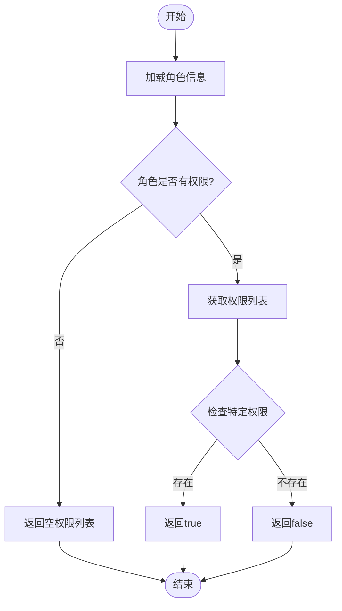
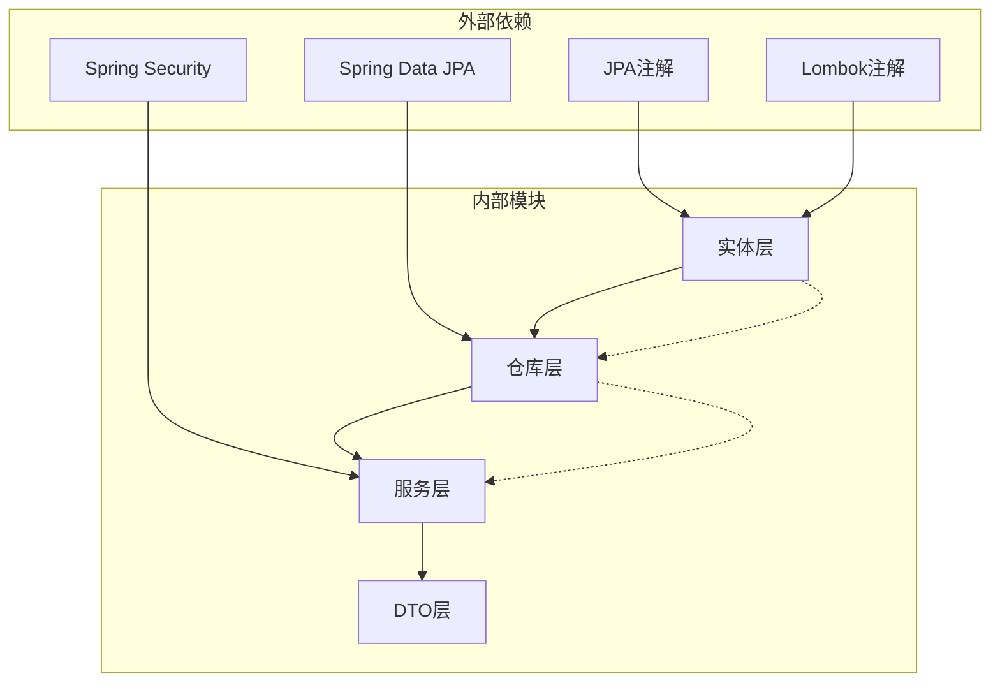
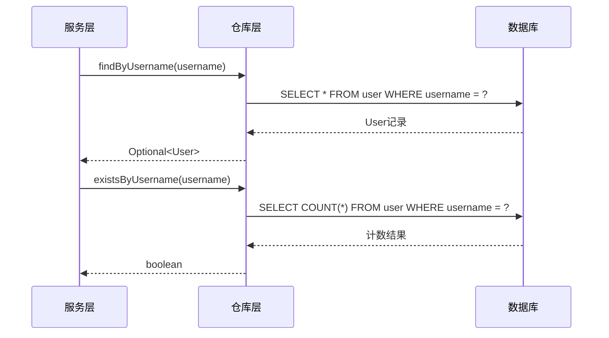

# 用户数据模型

<cite>
**本文档引用的文件**
- [User.java](file://plugins/plugin-user/src/main/java/com/traffic/sim/plugin/user/entity/User.java)
- [Role.java](file://plugins/plugin-user/src/main/java/com/traffic/sim/plugin/user/entity/Role.java)
- [Permission.java](file://plugins/plugin-user/src/main/java/com/traffic/sim/plugin/user/entity/Permission.java)
- [UserRepository.java](file://plugins/plugin-user/src/main/java/com/traffic/sim/plugin/user/repository/UserRepository.java)
- [RoleRepository.java](file://plugins/plugin-user/src/main/java/com/traffic/sim/plugin/user/repository/RoleRepository.java)
- [UserServiceImpl.java](file://plugins/plugin-user/src/main/java/com/traffic/sim/plugin/user/service/UserServiceImpl.java)
- [UserDTO.java](file://traffic-sim-common/src/main/java/com/traffic/sim/common/dto/UserDTO.java)
- [init.sql](file://infrastructure/init.sql)
</cite>

## 目录
1. [简介](#简介)
2. [项目结构](#项目结构)
3. [核心组件](#核心组件)
4. [架构概览](#架构概览)
5. [详细组件分析](#详细组件分析)
6. [依赖关系分析](#依赖关系分析)
7. [性能考虑](#性能考虑)
8. [故障排除指南](#故障排除指南)
9. [结论](#结论)

## 简介

本文档详细说明了交通仿真系统的用户数据模型设计，包括User、Role和Permission三个核心实体类及其相互关系。该模型采用JPA注解进行数据库映射，实现了用户认证授权功能的基础数据结构。文档涵盖了实体字段定义、数据库约束、生命周期管理以及完整的数据流设计。

## 项目结构

用户数据模型位于插件架构的用户插件模块中，采用标准的Maven目录结构组织：

**图表来源**
- [User.java](file://plugins/plugin-user/src/main/java/com/traffic/sim/plugin/user/entity/User.java#L1-L66)
- [Role.java](file://plugins/plugin-user/src/main/java/com/traffic/sim/plugin/user/entity/Role.java#L1-L40)
- [Permission.java](file://plugins/plugin-user/src/main/java/com/traffic/sim/plugin/user/entity/Permission.java#L1-L30)

**章节来源**
- [User.java](file://plugins/plugin-user/src/main/java/com/traffic/sim/plugin/user/entity/User.java#L1-L66)
- [Role.java](file://plugins/plugin-user/src/main/java/com/traffic/sim/plugin/user/entity/Role.java#L1-L40)
- [Permission.java](file://plugins/plugin-user/src/main/java/com/traffic/sim/plugin/user/entity/Permission.java#L1-L30)

## 核心组件

### 用户实体(User)

User实体是用户数据模型的核心，负责存储用户的基本信息和认证凭据。该实体实现了完整的JPA映射配置，包括主键生成策略、字段约束和时间戳管理。

**主要字段特性：**
- **id**: 主键，自增策略
- **username**: 唯一用户名，长度限制50字符
- **password**: 密码字段，长度限制255字符
- **email**: 可选邮箱，长度限制100字符
- **phoneNumber**: 电话号码，长度限制20字符
- **institution**: 所属机构，长度限制200字符
- **roleId**: 外键关联角色ID
- **status**: 用户状态，默认NORMAL
- **createTime**: 创建时间，不可更新
- **updateTime**: 更新时间

### 角色实体(Role)

Role实体代表用户角色概念，支持基于角色的权限控制。该实体通过多对多关系与Permission实体建立关联。

**关键特性：**
- **id**: 主键，自增
- **roleName**: 角色名称，长度限制50字符
- **roleCode**: 唯一角色代码，长度限制50字符
- **description**: 角色描述，长度限制500字符
- **permissions**: 多对多关联的权限集合

### 权限实体(Permission)

Permission实体定义系统中的具体权限项，每个权限都有唯一的标识符。

**字段定义：**
- **id**: 主键，自增
- **permissionName**: 权限名称，长度限制100字符
- **permissionCode**: 唯一权限代码，长度限制100字符
- **description**: 权限描述，长度限制500字符

**章节来源**
- [User.java](file://plugins/plugin-user/src/main/java/com/traffic/sim/plugin/user/entity/User.java#L13-L66)
- [Role.java](file://plugins/plugin-user/src/main/java/com/traffic/sim/plugin/user/entity/Role.java#L13-L38)
- [Permission.java](file://plugins/plugin-user/src/main/java/com/traffic/sim/plugin/user/entity/Permission.java#L11-L28)

## 架构概览

用户数据模型采用经典的三层架构设计，结合Spring Data JPA实现数据持久化：

**图表来源**
- [UserServiceImpl.java](file://plugins/plugin-user/src/main/java/com/traffic/sim/plugin/user/service/UserServiceImpl.java#L35-L331)
- [UserRepository.java](file://plugins/plugin-user/src/main/java/com/traffic/sim/plugin/user/repository/UserRepository.java#L17-L49)
- [RoleRepository.java](file://plugins/plugin-user/src/main/java/com/traffic/sim/plugin/user/repository/RoleRepository.java#L14-L26)

## 详细组件分析

### 实体类关系图

**图表来源**
- [User.java](file://plugins/plugin-user/src/main/java/com/traffic/sim/plugin/user/entity/User.java#L16-L66)
- [Role.java](file://plugins/plugin-user/src/main/java/com/traffic/sim/plugin/user/entity/Role.java#L16-L38)
- [Permission.java](file://plugins/plugin-user/src/main/java/com/traffic/sim/plugin/user/entity/Permission.java#L14-L28)
- [UserRepository.java](file://plugins/plugin-user/src/main/java/com/traffic/sim/plugin/user/repository/UserRepository.java#L18-L49)
- [RoleRepository.java](file://plugins/plugin-user/src/main/java/com/traffic/sim/plugin/user/repository/RoleRepository.java#L15-L26)

### 数据库表结构

基于实体映射的完整数据库表结构如下：

**图表来源**
- [init.sql](file://infrastructure/init.sql#L24-L78)
- [User.java](file://plugins/plugin-user/src/main/java/com/traffic/sim/plugin/user/entity/User.java#L14-L38)
- [Role.java](file://plugins/plugin-user/src/main/java/com/traffic/sim/plugin/user/entity/Role.java#L14-L26)
- [Permission.java](file://plugins/plugin-user/src/main/java/com/traffic/sim/plugin/user/entity/Permission.java#L12-L24)

### 生命周期管理机制

实体类实现了完整的JPA生命周期回调机制，确保数据的一致性和完整性：

**图表来源**
- [User.java](file://plugins/plugin-user/src/main/java/com/traffic/sim/plugin/user/entity/User.java#L51-L63)
- [UserServiceImpl.java](file://plugins/plugin-user/src/main/java/com/traffic/sim/plugin/user/service/UserServiceImpl.java#L60-L98)

### 字段验证规则

每个字段都定义了明确的验证规则和约束条件：

| 字段名 | 类型 | 约束 | 长度限制 | 描述 |
|--------|------|--------|----------|------|
| id | Long | 主键, 自增 | - | 用户唯一标识符 |
| username | String | 非空, 唯一 | 50字符 | 用户登录名 |
| password | String | 非空 | 255字符 | 加密后的用户密码 |
| email | String | 可空 | 100字符 | 用户邮箱地址 |
| phone_number | String | 可空 | 20字符 | 联系电话 |
| institution | String | 可空 | 200字符 | 所属机构 |
| role_id | Integer | 可空 | - | 关联角色ID |
| status | String | 非空 | 20字符 | 用户状态(NORMAL/BANNED/BLOCKED) |
| create_time | Date | 非空, 不可更新 | - | 记录创建时间 |
| update_time | Date | 可空 | - | 最后更新时间 |

**章节来源**
- [User.java](file://plugins/plugin-user/src/main/java/com/traffic/sim/plugin/user/entity/User.java#L18-L49)
- [init.sql](file://infrastructure/init.sql#L25-L40)

### 多对多关联关系

Role和Permission实体之间建立了多对多关联关系，通过中间表role_permission实现：

**图表来源**
- [Role.java](file://plugins/plugin-user/src/main/java/com/traffic/sim/plugin/user/entity/Role.java#L31-L37)
- [UserServiceImpl.java](file://plugins/plugin-user/src/main/java/com/traffic/sim/plugin/user/service/UserServiceImpl.java#L173-L186)

**章节来源**
- [Role.java](file://plugins/plugin-user/src/main/java/com/traffic/sim/plugin/user/entity/Role.java#L31-L37)
- [init.sql](file://infrastructure/init.sql#L71-L78)

## 依赖关系分析

用户数据模型的依赖关系体现了清晰的分层架构：

**图表来源**
- [User.java](file://plugins/plugin-user/src/main/java/com/traffic/sim/plugin/user/entity/User.java#L3-L4)
- [Role.java](file://plugins/plugin-user/src/main/java/com/traffic/sim/plugin/user/entity/Role.java#L3-L4)
- [Permission.java](file://plugins/plugin-user/src/main/java/com/traffic/sim/plugin/user/entity/Permission.java#L3-L4)

### 数据访问模式

仓库层实现了标准的CRUD操作和自定义查询方法：

**图表来源**
- [UserRepository.java](file://plugins/plugin-user/src/main/java/com/traffic/sim/plugin/user/repository/UserRepository.java#L20-L48)

**章节来源**
- [UserRepository.java](file://plugins/plugin-user/src/main/java/com/traffic/sim/plugin/user/repository/UserRepository.java#L17-L49)
- [RoleRepository.java](file://plugins/plugin-user/src/main/java/com/traffic/sim/plugin/user/repository/RoleRepository.java#L14-L26)

## 性能考虑

### 索引优化策略

数据库表结构包含了关键字段的索引以提升查询性能：

- **user表**: 主键索引(id)、唯一索引(uk_username)、普通索引(idx_role_id, idx_status)
- **role表**: 主键索引(id)、唯一索引(uk_role_code)
- **permission表**: 主键索引(id)、唯一索引(uk_permission_code)
- **role_permission表**: 复合主键索引(role_id, permission_id)、普通索引(idx_role_id, idx_permission_id)

### 缓存策略

建议在应用层面实现以下缓存策略：
- 角色权限缓存：缓存常用的角色权限组合
- 用户状态缓存：缓存用户状态信息减少数据库查询
- 角色代码映射：缓存角色代码到角色ID的映射关系

### 查询优化

针对高频查询场景的优化建议：
- 使用投影查询减少不必要的字段加载
- 实现分页查询避免大量数据传输
- 使用批量操作处理批量更新场景

## 故障排除指南

### 常见问题及解决方案

**用户注册失败**
- 检查用户名是否已存在
- 验证邮箱格式和唯一性
- 确认密码长度和复杂度要求

**权限验证失败**
- 检查用户状态是否为NORMAL
- 验证角色权限配置
- 确认密码编码器配置正确

**数据库连接问题**
- 检查数据库连接字符串配置
- 验证数据库用户权限
- 确认数据库服务正常运行

### 日志监控

建议启用以下级别的日志监控：
- 用户操作日志：记录用户登录、注册、更新等关键操作
- 权限访问日志：监控权限验证过程
- 数据库操作日志：跟踪实体持久化过程

**章节来源**
- [UserServiceImpl.java](file://plugins/plugin-user/src/main/java/com/traffic/sim/plugin/user/service/UserServiceImpl.java#L154-L168)
- [UserRepository.java](file://plugins/plugin-user/src/main/java/com/traffic/sim/plugin/user/repository/UserRepository.java#L20-L48)

## 结论

用户数据模型设计合理，实现了清晰的职责分离和良好的扩展性。通过JPA注解的规范使用，确保了实体与数据库表的精确映射。生命周期回调机制保证了数据的一致性和完整性。多对多关联关系的设计支持了灵活的权限管理体系。

该模型具备以下优势：
1. **清晰的层次结构**：实体、仓库、服务层职责明确
2. **完善的约束机制**：数据库级和应用级双重约束
3. **灵活的扩展性**：支持角色和权限的动态扩展
4. **良好的性能特征**：合理的索引设计和查询优化

未来可以考虑的改进方向：
- 添加审计日志功能
- 实现更细粒度的权限控制
- 增加数据迁移和版本管理
- 优化批量操作性能