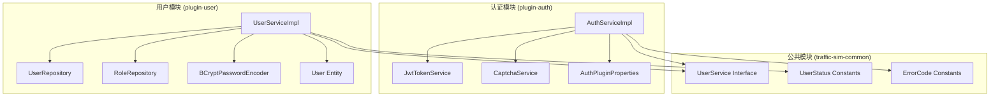
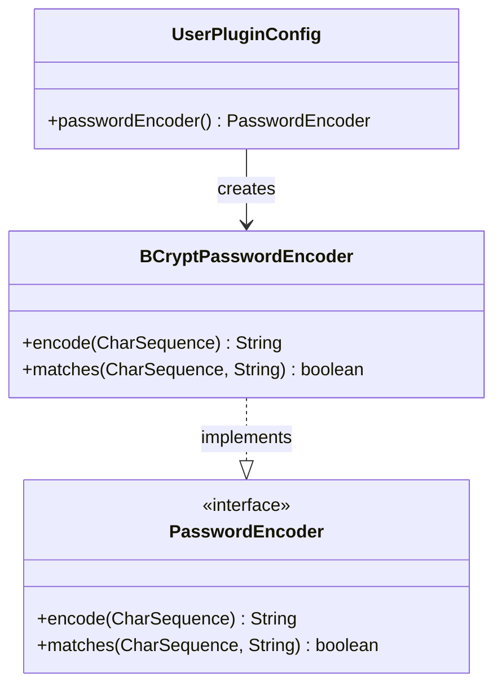
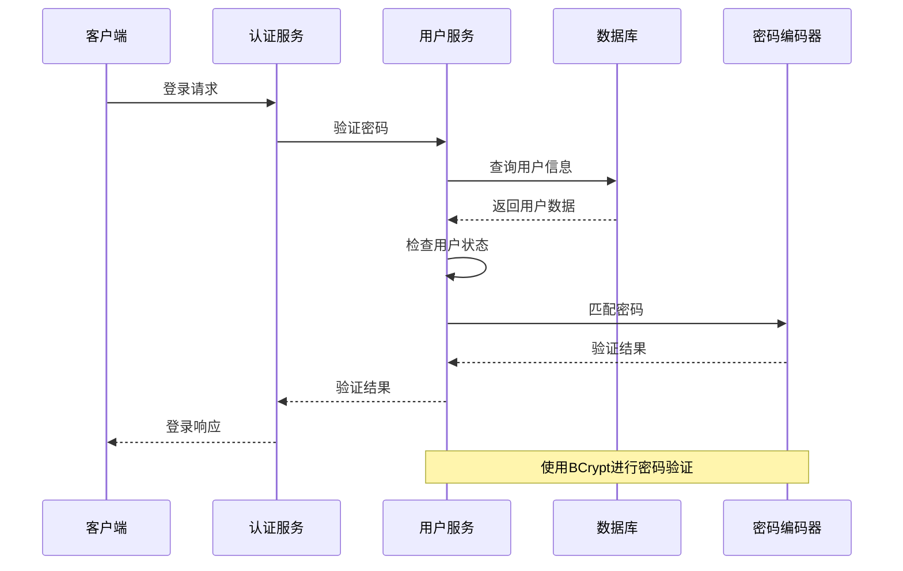
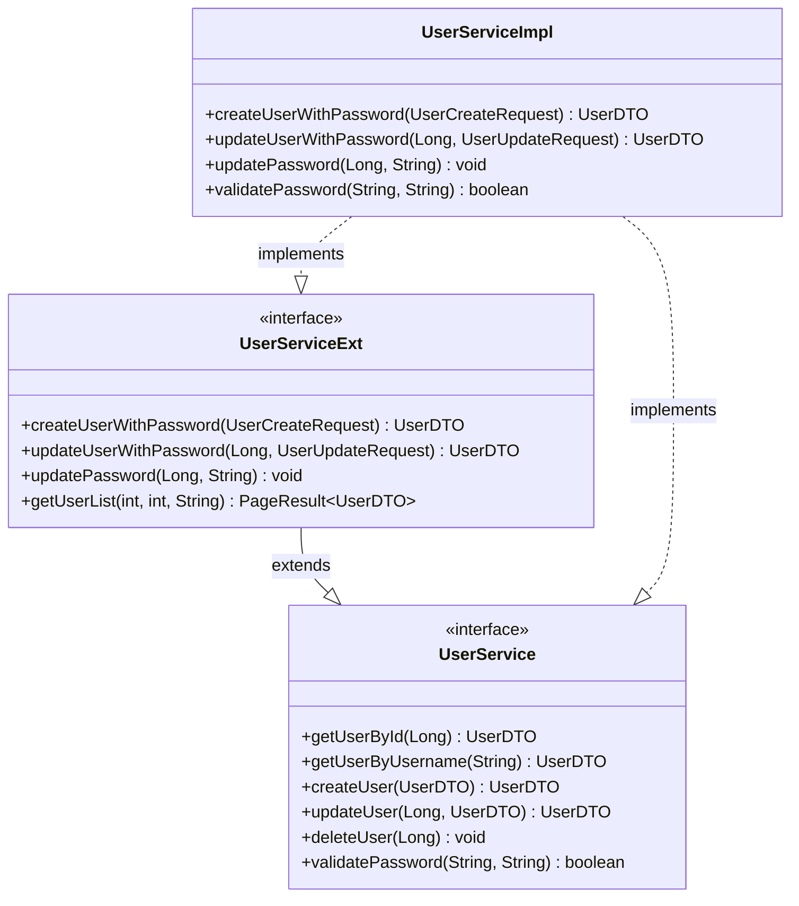
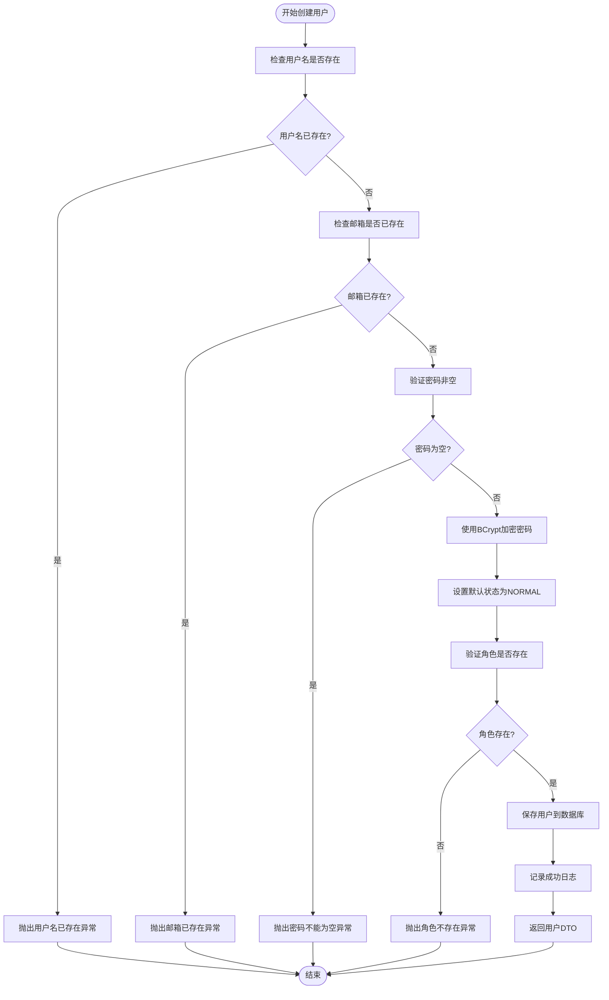
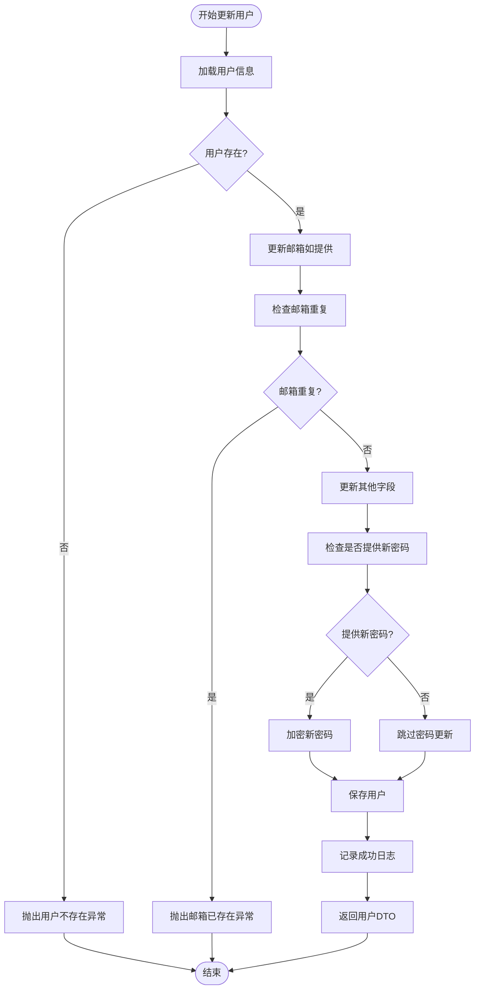
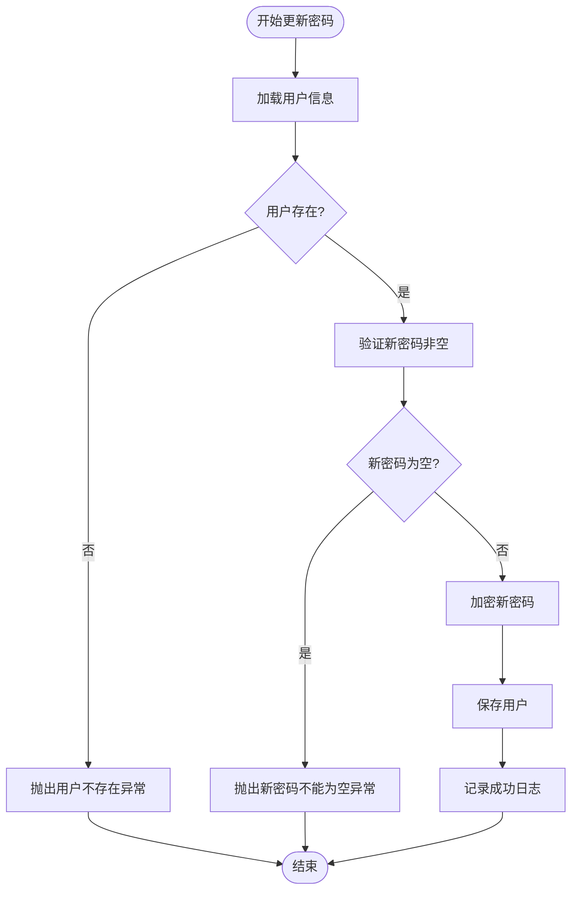
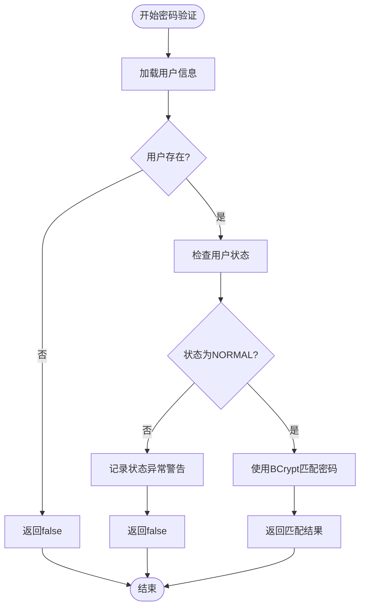
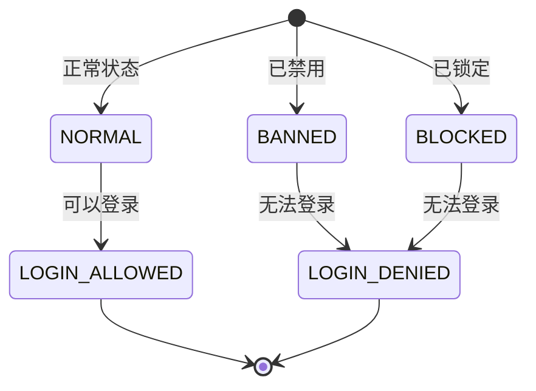

# 密码管理

<cite>
**本文档引用的文件**
- [UserServiceExt.java](file://plugins/plugin-user/src/main/java/com/traffic/sim/plugin/user/service/UserServiceExt.java)
- [UserServiceImpl.java](file://plugins/plugin-user/src/main/java/com/traffic/sim/plugin/user/service/UserServiceImpl.java)
- [User.java](file://plugins/plugin-user/src/main/java/com/traffic/sim/plugin/user/entity/User.java)
- [UserStatus.java](file://traffic-sim-common/src/main/java/com/traffic/sim/common/constant/UserStatus.java)
- [AuthServiceImpl.java](file://plugins/plugin-auth/src/main/java/com/traffic/sim/plugin/auth/service/AuthServiceImpl.java)
- [UserCreateRequest.java](file://plugins/plugin-user/src/main/java/com/traffic/sim/plugin/user/dto/UserCreateRequest.java)
- [UserUpdateRequest.java](file://plugins/plugin-user/src/main/java/com/traffic/sim/plugin/user/dto/UserUpdateRequest.java)
- [UserPluginConfig.java](file://plugins/plugin-user/src/main/java/com/traffic/sim/plugin/user/config/UserPluginConfig.java)
- [UserService.java](file://traffic-sim-common/src/main/java/com/traffic/sim/common/service/UserService.java)
</cite>

## 目录
1. [简介](#简介)
2. [项目结构](#项目结构)
3. [核心组件](#核心组件)
4. [架构概览](#架构概览)
5. [详细组件分析](#详细组件分析)
6. [依赖关系分析](#依赖关系分析)
7. [性能考虑](#性能考虑)
8. [故障排除指南](#故障排除指南)
9. [结论](#结论)

## 简介

本文件详细阐述了交通模拟系统中的密码管理功能，重点分析UserServiceExt接口中密码相关方法的设计目的和实现方式。系统采用BCryptPasswordEncoder进行密码加密，确保用户密码的安全存储和验证。文档深入解释了createUserWithPassword、updateUserWithPassword和updatePassword三个核心方法的实现细节，并详细说明了用户状态对密码验证的影响机制。

## 项目结构

交通模拟系统的密码管理功能分布在多个模块中，形成了清晰的分层架构：



**图表来源**
- [AuthServiceImpl.java](file://plugins/plugin-auth/src/main/java/com/traffic/sim/plugin/auth/service/AuthServiceImpl.java#L1-L263)
- [UserServiceImpl.java](file://plugins/plugin-user/src/main/java/com/traffic/sim/plugin/user/service/UserServiceImpl.java#L1-L331)
- [User.java](file://plugins/plugin-user/src/main/java/com/traffic/sim/plugin/user/entity/User.java#L1-L66)

**章节来源**
- [AuthServiceImpl.java](file://plugins/plugin-auth/src/main/java/com/traffic/sim/plugin/auth/service/AuthServiceImpl.java#L1-L263)
- [UserServiceImpl.java](file://plugins/plugin-user/src/main/java/com/traffic/sim/plugin/user/service/UserServiceImpl.java#L1-L331)

## 核心组件

### 密码编码器配置

系统使用Spring Security提供的BCryptPasswordEncoder进行密码加密：



**图表来源**
- [UserPluginConfig.java](file://plugins/plugin-user/src/main/java/com/traffic/sim/plugin/user/config/UserPluginConfig.java#L1-L26)

### 用户状态管理

系统定义了三种用户状态，其中只有NORMAL状态的用户可以进行密码验证：

| 状态 | 描述 | 登录权限 |
|------|------|----------|
| NORMAL | 正常状态 | ✅ 可以登录 |
| BANNED | 已禁用 | ❌ 无法登录 |
| BLOCKED | 已锁定 | ❌ 无法登录 |

**章节来源**
- [UserStatus.java](file://traffic-sim-common/src/main/java/com/traffic/sim/common/constant/UserStatus.java#L1-L24)

## 架构概览

密码管理系统的整体架构遵循分层设计原则，实现了职责分离和安全隔离：



**图表来源**
- [AuthServiceImpl.java](file://plugins/plugin-auth/src/main/java/com/traffic/sim/plugin/auth/service/AuthServiceImpl.java#L46-L90)
- [UserServiceImpl.java](file://plugins/plugin-user/src/main/java/com/traffic/sim/plugin/user/service/UserServiceImpl.java#L153-L168)

## 详细组件分析

### UserServiceExt接口设计

UserServiceExt接口扩展了基础的用户管理功能，专门处理密码相关的业务操作：



**图表来源**
- [UserServiceExt.java](file://plugins/plugin-user/src/main/java/com/traffic/sim/plugin/user/service/UserServiceExt.java#L1-L37)
- [UserService.java](file://traffic-sim-common/src/main/java/com/traffic/sim/common/service/UserService.java#L1-L44)
- [UserServiceImpl.java](file://plugins/plugin-user/src/main/java/com/traffic/sim/plugin/user/service/UserServiceImpl.java#L38-L331)

### 密码加密存储流程

#### createUserWithPassword方法实现

该方法负责创建新用户并进行密码加密：



**图表来源**
- [UserServiceImpl.java](file://plugins/plugin-user/src/main/java/com/traffic/sim/plugin/user/service/UserServiceImpl.java#L190-L236)

#### updateUserWithPassword方法实现

该方法用于更新用户信息并可选择更新密码：



**图表来源**
- [UserServiceImpl.java](file://plugins/plugin-user/src/main/java/com/traffic/sim/plugin/user/service/UserServiceImpl.java#L238-L281)

#### updatePassword方法实现

该方法专门用于更新用户密码：



**图表来源**
- [UserServiceImpl.java](file://plugins/plugin-user/src/main/java/com/traffic/sim/plugin/user/service/UserServiceImpl.java#L283-L296)

### 密码验证机制

#### validatePassword方法实现

密码验证过程严格检查用户状态和密码匹配：



**图表来源**
- [UserServiceImpl.java](file://plugins/plugin-user/src/main/java/com/traffic/sim/plugin/user/service/UserServiceImpl.java#L153-L168)

### BCryptPasswordEncoder的应用

#### 密码编码时机

BCryptPasswordEncoder在以下时机被调用：

1. **密码创建时**：使用`passwordEncoder.encode()`对明文密码进行加密
2. **密码更新时**：使用`passwordEncoder.encode()`对新密码进行加密
3. **密码验证时**：使用`passwordEncoder.matches()`进行密码匹配验证

#### 安全考量

BCryptPasswordEncoder提供了以下安全保障：

- **自适应成本因子**：默认成本因子为12，可根据硬件性能调整
- **随机盐值**：每次加密都生成新的随机盐值，防止彩虹表攻击
- **单向加密**：无法从加密后的密码推导出原始密码
- **渐进式安全**：随着计算能力提升，可增加成本因子提高安全性

**章节来源**
- [UserServiceImpl.java](file://plugins/plugin-user/src/main/java/com/traffic/sim/plugin/user/service/UserServiceImpl.java#L214-L215)
- [UserServiceImpl.java](file://plugins/plugin-user/src/main/java/com/traffic/sim/plugin/user/service/UserServiceImpl.java#L274-L275)
- [UserServiceImpl.java](file://plugins/plugin-user/src/main/java/com/traffic/sim/plugin/user/service/UserServiceImpl.java#L293-L293)

### 用户状态对密码验证的影响

系统通过用户状态控制密码验证的可用性：



**图表来源**
- [UserStatus.java](file://traffic-sim-common/src/main/java/com/traffic/sim/common/constant/UserStatus.java#L10-L17)
- [UserServiceImpl.java](file://plugins/plugin-user/src/main/java/com/traffic/sim/plugin/user/service/UserServiceImpl.java#L161-L165)

### 密码更新安全校验流程

#### 新密码非空验证

系统在密码更新过程中实施严格的验证：

1. **createUserWithPassword**：强制要求提供非空密码
2. **updateUserWithPassword**：可选更新密码，若提供则必须非空
3. **updatePassword**：强制要求提供非空新密码

#### 错误处理机制

所有密码相关的异常都通过BusinessException统一处理，确保错误信息的一致性和安全性：

| 异常类型 | 触发条件 | 错误码 |
|----------|----------|--------|
| ERR_EXIST | 用户名或邮箱已存在 | 409 |
| ERR_NOT_FOUND | 用户不存在 | 404 |
| ERR_ARG | 参数验证失败（如密码为空） | 400 |
| ERR_AUTH | 认证失败 | 401 |

**章节来源**
- [UserServiceImpl.java](file://plugins/plugin-user/src/main/java/com/traffic/sim/plugin/user/service/UserServiceImpl.java#L194-L196)
- [UserServiceImpl.java](file://plugins/plugin-user/src/main/java/com/traffic/sim/plugin/user/service/UserServiceImpl.java#L214-L218)
- [UserServiceImpl.java](file://plugins/plugin-user/src/main/java/com/traffic/sim/plugin/user/service/UserServiceImpl.java#L289-L291)

## 依赖关系分析

密码管理功能涉及多个模块间的协作关系：

```mermaid
graph TB
subgraph "外部依赖"
A[Spring Security]
B[BCryptPasswordEncoder]
C[JWT Token]
end
subgraph "内部模块"
D[plugin-auth]
E[plugin-user]
F[traffic-sim-common]
end
A --> B
B --> E
C --> D
D --> F
E --> F
D --> E : UserServiceExt
F --> E : User Entity
F --> D : Auth Properties
```

**图表来源**
- [UserPluginConfig.java](file://plugins/plugin-user/src/main/java/com/traffic/sim/plugin/user/config/UserPluginConfig.java#L5-L23)
- [AuthServiceImpl.java](file://plugins/plugin-auth/src/main/java/com/traffic/sim/plugin/auth/service/AuthServiceImpl.java#L31-L34)

### 组件耦合度分析

- **低耦合设计**：密码编码器通过Spring依赖注入，避免了硬编码依赖
- **接口隔离**：UserServiceExt独立于基础UserService，专注于密码相关功能
- **职责单一**：每个方法都有明确的职责边界，便于测试和维护

**章节来源**
- [UserServiceImpl.java](file://plugins/plugin-user/src/main/java/com/traffic/sim/plugin/user/service/UserServiceImpl.java#L42-L42)
- [UserServiceImpl.java](file://plugins/plugin-user/src/main/java/com/traffic/sim/plugin/user/service/UserServiceImpl.java#L15-L24)

## 性能考虑

### BCrypt性能特性

BCryptPasswordEncoder虽然提供了强大的安全性，但也带来了一些性能考量：

- **加密开销**：成本因子越高，加密时间越长，但安全性也越高
- **内存使用**：BCrypt需要额外的内存来存储中间结果
- **CPU消耗**：加密和验证都是CPU密集型操作

### 优化建议

1. **成本因子调优**：根据服务器性能调整BCrypt成本因子，默认12已能满足大多数场景
2. **缓存策略**：对于频繁的密码验证，可考虑在应用层实现轻量级缓存
3. **异步处理**：对于批量密码操作，可考虑异步处理减少主线程阻塞

## 故障排除指南

### 常见问题及解决方案

#### 密码验证失败

**症状**：用户登录时报错"用户名或密码错误"

**可能原因**：
1. 用户状态不是NORMAL
2. 密码输入错误
3. 数据库中密码被意外修改

**排查步骤**：
1. 检查用户状态：`SELECT status FROM user WHERE username = ?`
2. 验证密码哈希：确认数据库中存储的是BCrypt哈希值
3. 检查密码编码器配置

#### 密码更新异常

**症状**：更新密码时报错"新密码不能为空"

**解决方案**：
1. 确保传入的新密码参数非空
2. 检查前端表单验证逻辑
3. 验证DTO对象的密码字段是否正确绑定

#### 用户状态异常

**症状**：用户被禁用但仍尝试登录

**解决方案**：
1. 检查用户状态字段值
2. 确认状态转换逻辑正确
3. 验证业务规则是否符合预期

**章节来源**
- [UserServiceImpl.java](file://plugins/plugin-user/src/main/java/com/traffic/sim/plugin/user/service/UserServiceImpl.java#L161-L165)
- [UserServiceImpl.java](file://plugins/plugin-user/src/main/java/com/traffic/sim/plugin/user/service/UserServiceImpl.java#L289-L291)

## 结论

交通模拟系统的密码管理功能通过精心设计的架构实现了高安全性与良好用户体验的平衡。UserServiceExt接口的引入为密码相关操作提供了专门的API，而BCryptPasswordEncoder的使用确保了密码存储的安全性。

系统的关键优势包括：

1. **安全性**：采用业界标准的BCrypt加密算法，提供抗暴力破解的能力
2. **可维护性**：清晰的接口设计和模块分离，便于功能扩展和维护
3. **可靠性**：完善的错误处理和状态管理机制
4. **可扩展性**：基于Spring框架的依赖注入，支持灵活的配置和扩展

通过本文档的详细分析，开发者可以更好地理解和使用系统的密码管理功能，并在此基础上进行进一步的功能增强和安全加固。