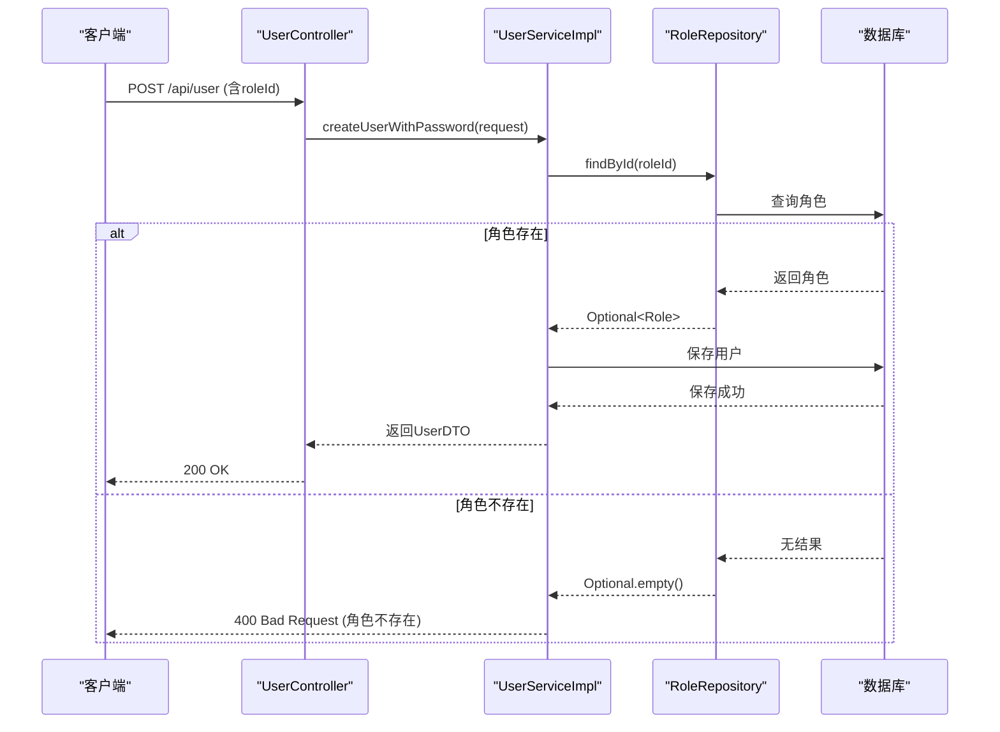
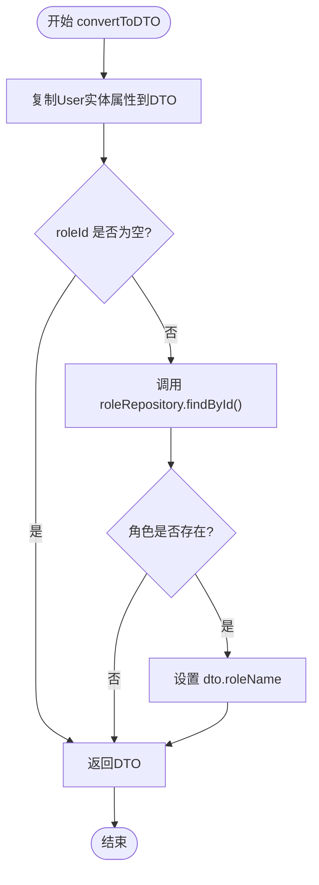
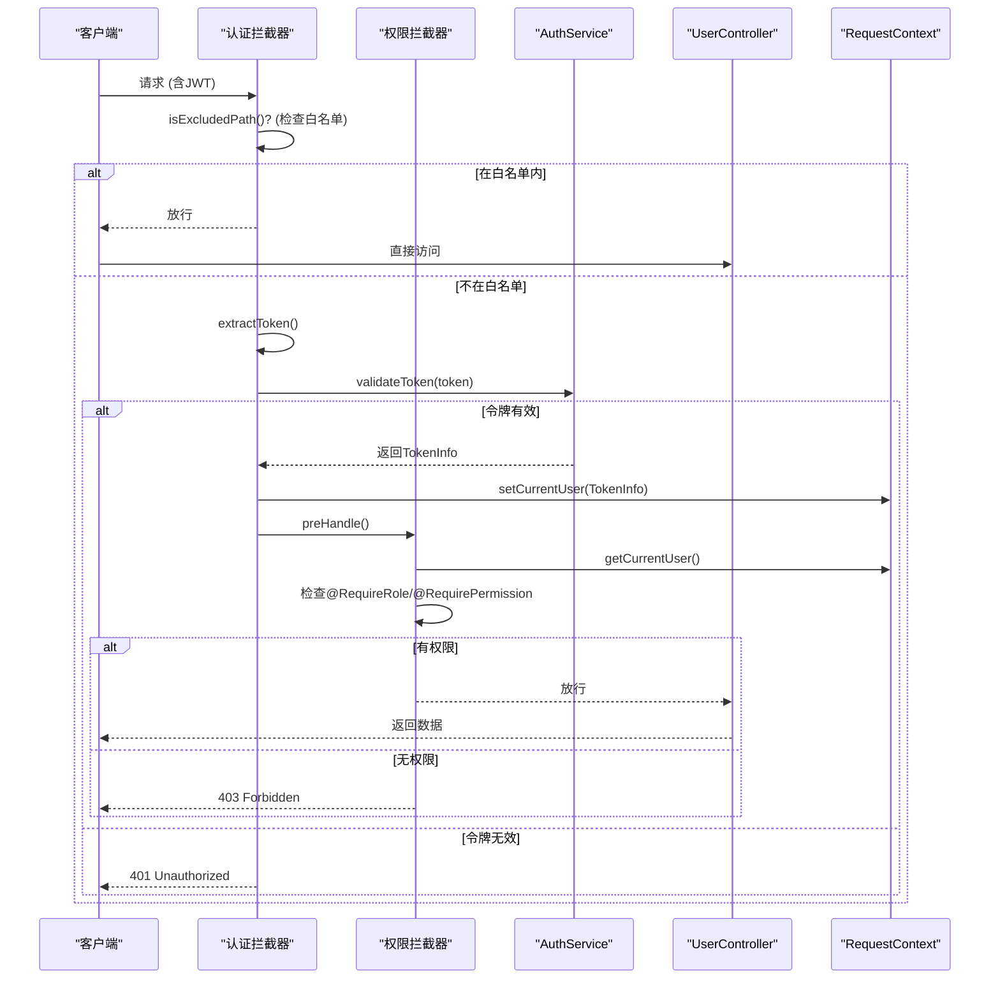

# 权限集成

<cite>
**本文档中引用的文件**  
- [UserServiceImpl.java](file://plugins/plugin-user/src/main/java/com/traffic/sim/plugin/user/service/UserServiceImpl.java)
- [RoleRepository.java](file://plugins/plugin-user/src/main/java/com/traffic/sim/plugin/user/repository/RoleRepository.java)
- [User.java](file://plugins/plugin-user/src/main/java/com/traffic/sim/plugin/user/entity/User.java)
- [Role.java](file://plugins/plugin-user/src/main/java/com/traffic/sim/plugin/user/entity/Role.java)
- [UserStatus.java](file://traffic-sim-common/src/main/java/com/traffic/sim/common/constant/UserStatus.java)
- [AuthenticationInterceptor.java](file://plugins/plugin-auth/src/main/java/com/traffic/sim/plugin/auth/interceptor/AuthenticationInterceptor.java)
- [PermissionInterceptor.java](file://plugins/plugin-auth/src/main/java/com/traffic/sim/plugin/auth/interceptor/PermissionInterceptor.java)
- [RequireRole.java](file://plugins/plugin-auth/src/main/java/com/traffic/sim/plugin/auth/annotation/RequireRole.java)
- [RequirePermission.java](file://plugins/plugin-auth/src/main/java/com/traffic/sim/plugin/auth/annotation/RequirePermission.java)
- [UserCreateRequest.java](file://plugins/plugin-user/src/main/java/com/traffic/sim/plugin/user/dto/UserCreateRequest.java)
- [UserUpdateRequest.java](file://plugins/plugin-user/src/main/java/com/traffic/sim/plugin/user/dto/UserUpdateRequest.java)
- [UserController.java](file://plugins/plugin-user/src/main/java/com/traffic/sim/plugin/user/controller/UserController.java)
- [AuthService.java](file://traffic-sim-common/src/main/java/com/traffic/sim/common/service/AuthService.java)
- [UserService.java](file://traffic-sim-common/src/main/java/com/traffic/sim/common/service/UserService.java)
- [RequestContext.java](file://plugins/plugin-auth/src/main/java/com/traffic/sim/plugin/auth/util/RequestContext.java)
</cite>

## 目录
1. [简介](#简介)
2. [用户服务与角色权限系统集成](#用户服务与角色权限系统集成)
3. [角色ID有效性验证机制](#角色id有效性验证机制)
4. [convertToDTO方法中的角色名称填充逻辑](#converttodto方法中的角色名称填充逻辑)
5. [用户状态（UserStatus）业务含义与转换规则](#用户状态userstatus业务含义与转换规则)
6. [认证与权限拦截器协作关系](#认证与权限拦截器协作关系)
7. [用户权限验证流程图](#用户权限验证流程图)
8. [结论](#结论)

## 简介
本文档深入分析交通仿真系统中用户服务与权限系统的集成机制。重点阐述用户服务如何通过RoleRepository与角色权限系统交互，详细说明在用户创建和更新过程中对角色ID的有效性验证流程，解析convertToDTO方法中角色名称的动态填充逻辑，并阐明用户状态（NORMAL、BANNED、BLOCKED）的业务含义及其对用户操作权限的影响。同时，文档将揭示用户服务与认证拦截器（AuthenticationInterceptor）及权限拦截器（PermissionInterceptor）之间的协作机制，提供完整的用户权限验证流程。

## 用户服务与角色权限系统集成

用户服务（UserServiceImpl）通过依赖注入的方式与角色权限系统进行集成，核心交互点在于`RoleRepository`接口的使用。该服务在处理用户创建、更新等操作时，会调用`RoleRepository`来验证角色ID的存在性，并在数据转换过程中查询角色信息以填充DTO中的角色名称字段。

集成的关键在于`UserServiceImpl`类中声明的`roleRepository`成员变量，它提供了与角色数据访问层的连接。这种设计实现了用户管理与权限管理的松耦合，同时确保了角色数据的一致性和完整性。

**Section sources**
- [UserServiceImpl.java](file://plugins/plugin-user/src/main/java/com/traffic/sim/plugin/user/service/UserServiceImpl.java#L41)
- [RoleRepository.java](file://plugins/plugin-user/src/main/java/com/traffic/sim/plugin/user/repository/RoleRepository.java)

## 角色ID有效性验证机制

在用户创建和更新过程中，系统会对提供的角色ID进行严格的有效性验证，以确保用户被赋予一个真实存在的角色。

### 用户创建时的角色验证
当通过`createUserWithPassword`方法创建新用户时，系统会执行以下验证流程：
1. 接收包含角色ID的`UserCreateRequest`请求对象
2. 在保存用户实体前，调用`roleRepository.findById()`方法查询该ID对应的角色
3. 如果查询结果为空（`Optional.isEmpty()`），则抛出`BusinessException`异常，提示“角色不存在”
4. 只有验证通过后，用户实体才会被持久化到数据库

此验证机制防止了无效或错误的角色ID被关联到用户，保证了数据的完整性。

### 用户更新时的角色验证
在更新用户信息时（`updateUserWithPassword`方法），系统同样会对新指定的角色ID进行验证：
1. 接收包含新角色ID的`UserUpdateRequest`请求
2. 在更新用户实体的`roleId`字段前，调用`roleRepository.findById()`进行存在性检查
3. 若角色不存在，则抛出异常并终止更新操作

这种机制确保了用户角色的变更始终基于系统中已定义的有效角色。

**Diagram sources**
- [UserServiceImpl.java](file://plugins/plugin-user/src/main/java/com/traffic/sim/plugin/user/service/UserServiceImpl.java#L224-L228)
- [UserCreateRequest.java](file://plugins/plugin-user/src/main/java/com/traffic/sim/plugin/user/dto/UserCreateRequest.java#L31)
- [RoleRepository.java](file://plugins/plugin-user/src/main/java/com/traffic/sim/plugin/user/repository/RoleRepository.java#L15)

**Section sources**
- [UserServiceImpl.java](file://plugins/plugin-user/src/main/java/com/traffic/sim/plugin/user/service/UserServiceImpl.java#L223-L236)
- [UserUpdateRequest.java](file://plugins/plugin-user/src/main/java/com/traffic/sim/plugin/user/dto/UserUpdateRequest.java#L25)

## convertToDTO方法中的角色名称填充逻辑

`convertToDTO`方法是用户服务中的一个私有辅助方法，负责将`User`实体对象转换为对外暴露的`UserDTO`数据传输对象。其核心功能之一是在转换过程中动态填充角色名称。

### 填充逻辑详解
1. **初始化DTO**：创建一个新的`UserDTO`实例，并使用`BeanUtils.copyProperties()`将`User`实体的基本属性复制到DTO中。
2. **检查角色ID**：判断`User`实体中的`roleId`字段是否为非空。
3. **查询角色实体**：如果`roleId`存在，则调用`roleRepository.findById()`方法，根据ID查询对应的`Role`实体。
4. **设置角色名称**：若查询成功（`Optional.isPresent()`），则从`Role`实体中获取`roleName`，并调用`dto.setRoleName()`方法将其设置到DTO中。

此逻辑确保了即使数据库中只存储了角色ID，前端或API调用方也能获取到完整且可读的角色名称，提升了用户体验和接口的可用性。

**Diagram sources**
- [UserServiceImpl.java](file://plugins/plugin-user/src/main/java/com/traffic/sim/plugin/user/service/UserServiceImpl.java#L173-L185)
- [Role.java](file://plugins/plugin-user/src/main/java/com/traffic/sim/plugin/user/entity/Role.java#L23)

**Section sources**
- [UserServiceImpl.java](file://plugins/plugin-user/src/main/java/com/traffic/sim/plugin/user/service/UserServiceImpl.java#L173-L185)

## 用户状态（UserStatus）业务含义与转换规则

`UserStatus`是一个定义在`traffic-sim-common`模块中的常量类，用于表示用户在系统中的不同状态，对用户的登录和操作权限有直接影响。

### 状态定义与业务含义
| 状态常量 | 状态值 | 业务含义 |
| :--- | :--- | :--- |
| `NORMAL` | "NORMAL" | **正常状态**：用户可以正常登录系统，访问所有被授权的资源和功能。这是新用户注册后的默认状态。 |
| `BANNED` | "BANNED" | **已禁用**：用户账户被系统管理员禁用。用户无法登录，所有API请求将被拒绝。通常用于处理违规用户。 |
| `BLOCKED` | "BLOCKED" | **已锁定**：用户账户因多次登录失败等原因被临时锁定。用户无法登录，但状态可能在一段时间后自动恢复或由管理员手动解除。 |

### 状态转换规则与影响
- **默认状态**：在创建用户时，如果未指定状态，系统会自动将其设置为`NORMAL`（在`User`实体的`@PrePersist`方法和`UserServiceImpl`中均有此逻辑）。
- **登录验证**：`validatePassword`方法在验证密码前，会先检查用户状态。如果状态不是`NORMAL`，则直接返回`false`，阻止登录。
- **状态更新**：管理员可以通过更新用户信息的API来修改用户状态，从而实现启用、禁用或锁定账户的操作。

这些状态机制共同构成了系统的用户访问控制基础，确保了只有处于正常状态的用户才能使用系统。

**Section sources**
- [UserStatus.java](file://traffic-sim-common/src/main/java/com/traffic/sim/common/constant/UserStatus.java)
- [UserServiceImpl.java](file://plugins/plugin-user/src/main/java/com/traffic/sim/plugin/user/service/UserServiceImpl.java#L81-L83)
- [User.java](file://plugins/plugin-user/src/main/java/com/traffic/sim/plugin/user/entity/User.java#L55-L57)
- [UserServiceImpl.java](file://plugins/plugin-user/src/main/java/com/traffic/sim/plugin/user/service/UserServiceImpl.java#L162-L164)

## 认证与权限拦截器协作关系

用户服务与认证、权限拦截器共同构成了系统的安全防线。它们按照特定的顺序协作，对每个请求进行层层校验。

### 协作流程
1. **认证拦截器（AuthenticationInterceptor）**：
   - **作用**：作为第一道防线，负责验证JWT令牌的有效性。
   - **流程**：从请求头中提取`Authorization`令牌，调用`AuthService.validateToken()`进行验证。
   - **结果**：验证通过后，将解析出的用户信息（`TokenInfo`）存入`RequestContext`的`ThreadLocal`中，供后续处理使用。

2. **权限拦截器（PermissionInterceptor）**：
   - **作用**：作为第二道防线，负责验证用户是否有权访问特定资源。
   - **流程**：从`RequestContext`中获取当前用户信息，检查请求的处理器方法或类上是否标注了`@RequireRole`或`@RequirePermission`注解。
   - **结果**：根据注解要求，比对用户的角色和权限，决定是否放行请求。

### 拦截器链
这两个拦截器按顺序执行，形成了一个安全的拦截器链。只有通过了认证的用户，其请求才会进入权限验证阶段，从而实现了“先认证，后授权”的安全原则。

**Section sources**
- [AuthenticationInterceptor.java](file://plugins/plugin-auth/src/main/java/com/traffic/sim/plugin/auth/interceptor/AuthenticationInterceptor.java)
- [PermissionInterceptor.java](file://plugins/plugin-auth/src/main/java/com/traffic/sim/plugin/auth/interceptor/PermissionInterceptor.java)
- [RequestContext.java](file://plugins/plugin-auth/src/main/java/com/traffic/sim/plugin/auth/util/RequestContext.java)

## 用户权限验证流程图

以下流程图完整地展示了从客户端发起请求到最终访问受保护资源的整个用户权限验证过程。

**Diagram sources**
- [AuthenticationInterceptor.java](file://plugins/plugin-auth/src/main/java/com/traffic/sim/plugin/auth/interceptor/AuthenticationInterceptor.java#L45-L75)
- [PermissionInterceptor.java](file://plugins/plugin-auth/src/main/java/com/traffic/sim/plugin/auth/interceptor/PermissionInterceptor.java#L32-L84)
- [RequestContext.java](file://plugins/plugin-auth/src/main/java/com/traffic/sim/plugin/auth/util/RequestContext.java)

## 结论
本文档详细阐述了交通仿真系统中用户服务与权限系统的深度集成。通过`RoleRepository`，用户服务实现了对角色ID的有效性验证和角色名称的动态填充，确保了用户数据的完整性和可读性。`UserStatus`常量定义了清晰的用户状态机，`NORMAL`、`BANNED`和`BLOCKED`状态直接影响用户的登录和操作权限。认证拦截器和权限拦截器通过协作，构建了一个“认证-授权”的安全链条，`RequestContext`作为上下文载体，使得用户信息能够在请求处理链中安全传递。这一系列设计共同保障了系统的安全性和健壮性。