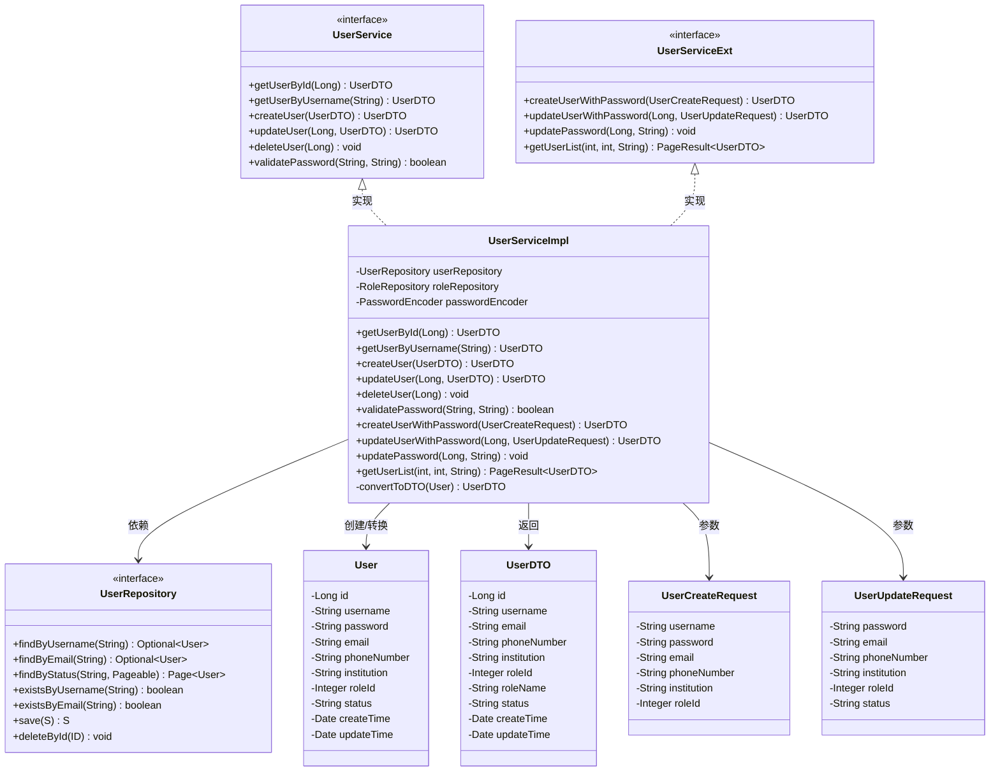

# 核心用户操作

<cite>
**本文档中引用的文件**  
- [UserServiceImpl.java](file://plugins/plugin-user/src/main/java/com/traffic/sim/plugin/user/service/UserServiceImpl.java)
- [User.java](file://plugins/plugin-user/src/main/java/com/traffic/sim/plugin/user/entity/User.java)
- [UserRepository.java](file://plugins/plugin-user/src/main/java/com/traffic/sim/plugin/user/repository/UserRepository.java)
- [UserCreateRequest.java](file://plugins/plugin-user/src/main/java/com/traffic/sim/plugin/user/dto/UserCreateRequest.java)
- [UserUpdateRequest.java](file://plugins/plugin-user/src/main/java/com/traffic/sim/plugin/user/dto/UserUpdateRequest.java)
- [UserService.java](file://traffic-sim-common/src/main/java/com/traffic/sim/common/service/UserService.java)
- [UserDTO.java](file://traffic-sim-common/src/main/java/com/traffic/sim/common/dto/UserDTO.java)
- [Role.java](file://plugins/plugin-user/src/main/java/com/traffic/sim/plugin/user/entity/Role.java)
- [UserStatus.java](file://traffic-sim-common/src/main/java/com/traffic/sim/common/constant/UserStatus.java)
- [application.yml](file://plugins/plugin-user/src/main/resources/application.yml)
</cite>

## 目录
1. [简介](#简介)
2. [核心组件分析](#核心组件分析)
3. [服务层方法实现详解](#服务层方法实现详解)
4. [实体与DTO转换机制](#实体与dto转换机制)
5. [唯一性校验与条件更新策略](#唯一性校验与条件更新策略)
6. [异常处理与日志记录](#异常处理与日志记录)
7. [服务调用时序图](#服务调用时序图)
8. [总结](#总结)

## 简介
本文档深入分析交通仿真系统中用户服务的核心操作实现。重点解析`UserServiceImpl`类中用户管理相关方法的业务逻辑，包括用户查询、创建、更新和删除等核心CRUD操作。文档详细阐述了基于Spring Data JPA的数据访问实现、实体与DTO之间的属性复制机制、用户唯一性约束校验以及安全的密码处理流程。

## 核心组件分析

### 用户服务架构
用户服务采用典型的分层架构设计，包含控制器层、服务层和数据访问层。`UserServiceImpl`作为服务实现类，实现了`UserService`接口并扩展了`UserServiceExt`接口，提供了完整的用户管理功能。



**图示来源**  
- [UserServiceImpl.java](file://plugins/plugin-user/src/main/java/com/traffic/sim/plugin/user/service/UserServiceImpl.java#L35-L331)
- [UserService.java](file://traffic-sim-common/src/main/java/com/traffic/sim/common/service/UserService.java#L11-L44)
- [UserServiceExt.java](file://plugins/plugin-user/src/main/java/com/traffic/sim/plugin/user/service/UserServiceExt.java#L14-L37)
- [UserRepository.java](file://plugins/plugin-user/src/main/java/com/traffic/sim/plugin/user/repository/UserRepository.java#L17-L51)
- [User.java](file://plugins/plugin-user/src/main/java/com/traffic/sim/plugin/user/entity/User.java#L13-L66)
- [UserDTO.java](file://traffic-sim-common/src/main/java/com/traffic/sim/common/dto/UserDTO.java#L13-L30)
- [UserCreateRequest.java](file://plugins/plugin-user/src/main/java/com/traffic/sim/plugin/user/dto/UserCreateRequest.java#L13-L34)
- [UserUpdateRequest.java](file://plugins/plugin-user/src/main/java/com/traffic/sim/plugin/user/dto/UserUpdateRequest.java#L12-L30)

**本节来源**  
- [UserServiceImpl.java](file://plugins/plugin-user/src/main/java/com/traffic/sim/plugin/user/service/UserServiceImpl.java)
- [User.java](file://plugins/plugin-user/src/main/java/com/traffic/sim/plugin/user/entity/User.java)
- [UserRepository.java](file://plugins/plugin-user/src/main/java/com/traffic/sim/plugin/user/repository/UserRepository.java)

## 服务层方法实现详解

### 用户查询方法
`UserServiceImpl`提供了两种用户查询方法：`getUserById`和`getUserByUsername`。这两个方法都基于Spring Data JPA的`findById`和`findByUsername`方法实现。

```java
@Override
public UserDTO getUserById(Long userId) {
    User user = userRepository.findById(userId)
            .orElseThrow(() -> new BusinessException(ErrorCode.ERR_NOT_FOUND, "用户不存在"));
    return convertToDTO(user);
}

@Override
public UserDTO getUserByUsername(String username) {
    User user = userRepository.findByUsername(username)
            .orElseThrow(() -> new BusinessException(ErrorCode.ERR_NOT_FOUND, "用户不存在"));
    return convertToDTO(user);
}
```

当用户不存在时，两个方法都会抛出`BusinessException`异常，确保调用方能够正确处理用户不存在的情况。

### 用户创建方法
用户创建功能通过`createUserWithPassword`方法实现，该方法接收`UserCreateRequest`对象作为参数，包含用户名、密码等必要信息。

```java
@Override
@Transactional
public UserDTO createUserWithPassword(UserCreateRequest request) {
    // 检查用户名是否已存在
    if (userRepository.existsByUsername(request.getUsername())) {
        throw new BusinessException(ErrorCode.ERR_EXIST, "用户名已存在");
    }
    
    // 检查邮箱是否已存在（如果提供了邮箱）
    if (request.getEmail() != null && !request.getEmail().isEmpty()) {
        if (userRepository.existsByEmail(request.getEmail())) {
            throw new BusinessException(ErrorCode.ERR_EXIST, "邮箱已被使用");
        }
    }
    
    // 创建用户实体
    User user = new User();
    user.setUsername(request.getUsername());
    user.setEmail(request.getEmail());
    user.setPhoneNumber(request.getPhoneNumber());
    user.setInstitution(request.getInstitution());
    user.setRoleId(request.getRoleId());
    
    // 加密密码
    if (request.getPassword() != null && !request.getPassword().isEmpty()) {
        user.setPassword(passwordEncoder.encode(request.getPassword()));
    } else {
        throw new BusinessException(ErrorCode.ERR_ARG, "密码不能为空");
    }
    
    // 设置默认状态
    user.setStatus(UserStatus.NORMAL);
    
    // 验证角色是否存在
    if (user.getRoleId() != null) {
        Optional<Role> role = roleRepository.findById(user.getRoleId().longValue());
        if (role.isEmpty()) {
            throw new BusinessException(ErrorCode.ERR_NOT_FOUND, "角色不存在");
        }
    }
    
    // 保存用户
    User savedUser = userRepository.save(user);
    log.info("创建用户成功: username={}, id={}", savedUser.getUsername(), savedUser.getId());
    
    return convertToDTO(savedUser);
}
```

### 用户更新方法
用户更新功能通过`updateUserWithPassword`方法实现，支持选择性更新用户信息。

```java
@Override
@Transactional
public UserDTO updateUserWithPassword(Long userId, UserUpdateRequest request) {
    User user = userRepository.findById(userId)
            .orElseThrow(() -> new BusinessException(ErrorCode.ERR_NOT_FOUND, "用户不存在"));
    
    // 更新邮箱（如果提供了且与现有邮箱不同）
    if (request.getEmail() != null && !request.getEmail().isEmpty() 
            && !request.getEmail().equals(user.getEmail())) {
        if (userRepository.existsByEmail(request.getEmail())) {
            throw new BusinessException(ErrorCode.ERR_EXIST, "邮箱已被使用");
        }
        user.setEmail(request.getEmail());
    }
    
    // 更新其他字段
    if (request.getPhoneNumber() != null) {
        user.setPhoneNumber(request.getPhoneNumber());
    }
    if (request.getInstitution() != null) {
        user.setInstitution(request.getInstitution());
    }
    if (request.getRoleId() != null) {
        user.setRoleId(request.getRoleId());
        // 验证角色是否存在
        Optional<Role> role = roleRepository.findById(request.getRoleId().longValue());
        if (role.isEmpty()) {
            throw new BusinessException(ErrorCode.ERR_NOT_FOUND, "角色不存在");
        }
    }
    if (request.getStatus() != null && !request.getStatus().isEmpty()) {
        user.setStatus(request.getStatus());
    }
    
    // 更新密码（如果提供了新密码）
    if (request.getPassword() != null && !request.getPassword().isEmpty()) {
        user.setPassword(passwordEncoder.encode(request.getPassword()));
    }
    
    User updatedUser = userRepository.save(user);
    log.info("更新用户成功: username={}, id={}", updatedUser.getUsername(), updatedUser.getId());
    
    return convertToDTO(updatedUser);
}
```

### 用户删除方法
用户删除方法实现了安全的删除操作，先检查用户是否存在再执行删除。

```java
@Override
@Transactional
public void deleteUser(Long userId) {
    if (!userRepository.existsById(userId)) {
        throw new BusinessException(ErrorCode.ERR_NOT_FOUND, "用户不存在");
    }
    userRepository.deleteById(userId);
    log.info("删除用户成功: id={}", userId);
}
```

**本节来源**  
- [UserServiceImpl.java](file://plugins/plugin-user/src/main/java/com/traffic/sim/plugin/user/service/UserServiceImpl.java#L45-L151)

## 实体与DTO转换机制

### BeanUtils.copyProperties应用
在`UserServiceImpl`中，`BeanUtils.copyProperties`被用于在实体和DTO之间进行属性复制。该方法通过反射机制自动匹配相同名称的属性，大大简化了转换代码。

```java
private UserDTO convertToDTO(User user) {
    UserDTO dto = new UserDTO();
    BeanUtils.copyProperties(user, dto);
    
    // 设置角色名称（如果角色ID存在）
    if (user.getRoleId() != null) {
        Optional<Role> role = roleRepository.findById(user.getRoleId().longValue());
        if (role.isPresent()) {
            dto.setRoleName(role.get().getRoleName());
        }
    }
    
    return dto;
}
```

### 转换流程分析
1. 创建新的`UserDTO`实例
2. 使用`BeanUtils.copyProperties`复制所有匹配的属性
3. 特殊处理角色名称：通过角色ID查询角色实体，获取角色名称并设置到DTO中
4. 返回转换后的DTO对象

这种设计模式实现了实体与传输对象的解耦，同时保持了数据的一致性。

**本节来源**  
- [UserServiceImpl.java](file://plugins/plugin-user/src/main/java/com/traffic/sim/plugin/user/service/UserServiceImpl.java#L173-L186)
- [UserDTO.java](file://traffic-sim-common/src/main/java/com/traffic/sim/common/dto/UserDTO.java)

## 唯一性校验与条件更新策略

### 用户名和邮箱唯一性校验
在用户创建和更新过程中，系统通过`UserRepository`的`existsByUsername`和`existsByEmail`方法进行唯一性校验。

```java
// 创建用户时的校验
if (userRepository.existsByUsername(request.getUsername())) {
    throw new BusinessException(ErrorCode.ERR_EXIST, "用户名已存在");
}

if (request.getEmail() != null && !request.getEmail().isEmpty()) {
    if (userRepository.existsByEmail(request.getEmail())) {
        throw new BusinessException(ErrorCode.ERR_EXIST, "邮箱已被使用");
    }
}
```

### 条件更新策略
更新操作采用了条件更新策略，只更新提供了新值的字段，避免覆盖未修改的数据。

```java
// 更新邮箱（仅当提供了新邮箱且与现有邮箱不同时）
if (request.getEmail() != null && !request.getEmail().isEmpty() 
        && !request.getEmail().equals(user.getEmail())) {
    if (userRepository.existsByEmail(request.getEmail())) {
        throw new BusinessException(ErrorCode.ERR_EXIST, "邮箱已被使用");
    }
    user.setEmail(request.getEmail());
}

// 更新其他字段（仅当提供了新值时）
if (request.getPhoneNumber() != null) {
    user.setPhoneNumber(request.getPhoneNumber());
}
```

这种策略确保了数据的完整性和一致性，同时提高了系统的灵活性。

**本节来源**  
- [UserServiceImpl.java](file://plugins/plugin-user/src/main/java/com/traffic/sim/plugin/user/service/UserServiceImpl.java#L193-L203)
- [UserServiceImpl.java](file://plugins/plugin-user/src/main/java/com/traffic/sim/plugin/user/service/UserServiceImpl.java#L244-L251)
- [UserRepository.java](file://plugins/plugin-user/src/main/java/com/traffic/sim/plugin/user/repository/UserRepository.java#L43-L48)

## 异常处理与日志记录

### 异常处理机制
系统采用了统一的异常处理机制，使用`BusinessException`来处理业务逻辑异常。

```java
throw new BusinessException(ErrorCode.ERR_NOT_FOUND, "用户不存在");
throw new BusinessException(ErrorCode.ERR_EXIST, "用户名已存在");
throw new BusinessException(ErrorCode.ERR_ARG, "密码不能为空");
```

这些异常会被全局异常处理器捕获并转换为标准化的API响应。

### 日志记录实践
在关键操作点添加了详细的日志记录，便于问题追踪和系统监控。

```java
log.info("创建用户成功: username={}, id={}", savedUser.getUsername(), savedUser.getId());
log.info("更新用户成功: username={}, id={}", updatedUser.getUsername(), updatedUser.getId());
log.info("删除用户成功: id={}", userId);
```

日志信息包含了操作类型、用户名和用户ID等关键信息，有助于快速定位问题。

**本节来源**  
- [UserServiceImpl.java](file://plugins/plugin-user/src/main/java/com/traffic/sim/plugin/user/service/UserServiceImpl.java#L95-L96)
- [UserServiceImpl.java](file://plugins/plugin-user/src/main/java/com/traffic/sim/plugin/user/service/UserServiceImpl.java#L138-L139)
- [UserServiceImpl.java](file://plugins/plugin-user/src/main/java/com/traffic/sim/plugin/user/service/UserServiceImpl.java#L150)
- [UserServiceImpl.java](file://plugins/plugin-user/src/main/java/com/traffic/sim/plugin/user/service/UserServiceImpl.java#L233)
- [UserServiceImpl.java](file://plugins/plugin-user/src/main/java/com/traffic/sim/plugin/user/service/UserServiceImpl.java#L278)

## 服务调用时序图

### 用户创建时序图
```mermaid
sequenceDiagram
participant Controller as UserController
participant Service as UserServiceImpl
participant Repository as UserRepository
participant Encoder as PasswordEncoder
participant RoleRepo as RoleRepository
Controller->>Service : createUserWithPassword(request)
Service->>Repository : existsByUsername(username)
Repository-->>Service : boolean
alt 用户名已存在
Service-->>Controller : BusinessException
return
end
Service->>Repository : existsByEmail(email)
Repository-->>Service : boolean
alt 邮箱已被使用
Service-->>Controller : BusinessException
return
end
Service->>Encoder : encode(password)
Encoder-->>Service : encodedPassword
Service->>RoleRepo : findById(roleId)
RoleRepo-->>Service : Optional<Role>
alt 角色不存在
Service-->>Controller : BusinessException
return
end
Service->>Repository : save(user)
Repository-->>Service : savedUser
Service->>Service : convertToDTO(savedUser)
Service-->>Controller : UserDTO
```

**图示来源**  
- [UserServiceImpl.java](file://plugins/plugin-user/src/main/java/com/traffic/sim/plugin/user/service/UserServiceImpl.java#L190-L236)
- [UserRepository.java](file://plugins/plugin-user/src/main/java/com/traffic/sim/plugin/user/repository/UserRepository.java)

### 用户更新时序图
```mermaid
sequenceDiagram
participant Controller as UserController
participant Service as UserServiceImpl
participant Repository as UserRepository
participant Encoder as PasswordEncoder
participant RoleRepo as RoleRepository
Controller->>Service : updateUserWithPassword(userId, request)
Service->>Repository : findById(userId)
Repository-->>Service : Optional<User>
alt 用户不存在
Service-->>Controller : BusinessException
return
end
Service->>Repository : existsByEmail(email)
Repository-->>Service : boolean
alt 邮箱已被使用
Service-->>Controller : BusinessException
return
end
opt 更新密码
Service->>Encoder : encode(password)
Encoder-->>Service : encodedPassword
end
Service->>RoleRepo : findById(roleId)
RoleRepo-->>Service : Optional<Role>
alt 角色不存在
Service-->>Controller : BusinessException
return
end
Service->>Repository : save(user)
Repository-->>Service : updatedUser
Service->>Service : convertToDTO(updatedUser)
Service-->>Controller : UserDTO
```

**图示来源**  
- [UserServiceImpl.java](file://plugins/plugin-user/src/main/java/com/traffic/sim/plugin/user/service/UserServiceImpl.java#L239-L281)
- [UserRepository.java](file://plugins/plugin-user/src/main/java/com/traffic/sim/plugin/user/repository/UserRepository.java)

## 总结
本文档详细分析了交通仿真系统中用户服务的核心操作实现。`UserServiceImpl`类通过Spring Data JPA实现了完整的CRUD操作，利用`BeanUtils.copyProperties`简化了实体与DTO之间的转换。系统实现了严格的用户名和邮箱唯一性校验，采用条件更新策略确保数据完整性。通过`PasswordEncoder`安全地处理密码加密，结合详细的日志记录和统一的异常处理机制，构建了一个健壮、安全的用户管理系统。