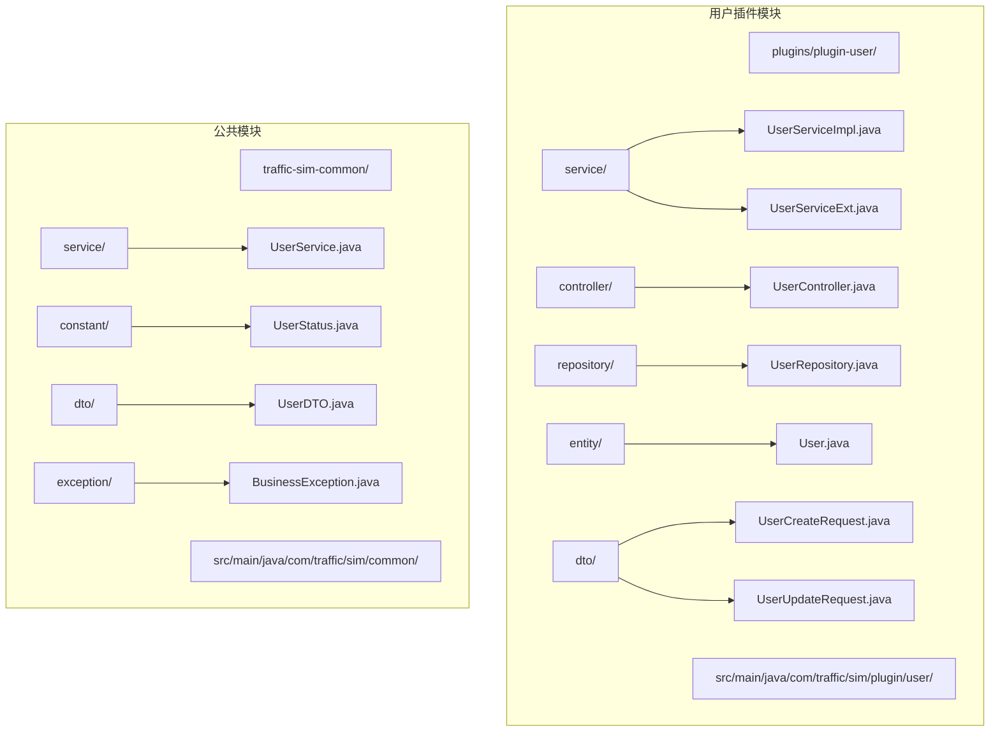
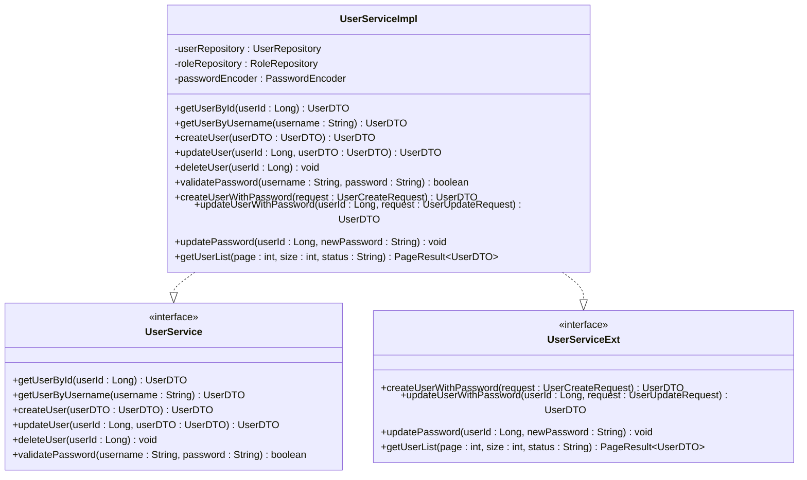
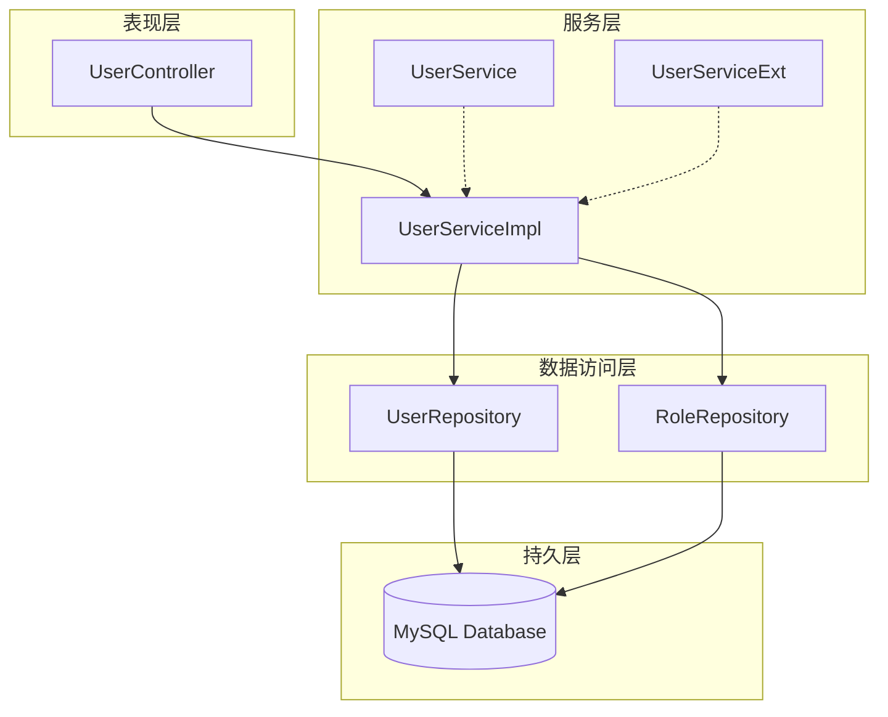
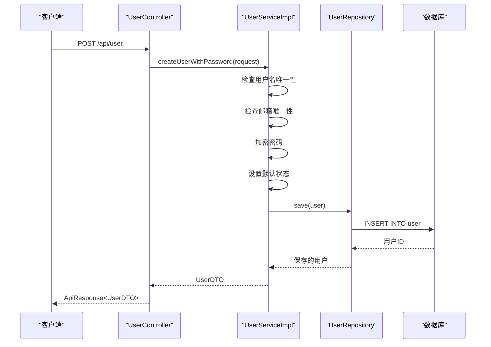
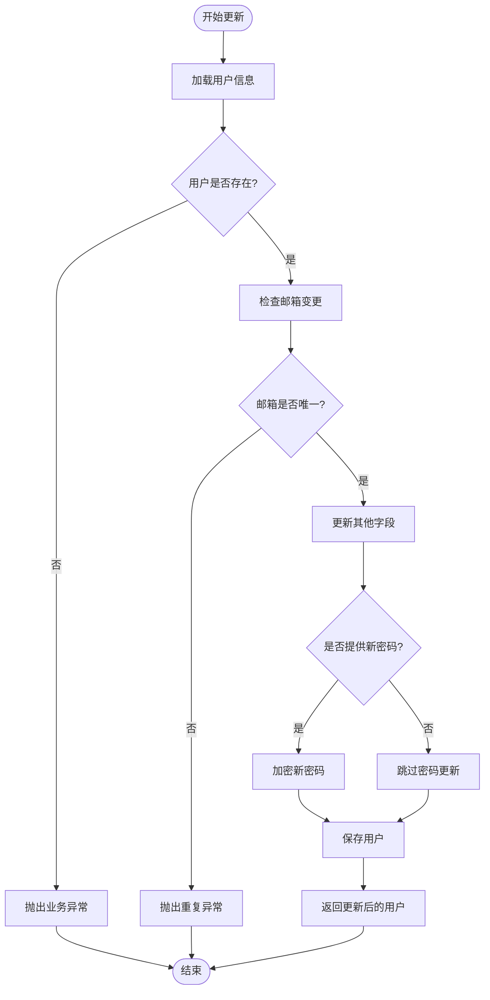
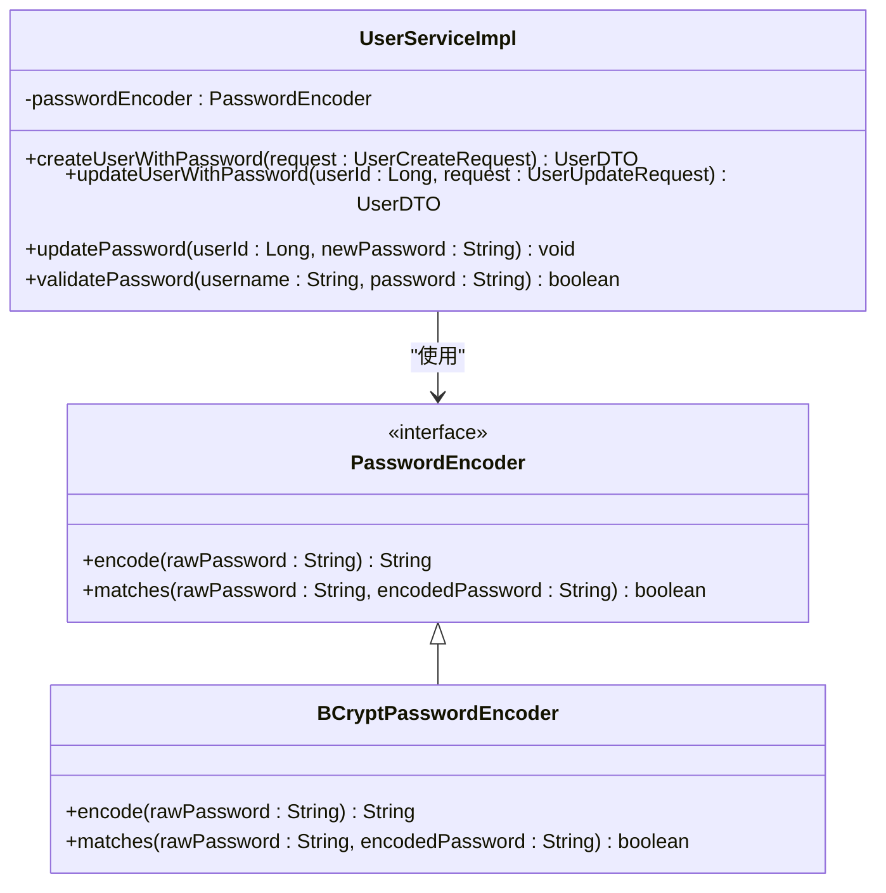
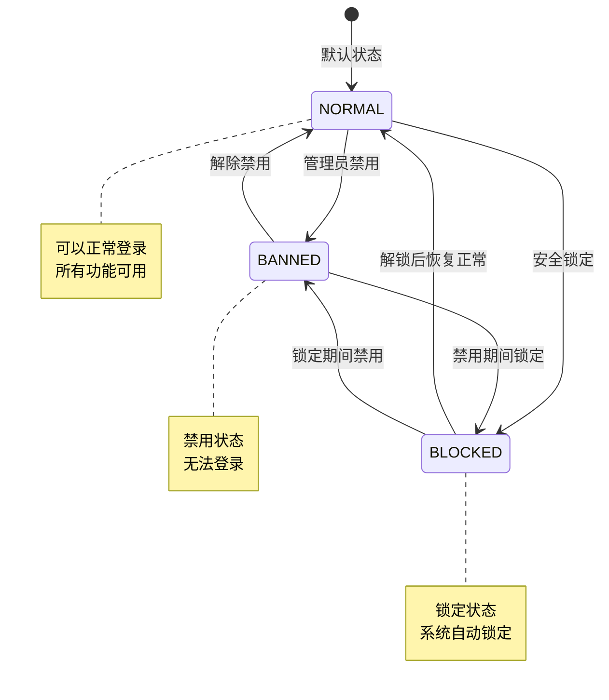
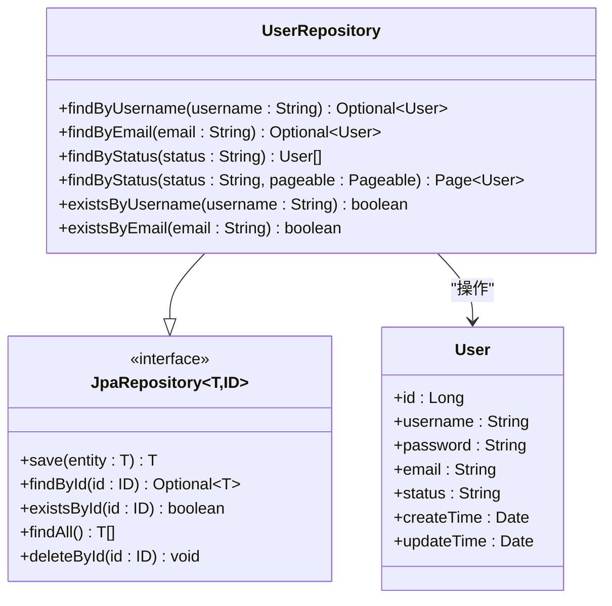
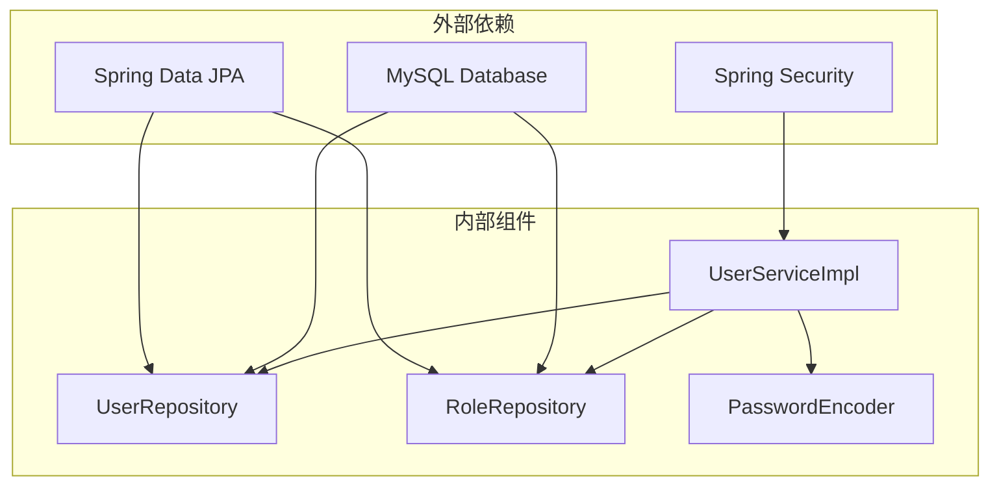
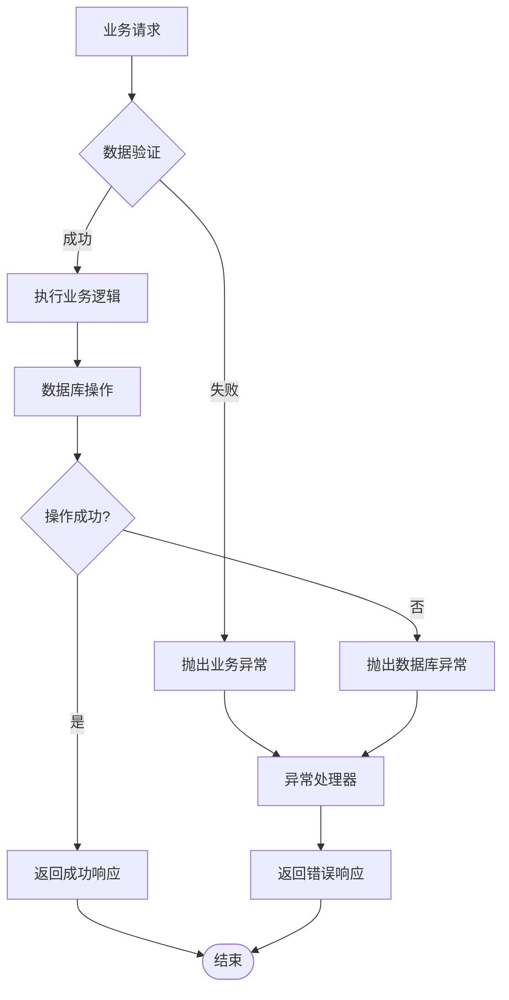

# 用户服务实现

<cite>
**本文档引用的文件**
- [UserServiceImpl.java](file://plugins/plugin-user/src/main/java/com/traffic/sim/plugin/user/service/UserServiceImpl.java)
- [UserServiceExt.java](file://plugins/plugin-user/src/main/java/com/traffic/sim/plugin/user/service/UserServiceExt.java)
- [User.java](file://plugins/plugin-user/src/main/java/com/traffic/sim/plugin/user/entity/User.java)
- [UserRepository.java](file://plugins/plugin-user/src/main/java/com/traffic/sim/plugin/user/repository/UserRepository.java)
- [UserStatus.java](file://traffic-sim-common/src/main/java/com/traffic/sim/common/constant/UserStatus.java)
- [UserCreateRequest.java](file://plugins/plugin-user/src/main/java/com/traffic/sim/plugin/user/dto/UserCreateRequest.java)
- [UserUpdateRequest.java](file://plugins/plugin-user/src/main/java/com/traffic/sim/plugin/user/dto/UserUpdateRequest.java)
- [UserController.java](file://plugins/plugin-user/src/main/java/com/traffic/sim/plugin/user/controller/UserController.java)
- [UserService.java](file://traffic-sim-common/src/main/java/com/traffic/sim/common/service/UserService.java)
- [BusinessException.java](file://traffic-sim-common/src/main/java/com/traffic/sim/common/exception/BusinessException.java)
- [UserDTO.java](file://traffic-sim-common/src/main/java/com/traffic/sim/common/dto/UserDTO.java)
</cite>

## 目录
1. [简介](#简介)
2. [项目结构](#项目结构)
3. [核心组件](#核心组件)
4. [架构概览](#架构概览)
5. [详细组件分析](#详细组件分析)
6. [依赖关系分析](#依赖关系分析)
7. [性能考虑](#性能考虑)
8. [故障排除指南](#故障排除指南)
9. [结论](#结论)

## 简介

本文档深入分析了交通仿真系统中的用户服务实现，重点涵盖了UserServiceImpl类的CRUD操作实现逻辑、UserServiceExt扩展接口的设计理念、密码加密策略（BCrypt）的应用以及用户状态管理的业务规则。该服务层采用Spring Boot框架构建，实现了完整的用户生命周期管理功能，包括用户创建、信息更新、密码修改和删除处理。

## 项目结构

用户服务相关的代码主要分布在以下目录结构中：

**图表来源**
- [UserServiceImpl.java](file://plugins/plugin-user/src/main/java/com/traffic/sim/plugin/user/service/UserServiceImpl.java#L1-L331)
- [UserServiceExt.java](file://plugins/plugin-user/src/main/java/com/traffic/sim/plugin/user/service/UserServiceExt.java#L1-L37)
- [User.java](file://plugins/plugin-user/src/main/java/com/traffic/sim/plugin/user/entity/User.java#L1-L66)

## 核心组件

### 用户服务实现类

UserServiceImpl是用户服务的核心实现类，它同时实现了两个接口：
- `UserService`：基础用户服务接口
- `UserServiceExt`：扩展用户服务接口，提供密码处理功能

该类采用了依赖注入模式，注入了以下关键组件：
- `UserRepository`：数据访问层接口，负责与数据库交互
- `RoleRepository`：角色数据访问层接口
- `PasswordEncoder`：密码编码器，用于密码加密

### 扩展服务接口设计

UserServiceExt接口的设计目的是将密码处理逻辑从基础UserService中分离出来，提供更加安全和明确的密码操作方法：

**图表来源**
- [UserServiceImpl.java](file://plugins/plugin-user/src/main/java/com/traffic/sim/plugin/user/service/UserServiceImpl.java#L38-L38)
- [UserServiceExt.java](file://plugins/plugin-user/src/main/java/com/traffic/sim/plugin/user/service/UserServiceExt.java#L14-L35)
- [UserService.java](file://traffic-sim-common/src/main/java/com/traffic/sim/common/service/UserService.java#L11-L42)

**章节来源**
- [UserServiceImpl.java](file://plugins/plugin-user/src/main/java/com/traffic/sim/plugin/user/service/UserServiceImpl.java#L38-L38)
- [UserServiceExt.java](file://plugins/plugin-user/src/main/java/com/traffic/sim/plugin/user/service/UserServiceExt.java#L8-L35)

## 架构概览

用户服务采用经典的三层架构设计，实现了清晰的职责分离：

**图表来源**
- [UserController.java](file://plugins/plugin-user/src/main/java/com/traffic/sim/plugin/user/controller/UserController.java#L37-L38)
- [UserServiceImpl.java](file://plugins/plugin-user/src/main/java/com/traffic/sim/plugin/user/service/UserServiceImpl.java#L40-L42)
- [UserRepository.java](file://plugins/plugin-user/src/main/java/com/traffic/sim/plugin/user/repository/UserRepository.java#L18-L48)

## 详细组件分析

### CRUD操作实现逻辑

#### 用户创建操作

UserServiceImpl的用户创建功能提供了两种实现方式：

1. **基础创建方法** (`createUser`)：适用于不需要密码的场景
2. **扩展创建方法** (`createUserWithPassword`)：提供完整的密码处理功能

**图表来源**
- [UserController.java](file://plugins/plugin-user/src/main/java/com/traffic/sim/plugin/user/controller/UserController.java#L65-L67)
- [UserServiceImpl.java](file://plugins/plugin-user/src/main/java/com/traffic/sim/plugin/user/service/UserServiceImpl.java#L192-L236)
- [UserRepository.java](file://plugins/plugin-user/src/main/java/com/traffic/sim/plugin/user/repository/UserRepository.java#L18-L48)

**章节来源**
- [UserServiceImpl.java](file://plugins/plugin-user/src/main/java/com/traffic/sim/plugin/user/service/UserServiceImpl.java#L58-L98)
- [UserServiceImpl.java](file://plugins/plugin-user/src/main/java/com/traffic/sim/plugin/user/service/UserServiceImpl.java#L190-L236)

#### 用户信息更新操作

用户信息更新功能支持多种字段的更新，并包含了完整的数据验证：

**图表来源**
- [UserServiceImpl.java](file://plugins/plugin-user/src/main/java/com/traffic/sim/plugin/user/service/UserServiceImpl.java#L240-L281)

**章节来源**
- [UserServiceImpl.java](file://plugins/plugin-user/src/main/java/com/traffic/sim/plugin/user/service/UserServiceImpl.java#L100-L141)
- [UserServiceImpl.java](file://plugins/plugin-user/src/main/java/com/traffic/sim/plugin/user/service/UserServiceImpl.java#L240-L281)

#### 用户删除操作

用户删除操作采用了软删除策略，确保数据的完整性和可恢复性：

**章节来源**
- [UserServiceImpl.java](file://plugins/plugin-user/src/main/java/com/traffic/sim/plugin/user/service/UserServiceImpl.java#L143-L151)

### 密码加密策略

#### BCrypt加密实现

系统采用了BCrypt密码哈希算法来确保密码的安全存储。密码加密在多个位置得到应用：

1. **用户创建时的密码加密**
2. **用户更新时的密码加密**
3. **独立的密码更新功能**

**图表来源**
- [UserServiceImpl.java](file://plugins/plugin-user/src/main/java/com/traffic/sim/plugin/user/service/UserServiceImpl.java#L22-L22)
- [UserServiceImpl.java](file://plugins/plugin-user/src/main/java/com/traffic/sim/plugin/user/service/UserServiceImpl.java#L214-L215)

**章节来源**
- [UserServiceImpl.java](file://plugins/plugin-user/src/main/java/com/traffic/sim/plugin/user/service/UserServiceImpl.java#L214-L218)
- [UserServiceImpl.java](file://plugins/plugin-user/src/main/java/com/traffic/sim/plugin/user/service/UserServiceImpl.java#L273-L275)
- [UserServiceImpl.java](file://plugins/plugin-user/src/main/java/com/traffic/sim/plugin/user/service/UserServiceImpl.java#L289-L291)

### 用户状态管理

#### 状态常量定义

系统定义了三种用户状态，每种状态都有特定的业务含义：

| 状态 | 常量名 | 描述 |
|------|--------|------|
| NORMAL | `UserStatus.NORMAL` | 正常状态，用户可以正常登录和使用系统 |
| BANNED | `UserStatus.BANNED` | 已禁用状态，用户被管理员禁用，无法登录 |
| BLOCKED | `UserStatus.BLOCKED` | 已锁定状态，用户因安全原因被系统自动锁定 |

#### 状态转换逻辑

用户状态管理遵循严格的业务规则：

**图表来源**
- [UserStatus.java](file://traffic-sim-common/src/main/java/com/traffic/sim/common/constant/UserStatus.java#L10-L17)

**章节来源**
- [UserStatus.java](file://traffic-sim-common/src/main/java/com/traffic/sim/common/constant/UserStatus.java#L8-L22)
- [UserServiceImpl.java](file://plugins/plugin-user/src/main/java/com/traffic/sim/plugin/user/service/UserServiceImpl.java#L161-L165)

### 服务层与数据访问层交互

#### 数据访问层设计

UserRepository接口继承了Spring Data JPA的JpaRepository，提供了丰富的数据访问方法：

**图表来源**
- [UserRepository.java](file://plugins/plugin-user/src/main/java/com/traffic/sim/plugin/user/repository/UserRepository.java#L18-L48)
- [User.java](file://plugins/plugin-user/src/main/java/com/traffic/sim/plugin/user/entity/User.java#L16-L49)

**章节来源**
- [UserRepository.java](file://plugins/plugin-user/src/main/java/com/traffic/sim/plugin/user/repository/UserRepository.java#L18-L48)

## 依赖关系分析

### 组件耦合度分析

用户服务层展现了良好的内聚性和低耦合性：

**图表来源**
- [UserServiceImpl.java](file://plugins/plugin-user/src/main/java/com/traffic/sim/plugin/user/service/UserServiceImpl.java#L22-L22)
- [UserRepository.java](file://plugins/plugin-user/src/main/java/com/traffic/sim/plugin/user/repository/UserRepository.java#L18-L48)

### 错误处理机制

系统采用了统一的业务异常处理机制：

**图表来源**
- [BusinessException.java](file://traffic-sim-common/src/main/java/com/traffic/sim/common/exception/BusinessException.java#L10-L31)

**章节来源**
- [BusinessException.java](file://traffic-sim-common/src/main/java/com/traffic/sim/common/exception/BusinessException.java#L10-L31)
- [UserServiceImpl.java](file://plugins/plugin-user/src/main/java/com/traffic/sim/plugin/user/service/UserServiceImpl.java#L46-L47)

## 性能考虑

### 数据库优化策略

1. **索引优化**：用户名和邮箱字段设置了唯一索引，确保查询效率
2. **分页查询**：用户列表查询支持分页，避免大数据量查询
3. **事务管理**：关键操作使用@Transactional注解，确保数据一致性

### 缓存策略

虽然当前实现没有显式的缓存机制，但可以考虑以下优化：
- 用户基本信息缓存
- 角色权限信息缓存
- 频繁访问的统计数据缓存

## 故障排除指南

### 常见问题及解决方案

#### 用户名重复错误
**问题描述**：创建用户时提示用户名已存在
**解决方法**：检查用户名唯一性约束，确保用户名的唯一性

#### 邮箱重复错误  
**问题描述**：更新用户邮箱时提示邮箱已被使用
**解决方法**：检查邮箱唯一性约束，确保邮箱的唯一性

#### 密码验证失败
**问题描述**：用户登录时密码验证失败
**解决方法**：检查密码加密算法，确认密码匹配逻辑

#### 用户状态异常
**问题描述**：用户无法登录，提示状态异常
**解决方法**：检查用户状态字段，确保状态为NORMAL

**章节来源**
- [UserServiceImpl.java](file://plugins/plugin-user/src/main/java/com/traffic/sim/plugin/user/service/UserServiceImpl.java#L62-L71)
- [UserServiceImpl.java](file://plugins/plugin-user/src/main/java/com/traffic/sim/plugin/user/service/UserServiceImpl.java#L107-L113)
- [UserServiceImpl.java](file://plugins/plugin-user/src/main/java/com/traffic/sim/plugin/user/service/UserServiceImpl.java#L161-L165)

## 结论

用户服务实现展现了现代Java企业级应用的最佳实践：

1. **清晰的架构设计**：采用分层架构，职责分离明确
2. **安全的密码处理**：使用BCrypt算法确保密码安全
3. **完善的异常处理**：统一的业务异常处理机制
4. **灵活的状态管理**：支持用户状态的动态转换
5. **良好的扩展性**：通过接口分离核心功能和扩展功能

该实现为整个交通仿真系统的用户管理提供了坚实的基础，支持未来功能的扩展和维护。