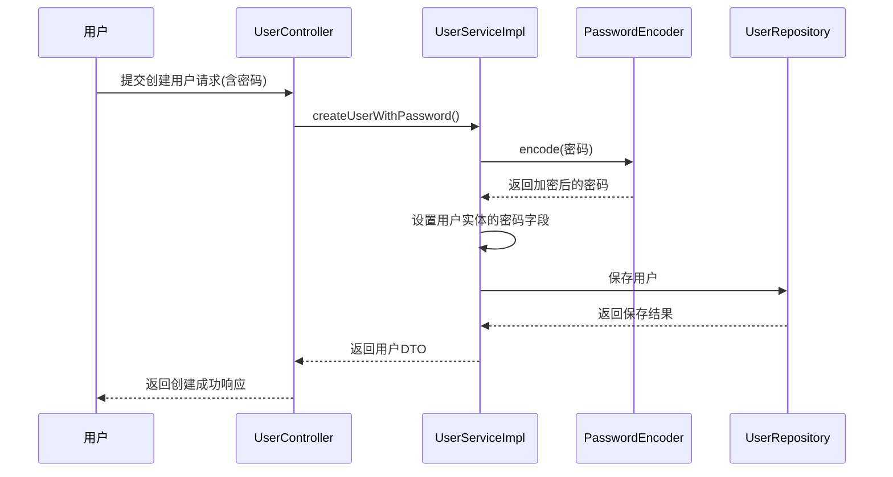
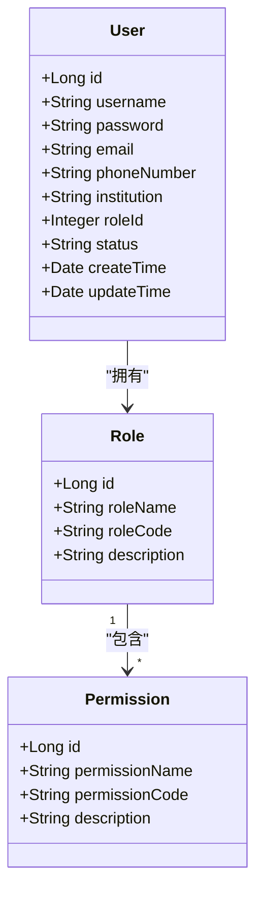
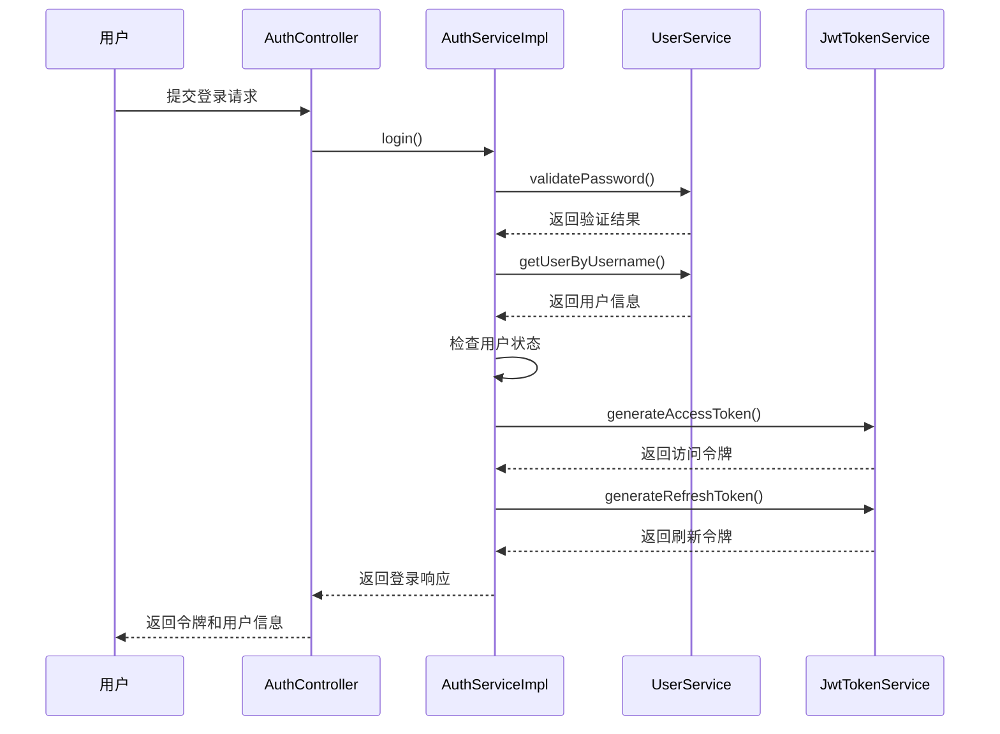

# 用户管理

<cite>
**本文档引用的文件**   
- [User.java](file://plugins/plugin-user/src/main/java/com/traffic/sim/plugin/user/entity/User.java)
- [Role.java](file://plugins/plugin-user/src/main/java/com/traffic/sim/plugin/user/entity/Role.java)
- [Permission.java](file://plugins/plugin-user/src/main/java/com/traffic/sim/plugin/user/entity/Permission.java)
- [UserServiceImpl.java](file://plugins/plugin-user/src/main/java/com/traffic/sim/plugin/user/service/UserServiceImpl.java)
- [UserController.java](file://plugins/plugin-user/src/main/java/com/traffic/sim/plugin/user/controller/UserController.java)
- [UserCreateRequest.java](file://plugins/plugin-user/src/main/java/com/traffic/sim/plugin/user/dto/UserCreateRequest.java)
- [UserUpdateRequest.java](file://plugins/plugin-user/src/main/java/com/traffic/sim/plugin/user/dto/UserUpdateRequest.java)
- [UserRepository.java](file://plugins/plugin-user/src/main/java/com/traffic/sim/plugin/user/repository/UserRepository.java)
- [RoleRepository.java](file://plugins/plugin-user/src/main/java/com/traffic/sim/plugin/user/repository/RoleRepository.java)
- [UserStatus.java](file://traffic-sim-common/src/main/java/com/traffic/sim/common/constant/UserStatus.java)
- [UserDTO.java](file://traffic-sim-common/src/main/java/com/traffic/sim/common/dto/UserDTO.java)
- [UserService.java](file://traffic-sim-common/src/main/java/com/traffic/sim/common/service/UserService.java)
- [AuthService.java](file://traffic-sim-common/src/main/java/com/traffic/sim/common/service/AuthService.java)
- [AuthServiceImpl.java](file://plugins/plugin-auth/src/main/java/com/traffic/sim/plugin/auth/service/AuthServiceImpl.java)
- [JwtTokenService.java](file://plugins/plugin-auth/src/main/java/com/traffic/sim/plugin/auth/service/JwtTokenService.java)
- [application.yml](file://plugins/plugin-user/src/main/resources/application.yml)
</cite>

## 目录
1. [用户实体数据模型](#用户实体数据模型)
2. [用户服务CRUD操作](#用户服务crud操作)
3. [密码加密策略](#密码加密策略)
4. [用户管理API端点](#用户管理api端点)
5. [角色与权限管理](#角色与权限管理)
6. [用户状态管理](#用户状态管理)
7. [与认证模块的集成](#与认证模块的集成)

## 用户实体数据模型

用户实体（User）是系统中的核心数据模型，用于存储用户的基本信息和状态。该实体通过JPA注解映射到数据库表"user"，包含以下字段：

- **id**: 用户唯一标识符，自增主键
- **username**: 用户名，非空且唯一，长度限制为50个字符
- **password**: 密码，非空，长度限制为255个字符，存储加密后的密码
- **email**: 邮箱，长度限制为100个字符，用于用户联系和验证
- **phoneNumber**: 电话号码，长度限制为20个字符
- **institution**: 所属机构，长度限制为200个字符
- **roleId**: 角色ID，关联到角色表，用于权限控制
- **status**: 用户状态，非空，长度限制为20个字符，表示用户当前状态
- **createTime**: 创建时间，非空，记录用户创建时间，不可更新
- **updateTime**: 更新时间，记录用户信息最后更新时间

用户实体在创建和更新时会自动设置时间戳。`@PrePersist`注解的方法会在实体持久化前自动执行，设置创建时间和更新时间，并为新用户设置默认状态为"NORMAL"。`@PreUpdate`注解的方法会在实体更新前自动执行，更新更新时间字段。

**Section sources**
- [User.java](file://plugins/plugin-user/src/main/java/com/traffic/sim/plugin/user/entity/User.java#L1-L66)

## 用户服务CRUD操作

用户服务（UserService）提供了完整的CRUD（创建、读取、更新、删除）操作，通过`UserServiceImpl`类实现。服务接口分为两个部分：`UserService`和`UserServiceExt`。

`UserService`是定义在`traffic-sim-common`模块中的公共接口，提供基本的用户操作：
- `getUserById`: 根据用户ID获取用户信息
- `getUserByUsername`: 根据用户名获取用户信息
- `createUser`: 创建用户（不包含密码处理）
- `updateUser`: 更新用户信息（不包含密码处理）
- `deleteUser`: 删除用户
- `validatePassword`: 验证用户密码

`UserServiceExt`是用户插件特有的扩展接口，提供带密码处理的用户操作：
- `createUserWithPassword`: 创建用户并设置密码
- `updateUserWithPassword`: 更新用户信息并可选择更新密码
- `updatePassword`: 单独更新用户密码
- `getUserList`: 分页获取用户列表

创建用户时，服务会检查用户名和邮箱的唯一性，防止重复注册。更新用户时，会验证邮箱的唯一性（如果提供了新邮箱），并验证角色是否存在。删除用户前会检查用户是否存在，确保操作的安全性。

**Section sources**
- [UserServiceImpl.java](file://plugins/plugin-user/src/main/java/com/traffic/sim/plugin/user/service/UserServiceImpl.java#L35-L331)
- [UserService.java](file://traffic-sim-common/src/main/java/com/traffic/sim/common/service/UserService.java#L11-L44)
- [UserServiceExt.java](file://plugins/plugin-user/src/main/java/com/traffic/sim/plugin/user/service/UserServiceExt.java#L14-L37)

## 密码加密策略

系统采用BCrypt加密算法对用户密码进行安全存储。密码加密由Spring Security的`PasswordEncoder`组件处理，在`UserServiceImpl`中注入并使用。

密码加密策略的主要特点：
- 使用BCrypt哈希算法，具有盐值（salt）自动生成和存储的特性
- 加密过程在`createUserWithPassword`和`updatePassword`等方法中自动执行
- 密码验证通过`validatePassword`方法完成，比较输入密码与存储的哈希值
- 配置文件中指定密码加密方式为BCrypt

当创建或更新用户密码时，系统会调用`passwordEncoder.encode()`方法对明文密码进行加密，然后将加密后的字符串存储在数据库中。验证密码时，使用`passwordEncoder.matches()`方法比较明文密码与存储的哈希值是否匹配。



**Diagram sources**
- [UserServiceImpl.java](file://plugins/plugin-user/src/main/java/com/traffic/sim/plugin/user/service/UserServiceImpl.java#L42)
- [application.yml](file://plugins/plugin-user/src/main/resources/application.yml#L6)

**Section sources**
- [UserServiceImpl.java](file://plugins/plugin-user/src/main/java/com/traffic/sim/plugin/user/service/UserServiceImpl.java#L42)
- [application.yml](file://plugins/plugin-user/src/main/resources/application.yml#L6)

## 用户管理API端点

用户管理提供了一系列RESTful API端点，通过`UserController`类实现，所有端点位于`/api/user`路径下。

### 创建用户
- **端点**: `POST /api/user`
- **请求体**: `UserCreateRequest` DTO
- **请求示例**:
```json
{
  "username": "john_doe",
  "password": "secure_password123",
  "email": "john@example.com",
  "phoneNumber": "13800138000",
  "institution": "交通研究所",
  "roleId": 1
}
```
- **响应**: `ApiResponse<UserDTO>`，包含创建的用户信息

### 获取用户信息
- **端点**: `GET /api/user/{id}`
- **路径参数**: 用户ID
- **响应**: `ApiResponse<UserDTO>`，包含用户详细信息

### 根据用户名获取用户
- **端点**: `GET /api/user/username/{username}`
- **路径参数**: 用户名
- **响应**: `ApiResponse<UserDTO>`，包含用户详细信息

### 更新用户信息
- **端点**: `PUT /api/user/{id}`
- **路径参数**: 用户ID
- **请求体**: `UserUpdateRequest` DTO
- **请求示例**:
```json
{
  "password": "new_secure_password",
  "email": "john_new@example.com",
  "phoneNumber": "13900139000",
  "institution": "交通研究中心",
  "roleId": 2,
  "status": "NORMAL"
}
```
- **响应**: `ApiResponse<UserDTO>`，包含更新后的用户信息

### 更新用户密码
- **端点**: `PUT /api/user/{id}/password`
- **路径参数**: 用户ID
- **查询参数**: `newPassword`
- **响应**: `ApiResponse<String>`，包含操作成功消息

### 删除用户
- **端点**: `DELETE /api/user/{id}`
- **路径参数**: 用户ID
- **响应**: `ApiResponse<String>`，包含操作成功消息

### 获取用户列表
- **端点**: `GET /api/user/list`
- **查询参数**: 
  - `page`: 页码（默认为1）
  - `size`: 每页大小（默认为10）
  - `status`: 用户状态（可选，用于过滤）
- **响应**: `ApiResponse<PageResult<UserDTO>>`，包含分页的用户列表

所有API端点都使用`ApiResponse`包装响应，确保统一的响应格式。请求DTO使用JSR-303验证注解进行输入验证，确保数据的完整性和安全性。

**Section sources**
- [UserController.java](file://plugins/plugin-user/src/main/java/com/traffic/sim/plugin/user/controller/UserController.java#L30-L119)
- [UserCreateRequest.java](file://plugins/plugin-user/src/main/java/com/traffic/sim/plugin/user/dto/UserCreateRequest.java#L1-L34)
- [UserUpdateRequest.java](file://plugins/plugin-user/src/main/java/com/traffic/sim/plugin/user/dto/UserUpdateRequest.java#L1-L30)

## 角色与权限管理

系统采用基于角色的访问控制（RBAC）模型进行权限管理，包含角色（Role）和权限（Permission）两个核心实体。

### 角色实体（Role）
角色实体包含以下字段：
- **id**: 角色唯一标识符
- **roleName**: 角色名称，非空，长度限制为50个字符
- **roleCode**: 角色代码，非空、唯一，长度限制为50个字符，用于程序中引用
- **description**: 角色描述，长度限制为500个字符
- **permissions**: 权限列表，与权限实体建立多对多关系

### 权限实体（Permission）
权限实体包含以下字段：
- **id**: 权限唯一标识符
- **permissionName**: 权限名称，非空，长度限制为100个字符
- **permissionCode**: 权限代码，非空、唯一，长度限制为100个字符，用于程序中引用
- **description**: 权限描述，长度限制为500个字符

角色与权限之间通过`role_permission`关联表建立多对多关系。一个角色可以拥有多个权限，一个权限也可以被多个角色拥有。这种设计提供了灵活的权限分配机制。

在认证过程中，系统根据用户的角色动态生成权限列表。例如，管理员角色（ADMIN）拥有用户管理的所有权限，而普通用户角色（USER）只能查询用户信息。权限信息存储在JWT令牌中，供后续的权限验证使用。



**Diagram sources**
- [Role.java](file://plugins/plugin-user/src/main/java/com/traffic/sim/plugin/user/entity/Role.java#L1-L40)
- [Permission.java](file://plugins/plugin-user/src/main/java/com/traffic/sim/plugin/user/entity/Permission.java#L1-L30)

**Section sources**
- [Role.java](file://plugins/plugin-user/src/main/java/com/traffic/sim/plugin/user/entity/Role.java#L1-L40)
- [Permission.java](file://plugins/plugin-user/src/main/java/com/traffic/sim/plugin/user/entity/Permission.java#L1-L30)
- [RoleRepository.java](file://plugins/plugin-user/src/main/java/com/traffic/sim/plugin/user/repository/RoleRepository.java#L1-L28)

## 用户状态管理

用户状态管理是系统安全的重要组成部分，通过`UserStatus`常量类定义了用户可能的状态值。当前系统定义了三种用户状态：

- **NORMAL**: 正常状态，用户可以正常登录和使用系统
- **BANNED**: 已禁用状态，用户被禁止访问系统
- **BLOCKED**: 已锁定状态，用户账户被临时锁定

用户状态在用户实体中以字符串形式存储，并在多个服务中进行验证。当用户尝试登录时，认证服务会检查用户状态，只有状态为"NORMAL"的用户才能成功登录。这为系统管理员提供了灵活的用户管理能力，可以根据需要禁用或锁定用户账户。

在用户服务中，更新用户状态需要通过`UserUpdateRequest`的`status`字段进行，系统会验证提供的状态值是否有效。创建新用户时，如果没有指定状态，系统会自动设置为默认状态"NORMAL"。

用户状态管理与认证模块紧密集成，确保只有状态正常的用户才能获得访问令牌。这种设计增强了系统的安全性，防止被禁用或锁定的用户继续访问系统资源。

**Section sources**
- [UserStatus.java](file://traffic-sim-common/src/main/java/com/traffic/sim/common/constant/UserStatus.java#L8-L24)
- [User.java](file://plugins/plugin-user/src/main/java/com/traffic/sim/plugin/user/entity/User.java#L40-L41)
- [UserServiceImpl.java](file://plugins/plugin-user/src/main/java/com/traffic/sim/plugin/user/service/UserServiceImpl.java#L81-L83)

## 与认证模块的集成

用户管理模块与认证模块（plugin-auth）紧密集成，共同实现系统的安全控制。这种集成主要体现在以下几个方面：

### 认证流程集成
当用户登录时，认证服务（`AuthServiceImpl`）会调用用户服务的`validatePassword`方法验证用户名和密码。验证通过后，再检查用户状态是否为"ACTIVE"（在认证模块中使用"ACTIVE"而非"NORMAL"，这可能需要统一）。如果所有验证通过，认证服务生成JWT访问令牌和刷新令牌。



**Diagram sources**
- [AuthServiceImpl.java](file://plugins/plugin-auth/src/main/java/com/traffic/sim/plugin/auth/service/AuthServiceImpl.java#L29-L263)
- [JwtTokenService.java](file://plugins/plugin-auth/src/main/java/com/traffic/sim/plugin/auth/service/JwtTokenService.java#L25-L118)

### 注册流程集成
用户注册时，认证服务调用用户服务的`createUser`方法创建用户。注册请求中的密码由认证服务验证强度后，传递给用户服务进行加密存储。

### 权限集成
用户服务在转换`User`实体到`UserDTO`时，会从角色存储中获取角色名称并设置到DTO中。认证服务在生成令牌时，根据用户角色动态生成权限列表，这些权限信息随令牌一起发送给客户端，用于前端的权限控制。

### 接口定义
两个模块通过`traffic-sim-common`模块中的公共接口进行通信：
- `UserService`: 用户管理接口
- `AuthService`: 认证服务接口
- `UserDTO`: 用户数据传输对象
- `TokenInfo`: 令牌信息对象

这种模块化设计确保了系统的可维护性和可扩展性，同时通过接口隔离了模块间的直接依赖。

**Section sources**
- [AuthServiceImpl.java](file://plugins/plugin-auth/src/main/java/com/traffic/sim/plugin/auth/service/AuthServiceImpl.java#L29-L263)
- [UserService.java](file://traffic-sim-common/src/main/java/com/traffic/sim/common/service/UserService.java#L11-L44)
- [AuthService.java](file://traffic-sim-common/src/main/java/com/traffic/sim/common/service/AuthService.java#L13-L41)
- [UserDTO.java](file://traffic-sim-common/src/main/java/com/traffic/sim/common/dto/UserDTO.java#L13-L30)