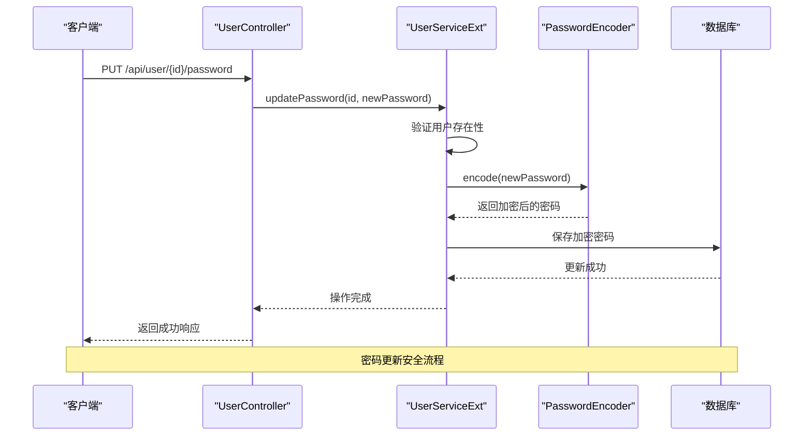
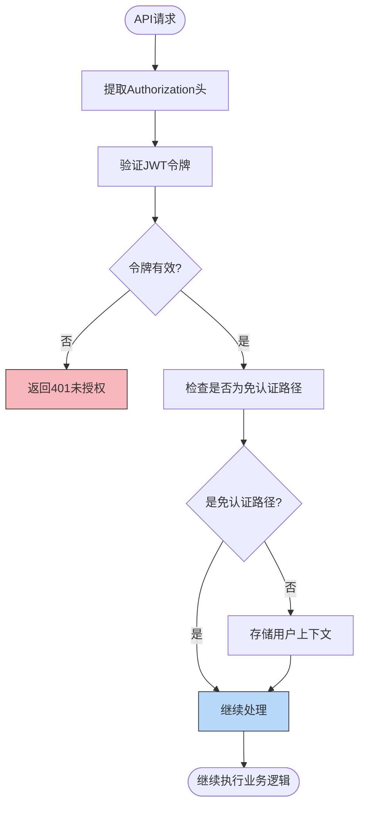

# 更新用户

<cite>
**本文档引用的文件**
- [UserController.java](file://plugins/plugin-user/src/main/java/com/traffic/sim/plugin/user/controller/UserController.java)
- [UserUpdateRequest.java](file://plugins/plugin-user/src/main/java/com/traffic/sim/plugin/user/dto/UserUpdateRequest.java)
- [User.java](file://plugins/plugin-user/src/main/java/com/traffic/sim/plugin/user/entity/User.java)
- [UserServiceImpl.java](file://plugins/plugin-user/src/main/java/com/traffic/sim/plugin/user/service/UserServiceImpl.java)
- [AuthenticationInterceptor.java](file://plugins/plugin-auth/src/main/java/com/traffic/sim/plugin/auth/interceptor/AuthenticationInterceptor.java)
- [PermissionInterceptor.java](file://plugins/plugin-auth/src/main/java/com/traffic/sim/plugin/auth/interceptor/PermissionInterceptor.java)
- [JwtTokenService.java](file://plugins/plugin-auth/src/main/java/com/traffic/sim/plugin/auth/service/JwtTokenService.java)
- [UserStatus.java](file://traffic-sim-common/src/main/java/com/traffic/sim/common/constant/UserStatus.java)
</cite>

## 目录
1. [简介](#简介)
2. [API端点说明](#api端点说明)
3. [数据传输对象详解](#数据传输对象详解)
4. [密码更新安全机制](#密码更新安全机制)
5. [请求示例](#请求示例)
6. [认证与权限控制](#认证与权限控制)
7. [数据一致性保障](#数据一致性保障)

## 简介
本文档详细说明了交通仿真系统中用户更新API的实现细节。重点描述了`PUT /api/user/{id}`和`PUT /api/user/{id}/password`两个端点的功能、参数、响应格式及安全机制。文档还深入解析了用户更新请求的数据结构、验证规则和更新逻辑，为开发者和系统管理员提供完整的接口使用指南。

## API端点说明

### 更新用户信息 (PUT /api/user/{id})
该端点用于更新指定用户的基本信息。

**HTTP方法**: PUT  
**URL路径**: `/api/user/{id}`  
**功能描述**: 更新指定用户ID的用户信息，支持部分字段更新。

**请求参数**:
- `id` (路径参数): 用户ID，类型为Long，必填

**请求体**:
- 内容类型: `application/json`
- 数据结构: `UserUpdateRequest` DTO

**响应格式**:
- 状态码: 200 (成功)
- 响应体: `ApiResponse<UserDTO>` 格式，包含更新后的用户信息

**Section sources**
- [UserController.java](file://plugins/plugin-user/src/main/java/com/traffic/sim/plugin/user/controller/UserController.java#L73-L80)

### 更新用户密码 (PUT /api/user/{id}/password)
该端点专门用于更新指定用户的密码。

**HTTP方法**: PUT  
**URL路径**: `/api/user/{id}/password`  
**功能描述**: 仅更新指定用户的密码，不涉及其他用户信息。

**请求参数**:
- `id` (路径参数): 用户ID，类型为Long，必填
- `newPassword` (查询参数): 新密码，类型为String，必填

**响应格式**:
- 状态码: 200 (成功)
- 响应体: `ApiResponse<String>` 格式，包含操作成功消息

**Section sources**
- [UserController.java](file://plugins/plugin-user/src/main/java/com/traffic/sim/plugin/user/controller/UserController.java#L85-L92)

## 数据传输对象详解

### UserUpdateRequest 字段定义
`UserUpdateRequest` 数据传输对象定义了用户信息更新时可修改的字段。

**字段说明**:

| 字段名 | 类型 | 可选性 | 验证规则 | 更新逻辑 |
|-------|------|-------|---------|---------|
| password | String | 可选 | 长度6-100个字符 | 提供时更新密码，自动加密存储 |
| email | String | 可选 | 必须符合邮箱格式 | 更新前检查邮箱唯一性 |
| phoneNumber | String | 可选 | 无特殊格式要求 | 直接更新 |
| institution | String | 可选 | 无特殊格式要求 | 直接更新 |
| roleId | Integer | 可选 | 对应角色必须存在 | 更新前验证角色ID有效性 |
| status | String | 可选 | 必须是有效状态值 | 更新用户状态 |

**验证规则**:
- 密码长度必须在6-100个字符之间
- 邮箱必须符合标准邮箱格式
- 角色ID必须对应系统中存在的角色
- 状态值必须是系统定义的有效状态（如NORMAL, BANNED, BLOCKED）

**更新逻辑**:
- 仅更新请求中提供的字段，未提供的字段保持不变
- 邮箱更新时会检查唯一性，防止重复
- 角色更新时会验证角色存在性
- 更新时间字段会自动更新为当前时间

**Section sources**
- [UserUpdateRequest.java](file://plugins/plugin-user/src/main/java/com/traffic/sim/plugin/user/dto/UserUpdateRequest.java#L13-L28)
- [UserServiceImpl.java](file://plugins/plugin-user/src/main/java/com/traffic/sim/plugin/user/service/UserServiceImpl.java#L240-L280)

## 密码更新安全机制

### 安全实现方式
系统采用多层次的安全机制来保障密码更新的安全性。

**密码加密**:
- 使用Spring Security的`PasswordEncoder`对密码进行哈希加密
- 采用BCrypt算法，确保密码存储安全
- 每次密码更新都生成新的盐值，防止彩虹表攻击

**密码验证规则**:
- 密码长度至少6个字符，最多100个字符
- 无复杂度强制要求，但建议使用强密码
- 空密码或null值会被拒绝

**更新流程**:
1. 验证用户身份（通过JWT令牌）
2. 检查新密码是否为空
3. 使用密码编码器加密新密码
4. 更新数据库中的密码哈希值
5. 记录操作日志

**安全特性**:
- 密码在传输过程中通过HTTPS加密
- 密码在存储时永不以明文形式存在
- 密码更新操作有完整的审计日志
- 失败的密码更新尝试会被记录用于安全分析



**Diagram sources**
- [UserServiceImpl.java](file://plugins/plugin-user/src/main/java/com/traffic/sim/plugin/user/service/UserServiceImpl.java#L283-L296)
- [JwtTokenService.java](file://plugins/plugin-auth/src/main/java/com/traffic/sim/plugin/auth/service/JwtTokenService.java#L25-L63)

## 请求示例

### 完整用户信息更新
```bash
curl -X PUT "http://localhost:8080/api/user/1" \
  -H "Authorization: Bearer your-jwt-token" \
  -H "Content-Type: application/json" \
  -d '{
    "email": "user@example.com",
    "phoneNumber": "13800138000",
    "institution": "交通研究院",
    "roleId": 2,
    "status": "NORMAL"
  }'
```

### 部分更新场景（仅更新邮箱和电话）
```bash
curl -X PUT "http://localhost:8080/api/user/1" \
  -H "Authorization: Bearer your-jwt-token" \
  -H "Content-Type: application/json" \
  -d '{
    "email": "newemail@example.com",
    "phoneNumber": "13900139000"
  }'
```

### 仅更新密码
```bash
curl -X PUT "http://localhost:8080/api/user/1/password?newPassword=newSecurePassword123" \
  -H "Authorization: Bearer your-jwt-token"
```

### 成功响应示例
```json
{
  "code": 200,
  "message": "用户更新成功",
  "data": {
    "id": 1,
    "username": "testuser",
    "email": "user@example.com",
    "phoneNumber": "13800138000",
    "institution": "交通研究院",
    "roleId": 2,
    "roleName": "管理员",
    "status": "NORMAL",
    "createTime": "2024-01-01T10:00:00",
    "updateTime": "2024-01-02T14:30:00"
  }
}
```

**Section sources**
- [UserController.java](file://plugins/plugin-user/src/main/java/com/traffic/sim/plugin/user/controller/UserController.java#L73-L92)

## 认证与权限控制

### 认证机制
系统采用JWT（JSON Web Token）进行用户认证。

**认证流程**:
- 所有API请求必须在`Authorization`头中包含有效的JWT令牌
- 令牌格式为`Bearer <token>`
- 令牌包含用户ID、用户名、角色和权限信息
- 令牌有效期由系统配置决定

**认证拦截器**:
- `AuthenticationInterceptor`负责验证JWT令牌
- 无效或过期的令牌会被拒绝
- 认证通过后，用户信息存入请求上下文



**Diagram sources**
- [AuthenticationInterceptor.java](file://plugins/plugin-auth/src/main/java/com/traffic/sim/plugin/auth/interceptor/AuthenticationInterceptor.java#L29-L76)
- [JwtTokenService.java](file://plugins/plugin-auth/src/main/java/com/traffic/sim/plugin/auth/service/JwtTokenService.java#L25-L63)

### 权限控制要求
系统实现了基于角色和权限的访问控制。

**权限注解**:
- `@RequireRole`: 要求特定角色才能访问
- `@RequirePermission`: 要求特定权限才能访问

**权限验证流程**:
1. 提取当前用户的角色和权限
2. 检查方法或类上的权限注解
3. 验证用户是否具有所需角色或权限
4. 无权限则返回403禁止访问

**权限级别**:
- 普通用户: 只能更新自己的信息
- 管理员: 可以更新任何用户的信息
- 系统管理员: 具有最高权限

**Section sources**
- [PermissionInterceptor.java](file://plugins/plugin-auth/src/main/java/com/traffic/sim/plugin/auth/interceptor/PermissionInterceptor.java#L29-L85)
- [RequireRole.java](file://plugins/plugin-auth/src/main/java/com/traffic/sim/plugin/auth/annotation/RequireRole.java#L14-L22)

## 数据一致性保障

### 事务管理
所有用户更新操作都在数据库事务中执行，确保数据一致性。

**事务特性**:
- 使用`@Transactional`注解标记服务方法
- 操作失败时自动回滚
- 防止部分更新导致的数据不一致

### 数据验证
系统在多个层面进行数据验证：

**前端验证**: 基本格式验证  
**传输层验证**: 使用Jakarta Bean Validation  
**业务层验证**: 业务规则验证（如邮箱唯一性）  
**持久层验证**: 数据库约束验证

### 时间戳管理
用户实体包含自动管理的时间戳字段：

- `createTime`: 创建时间，插入时自动生成
- `updateTime`: 更新时间，每次更新时自动刷新
- 使用`@PrePersist`和`@PreUpdate`注解实现

### 错误处理
系统采用统一的错误处理机制：

- 使用`GlobalExceptionHandler`处理异常
- 返回标准化的错误响应格式
- 记录详细的错误日志用于排查

**Section sources**
- [User.java](file://plugins/plugin-user/src/main/java/com/traffic/sim/plugin/user/entity/User.java#L51-L63)
- [UserServiceImpl.java](file://plugins/plugin-user/src/main/java/com/traffic/sim/plugin/user/service/UserServiceImpl.java#L59-L64)