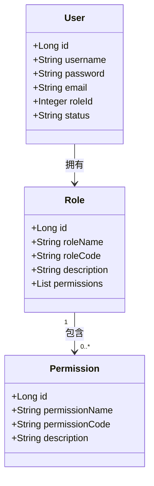
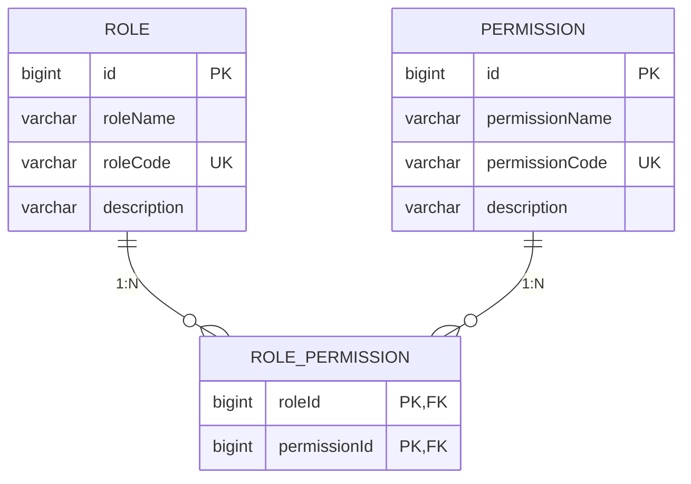
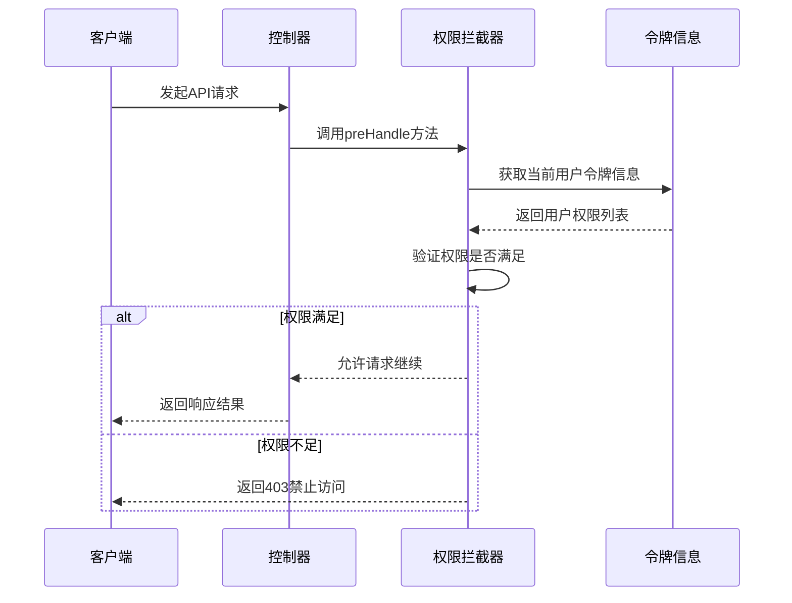
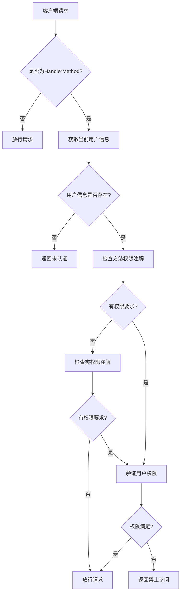

# 权限管理

<cite>
**本文档引用的文件**  
- [Permission.java](file://plugins/plugin-user/src/main/java/com/traffic/sim/plugin/user/entity/Permission.java)
- [Role.java](file://plugins/plugin-user/src/main/java/com/traffic/sim/plugin/user/entity/Role.java)
- [User.java](file://plugins/plugin-user/src/main/java/com/traffic/sim/plugin/user/entity/User.java)
- [RequirePermission.java](file://plugins/plugin-auth/src/main/java/com/traffic/sim/plugin/auth/annotation/RequirePermission.java)
- [PermissionInterceptor.java](file://plugins/plugin-auth/src/main/java/com/traffic/sim/plugin/auth/interceptor/PermissionInterceptor.java)
- [init.sql](file://infrastructure/init.sql)
- [MapPermissionService.java](file://plugins/plugin-map/src/main/java/com/traffic/sim/plugin/map/service/MapPermissionService.java)
</cite>

## 目录
1. [简介](#简介)
2. [权限实体设计](#权限实体设计)
3. [权限与角色的多对多关系](#权限与角色的多对多关系)
4. [权限管理API接口](#权限管理api接口)
5. [使用示例](#使用示例)
6. [最佳实践与注意事项](#最佳实践与注意事项)
7. [权限验证机制](#权限验证机制)
8. [结论](#结论)

## 简介
本系统采用基于角色的访问控制（RBAC）模型实现权限管理，通过权限实体、角色实体和用户实体的三层结构来管理系统的访问控制。权限系统支持细粒度的权限控制，允许为不同角色分配不同的权限，并通过注解方式在控制器层面进行权限验证。

## 权限实体设计
权限实体（Permission）是权限管理系统的核心数据结构，用于定义系统中的各种操作权限。该实体包含四个主要字段：id、permissionName、permissionCode和description。

**权限实体字段说明：**
- **id**: 权限的唯一标识符，采用数据库自增主键策略生成
- **permissionName**: 权限名称，用于显示在用户界面中，长度限制为100个字符，不能为空
- **permissionCode**: 权限代码，作为权限的唯一标识符，长度限制为100个字符，不能为空且必须唯一
- **description**: 权限描述，用于说明权限的具体用途和范围，长度限制为500个字符

权限实体通过JPA注解映射到数据库的`permission`表，其中`permission_code`字段具有唯一约束，确保每个权限代码在整个系统中都是唯一的。



**图源**
- [Permission.java](file://plugins/plugin-user/src/main/java/com/traffic/sim/plugin/user/entity/Permission.java#L1-L29)
- [Role.java](file://plugins/plugin-user/src/main/java/com/traffic/sim/plugin/user/entity/Role.java#L1-L38)
- [User.java](file://plugins/plugin-user/src/main/java/com/traffic/sim/plugin/user/entity/User.java#L1-L66)

**本节来源**
- [Permission.java](file://plugins/plugin-user/src/main/java/com/traffic/sim/plugin/user/entity/Permission.java#L1-L29)
- [init.sql](file://infrastructure/init.sql#L58-L66)

## 权限与角色的多对多关系
系统通过角色（Role）实体实现权限的分组管理，每个角色可以拥有多个权限，而每个权限也可以被分配给多个角色，形成多对多的关系。这种设计模式提高了权限管理的灵活性和可维护性。

### 关系实现机制
权限与角色的多对多关系通过JPA的`@ManyToMany`注解实现，具体配置如下：
- 使用`@JoinTable`注解指定关联表的名称为`role_permission`
- `joinColumns`指定角色表的外键`role_id`
- `inverseJoinColumns`指定权限表的外键`permission_id`

数据库层面，该关系由`role_permission`关联表实现，该表的复合主键由`role_id`和`permission_id`组成，确保每个角色-权限组合的唯一性。

### 默认权限配置
系统在初始化时通过`init.sql`脚本预置了基础的权限和角色配置：
- **默认权限**：用户管理(USER_MANAGE)、地图管理(MAP_MANAGE)、仿真管理(SIMULATION_MANAGE)、回放管理(REPLAY_MANAGE)、系统配置(SYSTEM_CONFIG)
- **默认角色**：管理员(ADMIN)、普通用户(USER)、研究员(RESEARCHER)
- **权限分配**：管理员角色被授予所有权限，其他角色根据需要分配相应权限



**图源**
- [Role.java](file://plugins/plugin-user/src/main/java/com/traffic/sim/plugin/user/entity/Role.java#L31-L37)
- [init.sql](file://infrastructure/init.sql#L71-L78)

**本节来源**
- [Role.java](file://plugins/plugin-user/src/main/java/com/traffic/sim/plugin/user/entity/Role.java#L31-L37)
- [init.sql](file://infrastructure/init.sql#L45-L78)

## 权限管理API接口
虽然系统目前没有提供专门的权限管理控制器，但权限的创建、更新、删除和查询操作可以通过数据库脚本和系统初始化过程来实现。权限信息在用户登录时被加载到JWT令牌中，供后续的权限验证使用。

### 权限操作实现
- **权限创建**：通过SQL脚本或数据库管理工具向`permission`表插入新记录
- **权限更新**：更新`permission`表中现有记录的字段值
- **权限删除**：从`permission`表中删除记录，同时需要清理`role_permission`关联表中的相关记录
- **权限查询**：通过`RoleRepository`获取角色及其关联的权限列表

### 权限验证API
系统提供了基于注解的权限验证机制，开发者可以在控制器方法上使用`@RequirePermission`注解来声明所需的权限。



**图源**
- [PermissionInterceptor.java](file://plugins/plugin-auth/src/main/java/com/traffic/sim/plugin/auth/interceptor/PermissionInterceptor.java#L31-L84)
- [RequirePermission.java](file://plugins/plugin-auth/src/main/java/com/traffic/sim/plugin/auth/annotation/RequirePermission.java#L1-L23)

**本节来源**
- [PermissionInterceptor.java](file://plugins/plugin-auth/src/main/java/com/traffic/sim/plugin/auth/interceptor/PermissionInterceptor.java#L31-L84)
- [RequirePermission.java](file://plugins/plugin-auth/src/main/java/com/traffic/sim/plugin/auth/annotation/RequirePermission.java#L1-L23)

## 使用示例
### 创建新权限
创建新权限需要通过数据库操作完成，以下是创建"数据分析"权限的SQL示例：

```sql
INSERT INTO `permission` (`permission_name`, `permission_code`, `description`) 
VALUES ('数据分析', 'DATA_ANALYSIS', '访问数据分析功能的权限');
```

### 将权限分配给角色
将新创建的权限分配给特定角色，需要在`role_permission`关联表中添加记录：

```sql
-- 获取角色和权限的ID
SET @role_id = (SELECT id FROM role WHERE role_code = 'RESEARCHER');
SET @permission_id = (SELECT id FROM permission WHERE permission_code = 'DATA_ANALYSIS');

-- 分配权限
INSERT INTO `role_permission` (`role_id`, `permission_id`) 
VALUES (@role_id, @permission_id);
```

### 在控制器中使用权限控制
在控制器方法上使用`@RequirePermission`注解来限制访问：

```java
@RestController
@RequestMapping("/api/data")
public class DataController {
    
    @GetMapping("/analysis")
    @RequirePermission("DATA_ANALYSIS")
    public ResponseEntity<ApiResponse<DataResult>> getAnalysisData() {
        // 只有拥有DATA_ANALYSIS权限的用户才能访问此接口
        // ...
    }
}
```

**本节来源**
- [init.sql](file://infrastructure/init.sql#L186-L193)
- [RequirePermission.java](file://plugins/plugin-auth/src/main/java/com/traffic/sim/plugin/auth/annotation/RequirePermission.java#L1-L23)

## 最佳实践与注意事项
### 权限代码命名规范
权限代码的命名应遵循以下规范：
- 使用大写字母和下划线，如`USER_MANAGE`、`MAP_VIEW`
- 采用模块_操作的命名模式，便于分类和管理
- 保持命名的一致性和可读性，避免使用缩写或模糊的名称
- 在项目初期规划好权限体系，避免后期频繁修改

### 权限管理最佳实践
1. **最小权限原则**：为角色分配完成其工作所需的最小权限集
2. **权限分组**：将相关权限组织成逻辑组，便于管理和分配
3. **定期审查**：定期审查权限分配情况，移除不再需要的权限
4. **审计日志**：记录权限变更操作，便于追踪和审计
5. **测试验证**：在部署前充分测试权限配置，确保安全策略正确实施

### 注意事项
- 权限代码一旦创建并投入使用，不应随意更改，以免影响现有功能
- 删除权限时需谨慎，应先确认该权限未被任何角色使用
- 权限描述应清晰准确，帮助管理员理解权限的具体作用
- 避免创建过于细粒度的权限，增加管理复杂度

**本节来源**
- [init.sql](file://infrastructure/init.sql#L186-L193)
- [RequirePermission.java](file://plugins/plugin-auth/src/main/java/com/traffic/sim/plugin/auth/annotation/RequirePermission.java#L1-L23)

## 权限验证机制
系统的权限验证机制基于Spring MVC的拦截器模式实现，核心组件是`PermissionInterceptor`类。该拦截器在请求处理前进行权限检查，确保只有具备相应权限的用户才能访问受保护的资源。

### 验证流程
1. 请求到达控制器前，`PermissionInterceptor`的`preHandle`方法被调用
2. 从请求上下文中获取当前用户的`TokenInfo`对象
3. 检查目标方法或类上是否有`@RequirePermission`或`@RequireRole`注解
4. 如果存在权限要求，则验证用户是否拥有相应的权限或角色
5. 验证通过则允许请求继续，否则返回403禁止访问响应

### 上下文管理
系统使用`RequestContext`工具类通过ThreadLocal存储当前请求的用户信息，确保在同一线程内的任何位置都能访问到用户上下文。这种设计避免了在方法间传递用户信息的繁琐，提高了代码的可读性和可维护性。



**图源**
- [PermissionInterceptor.java](file://plugins/plugin-auth/src/main/java/com/traffic/sim/plugin/auth/interceptor/PermissionInterceptor.java#L31-L84)
- [RequestContext.java](file://plugins/plugin-auth/src/main/java/com/traffic/sim/plugin/auth/util/RequestContext.java#L1-L53)

**本节来源**
- [PermissionInterceptor.java](file://plugins/plugin-auth/src/main/java/com/traffic/sim/plugin/auth/interceptor/PermissionInterceptor.java#L31-L84)
- [RequestContext.java](file://plugins/plugin-auth/src/main/java/com/traffic/sim/plugin/auth/util/RequestContext.java#L1-L53)

## 结论
本系统的权限管理设计采用了标准的RBAC模型，通过权限、角色和用户的三层结构实现了灵活的访问控制。权限实体的设计考虑了可扩展性和易用性，权限代码的唯一性约束确保了系统的稳定性。多对多的关系设计使得权限分配更加灵活，能够满足复杂的业务需求。

权限验证机制基于Spring的拦截器实现，通过注解方式简化了权限控制的代码实现。系统在初始化时预置了基础的权限和角色配置，为后续的权限管理提供了良好的基础。建议在实际使用中遵循权限管理的最佳实践，定期审查和优化权限配置，确保系统的安全性和可维护性。