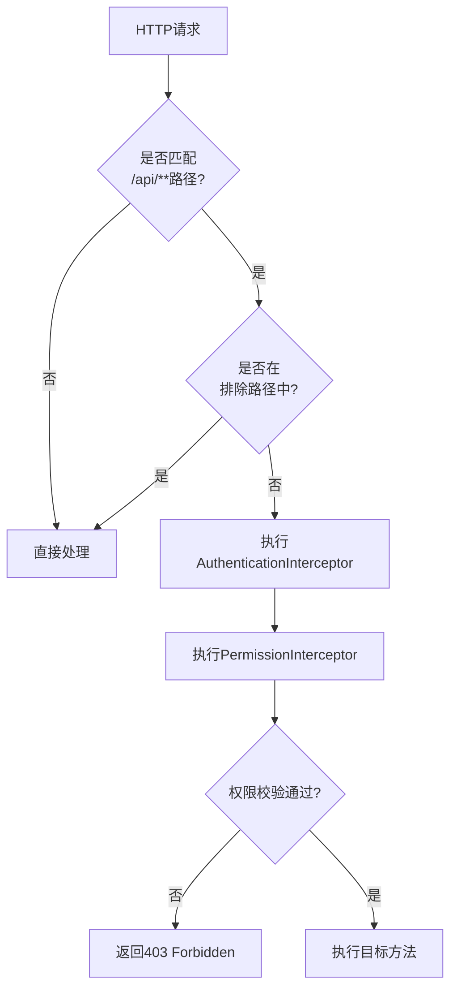
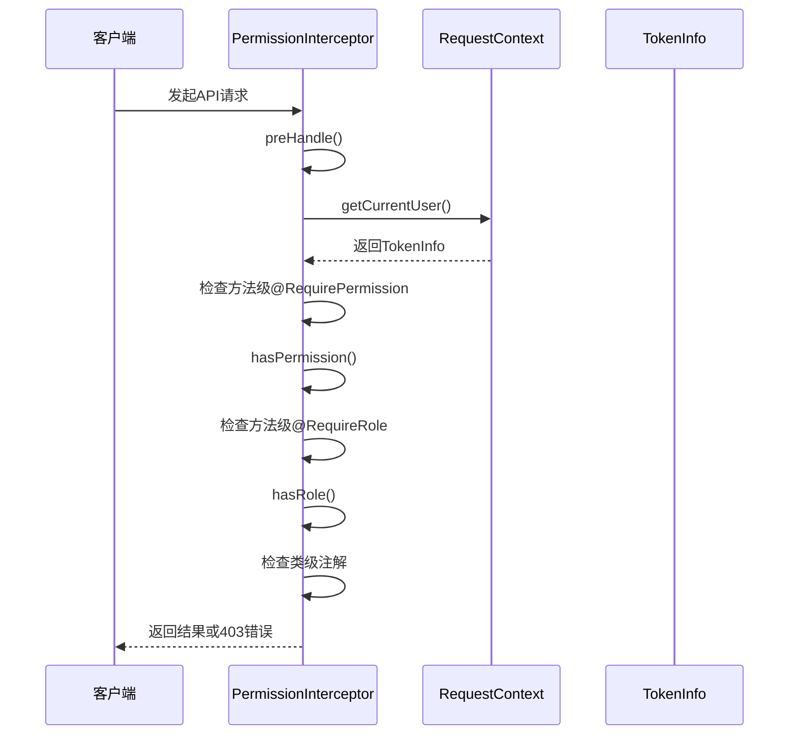
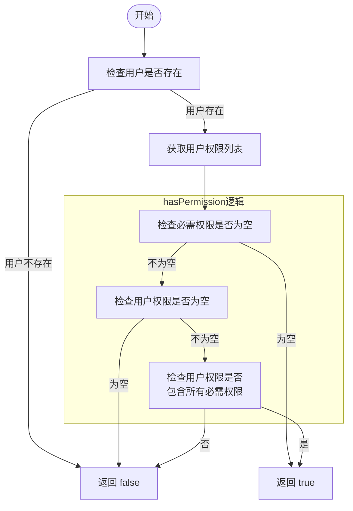
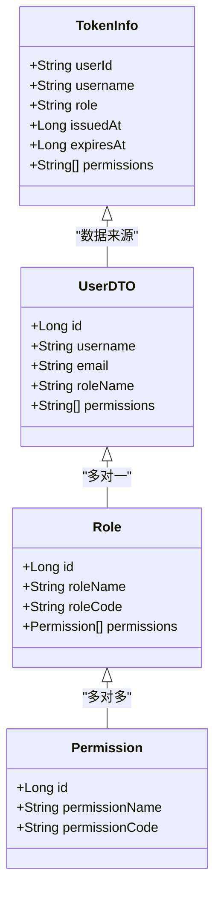

# 角色与权限注解使用

<cite>
**本文档引用文件**  
- [RequireRole.java](file://plugins/plugin-auth/src/main/java/com/traffic/sim/plugin/auth/annotation/RequireRole.java)
- [RequirePermission.java](file://plugins/plugin-auth/src/main/java/com/traffic/sim/plugin/auth/annotation/RequirePermission.java)
- [PermissionInterceptor.java](file://plugins/plugin-auth/src/main/java/com/traffic/sim/plugin/auth/interceptor/PermissionInterceptor.java)
- [RequestContext.java](file://plugins/plugin-auth/src/main/java/com/traffic/sim/plugin/auth/util/RequestContext.java)
- [TokenInfo.java](file://traffic-sim-common/src/main/java/com/traffic/sim/common/service/TokenInfo.java)
- [AuthPluginAutoConfiguration.java](file://plugins/plugin-auth/src/main/java/com/traffic/sim/plugin/auth/config/AuthPluginAutoConfiguration.java)
- [Role.java](file://plugins/plugin-user/src/main/java/com/traffic/sim/plugin/user/entity/Role.java)
- [Permission.java](file://plugins/plugin-user/src/main/java/com/traffic/sim/plugin/user/entity/Permission.java)
- [README.md](file://plugins/plugin-auth/README.md)
</cite>

## 目录
1. [引言](#引言)
2. [注解设计与原理](#注解设计与原理)
3. [运行时处理机制](#运行时处理机制)
4. [使用示例](#使用示例)
5. [参数传递与多值处理](#参数传递与多值处理)
6. [常见问题与调试技巧](#常见问题与调试技巧)
7. [总结](#总结)

## 引言
本项目通过自定义注解 `@RequireRole` 和 `@RequirePermission` 实现细粒度的访问控制。这两个注解结合拦截器机制，在请求处理前对用户角色和权限进行校验，确保只有具备相应权限的用户才能访问特定资源。该机制基于JWT认证体系，通过解析令牌中的用户信息完成权限判断。

**Section sources**
- [README.md](file://plugins/plugin-auth/README.md)

## 注解设计与原理

### @RequireRole 注解
`@RequireRole` 注解用于限定访问特定方法或类所需的用户角色。其设计遵循Java注解规范，使用 `@Target` 和 `@Retention` 元注解定义其作用范围和生命周期。

该注解可应用于方法和类级别（`ElementType.METHOD, ElementType.TYPE`），保留策略为运行时（`RetentionPolicy.RUNTIME`），以便在程序运行期间通过反射机制读取注解信息。

```java
@Target({ElementType.METHOD, ElementType.TYPE})
@Retention(RetentionPolicy.RUNTIME)
public @interface RequireRole {
    String[] value();
}
```

**Section sources**
- [RequireRole.java](file://plugins/plugin-auth/src/main/java/com/traffic/sim/plugin/auth/annotation/RequireRole.java)

### @RequirePermission 注解
`@RequirePermission` 注解用于限定访问特定方法或类所需的用户权限。其设计与 `@RequireRole` 类似，同样支持方法和类级别的应用，并在运行时保留。

权限通常比角色更细粒度，可用于控制具体操作（如创建、删除、更新等）的访问。

```java
@Target({ElementType.METHOD, ElementType.TYPE})
@Retention(RetentionPolicy.RUNTIME)
public @interface RequirePermission {
    String[] value();
}
```

**Section sources**
- [RequirePermission.java](file://plugins/plugin-auth/src/main/java/com/traffic/sim/plugin/auth/annotation/RequirePermission.java)

### 注解参数设计
两个注解均采用 `String[] value()` 作为参数，支持传入多个角色或权限。这种设计提供了灵活性，允许开发者指定多个必需的角色或权限。

- 对于 `@RequireRole`，用户只需具备数组中任一角色即可通过校验（OR逻辑）。
- 对于 `@RequirePermission`，用户必须具备数组中所有列出的权限才能通过校验（AND逻辑）。

这种差异源于角色和权限的语义：角色代表用户的身份类别，而权限代表具体的操作能力。

**Section sources**
- [RequireRole.java](file://plugins/plugin-auth/src/main/java/com/traffic/sim/plugin/auth/annotation/RequireRole.java#L21)
- [RequirePermission.java](file://plugins/plugin-auth/src/main/java/com/traffic/sim/plugin/auth/annotation/RequirePermission.java#L21)

## 运行时处理机制

### 拦截器注册流程
`PermissionInterceptor` 在 `AuthPluginAutoConfiguration` 配置类中被注册为Spring MVC拦截器。它被配置为拦截所有 `/api/**` 路径的请求（排除认证相关路径如 `/api/auth/**`），确保在业务逻辑执行前完成权限校验。



**Diagram sources**
- [AuthPluginAutoConfiguration.java](file://plugins/plugin-auth/src/main/java/com/traffic/sim/plugin/auth/config/AuthPluginAutoConfiguration.java#L25-L47)

### 权限校验流程
`PermissionInterceptor` 的 `preHandle` 方法实现了完整的权限校验逻辑。其处理流程如下：

1. **类型检查**：确认处理器是 `HandlerMethod` 类型。
2. **获取用户信息**：从 `RequestContext` 中获取当前登录用户的 `TokenInfo`。
3. **方法级注解检查**：优先检查方法上的 `@RequirePermission` 和 `@RequireRole` 注解。
4. **类级注解检查**：若方法上无注解，则检查类级别的注解。
5. **权限比对**：调用 `hasPermission` 和 `hasRole` 方法进行实际的权限和角色比对。



**Diagram sources**
- [PermissionInterceptor.java](file://plugins/plugin-auth/src/main/java/com/traffic/sim/plugin/auth/interceptor/PermissionInterceptor.java#L31-L84)

### 权限与角色校验逻辑
`hasPermission` 方法检查用户权限列表是否包含所有必需的权限。它使用 `List.containsAll()` 方法，要求用户具备注解中声明的所有权限。

`hasRole` 方法检查用户的角色是否在必需角色列表中。它使用 `List.contains()` 方法，只要用户具备任一声明的角色即可通过校验。



**Diagram sources**
- [PermissionInterceptor.java](file://plugins/plugin-auth/src/main/java/com/traffic/sim/plugin/auth/interceptor/PermissionInterceptor.java#L90-L102)
- [PermissionInterceptor.java](file://plugins/plugin-auth/src/main/java/com/traffic/sim/plugin/auth/interceptor/PermissionInterceptor.java#L107-L119)

**Section sources**
- [PermissionInterceptor.java](file://plugins/plugin-auth/src/main/java/com/traffic/sim/plugin/auth/interceptor/PermissionInterceptor.java#L90-L119)

## 使用示例

### 方法级别使用
在Controller的方法上使用注解，可以精确控制单个接口的访问权限。

```java
@RestController
@RequestMapping("/api/admin")
public class AdminController {
    
    @GetMapping("/users")
    @RequirePermission("user:query")
    public ResponseEntity<ApiResponse<List<UserDTO>>> getUsers() {
        // 只有具备"user:query"权限的用户才能访问
    }
    
    @PostMapping("/users")
    @RequirePermission({"user:create", "user:update"})
    public ResponseEntity<ApiResponse<String>> createUser() {
        // 需要同时具备"user:create"和"user:update"权限
    }
}
```

**Section sources**
- [README.md](file://plugins/plugin-auth/README.md#L123-L137)

### 类级别使用
在Controller类上使用注解，可以为该类下的所有接口设置统一的访问控制。

```java
@RestController
@RequestMapping("/api/admin")
@RequireRole("ADMIN")
public class AdminController {
    
    @GetMapping("/users")
    public ResponseEntity<ApiResponse<List<UserDTO>>> getUsers() {
        // 需要ADMIN角色才能访问
    }
    
    @PostMapping("/users")
    public ResponseEntity<ApiResponse<String>> createUser() {
        // 需要ADMIN角色才能访问
    }
}
```

**Section sources**
- [README.md](file://plugins/plugin-auth/README.md#L128-L137)

### 混合使用场景
可以同时在类和方法上使用注解，实现更复杂的权限控制。方法级别的注解优先级高于类级别。

```java
@RestController
@RequestMapping("/api/user")
@RequireRole("USER") // 类级别：需要USER角色
public class UserController {
    
    @GetMapping("/{id}")
    public ResponseEntity<ApiResponse<UserDTO>> getUser(@PathVariable Long id) {
        // 只需USER角色
    }
    
    @PutMapping("/{id}")
    @RequireRole("ADMIN") // 方法级别：需要ADMIN角色
    public ResponseEntity<ApiResponse<String>> updateUser(@PathVariable Long id) {
        // 需要ADMIN角色，覆盖类级别的USER要求
    }
}
```

**Section sources**
- [README.md](file://plugins/plugin-auth/README.md#L123-L137)

## 参数传递与多值处理

### 参数传递方式
注解的参数通过 `value()` 方法传递。在使用时，可以直接在括号内指定值。

```java
// 单个值
@RequireRole("ADMIN")

// 多个值
@RequirePermission({"user:create", "user:update"})

// 等价于
@RequirePermission(value = {"user:create", "user:update"})
```

**Section sources**
- [RequireRole.java](file://plugins/plugin-auth/src/main/java/com/traffic/sim/plugin/auth/annotation/RequireRole.java#L21)
- [RequirePermission.java](file://plugins/plugin-auth/src/main/java/com/traffic/sim/plugin/auth/annotation/RequirePermission.java#L21)

### 多角色处理逻辑
当 `@RequireRole` 注解指定多个角色时，采用OR逻辑。用户只需具备其中一个角色即可通过校验。

例如，`@RequireRole({"ADMIN", "MANAGER"})` 表示用户是管理员或经理角色均可访问。

```java
private boolean hasRole(TokenInfo tokenInfo, List<String> requiredRoles) {
    if (requiredRoles == null || requiredRoles.isEmpty()) {
        return true;
    }
    
    String userRole = tokenInfo.getRole();
    if (userRole == null) {
        return false;
    }
    
    // 检查是否包含任一必需的角色
    return requiredRoles.contains(userRole);
}
```

**Section sources**
- [PermissionInterceptor.java](file://plugins/plugin-auth/src/main/java/com/traffic/sim/plugin/auth/interceptor/PermissionInterceptor.java#L107-L118)

### 多权限处理逻辑
当 `@RequirePermission` 注解指定多个权限时，采用AND逻辑。用户必须具备所有列出的权限才能通过校验。

例如，`@RequirePermission({"user:create", "audit:log"})` 表示用户必须同时具备创建用户和审计日志的权限。

```java
private boolean hasPermission(TokenInfo tokenInfo, List<String> requiredPermissions) {
    if (requiredPermissions == null || requiredPermissions.isEmpty()) {
        return true;
    }
    
    List<String> userPermissions = tokenInfo.getPermissions();
    if (userPermissions == null || userPermissions.isEmpty()) {
        return false;
    }
    
    // 检查是否包含所有必需的权限
    return userPermissions.containsAll(requiredPermissions);
}
```

**Section sources**
- [PermissionInterceptor.java](file://plugins/plugin-auth/src/main/java/com/traffic/sim/plugin/auth/interceptor/PermissionInterceptor.java#L90-L101)

## 常见问题与调试技巧

### 注解不生效的可能原因
1. **拦截器未注册**：确保 `AuthPluginAutoConfiguration` 已正确加载，`PermissionInterceptor` 被注册。
2. **路径不匹配**：检查请求路径是否在拦截器的 `addPathPatterns` 范围内，且未被 `excludePathPatterns` 排除。
3. **用户未登录**：未携带有效JWT令牌或令牌已过期，导致无法获取用户信息。
4. **注解位置错误**：确保注解应用于Spring管理的Bean的方法或类上。

**Section sources**
- [AuthPluginAutoConfiguration.java](file://plugins/plugin-auth/src/main/java/com/traffic/sim/plugin/auth/config/AuthPluginAutoConfiguration.java#L25-L47)
- [PermissionInterceptor.java](file://plugins/plugin-auth/src/main/java/com/traffic/sim/plugin/auth/interceptor/PermissionInterceptor.java#L35-L37)

### 调试技巧
1. **启用日志**：在 `PermissionInterceptor` 中添加日志输出，观察拦截器的执行流程和决策过程。
2. **检查TokenInfo**：通过 `RequestContext.getCurrentUser()` 获取当前用户信息，验证角色和权限是否正确加载。
3. **单元测试**：为 `PermissionInterceptor` 编写单元测试，模拟不同场景下的权限校验行为。
4. **检查继承关系**：如果Controller继承了基类，确保注解能正确处理继承场景。

```java
// 调试时可临时添加
log.info("当前用户: {}, 角色: {}, 权限: {}", 
    tokenInfo.getUsername(), 
    tokenInfo.getRole(), 
    tokenInfo.getPermissions());
```

**Section sources**
- [PermissionInterceptor.java](file://plugins/plugin-auth/src/main/java/com/traffic/sim/plugin/auth/interceptor/PermissionInterceptor.java#L42)
- [RequestContext.java](file://plugins/plugin-auth/src/main/java/com/traffic/sim/plugin/auth/util/RequestContext.java#L25)

### 权限数据来源
用户的角色和权限信息来源于JWT令牌的解析结果。`TokenInfo` 对象在用户登录时由 `AuthServiceImpl` 创建，并包含从数据库查询到的用户角色和权限。



**Diagram sources**
- [TokenInfo.java](file://traffic-sim-common/src/main/java/com/traffic/sim/common/service/TokenInfo.java)
- [UserDTO.java](file://traffic-sim-common/src/main/java/com/traffic/sim/common/dto/UserDTO.java)
- [Role.java](file://plugins/plugin-user/src/main/java/com/traffic/sim/plugin/user/entity/Role.java)
- [Permission.java](file://plugins/plugin-user/src/main/java/com/traffic/sim/plugin/user/entity/Permission.java)

**Section sources**
- [AuthServiceImpl.java](file://plugins/plugin-auth/src/main/java/com/traffic/sim/plugin/auth/service/AuthServiceImpl.java#L206-L228)

## 总结
`@RequireRole` 和 `@RequirePermission` 注解提供了一种声明式的权限控制机制，通过与 `PermissionInterceptor` 拦截器配合，实现了灵活且安全的访问控制。开发者可以通过在方法或类上添加注解来快速定义访问规则，系统会在运行时自动完成权限校验。理解注解的设计原理、处理流程和使用技巧，有助于正确实施权限控制，避免安全漏洞。