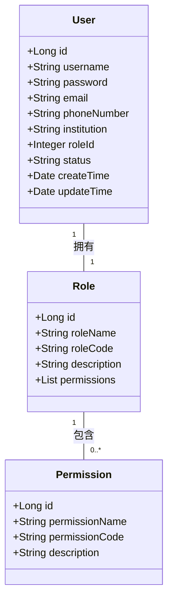
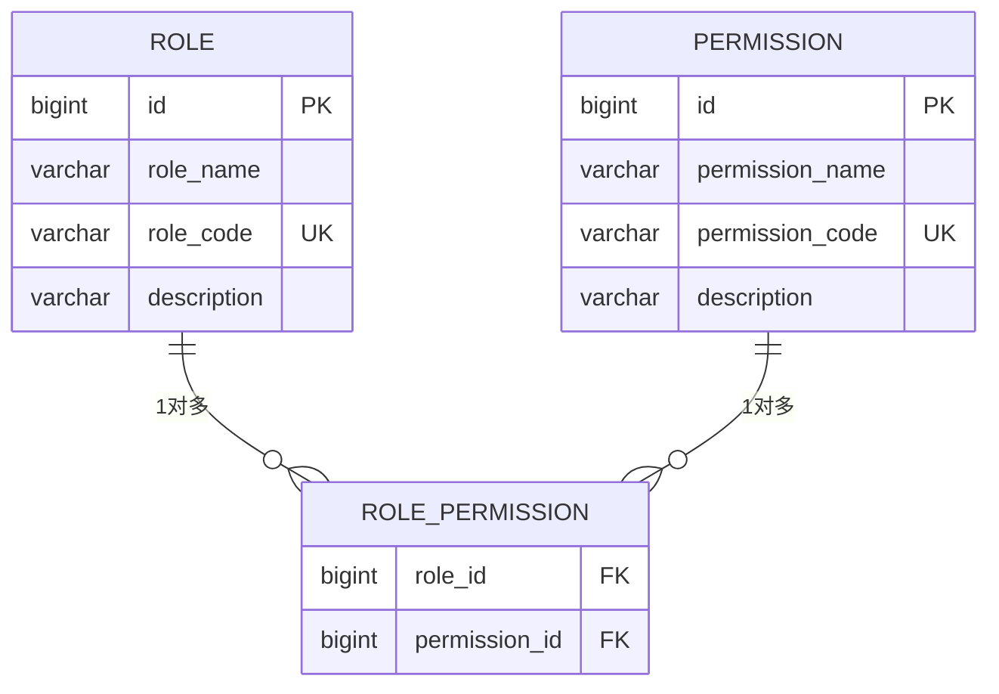
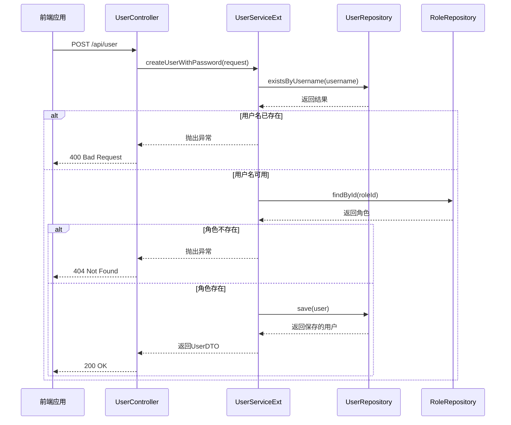
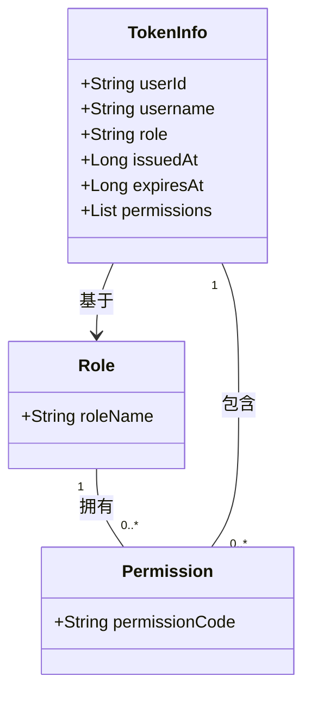

# 角色与权限管理

<cite>
**本文档引用的文件**   
- [Role.java](file://plugins/plugin-user/src/main/java/com/traffic/sim/plugin/user/entity/Role.java)
- [Permission.java](file://plugins/plugin-user/src/main/java/com/traffic/sim/plugin/user/entity/Permission.java)
- [User.java](file://plugins/plugin-user/src/main/java/com/traffic/sim/plugin/user/entity/User.java)
- [RequireRole.java](file://plugins/plugin-auth/src/main/java/com/traffic/sim/plugin/auth/annotation/RequireRole.java)
- [RequirePermission.java](file://plugins/plugin-auth/src/main/java/com/traffic/sim/plugin/auth/annotation/RequirePermission.java)
- [PermissionInterceptor.java](file://plugins/plugin-auth/src/main/java/com/traffic/sim/plugin/auth/interceptor/PermissionInterceptor.java)
- [init.sql](file://infrastructure/init.sql)
- [UserServiceExt.java](file://plugins/plugin-user/src/main/java/com/traffic/sim/plugin/user/service/UserServiceExt.java)
- [AuthServiceImpl.java](file://plugins/plugin-auth/src/main/java/com/traffic/sim/plugin/auth/service/AuthServiceImpl.java)
- [UserController.java](file://plugins/plugin-user/src/main/java/com/traffic/sim/plugin/user/controller/UserController.java)
</cite>

## 目录
1. [引言](#引言)
2. [核心实体设计](#核心实体设计)
3. [角色权限分配管理](#角色权限分配管理)
4. [权限验证机制](#权限验证机制)
5. [默认角色与权限继承](#默认角色与权限继承)
6. [使用示例](#使用示例)
7. [结论](#结论)

## 引言
本文档详细说明了交通仿真系统中的角色与权限管理机制。系统采用基于角色的访问控制（RBAC）模型，通过角色（Role）和权限（Permission）实体以及它们之间的多对多关系来实现灵活的权限管理。文档将深入探讨实体设计、管理流程、API接口、注解使用方式、默认配置和使用示例，为开发者和管理员提供全面的参考。

## 核心实体设计

### 角色与权限实体
系统中的角色与权限管理基于三个核心实体：`Role`（角色）、`Permission`（权限）和`User`（用户）。`Role`和`Permission`实体通过`role_permission`关联表实现多对多关系，允许一个角色拥有多个权限，同时一个权限也可以被多个角色拥有。



**图示来源**
- [Role.java](file://plugins/plugin-user/src/main/java/com/traffic/sim/plugin/user/entity/Role.java#L1-L39)
- [Permission.java](file://plugins/plugin-user/src/main/java/com/traffic/sim/plugin/user/entity/Permission.java#L1-L29)
- [User.java](file://plugins/plugin-user/src/main/java/com/traffic/sim/plugin/user/entity/User.java#L1-L66)

### 数据库表结构
在数据库层面，角色与权限的关系通过三张表来实现：`role`（角色表）、`permission`（权限表）和`role_permission`（角色权限关联表）。这种设计遵循了数据库规范化原则，避免了数据冗余。



**图示来源**
- [init.sql](file://infrastructure/init.sql#L45-L78)

**本节来源**
- [Role.java](file://plugins/plugin-user/src/main/java/com/traffic/sim/plugin/user/entity/Role.java#L1-L39)
- [Permission.java](file://plugins/plugin-user/src/main/java/com/traffic/sim/plugin/user/entity/Permission.java#L1-L29)
- [init.sql](file://infrastructure/init.sql#L45-L78)

## 角色权限分配管理

### 角色权限分配流程
角色权限的分配和管理主要通过后端服务和数据库操作来完成。管理员可以通过管理界面或API接口为角色分配或移除权限。核心流程如下：
1. 管理员选择一个角色
2. 系统从数据库加载该角色已有的权限列表
3. 管理员从所有可用权限中选择需要分配的权限
4. 系统将选中的权限ID与角色ID组合，插入到`role_permission`关联表中
5. 如果权限已被分配，则更新操作会跳过重复记录

### API接口
系统提供了RESTful API接口来管理用户和角色。`UserController`类定义了创建、更新、删除和查询用户的接口。创建用户时，可以通过`UserCreateRequest`指定用户的角色ID。



**图示来源**
- [UserController.java](file://plugins/plugin-user/src/main/java/com/traffic/sim/plugin/user/controller/UserController.java#L1-L119)
- [UserServiceExt.java](file://plugins/plugin-user/src/main/java/com/traffic/sim/plugin/user/service/UserServiceExt.java#L1-L37)
- [UserServiceImpl.java](file://plugins/plugin-user/src/main/java/com/traffic/sim/plugin/user/service/UserServiceImpl.java#L1-L331)

**本节来源**
- [UserController.java](file://plugins/plugin-user/src/main/java/com/traffic/sim/plugin/user/controller/UserController.java#L1-L119)
- [UserServiceExt.java](file://plugins/plugin-user/src/main/java/com/traffic/sim/plugin/user/service/UserServiceExt.java#L1-L37)

## 权限验证机制

### 注解使用方式
系统提供了`@RequireRole`和`@RequirePermission`两个注解，用于声明方法或类所需的访问权限。这些注解可以应用于Controller的方法或类级别。

```java
@RestController
@RequestMapping("/api/admin")
@RequireRole("ADMIN") // 类级别注解，整个Controller需要ADMIN角色
public class AdminController {
    
    @GetMapping("/users")
    @RequirePermission("user:query") // 方法级别注解，需要user:query权限
    public ResponseEntity<ApiResponse<List<UserDTO>>> getUsers() {
        // ...
    }
    
    @PostMapping("/users")
    @RequirePermission({"user:create", "user:update"}) // 可以指定多个权限
    public ResponseEntity<ApiResponse<UserDTO>> createUser() {
        // ...
    }
}
```

### 工作原理
权限验证的核心是`PermissionInterceptor`拦截器。该拦截器在每个请求处理前执行，检查目标方法或类上是否标记了`@RequireRole`或`@RequirePermission`注解，并验证当前用户是否满足要求。

```mermaid
flowchart TD
A[请求开始] --> B{是否为HandlerMethod?}
B --> |否| C[放行]
B --> |是| D[获取当前用户TokenInfo]
D --> E{TokenInfo为空?}
E --> |是| F[返回401未认证]
E --> |否| G[检查方法级@RequirePermission]
G --> H{有注解?}
H --> |是| I[检查用户权限]
I --> J{权限足够?}
J --> |否| K[返回403禁止访问]
J --> |是| L[检查方法级@RequireRole]
H --> |否| L
L --> M{有注解?}
M --> |是| N[检查用户角色]
N --> O{角色匹配?}
O --> |否| K
O --> |是| P[检查类级@RequirePermission]
M --> |否| P
P --> Q{有注解?}
Q --> |是| R[检查用户权限]
R --> S{权限足够?}
S --> |否| K
S --> |是| T[检查类级@RequireRole]
Q --> |否| T
T --> U{有注解?}
U --> |是| V[检查用户角色]
V --> W{角色匹配?}
W --> |否| K
W --> |是| X[放行]
U --> |否| X
X --> Y[处理请求]
```

**图示来源**
- [PermissionInterceptor.java](file://plugins/plugin-auth/src/main/java/com/traffic/sim/plugin/auth/interceptor/PermissionInterceptor.java#L1-L134)
- [RequireRole.java](file://plugins/plugin-auth/src/main/java/com/traffic/sim/plugin/auth/annotation/RequireRole.java#L1-L24)
- [RequirePermission.java](file://plugins/plugin-auth/src/main/java/com/traffic/sim/plugin/auth/annotation/RequirePermission.java#L1-L24)

**本节来源**
- [PermissionInterceptor.java](file://plugins/plugin-auth/src/main/java/com/traffic/sim/plugin/auth/interceptor/PermissionInterceptor.java#L1-L134)
- [RequireRole.java](file://plugins/plugin-auth/src/main/java/com/traffic/sim/plugin/auth/annotation/RequireRole.java#L1-L24)
- [RequirePermission.java](file://plugins/plugin-auth/src/main/java/com/traffic/sim/plugin/auth/annotation/RequirePermission.java#L1-L24)

## 默认角色与权限继承

### 默认角色配置
系统在`plugin-user`模块的配置文件中定义了默认角色。当新用户注册时，如果没有指定角色，系统会自动为其分配默认角色。

```yaml
plugin:
  user:
    # 默认角色ID（需要在数据库中预先创建）
    default-role: 1
    # 密码加密方式
    password-encryption: BCrypt
```

### 权限继承机制
系统的权限继承机制主要体现在两个层面：角色与权限的多对多关系，以及在认证服务中根据角色动态生成权限列表。`AuthServiceImpl`中的`createTokenInfo`方法展示了这一机制：根据用户的`roleName`，为其分配相应的权限列表。



**图示来源**
- [AuthServiceImpl.java](file://plugins/plugin-auth/src/main/java/com/traffic/sim/plugin/auth/service/AuthServiceImpl.java#L1-L263)
- [application.yml](file://plugins/plugin-user/src/main/resources/application.yml#L1-L7)

**本节来源**
- [AuthServiceImpl.java](file://plugins/plugin-auth/src/main/java/com/traffic/sim/plugin/auth/service/AuthServiceImpl.java#L1-L263)
- [application.yml](file://plugins/plugin-user/src/main/resources/application.yml#L1-L7)

## 使用示例

### 为用户分配角色
为用户分配角色是通过创建或更新用户时指定`roleId`来实现的。以下是一个使用示例：

```java
// 创建用户请求
UserCreateRequest request = new UserCreateRequest();
request.setUsername("newuser");
request.setPassword("password123");
request.setEmail("newuser@example.com");
request.setRoleId(2); // 分配"普通用户"角色

// 调用API创建用户
ResponseEntity<ApiResponse<UserDTO>> response = userController.createUser(request);
```

### 检查用户权限
检查用户权限通常由系统自动完成，但开发者也可以在业务逻辑中手动检查。这可以通过从`RequestContext`获取当前用户的`TokenInfo`并检查其权限列表来实现。

```java
// 在业务方法中检查权限
TokenInfo currentUser = RequestContext.getCurrentUser();
if (currentUser != null && currentUser.getPermissions().contains("map:edit")) {
    // 用户有地图编辑权限，执行相关操作
    mapService.updateMap(mapId, mapData);
} else {
    throw new BusinessException(ErrorCode.ERR_PERMISSION, "没有地图编辑权限");
}
```

**本节来源**
- [UserController.java](file://plugins/plugin-user/src/main/java/com/traffic/sim/plugin/user/controller/UserController.java#L1-L119)
- [RequestContext.java](file://plugins/plugin-auth/src/main/java/com/traffic/sim/plugin/auth/util/RequestContext.java#L1-L53)

## 结论
本文档全面介绍了交通仿真系统的角色与权限管理机制。系统采用标准的RBAC模型，通过`Role`和`Permission`实体的多对多关系实现灵活的权限控制。`@RequireRole`和`@RequirePermission`注解提供了声明式的权限管理方式，而`PermissionInterceptor`拦截器则负责在运行时验证权限。系统还支持默认角色配置和基于角色的权限继承，为新用户提供了便捷的权限分配机制。通过这些设计，系统实现了安全、灵活且易于管理的权限控制体系。