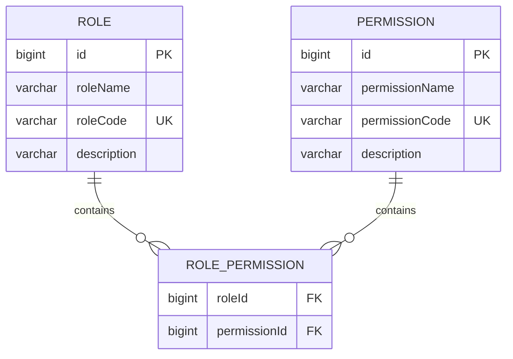
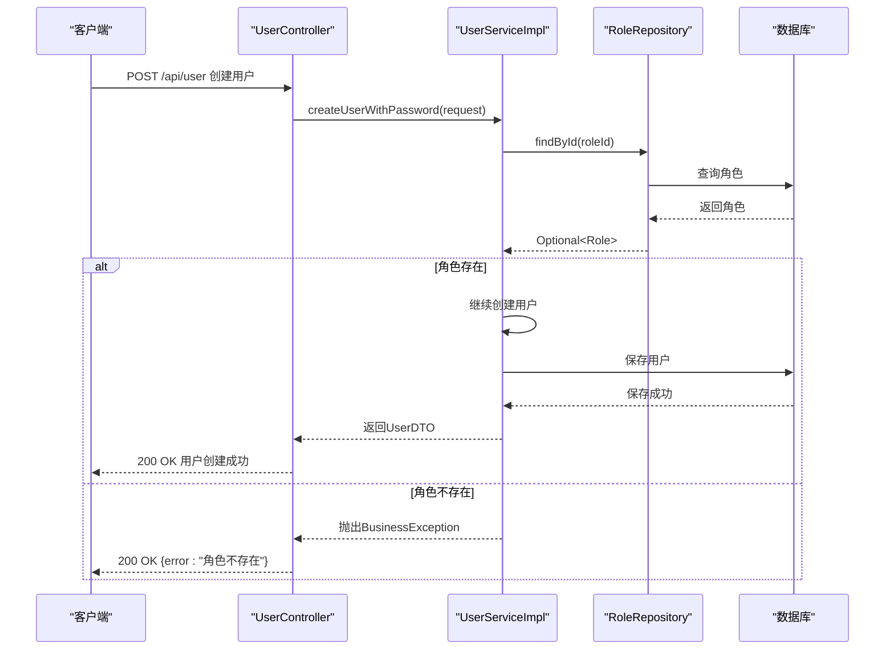

# 角色管理

<cite>
**本文档引用的文件**
- [Role.java](file://plugins/plugin-user/src/main/java/com/traffic/sim/plugin/user/entity/Role.java)
- [Permission.java](file://plugins/plugin-user/src/main/java/com/traffic/sim/plugin/user/entity/Permission.java)
- [RoleRepository.java](file://plugins/plugin-user/src/main/java/com/traffic/sim/plugin/user/repository/RoleRepository.java)
- [UserServiceImpl.java](file://plugins/plugin-user/src/main/java/com/traffic/sim/plugin/user/service/UserServiceImpl.java)
- [UserController.java](file://plugins/plugin-user/src/main/java/com/traffic/sim/plugin/user/controller/UserController.java)
- [init.sql](file://infrastructure/init.sql)
- [ErrorCode.java](file://traffic-sim-common/src/main/java/com/traffic/sim/common/constant/ErrorCode.java)
- [BusinessException.java](file://traffic-sim-common/src/main/java/com/traffic/sim/common/exception/BusinessException.java)
</cite>

## 目录
1. [角色实体设计](#角色实体设计)
2. [角色与权限的多对多关系](#角色与权限的多对多关系)
3. [角色管理操作的API接口](#角色管理操作的api接口)
4. [角色管理使用示例](#角色管理使用示例)
5. [常见问题与解决方案](#常见问题与解决方案)

## 角色实体设计

角色实体（Role）是系统权限管理的核心组成部分，用于定义系统中的不同角色及其属性。该实体通过JPA注解映射到数据库表`role`，包含四个主要字段：id、roleName、roleCode和description。

- **id**: 角色的唯一标识符，类型为Long，使用`@Id`和`@GeneratedValue(strategy = GenerationType.IDENTITY)`注解，表示这是一个自增主键。该字段在数据库中对应`BIGINT(20)`类型，作为角色记录的唯一标识。

- **roleName**: 角色名称，类型为String，使用`@Column(name = "role_name", nullable = false, length = 50)`注解。该字段不能为空，最大长度为50个字符，用于显示角色的可读名称，如"管理员"、"普通用户"等。

- **roleCode**: 角色代码，类型为String，使用`@Column(name = "role_code", nullable = false, unique = true, length = 50)`注解。该字段具有唯一性约束，不能为空，最大长度为50个字符。角色代码是系统内部识别角色的唯一标识，如"ADMIN"、"USER"等，用于程序逻辑中的角色判断。

- **description**: 角色描述，类型为String，使用`@Column(length = 500)`注解。该字段可为空，最大长度为500个字符，用于描述角色的职责和权限范围，为系统管理员提供参考信息。

在数据库初始化脚本（init.sql）中，系统预定义了三个默认角色：管理员（ADMIN）、普通用户（USER）和研究员（RESEARCHER），这些角色在系统启动时自动创建，为系统提供基础的权限管理框架。

**Section sources**
- [Role.java](file://plugins/plugin-user/src/main/java/com/traffic/sim/plugin/user/entity/Role.java#L1-L39)
- [init.sql](file://infrastructure/init.sql#L179-L184)

## 角色与权限的多对多关系

系统通过JPA的`@ManyToMany`注解实现了角色与权限之间的多对多关系，这种设计模式允许一个角色拥有多个权限，同时一个权限也可以被多个角色共享，提供了灵活的权限分配机制。

在Role实体中，通过以下代码定义了与权限的多对多关系：
```java
@ManyToMany(fetch = FetchType.LAZY)
@JoinTable(
    name = "role_permission",
    joinColumns = @JoinColumn(name = "role_id"),
    inverseJoinColumns = @JoinColumn(name = "permission_id")
)
private List<Permission> permissions;
```

- **@ManyToMany**: 表示角色与权限之间是多对多的关系。`fetch = FetchType.LAZY`表示延迟加载，只有在实际访问权限列表时才会从数据库查询相关数据，提高了系统性能。

- **@JoinTable**: 指定关联表的详细信息。`name = "role_permission"`表示关联表的名称为`role_permission`，该表在数据库中存储角色与权限的映射关系。

- **joinColumns**: 指定当前实体（Role）在关联表中的外键列，`@JoinColumn(name = "role_id")`表示关联表中的`role_id`列引用角色表的主键。

- **inverseJoinColumns**: 指定对方实体（Permission）在关联表中的外键列，`@JoinColumn(name = "permission_id")`表示关联表中的`permission_id`列引用权限表的主键。

在数据库层面，`role_permission`表的结构如下：
```sql
CREATE TABLE `role_permission` (
  `role_id` BIGINT(20) NOT NULL COMMENT '角色ID',
  `permission_id` BIGINT(20) NOT NULL COMMENT '权限ID',
  PRIMARY KEY (`role_id`, `permission_id`),
  KEY `idx_role_id` (`role_id`),
  KEY `idx_permission_id` (`permission_id`)
) ENGINE=InnoDB DEFAULT CHARSET=utf8mb4 COLLATE=utf8mb4_unicode_ci COMMENT='角色权限关联表';
```

该表的主键由`role_id`和`permission_id`组成复合主键，确保了每个角色-权限组合的唯一性。同时，创建了两个索引以提高查询性能。在系统初始化时，管理员角色（ADMIN）被分配了所有预定义的权限，包括用户管理、地图管理、仿真管理、回放管理和系统配置等。



**Diagram sources**
- [Role.java](file://plugins/plugin-user/src/main/java/com/traffic/sim/plugin/user/entity/Role.java#L31-L37)
- [Permission.java](file://plugins/plugin-user/src/main/java/com/traffic/sim/plugin/user/entity/Permission.java#L16-L27)
- [init.sql](file://infrastructure/init.sql#L71-L78)

**Section sources**
- [Role.java](file://plugins/plugin-user/src/main/java/com/traffic/sim/plugin/user/entity/Role.java#L31-L37)
- [Permission.java](file://plugins/plugin-user/src/main/java/com/traffic/sim/plugin/user/entity/Permission.java#L1-L29)
- [init.sql](file://infrastructure/init.sql#L45-L78)

## 角色管理操作的API接口

虽然系统目前没有提供专门的角色管理API控制器，但角色管理功能通过用户管理服务和相关组件间接实现。角色的创建、更新和删除通常在系统初始化或通过后台管理操作完成，而角色的查询和使用则贯穿于用户管理和权限验证的各个流程中。

### 角色查询

系统提供了通过角色代码或角色名称查询角色的功能，这些功能主要在用户创建和更新过程中使用，以验证指定角色的有效性。

- **findByRoleCode(String roleCode)**: 在RoleRepository接口中定义，用于根据角色代码查找角色。该方法返回一个Optional<Role>对象，如果找到匹配的角色则包含该角色，否则为空。此方法在用户创建和更新时用于验证角色是否存在。

- **findByRoleName(String roleName)**: 在RoleRepository接口中定义，用于根据角色名称查找角色。与findByRoleCode类似，该方法也返回Optional<Role>对象，可用于基于角色名称的查询操作。

### 用户管理中的角色操作

尽管没有独立的角色管理API，但用户管理控制器（UserController）和用户服务实现（UserServiceImpl）中包含了与角色相关的操作逻辑：

- **用户创建时的角色分配**: 当创建新用户时，可以通过UserCreateRequest DTO中的`roleId`字段指定用户的角色。系统会验证该角色ID是否存在，如果不存在则抛出"角色不存在"的业务异常。

- **用户更新时的角色变更**: 当更新用户信息时，可以修改用户的`roleId`，从而改变用户的角色。系统同样会验证新角色的有效性，确保角色ID对应的角色存在于数据库中。

- **角色信息的自动填充**: 在查询用户信息时，系统会自动根据用户的`roleId`查询对应的角色名称，并填充到UserDTO的`roleName`字段中，方便前端显示。

这些操作通过UserServiceImpl中的业务逻辑实现，例如在`createUserWithPassword`和`updateUserWithPassword`方法中，都会调用roleRepository.findById()来验证角色的存在性。如果角色不存在，系统会抛出带有`ERR_NOT_FOUND`错误码的BusinessException。



**Diagram sources**
- [UserServiceImpl.java](file://plugins/plugin-user/src/main/java/com/traffic/sim/plugin/user/service/UserServiceImpl.java#L224-L228)
- [RoleRepository.java](file://plugins/plugin-user/src/main/java/com/traffic/sim/plugin/user/repository/RoleRepository.java#L20-L25)
- [UserController.java](file://plugins/plugin-user/src/main/java/com/traffic/sim/plugin/user/controller/UserController.java#L65-L67)

**Section sources**
- [UserServiceImpl.java](file://plugins/plugin-user/src/main/java/com/traffic/sim/plugin/user/service/UserServiceImpl.java#L190-L236)
- [UserController.java](file://plugins/plugin-user/src/main/java/com/traffic/sim/plugin/user/controller/UserController.java#L63-L68)
- [RoleRepository.java](file://plugins/plugin-user/src/main/java/com/traffic/sim/plugin/user/repository/RoleRepository.java#L16-L26)

## 角色管理使用示例

### 创建新角色

虽然系统没有提供直接的API来创建角色，但可以通过数据库操作或系统初始化脚本来创建新角色。以下是通过SQL语句创建新角色的示例：

```sql
INSERT INTO `role` (`role_name`, `role_code`, `description`) 
VALUES ('数据分析师', 'ANALYST', '数据分析角色，拥有数据查看和分析权限');
```

执行此SQL语句后，系统中将创建一个名为"数据分析师"的新角色，其角色代码为"ANALYST"。创建角色后，还需要为其分配相应的权限，这可以通过向`role_permission`关联表插入记录来完成。

### 为角色分配权限

为角色分配权限需要先获取角色ID和权限ID，然后在`role_permission`表中创建关联记录。以下是为"数据分析师"角色分配"数据查看"权限的示例：

```sql
-- 首先查询角色ID和权限ID
SELECT id FROM `role` WHERE role_code = 'ANALYST';
SELECT id FROM `permission` WHERE permission_code = 'DATA_VIEW';

-- 然后插入关联记录（假设角色ID为4，权限ID为6）
INSERT INTO `role_permission` (`role_id`, `permission_id`) VALUES (4, 6);
```

### 创建用户并分配角色

通过用户管理API创建用户时，可以同时为用户分配角色。以下是使用HTTP请求创建用户并分配角色的示例：

```
POST /api/user
Content-Type: application/json

{
  "username": "zhangsan",
  "password": "password123",
  "email": "zhangsan@example.com",
  "phoneNumber": "13800138000",
  "institution": "交通研究院",
  "roleId": 2
}
```

在这个请求中，`roleId`字段设置为2，表示将用户分配给ID为2的角色（根据init.sql中的初始化数据，ID为2的角色是"普通用户"）。系统会验证该角色ID是否存在，如果存在则创建用户并建立用户与角色的关联。

### 验证角色权限

系统通过`@RequireRole`和`@RequirePermission`注解来验证用户的角色和权限。以下是在控制器中使用角色注解的示例：

```java
@RestController
@RequestMapping("/api/admin")
@RequireRole("ADMIN")
public class AdminController {
    
    @GetMapping("/users")
    @RequirePermission("USER_MANAGE")
    public ResponseEntity<ApiResponse<List<UserDTO>>> getUsers() {
        // 只有拥有ADMIN角色且具备USER_MANAGE权限的用户才能访问此接口
    }
}
```

当用户访问被`@RequireRole("ADMIN")`注解保护的接口时，系统会检查用户的角色代码是否为"ADMIN"，如果不是，则拒绝访问并返回权限不足的错误。

**Section sources**
- [init.sql](file://infrastructure/init.sql#L179-L200)
- [UserServiceImpl.java](file://plugins/plugin-user/src/main/java/com/traffic/sim/plugin/user/service/UserServiceImpl.java#L206-L235)
- [UserController.java](file://plugins/plugin-user/src/main/java/com/traffic/sim/plugin/user/controller/UserController.java#L63-L68)
- [RequireRole.java](file://plugins/plugin-auth/src/main/java/com/traffic/sim/plugin/auth/annotation/RequireRole.java)

## 常见问题与解决方案

### 角色代码唯一性约束冲突

**问题描述**: 在创建或更新角色时，如果指定的角色代码已经存在于系统中，将会违反数据库的唯一性约束，导致操作失败。

**错误信息**: 当发生此问题时，系统会抛出`BusinessException`，错误码为`ERR_EXIST`，错误消息为"角色代码已存在"。

**解决方案**: 
1. 在创建新角色前，先通过`findByRoleCode`方法检查该角色代码是否已存在。
2. 如果需要更新现有角色，应使用更新操作而不是创建操作。
3. 为角色代码制定统一的命名规范，避免重复，如使用大写字母和下划线的组合（ADMIN_USER、DATA_ANALYST等）。

### 角色不存在错误

**问题描述**: 在为用户分配角色时，如果指定的角色ID在数据库中不存在，系统会抛出"角色不存在"的错误。

**错误信息**: 系统会抛出`BusinessException`，错误码为`ERR_NOT_FOUND`，错误消息为"角色不存在"。

**解决方案**:
1. 在分配角色前，通过`RoleRepository.findById()`方法验证角色ID的有效性。
2. 提供角色列表查询API，让前端能够获取系统中所有可用的角色，用户只能从现有角色中选择。
3. 在系统初始化时确保所有预定义角色都已正确创建。

### 权限分配不完整

**问题描述**: 为角色分配权限时，可能遗漏某些必要的权限，导致用户无法执行预期的操作。

**解决方案**:
1. 为常用角色创建权限模板，在初始化脚本中批量分配权限，如管理员角色被分配所有权限。
2. 提供权限管理界面，让管理员可以直观地查看和修改角色的权限分配。
3. 实现权限继承机制，让高级角色自动继承低级角色的所有权限。

### 角色删除的级联问题

**问题描述**: 直接删除角色可能导致与其关联的用户或权限记录出现不一致状态。

**解决方案**:
1. 实现级联删除策略，在删除角色时自动删除`role_permission`表中相关的记录。
2. 在删除角色前，检查是否有用户正在使用该角色，如果有则禁止删除或要求先迁移用户到其他角色。
3. 采用软删除机制，通过设置角色状态为"已删除"而不是物理删除记录，保留历史数据的完整性。

**Section sources**
- [ErrorCode.java](file://traffic-sim-common/src/main/java/com/traffic/sim/common/constant/ErrorCode.java#L20-L23)
- [BusinessException.java](file://traffic-sim-common/src/main/java/com/traffic/sim/common/exception/BusinessException.java#L14-L17)
- [UserServiceImpl.java](file://plugins/plugin-user/src/main/java/com/traffic/sim/plugin/user/service/UserServiceImpl.java#L224-L228)
- [init.sql](file://infrastructure/init.sql#L195-L200)