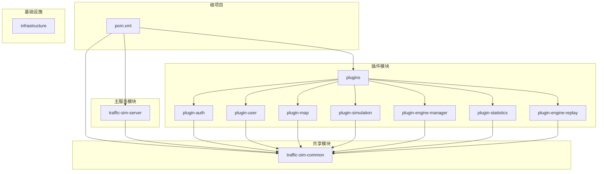
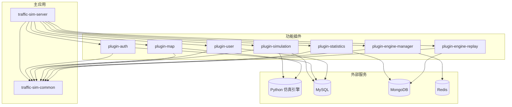
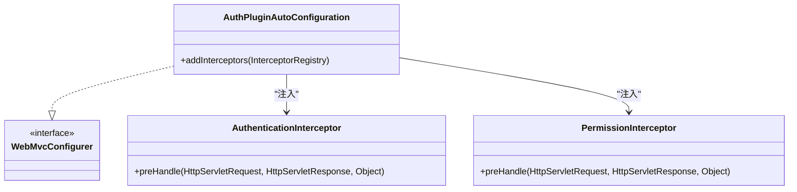
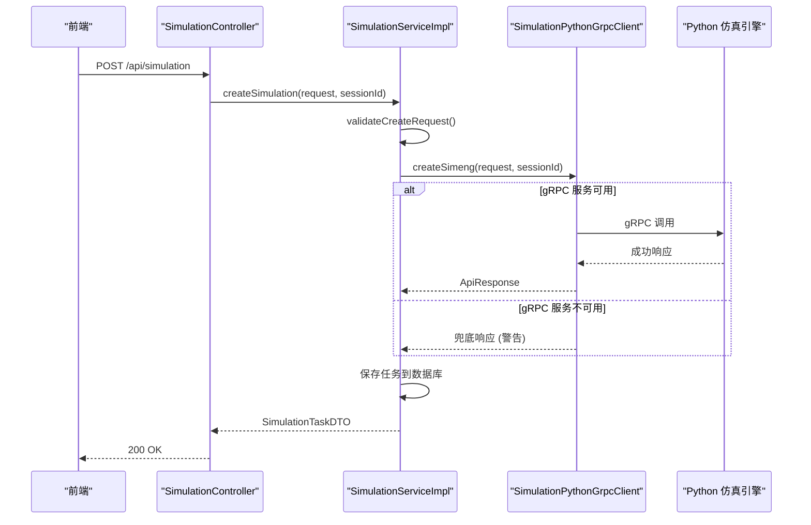
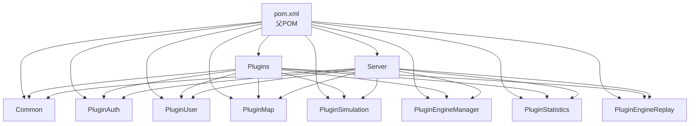

# 系统架构

<cite>
**本文档引用的文件**  
- [TrafficSimApplication.java](file://traffic-sim-server/src/main/java/com/traffic/sim/TrafficSimApplication.java)
- [pom.xml](file://pom.xml)
- [traffic-sim-common/pom.xml](file://traffic-sim-common/pom.xml)
- [plugins/pom.xml](file://plugins/pom.xml)
- [SimulationService.java](file://traffic-sim-common/src/main/java/com/traffic/sim/common/service/SimulationService.java)
- [AuthPluginAutoConfiguration.java](file://plugins/plugin-auth/src/main/java/com/traffic/sim/plugin/auth/config/AuthPluginAutoConfiguration.java)
- [SimulationServiceImpl.java](file://plugins/plugin-simulation/src/main/java/com/traffic/sim/plugin/simulation/service/SimulationServiceImpl.java)
- [application.yml](file://traffic-sim-server/src/main/resources/application.yml)
- [org.springframework.boot.autoconfigure.AutoConfiguration.imports](file://plugins/plugin-auth/src/main/resources/META-INF/spring/org.springframework.boot.autoconfigure.AutoConfiguration.imports)
</cite>

## 目录
1. [简介](#简介)
2. [项目结构](#项目结构)
3. [核心组件](#核心组件)
4. [架构概览](#架构概览)
5. [详细组件分析](#详细组件分析)
6. [依赖分析](#依赖分析)
7. [性能考虑](#性能考虑)
8. [故障排除指南](#故障排除指南)
9. [结论](#结论)

## 简介
本架构文档旨在详细描述交通仿真系统（traffic-sim）的插件化设计和技术蓝图。系统采用Maven多模块结构，以`traffic-sim-server`作为主启动模块，通过Spring Boot的自动配置机制动态加载功能插件。`traffic-sim-common`模块为所有模块提供共享的基础设施，包括通用接口、数据传输对象（DTO）、异常处理和常量。插件如`plugin-auth`和`plugin-simulation`通过`META-INF/spring/org.springframework.boot.autoconfigure.AutoConfiguration.imports`文件被自动发现和集成，实现了高度的模块化和可扩展性。系统还通过gRPC与外部Python仿真引擎通信，并使用MySQL、MongoDB和Redis等外部服务。

## 项目结构
该项目是一个典型的Maven多模块项目，其结构清晰地分离了关注点，支持插件化开发。

**图示来源**  
- [pom.xml](file://pom.xml#L22-L25)
- [plugins/pom.xml](file://plugins/pom.xml#L19-L27)
- [traffic-sim-common/pom.xml](file://traffic-sim-common/pom.xml#L14)

**本节来源**  
- [pom.xml](file://pom.xml#L1-L160)
- [plugins/pom.xml](file://plugins/pom.xml#L1-L41)
- [traffic-sim-common/pom.xml](file://traffic-sim-common/pom.xml#L1-L63)

## 核心组件
系统的核心组件围绕`traffic-sim-server`主应用和`traffic-sim-common`共享模块构建。`TrafficSimApplication`是整个系统的入口点，负责启动Spring Boot应用上下文。`traffic-sim-common`模块定义了所有插件必须遵循的契约，例如`SimulationService`接口，它规定了创建、查询仿真任务和控制绿信比的标准方法。各插件实现这些接口，并通过Spring Boot的自动配置机制将其实现类和配置注入到主应用上下文中，从而实现功能的无缝集成。

**本节来源**  
- [TrafficSimApplication.java](file://traffic-sim-server/src/main/java/com/traffic/sim/TrafficSimApplication.java#L1-L44)
- [SimulationService.java](file://traffic-sim-common/src/main/java/com/traffic/sim/common/service/SimulationService.java#L1-L53)

## 架构概览
该系统的整体架构是一个基于Spring Boot的微内核（Microkernel）或插件化架构。`traffic-sim-server`作为微内核，提供基础的运行环境和启动能力。`traffic-sim-common`模块充当契约层，定义了所有插件必须实现的接口和服务。各个功能插件（如认证、用户管理、地图、仿真等）是独立的模块，它们依赖于`common`模块，并通过Spring Boot 3.x的`AutoConfiguration.imports`机制被主应用自动发现和加载。系统通过REST API与前端交互，并通过gRPC协议与外部Python仿真引擎通信，同时使用MySQL存储核心业务数据，MongoDB存储仿真过程数据，Redis用于缓存和会话管理。

**图示来源**  
- [TrafficSimApplication.java](file://traffic-sim-server/src/main/java/com/traffic/sim/TrafficSimApplication.java#L17-L20)
- [application.yml](file://traffic-sim-server/src/main/resources/application.yml#L6-L39)
- [org.springframework.boot.autoconfigure.AutoConfiguration.imports](file://plugins/plugin-auth/src/main/resources/META-INF/spring/org.springframework.boot.autoconfigure.AutoConfiguration.imports#L1)
- [SimulationServiceImpl.java](file://plugins/plugin-simulation/src/main/java/com/traffic/sim/plugin/simulation/service/SimulationServiceImpl.java#L40)

## 详细组件分析
### 主应用与插件加载机制分析
`traffic-sim-server`模块的`TrafficSimApplication`类是应用的启动类。它使用`@SpringBootApplication`注解，并通过`@ComponentScan`显式扫描`com.traffic.sim`和`com.traffic.sim.plugin`包，确保所有插件中的Spring组件（如`@Service`, `@Controller`）都能被发现。插件的自动配置是通过Spring Boot 3.x的`META-INF/spring/org.springframework.boot.autoconfigure.AutoConfiguration.imports`文件实现的。当Spring Boot启动时，它会扫描所有依赖中的这个文件，并加载其中列出的`@AutoConfiguration`类。例如，`plugin-auth`模块的`AuthPluginAutoConfiguration`类被注册，它会向Spring MVC的拦截器链中添加认证和权限拦截器，从而在不修改主应用代码的情况下扩展其功能。

#### 插件自动配置类

**图示来源**  
- [AuthPluginAutoConfiguration.java](file://plugins/plugin-auth/src/main/java/com/traffic/sim/plugin/auth/config/AuthPluginAutoConfiguration.java#L16-L48)
- [AuthPluginAutoConfiguration.java](file://plugins/plugin-auth/src/main/java/com/traffic/sim/plugin/auth/config/AuthPluginAutoConfiguration.java#L21-L22)

**本节来源**  
- [TrafficSimApplication.java](file://traffic-sim-server/src/main/java/com/traffic/sim/TrafficSimApplication.java#L16-L20)
- [AuthPluginAutoConfiguration.java](file://plugins/plugin-auth/src/main/java/com/traffic/sim/plugin/auth/config/AuthPluginAutoConfiguration.java#L1-L50)
- [org.springframework.boot.autoconfigure.AutoConfiguration.imports](file://plugins/plugin-auth/src/main/resources/META-INF/spring/org.springframework.boot.autoconfigure.AutoConfiguration.imports#L1)

### 仿真服务组件分析
`plugin-simulation`模块实现了`traffic-sim-common`中定义的`SimulationService`接口。`SimulationServiceImpl`是该接口的具体实现，它负责处理创建仿真任务、查询任务列表和控制绿信比等业务逻辑。该服务通过`SimulationPythonGrpcClient`与外部的Python仿真引擎进行通信。系统设计了容错机制：当gRPC服务不可用时，`createSimulation`方法会记录警告并继续执行，返回一个“兜底”的成功响应，保证了主应用的可用性。

#### 仿真服务调用流程

**图示来源**  
- [SimulationServiceImpl.java](file://plugins/plugin-simulation/src/main/java/com/traffic/sim/plugin/simulation/service/SimulationServiceImpl.java#L43-L89)
- [SimulationServiceImpl.java](file://plugins/plugin-simulation/src/main/java/com/traffic/sim/plugin/simulation/service/SimulationServiceImpl.java#L54)
- [SimulationServiceImpl.java](file://plugins/plugin-simulation/src/main/java/com/traffic/sim/plugin/simulation/service/SimulationServiceImpl.java#L66-L86)

**本节来源**  
- [SimulationService.java](file://traffic-sim-common/src/main/java/com/traffic/sim/common/service/SimulationService.java#L15-L52)
- [SimulationServiceImpl.java](file://plugins/plugin-simulation/src/main/java/com/traffic/sim/plugin/simulation/service/SimulationServiceImpl.java#L1-L191)

## 依赖分析
系统的依赖关系清晰地体现了其模块化设计。根`pom.xml`文件作为父POM，定义了所有子模块的版本和依赖管理。`traffic-sim-common`模块被所有其他模块（包括`traffic-sim-server`和所有插件）所依赖，确保了接口和DTO的一致性。`plugins`模块的`pom.xml`通过`<dependencyManagement>`确保了所有插件都使用相同版本的`traffic-sim-common`。`traffic-sim-server`模块依赖于`common`模块和所有插件模块，是唯一一个将所有功能聚合在一起的模块。这种设计使得插件可以独立开发和测试，同时又能被主应用统一管理。

**图示来源**  
- [pom.xml](file://pom.xml#L41-L92)
- [plugins/pom.xml](file://plugins/pom.xml#L32-L36)

**本节来源**  
- [pom.xml](file://pom.xml#L1-L160)
- [plugins/pom.xml](file://plugins/pom.xml#L1-L41)

## 性能考虑
系统的性能受多个因素影响。首先，gRPC通信是性能的关键路径，与Python仿真引擎的交互延迟会直接影响API响应时间。系统通过连接池和长连接（keep-alive）来优化gRPC性能。其次，数据库操作是另一个瓶颈，系统使用HikariCP连接池来管理MySQL连接，并通过JPA的`@Transactional`注解来管理事务。对于高并发的读取操作，可以考虑引入Redis缓存，例如缓存用户信息或地图元数据。此外，`plugin-statistics`模块的计算任务可能非常耗时，应考虑将其设计为异步任务，避免阻塞主线程。

## 故障排除指南
当系统出现问题时，可参考以下步骤进行排查：
1.  **应用启动失败**：检查`application.yml`中的数据库连接配置是否正确。如果与gRPC服务相关的错误导致启动失败，可以在配置中设置`grpc.client.python-service.enabled=false`来禁用gRPC客户端。
2.  **插件功能缺失**：确认插件的`META-INF/spring/org.springframework.boot.autoconfigure.AutoConfiguration.imports`文件存在且内容正确。检查插件的`@AutoConfiguration`类是否被正确扫描。
3.  **gRPC通信失败**：确保Python仿真引擎服务正在运行，并且监听在正确的端口（50051）。检查`application.yml`中的gRPC客户端地址配置。
4.  **数据库连接问题**：验证MySQL、MongoDB和Redis服务是否正常运行，并检查相应的连接字符串和认证信息。

**本节来源**  
- [TrafficSimApplication.java](file://traffic-sim-server/src/main/java/com/traffic/sim/TrafficSimApplication.java#L33-L37)
- [application.yml](file://traffic-sim-server/src/main/resources/application.yml#L69-L81)

## 结论
该交通仿真系统采用了一种先进的插件化架构，具有良好的扩展性和可维护性。通过Maven多模块和Spring Boot自动配置，实现了功能的动态加载和松耦合。`traffic-sim-common`模块作为契约中心，保证了系统的一致性。然而，也存在一些改进空间，例如`plugin-map`和`plugin-engine-manager`的自动配置方式不一致，应统一为`@AutoConfiguration`以符合最佳实践。总体而言，该架构为系统的持续演进提供了坚实的基础。