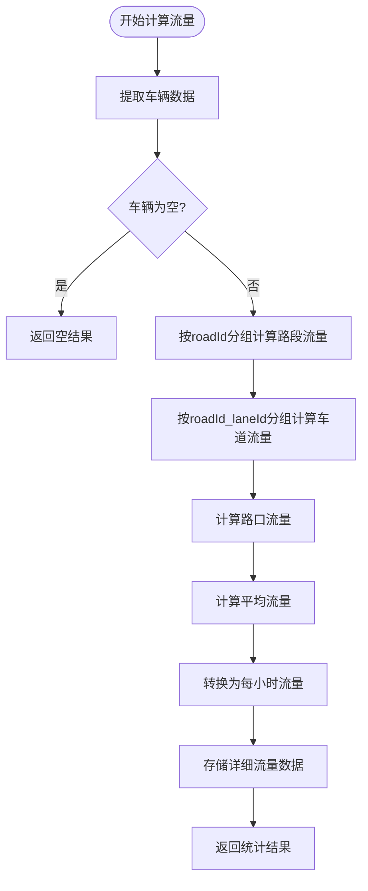
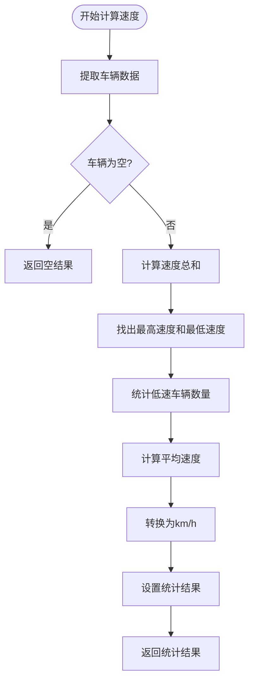
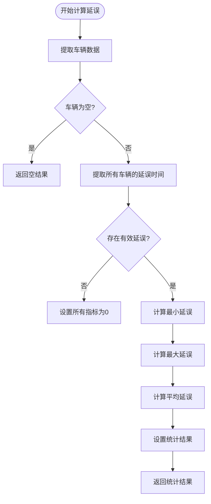
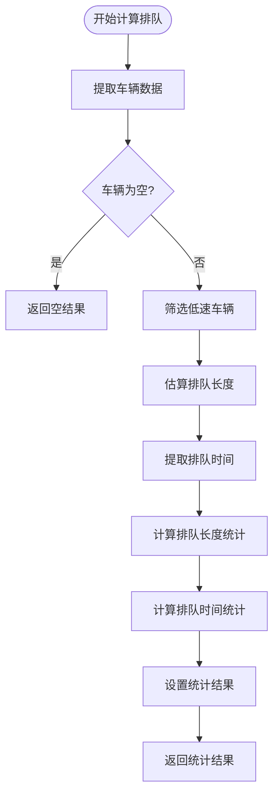
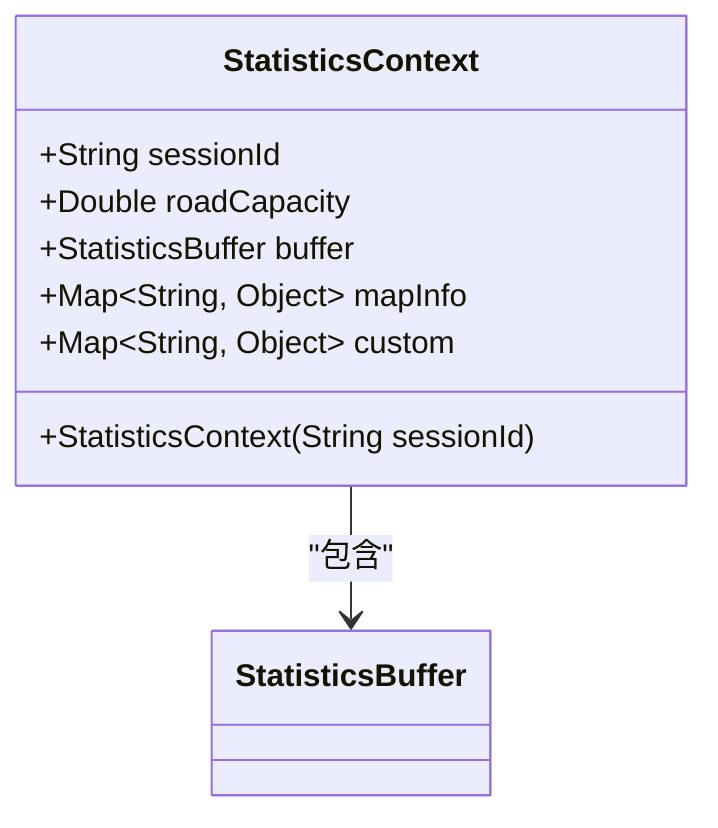
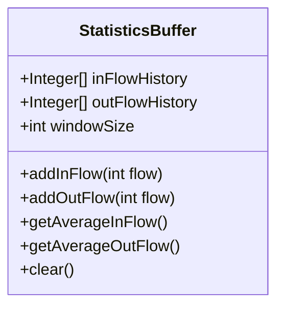
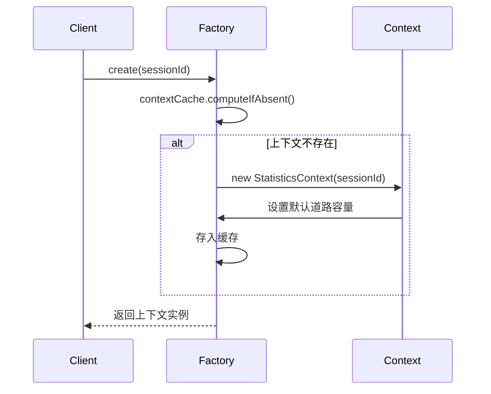
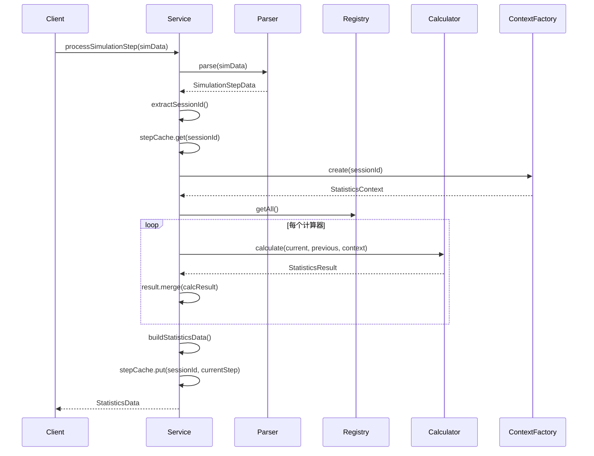
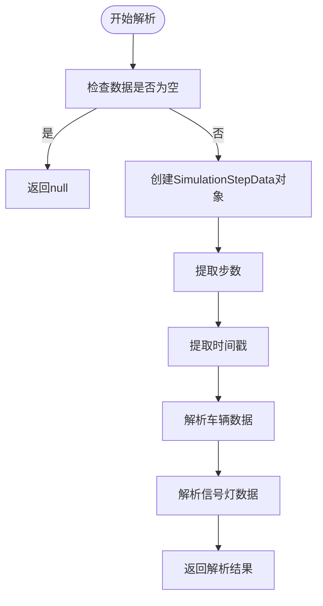
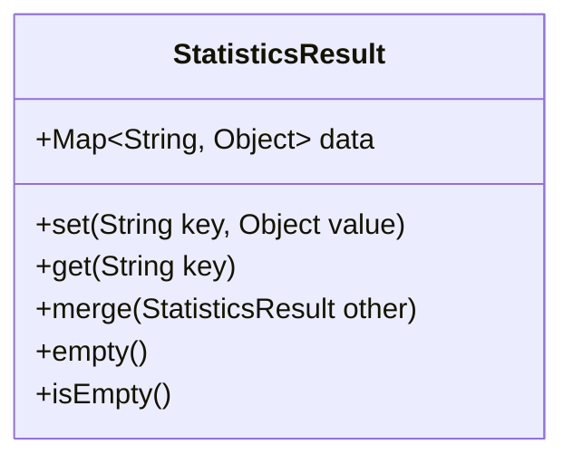

# 统计分析

<cite>
**本文档引用的文件**
- [StatisticsCalculator.java](file://plugins/plugin-statistics/src/main/java/com/traffic/sim/plugin/statistics/calculator/StatisticsCalculator.java)
- [FlowCalculator.java](file://plugins/plugin-statistics/src/main/java/com/traffic/sim/plugin/statistics/calculator/impl/FlowCalculator.java)
- [SpeedCalculator.java](file://plugins/plugin-statistics/src/main/java/com/traffic/sim/plugin/statistics/calculator/impl/SpeedCalculator.java)
- [DelayCalculator.java](file://plugins/plugin-statistics/src/main/java/com/traffic/sim/plugin/statistics/calculator/impl/DelayCalculator.java)
- [QueueCalculator.java](file://plugins/plugin-statistics/src/main/java/com/traffic/sim/plugin/statistics/calculator/impl/QueueCalculator.java)
- [StatisticsCalculatorRegistry.java](file://plugins/plugin-statistics/src/main/java/com/traffic/sim/plugin/statistics/calculator/StatisticsCalculatorRegistry.java)
- [StatisticsContext.java](file://plugins/plugin-statistics/src/main/java/com/traffic/sim/plugin/statistics/model/StatisticsContext.java)
- [StatisticsBuffer.java](file://plugins/plugin-statistics/src/main/java/com/traffic/sim/plugin/statistics/model/StatisticsBuffer.java)
- [StatisticsResult.java](file://plugins/plugin-statistics/src/main/java/com/traffic/sim/plugin/statistics/model/StatisticsResult.java)
- [StatisticsServiceImpl.java](file://plugins/plugin-statistics/src/main/java/com/traffic/sim/plugin/statistics/service/StatisticsServiceImpl.java)
- [SimulationDataParser.java](file://plugins/plugin-statistics/src/main/java/com/traffic/sim/plugin/statistics/parser/SimulationDataParser.java)
- [SimulationStepData.java](file://plugins/plugin-statistics/src/main/java/com/traffic/sim/plugin/statistics/model/SimulationStepData.java)
- [StatisticsContextFactory.java](file://plugins/plugin-statistics/src/main/java/com/traffic/sim/plugin/statistics/service/StatisticsContextFactory.java)
- [UnitConverter.java](file://plugins/plugin-statistics/src/main/java/com/traffic/sim/plugin/statistics/util/UnitConverter.java)
- [StatisticsPluginAutoConfiguration.java](file://plugins/plugin-statistics/src/main/java/com/traffic/sim/plugin/statistics/config/StatisticsPluginAutoConfiguration.java)
</cite>

## 目录
1. [引言](#引言)
2. [核心组件](#核心组件)
3. [统计计算机制](#统计计算机制)
4. [上下文与缓冲区管理](#上下文与缓冲区管理)
5. [服务协调流程](#服务协调流程)
6. [统计指标定义](#统计指标定义)
7. [结果数据结构](#结果数据结构)

## 引言
本文档详细描述了交通仿真系统中的统计分析功能。该系统通过收集仿真过程中的实时数据（如流量、速度、延误等）进行计算和分析，为交通状况评估提供量化指标。系统采用模块化设计，通过接口和实现类分离的方式，实现了灵活的统计功能扩展。

## 核心组件

**本节来源**
- [StatisticsCalculator.java](file://plugins/plugin-statistics/src/main/java/com/traffic/sim/plugin/statistics/calculator/StatisticsCalculator.java#L1-L39)
- [StatisticsCalculatorRegistry.java](file://plugins/plugin-statistics/src/main/java/com/traffic/sim/plugin/statistics/calculator/StatisticsCalculatorRegistry.java#L1-L54)
- [StatisticsPluginAutoConfiguration.java](file://plugins/plugin-statistics/src/main/java/com/traffic/sim/plugin/statistics/config/StatisticsPluginAutoConfiguration.java#L1-L61)

### 统计计算器接口
`StatisticsCalculator` 接口是所有统计计算功能的核心契约，定义了统计计算的基本方法：

- `calculate()`：执行统计计算，接收当前步数据、上一步数据和统计上下文，返回统计结果
- `getName()`：获取计算器名称，用于标识和注册
- `getCalculatedFields()`：获取该计算器计算的统计字段列表

### 计算器注册表
`StatisticsCalculatorRegistry` 类实现了计算器的注册和管理功能，使用线程安全的 `ConcurrentHashMap` 存储所有注册的计算器实例。系统通过 Spring 的依赖注入机制，在启动时自动发现所有实现了 `StatisticsCalculator` 接口的组件，并将其注册到注册表中。

### 自动配置
`StatisticsPluginAutoConfiguration` 类通过 `@ComponentScan` 注解扫描统计插件包下的所有组件，并通过 `calculatorRegistry` Bean 方法将所有发现的计算器实例注册到注册表中。这种设计实现了插件化和可扩展的统计功能架构。

## 统计计算机制

**本节来源**
- [FlowCalculator.java](file://plugins/plugin-statistics/src/main/java/com/traffic/sim/plugin/statistics/calculator/impl/FlowCalculator.java#L1-L114)
- [SpeedCalculator.java](file://plugins/plugin-statistics/src/main/java/com/traffic/sim/plugin/statistics/calculator/impl/SpeedCalculator.java#L1-L78)
- [DelayCalculator.java](file://plugins/plugin-statistics/src/main/java/com/traffic/sim/plugin/statistics/calculator/impl/DelayCalculator.java#L1-L87)
- [QueueCalculator.java](file://plugins/plugin-statistics/src/main/java/com/traffic/sim/plugin/statistics/calculator/impl/QueueCalculator.java#L1-L122)

### 流量计算器
`FlowCalculator` 负责计算路段、车道和路口的流量统计：

**图表来源**
- [FlowCalculator.java](file://plugins/plugin-statistics/src/main/java/com/traffic/sim/plugin/statistics/calculator/impl/FlowCalculator.java#L24-L85)

### 速度计算器
`SpeedCalculator` 负责计算车辆速度相关的统计指标：

**图表来源**
- [SpeedCalculator.java](file://plugins/plugin-statistics/src/main/java/com/traffic/sim/plugin/statistics/calculator/impl/SpeedCalculator.java#L26-L64)

### 延误计算器
`DelayCalculator` 从车辆属性中提取延误时间并计算相关统计：

**图表来源**
- [DelayCalculator.java](file://plugins/plugin-statistics/src/main/java/com/traffic/sim/plugin/statistics/calculator/impl/DelayCalculator.java#L25-L60)

### 排队计算器
`QueueCalculator` 基于低速阈值判断排队车辆并计算排队相关指标：

**图表来源**
- [QueueCalculator.java](file://plugins/plugin-statistics/src/main/java/com/traffic/sim/plugin/statistics/calculator/impl/QueueCalculator.java#L27-L85)

## 上下文与缓冲区管理

**本节来源**
- [StatisticsContext.java](file://plugins/plugin-statistics/src/main/java/com/traffic/sim/plugin/statistics/model/StatisticsContext.java#L1-L47)
- [StatisticsBuffer.java](file://plugins/plugin-statistics/src/main/java/com/traffic/sim/plugin/statistics/model/StatisticsBuffer.java#L1-L87)
- [StatisticsContextFactory.java](file://plugins/plugin-statistics/src/main/java/com/traffic/sim/plugin/statistics/service/StatisticsContextFactory.java#L1-L49)

### 统计上下文
`StatisticsContext` 类封装了统计计算所需的上下文信息：

- `sessionId`：会话ID，用于区分不同的仿真会话
- `roadCapacity`：道路容量，用于容量相关的计算
- `buffer`：统计缓冲区，用于累计计算
- `mapInfo`：地图信息，包含道路网络拓扑等数据
- `custom`：自定义上下文数据，用于扩展功能

**图表来源**
- [StatisticsContext.java](file://plugins/plugin-statistics/src/main/java/com/traffic/sim/plugin/statistics/model/StatisticsContext.java#L13-L45)

### 统计缓冲区
`StatisticsBuffer` 类实现了滑动窗口机制，用于累计计算和历史数据分析：

- `inFlowHistory`：进入流量历史记录
- `outFlowHistory`：离开流量历史记录
- `windowSize`：窗口大小，默认100步
- 提供添加流量、计算平均流量和清空缓冲区的方法

**图表来源**
- [StatisticsBuffer.java](file://plugins/plugin-statistics/src/main/java/com/traffic/sim/plugin/statistics/model/StatisticsBuffer.java#L14-L85)

### 上下文工厂
`StatisticsContextFactory` 负责创建和管理统计上下文实例，使用 `ConcurrentHashMap` 缓存已创建的上下文，避免重复创建：

**图表来源**
- [StatisticsContextFactory.java](file://plugins/plugin-statistics/src/main/java/com/traffic/sim/plugin/statistics/service/StatisticsContextFactory.java#L25-L31)

## 服务协调流程

**本节来源**
- [StatisticsServiceImpl.java](file://plugins/plugin-statistics/src/main/java/com/traffic/sim/plugin/statistics/service/StatisticsServiceImpl.java#L1-L195)
- [SimulationDataParser.java](file://plugins/plugin-statistics/src/main/java/com/traffic/sim/plugin/statistics/parser/SimulationDataParser.java#L1-L170)

### 数据处理流程
`StatisticsServiceImpl` 协调整个统计分析过程，其工作流程如下：

**图表来源**
- [StatisticsServiceImpl.java](file://plugins/plugin-statistics/src/main/java/com/traffic/sim/plugin/statistics/service/StatisticsServiceImpl.java#L37-L75)

### 数据解析
`SimulationDataParser` 负责将原始的 Map 数据解析为结构化的 `SimulationStepData` 对象：

**图表来源**
- [SimulationDataParser.java](file://plugins/plugin-statistics/src/main/java/com/traffic/sim/plugin/statistics/parser/SimulationDataParser.java#L24-L55)

## 统计指标定义

**本节来源**
- [FlowCalculator.java](file://plugins/plugin-statistics/src/main/java/com/traffic/sim/plugin/statistics/calculator/impl/FlowCalculator.java#L61-L77)
- [SpeedCalculator.java](file://plugins/plugin-statistics/src/main/java/com/traffic/sim/plugin/statistics/calculator/impl/SpeedCalculator.java#L55-L62)
- [DelayCalculator.java](file://plugins/plugin-statistics/src/main/java/com/traffic/sim/plugin/statistics/calculator/impl/DelayCalculator.java#L47-L53)
- [QueueCalculator.java](file://plugins/plugin-statistics/src/main/java/com/traffic/sim/plugin/statistics/calculator/impl/QueueCalculator.java#L58-L64)
- [UnitConverter.java](file://plugins/plugin-statistics/src/main/java/com/traffic/sim/plugin/statistics/util/UnitConverter.java#L1-L37)

### 流量指标
| 指标名称 | 计算公式 | 业务含义 | 单位 |
|---------|--------|--------|------|
| 路段平均流量 | 路段车辆数总和 / 路段数量 | 反映路段整体交通流量水平 | 辆/小时 |
| 车道平均流量 | 车道车辆数总和 / 车道数量 | 反映车道级交通流量分布 | 辆/小时 |
| 路口平均流量 | 路口车辆数总和 / 路口数量 | 反映路口交通压力 | 辆/小时 |

### 速度指标
| 指标名称 | 计算公式 | 业务含义 | 单位 |
|---------|--------|--------|------|
| 最小速度 | 所有车辆速度的最小值 | 反映交通最拥堵情况 | km/h |
| 最大速度 | 所有车辆速度的最大值 | 反映交通最畅通情况 | km/h |
| 平均速度 | 所有车辆速度的平均值 | 反映整体交通运行效率 | km/h |
| 低速车辆数 | 速度低于0.1m/s的车辆数量 | 反映拥堵程度 | 辆 |

### 延误指标
| 指标名称 | 计算公式 | 业务含义 | 单位 |
|---------|--------|--------|------|
| 最小延误 | 所有车辆延误时间的最小值 | 反映最短延误情况 | 秒 |
| 最大延误 | 所有车辆延误时间的最大值 | 反映最长延误情况 | 秒 |
| 平均延误 | 所有车辆延误时间的平均值 | 反映整体延误水平 | 秒 |

### 排队指标
| 指标名称 | 计算公式 | 业务含义 | 单位 |
|---------|--------|--------|------|
| 最小排队长度 | 所有排队车辆长度的最小值 | 反映最短排队情况 | 米 |
| 最大排队长度 | 所有排队车辆长度的最大值 | 反映最长排队情况 | 米 |
| 平均排队长度 | 所有排队车辆长度的平均值 | 反映整体排队长度 | 米 |
| 最小排队时间 | 所有排队车辆时间的最小值 | 反映最短等待时间 | 秒 |
| 最大排队时间 | 所有排队车辆时间的最大值 | 反映最长等待时间 | 秒 |
| 平均排队时间 | 所有排队车辆时间的平均值 | 反映整体等待时间 | 秒 |

## 结果数据结构

**本节来源**
- [StatisticsResult.java](file://plugins/plugin-statistics/src/main/java/com/traffic/sim/plugin/statistics/model/StatisticsResult.java#L1-L56)
- [StatisticsServiceImpl.java](file://plugins/plugin-statistics/src/main/java/com/traffic/sim/plugin/statistics/service/StatisticsServiceImpl.java#L123-L139)

### 统计结果模型
`StatisticsResult` 类封装了单个统计计算器的计算结果，采用键值对形式存储统计指标：

**图表来源**
- [StatisticsResult.java](file://plugins/plugin-statistics/src/main/java/com/traffic/sim/plugin/statistics/model/StatisticsResult.java#L13-L53)

### 最终输出结构
`StatisticsData` 类是最终返回给客户端的数据结构，包含标准化的统计字段和自定义字段：

- `step`：当前仿真步数
- `timestamp`：时间戳
- `vehicleCount`：车辆数量
- `averageSpeed`：平均速度
- `congestionIndex`：拥堵指数
- `custom`：自定义字段，包含所有详细的统计结果

系统通过 `buildStatisticsData` 方法将多个计算器的结果合并到 `StatisticsData` 对象中，实现了统计结果的标准化输出。

**本节来源**
- [StatisticsServiceImpl.java](file://plugins/plugin-statistics/src/main/java/com/traffic/sim/plugin/statistics/service/StatisticsServiceImpl.java#L123-L139)