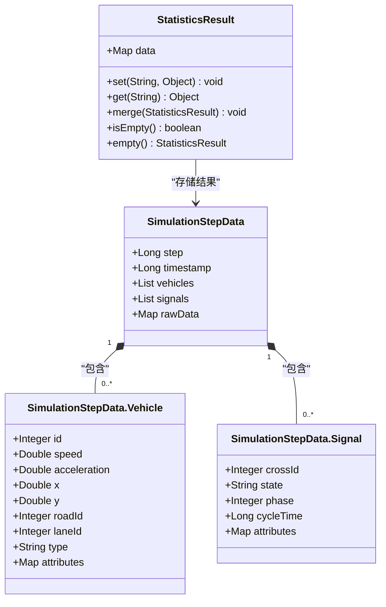
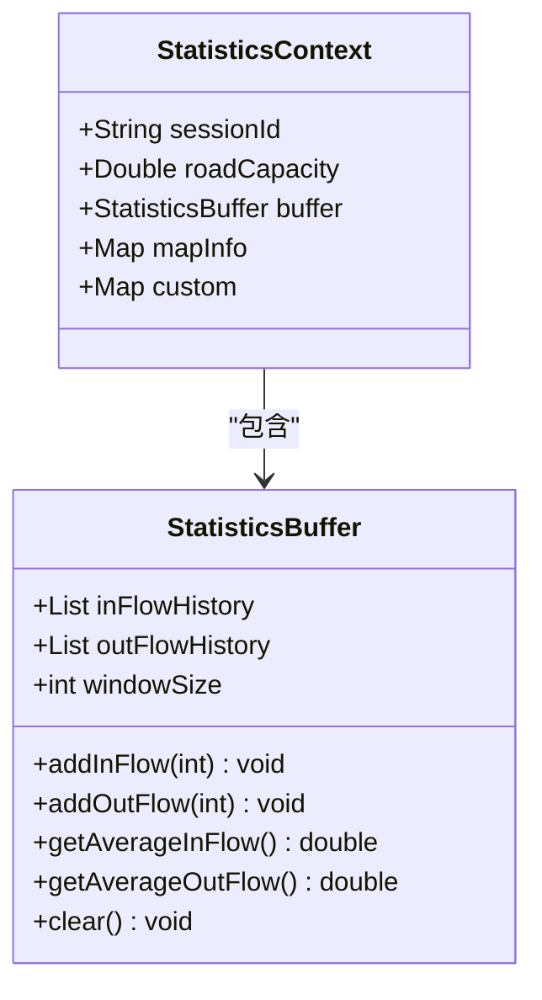
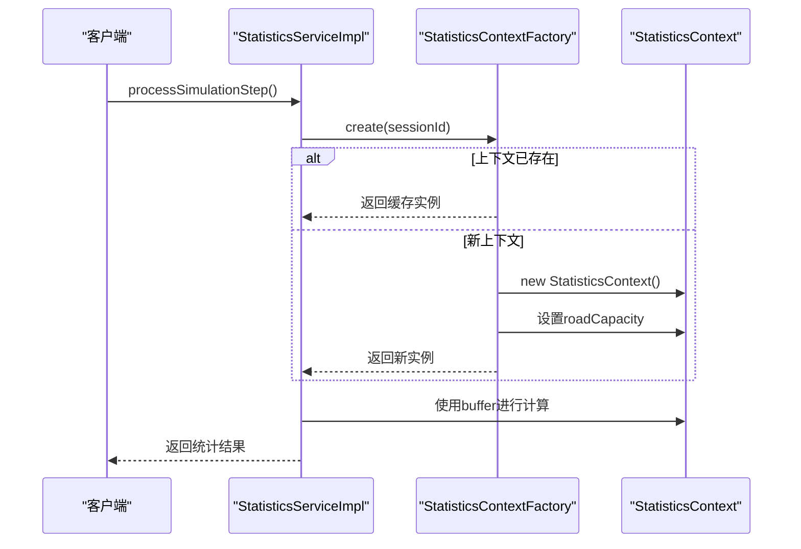
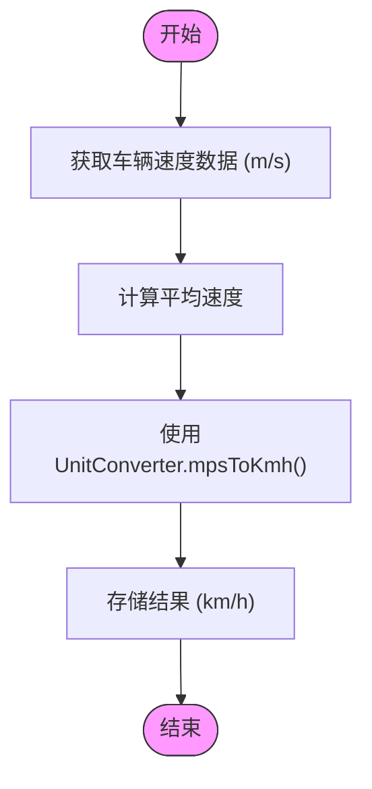
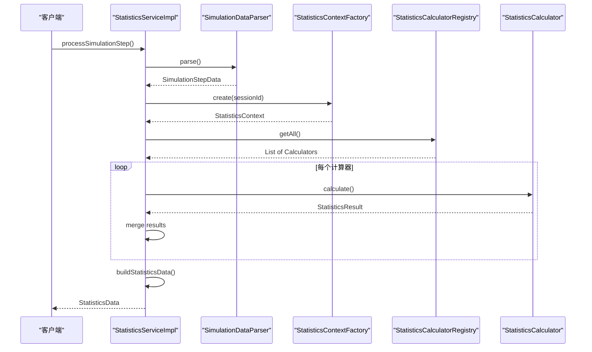

# 统计数据分析模型

<cite>
**本文档引用文件**  
- [StatisticsResult.java](file://plugins/plugin-statistics/src/main/java/com/traffic/sim/plugin/statistics/model/StatisticsResult.java)
- [StatisticsBuffer.java](file://plugins/plugin-statistics/src/main/java/com/traffic/sim/plugin/statistics/model/StatisticsBuffer.java)
- [StatisticsContext.java](file://plugins/plugin-statistics/src/main/java/com/traffic/sim/plugin/statistics/model/StatisticsContext.java)
- [UnitConverter.java](file://plugins/plugin-statistics/src/main/java/com/traffic/sim/plugin/statistics/util/UnitConverter.java)
- [SimulationStepData.java](file://plugins/plugin-statistics/src/main/java/com/traffic/sim/plugin/statistics/model/SimulationStepData.java)
- [StatisticsContextFactory.java](file://plugins/plugin-statistics/src/main/java/com/traffic/sim/plugin/statistics/service/StatisticsContextFactory.java)
- [StatisticsServiceImpl.java](file://plugins/plugin-statistics/src/main/java/com/traffic/sim/plugin/statistics/service/StatisticsServiceImpl.java)
- [StatisticsData.java](file://traffic-sim-common/src/main/java/com/traffic/sim/common/model/StatisticsData.java)
- [SpeedCalculator.java](file://plugins/plugin-statistics/src/main/java/com/traffic/sim/plugin/statistics/calculator/impl/SpeedCalculator.java)
- [AccelerationCalculator.java](file://plugins/plugin-statistics/src/main/java/com/traffic/sim/plugin/statistics/calculator/impl/AccelerationCalculator.java)
- [SimulationDataParser.java](file://plugins/plugin-statistics/src/main/java/com/traffic/sim/plugin/statistics/parser/SimulationDataParser.java)
- [StatisticsCalculatorRegistry.java](file://plugins/plugin-statistics/src/main/java/com/traffic/sim/plugin/statistics/calculator/StatisticsCalculatorRegistry.java)
</cite>

## 目录
1. [引言](#引言)
2. [核心数据结构](#核心数据结构)
3. [统计缓冲区设计](#统计缓冲区设计)
4. [统计上下文管理](#统计上下文管理)
5. [单位转换机制](#单位转换机制)
6. [数据处理流程](#数据处理流程)
7. [JSON输出示例](#json输出示例)
8. [序列化注意事项](#序列化注意事项)
9. [结论](#结论)

## 引言
本文档详细描述了交通仿真系统中统计分析数据模型的设计与实现。该模型通过`StatisticsResult`、`StatisticsBuffer`、`StatisticsContext`等核心组件，实现了对仿真数据的高效统计分析。系统采用模块化设计，支持增量计算和线程安全操作，为交通流量分析提供了可靠的数据基础。

## 核心数据结构

### StatisticsResult数据模型
`StatisticsResult`类是统计计算的核心数据结构，采用键值对形式存储统计结果。该类使用`HashMap<String, Object>`作为内部数据容器，支持动态添加和获取统计指标。

主要特性包括：
- **动态字段存储**：通过`set(String key, Object value)`方法添加统计值
- **结果合并**：提供`merge(StatisticsResult other)`方法支持结果聚合
- **空值检查**：`isEmpty()`方法用于判断结果是否为空
- **静态工厂**：`empty()`方法创建空结果实例

该设计提供了极大的灵活性，允许不同统计计算器动态添加各自的计算结果，而无需预先定义所有可能的统计字段。

**本节来源**
- [StatisticsResult.java](file://plugins/plugin-statistics/src/main/java/com/traffic/sim/plugin/statistics/model/StatisticsResult.java#L1-L56)

### SimulationStepData数据结构
`SimulationStepData`类封装了单个仿真步的完整数据，包括：
- **仿真步数**：`step`字段记录当前仿真步
- **时间戳**：`timestamp`字段记录数据生成时间
- **车辆列表**：包含车辆ID、速度、加速度、位置等信息
- **信号灯列表**：包含路口ID、信号状态、相位等信息
- **原始数据**：保留原始输入数据以供后续处理

车辆和信号灯数据通过嵌套类实现，形成了清晰的层次结构。

**本节来源**
- [SimulationStepData.java](file://plugins/plugin-statistics/src/main/java/com/traffic/sim/plugin/statistics/model/SimulationStepData.java#L1-L71)



**图表来源**
- [StatisticsResult.java](file://plugins/plugin-statistics/src/main/java/com/traffic/sim/plugin/statistics/model/StatisticsResult.java#L14-L56)
- [SimulationStepData.java](file://plugins/plugin-statistics/src/main/java/com/traffic/sim/plugin/statistics/model/SimulationStepData.java#L15-L71)

## 统计缓冲区设计

### StatisticsBuffer实现机制
`StatisticsBuffer`类作为临时存储缓冲区，支持增量计算和滑动窗口统计。其主要功能包括：

- **流量历史记录**：维护`inFlowHistory`和`outFlowHistory`两个列表，分别记录进入和离开流量
- **滑动窗口**：通过`windowSize`（默认100步）限制历史数据长度，自动移除过期数据
- **平均值计算**：提供`getAverageInFlow()`和`getAverageOutFlow()`方法计算平均流量
- **缓冲区管理**：`clear()`方法用于清空缓冲区

该缓冲区设计支持时间序列分析，能够计算短期流量趋势，为拥堵预测提供数据支持。

**本节来源**
- [StatisticsBuffer.java](file://plugins/plugin-statistics/src/main/java/com/traffic/sim/plugin/statistics/model/StatisticsBuffer.java#L1-L87)

### 线程安全实现
`StatisticsBuffer`通过以下机制确保线程安全：
- **同步集合**：虽然使用`ArrayList`，但在实际使用中由`StatisticsContext`的线程安全机制保护
- **原子操作**：添加和计算操作在单个方法调用中完成
- **不可变性**：计算结果以新对象形式返回，避免共享状态

在多线程环境下，每个会话拥有独立的`StatisticsContext`实例，从根本上避免了竞争条件。



**图表来源**
- [StatisticsBuffer.java](file://plugins/plugin-statistics/src/main/java/com/traffic/sim/plugin/statistics/model/StatisticsBuffer.java#L15-L87)
- [StatisticsContext.java](file://plugins/plugin-statistics/src/main/java/com/traffic/sim/plugin/statistics/model/StatisticsContext.java#L14-L47)

## 统计上下文管理

### StatisticsContext设计
`StatisticsContext`类封装了当前仿真步的上下文信息，主要包括：
- **会话标识**：`sessionId`用于区分不同仿真会话
- **道路容量**：`roadCapacity`存储道路最大通行能力
- **统计缓冲区**：`buffer`字段引用`StatisticsBuffer`实例
- **地图信息**：`mapInfo`存储地图相关数据
- **自定义数据**：`custom`字段支持扩展上下文信息

该类在构造时自动创建`StatisticsBuffer`实例，确保每个上下文都有独立的缓冲区。

**本节来源**
- [StatisticsContext.java](file://plugins/plugin-statistics/src/main/java/com/traffic/sim/plugin/statistics/model/StatisticsContext.java#L1-L47)

### 上下文生命周期管理
`StatisticsContextFactory`负责上下文的创建和管理：
- **缓存机制**：使用`ConcurrentHashMap`缓存上下文实例，按`sessionId`索引
- **懒加载**：`create(String sessionId)`方法在需要时创建新实例
- **资源清理**：提供`remove(String sessionId)`和`clear()`方法管理生命周期

这种设计避免了重复创建上下文，提高了性能，同时确保了线程安全。

**本节来源**
- [StatisticsContextFactory.java](file://plugins/plugin-statistics/src/main/java/com/traffic/sim/plugin/statistics/service/StatisticsContextFactory.java#L1-L49)



**图表来源**
- [StatisticsServiceImpl.java](file://plugins/plugin-statistics/src/main/java/com/traffic/sim/plugin/statistics/service/StatisticsServiceImpl.java#L27-L195)
- [StatisticsContextFactory.java](file://plugins/plugin-statistics/src/main/java/com/traffic/sim/plugin/statistics/service/StatisticsContextFactory.java#L18-L49)
- [StatisticsContext.java](file://plugins/plugin-statistics/src/main/java/com/traffic/sim/plugin/statistics/model/StatisticsContext.java#L14-L47)

## 单位转换机制

### UnitConverter功能
`UnitConverter`工具类提供标准化的单位转换功能：
- **速度转换**：`mpsToKmh(double)`和`kmhToMps(double)`实现米/秒与千米/小时之间的转换
- **流量转换**：`flowToPerHour(double)`和`perHourToFlow(double)`处理流量单位转换
- **常量定义**：基于每步0.1秒的假设，每小时等于36000步

这些转换方法被统计计算器广泛使用，确保输出数据的单位一致性。

**本节来源**
- [UnitConverter.java](file://plugins/plugin-statistics/src/main/java/com/traffic/sim/plugin/statistics/util/UnitConverter.java#L1-L40)

### 实际应用示例
在`SpeedCalculator`中，单位转换的应用流程如下：
1. 从车辆数据获取速度（m/s）
2. 计算平均速度
3. 使用`UnitConverter.mpsToKmh()`转换为km/h
4. 存储转换后的结果

这种设计将单位转换逻辑集中管理，避免了在多个计算器中重复实现。

**本节来源**
- [SpeedCalculator.java](file://plugins/plugin-statistics/src/main/java/com/traffic/sim/plugin/statistics/calculator/impl/SpeedCalculator.java#L1-L78)
- [UnitConverter.java](file://plugins/plugin-statistics/src/main/java/com/traffic/sim/plugin/statistics/util/UnitConverter.java#L1-L40)



**图表来源**
- [SpeedCalculator.java](file://plugins/plugin-statistics/src/main/java/com/traffic/sim/plugin/statistics/calculator/impl/SpeedCalculator.java#L26-L65)
- [UnitConverter.java](file://plugins/plugin-statistics/src/main/java/com/traffic/sim/plugin/statistics/util/UnitConverter.java#L13-L15)

## 数据处理流程

### 统计服务工作流
`StatisticsServiceImpl`实现了完整的数据处理流程：
1. **数据解析**：使用`SimulationDataParser`将原始数据转换为`SimulationStepData`
2. **上下文获取**：通过`StatisticsContextFactory`获取或创建会话上下文
3. **计算器执行**：遍历所有注册的`StatisticsCalculator`并执行计算
4. **结果聚合**：合并所有计算器的结果到`StatisticsResult`
5. **数据构建**：将`StatisticsResult`转换为`StatisticsData`格式
6. **缓存更新**：保存当前步数据供下一步计算使用

**本节来源**
- [StatisticsServiceImpl.java](file://plugins/plugin-statistics/src/main/java/com/traffic/sim/plugin/statistics/service/StatisticsServiceImpl.java#L1-L195)

### 计算器注册机制
`StatisticsCalculatorRegistry`管理所有统计计算器：
- **自动注册**：通过Spring的`@ComponentScan`自动发现并注册计算器
- **集中管理**：提供`getAll()`方法获取所有计算器实例
- **按名查找**：支持通过名称获取特定计算器

这种设计实现了插件化架构，新计算器只需实现`StatisticsCalculator`接口并添加`@Component`注解即可自动集成。

**本节来源**
- [StatisticsCalculatorRegistry.java](file://plugins/plugin-statistics/src/main/java/com/traffic/sim/plugin/statistics/calculator/StatisticsCalculatorRegistry.java#L1-L53)
- [StatisticsCalculator.java](file://plugins/plugin-statistics/src/main/java/com/traffic/sim/plugin/statistics/calculator/StatisticsCalculator.java#L1-L39)



**图表来源**
- [StatisticsServiceImpl.java](file://plugins/plugin-statistics/src/main/java/com/traffic/sim/plugin/statistics/service/StatisticsServiceImpl.java#L37-L78)
- [SimulationDataParser.java](file://plugins/plugin-statistics/src/main/java/com/traffic/sim/plugin/statistics/parser/SimulationDataParser.java#L1-L170)
- [StatisticsContextFactory.java](file://plugins/plugin-statistics/src/main/java/com/traffic/sim/plugin/statistics/service/StatisticsContextFactory.java#L1-L49)
- [StatisticsCalculatorRegistry.java](file://plugins/plugin-statistics/src/main/java/com/traffic/sim/plugin/statistics/calculator/StatisticsCalculatorRegistry.java#L1-L53)

## JSON输出示例

### 实际输出格式
以下是`StatisticsData`的JSON序列化示例：

```json
{
  "step": 1500,
  "timestamp": 1703123456789,
  "vehicleCount": 45,
  "averageSpeed": 45.6,
  "congestionIndex": 0.78,
  "custom": {
    "speed_min": 0.0,
    "speed_max": 80.0,
    "speed_ave": 45.6,
    "acc_min": -3.2,
    "acc_max": 2.8,
    "acc_ave": 0.15,
    "car_number": 45,
    "car_in": 8,
    "car_out": 6,
    "low_speed": 12,
    "jam_index": 0.78,
    "global_cars_in": 1250,
    "global_cars_out": 1200,
    "flow_rd_ave": 2880,
    "flow_la_ave": 720
  }
}
```

### 字段说明
- **基础字段**：`step`、`timestamp`、`vehicleCount`等直接映射到`StatisticsData`属性
- **自定义字段**：所有统计结果存储在`custom`对象中
- **单位标准化**：速度单位为km/h，流量单位为每小时车辆数
- **时间精度**：时间戳为毫秒级

**本节来源**
- [StatisticsData.java](file://traffic-sim-common/src/main/java/com/traffic/sim/common/model/StatisticsData.java#L1-L45)
- [StatisticsServiceImpl.java](file://plugins/plugin-statistics/src/main/java/com/traffic/sim/plugin/statistics/service/StatisticsServiceImpl.java#L123-L138)

## 序列化注意事项

### 数据类型处理
在序列化/反序列化过程中需要注意：
- **数值类型**：使用`getInteger()`和`getDouble()`方法安全提取数值，支持`Number`接口的各种实现
- **空值处理**：`getInteger()`和`getDouble()`方法返回`null`而非抛出异常
- **类型转换**：自动处理`Integer`、`Long`、`Double`等数值类型的转换

**本节来源**
- [StatisticsServiceImpl.java](file://plugins/plugin-statistics/src/main/java/com/traffic/sim/plugin/statistics/service/StatisticsServiceImpl.java#L158-L179)
- [SimulationDataParser.java](file://plugins/plugin-statistics/src/main/java/com/traffic/sim/plugin/statistics/parser/SimulationDataParser.java#L125-L167)

### 设计决策说明
根据`plugin-statistics-Issue.md`中的设计决策：
- **扁平化结构**：采用扁平化的`StatisticsData`结构而非设计文档中的层次化结构
- **灵活性优先**：通过`custom`字段存储所有统计结果，提高扩展性
- **前端友好**：简化前端数据访问，避免复杂的嵌套解析
- **向后兼容**：保持与现有系统的兼容性

这种设计虽然与原始设计文档不完全一致，但提供了更好的灵活性和可维护性。

**本节来源**
- [plugin-statistics-Issue.md](file://plugins/plugin-statistics/plugin-statistics-Issue.md#L1-L64)

## 结论
本文档详细分析了交通仿真系统中的统计分析数据模型。该模型通过`StatisticsResult`、`StatisticsBuffer`、`StatisticsContext`等核心组件，实现了高效、灵活的统计计算。系统采用模块化设计，支持增量计算和线程安全操作，通过`UnitConverter`确保单位一致性。尽管实际实现与设计文档在数据结构上有所差异，但扁平化的`StatisticsData`设计提供了更好的灵活性和扩展性，满足了实际应用需求。