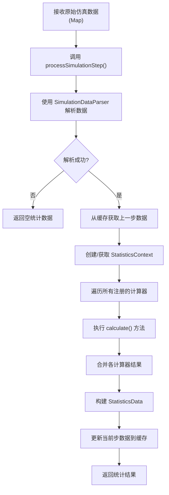
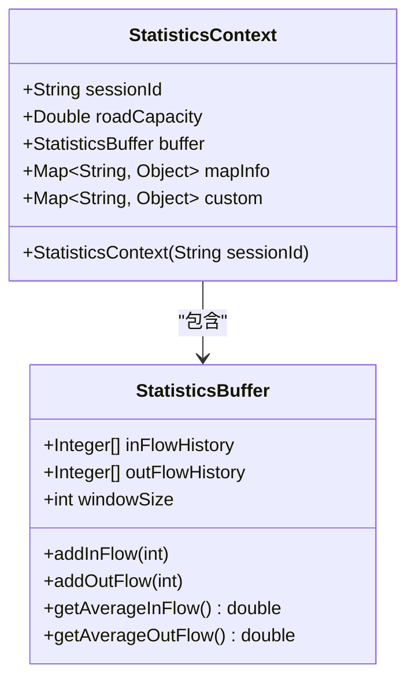
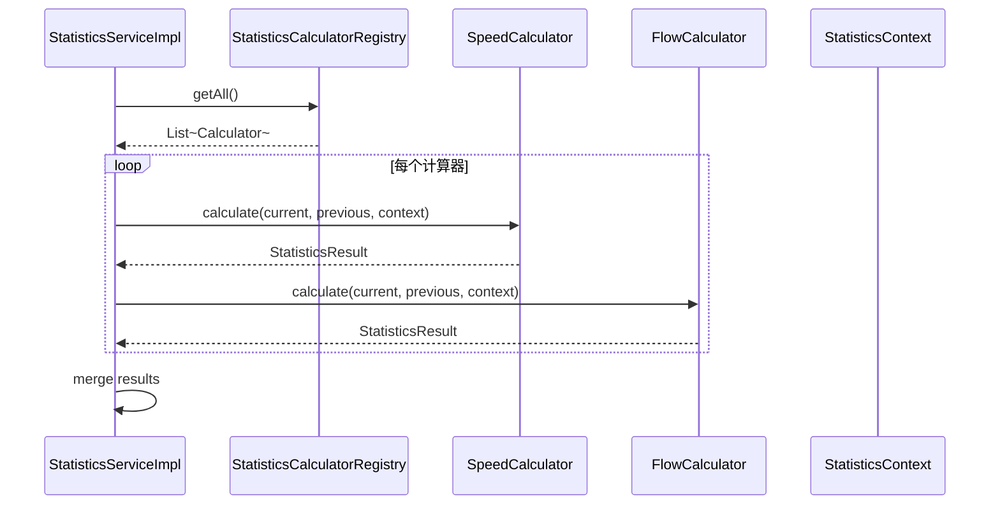
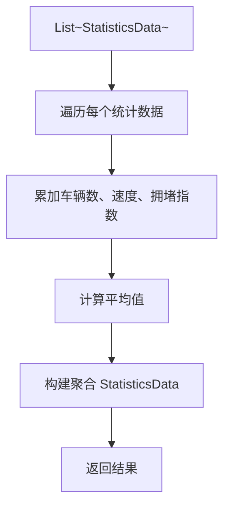
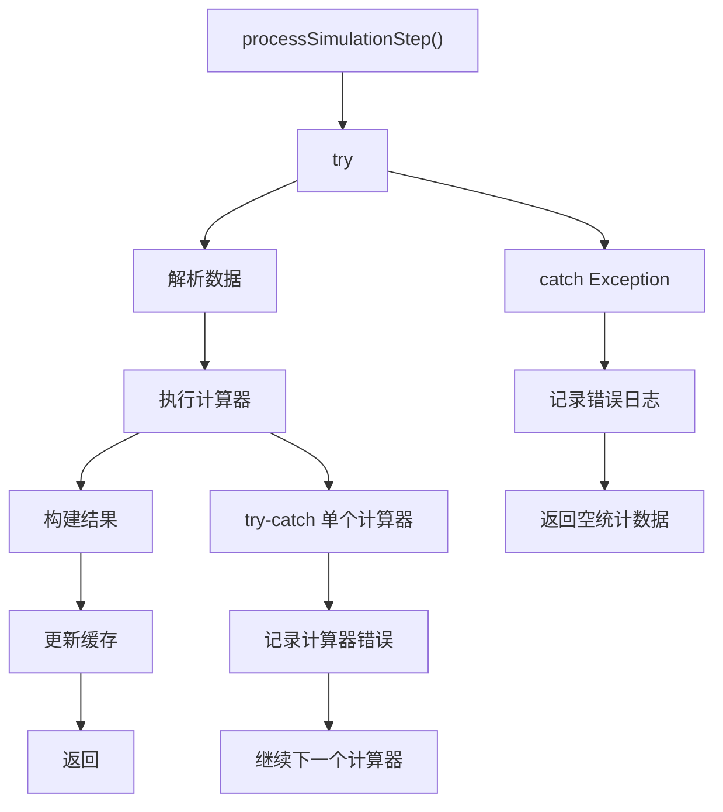
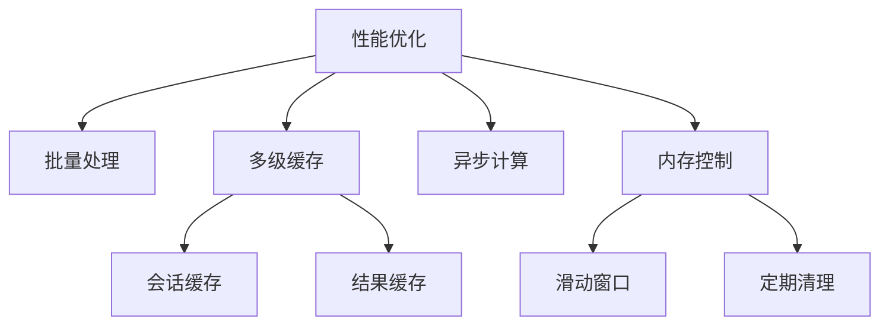

# 统计服务实现

<cite>
**本文档引用的文件**  
- [StatisticsServiceImpl.java](file://plugins/plugin-statistics/src/main/java/com/traffic/sim/plugin/statistics/service/StatisticsServiceImpl.java)
- [SimulationDataParser.java](file://plugins/plugin-statistics/src/main/java/com/traffic/sim/plugin/statistics/parser/SimulationDataParser.java)
- [StatisticsContext.java](file://plugins/plugin-statistics/src/main/java/com/traffic/sim/plugin/statistics/model/StatisticsContext.java)
- [StatisticsContextFactory.java](file://plugins/plugin-statistics/src/main/java/com/traffic/sim/plugin/statistics/service/StatisticsContextFactory.java)
- [StatisticsCalculatorRegistry.java](file://plugins/plugin-statistics/src/main/java/com/traffic/sim/plugin/statistics/calculator/StatisticsCalculatorRegistry.java)
- [SimulationStepData.java](file://plugins/plugin-statistics/src/main/java/com/traffic/sim/plugin/statistics/model/SimulationStepData.java)
- [StatisticsResult.java](file://plugins/plugin-statistics/src/main/java/com/traffic/sim/plugin/statistics/model/StatisticsResult.java)
- [StatisticsService.java](file://traffic-sim-common/src/main/java/com/traffic/sim/common/service/StatisticsService.java)
- [StatisticsPluginAutoConfiguration.java](file://plugins/plugin-statistics/src/main/java/com/traffic/sim/plugin/statistics/config/StatisticsPluginAutoConfiguration.java)
- [AccelerationCalculator.java](file://plugins/plugin-statistics/src/main/java/com/traffic/sim/plugin/statistics/calculator/impl/AccelerationCalculator.java)
- [SpeedCalculator.java](file://plugins/plugin-statistics/src/main/java/com/traffic/sim/plugin/statistics/calculator/impl/SpeedCalculator.java)
- [FlowCalculator.java](file://plugins/plugin-statistics/src/main/java/com/traffic/sim/plugin/statistics/calculator/impl/FlowCalculator.java)
</cite>

## 目录
1. [简介](#简介)
2. [核心组件分析](#核心组件分析)
3. [服务调用流程](#服务调用流程)
4. [数据解析与上下文构建](#数据解析与上下文构建)
5. [计算器调度机制](#计算器调度机制)
6. [结果聚合与输出](#结果聚合与输出)
7. [线程安全与异常处理](#线程安全与异常处理)
8. [生命周期与性能优化](#生命周期与性能优化)

## 简介
`StatisticsServiceImpl` 是交通仿真系统中统计功能的核心协调者，负责接收仿真引擎推送的原始数据，通过解析、计算、聚合等步骤生成结构化的统计结果。该服务实现了 `StatisticsService` 接口，作为插件化架构中的统计模块核心，承担着数据流转与业务逻辑调度的关键职责。

## 核心组件分析

`StatisticsServiceImpl` 依赖多个关键组件协同工作，形成完整的统计处理链路：

- **SimulationDataParser**：负责将原始 Map 结构的仿真数据解析为结构化的 `SimulationStepData` 对象。
- **StatisticsContextFactory**：创建并管理每个会话的统计上下文 `StatisticsContext`，用于存储跨步计算所需的状态信息。
- **StatisticsCalculatorRegistry**：注册和管理所有可用的统计计算器，支持动态扩展统计指标。
- **StatisticsCalculator** 实现类：如 `SpeedCalculator`、`FlowCalculator` 等，执行具体的统计算法。

这些组件通过 Spring 的依赖注入机制组装，确保了高内聚、低耦合的设计原则。

**Section sources**
- [StatisticsServiceImpl.java](file://plugins/plugin-statistics/src/main/java/com/traffic/sim/plugin/statistics/service/StatisticsServiceImpl.java#L29-L34)
- [StatisticsPluginAutoConfiguration.java](file://plugins/plugin-statistics/src/main/java/com/traffic/sim/plugin/statistics/config/StatisticsPluginAutoConfiguration.java#L32-L39)

## 服务调用流程



**Diagram sources**
- [StatisticsServiceImpl.java](file://plugins/plugin-statistics/src/main/java/com/traffic/sim/plugin/statistics/service/StatisticsServiceImpl.java#L37-L75)

## 数据解析与上下文构建

### 数据解析过程
`SimulationDataParser` 将原始 JSON 格式的仿真数据转换为 `SimulationStepData` 对象，提取以下关键信息：
- 仿真步数（step）
- 时间戳（timestamp）
- 车辆列表（vehicles）：包含速度、加速度、位置等属性
- 信号灯状态（signals）：路口ID、相位、周期等

解析过程中采用泛型安全转换，避免类型转换异常。

### 上下文构建机制
`StatisticsContext` 是统计计算的执行上下文，包含：
- 会话ID（sessionId）
- 道路容量（roadCapacity）
- 统计缓冲区（StatisticsBuffer）：用于滑动窗口计算
- 地图信息（mapInfo）
- 自定义数据（custom）

上下文通过 `StatisticsContextFactory` 创建，使用 `ConcurrentHashMap` 缓存，确保每个会话独享上下文实例，避免状态污染。



**Diagram sources**
- [SimulationDataParser.java](file://plugins/plugin-statistics/src/main/java/com/traffic/sim/plugin/statistics/parser/SimulationDataParser.java#L24-L58)
- [StatisticsContext.java](file://plugins/plugin-statistics/src/main/java/com/traffic/sim/plugin/statistics/model/StatisticsContext.java#L13-L45)
- [StatisticsContextFactory.java](file://plugins/plugin-statistics/src/main/java/com/traffic/sim/plugin/statistics/service/StatisticsContextFactory.java#L25-L31)

**Section sources**
- [SimulationDataParser.java](file://plugins/plugin-statistics/src/main/java/com/traffic/sim/plugin/statistics/parser/SimulationDataParser.java#L24-L58)
- [StatisticsContext.java](file://plugins/plugin-statistics/src/main/java/com/traffic/sim/plugin/statistics/model/StatisticsContext.java#L13-L45)
- [StatisticsContextFactory.java](file://plugins/plugin-statistics/src/main/java/com/traffic/sim/plugin/statistics/service/StatisticsContextFactory.java#L25-L31)

## 计算器调度机制

### 注册与发现
所有实现 `StatisticsCalculator` 接口的类通过 Spring 的组件扫描自动注册到 `StatisticsCalculatorRegistry` 中。注册表使用 `ConcurrentHashMap` 存储计算器实例，保证线程安全。

```java
public interface StatisticsCalculator {
    StatisticsResult calculate(SimulationStepData currentStep,
                              SimulationStepData previousStep,
                              StatisticsContext context);
    String getName();
    List<String> getCalculatedFields();
}
```

### 调度执行
`StatisticsServiceImpl` 在处理每一步仿真数据时，会从注册表获取所有计算器，并按顺序执行其 `calculate` 方法。每个计算器独立计算，结果通过 `StatisticsResult` 的 `merge` 方法合并。

#### 示例计算器行为
- **SpeedCalculator**：计算平均速度、最低/最高速度，并统计低速车辆数
- **FlowCalculator**：按路段、车道、路口统计流量，支持单位换算（如转为每小时流量）
- **AccelerationCalculator**：计算加速度的统计指标



**Diagram sources**
- [StatisticsCalculatorRegistry.java](file://plugins/plugin-statistics/src/main/java/com/traffic/sim/plugin/statistics/calculator/StatisticsCalculatorRegistry.java#L35-L37)
- [StatisticsServiceImpl.java](file://plugins/plugin-statistics/src/main/java/com/traffic/sim/plugin/statistics/service/StatisticsServiceImpl.java#L56-L66)
- [SpeedCalculator.java](file://plugins/plugin-statistics/src/main/java/com/traffic/sim/plugin/statistics/calculator/impl/SpeedCalculator.java#L25-L65)

**Section sources**
- [StatisticsCalculator.java](file://plugins/plugin-statistics/src/main/java/com/traffic/sim/plugin/statistics/calculator/StatisticsCalculator.java#L14-L38)
- [StatisticsCalculatorRegistry.java](file://plugins/plugin-statistics/src/main/java/com/traffic/sim/plugin/statistics/calculator/StatisticsCalculatorRegistry.java#L18-L54)
- [SpeedCalculator.java](file://plugins/plugin-statistics/src/main/java/com/traffic/sim/plugin/statistics/calculator/impl/SpeedCalculator.java#L21-L78)
- [FlowCalculator.java](file://plugins/plugin-statistics/src/main/java/com/traffic/sim/plugin/statistics/calculator/impl/FlowCalculator.java#L21-L114)

## 结果聚合与输出

### 单步结果构建
`buildStatisticsData` 方法将 `StatisticsResult` 转换为前端可消费的 `StatisticsData` 对象，提取关键字段如：
- 车辆数量（car_number）
- 平均速度（speed_ave）
- 拥堵指数（jam_index）

同时保留所有原始计算结果在 `custom` 字段中，供高级分析使用。

### 多步聚合
`aggregateStatistics` 方法支持对多个时间步的统计结果进行聚合，计算全局平均值，适用于仿真结束后的总结性分析。



**Diagram sources**
- [StatisticsServiceImpl.java](file://plugins/plugin-statistics/src/main/java/com/traffic/sim/plugin/statistics/service/StatisticsServiceImpl.java#L123-L139)
- [StatisticsServiceImpl.java](file://plugins/plugin-statistics/src/main/java/com/traffic/sim/plugin/statistics/service/StatisticsServiceImpl.java#L83-L117)

**Section sources**
- [StatisticsServiceImpl.java](file://plugins/plugin-statistics/src/main/java/com/traffic/sim/plugin/statistics/service/StatisticsServiceImpl.java#L123-L153)

## 线程安全与异常处理

### 线程安全设计
- 使用 `ConcurrentHashMap` 缓存会话数据（`stepCache` 和 `contextCache`）
- 计算器注册表线程安全
- 无共享状态，每个会话独立处理

### 异常传播机制
- 外层 `try-catch` 捕获所有异常，防止单步错误影响整体流程
- 计算器内部异常被捕获并记录日志，不影响其他计算器执行
- 返回空统计数据作为降级策略



**Diagram sources**
- [StatisticsServiceImpl.java](file://plugins/plugin-statistics/src/main/java/com/traffic/sim/plugin/statistics/service/StatisticsServiceImpl.java#L37-L79)
- [StatisticsServiceImpl.java](file://plugins/plugin-statistics/src/main/java/com/traffic/sim/plugin/statistics/service/StatisticsServiceImpl.java#L57-L66)

**Section sources**
- [StatisticsServiceImpl.java](file://plugins/plugin-statistics/src/main/java/com/traffic/sim/plugin/statistics/service/StatisticsServiceImpl.java#L37-L79)

## 生命周期与性能优化

### 生命周期管理
- 服务由 Spring 容器管理，随应用启动初始化
- 计算器通过自动配置注册
- 上下文工厂负责创建和清理会话上下文

### 性能优化建议
1. **批量处理**：可扩展接口支持批量处理多个仿真步，减少方法调用开销
2. **缓存策略**：
   - 会话级数据缓存（上一步数据、上下文）
   - 计算结果可缓存，避免重复计算
3. **异步计算**：可通过 `@Async` 注解将计算器执行异步化，提升吞吐量
4. **滑动窗口优化**：`StatisticsBuffer` 支持固定大小的历史数据存储，避免内存无限增长



**Diagram sources**
- [StatisticsContextFactory.java](file://plugins/plugin-statistics/src/main/java/com/traffic/sim/plugin/statistics/service/StatisticsContextFactory.java#L25-L31)
- [StatisticsBuffer.java](file://plugins/plugin-statistics/src/main/java/com/traffic/sim/plugin/statistics/model/StatisticsBuffer.java#L30-L49)

**Section sources**
- [StatisticsContextFactory.java](file://plugins/plugin-statistics/src/main/java/com/traffic/sim/plugin/statistics/service/StatisticsContextFactory.java#L37-L46)
- [StatisticsBuffer.java](file://plugins/plugin-statistics/src/main/java/com/traffic/sim/plugin/statistics/model/StatisticsBuffer.java#L30-L87)