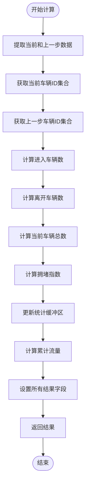

# 统计计算器

<cite>
**本文档引用的文件**
- [StatisticsCalculator.java](file://plugins/plugin-statistics/src/main/java/com/traffic/sim/plugin/statistics/calculator/StatisticsCalculator.java)
- [StatisticsCalculatorRegistry.java](file://plugins/plugin-statistics/src/main/java/com/traffic/sim/plugin/statistics/calculator/StatisticsCalculatorRegistry.java)
- [FlowCalculator.java](file://plugins/plugin-statistics/src/main/java/com/traffic/sim/plugin/statistics/calculator/impl/FlowCalculator.java)
- [SpeedCalculator.java](file://plugins/plugin-statistics/src/main/java/com/traffic/sim/plugin/statistics/calculator/impl/SpeedCalculator.java)
- [AccelerationCalculator.java](file://plugins/plugin-statistics/src/main/java/com/traffic/sim/plugin/statistics/calculator/impl/AccelerationCalculator.java)
- [DelayCalculator.java](file://plugins/plugin-statistics/src/main/java/com/traffic/sim/plugin/statistics/calculator/impl/DelayCalculator.java)
- [InOutCalculator.java](file://plugins/plugin-statistics/src/main/java/com/traffic/sim/plugin/statistics/calculator/impl/InOutCalculator.java)
- [QueueCalculator.java](file://plugins/plugin-statistics/src/main/java/com/traffic/sim/plugin/statistics/calculator/impl/QueueCalculator.java)
- [StopCalculator.java](file://plugins/plugin-statistics/src/main/java/com/traffic/sim/plugin/statistics/calculator/impl/StopCalculator.java)
- [SimulationStepData.java](file://plugins/plugin-statistics/src/main/java/com/traffic/sim/plugin/statistics/model/SimulationStepData.java)
- [StatisticsResult.java](file://plugins/plugin-statistics/src/main/java/com/traffic/sim/plugin/statistics/model/StatisticsResult.java)
- [StatisticsContext.java](file://plugins/plugin-statistics/src/main/java/com/traffic/sim/plugin/statistics/model/StatisticsContext.java)
- [StatisticsBuffer.java](file://plugins/plugin-statistics/src/main/java/com/traffic/sim/plugin/statistics/model/StatisticsBuffer.java)
- [StatisticsServiceImpl.java](file://plugins/plugin-statistics/src/main/java/com/traffic/sim/plugin/statistics/service/StatisticsServiceImpl.java)
- [StatisticsPluginAutoConfiguration.java](file://plugins/plugin-statistics/src/main/java/com/traffic/sim/plugin/statistics/config/StatisticsPluginAutoConfiguration.java)
- [UnitConverter.java](file://plugins/plugin-statistics/src/main/java/com/traffic/sim/plugin/statistics/util/UnitConverter.java)
- [SimulationDataParser.java](file://plugins/plugin-statistics/src/main/java/com/traffic/sim/plugin/statistics/parser/SimulationDataParser.java)
- [StatisticsContextFactory.java](file://plugins/plugin-statistics/src/main/java/com/traffic/sim/plugin/statistics/service/StatisticsContextFactory.java)
</cite>

## 目录
1. [介绍](#介绍)
2. [核心组件](#核心组件)
3. [架构概述](#架构概述)
4. [详细组件分析](#详细组件分析)
5. [依赖分析](#依赖分析)
6. [性能考虑](#性能考虑)
7. [故障排除指南](#故障排除指南)
8. [结论](#结论)

## 介绍
统计计算器模块是交通仿真系统中的关键组件，负责实时计算各种交通指标。该模块采用插件化设计，通过定义统一的接口契约和注册机制，实现了多种统计指标的灵活扩展和管理。本模块能够处理仿真步进数据，计算流量、速度、加速度、延误、排队等关键交通参数，为交通状况分析和决策提供数据支持。

## 核心组件

统计计算器模块的核心由`StatisticsCalculator`接口、具体实现类、`StatisticsCalculatorRegistry`注册表以及相关模型类组成。这些组件协同工作，实现了从原始仿真数据到统计指标的转换过程。

**核心组件**
- [StatisticsCalculator.java](file://plugins/plugin-statistics/src/main/java/com/traffic/sim/plugin/statistics/calculator/StatisticsCalculator.java#L1-L39)
- [StatisticsCalculatorRegistry.java](file://plugins/plugin-statistics/src/main/java/com/traffic/sim/plugin/statistics/calculator/StatisticsCalculatorRegistry.java#L1-L54)
- [StatisticsResult.java](file://plugins/plugin-statistics/src/main/java/com/traffic/sim/plugin/statistics/model/StatisticsResult.java#L1-L56)

## 架构概述

统计计算器模块采用典型的策略模式和工厂模式组合架构。通过`StatisticsCalculator`接口定义统一的计算契约，各个具体计算器实现该接口完成特定指标的计算。`StatisticsCalculatorRegistry`负责管理所有计算器实例的生命周期，而`StatisticsServiceImpl`作为门面类协调整个计算流程。

**图表来源**
- [StatisticsServiceImpl.java](file://plugins/plugin-statistics/src/main/java/com/traffic/sim/plugin/statistics/service/StatisticsServiceImpl.java#L1-L195)
- [StatisticsCalculatorRegistry.java](file://plugins/plugin-statistics/src/main/java/com/traffic/sim/plugin/statistics/calculator/StatisticsCalculatorRegistry.java#L1-L54)
- [StatisticsContextFactory.java](file://plugins/plugin-statistics/src/main/java/com/traffic/sim/plugin/statistics/service/StatisticsContextFactory.java#L1-L49)

## 详细组件分析

### StatisticsCalculator接口分析
`StatisticsCalculator`接口定义了所有统计计算器的契约，是整个模块的抽象核心。该接口规定了计算器必须实现的三个方法：`calculate`用于执行实际计算，`getName`返回计算器名称，`getCalculatedFields`返回该计算器生成的所有字段名。

**图表来源**
- [StatisticsCalculator.java](file://plugins/plugin-statistics/src/main/java/com/traffic/sim/plugin/statistics/calculator/StatisticsCalculator.java#L1-L39)
- [StatisticsResult.java](file://plugins/plugin-statistics/src/main/java/com/traffic/sim/plugin/statistics/model/StatisticsResult.java#L1-L56)
- [SimulationStepData.java](file://plugins/plugin-statistics/src/main/java/com/traffic/sim/plugin/statistics/model/SimulationStepData.java#L1-L71)
- [StatisticsContext.java](file://plugins/plugin-statistics/src/main/java/com/traffic/sim/plugin/statistics/model/StatisticsContext.java#L1-L47)

### 流量计算器分析
`FlowCalculator`负责计算路段、车道和路口的流量统计。它通过分析当前仿真步中所有车辆的位置信息，按道路ID、车道ID和路口ID进行分组统计，计算平均流量并转换为每小时流量单位。

**图表来源**
- [FlowCalculator.java](file://plugins/plugin-statistics/src/main/java/com/traffic/sim/plugin/statistics/calculator/impl/FlowCalculator.java#L1-L114)
- [UnitConverter.java](file://plugins/plugin-statistics/src/main/java/com/traffic/sim/plugin/statistics/util/UnitConverter.java#L1-L40)

### 速度计算器分析
`SpeedCalculator`负责计算车辆速度相关的统计指标，包括最小速度、最大速度、平均速度以及低速车辆数量。该计算器将原始的米/秒单位转换为更常用的千米/小时单位。

**图表来源**
- [SpeedCalculator.java](file://plugins/plugin-statistics/src/main/java/com/traffic/sim/plugin/statistics/calculator/impl/SpeedCalculator.java#L1-L78)
- [UnitConverter.java](file://plugins/plugin-statistics/src/main/java/com/traffic/sim/plugin/statistics/util/UnitConverter.java#L1-L40)

### 加速度计算器分析
`AccelerationCalculator`负责计算车辆加速度相关的统计指标，包括最小加速度、最大加速度和平均加速度。该计算器直接使用仿真系统提供的加速度数据进行统计。

**图表来源**
- [AccelerationCalculator.java](file://plugins/plugin-statistics/src/main/java/com/traffic/sim/plugin/statistics/calculator/impl/AccelerationCalculator.java#L1-L74)

### 延误计算器分析
`DelayCalculator`负责计算车辆延误时间的统计指标。该计算器从车辆属性中提取延误时间数据，计算最小延误、最大延误和平均延误。

**图表来源**
- [DelayCalculator.java](file://plugins/plugin-statistics/src/main/java/com/traffic/sim/plugin/statistics/calculator/impl/DelayCalculator.java#L1-L87)

### 进出计算器分析
`InOutCalculator`负责计算车辆进出数量、当前车辆数和拥堵指数。该计算器通过比较当前步和上一步的车辆ID集合来确定进出车辆数量，并使用统计缓冲区计算累计流量。

**图表来源**
- [InOutCalculator.java](file://plugins/plugin-statistics/src/main/java/com/traffic/sim/plugin/statistics/calculator/impl/InOutCalculator.java#L1-L93)
- [StatisticsBuffer.java](file://plugins/plugin-statistics/src/main/java/com/traffic/sim/plugin/statistics/model/StatisticsBuffer.java#L1-L87)

### 排队计算器分析
`QueueCalculator`负责计算排队长度和排队时间的统计指标。该计算器将低速（小于0.1m/s）的车辆视为排队车辆，从车辆属性中提取排队时间数据。

**图表来源**
- [QueueCalculator.java](file://plugins/plugin-statistics/src/main/java/com/traffic/sim/plugin/statistics/calculator/impl/QueueCalculator.java#L1-L122)

### 统计计算器注册表分析
`StatisticsCalculatorRegistry`是所有统计计算器的管理中心，负责注册、存储和提供计算器实例。该注册表使用线程安全的`ConcurrentHashMap`来存储计算器，确保在多线程环境下的安全性。

**图表来源**
- [StatisticsCalculatorRegistry.java](file://plugins/plugin-statistics/src/main/java/com/traffic/sim/plugin/statistics/calculator/StatisticsCalculatorRegistry.java#L1-L54)
- [StatisticsCalculator.java](file://plugins/plugin-statistics/src/main/java/com/traffic/sim/plugin/statistics/calculator/StatisticsCalculator.java#L1-L39)

## 依赖分析

统计计算器模块的依赖关系清晰，各组件职责分明。Spring容器负责管理所有Bean的生命周期，通过依赖注入将各个组件连接起来。`StatisticsServiceImpl`作为核心服务类，依赖于`StatisticsCalculatorRegistry`、`SimulationDataParser`和`StatisticsContextFactory`。

**图表来源**
- [StatisticsServiceImpl.java](file://plugins/plugin-statistics/src/main/java/com/traffic/sim/plugin/statistics/service/StatisticsServiceImpl.java#L1-L195)
- [StatisticsCalculatorRegistry.java](file://plugins/plugin-statistics/src/main/java/com/traffic/sim/plugin/statistics/calculator/StatisticsCalculatorRegistry.java#L1-L54)
- [StatisticsContextFactory.java](file://plugins/plugin-statistics/src/main/java/com/traffic/sim/plugin/statistics/service/StatisticsContextFactory.java#L1-L49)
- [StatisticsPluginAutoConfiguration.java](file://plugins/plugin-statistics/src/main/java/com/traffic/sim/plugin/statistics/config/StatisticsPluginAutoConfiguration.java#L1-L61)

## 性能考虑

统计计算器模块在设计时考虑了性能因素。通过使用线程安全的数据结构、缓存机制和批量处理，确保了在高并发仿真环境下的稳定性能。`StatisticsCalculatorRegistry`使用`ConcurrentHashMap`确保注册和查询操作的线程安全，而`StatisticsServiceImpl`使用`ConcurrentHashMap`缓存上一步数据和统计上下文，避免重复创建对象。

计算过程中，各计算器采用流式处理和批量操作，减少循环开销。例如，`FlowCalculator`使用Java 8的Stream API计算平均值，`InOutCalculator`使用集合操作计算车辆进出数量。此外，模块还提供了异步执行器配置，允许在需要时将统计计算任务异步执行，避免阻塞主仿真线程。

## 故障排除指南

### 计算结果异常排查
当统计计算结果出现异常时，可按以下步骤进行排查：

1. **检查输入数据**：确认`SimulationStepData`中的车辆数据是否正确，特别是速度、加速度等关键字段是否有有效值。
2. **验证计算器实现**：检查具体计算器的业务逻辑是否正确，特别是边界条件处理和单位转换。
3. **检查上下文数据**：确认`StatisticsContext`中的`roadCapacity`等参数设置是否合理。
4. **查看日志信息**：检查系统日志中是否有计算器执行错误的记录。

### 性能瓶颈定位
当发现统计计算成为性能瓶颈时，可采取以下措施：

1. **监控执行时间**：在`StatisticsServiceImpl.processSimulationStep`方法中添加执行时间监控，识别耗时最长的计算器。
2. **优化数据结构**：对于处理大量车辆数据的计算器，考虑使用更高效的数据结构。
3. **调整缓冲区大小**：根据实际需求调整`StatisticsBuffer`的`windowSize`，平衡内存使用和计算精度。
4. **启用异步处理**：在`StatisticsPluginAutoConfiguration`中配置合适的线程池参数，将统计计算异步化。

### 常见问题
- **问题**：计算结果为null或空
  **解决方案**：检查输入数据是否为空，确认车辆列表是否包含有效数据
  
- **问题**：某些统计字段缺失
  **解决方案**：检查对应计算器的`getCalculatedFields`方法是否正确返回了所有字段名
  
- **问题**：累计流量计算不准确
  **解决方案**：检查`StatisticsBuffer`的窗口大小设置，确认`InOutCalculator`正确更新了进出流量

**故障排除指南来源**
- [StatisticsServiceImpl.java](file://plugins/plugin-statistics/src/main/java/com/traffic/sim/plugin/statistics/service/StatisticsServiceImpl.java#L1-L195)
- [StatisticsBuffer.java](file://plugins/plugin-statistics/src/main/java/com/traffic/sim/plugin/statistics/model/StatisticsBuffer.java#L1-L87)
- [StatisticsCalculator.java](file://plugins/plugin-statistics/src/main/java/com/traffic/sim/plugin/statistics/calculator/StatisticsCalculator.java#L1-L39)

## 结论
统计计算器模块通过清晰的接口定义、灵活的插件化设计和高效的执行机制，为交通仿真系统提供了强大的统计分析能力。该模块不仅实现了多种交通指标的计算，还通过注册表机制支持未来扩展。通过合理的架构设计和性能优化，该模块能够在高并发仿真环境中稳定运行，为交通状况分析提供可靠的数据支持。