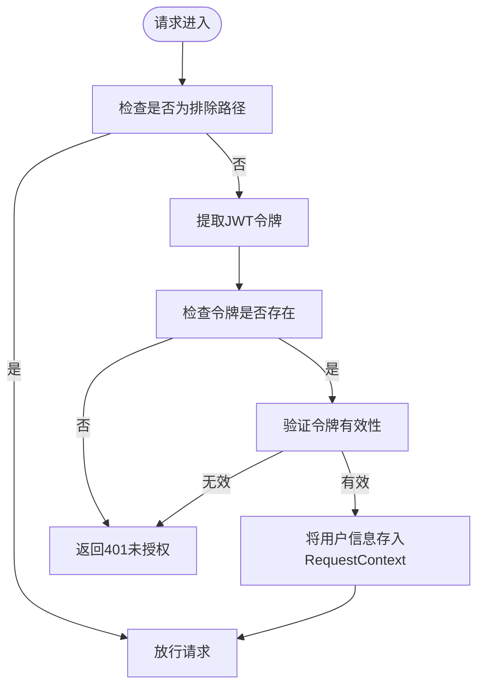
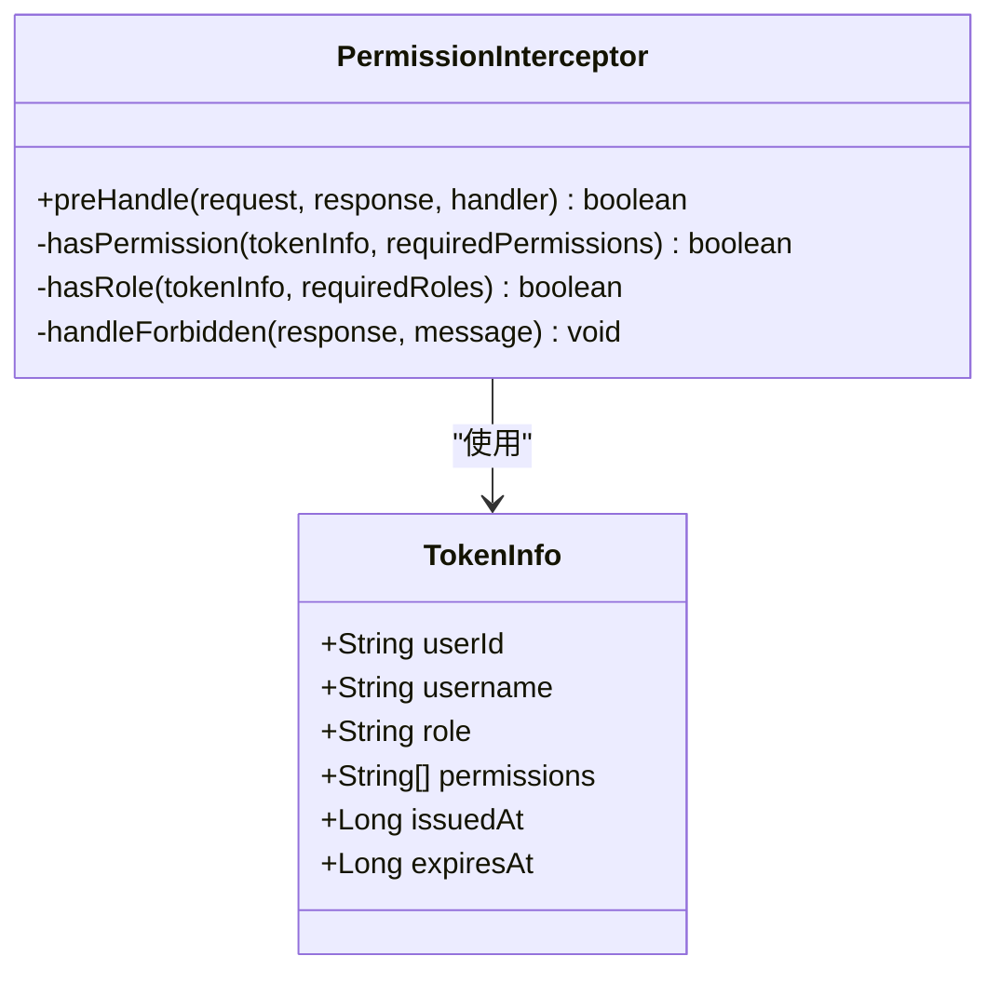
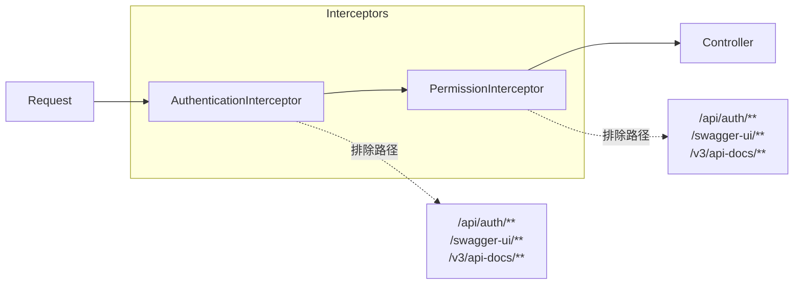
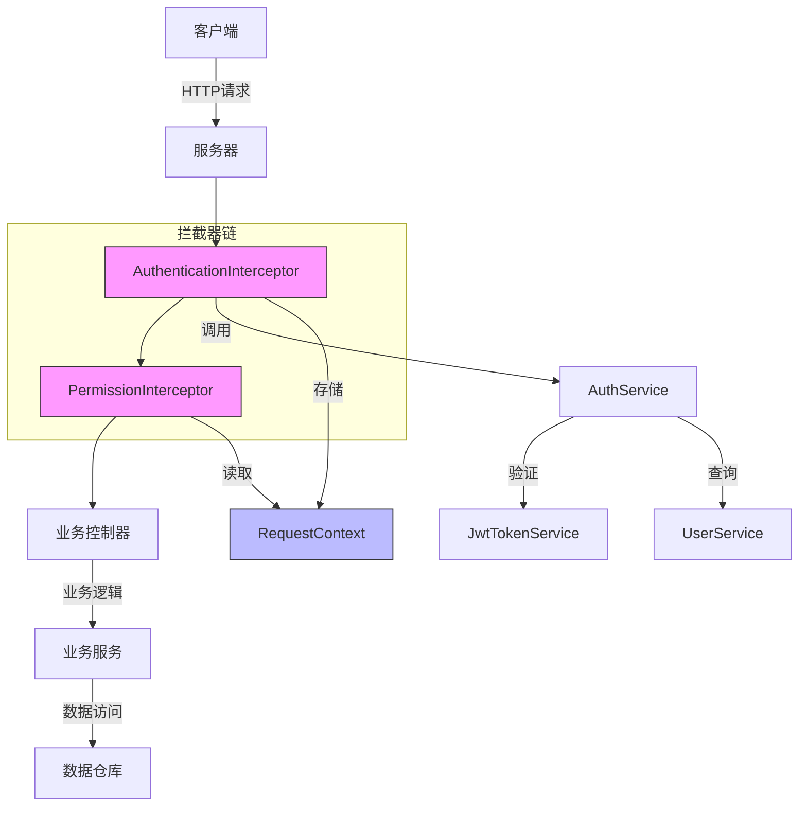

# 授权机制

<cite>
**本文档引用文件**  
- [RequireRole.java](file://plugins/plugin-auth/src/main/java/com/traffic/sim/plugin/auth/annotation/RequireRole.java)
- [RequirePermission.java](file://plugins/plugin-auth/src/main/java/com/traffic/sim/plugin/auth/annotation/RequirePermission.java)
- [AuthenticationInterceptor.java](file://plugins/plugin-auth/src/main/java/com/traffic/sim/plugin/auth/interceptor/AuthenticationInterceptor.java)
- [PermissionInterceptor.java](file://plugins/plugin-auth/src/main/java/com/traffic/sim/plugin/auth/interceptor/PermissionInterceptor.java)
- [RequestContext.java](file://plugins/plugin-auth/src/main/java/com/traffic/sim/plugin/auth/util/RequestContext.java)
- [AuthPluginAutoConfiguration.java](file://plugins/plugin-auth/src/main/java/com/traffic/sim/plugin/auth/config/AuthPluginAutoConfiguration.java)
- [AuthServiceImpl.java](file://plugins/plugin-auth/src/main/java/com/traffic/sim/plugin/auth/service/AuthServiceImpl.java)
- [AuthService.java](file://traffic-sim-common/src/main/java/com/traffic/sim/common/service/AuthService.java)
- [TokenInfo.java](file://traffic-sim-common/src/main/java/com/traffic/sim/common/service/TokenInfo.java)
- [AuthController.java](file://plugins/plugin-auth/src/main/java/com/traffic/sim/plugin/auth/controller/AuthController.java)
- [UserController.java](file://plugins/plugin-user/src/main/java/com/traffic/sim/plugin/user/controller/UserController.java)
- [MapController.java](file://plugins/plugin-map/src/main/java/com/traffic/sim/plugin/map/controller/MapController.java)
- [AuthPluginProperties.java](file://plugins/plugin-auth/src/main/java/com/traffic/sim/plugin/auth/config/AuthPluginProperties.java)
</cite>

## 目录
1. [简介](#简介)
2. [核心组件](#核心组件)
3. [自定义注解设计](#自定义注解设计)
4. [认证拦截器分析](#认证拦截器分析)
5. [权限拦截器分析](#权限拦截器分析)
6. [拦截器执行顺序与配置](#拦截器执行顺序与配置)
7. [请求上下文工具类](#请求上下文工具类)
8. [实际使用示例](#实际使用示例)
9. [异常处理流程](#异常处理流程)
10. [系统架构图](#系统架构图)

## 简介
本系统实现了一套基于注解的细粒度权限控制机制，通过JWT令牌进行用户身份认证，并结合Spring MVC拦截器实现角色和权限的访问控制。该机制由两个核心拦截器组成：`AuthenticationInterceptor`负责JWT令牌的解析与认证，`PermissionInterceptor`负责基于注解的角色和权限校验。整个流程确保了只有经过认证且具有相应权限的用户才能访问受保护的资源。

## 核心组件
系统授权机制由多个核心组件协同工作，包括自定义注解、拦截器、服务接口和工具类。这些组件共同构成了一个完整的认证与授权体系，实现了从用户登录到权限校验的全流程控制。

**本节来源**  
- [RequireRole.java](file://plugins/plugin-auth/src/main/java/com/traffic/sim/plugin/auth/annotation/RequireRole.java)
- [RequirePermission.java](file://plugins/plugin-auth/src/main/java/com/traffic/sim/plugin/auth/annotation/RequirePermission.java)
- [AuthenticationInterceptor.java](file://plugins/plugin-auth/src/main/java/com/traffic/sim/plugin/auth/interceptor/AuthenticationInterceptor.java)
- [PermissionInterceptor.java](file://plugins/plugin-auth/src/main/java/com/traffic/sim/plugin/auth/interceptor/PermissionInterceptor.java)

## 自定义注解设计
系统提供了两个自定义注解用于声明式权限控制：

### @RequireRole 注解
`@RequireRole`注解用于标记需要特定角色才能访问的方法或类。该注解可应用于方法级别或类级别，支持多个角色的指定。当用户请求被注解标记的资源时，系统会校验用户是否具有指定的角色。

```java
@Target({ElementType.METHOD, ElementType.TYPE})
@Retention(RetentionPolicy.RUNTIME)
public @interface RequireRole {
    String[] value();
}
```

### @RequirePermission 注解
`@RequirePermission`注解用于标记需要特定权限才能访问的方法或类。与角色注解类似，该注解也可应用于方法或类级别，支持多个权限的指定。系统在权限校验时会检查用户是否拥有所有必需的权限。

```java
@Target({ElementType.METHOD, ElementType.TYPE})
@Retention(RetentionPolicy.RUNTIME)
public @interface RequirePermission {
    String[] value();
}
```

**本节来源**  
- [RequireRole.java](file://plugins/plugin-auth/src/main/java/com/traffic/sim/plugin/auth/annotation/RequireRole.java)
- [RequirePermission.java](file://plugins/plugin-auth/src/main/java/com/traffic/sim/plugin/auth/annotation/RequirePermission.java)

## 认证拦截器分析
`AuthenticationInterceptor`是系统认证流程的第一道关卡，负责在请求预处理阶段解析JWT令牌并建立安全上下文。

### 主要功能
1. **令牌提取**：从Authorization头（Bearer模式）或请求参数中提取JWT令牌
2. **令牌验证**：调用`AuthService`验证令牌的有效性和过期状态
3. **上下文建立**：将解析出的用户信息存入`RequestContext`，供后续处理使用
4. **路径排除**：对登录、注册等公共接口路径进行排除，无需认证即可访问

### 处理流程


**本节来源**  
- [AuthenticationInterceptor.java](file://plugins/plugin-auth/src/main/java/com/traffic/sim/plugin/auth/interceptor/AuthenticationInterceptor.java)
- [AuthService.java](file://traffic-sim-common/src/main/java/com/traffic/sim/common/service/AuthService.java)
- [TokenInfo.java](file://traffic-sim-common/src/main/java/com/traffic/sim/common/service/TokenInfo.java)

## 权限拦截器分析
`PermissionInterceptor`在认证拦截器之后执行，负责根据`@RequireRole`和`@RequirePermission`注解进行细粒度的权限校验。

### 校验逻辑
1. **获取用户信息**：从`RequestContext`中获取当前用户的安全上下文
2. **方法级注解检查**：优先检查方法上的`@RequireRole`和`@RequirePermission`注解
3. **类级注解检查**：若方法上无注解，则检查类级别的注解
4. **权限比对**：
   - 角色校验：检查用户角色是否在必需角色列表中
   - 权限校验：检查用户权限是否包含所有必需权限

### 权限判断规则


**本节来源**  
- [PermissionInterceptor.java](file://plugins/plugin-auth/src/main/java/com/traffic/sim/plugin/auth/interceptor/PermissionInterceptor.java)
- [RequestContext.java](file://plugins/plugin-auth/src/main/java/com/traffic/sim/plugin/auth/util/RequestContext.java)
- [TokenInfo.java](file://traffic-sim-common/src/main/java/com/traffic/sim/common/service/TokenInfo.java)

## 拦截器执行顺序与配置
系统的拦截器执行顺序通过`AuthPluginAutoConfiguration`进行配置，确保认证和权限校验按正确顺序执行。

### 执行顺序
1. `AuthenticationInterceptor`：首先执行，负责身份认证
2. `PermissionInterceptor`：其次执行，负责权限校验

### 配置细节


**本节来源**  
- [AuthPluginAutoConfiguration.java](file://plugins/plugin-auth/src/main/java/com/traffic/sim/plugin/auth/config/AuthPluginAutoConfiguration.java)
- [AuthenticationInterceptor.java](file://plugins/plugin-auth/src/main/java/com/traffic/sim/plugin/auth/interceptor/AuthenticationInterceptor.java)
- [PermissionInterceptor.java](file://plugins/plugin-auth/src/main/java/com/traffic/sim/plugin/auth/interceptor/PermissionInterceptor.java)

## 请求上下文工具类
`RequestContext`是一个基于`ThreadLocal`的工具类，用于在请求生命周期内跨拦截器传递用户信息。

### 主要功能
- `setCurrentUser()`：设置当前用户的安全上下文
- `getCurrentUser()`：获取当前用户的安全上下文
- `getCurrentUserId()`：获取当前用户的ID
- `getCurrentUsername()`：获取当前用户的用户名
- `clear()`：清理线程本地变量，防止内存泄漏

### 设计优势
1. **线程安全**：每个线程拥有独立的变量副本
2. **跨组件共享**：允许不同拦截器和服务组件访问同一用户上下文
3. **自动清理**：在请求结束时通过`afterCompletion`回调自动清理

**本节来源**  
- [RequestContext.java](file://plugins/plugin-auth/src/main/java/com/traffic/sim/plugin/auth/util/RequestContext.java)
- [AuthenticationInterceptor.java](file://plugins/plugin-auth/src/main/java/com/traffic/sim/plugin/auth/interceptor/AuthenticationInterceptor.java)

## 实际使用示例
以下是在控制器方法上使用权限注解的实际代码示例：

### 用户管理控制器示例
```java
@RestController
@RequestMapping("/api/user")
@RequireRole("ADMIN")
public class UserController {
    
    @GetMapping("/{id}")
    @Operation(summary = "获取用户信息")
    public ResponseEntity<ApiResponse<UserDTO>> getUser(@PathVariable Long id) {
        // ...
    }
    
    @PostMapping
    @RequirePermission("user:create")
    @Operation(summary = "创建用户")
    public ResponseEntity<ApiResponse<UserDTO>> createUser(@Valid @RequestBody UserCreateRequest request) {
        // ...
    }
    
    @DeleteMapping("/{id}")
    @RequireRole({"ADMIN", "SUPER_USER"})
    @Operation(summary = "删除用户")
    public ResponseEntity<ApiResponse<String>> deleteUser(@PathVariable Long id) {
        // ...
    }
}
```

### 权限组合使用
```java
// 类级别：要求ADMIN角色
@RequireRole("ADMIN")
@RestController
@RequestMapping("/api/admin")
public class AdminController {
    
    // 方法级别：要求特定权限，覆盖类级别设置
    @GetMapping("/reports")
    @RequirePermission("report:view")
    public ResponseEntity<ApiResponse<ReportData>> getReports() {
        // ...
    }
    
    // 方法级别：要求特定权限
    @PostMapping("/users")
    @RequirePermission("user:create")
    public ResponseEntity<ApiResponse<UserDTO>> createUser() {
        // ...
    }
}
```

**本节来源**  
- [UserController.java](file://plugins/plugin-user/src/main/java/com/traffic/sim/plugin/user/controller/UserController.java)
- [MapController.java](file://plugins/plugin-map/src/main/java/com/traffic/sim/plugin/map/controller/MapController.java)

## 异常处理流程
当权限校验失败时，系统会返回相应的错误响应：

### 认证失败（401）
- **触发条件**：未提供令牌、令牌无效或已过期
- **响应状态**：HTTP 401 Unauthorized
- **响应内容**：
```json
{
  "code": "ERR_AUTH",
  "message": "认证令牌无效或已过期",
  "data": null
}
```

### 权限不足（403）
- **触发条件**：用户角色或权限不满足要求
- **响应状态**：HTTP 403 Forbidden
- **响应内容**：
```json
{
  "code": "ERR_PERMISSION",
  "message": "角色权限不足",
  "data": null
}
```

### 全局异常处理
系统通过`GlobalExceptionHandler`统一处理认证和权限相关的异常，确保返回格式的一致性。

**本节来源**  
- [AuthenticationInterceptor.java](file://plugins/plugin-auth/src/main/java/com/traffic/sim/plugin/auth/interceptor/AuthenticationInterceptor.java)
- [PermissionInterceptor.java](file://plugins/plugin-auth/src/main/java/com/traffic/sim/plugin/auth/interceptor/PermissionInterceptor.java)
- [traffic-sim-server/src/main/java/com/traffic/sim/exception/GlobalExceptionHandler.java)

## 系统架构图


**图示来源**  
- [AuthenticationInterceptor.java](file://plugins/plugin-auth/src/main/java/com/traffic/sim/plugin/auth/interceptor/AuthenticationInterceptor.java)
- [PermissionInterceptor.java](file://plugins/plugin-auth/src/main/java/com/traffic/sim/plugin/auth/interceptor/PermissionInterceptor.java)
- [RequestContext.java](file://plugins/plugin-auth/src/main/java/com/traffic/sim/plugin/auth/util/RequestContext.java)
- [AuthPluginAutoConfiguration.java](file://plugins/plugin-auth/src/main/java/com/traffic/sim/plugin/auth/config/AuthPluginAutoConfiguration.java)