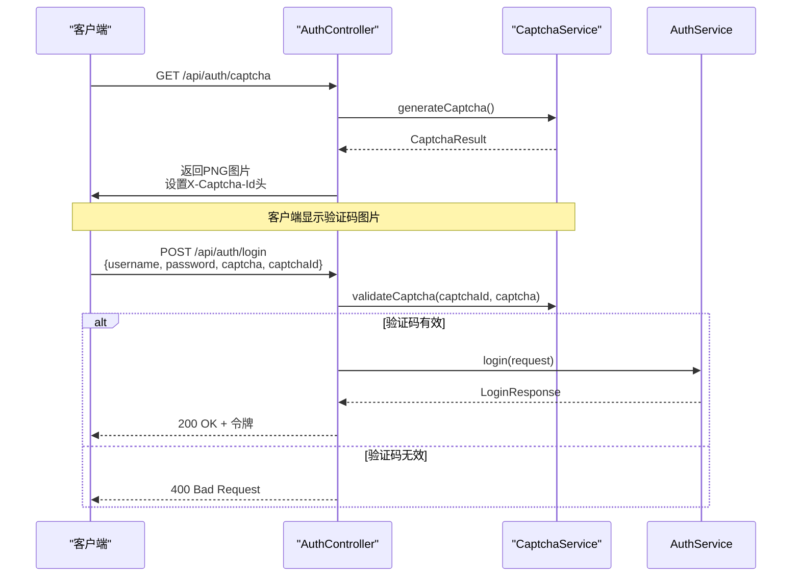
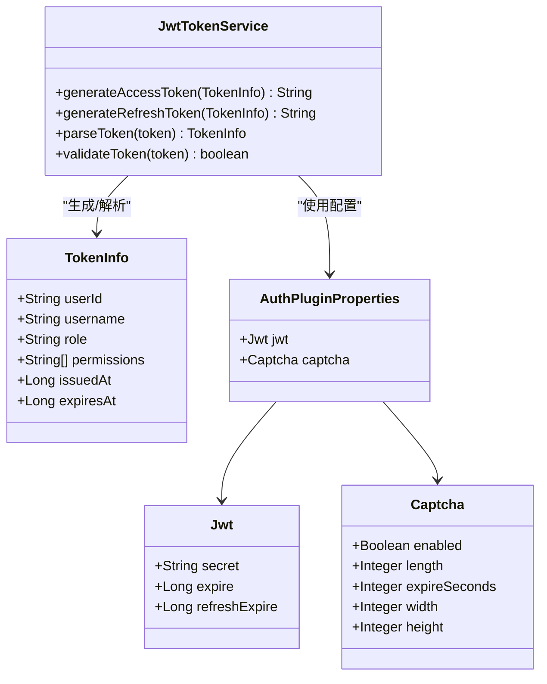

# 认证API接口

<cite>
**本文档引用的文件**  
- [AuthController.java](file://plugins/plugin-auth/src/main/java/com/traffic/sim/plugin/auth/controller/AuthController.java)
- [LoginRequest.java](file://traffic-sim-common/src/main/java/com/traffic/sim/common/dto/LoginRequest.java)
- [RegisterRequest.java](file://traffic-sim-common/src/main/java/com/traffic/sim/common/dto/RegisterRequest.java)
- [LoginResponse.java](file://traffic-sim-common/src/main/java/com/traffic/sim/common/dto/LoginResponse.java)
- [UserDTO.java](file://traffic-sim-common/src/main/java/com/traffic/sim/common/dto/UserDTO.java)
- [CaptchaService.java](file://plugins/plugin-auth/src/main/java/com/traffic/sim/plugin/auth/service/CaptchaService.java)
- [AuthService.java](file://traffic-sim-common/src/main/java/com/traffic/sim/common/service/AuthService.java)
- [JwtTokenService.java](file://plugins/plugin-auth/src/main/java/com/traffic/sim/plugin/auth/service/JwtTokenService.java)
</cite>

## 目录
1. [简介](#简介)
2. [认证API端点](#认证api端点)
3. [DTO结构与验证规则](#dto结构与验证规则)
4. [认证流程与令牌管理](#认证流程与令牌管理)
5. [Swagger文档注解说明](#swagger文档注解说明)
6. [调用示例](#调用示例)
7. [错误响应](#错误响应)

## 简介
本接口文档详细描述了系统认证模块提供的RESTful API，涵盖用户登录、注册、验证码获取、令牌刷新和登出等核心功能。所有接口均通过JWT（JSON Web Token）实现身份验证，并集成验证码机制增强安全性。接口设计遵循统一的响应格式，使用`ApiResponse`封装返回结果。

**Section sources**
- [AuthController.java](file://plugins/plugin-auth/src/main/java/com/traffic/sim/plugin/auth/controller/AuthController.java#L21-L25)

## 认证API端点

### `/api/auth/login` - 用户登录
- **HTTP方法**: `POST`
- **描述**: 用户通过用户名和密码进行身份验证，成功后返回JWT访问令牌和刷新令牌。
- **请求头**:
  - `Content-Type: application/json`
- **请求体**: `LoginRequest` 对象
- **成功响应**:
  - 状态码: `200 OK`
  - 响应体: `ApiResponse<LoginResponse>`
- **失败响应**:
  - 状态码: `400 Bad Request` 或 `401 Unauthorized`

### `/api/auth/register` - 用户注册
- **HTTP方法**: `POST`
- **描述**: 创建新用户账户。
- **请求头**:
  - `Content-Type: application/json`
- **请求体**: `RegisterRequest` 对象
- **成功响应**:
  - 状态码: `200 OK`
  - 响应体: `ApiResponse<String>`，消息为"注册成功"
- **失败响应**:
  - 状态码: `400 Bad Request`

### `/api/auth/captcha` - 获取验证码
- **HTTP方法**: `GET`
- **描述**: 生成并返回PNG格式的验证码图片。
- **请求头**: 无
- **响应头**:
  - `Content-Type: image/png`
  - `X-Captcha-Id`: 验证码的唯一标识ID
- **响应体**: PNG图片的二进制数据
- **成功响应**:
  - 状态码: `200 OK`
- **失败响应**:
  - 状态码: `404 Not Found` (验证码功能禁用)

### `/api/auth/refresh` - 刷新令牌
- **HTTP方法**: `POST`
- **描述**: 使用刷新令牌获取新的访问令牌，延长会话有效期。
- **请求头**:
  - `Content-Type: application/json`
- **请求体**: `RefreshTokenRequest` 对象
- **成功响应**:
  - 状态码: `200 OK`
  - 响应体: `ApiResponse<LoginResponse>`
- **失败响应**:
  - 状态码: `400 Bad Request` 或 `401 Unauthorized`

### `/api/auth/logout` - 用户登出
- **HTTP方法**: `POST`
- **描述**: 使当前用户的访问令牌失效，完成登出操作。
- **请求头**:
  - `Authorization: Bearer <token>` (可选，若提供则会使其失效)
- **请求体**: 无
- **成功响应**:
  - 状态码: `200 OK`
  - 响应体: `ApiResponse<String>`，消息为"登出成功"

**Section sources**
- [AuthController.java](file://plugins/plugin-auth/src/main/java/com/traffic/sim/plugin/auth/controller/AuthController.java#L39-L97)

## DTO结构与验证规则

### LoginRequest 登录请求DTO
该对象用于用户登录请求，包含以下字段：

| 字段名 | 类型 | 是否必填 | 验证规则 | 描述 |
|--------|------|----------|----------|------|
| username | string | 是 | 非空 | 用户名 |
| password | string | 是 | 非空 | 密码 |
| captcha | string | 否 | - | 验证码文本 |
| captchaId | string | 否 | - | 验证码ID |

**验证规则**:
- `username`: 必须提供，不能为空
- `password`: 必须提供，不能为空

**Section sources**
- [LoginRequest.java](file://traffic-sim-common/src/main/java/com/traffic/sim/common/dto/LoginRequest.java#L18-L27)

### RegisterRequest 注册请求DTO
该对象用于新用户注册，包含以下字段：

| 字段名 | 类型 | 是否必填 | 验证规则 | 描述 |
|--------|------|----------|----------|------|
| username | string | 是 | 非空 | 用户名 |
| password | string | 是 | 非空 | 密码 |
| email | string | 是 | 邮箱格式 | 邮箱地址 |
| phoneNumber | string | 否 | - | 电话号码 |
| institution | string | 否 | - | 所属机构 |

**验证规则**:
- `username`: 必须提供，不能为空
- `password`: 必须提供，不能为空
- `email`: 必须为有效的邮箱格式

**Section sources**
- [RegisterRequest.java](file://traffic-sim-common/src/main/java/com/traffic/sim/common/dto/RegisterRequest.java#L19-L30)

### LoginResponse 登录响应DTO
该对象封装登录成功后的响应数据，包含令牌和用户信息：

| 字段名 | 类型 | 描述 |
|--------|------|------|
| accessToken | string | JWT访问令牌 |
| refreshToken | string | JWT刷新令牌 |
| user | UserDTO | 用户信息对象 |
| expiresIn | long | 令牌过期时间（秒） |

**Section sources**
- [LoginResponse.java](file://traffic-sim-common/src/main/java/com/traffic/sim/common/dto/LoginResponse.java#L17-L27)

### UserDTO 用户信息DTO
该对象包含用户的详细信息：

| 字段名 | 类型 | 描述 |
|--------|------|------|
| id | long | 用户ID |
| username | string | 用户名 |
| email | string | 邮箱 |
| phoneNumber | string | 电话号码 |
| institution | string | 所属机构 |
| roleId | integer | 角色ID |
| roleName | string | 角色名称 |
| status | string | 用户状态 |
| createTime | date | 创建时间 |
| updateTime | date | 更新时间 |

**Section sources**
- [UserDTO.java](file://traffic-sim-common/src/main/java/com/traffic/sim/common/dto/UserDTO.java#L18-L27)

## 认证流程与令牌管理

### 验证码机制
验证码通过 `/api/auth/captcha` 接口获取。服务端生成验证码图片和唯一的 `captchaId`，并将验证码值与ID关联存储在内存中。`captchaId` 通过响应头 `X-Captcha-Id` 返回给客户端。客户端在登录时需同时提交验证码文本和 `captchaId`，服务端通过 `CaptchaService` 验证其正确性和有效性。



**Diagram sources**
- [AuthController.java](file://plugins/plugin-auth/src/main/java/com/traffic/sim/plugin/auth/controller/AuthController.java#L59-L74)
- [CaptchaService.java](file://plugins/plugin-auth/src/main/java/com/traffic/sim/plugin/auth/service/CaptchaService.java#L43-L60)

### Bearer Token使用方式
所有需要身份验证的API接口都要求在HTTP请求头中包含 `Authorization` 字段，格式为 `Bearer <token>`。系统通过 `AuthenticationInterceptor` 拦截请求，提取并验证JWT令牌。`AuthController` 中的 `extractToken` 方法负责从 `Authorization` 头中提取令牌字符串。

### JWT令牌管理
系统使用 `JwtTokenService` 管理JWT令牌的生成、解析和验证。访问令牌（access token）用于常规API调用，具有较短的有效期；刷新令牌（refresh token）用于获取新的访问令牌，具有较长的有效期。令牌的密钥、过期时间等配置通过 `AuthPluginProperties` 从配置文件中读取。



**Diagram sources**
- [JwtTokenService.java](file://plugins/plugin-auth/src/main/java/com/traffic/sim/plugin/auth/service/JwtTokenService.java#L32-L63)
- [AuthPluginProperties.java](file://plugins/plugin-auth/src/main/java/com/traffic/sim/plugin/auth/config/AuthPluginProperties.java)

## Swagger文档注解说明
系统使用Swagger（OpenAPI 3）自动生成API文档，主要通过以下注解实现：

- `@Tag`: 用于类级别，定义API分组的名称和描述。在 `AuthController` 中使用，将所有认证接口归类为"认证管理"。
- `@Operation`: 用于方法级别，提供接口的摘要和详细描述。每个API端点都使用此注解来说明其功能。
- `@RequestBody`: 描述请求体的结构和验证要求。
- `@RequestHeader`: 描述请求头参数。

这些注解使得API文档能够自动生成，并在Swagger UI中清晰展示，便于开发者理解和使用。

**Section sources**
- [AuthController.java](file://plugins/plugin-auth/src/main/java/com/traffic/sim/plugin/auth/controller/AuthController.java#L29-L40)

## 调用示例

### 登录请求示例
```http
POST /api/auth/login HTTP/1.1
Content-Type: application/json

{
  "username": "admin",
  "password": "password123",
  "captcha": "ABCD12",
  "captchaId": "captcha_1718833e-a6d4-4fff-a62e-f33af4f9c5b6"
}
```

### 登录成功响应示例
```json
{
  "code": 200,
  "message": "OK",
  "data": {
    "accessToken": "eyJhbGciOiJIUzI1NiIsInR5cCI6IkpXVCJ9.xxxxx",
    "refreshToken": "eyJhbGciOiJIUzI1NiIsInR5cCI6IkpXVCJ9.yyyyy",
    "user": {
      "id": 1,
      "username": "admin",
      "email": "admin@example.com",
      "roleId": 1,
      "roleName": "管理员"
    },
    "expiresIn": 7200
  }
}
```

### 获取验证码响应示例
```http
HTTP/1.1 200 OK
Content-Type: image/png
X-Captcha-Id: captcha_1718833e-a6d4-4fff-a62e-f33af4f9c5b6

[PNG图片二进制数据]
```

**Section sources**
- [AuthController.java](file://plugins/plugin-auth/src/main/java/com/traffic/sim/plugin/auth/controller/AuthController.java#L41-L43)
- [CaptchaService.java](file://plugins/plugin-auth/src/main/java/com/traffic/sim/plugin/auth/service/CaptchaService.java#L62-L73)

## 错误响应
所有API接口遵循统一的错误响应格式，通过全局异常处理器 `GlobalExceptionHandler` 统一处理。常见的错误包括：
- `400 Bad Request`: 请求参数验证失败
- `401 Unauthorized`: 认证失败或令牌无效
- `404 Not Found`: 资源不存在
- `500 Internal Server Error`: 服务器内部错误

错误信息通过 `ApiResponse` 的 `code` 和 `message` 字段返回，便于客户端处理。

**Section sources**
- [AuthController.java](file://plugins/plugin-auth/src/main/java/com/traffic/sim/plugin/auth/controller/AuthController.java#L42-L43)
- [GlobalExceptionHandler.java](file://traffic-sim-server/src/main/java/com/traffic/sim/exception/GlobalExceptionHandler.java)