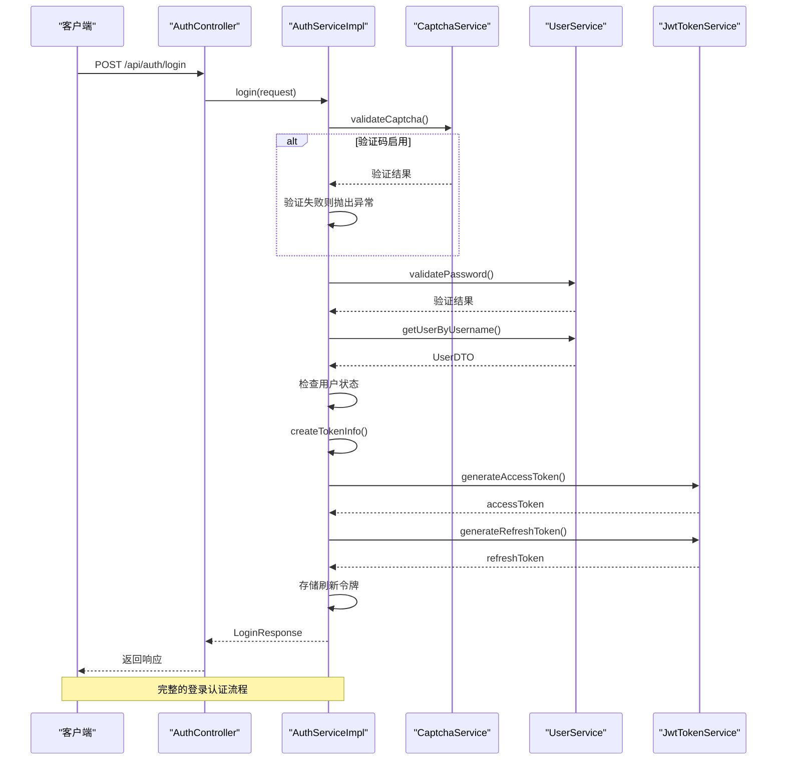
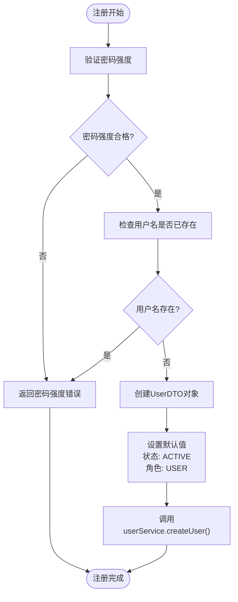
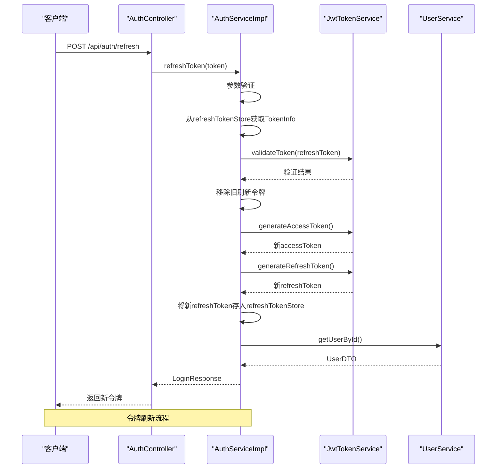
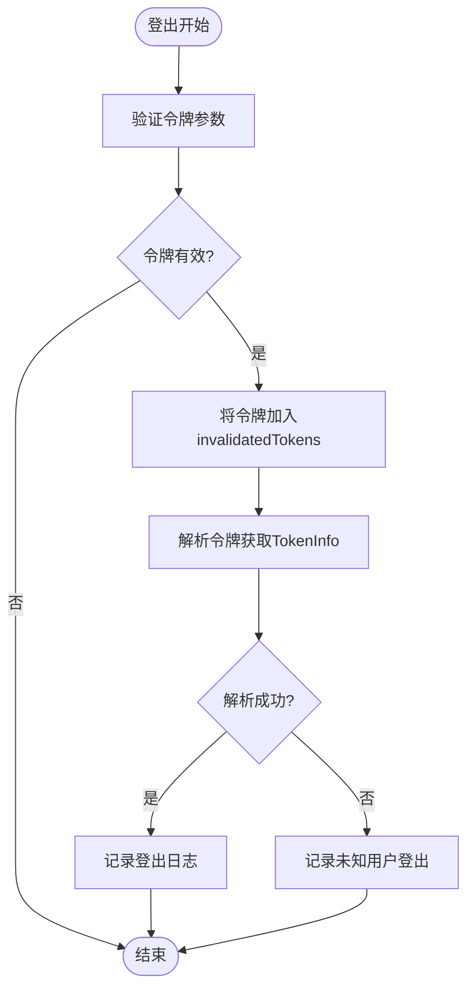
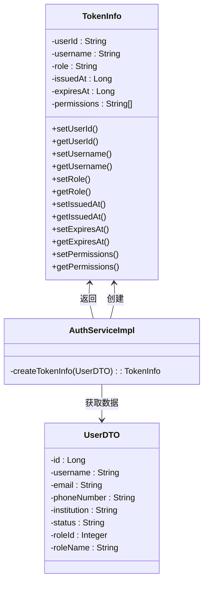
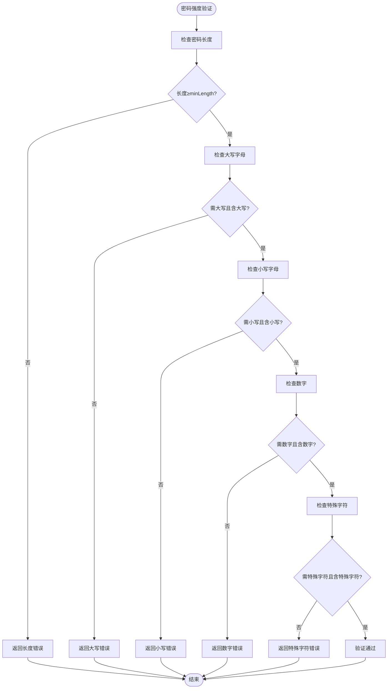
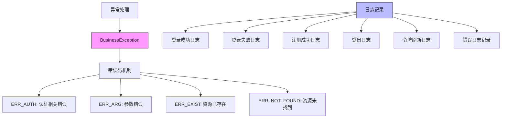

# 认证服务实现

<cite>
**本文档引用的文件**   
- [AuthServiceImpl.java](file://plugins/plugin-auth/src/main/java/com/traffic/sim/plugin/auth/service/AuthServiceImpl.java)
- [JwtTokenService.java](file://plugins/plugin-auth/src/main/java/com/traffic/sim/plugin/auth/service/JwtTokenService.java)
- [CaptchaService.java](file://plugins/plugin-auth/src/main/java/com/traffic/sim/plugin/auth/service/CaptchaService.java)
- [AuthPluginProperties.java](file://plugins/plugin-auth/src/main/java/com/traffic/sim/plugin/auth/config/AuthPluginProperties.java)
- [TokenInfo.java](file://traffic-sim-common/src/main/java/com/traffic/sim/common/service/TokenInfo.java)
- [UserService.java](file://traffic-sim-common/src/main/java/com/traffic/sim/common/service/UserService.java)
- [UserServiceImpl.java](file://plugins/plugin-user/src/main/java/com/traffic/sim/plugin/user/service/UserServiceImpl.java)
- [AuthService.java](file://traffic-sim-common/src/main/java/com/traffic/sim/common/service/AuthService.java)
- [AuthController.java](file://plugins/plugin-auth/src/main/java/com/traffic/sim/plugin/auth/controller/AuthController.java)
</cite>

## 目录
1. [简介](#简介)
2. [核心组件分析](#核心组件分析)
3. [登录流程详解](#登录流程详解)
4. [注册功能实现](#注册功能实现)
5. [令牌刷新机制](#令牌刷新机制)
6. [登出功能实现](#登出功能实现)
7. [TokenInfo创建与权限管理](#tokeninfo创建与权限管理)
8. [密码强度验证机制](#密码强度验证机制)
9. [异常处理与日志记录](#异常处理与日志记录)
10. [架构关系图](#架构关系图)

## 简介
本文档深入分析交通仿真系统中认证服务的实现细节，重点解析`AuthServiceImpl`类中`login`、`register`、`refreshToken`和`logout`方法的具体实现逻辑。文档详细描述了用户认证过程中的验证码验证、用户凭证校验、TokenInfo创建及JWT令牌生成的完整流程，以及密码强度验证、刷新令牌管理等关键机制。

## 核心组件分析

认证服务由多个核心组件构成，包括`AuthServiceImpl`作为主服务实现类，`JwtTokenService`负责JWT令牌的生成与验证，`CaptchaService`提供验证码功能，以及`AuthPluginProperties`管理认证相关的配置参数。

**Section sources**
- [AuthServiceImpl.java](file://plugins/plugin-auth/src/main/java/com/traffic/sim/plugin/auth/service/AuthServiceImpl.java#L29-L34)
- [JwtTokenService.java](file://plugins/plugin-auth/src/main/java/com/traffic/sim/plugin/auth/service/JwtTokenService.java#L25-L27)
- [CaptchaService.java](file://plugins/plugin-auth/src/main/java/com/traffic/sim/plugin/auth/service/CaptchaService.java#L26-L28)
- [AuthPluginProperties.java](file://plugins/plugin-auth/src/main/java/com/traffic/sim/plugin/auth/config/AuthPluginProperties.java#L13-L28)

## 登录流程详解

登录方法`login`实现了完整的用户认证流程，包含验证码验证、用户凭证校验、TokenInfo创建和JWT令牌生成等关键步骤。



**Diagram sources**
- [AuthServiceImpl.java](file://plugins/plugin-auth/src/main/java/com/traffic/sim/plugin/auth/service/AuthServiceImpl.java#L47-L89)
- [AuthController.java](file://plugins/plugin-auth/src/main/java/com/traffic/sim/plugin/auth/controller/AuthController.java#L41-L43)

**Section sources**
- [AuthServiceImpl.java](file://plugins/plugin-auth/src/main/java/com/traffic/sim/plugin/auth/service/AuthServiceImpl.java#L47-L89)

## 注册功能实现

注册方法`register`实现了用户注册功能，包含密码强度验证、用户名唯一性检查和用户创建等关键逻辑。



**Diagram sources**
- [AuthServiceImpl.java](file://plugins/plugin-auth/src/main/java/com/traffic/sim/plugin/auth/service/AuthServiceImpl.java#L93-L123)
- [UserServiceImpl.java](file://plugins/plugin-user/src/main/java/com/traffic/sim/plugin/user/service/UserServiceImpl.java#L60-L98)

**Section sources**
- [AuthServiceImpl.java](file://plugins/plugin-auth/src/main/java/com/traffic/sim/plugin/auth/service/AuthServiceImpl.java#L93-L123)

## 令牌刷新机制

刷新令牌方法`refreshToken`实现了令牌刷新功能，通过ConcurrentHashMap存储管理刷新令牌，并实现了令牌失效机制。



**Diagram sources**
- [AuthServiceImpl.java](file://plugins/plugin-auth/src/main/java/com/traffic/sim/plugin/auth/service/AuthServiceImpl.java#L146-L182)
- [JwtTokenService.java](file://plugins/plugin-auth/src/main/java/com/traffic/sim/plugin/auth/service/JwtTokenService.java#L32-L41)

**Section sources**
- [AuthServiceImpl.java](file://plugins/plugin-auth/src/main/java/com/traffic/sim/plugin/auth/service/AuthServiceImpl.java#L146-L182)

## 登出功能实现

登出方法`logout`实现了用户登出功能，通过将访问令牌标记为失效来实现令牌的即时失效。



**Diagram sources**
- [AuthServiceImpl.java](file://plugins/plugin-auth/src/main/java/com/traffic/sim/plugin/auth/service/AuthServiceImpl.java#L185-L201)
- [AuthController.java](file://plugins/plugin-auth/src/main/java/com/traffic/sim/plugin/auth/controller/AuthController.java#L93-L96)

**Section sources**
- [AuthServiceImpl.java](file://plugins/plugin-auth/src/main/java/com/traffic/sim/plugin/auth/service/AuthServiceImpl.java#L185-L201)

## TokenInfo创建与权限管理

`createTokenInfo`方法负责根据用户信息创建TokenInfo对象，并根据用户角色构建相应的权限列表。



**Diagram sources**
- [AuthServiceImpl.java](file://plugins/plugin-auth/src/main/java/com/traffic/sim/plugin/auth/service/AuthServiceImpl.java#L206-L228)
- [TokenInfo.java](file://traffic-sim-common/src/main/java/com/traffic/sim/common/service/TokenInfo.java#L14-L35)

**Section sources**
- [AuthServiceImpl.java](file://plugins/plugin-auth/src/main/java/com/traffic/sim/plugin/auth/service/AuthServiceImpl.java#L206-L228)

## 密码强度验证机制

`validatePasswordStrength`方法实现了可配置的密码强度验证机制，根据配置参数检查密码是否满足各项策略要求。



**Diagram sources**
- [AuthServiceImpl.java](file://plugins/plugin-auth/src/main/java/com/traffic/sim/plugin/auth/service/AuthServiceImpl.java#L233-L260)
- [AuthPluginProperties.java](file://plugins/plugin-auth/src/main/java/com/traffic/sim/plugin/auth/config/AuthPluginProperties.java#L49-L74)

**Section sources**
- [AuthServiceImpl.java](file://plugins/plugin-auth/src/main/java/com/traffic/sim/plugin/auth/service/AuthServiceImpl.java#L233-L260)

## 异常处理与日志记录

认证服务实现了统一的异常处理模式和详细的日志记录实践，确保系统的稳定性和可维护性。



**Diagram sources**
- [AuthServiceImpl.java](file://plugins/plugin-auth/src/main/java/com/traffic/sim/plugin/auth/service/AuthServiceImpl.java#L26-L27)
- [BusinessException.java](file://traffic-sim-common/src/main/java/com/traffic/sim/common/exception/BusinessException.java#L10-L31)
- [ErrorCode.java](file://traffic-sim-common/src/main/java/com/traffic/sim/common/constant/ErrorCode.java)

**Section sources**
- [AuthServiceImpl.java](file://plugins/plugin-auth/src/main/java/com/traffic/sim/plugin/auth/service/AuthServiceImpl.java#L26-L27)
- [BusinessException.java](file://traffic-sim-common/src/main/java/com/traffic/sim/common/exception/BusinessException.java#L10-L31)

## 架构关系图

```mermaid
graph TD
subgraph "认证模块 plugin-auth"
AuthController[AuthController]
AuthServiceImpl[AuthServiceImpl]
JwtTokenService[JwtTokenService]
CaptchaService[CaptchaService]
AuthPluginProperties[AuthPluginProperties]
end
subgraph "用户模块 plugin-user"
UserServiceImpl[UserServiceImpl]
UserRepository[UserRepository]
PasswordEncoder[PasswordEncoder]
end
subgraph "公共模块 traffic-sim-common"
AuthService[AuthService]
TokenInfo[TokenInfo]
UserService[UserService]
BusinessException[BusinessException]
end
AuthController --> AuthServiceImpl
AuthServiceImpl --> JwtTokenService
AuthServiceImpl --> CaptchaService
AuthServiceImpl --> UserService
AuthServiceImpl --> AuthPluginProperties
AuthServiceImpl --> TokenInfo
UserServiceImpl --> UserRepository
UserServiceImpl --> PasswordEncoder
UserServiceImpl --> BusinessException
AuthService --> AuthServiceImpl
UserService --> UserServiceImpl
style AuthController fill:#f96,stroke:#333
style AuthServiceImpl fill:#6f9,stroke:#333
style JwtTokenService fill:#9f6,stroke:#333
style CaptchaService fill:#9f6,stroke:#333
style AuthPluginProperties fill:#9f6,stroke:#333
style UserServiceImpl fill:#69f,stroke:#333
style UserRepository fill:#69f,stroke:#333
style PasswordEncoder fill:#69f,stroke:#333
style AuthService fill:#999,stroke:#333
style TokenInfo fill:#999,stroke:#333
style UserService fill:#999,stroke:#333
style BusinessException fill:#999,stroke:#333
Note over AuthController,UserServiceImpl: 认证服务整体架构
```

**Diagram sources**
- [AuthServiceImpl.java](file://plugins/plugin-auth/src/main/java/com/traffic/sim/plugin/auth/service/AuthServiceImpl.java#L29-L34)
- [AuthController.java](file://plugins/plugin-auth/src/main/java/com/traffic/sim/plugin/auth/controller/AuthController.java#L33-L34)
- [UserServiceImpl.java](file://plugins/plugin-user/src/main/java/com/traffic/sim/plugin/user/service/UserServiceImpl.java#L40-L42)
- [AuthService.java](file://traffic-sim-common/src/main/java/com/traffic/sim/common/service/AuthService.java#L13-L39)

**Section sources**
- [AuthServiceImpl.java](file://plugins/plugin-auth/src/main/java/com/traffic/sim/plugin/auth/service/AuthServiceImpl.java#L29-L34)
- [UserServiceImpl.java](file://plugins/plugin-user/src/main/java/com/traffic/sim/plugin/user/service/UserServiceImpl.java#L40-L42)