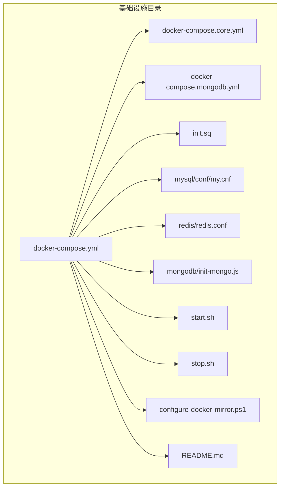
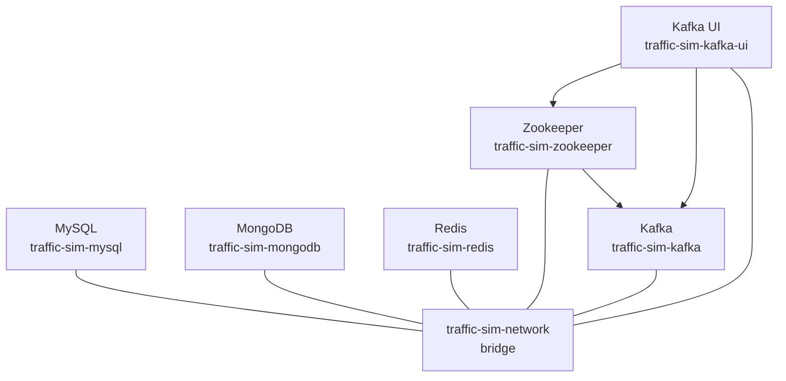
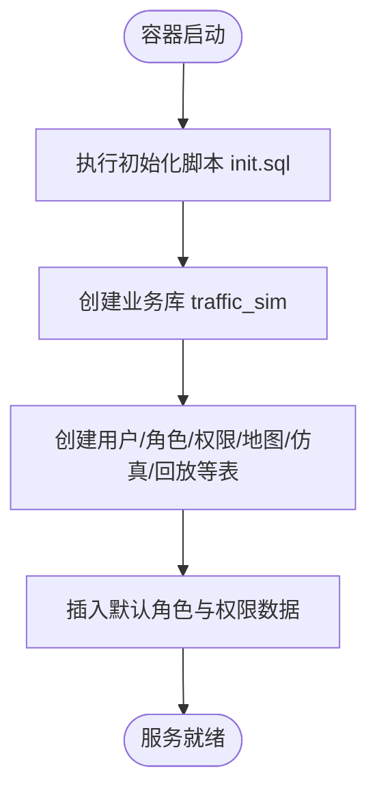
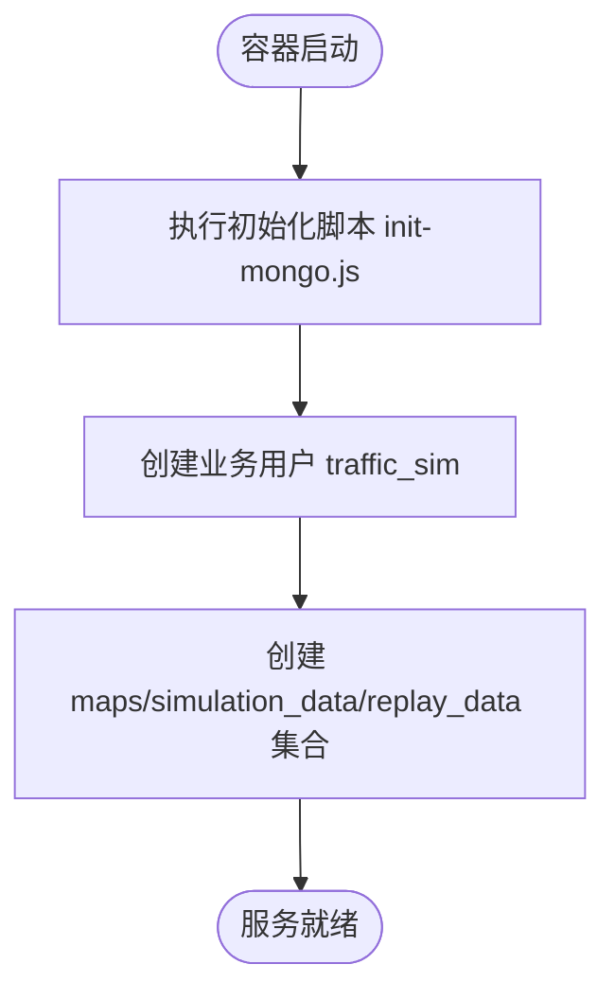
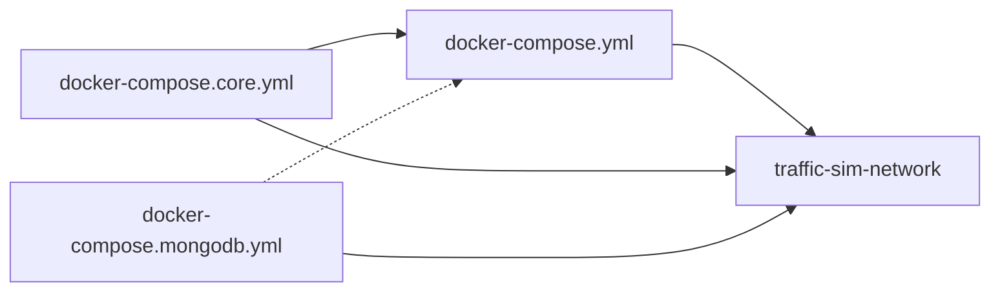

# 容器化部署

<cite>
**本文引用的文件**
- [docker-compose.yml](file://infrastructure/docker-compose.yml)
- [docker-compose.core.yml](file://infrastructure/docker-compose.core.yml)
- [docker-compose.mongodb.yml](file://infrastructure/docker-compose.mongodb.yml)
- [README.md](file://infrastructure/README.md)
- [init.sql](file://infrastructure/init.sql)
- [my.cnf](file://infrastructure/mysql/conf/my.cnf)
- [redis.conf](file://infrastructure/redis/redis.conf)
- [init-mongo.js](file://infrastructure/mongodb/init-mongo.js)
- [start.sh](file://infrastructure/start.sh)
- [stop.sh](file://infrastructure/stop.sh)
- [configure-docker-mirror.ps1](file://infrastructure/configure-docker-mirror.ps1)
</cite>

## 目录
1. [简介](#简介)
2. [项目结构](#项目结构)
3. [核心组件](#核心组件)
4. [架构总览](#架构总览)
5. [详细组件分析](#详细组件分析)
6. [依赖关系分析](#依赖关系分析)
7. [性能与资源建议](#性能与资源建议)
8. [安全与最佳实践](#安全与最佳实践)
9. [故障排查指南](#故障排查指南)
10. [结论](#结论)
11. [附录](#附录)

## 简介
本文件面向交通仿真系统的容器化部署，围绕 docker-compose.yml 文件，系统性说明 MySQL、MongoDB、Redis、Kafka、Zookeeper 五大核心服务的镜像来源、容器命名、端口映射、数据卷挂载、环境变量与健康检查配置；解释 docker-compose.core.yml 与主文件的继承关系及多文件组合部署方式；阐述网络 traffic-sim-network 的桥接模式与服务间通信原理；并提供资源限制与安全加固建议，帮助读者快速、稳定地完成本地与生产环境的部署。

## 项目结构
基础设施相关文件集中在 infrastructure 目录，包含：
- 主编排文件：docker-compose.yml（含管理工具）
- 核心服务独立文件：docker-compose.core.yml（仅核心服务）
- MongoDB 单独启动文件：docker-compose.mongodb.yml
- 初始化脚本与配置：init.sql、mysql/conf/my.cnf、redis/redis.conf、mongodb/init-mongo.js
- 启停脚本：start.sh、stop.sh
- Docker 镜像加速配置脚本：configure-docker-mirror.ps1
- 基础设施部署说明：README.md

**图表来源**
- [docker-compose.yml](file://infrastructure/docker-compose.yml#L1-L253)
- [docker-compose.core.yml](file://infrastructure/docker-compose.core.yml#L1-L168)
- [docker-compose.mongodb.yml](file://infrastructure/docker-compose.mongodb.yml#L1-L73)

**章节来源**
- [README.md](file://infrastructure/README.md#L1-L488)

## 核心组件
本节从镜像来源、容器命名、端口映射、数据卷、环境变量、健康检查六个维度，逐项解析五大核心服务的部署配置。

- MySQL
  - 镜像来源：使用 DaoCloud 加速镜像，便于国内网络拉取
  - 容器命名：traffic-sim-mysql
  - 端口映射：3306:3306
  - 数据卷：mysql_data（数据库数据）、init.sql（初始化脚本）、my.cnf（MySQL 配置）
  - 环境变量：设置根密码、业务库名、业务用户与密码、时区
  - 命令参数：字符集、排序规则、认证插件、最大连接数、Innodb 缓冲池等
  - 健康检查：通过 mysqladmin ping 检测
  - 初始化：容器首次启动自动执行 init.sql，创建数据库与表结构

- MongoDB
  - 镜像来源：官方 mongo:7.0，平台限定 linux/amd64
  - 容器命名：traffic-sim-mongodb
  - 端口映射：27017:27017
  - 数据卷：mongodb_data、mongodb_config（配置库）
  - 环境变量：设置 root 用户名/密码、初始化数据库名、时区
  - 命令参数：mongod --auth 启用认证
  - 健康检查：通过 mongosh 执行 ping 命令
  - 初始化：容器首次启动执行 init-mongo.js，创建业务库、用户与集合

- Redis
  - 镜像来源：DaoCloud 加速镜像
  - 容器命名：traffic-sim-redis
  - 端口映射：6379:6379
  - 数据卷：redis_data
  - 命令参数：开启 AOF 持久化、设置密码
  - 健康检查：通过 redis-cli 发送 ping
  - 配置：挂载 redis.conf，设置 bind、端口、密码、AOF、最大内存与淘汰策略

- Zookeeper
  - 镜像来源：DaoCloud 加速镜像 confluentinc/cp-zookeeper:7.5.0
  - 容器命名：traffic-sim-zookeeper
  - 端口映射：2181:2181
  - 数据卷：zookeeper_data、zookeeper_logs
  - 环境变量：客户端端口、tick 时间、时区
  - 健康检查：检测 2181 端口连通性

- Kafka
  - 镜像来源：DaoCloud 加速镜像 confluentinc/cp-kafka:7.5.0
  - 容器命名：traffic-sim-kafka
  - 端口映射：9092:9092
  - 数据卷：kafka_data
  - 环境变量：Broker ID、ZK 连接、广告监听地址、偏移量复制因子、事务日志最小 ISR、自动创建主题、时区
  - 依赖：depends_on zookeeper
  - 健康检查：通过 kafka-broker-api-versions 检测

- Kafka UI（可选）
  - 镜像来源：DaoCloud 加速镜像 provectuslabs/kafka-ui
  - 容器命名：traffic-sim-kafka-ui
  - 端口映射：8081:8080
  - 环境变量：集群名称、BootstrapServers、Zookeeper 连接、时区
  - 依赖：depends_on kafka

**章节来源**
- [docker-compose.yml](file://infrastructure/docker-compose.yml#L7-L142)
- [docker-compose.core.yml](file://infrastructure/docker-compose.core.yml#L10-L140)
- [my.cnf](file://infrastructure/mysql/conf/my.cnf#L1-L39)
- [redis.conf](file://infrastructure/redis/redis.conf#L1-L31)
- [init.sql](file://infrastructure/init.sql#L1-L208)
- [init-mongo.js](file://infrastructure/mongodb/init-mongo.js#L1-L25)

## 架构总览
下图展示各核心服务在统一网络中的桥接模式与依赖关系，以及可选管理工具的接入方式。

**图表来源**
- [docker-compose.yml](file://infrastructure/docker-compose.yml#L248-L252)
- [docker-compose.core.yml](file://infrastructure/docker-compose.core.yml#L164-L168)

## 详细组件分析

### MySQL 分析
- 部署要点
  - 镜像与加速：使用 DaoCloud 加速镜像，提升国内拉取成功率
  - 命名与端口：容器名 traffic-sim-mysql，映射 3306
  - 数据持久化：挂载 mysql_data；初始化脚本 init.sql 与 my.cnf
  - 环境变量：设置根密码、业务库名、业务用户与密码、时区
  - 命令参数：字符集、排序规则、认证插件、最大连接数、Innodb 缓冲池
  - 健康检查：mysqladmin ping
- 初始化流程
  - 容器启动时自动执行 init.sql，创建数据库与表结构，并插入默认角色、权限与关联关系

**图表来源**
- [init.sql](file://infrastructure/init.sql#L14-L202)

**章节来源**
- [docker-compose.yml](file://infrastructure/docker-compose.yml#L7-L37)
- [my.cnf](file://infrastructure/mysql/conf/my.cnf#L1-L39)
- [init.sql](file://infrastructure/init.sql#L1-L208)

### MongoDB 分析
- 部署要点
  - 镜像与平台：mongo:7.0，linux/amd64
  - 命名与端口：traffic-sim-mongodb，27017:27017
  - 数据持久化：mongodb_data、mongodb_config
  - 环境变量：root 用户名/密码、初始化数据库名、时区
  - 命令参数：mongod --auth 启用认证
  - 健康检查：mongosh 执行 ping
- 初始化流程
  - 容器启动时执行 init-mongo.js，创建业务库、用户与 maps/simulation_data/replay_data 集合

**图表来源**
- [init-mongo.js](file://infrastructure/mongodb/init-mongo.js#L6-L21)

**章节来源**
- [docker-compose.yml](file://infrastructure/docker-compose.yml#L42-L66)
- [init-mongo.js](file://infrastructure/mongodb/init-mongo.js#L1-L25)

### Redis 分析
- 部署要点
  - 镜像与加速：DaoCloud 加速镜像
  - 命名与端口：traffic-sim-redis，6379:6379
  - 数据持久化：redis_data
  - 命令参数：开启 AOF 持久化、设置 requirepass
  - 健康检查：redis-cli ping
  - 配置挂载：redis.conf，设置 bind、端口、密码、AOF、最大内存与淘汰策略

**章节来源**
- [docker-compose.yml](file://infrastructure/docker-compose.yml#L71-L89)
- [redis.conf](file://infrastructure/redis/redis.conf#L1-L31)

### Zookeeper 分析
- 部署要点
  - 镜像与加速：DaoCloud 加速镜像
  - 命名与端口：traffic-sim-zookeeper，2181:2181
  - 数据持久化：zookeeper_data、zookeeper_logs
  - 环境变量：ZOOKEEPER_CLIENT_PORT、ZOOKEEPER_TICK_TIME、时区
  - 健康检查：检测 2181 端口连通性

**章节来源**
- [docker-compose.yml](file://infrastructure/docker-compose.yml#L94-L114)

### Kafka 分析
- 部署要点
  - 镜像与加速：DaoCloud 加速镜像
  - 命名与端口：traffic-sim-kafka，9092:9092
  - 数据持久化：kafka_data
  - 环境变量：Broker ID、ZK 连接、广告监听地址、偏移量复制因子、事务日志最小 ISR、自动创建主题、时区
  - 依赖：depends_on zookeeper
  - 健康检查：kafka-broker-api-versions

**章节来源**
- [docker-compose.yml](file://infrastructure/docker-compose.yml#L116-L142)

### Kafka UI 分析
- 部署要点
  - 镜像与加速：DaoCloud 加速镜像
  - 命名与端口：traffic-sim-kafka-ui，8081:8080
  - 环境变量：集群名称、BootstrapServers、Zookeeper 连接、时区
  - 依赖：depends_on kafka

**章节来源**
- [docker-compose.yml](file://infrastructure/docker-compose.yml#L147-L162)

## 依赖关系分析
- 多文件组合
  - docker-compose.yml：包含全部服务（含可选管理工具）
  - docker-compose.core.yml：仅包含核心服务（MySQL、MongoDB、Redis、Kafka、Zookeeper）
  - docker-compose.mongodb.yml：仅包含 MongoDB 与 Mongo Express
- 继承与覆盖
  - docker-compose.yml 在 docker-compose.core.yml 基础上追加了 Kafka UI 与部分可选管理工具
  - 各文件均定义了统一网络 traffic-sim-network，确保服务间可通过服务名互联
- 服务间通信
  - 通过同一 bridge 网络，服务间可直接使用服务名作为主机名进行通信
  - Kafka 依赖 Zookeeper，Kafka UI 依赖 Kafka 与 Zookeeper

**图表来源**
- [docker-compose.yml](file://infrastructure/docker-compose.yml#L1-L253)
- [docker-compose.core.yml](file://infrastructure/docker-compose.core.yml#L1-L168)
- [docker-compose.mongodb.yml](file://infrastructure/docker-compose.mongodb.yml#L1-L73)

**章节来源**
- [docker-compose.yml](file://infrastructure/docker-compose.yml#L1-L253)
- [docker-compose.core.yml](file://infrastructure/docker-compose.core.yml#L1-L168)
- [docker-compose.mongodb.yml](file://infrastructure/docker-compose.mongodb.yml#L1-L73)

## 性能与资源建议
- 端口映射
  - MySQL: 3306
  - MongoDB: 27017
  - Redis: 6379
  - Zookeeper: 2181
  - Kafka: 9092
  - Kafka UI: 8081（可选）
- 数据卷
  - 建议为每个服务单独的数据卷，便于备份与迁移
  - 可参考 README 中的数据卷清单与备份命令
- 资源限制（建议）
  - CPU：根据宿主机核数与并发需求，为各服务设置合理的 CPU 上限与预留
  - 内存：MySQL 的 innodb_buffer_pool_size、Redis 的 maxmemory 与淘汰策略需结合业务峰值合理配置
  - 磁盘：为数据卷挂载预留充足空间，并监控增长趋势
- 性能优化
  - MySQL：字符集与排序规则、慢查询日志、binlog 等已在配置中启用
  - Redis：AOF 持久化与内存淘汰策略已启用
  - Kafka：单节点场景下副本因子设为 1，事务日志最小 ISR 与复制因子也相应调整

**章节来源**
- [docker-compose.yml](file://infrastructure/docker-compose.yml#L229-L243)
- [my.cnf](file://infrastructure/mysql/conf/my.cnf#L13-L31)
- [redis.conf](file://infrastructure/redis/redis.conf#L17-L23)
- [README.md](file://infrastructure/README.md#L274-L296)

## 安全与最佳实践
- 镜像加速与网络
  - 推荐使用 Docker Desktop 的 registry-mirrors 或在 compose 文件中使用 DaoCloud 加速镜像
  - 若镜像拉取失败，可使用 configure-docker-mirror.ps1 脚本进行连通性测试与配置指导
- 默认凭证与认证
  - 当前配置为开发用途，生产环境必须修改默认密码
  - MySQL：修改根密码与业务用户密码
  - MongoDB：修改 root 密码
  - Redis：修改 requirepass
- 网络隔离与访问控制
  - 尽量减少不必要的端口映射
  - 使用 Docker 网络隔离，避免将内部服务暴露到宿主机
  - 结合防火墙策略限制外部访问
- SSL/TLS 与备份
  - MySQL、MongoDB、Redis 建议启用 SSL/TLS
  - 制定定期备份策略，测试恢复流程

**章节来源**
- [README.md](file://infrastructure/README.md#L33-L80)
- [configure-docker-mirror.ps1](file://infrastructure/configure-docker-mirror.ps1#L1-L105)
- [README.md](file://infrastructure/README.md#L377-L402)

## 故障排查指南
- 常见问题定位
  - MySQL 无法连接：检查容器状态、端口占用、密码正确性
  - MongoDB 认证失败：确认用户名/密码与认证数据库
  - Redis 连接失败：检查密码、健康检查日志、CLI 测试
  - Kafka 无法启动：确保 Zookeeper 先启动，检查端口占用
- 常用命令
  - 查看日志：docker-compose logs -f
  - 进入容器：docker exec -it traffic-sim-xxx bash
  - 资源使用：docker stats
  - 重启服务：docker-compose restart
- 初始化重置
  - MySQL：删除数据卷后重新启动容器以重置数据库

**章节来源**
- [README.md](file://infrastructure/README.md#L445-L471)
- [README.md](file://infrastructure/README.md#L357-L368)

## 结论
通过 docker-compose.yml 及其子文件，交通仿真系统实现了核心数据库与消息中间件的标准化容器化部署。统一的网络桥接与健康检查机制保障了服务间的稳定通信与自愈能力。配合镜像加速、默认凭证加固与资源规划，可在本地与生产环境中快速落地。建议在生产环境中进一步完善认证、加密与备份策略，并根据业务负载调优资源限制。

## 附录
- 启停脚本
  - start.sh：检查 Docker 与 Compose、启动服务、等待并输出访问地址
  - stop.sh：停止服务并提示删除容器与数据卷的注意事项
- 配置脚本
  - configure-docker-mirror.ps1：检测 Docker 状态、显示当前配置、提供三种镜像加速方案与连通性测试

**章节来源**
- [start.sh](file://infrastructure/start.sh#L1-L59)
- [stop.sh](file://infrastructure/stop.sh#L1-L21)
- [configure-docker-mirror.ps1](file://infrastructure/configure-docker-mirror.ps1#L1-L105)