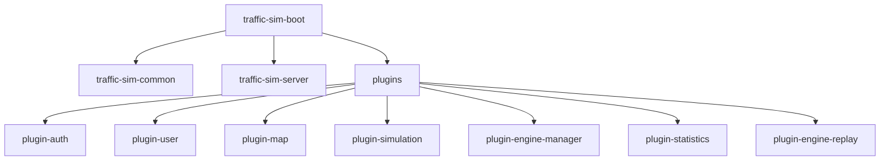

# 构建与打包

<cite>
**本文档引用的文件**  
- [pom.xml](file://pom.xml)
- [traffic-sim-server/pom.xml](file://traffic-sim-server/pom.xml)
- [traffic-sim-common/pom.xml](file://traffic-sim-common/pom.xml)
- [plugins/pom.xml](file://plugins/pom.xml)
- [plugins/plugin-auth/pom.xml](file://plugins/plugin-auth/pom.xml)
- [plugins/plugin-simulation/pom.xml](file://plugins/plugin-simulation/pom.xml)
- [plugins/plugin-statistics/pom.xml](file://plugins/plugin-statistics/pom.xml)
- [mvnw](file://mvnw)
- [mvnw.cmd](file://mvnw.cmd)
- [README.md](file://README.md)
</cite>

## 目录
1. [简介](#简介)
2. [项目结构](#项目结构)
3. [核心构建配置](#核心构建配置)
4. [模块依赖关系](#模块依赖关系)
5. [构建流程详解](#构建流程详解)
6. [Maven Wrapper 使用](#maven-wrapper-使用)
7. [常见构建问题排查](#常见构建问题排查)
8. [快速打包技巧](#快速打包技巧)

## 简介
本文档详细说明了如何使用 Maven 对 traffic_sim_pib 项目进行编译和打包。涵盖了构建的前置条件、模块结构、依赖管理、构建流程以及常见问题的解决方案。通过本指南，开发者可以顺利地完成项目的构建和打包过程。

## 项目结构
traffic_sim_pib 项目采用多模块 Maven 项目结构，主要包含以下模块：

- **traffic-sim-common**: 公共模块，提供所有插件共享的基础功能
- **traffic-sim-server**: 主启动模块，负责应用启动和全局配置
- **plugins**: 插件父模块，包含多个业务功能插件



**图示来源**  
- [pom.xml](file://pom.xml#L22-L26)
- [plugins/pom.xml](file://plugins/pom.xml#L19-L27)

## 核心构建配置
项目的核心构建配置位于根目录的 pom.xml 文件中，定义了项目的整体构建策略。

### Java 版本要求
项目要求使用 JDK 17 进行编译，相关配置如下：

```xml
<properties>
    <java.version>17</java.version>
    <maven.compiler.source>17</maven.compiler.source>
    <maven.compiler.target>17</maven.compiler.target>
</properties>
```

### 父级依赖
项目继承自 Spring Boot 3.2.0 的父 POM，确保了依赖版本的一致性：

```xml
<parent>
    <groupId>org.springframework.boot</groupId>
    <artifactId>spring-boot-starter-parent</artifactId>
    <version>3.2.0</version>
    <relativePath/>
</parent>
```

**本节来源**  
- [pom.xml](file://pom.xml#L8-L39)

## 模块依赖关系
项目采用分层的模块依赖结构，确保了模块间的清晰边界和依赖管理。

### 模块结构
根 pom.xml 中定义了三个主要模块：

```xml
<modules>
    <module>traffic-sim-common</module>
    <module>traffic-sim-server</module>
    <module>plugins</module>
</modules>
```

### 依赖管理
通过 dependencyManagement 集中管理所有依赖的版本，避免版本冲突：

```xml
<dependencyManagement>
    <dependencies>
        <dependency>
            <groupId>org.springframework.boot</groupId>
            <artifactId>spring-boot-dependencies</artifactId>
            <version>${spring-boot.version}</version>
            <type>pom</type>
            <scope>import</scope>
        </dependency>
        <!-- 内部模块依赖 -->
        <dependency>
            <groupId>com.traffic.sim</groupId>
            <artifactId>traffic-sim-common</artifactId>
            <version>${project.version}</version>
        </dependency>
        <!-- 外部依赖 -->
        <dependency>
            <groupId>org.springdoc</groupId>
            <artifactId>springdoc-openapi-starter-webmvc-ui</artifactId>
            <version>${springdoc.version}</version>
        </dependency>
    </dependencies>
</dependencyManagement>
```

### 插件模块结构
plugins 模块作为插件的父模块，管理所有插件的公共配置：

```xml
<modules>
    <module>plugin-auth</module>
    <module>plugin-user</module>
    <module>plugin-map</module>
    <module>plugin-simulation</module>
    <module>plugin-engine-manager</module>
    <module>plugin-statistics</module>
    <module>plugin-engine-replay</module>
</modules>
```

**本节来源**  
- [pom.xml](file://pom.xml#L22-L92)
- [plugins/pom.xml](file://plugins/pom.xml#L19-L27)

## 构建流程详解
详细的构建流程包括编译、测试、打包等步骤。

### 构建命令
执行标准的 Maven 构建命令：

```bash
mvn clean package
```

### 主启动模块配置
traffic-sim-server 模块是可执行的 JAR 文件，配置了 spring-boot-maven-plugin：

```xml
<build>
    <plugins>
        <plugin>
            <groupId>org.springframework.boot</groupId>
            <artifactId>spring-boot-maven-plugin</artifactId>
            <configuration>
                <excludes>
                    <exclude>
                        <groupId>org.projectlombok</groupId>
                        <artifactId>lombok</artifactId>
                    </exclude>
                </excludes>
            </configuration>
        </plugin>
    </plugins>
</build>
```

### 构建输出
构建完成后，可执行 JAR 文件位于：

```
traffic-sim-server/target/traffic-sim-server-1.0.0-SNAPSHOT.jar
```

**本节来源**  
- [traffic-sim-server/pom.xml](file://traffic-sim-server/pom.xml#L114-L128)
- [README.md](file://README.md#L114-L117)

## Maven Wrapper 使用
项目包含 Maven Wrapper，支持跨平台构建，无需预先安装 Maven。

### Wrapper 文件
项目根目录包含以下 Wrapper 文件：

- **mvnw**: Unix/Linux/macOS 平台的脚本
- **mvnw.cmd**: Windows 平台的批处理文件

### 使用方法
使用 Wrapper 执行构建命令：

```bash
# Linux/macOS
./mvnw clean package

# Windows
mvnw.cmd clean package
```

### Wrapper 配置
Maven Wrapper 会自动下载指定版本的 Maven 并执行构建，确保构建环境的一致性。

**本节来源**  
- [mvnw](file://mvnw)
- [mvnw.cmd](file://mvnw.cmd)
- [README.md](file://README.md#L114-L117)

## 常见构建问题排查
解决常见的构建问题，确保构建过程顺利进行。

### 依赖下载失败
如果遇到依赖下载失败的问题，可以尝试以下解决方案：

1. 检查网络连接
2. 配置 Maven 镜像仓库
3. 清理本地仓库缓存

```bash
mvn dependency:purge-local-repository
```

### 版本冲突
由于使用了 dependencyManagement，大多数版本冲突已被避免。如果出现冲突，检查依赖树：

```bash
mvn dependency:tree
```

### 编译错误
确保使用 JDK 17 进行编译，检查 JAVA_HOME 环境变量：

```bash
java -version
```

**本节来源**  
- [pom.xml](file://pom.xml#L28-L39)
- [README.md](file://README.md#L92-L93)

## 快速打包技巧
在开发过程中，可以使用以下技巧加快打包速度。

### 跳过测试
在不需要运行测试的情况下，可以跳过测试阶段：

```bash
mvn clean package -DskipTests
```

或者

```bash
mvn clean package -Dmaven.test.skip=true
```

### 使用 Wrapper 快速构建
结合 Wrapper 和跳过测试，实现快速构建：

```bash
./mvnw clean package -DskipTests
```

### 增量构建
Maven 支持增量构建，只重新编译发生变化的模块，提高构建效率。

**本节来源**  
- [README.md](file://README.md#L114-L117)
- [pom.xml](file://pom.xml)