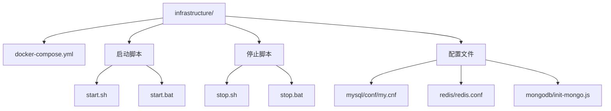
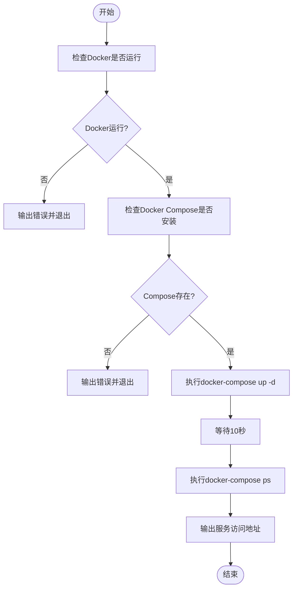
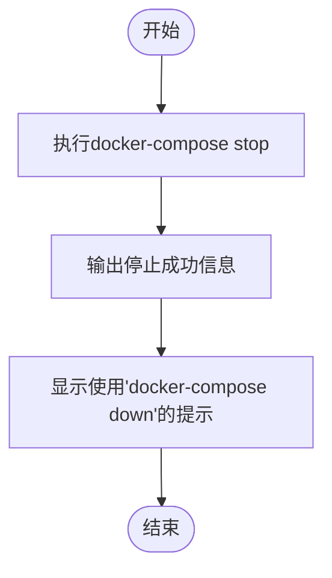
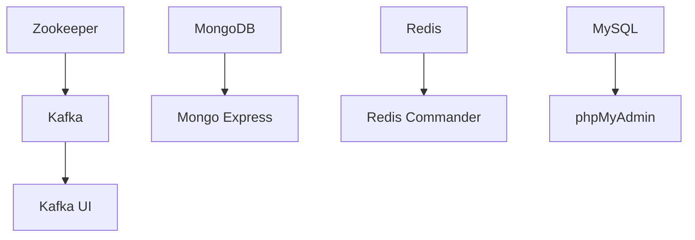

# 运维脚本与服务管理

<cite>
**本文档引用文件**  
- [start.sh](file://infrastructure/start.sh)
- [stop.sh](file://infrastructure/stop.sh)
- [start.bat](file://infrastructure/start.bat)
- [stop.bat](file://infrastructure/stop.bat)
- [docker-compose.yml](file://infrastructure/docker-compose.yml)
- [README.md](file://infrastructure/README.md)
- [configure-docker-mirror.ps1](file://infrastructure/configure-docker-mirror.ps1)
</cite>

## 目录
1. [简介](#简介)
2. [项目结构](#项目结构)
3. [核心运维脚本分析](#核心运维脚本分析)
4. [服务依赖与启动顺序](#服务依赖与启动顺序)
5. [平台差异：Linux与Windows脚本对比](#平台差异linux与windows脚本对比)
6. [常见问题与解决方案](#常见问题与解决方案)
7. [生产环境建议](#生产环境建议)
8. [附录](#附录)

## 简介
本文档旨在为交通仿真系统的基础设施提供全面的运维脚本使用指南。重点解析 `start.sh` 和 `stop.sh` 脚本的功能逻辑，涵盖 Docker 环境预检、Docker Compose 依赖验证、服务启停命令执行、启动后状态检查及访问地址输出等核心流程。同时，深入说明脚本中 `sleep 10` 等待机制的必要性，以确保服务依赖顺序（如 Kafka 依赖 Zookeeper）正确建立。文档还将对比 Linux 与 Windows 平台脚本（`.sh` 与 `.bat`）的差异与使用场景，提供脚本执行常见问题（如权限不足、端口占用）的解决方案，并建议在生产环境中结合 systemd 或 supervisor 实现脚本的守护进程化运行。

## 项目结构
本项目采用模块化设计，基础设施服务通过 Docker Compose 统一管理。核心数据服务（MySQL、MongoDB、Redis、Kafka）及其管理工具均在 `infrastructure` 目录下配置。



**图示来源**
- [docker-compose.yml](file://infrastructure/docker-compose.yml)
- [README.md](file://infrastructure/README.md)

**本节来源**
- [README.md](file://infrastructure/README.md)

## 核心运维脚本分析
运维脚本是系统启动和停止的核心工具，确保了服务的可靠部署。

### 启动脚本 (`start.sh` / `start.bat`)
启动脚本遵循标准化的流程来确保服务的顺利启动。

**功能逻辑流程图**


**图示来源**
- [start.sh](file://infrastructure/start.sh#L1-L59)
- [start.bat](file://infrastructure/start.bat#L1-L62)

**本节来源**
- [start.sh](file://infrastructure/start.sh#L1-L59)
- [start.bat](file://infrastructure/start.bat#L1-L62)

### 停止脚本 (`stop.sh` / `stop.bat`)
停止脚本负责安全地停止所有服务。

**功能逻辑流程图**


**图示来源**
- [stop.sh](file://infrastructure/stop.sh#L1-L21)
- [stop.bat](file://infrastructure/stop.bat#L1-L21)

**本节来源**
- [stop.sh](file://infrastructure/stop.sh#L1-L21)
- [stop.bat](file://infrastructure/stop.bat#L1-L21)

## 服务依赖与启动顺序
系统中的服务存在明确的依赖关系，启动顺序至关重要。

### 服务依赖关系


**图示来源**
- [docker-compose.yml](file://infrastructure/docker-compose.yml)

### `sleep 10` 等待机制的必要性
在 `start.sh` 和 `start.bat` 脚本中，`sleep 10` 命令是确保服务稳定的关键。

- **目的**：在执行 `docker-compose up -d` 后，容器虽然已创建并启动，但其内部服务（如数据库、消息队列）需要时间完成初始化、加载配置和建立连接。
- **必要性**：如果没有等待，立即执行 `docker-compose ps` 可能会显示服务为 `starting` 状态，而非 `running`。更重要的是，应用服务（如后端服务器）在尝试连接这些基础设施时，可能会因服务未完全就绪而连接失败，导致应用启动失败或出现大量错误日志。
- **示例**：Kafka 依赖 Zookeeper。`docker-compose` 的 `depends_on` 只能保证容器启动顺序，但不能保证服务就绪。`sleep 10` 提供了足够的时间让 Zookeeper 完成选举，Kafka 成功注册，从而确保后续操作的可靠性。

**本节来源**
- [start.sh](file://infrastructure/start.sh#L31)
- [start.bat](file://infrastructure/start.bat#L34)
- [docker-compose.yml](file://infrastructure/docker-compose.yml#L121-L122)

## 平台差异：Linux与Windows脚本对比
为适应不同操作系统，提供了 `.sh` (Bash) 和 `.bat` (Windows Batch) 两种脚本。

| 特性 | Linux (`start.sh` / `stop.sh`) | Windows (`start.bat` / `stop.bat`) |
| :--- | :--- | :--- |
| **解释器** | `#!/bin/bash` | `@echo off` |
| **注释** | `#` | `REM` |
| **错误检查** | `if ! command -v docker-compose &> /dev/null` | `if %errorlevel% neq 0` |
| **等待命令** | `sleep 10` | `timeout /t 10 /nobreak >nul` |
| **用户交互** | 无 `pause`，脚本执行完即退出 | 包含 `pause`，执行完后暂停等待用户按键 |
| **文件权限** | 需要 `chmod +x` 赋予执行权限 | 通常双击即可运行 |

**本节来源**
- [start.sh](file://infrastructure/start.sh)
- [stop.sh](file://infrastructure/stop.sh)
- [start.bat](file://infrastructure/start.bat)
- [stop.bat](file://infrastructure/stop.bat)

## 常见问题与解决方案
### 1. 权限不足 (Linux)
**问题**：执行 `./start.sh` 时提示 `Permission denied`。
**解决方案**：
```bash
# 赋予脚本执行权限
chmod +x start.sh
# 再次执行
./start.sh
```

### 2. 端口占用
**问题**：`docker-compose up` 失败，提示 `Bind for 0.0.0.0:3306 failed: port is already allocated`。
**解决方案**：
```bash
# 查看占用端口的进程
lsof -i :3306 # Linux/Mac
netstat -ano | findstr :3306 # Windows
# 终止占用进程或修改 docker-compose.yml 中的端口映射
```

### 3. Docker 未运行或 Compose 未安装
**问题**：脚本检查失败，提示 Docker 未运行或 Compose 未安装。
**解决方案**：
- 确保 Docker Desktop 已启动。
- 检查 Docker Compose 是否已正确安装（可通过 `docker-compose --version` 验证）。

### 4. 镜像拉取失败
**问题**：`docker-compose up` 时卡在 `Pulling` 阶段。
**解决方案**：
- 运行 `configure-docker-mirror.ps1` 脚本配置国内镜像源。
- 或手动修改 `docker-compose.yml`，使用 `m.daocloud.io` 等镜像加速地址。

**本节来源**
- [start.sh](file://infrastructure/start.sh#L10-L18)
- [start.bat](file://infrastructure/start.bat#L9-L22)
- [README.md](file://infrastructure/README.md#L33-L79)
- [configure-docker-mirror.ps1](file://infrastructure/configure-docker-mirror.ps1)

## 生产环境建议
在生产环境中，直接运行脚本可能不够稳定。建议采用以下方案：

### 使用 systemd (Linux)
创建一个 systemd 服务单元文件，将 `start.sh` 作为服务管理。

**示例** (`/etc/systemd/system/traffic-sim.service`)
```ini
[Unit]
Description=Traffic Simulation Infrastructure
After=docker.service
Requires=docker.service

[Service]
Type=oneshot
RemainAfterExit=yes
ExecStart=/path/to/infrastructure/start.sh
ExecStop=/path/to/infrastructure/stop.sh
WorkingDirectory=/path/to/infrastructure
TimeoutStartSec=0

[Install]
WantedBy=multi-user.target
```
然后使用 `systemctl enable traffic-sim` 和 `systemctl start traffic-sim` 进行管理。

### 使用 supervisor
Supervisor 是一个进程控制系统，可以监控和自动重启服务。

**示例** (`/etc/supervisor/conf.d/traffic-sim.conf`)
```ini
[program:traffic-sim]
command=/path/to/infrastructure/start.sh
directory=/path/to/infrastructure
autostart=true
autorestart=true
startsecs=10
stderr_logfile=/var/log/traffic-sim.err.log
stdout_logfile=/var/log/traffic-sim.out.log
```

**本节来源**
- [start.sh](file://infrastructure/start.sh)
- [stop.sh](file://infrastructure/stop.sh)

## 附录
### 服务访问地址
根据 `docker-compose.yml` 配置，各服务的访问地址如下：

| 服务 | 访问地址 |
| :--- | :--- |
| MySQL | localhost:3306 |
| MongoDB | localhost:27017 |
| Redis | localhost:6379 |
| Kafka | localhost:9092 |
| phpMyAdmin | http://localhost:8083 |
| Mongo Express | http://localhost:8084 |
| Redis Commander | http://localhost:8082 |
| Kafka UI | http://localhost:8081 |

**本节来源**
- [start.sh](file://infrastructure/start.sh#L44-L57)
- [docker-compose.yml](file://infrastructure/docker-compose.yml)