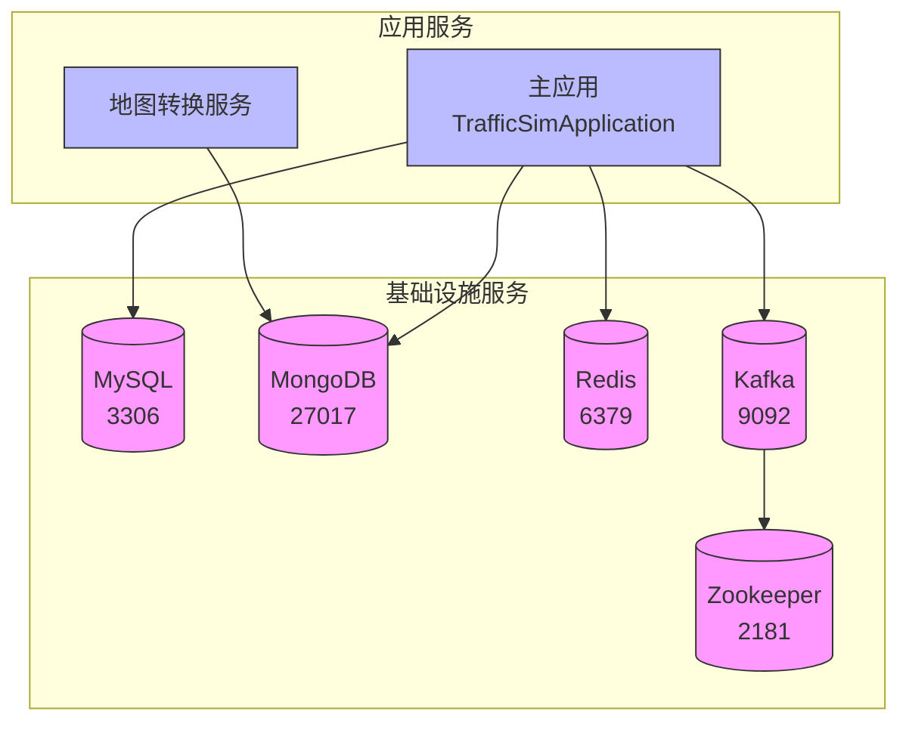

# 部署指南

<cite>
**本文档引用的文件**
- [docker-compose.yml](file://infrastructure/docker-compose.yml)
- [start.sh](file://infrastructure/start.sh)
- [stop.sh](file://infrastructure/stop.sh)
- [init.sql](file://infrastructure/init.sql)
- [init-mongo.js](file://infrastructure/mongodb/init-mongo.js)
- [my.cnf](file://infrastructure/mysql/conf/my.cnf)
- [redis.conf](file://infrastructure/redis/redis.conf)
- [application-prod.yml](file://traffic-sim-server/src/main/resources/application-prod.yml)
- [application.yml](file://traffic-sim-server/src/main/resources/application.yml)
- [TrafficSimApplication.java](file://traffic-sim-server/src/main/java/com/traffic/sim/TrafficSimApplication.java)
- [pom.xml](file://pom.xml)
- [traffic-sim-server/pom.xml](file://traffic-sim-server/pom.xml)
- [Dockerfile](file://map_convert_services/Dockerfile)
</cite>

## 目录

1. [项目结构概述](#项目结构概述)
2. [Maven打包](#maven打包)
3. [Docker环境准备](#docker环境准备)
4. [依赖服务部署](#依赖服务部署)
5. [主应用Docker镜像运行](#主应用docker镜像运行)
6. [启动与停止脚本](#启动与停止脚本)
7. [部署拓扑与服务依赖](#部署拓扑与服务依赖)
8. [高可用性与负载均衡](#高可用性与负载均衡)
9. [监控集成建议](#监控集成建议)
10. [生产环境配置建议](#生产环境配置建议)

## 项目结构概述

traffic_sim_pib项目采用模块化架构，主要包含以下核心组件：
- **traffic-sim-server**: 主应用服务，基于Spring Boot构建
- **plugins**: 各功能插件模块，包括认证、用户、地图、仿真等
- **traffic-sim-common**: 公共模块，包含共享的DTO、异常处理等
- **infrastructure**: 基础设施配置，包含Docker Compose文件和脚本
- **map_convert_services**: 地图转换服务，包含Python实现的gRPC服务

项目使用Maven进行依赖管理和构建，通过Docker Compose管理所有依赖服务的部署。

**Section sources**
- [pom.xml](file://pom.xml)
- [traffic-sim-server/pom.xml](file://traffic-sim-server/pom.xml)

## Maven打包

使用Maven对项目进行打包是部署的第一步。在项目根目录执行以下命令：

```bash
mvn clean package
```

该命令会执行以下操作：
1. 清理之前的构建产物
2. 编译所有模块
3. 运行单元测试
4. 打包生成可执行的JAR文件

打包完成后，`traffic-sim-server`模块的target目录下将生成`traffic-sim-server.jar`文件，这是主应用的可执行文件。

**Section sources**
- [pom.xml](file://pom.xml)
- [traffic-sim-server/pom.xml](file://traffic-sim-server/pom.xml)

## Docker环境准备

在部署之前，需要确保Docker环境已正确配置：

1. 安装Docker Desktop或Docker Engine（版本20.10+）
2. 安装Docker Compose（版本2.0+）
3. 配置Docker镜像源以提高在中国大陆的拉取速度

推荐配置阿里云等国内镜像源，可以在Docker Desktop设置中添加以下镜像源：
- https://registry.cn-hangzhou.aliyuncs.com
- https://mirror.ccs.tencentyun.com
- https://dockerproxy.com

项目中的`docker-compose.yml`文件已使用DaoCloud镜像加速器，确保在中国大陆有良好的网络连接。

**Section sources**
- [docker-compose.yml](file://infrastructure/docker-compose.yml)

## 依赖服务部署

项目依赖多个中间件服务，通过Docker Compose进行统一管理。主要依赖服务包括：

### MySQL数据库
- 容器名：traffic-sim-mysql
- 端口：3306
- 数据库名：traffic_sim
- 用户名/密码：root/root
- 初始化脚本：`infrastructure/init.sql`

### MongoDB数据库
- 容器名：traffic-sim-mongodb
- 端口：27017
- 数据库名：traffic_sim
- 用户名/密码：root/root
- 初始化脚本：`infrastructure/mongodb/init-mongo.js`

### Redis缓存
- 容器名：traffic-sim-redis
- 端口：6379
- 密码：redis123
- 配置文件：`infrastructure/redis/redis.conf`

### Kafka消息队列
- Zookeeper容器：traffic-sim-zookeeper（端口2181）
- Kafka容器：traffic-sim-kafka（端口9092）

使用`docker-compose up -d`命令可以一键启动所有依赖服务。

**Section sources**
- [docker-compose.yml](file://infrastructure/docker-compose.yml)
- [init.sql](file://infrastructure/init.sql)
- [init-mongo.js](file://infrastructure/mongodb/init-mongo.js)
- [my.cnf](file://infrastructure/mysql/conf/my.cnf)
- [redis.conf](file://infrastructure/redis/redis.conf)

## 主应用Docker镜像运行

主应用`traffic-sim-server`需要构建Docker镜像并运行。`map_convert_services`目录下提供了Dockerfile用于构建地图转换服务镜像。

构建镜像：
```bash
docker build -t traffic-sim-server:latest -f map_convert_services/Dockerfile .
```

运行主应用容器：
```bash
docker run -d \
  --name traffic-sim-server \
  --network traffic-sim-network \
  -p 8080:8080 \
  -e DB_HOST=mysql \
  -e MONGO_HOST=mongodb \
  -e REDIS_HOST=redis \
  traffic-sim-server:latest
```

应用配置文件`application-prod.yml`中定义了生产环境的数据库连接信息，使用环境变量进行配置，确保与Docker Compose网络兼容。

**Section sources**
- [Dockerfile](file://map_convert_services/Dockerfile)
- [application-prod.yml](file://traffic-sim-server/src/main/resources/application-prod.yml)
- [application.yml](file://traffic-sim-server/src/main/resources/application.yml)

## 启动与停止脚本

项目提供了便捷的启动和停止脚本，位于`infrastructure`目录下。

### start.sh 脚本功能
- 检查Docker和Docker Compose是否安装并运行
- 启动所有服务（`docker-compose up -d`）
- 等待服务启动
- 显示服务状态和访问地址
- 提供管理工具的访问链接

### stop.sh 脚本功能
- 停止所有服务（`docker-compose stop`）
- 提供删除容器和数据卷的提示
- 区分`stop`、`down`和`down -v`的不同作用

这些脚本简化了服务的管理，确保部署过程的一致性和可靠性。

**Section sources**
- [start.sh](file://infrastructure/start.sh)
- [stop.sh](file://infrastructure/stop.sh)

## 部署拓扑与服务依赖



**Diagram sources**
- [docker-compose.yml](file://infrastructure/docker-compose.yml)
- [TrafficSimApplication.java](file://traffic-sim-server/src/main/java/com/traffic/sim/TrafficSimApplication.java)

## 高可用性与负载均衡

为实现高可用性，建议采用以下策略：

1. **服务多实例部署**：每个服务部署多个实例，避免单点故障
2. **数据库主从复制**：MySQL和MongoDB配置主从复制，实现读写分离
3. **Redis集群**：使用Redis Cluster模式，提高缓存的可用性
4. **Kafka分区**：合理设置Kafka主题的分区和副本，确保消息的高可用

负载均衡建议：
- 使用Nginx或HAProxy作为反向代理
- 配置基于轮询或最少连接的负载均衡算法
- 实现健康检查，自动剔除故障实例
- 使用会话保持（Session Persistence）确保WebSocket连接的连续性

**Section sources**
- [docker-compose.yml](file://infrastructure/docker-compose.yml)

## 监控集成建议

为确保系统稳定运行，建议集成以下监控组件：

1. **Prometheus + Grafana**：收集和可视化系统指标
2. **ELK Stack**：集中管理日志，便于故障排查
3. **健康检查**：所有服务实现健康检查端点
4. **告警系统**：配置邮件或短信告警

在`docker-compose.yml`中已为每个服务配置了健康检查，可通过`docker-compose ps`查看服务状态。

**Section sources**
- [docker-compose.yml](file://infrastructure/docker-compose.yml)

## 生产环境配置建议

生产环境部署时，需注意以下安全和性能配置：

1. **修改默认密码**：更改MySQL、MongoDB和Redis的默认密码
2. **限制网络访问**：仅暴露必要的端口，使用防火墙规则
3. **启用SSL/TLS**：为数据库连接和API通信启用加密
4. **数据备份**：定期备份数据库，测试恢复流程
5. **资源限制**：为容器设置CPU和内存限制，防止资源耗尽

`application-prod.yml`文件中配置了生产环境的连接信息和日志路径，确保日志写入持久化存储。

**Section sources**
- [application-prod.yml](file://traffic-sim-server/src/main/resources/application-prod.yml)
- [docker-compose.yml](file://infrastructure/docker-compose.yml)