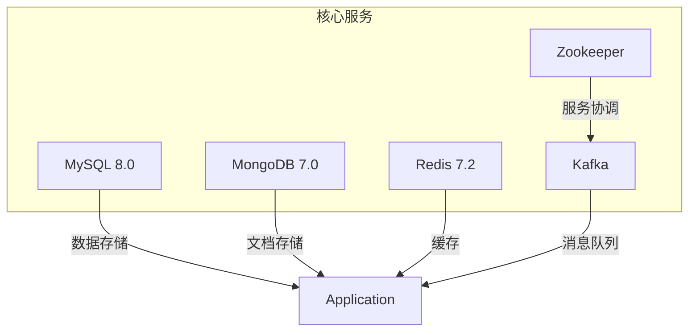
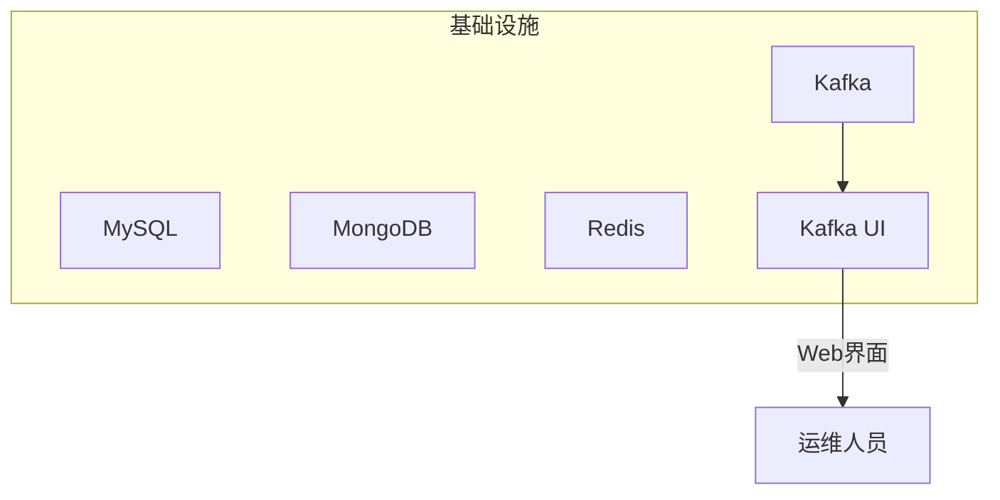
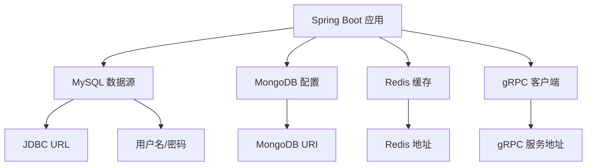

# 部署配置

<cite>
**本文档引用的文件**  
- [docker-compose.core.yml](file://infrastructure/docker-compose.core.yml)
- [docker-compose.yml](file://infrastructure/docker-compose.yml)
- [application.yml](file://traffic-sim-server/src/main/resources/application.yml)
- [init.sql](file://infrastructure/init.sql)
- [init-mongo.js](file://infrastructure/mongodb/init-mongo.js)
- [my.cnf](file://infrastructure/mysql/conf/my.cnf)
- [redis.conf](file://infrastructure/redis/redis.conf)
- [application-prod.yml](file://traffic-sim-server/src/main/resources/application-prod.yml)
- [AuthPluginProperties.java](file://plugins/plugin-auth/src/main/java/com/traffic/sim/plugin/auth/config/AuthPluginProperties.java)
</cite>

## 目录
1. [简介](#简介)
2. [Docker Compose 配置详解](#docker-compose-配置详解)
3. [核心服务配置分析](#核心服务配置分析)
4. [数据库初始化脚本说明](#数据库初始化脚本说明)
5. [主应用配置文件解析](#主应用配置文件解析)
6. [生产环境安全配置要求](#生产环境安全配置要求)
7. [部署命令与健康检查](#部署命令与健康检查)
8. [性能调优建议](#性能调优建议)
9. [结论](#结论)

## 简介
本文档为交通仿真系统的生产或预发布环境提供详细的部署指南。基于项目中的 `docker-compose.yml` 文件，详细说明如何使用 Docker Compose 编排 MySQL、MongoDB、Redis 和主应用服务。文档涵盖基础配置文件 `docker-compose.core.yml` 的作用、主配置文件的扩展机制、关键配置项的解释、数据库初始化脚本的功能以及生产环境的安全配置要求。

## Docker Compose 配置详解

### 基础配置文件 `docker-compose.core.yml`
`docker-compose.core.yml` 文件定义了系统的核心服务，包括 MySQL、MongoDB、Redis、Zookeeper 和 Kafka。该文件作为基础配置，确保核心基础设施的稳定运行。

**图示来源**  
- [docker-compose.core.yml](file://infrastructure/docker-compose.core.yml#L6-L167)

**本节来源**  
- [docker-compose.core.yml](file://infrastructure/docker-compose.core.yml#L1-L168)

### 主配置文件 `docker-compose.yml`
主配置文件 `docker-compose.yml` 继承并扩展了 `docker-compose.core.yml` 的配置，增加了管理工具如 Kafka UI，便于运维人员监控和管理消息队列。

**图示来源**  
- [docker-compose.yml](file://infrastructure/docker-compose.yml#L3-L253)

**本节来源**  
- [docker-compose.yml](file://infrastructure/docker-compose.yml#L1-L253)

## 核心服务配置分析

### MySQL 服务配置
MySQL 服务使用官方镜像 `mysql:8.0`，配置了字符集、连接数、InnoDB 缓冲池等关键参数，确保中文支持和高并发性能。

**本节来源**  
- [docker-compose.core.yml](file://infrastructure/docker-compose.core.yml#L10-L37)
- [my.cnf](file://infrastructure/mysql/conf/my.cnf#L1-L39)

### MongoDB 服务配置
MongoDB 服务使用 `mongo:7.0` 镜像，启用了认证机制，并通过 `init-mongo.js` 脚本初始化数据库和用户。

**本节来源**  
- [docker-compose.core.yml](file://infrastructure/docker-compose.core.yml#L43-L66)
- [init-mongo.js](file://infrastructure/mongodb/init-mongo.js#L1-L25)

### Redis 服务配置
Redis 服务使用 `redis:7.2-alpine` 镜像，配置了密码保护和 AOF 持久化，确保数据安全和持久性。

**本节来源**  
- [docker-compose.core.yml](file://infrastructure/docker-compose.core.yml#L70-L89)
- [redis.conf](file://infrastructure/redis/redis.conf#L1-L31)

## 数据库初始化脚本说明

### MySQL 初始化脚本 `init.sql`
`init.sql` 脚本在容器首次启动时执行，创建 `traffic_sim` 数据库，并初始化用户管理、地图管理、仿真任务和回放任务相关的数据表。

**本节来源**  
- [init.sql](file://infrastructure/init.sql#L1-L208)

### MongoDB 初始化脚本 `init-mongo.js`
`init-mongo.js` 脚本在 MongoDB 容器启动时执行，创建 `traffic_sim` 数据库，设置用户权限，并创建 `maps`、`simulation_data` 和 `replay_data` 集合。

**本节来源**  
- [init-mongo.js](file://infrastructure/mongodb/init-mongo.js#L1-L25)

## 主应用配置文件解析

### `application.yml` 关键配置项
`application.yml` 文件定义了主应用的核心配置，包括数据源、JPA、MongoDB、服务器端口等。

**图示来源**  
- [application.yml](file://traffic-sim-server/src/main/resources/application.yml#L1-L97)

**本节来源**  
- [application.yml](file://traffic-sim-server/src/main/resources/application.yml#L1-L97)

## 生产环境安全配置要求

### JWT 密钥配置
在 `AuthPluginProperties.java` 中，JWT 密钥的默认值为 `traffic-sim-jwt-secret-key-change-in-production`，**必须在生产环境中更改**。

**本节来源**  
- [AuthPluginProperties.java](file://plugins/plugin-auth/src/main/java/com/traffic/sim/plugin/auth/config/AuthPluginProperties.java#L35)

### 验证码配置
验证码功能默认启用，包含宽度、高度、长度和过期时间等可配置项，可根据安全需求调整。

**本节来源**  
- [AuthPluginProperties.java](file://plugins/plugin-auth/src/main/java/com/traffic/sim/plugin/auth/config/AuthPluginProperties.java#L77-L101)

## 部署命令与健康检查

### 启动脚本 `start.sh`
`start.sh` 脚本检查 Docker 环境，启动所有服务，并显示服务状态和访问地址。

**本节来源**  
- [start.sh](file://infrastructure/start.sh#L1-L59)

### 停止脚本 `stop.sh`
`stop.sh` 脚本用于安全停止所有服务，保留数据卷。

**本节来源**  
- [stop.sh](file://infrastructure/stop.sh#L1-L21)

### 健康检查机制
所有核心服务均配置了健康检查，确保服务正常运行：
- MySQL：使用 `mysqladmin ping` 检查
- MongoDB：使用 `mongosh` 执行 ping 命令
- Redis：使用 `redis-cli incr ping` 检查

**本节来源**  
- [docker-compose.core.yml](file://infrastructure/docker-compose.core.yml#L34-L38)
- [docker-compose.core.yml](file://infrastructure/docker-compose.core.yml#L61-L66)
- [docker-compose.core.yml](file://infrastructure/docker-compose.core.yml#L82-L89)

## 性能调优建议

### MySQL 调优
- `innodb_buffer_pool_size=512M`：根据服务器内存适当调整
- `max_connections=1000`：根据并发需求调整
- 启用慢查询日志，优化查询性能

**本节来源**  
- [my.cnf](file://infrastructure/mysql/conf/my.cnf#L1-L39)

### Redis 调优
- `maxmemory 512mb`：根据内存情况调整
- `maxmemory-policy allkeys-lru`：使用 LRU 策略淘汰旧数据
- `appendonly yes`：启用 AOF 持久化

**本节来源**  
- [redis.conf](file://infrastructure/redis/redis.conf#L1-L31)

## 结论
本文档详细介绍了交通仿真系统的部署配置，涵盖了 Docker Compose 编排、数据库初始化、应用配置和生产环境安全要求。运维人员应严格按照文档执行部署，并在生产环境中更改所有默认安全配置，确保系统稳定、安全运行。