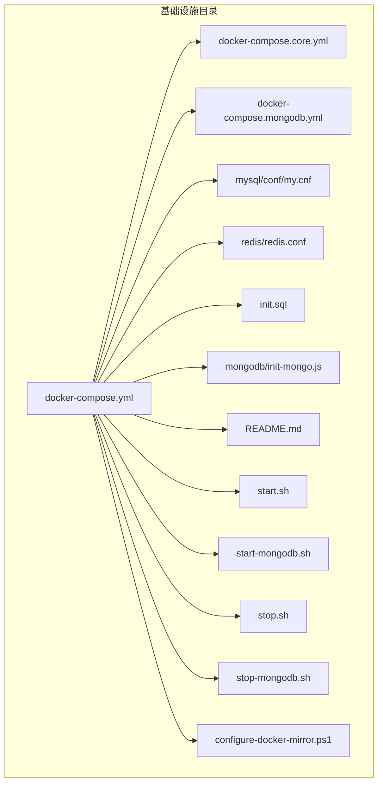
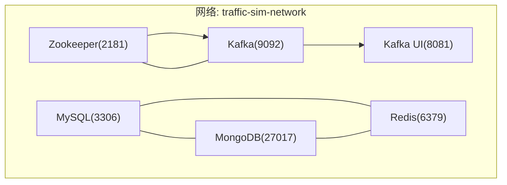
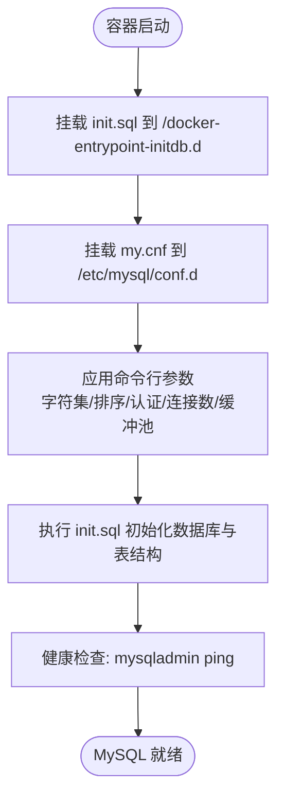
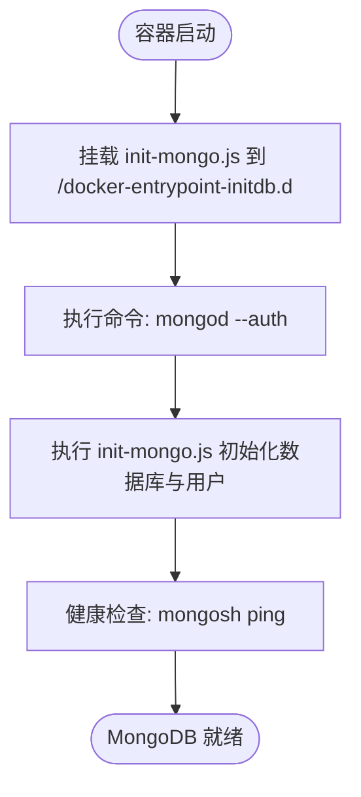
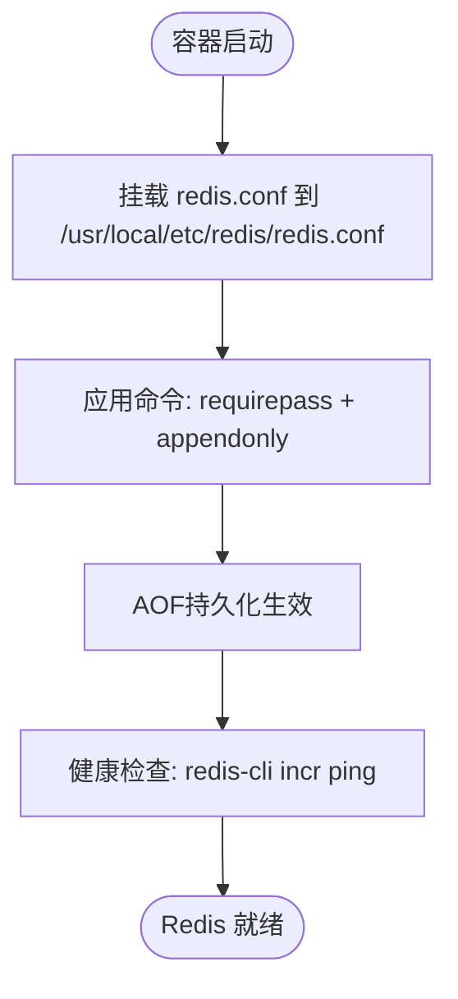
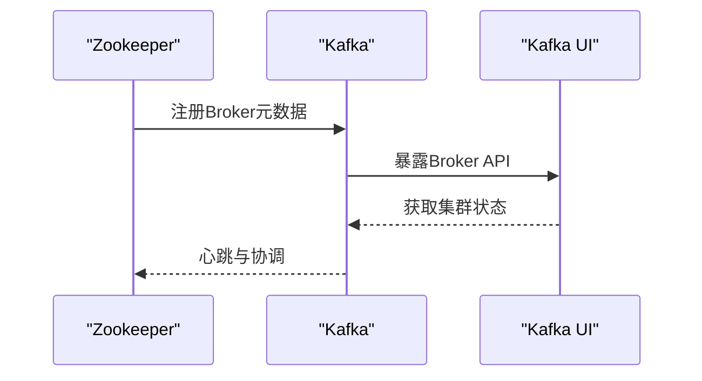
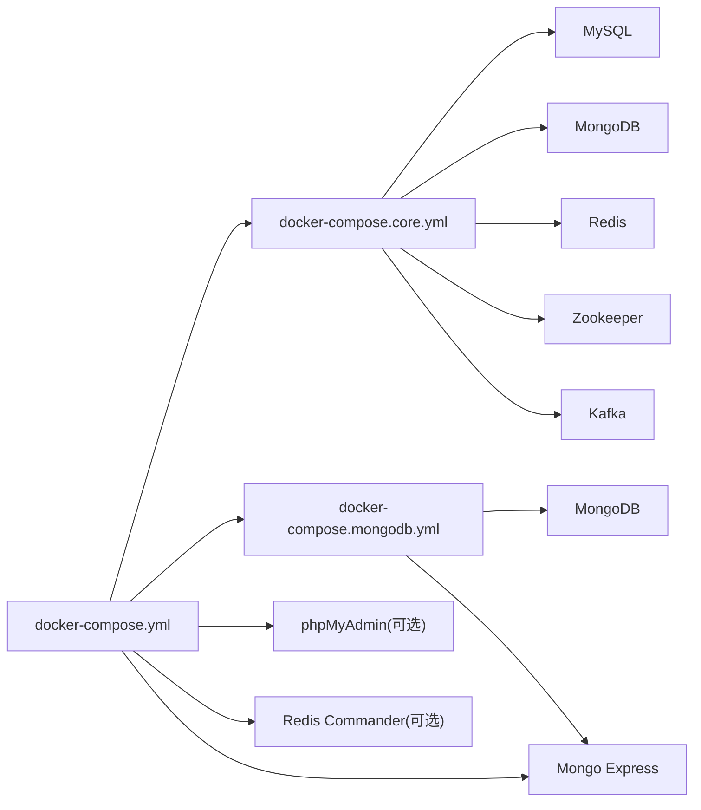
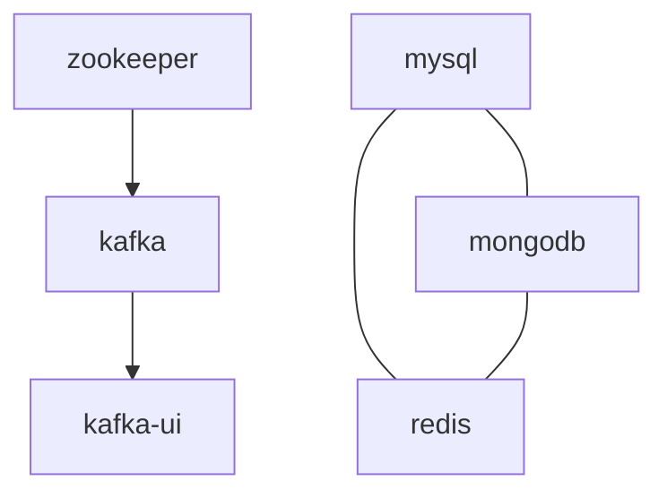

# Docker配置

<cite>
**本文引用的文件**
- [docker-compose.yml](file://infrastructure/docker-compose.yml)
- [docker-compose.core.yml](file://infrastructure/docker-compose.core.yml)
- [docker-compose.mongodb.yml](file://infrastructure/docker-compose.mongodb.yml)
- [my.cnf](file://infrastructure/mysql/conf/my.cnf)
- [redis.conf](file://infrastructure/redis/redis.conf)
- [init-mongo.js](file://infrastructure/mongodb/init-mongo.js)
- [init.sql](file://infrastructure/init.sql)
- [README.md](file://infrastructure/README.md)
- [start.sh](file://infrastructure/start.sh)
- [start-mongodb.sh](file://infrastructure/start-mongodb.sh)
- [stop.sh](file://infrastructure/stop.sh)
- [stop-mongodb.sh](file://infrastructure/stop-mongodb.sh)
- [configure-docker-mirror.ps1](file://infrastructure/configure-docker-mirror.ps1)
</cite>

## 目录
1. [简介](#简介)
2. [项目结构](#项目结构)
3. [核心组件](#核心组件)
4. [架构总览](#架构总览)
5. [详细组件分析](#详细组件分析)
6. [依赖关系分析](#依赖关系分析)
7. [性能考量](#性能考量)
8. [故障排查指南](#故障排查指南)
9. [结论](#结论)
10. [附录](#附录)

## 简介
本文件面向Docker基础设施配置，围绕交通仿真系统的数据库与消息中间件服务，系统性解析以下内容：
- MySQL（字符集、时区、连接数、InnoDB参数、慢查询日志、二进制日志、初始化SQL）
- MongoDB（认证模式、初始化脚本、管理工具）
- Redis（持久化、密码配置、内存策略）
- Zookeeper/Kafka消息队列及其UI管理工具
- 服务间依赖关系、网络（bridge模式：traffic-sim-network）、数据卷（mysql_data、mongodb_data等）持久化策略
- 通过docker-compose.core.yml与docker-compose.mongodb.yml进行配置组合
- 自定义配置文件用途（my.cnf、redis.conf）与初始化脚本（init-mongo.js）
- 镜像加速（DaoCloud）、健康检查机制与容器重启策略的最佳实践

## 项目结构
基础设施相关文件集中在infrastructure目录，包含主配置、分模块配置、各服务的自定义配置与初始化脚本，以及便捷的启动/停止脚本与镜像加速配置脚本。

**图表来源**
- [docker-compose.yml](file://infrastructure/docker-compose.yml#L1-L253)
- [docker-compose.core.yml](file://infrastructure/docker-compose.core.yml#L1-L168)
- [docker-compose.mongodb.yml](file://infrastructure/docker-compose.mongodb.yml#L1-L73)

**章节来源**
- [README.md](file://infrastructure/README.md#L1-L488)

## 核心组件
- MySQL 8.0：字符集utf8mb4、时区Asia/Shanghai、最大连接1000、InnoDB缓冲池512M；通过init.sql初始化数据库与表结构，并挂载my.cnf覆盖默认配置。
- MongoDB 7.0：启用认证（mongod --auth），初始化脚本创建数据库与用户，提供Mongo Express管理界面。
- Redis 7.2：开启AOF持久化、密码认证、最大内存512MB、LRU淘汰策略。
- Zookeeper 7.5.0 + Kafka 7.5.0：Zookeeper作为Kafka元数据存储，Kafka提供消息队列能力，附带Kafka UI管理工具。
- 网络：统一使用bridge网络traffic-sim-network，便于服务间通信。
- 数据卷：mysql_data、mongodb_data、mongodb_config、redis_data、zookeeper_data、zookeeper_logs、kafka_data，确保数据持久化。

**章节来源**
- [docker-compose.yml](file://infrastructure/docker-compose.yml#L7-L37)
- [docker-compose.yml](file://infrastructure/docker-compose.yml#L42-L66)
- [docker-compose.yml](file://infrastructure/docker-compose.yml#L71-L89)
- [docker-compose.yml](file://infrastructure/docker-compose.yml#L94-L142)
- [docker-compose.yml](file://infrastructure/docker-compose.yml#L229-L251)

## 架构总览
下图展示服务间的依赖与网络拓扑：Kafka依赖Zookeeper；Kafka UI依赖Kafka；MySQL/MongoDB/Redis/Zookeeper/Kafka均加入同一bridge网络，实现容器间互通。

**图表来源**
- [docker-compose.yml](file://infrastructure/docker-compose.yml#L31-L32)
- [docker-compose.yml](file://infrastructure/docker-compose.yml#L60-L61)
- [docker-compose.yml](file://infrastructure/docker-compose.yml#L83-L84)
- [docker-compose.yml](file://infrastructure/docker-compose.yml#L108-L109)
- [docker-compose.yml](file://infrastructure/docker-compose.yml#L136-L137)
- [docker-compose.yml](file://infrastructure/docker-compose.yml#L161-L162)

## 详细组件分析

### MySQL 组件分析
- 镜像与端口映射：使用DaoCloud镜像加速，暴露3306端口。
- 环境变量：设置根密码、数据库名、普通用户及密码、时区。
- 数据卷：挂载mysql_data到/var/lib/mysql，挂载init.sql与my.cnf。
- 命令行参数：设置字符集、排序规则、认证插件、最大连接数、InnoDB缓冲池大小。
- 健康检查：通过mysqladmin ping检测本地可达性。
- 初始化SQL：创建数据库traffic_sim，建表（用户、角色、权限、地图、仿真任务、回放任务），插入默认角色与权限。

**图表来源**
- [docker-compose.yml](file://infrastructure/docker-compose.yml#L21-L24)
- [docker-compose.yml](file://infrastructure/docker-compose.yml#L25-L29)
- [init.sql](file://infrastructure/init.sql#L1-L208)
- [my.cnf](file://infrastructure/mysql/conf/my.cnf#L1-L39)

**章节来源**
- [docker-compose.yml](file://infrastructure/docker-compose.yml#L7-L37)
- [init.sql](file://infrastructure/init.sql#L14-L202)
- [my.cnf](file://infrastructure/mysql/conf/my.cnf#L1-L39)

### MongoDB 组件分析
- 镜像与平台：使用mongo:7.0，linux/amd64平台。
- 环境变量：设置root用户名/密码、初始化数据库名、时区。
- 数据卷：挂载mongodb_data与mongodb_config，挂载init-mongo.js到/docker-entrypoint-initdb.d。
- 命令：mongod --auth启用认证。
- 健康检查：通过mongosh执行ping命令。
- 初始化脚本：创建traffic_sim数据库与traffic_sim用户，创建maps/simulation_data/replay_data集合。

**图表来源**
- [docker-compose.yml](file://infrastructure/docker-compose.yml#L55-L58)
- [docker-compose.yml](file://infrastructure/docker-compose.yml#L59)
- [init-mongo.js](file://infrastructure/mongodb/init-mongo.js#L1-L25)

**章节来源**
- [docker-compose.yml](file://infrastructure/docker-compose.yml#L42-L66)
- [init-mongo.js](file://infrastructure/mongodb/init-mongo.js#L4-L23)

### Redis 组件分析
- 镜像与端口映射：使用DaoCloud镜像加速，暴露6379端口。
- 命令：redis-server --requirepass redis123 --appendonly yes启用密码与AOF持久化。
- 数据卷：挂载redis_data，挂载redis.conf。
- 健康检查：通过redis-cli执行自增测试。
- 配置要点：绑定0.0.0.0、端口6379、密码redis123、AOF每秒同步、最大内存512MB、LRU淘汰策略。

**图表来源**
- [docker-compose.yml](file://infrastructure/docker-compose.yml#L77-L82)
- [redis.conf](file://infrastructure/redis/redis.conf#L1-L31)

**章节来源**
- [docker-compose.yml](file://infrastructure/docker-compose.yml#L71-L89)
- [redis.conf](file://infrastructure/redis/redis.conf#L9-L23)

### Zookeeper/Kafka 组件分析
- Zookeeper：暴露2181端口，挂载数据与日志卷，健康检查通过nc检测端口。
- Kafka：依赖Zookeeper，暴露9092端口，挂载数据卷，健康检查通过kafka-broker-api-versions验证。
- Kafka UI：依赖Kafka，暴露8080端口，配置本地集群连接信息。

**图表来源**
- [docker-compose.yml](file://infrastructure/docker-compose.yml#L94-L114)
- [docker-compose.yml](file://infrastructure/docker-compose.yml#L116-L142)
- [docker-compose.yml](file://infrastructure/docker-compose.yml#L147-L162)

**章节来源**
- [docker-compose.yml](file://infrastructure/docker-compose.yml#L94-L142)

### 配置组合与独立部署
- docker-compose.core.yml：仅包含核心服务（MySQL、MongoDB、Redis、Zookeeper、Kafka），适合镜像拉取受限场景。
- docker-compose.mongodb.yml：仅包含MongoDB与Mongo Express，适用于宿主机已有MySQL的情况。
- docker-compose.yml：包含上述核心服务与可选管理工具（phpMyAdmin、Redis Commander、Mongo Express等）。

**图表来源**
- [docker-compose.core.yml](file://infrastructure/docker-compose.core.yml#L6-L140)
- [docker-compose.mongodb.yml](file://infrastructure/docker-compose.mongodb.yml#L7-L54)
- [docker-compose.yml](file://infrastructure/docker-compose.yml#L147-L224)

**章节来源**
- [docker-compose.core.yml](file://infrastructure/docker-compose.core.yml#L1-L168)
- [docker-compose.mongodb.yml](file://infrastructure/docker-compose.mongodb.yml#L1-L73)
- [docker-compose.yml](file://infrastructure/docker-compose.yml#L1-L253)

## 依赖关系分析
- 服务依赖
  - kafka依赖zookeeper（depends_on: zookeeper）
  - kafka-ui依赖kafka（depends_on: kafka）
  - 其他服务无显式依赖，但共享同一bridge网络
- 网络
  - 所有服务加入traffic-sim-network，使用bridge驱动，容器间可通过服务名互访
- 数据卷
  - 每个服务的数据目录映射到独立卷，避免容器删除导致数据丢失

**图表来源**
- [docker-compose.yml](file://infrastructure/docker-compose.yml#L121-L122)
- [docker-compose.yml](file://infrastructure/docker-compose.yml#L152-L153)
- [docker-compose.yml](file://infrastructure/docker-compose.yml#L31-L32)
- [docker-compose.yml](file://infrastructure/docker-compose.yml#L60-L61)
- [docker-compose.yml](file://infrastructure/docker-compose.yml#L83-L84)

**章节来源**
- [docker-compose.yml](file://infrastructure/docker-compose.yml#L121-L153)
- [docker-compose.yml](file://infrastructure/docker-compose.yml#L248-L251)

## 性能考量
- MySQL
  - 字符集与排序规则：utf8mb4_unicode_ci，满足多语言与表情符号存储需求
  - 连接数：max_connections=1000，适合中高并发场景
  - InnoDB：缓冲池512M，日志文件256M，刷盘策略O_DIRECT，降低I/O延迟
  - 慢查询日志：开启，阈值2秒，便于定位性能瓶颈
  - 二进制日志：ROW格式，便于增量备份与复制
- Redis
  - AOF每秒刷盘，兼顾可靠性与性能
  - 最大内存512MB，LRU淘汰策略，适合缓存场景
- Kafka
  - 单节点副本因子1，适合开发测试；生产需调整为更高副本
  - 自动创建主题，简化开发流程

**章节来源**
- [my.cnf](file://infrastructure/mysql/conf/my.cnf#L3-L31)
- [redis.conf](file://infrastructure/redis/redis.conf#L12-L23)
- [docker-compose.yml](file://infrastructure/docker-compose.yml#L124-L130)

## 故障排查指南
- MySQL无法连接
  - 检查容器状态与端口占用
  - 核对密码与时区设置
- MongoDB认证失败
  - 确认authentication-database为admin
  - 检查init-mongo.js是否成功创建用户
- Redis连接失败
  - 校验密码redis123
  - 使用redis-cli测试连接
- Kafka无法启动
  - 确保Zookeeper先于Kafka启动
  - 检查端口9092占用情况
- 镜像拉取失败
  - 使用DaoCloud镜像或配置Docker镜像加速
  - 运行configure-docker-mirror.ps1进行连通性测试

**章节来源**
- [README.md](file://infrastructure/README.md#L445-L471)
- [configure-docker-mirror.ps1](file://infrastructure/configure-docker-mirror.ps1#L69-L103)

## 结论
本Docker配置以“可组合、可扩展、易维护”为目标，通过核心配置与模块化组合，满足不同部署场景的需求。MySQL、MongoDB、Redis、Zookeeper/Kafka的健康检查与持久化策略，配合bridge网络与独立数据卷，确保了开发与测试环境的稳定性与可恢复性。建议在生产环境中进一步强化安全（密码、网络、TLS）与备份策略。

## 附录

### 部署与运维脚本
- 启动所有服务：start.sh
- 单独启动MongoDB：start-mongodb.sh
- 停止服务：stop.sh / stop-mongodb.sh
- 镜像加速配置：configure-docker-mirror.ps1

**章节来源**
- [start.sh](file://infrastructure/start.sh#L1-L59)
- [start-mongodb.sh](file://infrastructure/start-mongodb.sh#L1-L63)
- [stop.sh](file://infrastructure/stop.sh#L1-L21)
- [stop-mongodb.sh](file://infrastructure/stop-mongodb.sh#L1-L23)
- [configure-docker-mirror.ps1](file://infrastructure/configure-docker-mirror.ps1#L1-L105)

### 配置文件与初始化脚本
- MySQL自定义配置：my.cnf
- Redis自定义配置：redis.conf
- MongoDB初始化脚本：init-mongo.js
- MySQL初始化SQL：init.sql

**章节来源**
- [my.cnf](file://infrastructure/mysql/conf/my.cnf#L1-L39)
- [redis.conf](file://infrastructure/redis/redis.conf#L1-L31)
- [init-mongo.js](file://infrastructure/mongodb/init-mongo.js#L1-L25)
- [init.sql](file://infrastructure/init.sql#L1-L208)