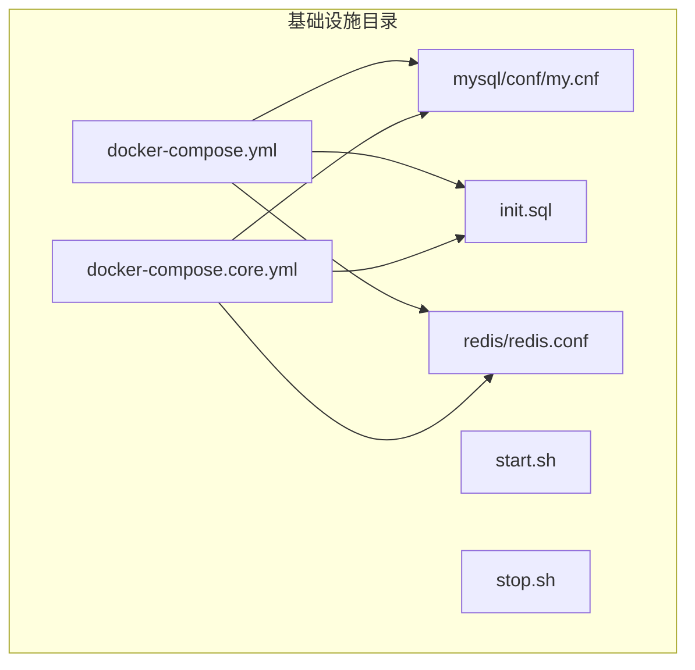
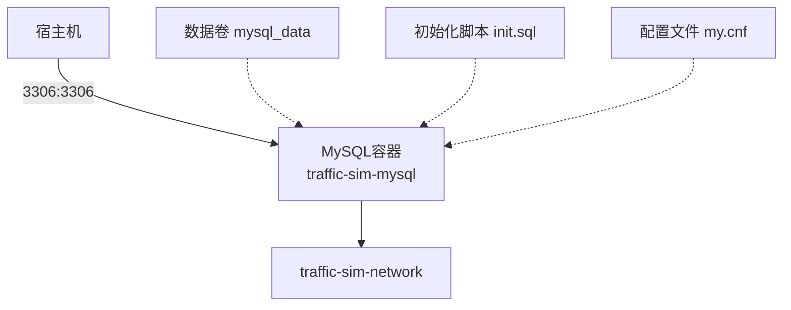
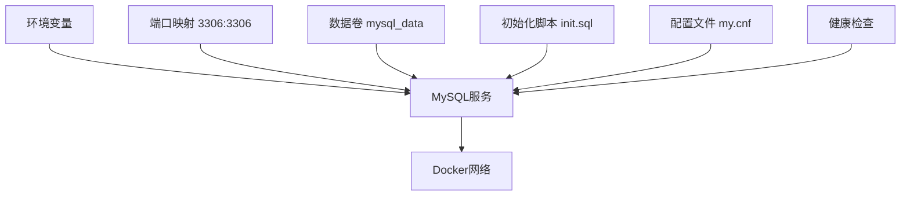

# MySQL配置

<cite>
**本文引用的文件**
- [docker-compose.yml](file://infrastructure/docker-compose.yml)
- [docker-compose.core.yml](file://infrastructure/docker-compose.core.yml)
- [my.cnf](file://infrastructure/mysql/conf/my.cnf)
- [init.sql](file://infrastructure/init.sql)
- [start.sh](file://infrastructure/start.sh)
- [stop.sh](file://infrastructure/stop.sh)
- [README.md](file://infrastructure/README.md)
- [redis.conf](file://infrastructure/redis/redis.conf)
</cite>

## 目录
1. [简介](#简介)
2. [项目结构](#项目结构)
3. [核心组件](#核心组件)
4. [架构概览](#架构概览)
5. [详细组件分析](#详细组件分析)
6. [依赖关系分析](#依赖关系分析)
7. [性能考量](#性能考量)
8. [故障排查指南](#故障排查指南)
9. [结论](#结论)
10. [附录](#附录)

## 简介
本文件提供MySQL服务在Docker环境下的完整部署与调优方案。重点覆盖docker-compose.yml中MySQL服务的镜像选择、容器命名、重启策略、环境变量配置、端口映射、数据卷挂载、自定义配置文件、健康检查机制，以及初始化脚本的编写规范与执行时机。同时给出连接测试方法、常见错误排查与性能优化建议。

## 项目结构
基础设施相关文件集中在infrastructure目录，其中：
- docker-compose.yml：主编排文件，包含MySQL、MongoDB、Redis、Kafka等服务
- docker-compose.core.yml：核心服务编排（MySQL、MongoDB、Redis、Kafka、Zookeeper）
- mysql/conf/my.cnf：MySQL自定义配置文件
- init.sql：数据库初始化脚本
- start.sh/stop.sh：启动/停止脚本
- redis/redis.conf：Redis配置文件

**图表来源**
- [docker-compose.yml](file://infrastructure/docker-compose.yml#L1-L253)
- [docker-compose.core.yml](file://infrastructure/docker-compose.core.yml#L1-L168)
- [my.cnf](file://infrastructure/mysql/conf/my.cnf#L1-L39)
- [init.sql](file://infrastructure/init.sql#L1-L208)
- [redis.conf](file://infrastructure/redis/redis.conf#L1-L31)

**章节来源**
- [docker-compose.yml](file://infrastructure/docker-compose.yml#L1-L253)
- [docker-compose.core.yml](file://infrastructure/docker-compose.core.yml#L1-L168)
- [README.md](file://infrastructure/README.md#L1-L488)

## 核心组件
- MySQL服务容器：基于mysql:8.0镜像，容器名为traffic-sim-mysql
- 环境变量：MYSQL_ROOT_PASSWORD、MYSQL_DATABASE、MYSQL_USER、MYSQL_PASSWORD、TZ
- 端口映射：3306:3306（宿主到容器）
- 数据卷：mysql_data（持久化）、init.sql挂载（初始化脚本）、mysql/conf挂载（自定义配置）
- 健康检查：每10秒执行一次mysqladmin ping，超时5秒，重试5次
- 命令行参数：字符集、排序规则、认证插件、最大连接数、InnoDB缓冲池大小

**章节来源**
- [docker-compose.yml](file://infrastructure/docker-compose.yml#L7-L38)
- [docker-compose.core.yml](file://infrastructure/docker-compose.core.yml#L10-L38)

## 架构概览
MySQL服务在Docker网络中运行，通过端口映射对外提供服务，使用数据卷持久化数据，并通过健康检查保障可用性。

**图表来源**
- [docker-compose.yml](file://infrastructure/docker-compose.yml#L7-L38)
- [docker-compose.core.yml](file://infrastructure/docker-compose.core.yml#L10-L38)

## 详细组件分析

### Docker Compose中的MySQL服务配置
- 镜像选择：mysql:8.0（国内镜像加速）
- 容器命名：traffic-sim-mysql
- 重启策略：unless-stopped（除非手动停止，否则容器异常退出后自动重启）
- 环境变量：
  - MYSQL_ROOT_PASSWORD：root
  - MYSQL_DATABASE：traffic_sim
  - MYSQL_USER：traffic_sim
  - MYSQL_PASSWORD：traffic_sim
  - TZ：Asia/Shanghai
- 端口映射：3306:3306（宿主3306端口映射到容器3306端口）
- 数据卷：
  - mysql_data：持久化MySQL数据目录
  - ./init.sql：挂载到/docker-entrypoint-initdb.d/init.sql，容器首次初始化时自动执行
  - ./mysql/conf：挂载到/etc/mysql/conf.d，加载自定义配置
- 命令行参数：
  - character-set-server=utf8mb4
  - collation-server=utf8mb4_unicode_ci
  - default-authentication-plugin=mysql_native_password
  - max_connections=1000
  - innodb_buffer_pool_size=512M
- 健康检查：使用mysqladmin ping检测本地连接，间隔10秒，超时5秒，最多重试5次

安全注意事项：
- 端口映射将MySQL暴露给宿主机，生产环境应限制访问来源或使用防火墙
- 默认密码仅为开发用途，生产需修改
- 建议仅在内部网络访问，避免公网暴露

**章节来源**
- [docker-compose.yml](file://infrastructure/docker-compose.yml#L7-L38)
- [docker-compose.core.yml](file://infrastructure/docker-compose.core.yml#L10-L38)
- [README.md](file://infrastructure/README.md#L377-L402)

### 端口映射3306:3306的作用机制与安全考虑
- 作用机制：将宿主机的3306端口转发到容器内的3306端口，允许外部客户端通过localhost:3306连接MySQL
- 安全考虑：
  - 仅在开发环境使用此映射
  - 生产环境建议移除端口映射，通过应用服务器或专用网关访问
  - 使用防火墙限制来源IP
  - 配置SSL/TLS加密通信

**章节来源**
- [docker-compose.yml](file://infrastructure/docker-compose.yml#L19-L20)
- [README.md](file://infrastructure/README.md#L388-L396)

### 数据卷挂载配置
- mysql_data卷：持久化/var/lib/mysql目录，确保容器重启或重建后数据不丢失
- ./init.sql挂载：容器首次初始化时自动执行，创建数据库和表结构
- ./mysql/conf挂载：加载自定义配置文件，覆盖默认配置

挂载模式差异：
- docker-compose.yml：init.sql和mysql/conf为读写挂载
- docker-compose.core.yml：init.sql和mysql/conf为只读挂载（:ro）

**章节来源**
- [docker-compose.yml](file://infrastructure/docker-compose.yml#L21-L24)
- [docker-compose.core.yml](file://infrastructure/docker-compose.core.yml#L22-L25)

### 自定义配置文件my.cnf的关键参数
- 字符集：utf8mb4及对应排序规则，支持完整的UTF-8字符集
- 时区：default-time-zone='+8:00'
- 连接数：max_connections=1000，max_connect_errors=1000
- InnoDB：缓冲池大小512M，日志文件大小256M，刷盘策略优化
- 慢查询日志：开启，阈值2秒，记录到/var/log/mysql/slow.log
- 二进制日志：开启ROW格式，自动清理7天前的日志
- 客户端/服务端字符集：统一使用utf8mb4

**章节来源**
- [my.cnf](file://infrastructure/mysql/conf/my.cnf#L1-L39)

### 健康检查机制
- 检测方式：使用mysqladmin ping对本地localhost进行连接检测
- 频率：每10秒一次
- 超时：5秒
- 重试次数：5次
- 故障恢复策略：容器异常退出后按unless-stopped策略自动重启

**章节来源**
- [docker-compose.yml](file://infrastructure/docker-compose.yml#L33-L37)
- [docker-compose.core.yml](file://infrastructure/docker-compose.core.yml#L34-L38)

### 初始化脚本init.sql的编写规范与执行时机
- 执行时机：容器首次初始化时自动执行（挂载到/docker-entrypoint-initdb.d/init.sql）
- 编写规范：
  - 显式设置字符集和外键约束开关
  - 使用UTF-8字符集和排序规则
  - 建表时指定引擎、字符集和排序规则
  - 使用唯一索引和合适的数据类型
  - 在脚本末尾恢复外键约束
- 包含对象：用户、角色、权限、地图、仿真任务、回放任务等表及初始数据

**章节来源**
- [init.sql](file://infrastructure/init.sql#L1-L208)
- [docker-compose.yml](file://infrastructure/docker-compose.yml#L23-L24)
- [docker-compose.core.yml](file://infrastructure/docker-compose.core.yml#L24-L25)

### 连接测试方法
- 使用命令行客户端连接：mysql -h localhost -P 3306 -u root -p
- 在应用中使用JDBC连接字符串：jdbc:mysql://localhost:3306/traffic_sim?useUnicode=true&characterEncoding=utf8&useSSL=false&serverTimezone=Asia/Shanghai&allowPublicKeyRetrieval=true
- 通过Docker进入容器内部测试：docker exec -it traffic-sim-mysql bash后执行mysql命令

**章节来源**
- [README.md](file://infrastructure/README.md#L403-L443)
- [start.sh](file://infrastructure/start.sh#L44-L47)

## 依赖关系分析
MySQL服务依赖于Docker网络、数据卷和配置文件，同时受环境变量和命令行参数影响。

**图表来源**
- [docker-compose.yml](file://infrastructure/docker-compose.yml#L13-L38)
- [docker-compose.core.yml](file://infrastructure/docker-compose.core.yml#L14-L38)

**章节来源**
- [docker-compose.yml](file://infrastructure/docker-compose.yml#L13-L38)
- [docker-compose.core.yml](file://infrastructure/docker-compose.core.yml#L14-L38)

## 性能考量
- 连接数限制：max_connections=1000，适合中等规模并发
- InnoDB缓冲池：512M，建议根据实际内存调整
- 慢查询日志：开启慢查询记录，便于性能分析
- 字符集：utf8mb4，支持完整UTF-8字符集，避免字符集转换开销
- 时区：Asia/Shanghai，减少时区转换成本

优化建议：
- 根据实际负载调整max_connections
- 监控InnoDB缓冲池命中率，必要时增大innodb_buffer_pool_size
- 定期分析慢查询日志，优化SQL语句
- 使用连接池管理数据库连接

**章节来源**
- [my.cnf](file://infrastructure/mysql/conf/my.cnf#L10-L17)
- [docker-compose.yml](file://infrastructure/docker-compose.yml#L29-L30)

## 故障排查指南
常见问题与解决方法：
- 连接被拒绝：检查容器状态、端口占用、防火墙设置
- 字符集不一致：确认客户端连接字符串中的字符集参数与服务器配置一致
- 认证失败：核对用户名、密码、时区设置
- 初始化失败：检查init.sql语法、字符集设置、外键约束开关

排查步骤：
- 查看容器状态：docker-compose ps
- 查看服务日志：docker-compose logs mysql
- 检查端口占用：netstat -an | grep 3306
- 进入容器内部测试：docker exec -it traffic-sim-mysql bash

**章节来源**
- [README.md](file://infrastructure/README.md#L445-L471)
- [start.sh](file://infrastructure/start.sh#L33-L38)

## 结论
本文档提供了MySQL在Docker环境下的完整部署与调优方案，包括镜像选择、容器配置、端口映射、数据持久化、自定义配置、健康检查、初始化脚本规范以及连接测试与故障排查方法。生产环境建议修改默认密码、限制网络访问、启用SSL/TLS并制定备份策略。

## 附录
- 启停脚本：start.sh用于一键启动所有服务；stop.sh用于停止服务
- Redis配置：参考redis.conf了解缓存服务配置要点
- 应用配置示例：application.yml中包含MySQL、MongoDB、Redis、Kafka的连接配置示例

**章节来源**
- [start.sh](file://infrastructure/start.sh#L1-L59)
- [stop.sh](file://infrastructure/stop.sh#L1-L21)
- [redis.conf](file://infrastructure/redis/redis.conf#L1-L31)
- [README.md](file://infrastructure/README.md#L403-L443)