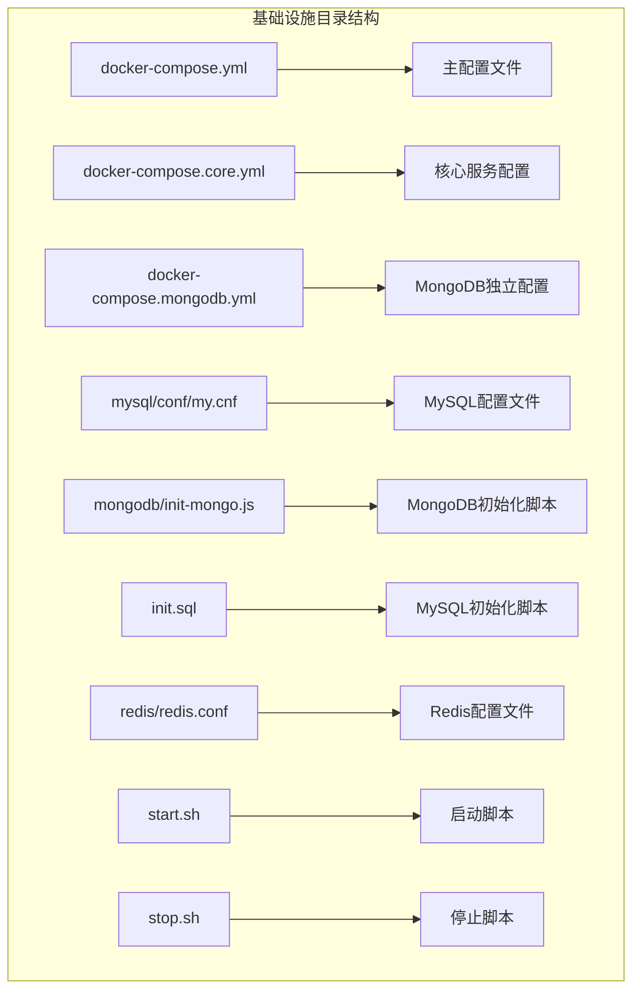
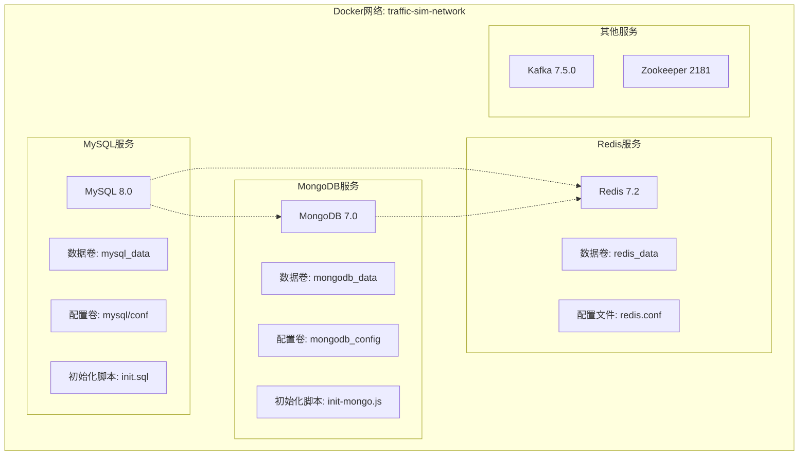
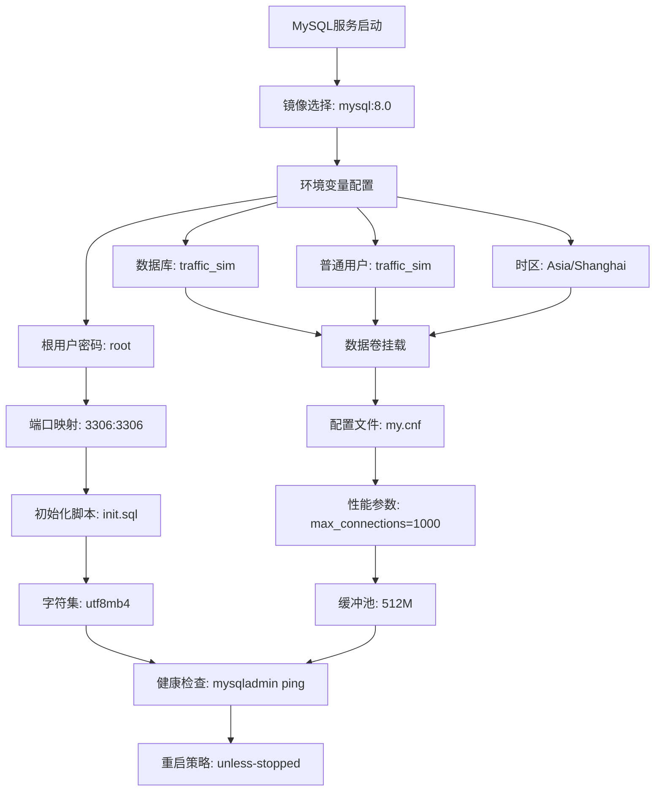
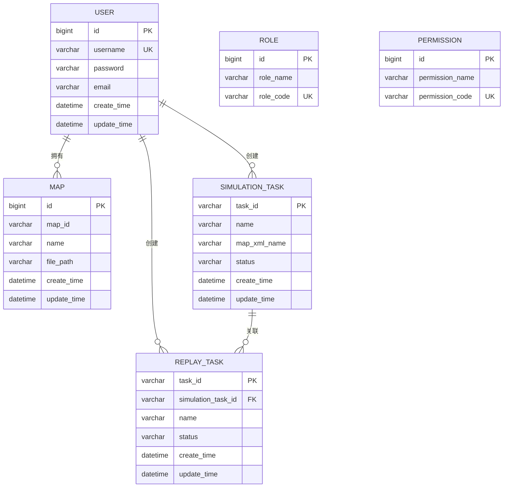
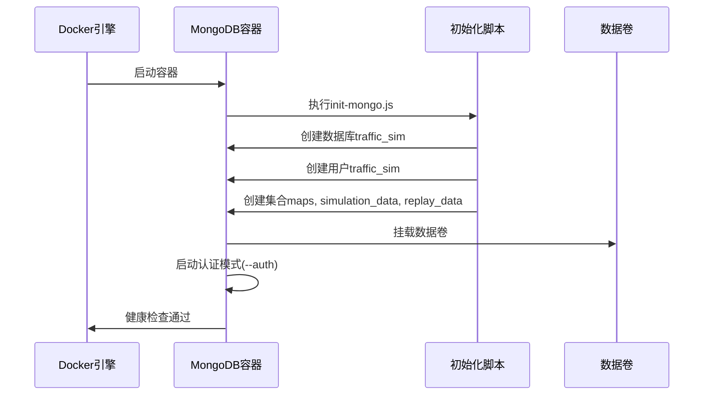
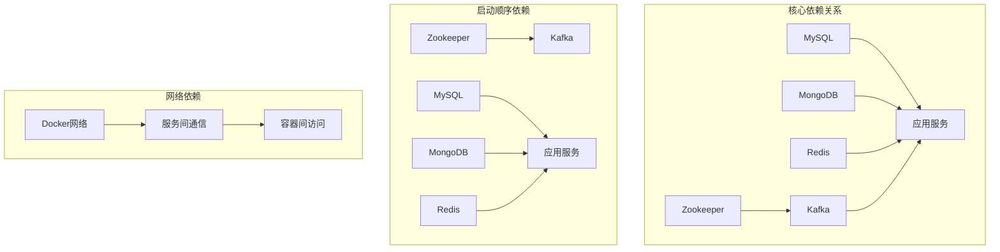

# 数据库服务配置

<cite>
**本文引用的文件**
- [docker-compose.yml](file://infrastructure/docker-compose.yml)
- [docker-compose.core.yml](file://infrastructure/docker-compose.core.yml)
- [docker-compose.mongodb.yml](file://infrastructure/docker-compose.mongodb.yml)
- [my.cnf](file://infrastructure/mysql/conf/my.cnf)
- [init-mongo.js](file://infrastructure/mongodb/init-mongo.js)
- [init.sql](file://infrastructure/init.sql)
- [redis.conf](file://infrastructure/redis/redis.conf)
- [README.md](file://infrastructure/README.md)
- [start.sh](file://infrastructure/start.sh)
- [stop.sh](file://infrastructure/stop.sh)
</cite>

## 目录
1. [简介](#简介)
2. [项目结构](#项目结构)
3. [核心组件](#核心组件)
4. [架构概览](#架构概览)
5. [详细组件分析](#详细组件分析)
6. [依赖关系分析](#依赖关系分析)
7. [性能考虑](#性能考虑)
8. [故障排查指南](#故障排查指南)
9. [结论](#结论)

## 简介

本文档深入解析交通仿真系统的数据库服务配置，重点覆盖MySQL和MongoDB的Docker配置实现。系统采用Docker Compose进行多服务编排，提供完整的数据库、缓存和消息队列基础设施。本文将详细说明各数据库服务的配置参数、初始化脚本、健康检查机制以及性能调优建议。

## 项目结构

基础设施配置位于`infrastructure`目录下，采用分层组织方式：



**图表来源**
- [docker-compose.yml](file://infrastructure/docker-compose.yml#L1-L253)
- [docker-compose.core.yml](file://infrastructure/docker-compose.core.yml#L1-L168)

**章节来源**
- [README.md](file://infrastructure/README.md#L1-L488)

## 核心组件

系统包含以下核心数据库组件：

### MySQL数据库服务
- **镜像版本**: MySQL 8.0（使用DaoCloud镜像加速）
- **容器名称**: traffic-sim-mysql
- **端口映射**: 3306:3306
- **数据持久化**: mysql_data卷
- **初始化脚本**: init.sql
- **字符集配置**: utf8mb4
- **性能参数**: max_connections=1000, innodb_buffer_pool_size=512M

### MongoDB数据库服务
- **镜像版本**: MongoDB 7.0
- **容器名称**: traffic-sim-mongodb
- **端口映射**: 27017:27017
- **认证模式**: --auth
- **数据持久化**: mongodb_data, mongodb_config卷
- **初始化脚本**: init-mongo.js

### Redis缓存服务
- **镜像版本**: Redis 7.2-alpine
- **容器名称**: traffic-sim-redis
- **端口映射**: 6379:6379
- **密码保护**: redis123
- **持久化**: AOF开启

**章节来源**
- [docker-compose.yml](file://infrastructure/docker-compose.yml#L7-L38)
- [docker-compose.core.yml](file://infrastructure/docker-compose.core.yml#L10-L38)

## 架构概览

系统采用微服务架构，数据库服务通过Docker网络进行通信：



**图表来源**
- [docker-compose.yml](file://infrastructure/docker-compose.yml#L248-L252)
- [docker-compose.core.yml](file://infrastructure/docker-compose.core.yml#L164-L168)

## 详细组件分析

### MySQL数据库配置分析

#### Docker Compose配置详解

MySQL服务配置包含多个关键参数：



**图表来源**
- [docker-compose.yml](file://infrastructure/docker-compose.yml#L7-L38)
- [my.cnf](file://infrastructure/mysql/conf/my.cnf#L1-L39)

#### MySQL配置文件分析

my.cnf配置文件包含以下关键设置：

| 配置类别 | 参数名称 | 值 | 说明 |
|---------|----------|----|------|
| 字符集 | character-set-server | utf8mb4 | 支持完整UTF-8字符 |
| 字符集 | collation-server | utf8mb4_unicode_ci | 排序规则 |
| 时区 | default-time-zone | +8:00 | 东八区 |
| 连接数 | max_connections | 1000 | 最大并发连接 |
| InnoDB | innodb_buffer_pool_size | 512M | 缓冲池大小 |
| 慢查询 | slow_query_log | 1 | 开启慢查询日志 |
| 二进制日志 | log-bin | mysql-bin | 二进制日志 |

#### 初始化SQL脚本分析

init.sql脚本创建完整的数据库结构：



**图表来源**
- [init.sql](file://infrastructure/init.sql#L24-L202)

**章节来源**
- [docker-compose.yml](file://infrastructure/docker-compose.yml#L13-L30)
- [my.cnf](file://infrastructure/mysql/conf/my.cnf#L1-L39)
- [init.sql](file://infrastructure/init.sql#L1-L208)

### MongoDB数据库配置分析

#### Docker Compose配置详解

MongoDB服务采用认证模式配置：



**图表来源**
- [docker-compose.yml](file://infrastructure/docker-compose.yml#L42-L66)
- [init-mongo.js](file://infrastructure/mongodb/init-mongo.js#L1-L25)

#### MongoDB初始化脚本分析

init-mongo.js脚本执行以下操作：

1. **数据库创建**: 切换到traffic_sim数据库
2. **用户创建**: 创建traffic_sim用户，授予readWrite权限
3. **集合创建**: 创建maps、simulation_data、replay_data集合

#### 认证配置分析

MongoDB采用双用户模式：
- **管理员用户**: root/root（admin数据库）
- **应用用户**: traffic_sim/traffic_sim（traffic_sim数据库）

**章节来源**
- [docker-compose.yml](file://infrastructure/docker-compose.yml#L48-L59)
- [init-mongo.js](file://infrastructure/mongodb/init-mongo.js#L4-L21)

### Redis配置分析

Redis作为缓存层提供高性能数据存储：

| 配置参数 | 值 | 说明 |
|---------|----|------|
| bind | 0.0.0.0 | 绑定所有接口 |
| port | 6379 | 默认端口 |
| requirepass | redis123 | 访问密码 |
| appendonly | yes | AOF持久化开启 |
| maxmemory | 512mb | 最大内存限制 |
| maxmemory-policy | allkeys-lru | 内存淘汰策略 |

**章节来源**
- [redis.conf](file://infrastructure/redis/redis.conf#L1-L31)

## 依赖关系分析

系统服务间存在明确的依赖关系：



**图表来源**
- [docker-compose.yml](file://infrastructure/docker-compose.yml#L121-L122)
- [docker-compose.core.yml](file://infrastructure/docker-compose.core.yml#L119-L120)

**章节来源**
- [docker-compose.yml](file://infrastructure/docker-compose.yml#L121-L122)
- [docker-compose.core.yml](file://infrastructure/docker-compose.core.yml#L119-L120)

## 性能考虑

### MySQL性能优化建议

1. **连接池配置**
   - 当前max_connections=1000，适合高并发场景
   - 建议根据实际负载调整，避免过度消耗内存

2. **缓冲池优化**
   - innodb_buffer_pool_size=512M，占物理内存的25-33%
   - 建议根据服务器内存调整至60-80%可用内存

3. **字符集优化**
   - 使用utf8mb4支持完整的UTF-8字符
   - 避免使用latin1导致的字符编码问题

4. **索引优化**
   - 用户表包含username唯一索引
   - 角色权限关联表建立复合索引
   - 地图表按owner_id、status、create_time建立索引

### MongoDB性能优化建议

1. **认证性能**
   - 启用--auth增加安全性但可能影响性能
   - 建议在生产环境中启用，开发环境可考虑关闭

2. **数据模型设计**
   - 使用ObjectId作为主键，支持分布式环境
   - 合理设计集合结构，避免过深嵌套

3. **索引策略**
   - 为常用查询字段建立索引
   - 考虑建立复合索引优化复杂查询

### Redis性能优化建议

1. **内存管理**
   - maxmemory=512MB，适合开发环境
   - 生产环境应根据数据量调整

2. **持久化策略**
   - AOF开启提供更好的数据安全
   - 建议结合RDB快照使用

3. **连接池**
   - 合理配置maxclients参数
   - 使用连接池减少连接开销

**章节来源**
- [my.cnf](file://infrastructure/mysql/conf/my.cnf#L9-L17)
- [redis.conf](file://infrastructure/redis/redis.conf#L21-L23)

## 故障排查指南

### MySQL常见问题

1. **连接失败排查**
   ```bash
   # 检查容器状态
   docker-compose ps
   
   # 查看MySQL日志
   docker-compose logs mysql
   
   # 检查端口占用
   netstat -an | grep 3306
   
   # 测试连接
   docker exec -it traffic-sim-mysql mysql -uroot -proot
   ```

2. **初始化失败处理**
   - 检查init.sql语法
   - 验证字符集设置
   - 确认数据卷权限

### MongoDB常见问题

1. **认证失败排查**
   ```bash
   # 检查认证配置
   docker-compose logs mongodb
   
   # 测试连接
   docker exec -it traffic-sim-mongodb mongosh -u root -p root --authenticationDatabase admin
   
   # 验证用户权限
   show users()
   ```

2. **初始化脚本问题**
   - 检查init-mongo.js语法
   - 验证数据库名称一致性
   - 确认集合创建权限

### Redis常见问题

1. **连接失败排查**
   ```bash
   # 检查Redis日志
   docker-compose logs redis
   
   # 测试连接
   docker exec -it traffic-sim-redis redis-cli -a redis123 ping
   
   # 检查密码配置
   cat /usr/local/etc/redis/redis.conf | grep requirepass
   ```

2. **内存不足问题**
   - 检查maxmemory配置
   - 监控内存使用情况
   - 调整内存淘汰策略

### Kafka集群问题

1. **Zookeeper依赖**
   - 确保Zookeeper先于Kafka启动
   - 检查2181端口连通性
   - 验证集群配置

2. **Broker启动失败**
   ```bash
   # 查看Kafka日志
   docker-compose logs kafka
   
   # 检查端口占用
   netstat -an | grep 9092
   
   # 测试Broker连接
   kafka-broker-api-versions --bootstrap-server localhost:9092
   ```

**章节来源**
- [README.md](file://infrastructure/README.md#L445-L471)
- [start.sh](file://infrastructure/start.sh#L1-L59)
- [stop.sh](file://infrastructure/stop.sh#L1-L21)

## 结论

本数据库服务配置提供了完整的开发环境基础设施，具有以下特点：

1. **完整的配置覆盖**: 包含MySQL、MongoDB、Redis等核心数据库服务
2. **生产就绪特性**: 包含健康检查、重启策略、数据持久化
3. **灵活的部署选项**: 提供完整版和核心版两种配置
4. **完善的初始化机制**: 自动化的数据库初始化脚本
5. **详细的故障排查**: 完善的问题诊断和解决指南

建议在生产环境中进一步加强安全配置，包括修改默认密码、启用SSL/TLS、配置防火墙规则等措施。同时根据实际业务需求调整性能参数，确保系统稳定高效运行。