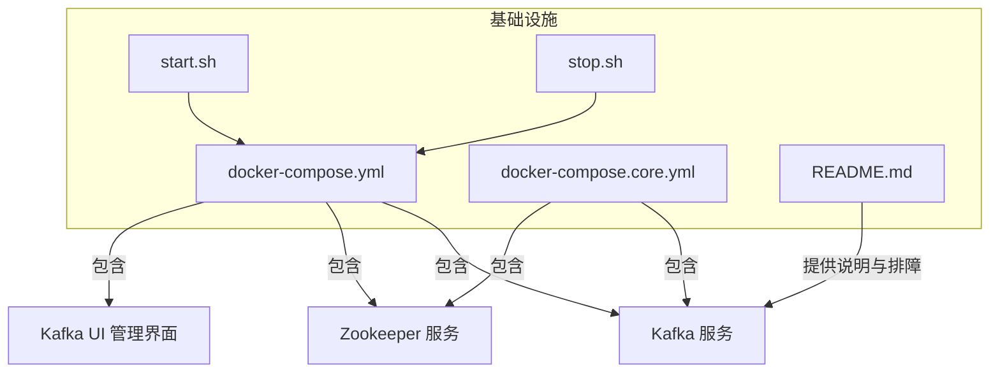
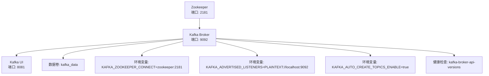
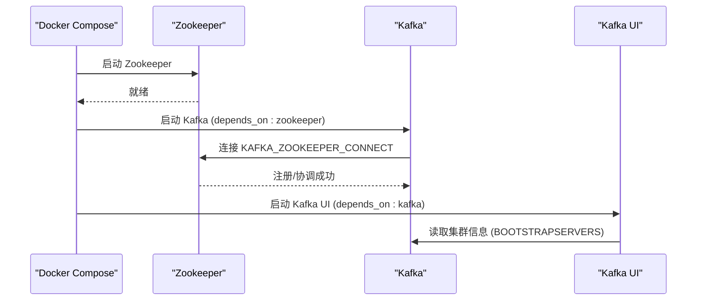

# Kafka配置

<cite>
**本文引用的文件**
- [docker-compose.yml](file://infrastructure/docker-compose.yml)
- [docker-compose.core.yml](file://infrastructure/docker-compose.core.yml)
- [README.md](file://infrastructure/README.md)
- [start.sh](file://infrastructure/start.sh)
- [stop.sh](file://infrastructure/stop.sh)
</cite>

## 目录
1. [简介](#简介)
2. [项目结构](#项目结构)
3. [核心组件](#核心组件)
4. [架构总览](#架构总览)
5. [详细组件分析](#详细组件分析)
6. [依赖关系分析](#依赖关系分析)
7. [性能考量](#性能考量)
8. [故障排查指南](#故障排查指南)
9. [结论](#结论)
10. [附录](#附录)

## 简介
本文件面向Kafka消息队列服务的配置与运维，聚焦于在本仓库中提供的两套Compose配置文件：完整版与核心版。重点解析Kafka服务在Compose中的定义、与Zookeeper的依赖关系（depends_on: zookeeper）、环境变量KAFKA_ZOOKEEPER_CONNECT的配置、KAFKA_ADVERTISED_LISTENERS在网络通信中的作用、KAFKA_AUTO_CREATE_TOPICS_ENABLE参数启用自动主题创建的功能、Kafka数据卷（kafka_data）的挂载以确保消息数据持久化，以及Kafka健康检查命令（kafka-broker-api-versions）的执行逻辑与超时重试策略。同时给出Kafka服务启动顺序要求（Zookeeper先于Kafka）、客户端连接测试方法，以及常见网络与配置问题的解决方案。

## 项目结构
Kafka相关配置位于基础设施目录，包含完整的Compose文件与核心Compose文件，并配套了启动脚本与故障排查文档。

图表来源
- [docker-compose.yml](file://infrastructure/docker-compose.yml#L116-L142)
- [docker-compose.core.yml](file://infrastructure/docker-compose.core.yml#L115-L141)
- [README.md](file://infrastructure/README.md#L229-L244)

章节来源
- [docker-compose.yml](file://infrastructure/docker-compose.yml#L116-L142)
- [docker-compose.core.yml](file://infrastructure/docker-compose.core.yml#L115-L141)
- [README.md](file://infrastructure/README.md#L229-L244)

## 核心组件
- Zookeeper：Kafka的元数据与协调服务，提供Broker注册、分区领导者选举等能力。
- Kafka：消息队列服务，负责主题、分区、副本与事务状态日志的管理。
- Kafka UI（可选）：Kafka管理界面，便于查看集群状态、主题与消费者组。

章节来源
- [docker-compose.yml](file://infrastructure/docker-compose.yml#L94-L115)
- [docker-compose.yml](file://infrastructure/docker-compose.yml#L116-L162)
- [docker-compose.core.yml](file://infrastructure/docker-compose.core.yml#L91-L111)
- [docker-compose.core.yml](file://infrastructure/docker-compose.core.yml#L115-L141)

## 架构总览
Kafka在Compose中通过depends_on确保Zookeeper先于Kafka启动；Kafka通过KAFKA_ZOOKEEPER_CONNECT指向Zookeeper；KAFKA_ADVERTISED_LISTENERS对外暴露访问地址；KAFKA_AUTO_CREATE_TOPICS_ENABLE开启自动主题创建；kafka_data卷实现数据持久化；健康检查通过kafka-broker-api-versions验证Broker可用性。

图表来源
- [docker-compose.yml](file://infrastructure/docker-compose.yml#L116-L142)
- [docker-compose.core.yml](file://infrastructure/docker-compose.core.yml#L115-L141)

## 详细组件分析

### Zookeeper 组件
- 角色：Kafka的协调与元数据存储。
- 端口映射：2181。
- 健康检查：通过本地端口探测确认可用性。
- 数据卷：zookeeper_data、zookeeper_logs。

章节来源
- [docker-compose.yml](file://infrastructure/docker-compose.yml#L94-L115)
- [docker-compose.core.yml](file://infrastructure/docker-compose.core.yml#L91-L111)

### Kafka 组件
- 镜像与版本：cp-kafka:7.5.0。
- 依赖：depends_on: zookeeper。
- 环境变量关键点：
  - KAFKA_ZOOKEEPER_CONNECT：指向zookeeper:2181。
  - KAFKA_ADVERTISED_LISTENERS：对外暴露为PLAINTEXT://localhost:9092。
  - KAFKA_AUTO_CREATE_TOPICS_ENABLE：启用自动创建主题。
  - 副本与事务相关参数：偏移主题复制因子、事务状态日志最小ISR与复制因子。
- 端口映射：9092。
- 数据卷：kafka_data。
- 健康检查：kafka-broker-api-versions --bootstrap-server localhost:9092，间隔30秒，超时10秒，重试5次。

章节来源
- [docker-compose.yml](file://infrastructure/docker-compose.yml#L116-L142)
- [docker-compose.core.yml](file://infrastructure/docker-compose.core.yml#L115-L141)

### Kafka UI 组件（可选）
- 镜像：provectuslabs/kafka-ui。
- 依赖：depends_on: kafka。
- 环境变量：设置本地集群名称、Bootstrap Servers与Zookeeper连接。
- 端口映射：8081。

章节来源
- [docker-compose.yml](file://infrastructure/docker-compose.yml#L147-L162)
- [docker-compose.core.yml](file://infrastructure/docker-compose.core.yml#L115-L141)

### 数据卷与网络
- 数据卷：kafka_data、zookeeper_data、zookeeper_logs等。
- 网络：bridge网络traffic-sim-network，容器间互通。

章节来源
- [docker-compose.yml](file://infrastructure/docker-compose.yml#L229-L251)
- [docker-compose.core.yml](file://infrastructure/docker-compose.core.yml#L145-L167)

## 依赖关系分析
- 启动顺序：Zookeeper先于Kafka启动，由depends_on保证。
- 通信链路：Kafka通过KAFKA_ZOOKEEPER_CONNECT连接Zookeeper；客户端通过KAFKA_ADVERTISED_LISTENERS暴露的地址访问Kafka。
- 管理工具：Kafka UI依赖Kafka服务，通过环境变量配置集群信息。

图表来源
- [docker-compose.yml](file://infrastructure/docker-compose.yml#L116-L162)
- [docker-compose.core.yml](file://infrastructure/docker-compose.core.yml#L115-L141)

## 性能考量
- 单节点副本因子与事务日志配置：在单节点环境下，副本因子与事务日志复制因子设为1，简化部署但不适用于高可用场景。
- 自动创建主题：KAFKA_AUTO_CREATE_TOPICS_ENABLE开启后，首次写入将自动创建主题，降低运维复杂度，但需注意命名规范与配额控制。
- 健康检查周期：30秒一次，适合开发环境；生产环境建议结合更严格的监控与告警策略。

章节来源
- [docker-compose.yml](file://infrastructure/docker-compose.yml#L123-L130)
- [docker-compose.core.yml](file://infrastructure/docker-compose.core.yml#L121-L129)

## 故障排查指南
- 启动顺序问题
  - 现象：Kafka启动失败或报Zookeeper不可达。
  - 排查：确认Zookeeper先于Kafka启动；查看Kafka日志定位连接错误。
  - 参考：基础设施文档中的“Kafka 无法启动”条目。
- 监听器配置错误
  - 现象：客户端无法连接或返回连接失败。
  - 排查：核对KAFKA_ADVERTISED_LISTENERS是否与客户端访问地址一致；若容器外访问，确保端口映射与网络可达。
- Zookeeper连接超时
  - 现象：Kafka启动阶段卡住或反复重启。
  - 排查：检查Zookeeper健康状态、端口占用与网络连通性；确认KAFKA_ZOOKEEPER_CONNECT值正确。
- 端口冲突
  - 现象：Kafka端口9092被占用导致启动失败。
  - 排查：检查宿主机端口占用并调整映射或释放端口。
- 健康检查失败
  - 现象：容器健康状态异常。
  - 排查：查看健康检查命令输出与Kafka日志；确认kafka-broker-api-versions可用且Broker已就绪。

章节来源
- [README.md](file://infrastructure/README.md#L466-L471)

## 结论
本仓库提供了开箱即用的Kafka与Zookeeper组合配置，通过Compose的depends_on确保启动顺序，通过环境变量完成Zookeeper连接与对外监听器配置，并通过数据卷保障持久化。健康检查与可选的Kafka UI进一步提升了可观测性与易用性。对于生产环境，建议根据实际规模调整副本与事务配置、完善安全与监控策略，并进行充分的压测与演练。

## 附录

### Kafka服务启动顺序与客户端连接测试
- 启动顺序
  - 使用Compose启动时，Zookeeper先于Kafka启动；Kafka UI依赖Kafka。
- 客户端连接测试
  - 通过Kafka UI访问管理界面（端口8081）确认集群状态。
  - 在应用侧使用bootstrap-servers: localhost:9092进行连接测试。
- 启停脚本
  - 启动：进入infrastructure目录后执行启动脚本，等待服务状态显示正常。
  - 停止：使用停止脚本优雅关闭服务。

章节来源
- [docker-compose.yml](file://infrastructure/docker-compose.yml#L116-L162)
- [docker-compose.core.yml](file://infrastructure/docker-compose.core.yml#L115-L141)
- [README.md](file://infrastructure/README.md#L237-L244)
- [start.sh](file://infrastructure/start.sh#L24-L38)
- [stop.sh](file://infrastructure/stop.sh#L9-L11)