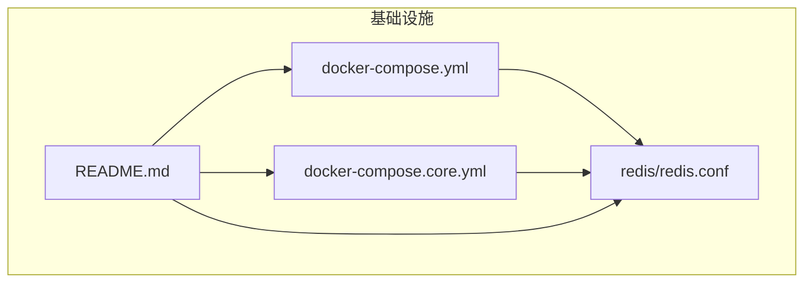
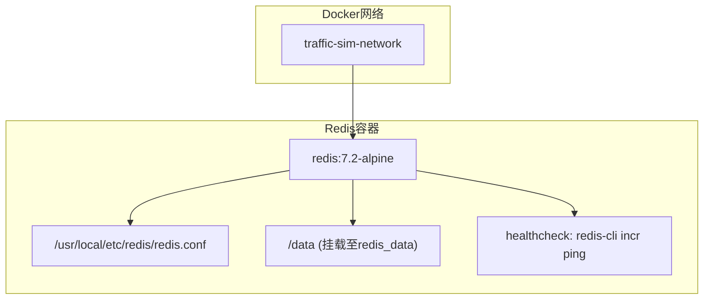
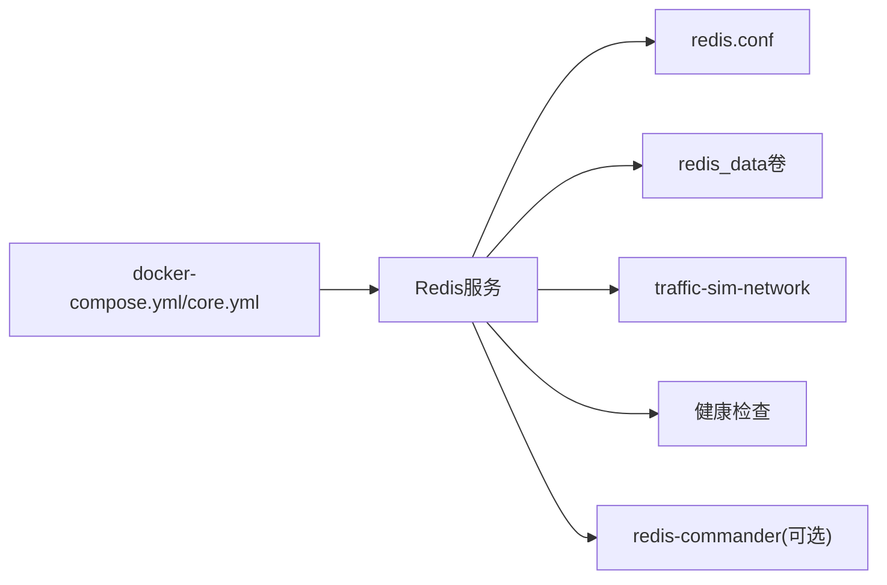

# Redis配置

<cite>
**本文引用的文件**
- [docker-compose.yml](file://infrastructure/docker-compose.yml)
- [docker-compose.core.yml](file://infrastructure/docker-compose.core.yml)
- [redis.conf](file://infrastructure/redis/redis.conf)
- [README.md](file://infrastructure/README.md)
</cite>

## 目录
1. [简介](#简介)
2. [项目结构](#项目结构)
3. [核心组件](#核心组件)
4. [架构总览](#架构总览)
5. [详细组件分析](#详细组件分析)
6. [依赖关系分析](#依赖关系分析)
7. [性能考虑](#性能考虑)
8. [故障排查指南](#故障排查指南)
9. [结论](#结论)
10. [附录](#附录)

## 简介
本文件面向Redis服务的配置与运维，基于仓库中的Docker Compose配置与自定义Redis配置文件，系统性解析Redis容器镜像、启动参数、持久化策略、数据卷挂载、健康检查以及连接测试方法。同时提供常见连接问题的排查步骤，并说明可选的Redis管理工具redis-commander的配置方式与环境变量格式。

## 项目结构
Redis相关配置位于基础设施目录下，核心文件包括：
- Docker Compose主配置与核心配置：定义Redis服务、端口映射、数据卷挂载、健康检查与启动命令
- 自定义Redis配置文件：覆盖默认行为，如绑定地址、端口、密码、持久化策略、内存限制与淘汰策略
- 项目文档：提供连接信息、管理工具、常用命令与故障排查

图表来源
- [docker-compose.yml](file://infrastructure/docker-compose.yml#L68-L90)
- [docker-compose.core.yml](file://infrastructure/docker-compose.core.yml#L68-L87)
- [redis.conf](file://infrastructure/redis/redis.conf#L1-L31)
- [README.md](file://infrastructure/README.md#L212-L228)

章节来源
- [docker-compose.yml](file://infrastructure/docker-compose.yml#L68-L90)
- [docker-compose.core.yml](file://infrastructure/docker-compose.core.yml#L68-L87)
- [redis.conf](file://infrastructure/redis/redis.conf#L1-L31)
- [README.md](file://infrastructure/README.md#L212-L228)

## 核心组件
- Redis容器服务：镜像版本为7.2-alpine，启动命令包含密码认证与AOF持久化开关
- 自定义配置文件：覆盖默认行为，包括绑定地址、端口、密码、RDB快照策略、AOF配置、最大内存与淘汰策略
- 数据卷挂载：将容器内数据目录挂载到本地卷，确保数据持久化
- 健康检查：通过redis-cli对ping键进行自增操作，验证服务可用性
- 可选管理工具：redis-commander，支持通过环境变量配置连接目标

章节来源
- [docker-compose.yml](file://infrastructure/docker-compose.yml#L71-L90)
- [docker-compose.core.yml](file://infrastructure/docker-compose.core.yml#L70-L87)
- [redis.conf](file://infrastructure/redis/redis.conf#L3-L23)
- [README.md](file://infrastructure/README.md#L226-L228)

## 架构总览
Redis服务在Docker容器中运行，通过Compose编排与其他服务共用同一网络。容器内的Redis进程由自定义配置文件驱动，持久化数据通过数据卷保存；健康检查周期性验证服务状态。

图表来源
- [docker-compose.yml](file://infrastructure/docker-compose.yml#L71-L90)
- [docker-compose.core.yml](file://infrastructure/docker-compose.core.yml#L70-L87)
- [redis.conf](file://infrastructure/redis/redis.conf#L1-L31)

## 详细组件分析

### Redis容器服务定义
- 镜像与版本：使用redis:7.2-alpine镜像，便于轻量部署
- 容器名称与重启策略：固定容器名与unless-stopped重启策略
- 启动命令：通过redis-server启动，设置密码认证与开启AOF持久化
- 端口映射：将容器6379端口映射到宿主机6379
- 数据卷挂载：挂载redis_data卷到容器内数据目录，实现持久化
- 网络：加入traffic-sim-network桥接网络
- 健康检查：使用redis-cli对ping键执行自增操作，周期性检测服务可用性

章节来源
- [docker-compose.yml](file://infrastructure/docker-compose.yml#L71-L90)
- [docker-compose.core.yml](file://infrastructure/docker-compose.core.yml#L70-L87)

### 自定义Redis配置文件内容
- 绑定地址：允许从任意IP访问（bind 0.0.0.0）
- 端口：监听6379端口
- 密码：requirepass设置为redis123
- RDB持久化策略：多条save规则，分别对应不同时间窗口与变更次数阈值
- AOF配置：开启appendonly与每秒同步策略
- 内存限制与淘汰策略：最大内存512MB，淘汰策略为allkeys-lru
- 日志级别与数据库数量：notice级别日志与16个逻辑数据库

章节来源
- [redis.conf](file://infrastructure/redis/redis.conf#L3-L23)

### 数据卷与持久化机制
- 数据卷名称：redis_data
- 挂载路径：容器内/data目录
- 作用：将Redis的数据文件（RDB快照与AOF文件）持久化到宿主机，避免容器删除导致数据丢失

章节来源
- [docker-compose.yml](file://infrastructure/docker-compose.yml#L80-L82)
- [docker-compose.core.yml](file://infrastructure/docker-compose.core.yml#L77-L79)
- [README.md](file://infrastructure/README.md#L276-L282)

### 健康检查工作原理
- 命令：redis-cli --raw incr ping
- 原理：对ping键执行自增操作，若返回数值则表示服务正常；异常时健康检查失败
- 配置：间隔10秒、超时3秒、重试5次

章节来源
- [docker-compose.yml](file://infrastructure/docker-compose.yml#L85-L89)
- [docker-compose.core.yml](file://infrastructure/docker-compose.core.yml#L82-L86)

### 可选管理工具：redis-commander
- 功能：提供Web界面管理Redis实例
- 配置：示例中通过环境变量REDIS_HOSTS指定连接目标
- 环境变量格式：local:redis:6379:0:redis123（名称:主机:端口:数据库:密码）
- 端口映射：示例中映射8082端口到容器8081

章节来源
- [docker-compose.yml](file://infrastructure/docker-compose.yml#L166-L180)
- [README.md](file://infrastructure/README.md#L226-L228)

## 依赖关系分析
Redis服务依赖于Docker Compose编排、自定义配置文件与数据卷。其与网络、健康检查、管理工具之间存在直接依赖关系。

图表来源
- [docker-compose.yml](file://infrastructure/docker-compose.yml#L68-L90)
- [docker-compose.core.yml](file://infrastructure/docker-compose.core.yml#L68-L87)
- [redis.conf](file://infrastructure/redis/redis.conf#L1-L31)

## 性能考虑
- 内存限制与淘汰策略：maxmemory 512MB与allkeys-lru策略有助于控制内存占用，避免OOM
- AOF同步策略：appendfsync everysec在可靠性与性能间取得平衡
- RDB快照策略：多级save规则降低数据丢失风险，同时减少写放大
- 网络与端口：仅开放必要端口，避免外部暴露带来的性能与安全风险

## 故障排查指南
- 认证失败
  - 确认客户端连接时携带正确的密码
  - 在容器内使用redis-cli -a redis123进行测试
- 网络不通
  - 检查容器是否运行、端口映射是否正确
  - 使用docker-compose logs redis查看错误日志
- 健康检查失败
  - 观察健康检查配置与日志输出
  - 确认容器内redis-cli可用且服务正常
- 数据丢失或未持久化
  - 检查数据卷挂载与redis_data卷状态
  - 确认AOF与RDB配置生效

章节来源
- [README.md](file://infrastructure/README.md#L460-L465)

## 结论
本配置将Redis以7.2-alpine镜像运行，结合自定义配置文件实现密码认证、AOF持久化与内存限制策略，并通过数据卷保障数据持久化。健康检查确保服务可用性，可选的redis-commander提供可视化管理能力。生产环境中建议进一步强化安全配置与监控告警。

## 附录

### Redis连接测试方法
- 使用容器内CLI：进入容器后执行带密码的redis-cli命令进行ping测试
- 使用宿主机CLI：通过本地redis-cli连接宿主机6379端口并输入密码
- 使用应用侧连接：在应用配置中设置host、port、password与数据库索引

章节来源
- [README.md](file://infrastructure/README.md#L324-L326)
- [README.md](file://infrastructure/README.md#L425-L433)

### 常见连接问题与排查步骤
- 密码错误：核对配置文件中的requirepass与客户端连接参数
- 端口占用：确认宿主机6379端口未被其他进程占用
- 容器未运行：使用docker-compose ps检查状态，必要时查看日志
- 网络隔离：确认容器加入traffic-sim-network且无防火墙阻断

章节来源
- [README.md](file://infrastructure/README.md#L460-L465)