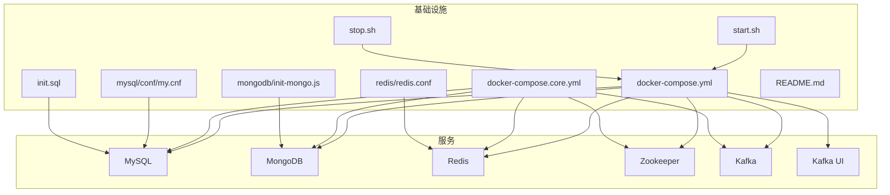
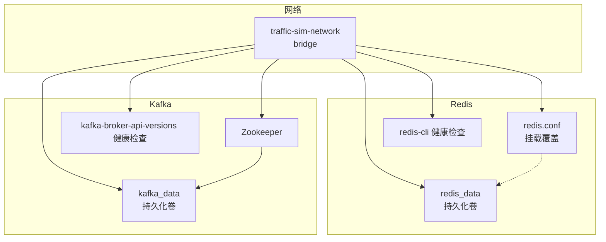
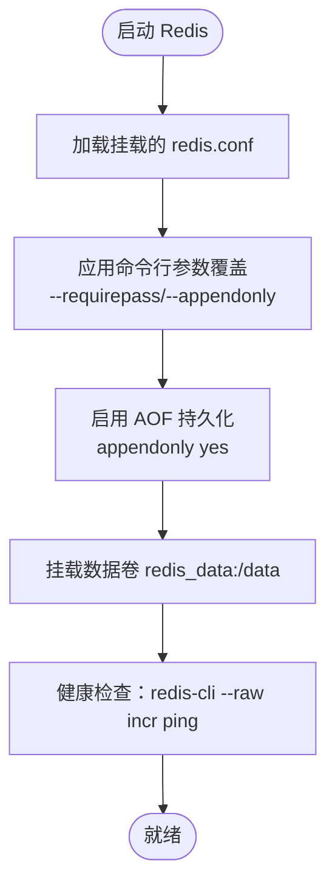
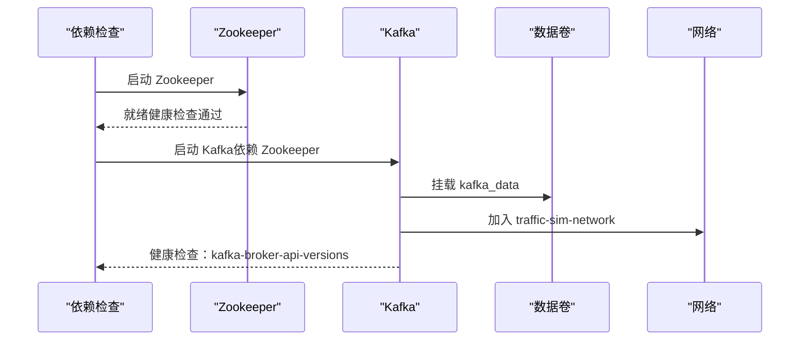
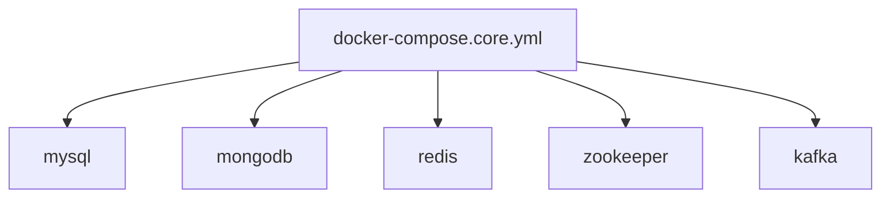
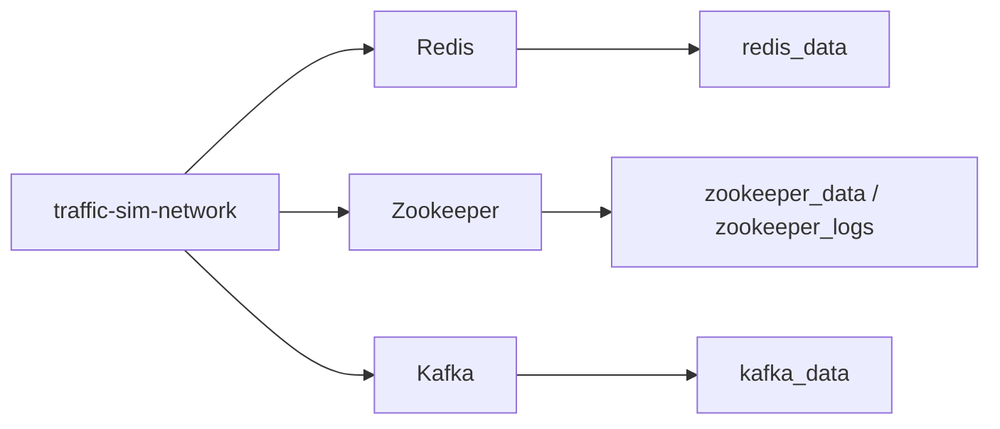

# 缓存与消息队列配置

<cite>
**本文引用的文件**
- [docker-compose.yml](file://infrastructure/docker-compose.yml)
- [docker-compose.core.yml](file://infrastructure/docker-compose.core.yml)
- [redis.conf](file://infrastructure/redis/redis.conf)
- [README.md](file://infrastructure/README.md)
- [start.sh](file://infrastructure/start.sh)
- [stop.sh](file://infrastructure/stop.sh)
- [application.yml](file://traffic-sim-server/src/main/resources/application.yml)
- [docker-compose.mongodb.yml](file://infrastructure/docker-compose.mongodb.yml)
- [my.cnf](file://infrastructure/mysql/conf/my.cnf)
- [init.sql](file://infrastructure/init.sql)
- [init-mongo.js](file://infrastructure/mongodb/init-mongo.js)
</cite>

## 目录
1. [简介](#简介)
2. [项目结构](#项目结构)
3. [核心组件](#核心组件)
4. [架构总览](#架构总览)
5. [详细组件分析](#详细组件分析)
6. [依赖关系分析](#依赖关系分析)
7. [性能考虑](#性能考虑)
8. [故障排查指南](#故障排查指南)
9. [结论](#结论)
10. [附录](#附录)

## 简介
本文件聚焦于缓存与消息队列服务的详细配置说明，围绕 Redis 与 Kafka 在本项目的 Docker Compose 中的配置展开，包括：
- Redis 密码认证、持久化策略、自定义配置文件挂载与覆盖机制、数据卷持久化方案
- Kafka 与 Zookeeper 的依赖关系、KAFKA_ADVERTISED_LISTENERS 网络配置、自动创建主题功能、数据卷管理
- docker-compose.core.yml 中消息队列核心服务的组合方式
- 健康检查配置、连接测试方法以及常见网络问题的解决方案

## 项目结构
基础设施相关配置集中在 infrastructure 目录，包含主配置文件、核心服务配置、各组件配置文件与启动脚本。

**图表来源**
- [docker-compose.yml](file://infrastructure/docker-compose.yml#L1-L253)
- [docker-compose.core.yml](file://infrastructure/docker-compose.core.yml#L1-L168)
- [redis.conf](file://infrastructure/redis/redis.conf#L1-L31)
- [my.cnf](file://infrastructure/mysql/conf/my.cnf#L1-L39)
- [init.sql](file://infrastructure/init.sql#L1-L208)
- [init-mongo.js](file://infrastructure/mongodb/init-mongo.js#L1-L25)
- [start.sh](file://infrastructure/start.sh#L1-L59)
- [stop.sh](file://infrastructure/stop.sh#L1-L21)

**章节来源**
- [docker-compose.yml](file://infrastructure/docker-compose.yml#L1-L253)
- [docker-compose.core.yml](file://infrastructure/docker-compose.core.yml#L1-L168)
- [README.md](file://infrastructure/README.md#L1-L488)

## 核心组件
- Redis 缓存服务：密码认证、AOF 持久化、自定义配置挂载、数据卷持久化
- Kafka 消息队列：依赖 Zookeeper、KAFKA_ADVERTISED_LISTENERS、自动创建主题、数据卷管理
- Zookeeper：Kafka 依赖的协调服务
- docker-compose.core.yml：核心服务组合（不含额外管理工具）

**章节来源**
- [docker-compose.yml](file://infrastructure/docker-compose.yml#L68-L142)
- [docker-compose.core.yml](file://infrastructure/docker-compose.core.yml#L67-L140)
- [redis.conf](file://infrastructure/redis/redis.conf#L1-L31)

## 架构总览
下图展示 Redis 与 Kafka 的服务关系、网络与数据卷布局，以及健康检查与端口映射。

**图表来源**
- [docker-compose.yml](file://infrastructure/docker-compose.yml#L68-L142)
- [docker-compose.core.yml](file://infrastructure/docker-compose.core.yml#L67-L140)
- [redis.conf](file://infrastructure/redis/redis.conf#L1-L31)

## 详细组件分析

### Redis 配置详解
- 密码认证
  - 命令行参数：--requirepass redis123
  - 配置文件：requirepass redis123
  - 管理工具连接示例：redis-cli -a redis123
- 持久化策略
  - AOF：appendonly yes；appendfsync everysec
  - RDB：save 900 1、save 300 10、save 60 10000
  - 最大内存与淘汰策略：maxmemory 512mb、maxmemory-policy allkeys-lru
- 自定义配置挂载与覆盖机制
  - 挂载路径：./redis/redis.conf:/usr/local/etc/redis/redis.conf
  - 命令行参数与配置文件共同生效，命令行参数优先级更高
- 数据卷持久化
  - 卷：redis_data:/data
  - 容器内数据目录：/data（AOF/RDB写入）
- 健康检查
  - 命令：redis-cli --raw incr ping
  - 间隔：10s，超时：3s，重试：5次
- 端口与网络
  - 映射：6379:6379
  - 网络：traffic-sim-network

**图表来源**
- [docker-compose.yml](file://infrastructure/docker-compose.yml#L68-L90)
- [redis.conf](file://infrastructure/redis/redis.conf#L1-L31)

**章节来源**
- [docker-compose.yml](file://infrastructure/docker-compose.yml#L68-L90)
- [redis.conf](file://infrastructure/redis/redis.conf#L1-L31)
- [README.md](file://infrastructure/README.md#L212-L228)

### Kafka 与 Zookeeper 配置详解
- Zookeeper 依赖
  - depends_on: zookeeper
  - 环境变量：ZOOKEEPER_CLIENT_PORT=2181、ZOOKEEPER_TICK_TIME=2000
  - 数据卷：zookeeper_data、zookeeper_logs
  - 健康检查：nc -z localhost 2181
- Kafka 与 Zookeeper 的关系
  - KAFKA_ZOOKEEPER_CONNECT: zookeeper:2181
  - Kafka 启动前需确保 Zookeeper 就绪
- KAFKA_ADVERTISED_LISTENERS 网络配置
  - PLAINTEXT://localhost:9092（本地访问）
  - 如需容器间访问，应改为容器内可解析的地址（例如 kafka:9092）
- 自动创建主题
  - KAFKA_AUTO_CREATE_TOPICS_ENABLE: "true"
  - 便于首次使用，生产环境建议关闭并显式管理主题
- 数据卷管理
  - 卷：kafka_data:/var/lib/kafka/data
  - 存储分区数据与日志
- 健康检查
  - kafka-broker-api-versions --bootstrap-server localhost:9092
  - 间隔：30s，超时：10s，重试：5次
- 端口与网络
  - 映射：9092:9092
  - 网络：traffic-sim-network

**图表来源**
- [docker-compose.yml](file://infrastructure/docker-compose.yml#L94-L142)
- [docker-compose.core.yml](file://infrastructure/docker-compose.core.yml#L88-L140)

**章节来源**
- [docker-compose.yml](file://infrastructure/docker-compose.yml#L94-L142)
- [docker-compose.core.yml](file://infrastructure/docker-compose.core.yml#L88-L140)
- [README.md](file://infrastructure/README.md#L229-L244)

### docker-compose.core.yml 中的消息队列核心服务组合
- 服务组成
  - mysql、mongodb（可选）
  - redis、zookeeper、kafka（核心）
- 关键点
  - 不包含 Kafka UI、Redis Commander 等管理工具
  - 适合镜像拉取受限或仅需核心服务的场景
  - 与完整版 compose 的网络、数据卷一致

**图表来源**
- [docker-compose.core.yml](file://infrastructure/docker-compose.core.yml#L6-L140)

**章节来源**
- [docker-compose.core.yml](file://infrastructure/docker-compose.core.yml#L1-L168)

## 依赖关系分析
- Redis 依赖
  - 无外部依赖，独立运行
  - 通过挂载 redis.conf 实现配置覆盖
- Kafka 依赖
  - 严格依赖 Zookeeper（depends_on）
  - 通过 KAFKA_ZOOKEEPER_CONNECT 指定连接
- 网络与数据卷
  - 所有服务加入同一 bridge 网络 traffic-sim-network
  - 数据卷统一命名，便于持久化与备份

**图表来源**
- [docker-compose.yml](file://infrastructure/docker-compose.yml#L229-L243)
- [docker-compose.core.yml](file://infrastructure/docker-compose.core.yml#L145-L159)

**章节来源**
- [docker-compose.yml](file://infrastructure/docker-compose.yml#L229-L243)
- [docker-compose.core.yml](file://infrastructure/docker-compose.core.yml#L145-L159)

## 性能考虑
- Redis
  - AOF 每秒同步（appendfsync everysec）在可靠性与性能间折中
  - 最大内存 512MB 与 LRU 淘汰策略适合中小规模缓存
  - 建议根据业务峰值调整 maxmemory 与策略
- Kafka
  - 单副本（offsets/topic 等复制因子为 1）适合单节点开发环境
  - 生产环境建议提升副本因子与 ISR 配置
  - 自动创建主题便于快速体验，但不利于治理，建议关闭并显式管理
- 网络
  - KAFKA_ADVERTISED_LISTENERS 使用 localhost 仅适于本地访问
  - 容器间通信建议使用服务名与内部端口

[本节为通用建议，不直接分析具体文件]

## 故障排查指南
- Redis 连接失败
  - 检查密码：redis123
  - 健康检查：docker-compose ps、logs redis
  - 连接测试：docker exec -it traffic-sim-redis redis-cli -a redis123 ping
- Kafka 无法启动
  - 确保 Zookeeper 先启动且健康
  - 健康检查：docker-compose ps、logs kafka
  - 端口占用：netstat -an | grep 9092
  - 网络连通性：从 Kafka 容器内测试到 zookeeper:2181 的连通
- 网络问题
  - KAFKA_ADVERTISED_LISTENERS 与消费者/生产者网络不一致会导致连接失败
  - 建议在容器内使用服务名（如 kafka:9092）进行内部通信
- 数据持久化
  - 使用 docker volume ls | grep traffic-sim 查看数据卷
  - 备份：docker run ... tar czf ... /data
- 启停与日志
  - 启动：./start.sh 或 docker-compose up -d
  - 停止：./stop.sh 或 docker-compose stop/down
  - 日志：docker-compose logs -f

**章节来源**
- [README.md](file://infrastructure/README.md#L445-L471)
- [start.sh](file://infrastructure/start.sh#L1-L59)
- [stop.sh](file://infrastructure/stop.sh#L1-L21)

## 结论
本配置将 Redis 与 Kafka 作为核心缓存与消息队列服务，通过 Docker Compose 实现一键部署与持久化管理。Redis 采用 AOF 持久化与自定义配置挂载，Kafka 依赖 Zookeeper 并支持自动创建主题。docker-compose.core.yml 提供了最小可用的核心服务组合。建议在生产环境中：
- 修改默认密码
- 限制网络暴露
- 启用 TLS/SSL
- 调整 Kafka 副本与 ISR
- 关闭自动创建主题并规范化治理

[本节为总结性内容，不直接分析具体文件]

## 附录

### Redis 健康检查与连接测试
- 健康检查命令：redis-cli --raw incr ping
- 连接测试：docker exec -it traffic-sim-redis redis-cli -a redis123 ping

**章节来源**
- [docker-compose.yml](file://infrastructure/docker-compose.yml#L85-L89)
- [README.md](file://infrastructure/README.md#L460-L464)

### Kafka 健康检查与连接测试
- 健康检查命令：kafka-broker-api-versions --bootstrap-server localhost:9092
- 连接测试：从客户端或 Kafka 容器内使用生产者/消费者工具连接 localhost:9092

**章节来源**
- [docker-compose.yml](file://infrastructure/docker-compose.yml#L138-L142)
- [README.md](file://infrastructure/README.md#L466-L470)

### 网络与端口映射
- Redis：6379:6379
- Kafka：9092:9092
- Zookeeper：2181:2181
- 管理工具（可选）：8081:8080（Kafka UI）、8082:8081（Redis Commander）、8083:80（phpMyAdmin）、8084:8081（Mongo Express）

**章节来源**
- [docker-compose.yml](file://infrastructure/docker-compose.yml#L78-L162)
- [README.md](file://infrastructure/README.md#L41-L53)

### 数据卷与持久化
- mysql_data、mongodb_data、mongodb_config、redis_data、zookeeper_data、zookeeper_logs、kafka_data
- 查看与备份：docker volume ls | grep traffic-sim；docker run ... tar czf ...

**章节来源**
- [docker-compose.yml](file://infrastructure/docker-compose.yml#L229-L243)
- [README.md](file://infrastructure/README.md#L274-L296)

### 应用侧连接信息参考
- Redis：host=localhost、port=6379、password=redis123、database=0
- Kafka：bootstrap-servers=localhost:9092、group-id=traffic-sim-group

**章节来源**
- [application.yml](file://traffic-sim-server/src/main/resources/application.yml#L425-L443)