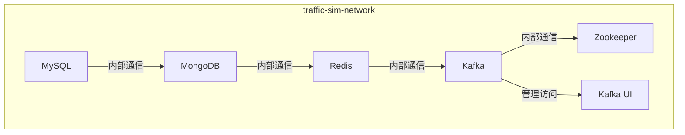
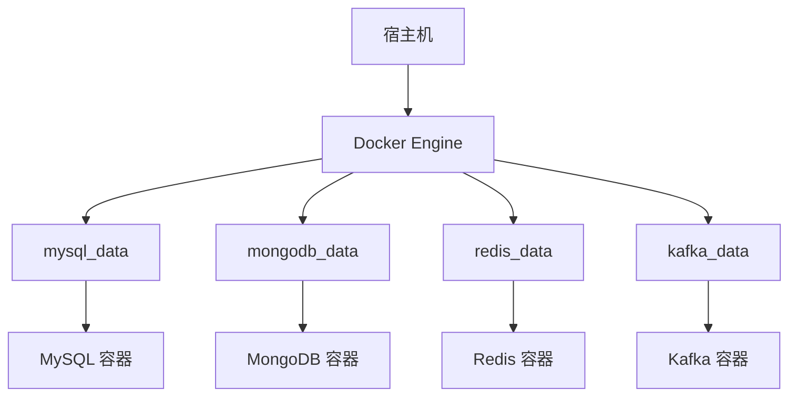
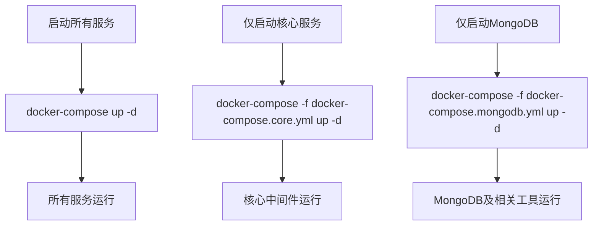

# 网络与存储配置

<cite>
**本文档引用的文件**  
- [docker-compose.yml](file://infrastructure/docker-compose.yml)
- [docker-compose.core.yml](file://infrastructure/docker-compose.core.yml)
- [docker-compose.mongodb.yml](file://infrastructure/docker-compose.mongodb.yml)
- [init.sql](file://infrastructure/init.sql)
- [my.cnf](file://infrastructure/mysql/conf/my.cnf)
- [redis.conf](file://infrastructure/redis/redis.conf)
- [init-mongo.js](file://infrastructure/mongodb/init-mongo.js)
- [README.md](file://infrastructure/README.md)
- [start.sh](file://infrastructure/start.sh)
- [start-mongodb.sh](file://infrastructure/start-mongodb.sh)
- [stop.sh](file://infrastructure/stop.sh)
- [stop-mongodb.sh](file://infrastructure/stop-mongodb.sh)
</cite>

## 目录
1. [网络配置](#网络配置)
2. [数据卷配置](#数据卷配置)
3. [多文件组合机制](#多文件组合机制)
4. [网络冲突解决](#网络冲突解决)
5. [数据卷清理最佳实践](#数据卷清理最佳实践)

## 网络配置

`docker-compose.yml` 文件中定义了名为 `traffic-sim-network` 的自定义桥接网络，所有核心服务均连接到此网络以实现容器间通信。该网络使用 Docker 的 `bridge` 驱动，确保服务之间可以通过容器名称进行 DNS 解析和通信。

所有服务（如 MySQL、MongoDB、Redis、Kafka 等）均通过 `networks` 指令加入 `traffic-sim-network`，从而形成一个隔离的内部通信环境。这种设计避免了服务间直接暴露端口到宿主机，提升了安全性和网络稳定性。



**图示来源**  
- [docker-compose.yml](file://infrastructure/docker-compose.yml#L248-L251)
- [docker-compose.core.yml](file://infrastructure/docker-compose.core.yml#L164-L167)

**本节来源**  
- [docker-compose.yml](file://infrastructure/docker-compose.yml#L248-L253)
- [docker-compose.core.yml](file://infrastructure/docker-compose.core.yml#L164-L168)

## 数据卷配置

系统定义了多个本地数据卷用于持久化存储各服务的数据，确保容器重启或重建后数据不丢失。所有数据卷均使用 `local` 驱动，数据存储在宿主机的 Docker 数据目录中，具有良好的性能和隔离性。

### 数据卷列表

| 数据卷名称 | 挂载路径 | 用途 | 驱动 |
|-----------|--------|------|------|
| mysql_data | /var/lib/mysql | MySQL 数据文件 | local |
| mongodb_data | /data/db | MongoDB 数据文件 | local |
| mongodb_config | /data/configdb | MongoDB 配置文件 | local |
| redis_data | /data | Redis 持久化数据 | local |
| zookeeper_data | /var/lib/zookeeper/data | Zookeeper 数据 | local |
| zookeeper_logs | /var/lib/zookeeper/log | Zookeeper 日志 | local |
| kafka_data | /var/lib/kafka/data | Kafka 消息数据 | local |

数据卷的本地驱动确保了数据的持久化和性能优势，同时通过命名空间隔离避免了不同项目之间的数据混淆。



**图示来源**  
- [docker-compose.yml](file://infrastructure/docker-compose.yml#L229-L243)
- [docker-compose.core.yml](file://infrastructure/docker-compose.core.yml#L145-L159)

**本节来源**  
- [docker-compose.yml](file://infrastructure/docker-compose.yml#L229-L243)
- [docker-compose.core.yml](file://infrastructure/docker-compose.core.yml#L145-L159)

## 多文件组合机制

项目采用 Docker Compose 的多文件覆盖机制，通过 `docker-compose.yml`、`docker-compose.core.yml` 和 `docker-compose.mongodb.yml` 实现灵活的部署策略。

- `docker-compose.yml`：主配置文件，包含所有服务（包括管理工具）
- `docker-compose.core.yml`：核心服务配置，仅包含 MySQL、MongoDB、Redis、Kafka 等核心中间件
- `docker-compose.mongodb.yml`：MongoDB 专用配置，用于在宿主机已有 MySQL 时单独启动 MongoDB

通过 `docker-compose -f` 指定多个文件，后加载的文件会覆盖前一个文件中的相同配置，实现场景化部署。



**图示来源**  
- [docker-compose.yml](file://infrastructure/docker-compose.yml)
- [docker-compose.core.yml](file://infrastructure/docker-compose.core.yml)
- [docker-compose.mongodb.yml](file://infrastructure/docker-compose.mongodb.yml)

**本节来源**  
- [docker-compose.yml](file://infrastructure/docker-compose.yml)
- [docker-compose.core.yml](file://infrastructure/docker-compose.core.yml)
- [docker-compose.mongodb.yml](file://infrastructure/docker-compose.mongodb.yml)
- [README.md](file://infrastructure/README.md#L110-L143)

## 网络冲突解决

当出现网络端口冲突或 Docker 网络异常时，可采取以下措施：

1. **检查网络占用**：使用 `netstat -an | grep <端口>` 检查宿主机端口是否被占用
2. **清理残留网络**：执行 `docker network prune` 清理未使用的网络
3. **重启 Docker 服务**：重启 Docker 引擎以重置网络栈
4. **修改服务端口**：在 `docker-compose.yml` 中调整 `ports` 映射避免冲突

建议在部署前通过 `docker-compose ps` 检查服务状态，确保无冲突。

**本节来源**  
- [README.md](file://infrastructure/README.md#L447-L471)
- [start.sh](file://infrastructure/start.sh)

## 数据卷清理最佳实践

为避免数据丢失，数据卷清理需谨慎操作：

1. **停止服务**：先执行 `docker-compose stop` 停止所有容器
2. **删除容器**：使用 `docker-compose down` 删除容器但保留数据卷
3. **清理数据卷**：仅在确认数据不再需要时使用 `docker-compose down -v` 删除数据卷

定期备份重要数据卷，可使用以下命令进行备份：
```bash
# 备份 MySQL 数据卷
docker run --rm -v traffic-sim_boot_mysql_data:/data -v $(pwd):/backup alpine tar czf /backup/mysql_backup.tar.gz /data
```

**本节来源**  
- [README.md](file://infrastructure/README.md#L106-L107)
- [stop.sh](file://infrastructure/stop.sh)
- [stop-mongodb.sh](file://infrastructure/stop-mongodb.sh)