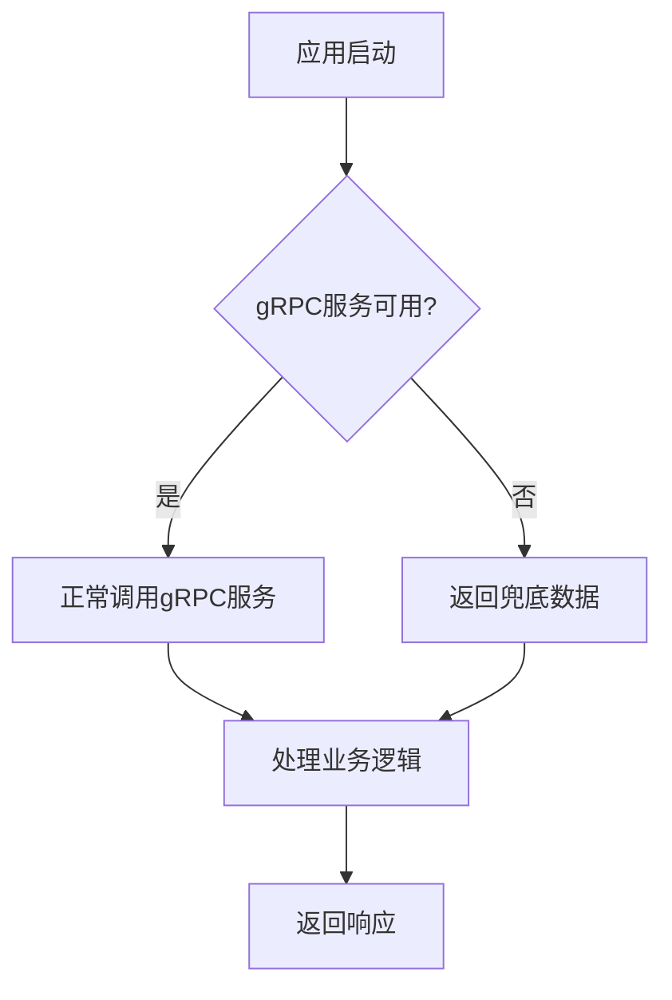
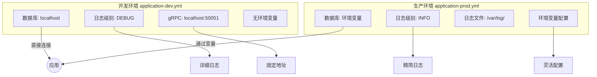
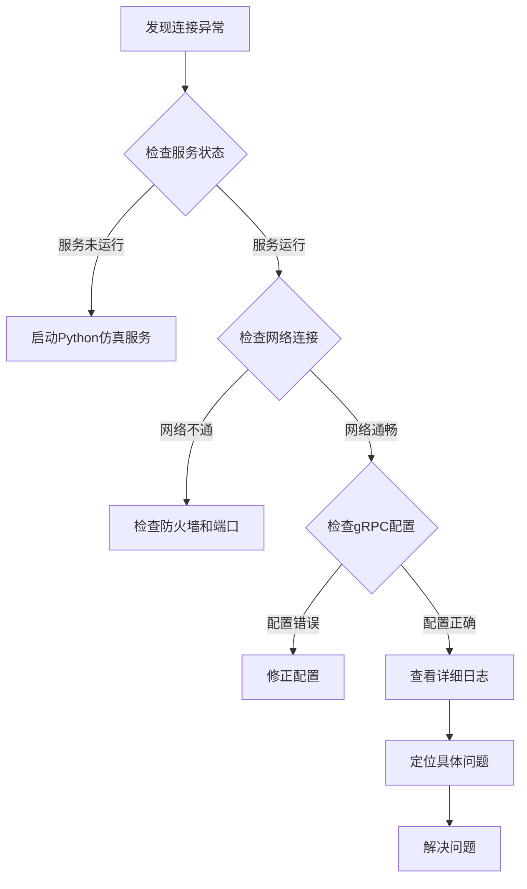

# gRPC客户端配置

<cite>
**本文档引用的文件**
- [application-dev.yml](file://traffic-sim-server\src\main\resources\application-dev.yml)
- [application-prod.yml](file://traffic-sim-server\src\main\resources\application-prod.yml)
- [application.yml](file://traffic-sim-server\src\main\resources\application.yml)
- [GrpcClientConfig.java](file://plugins\plugin-simulation\src\main\java\com\traffic\sim\plugin\simulation\config\GrpcClientConfig.java)
- [SimulationPythonGrpcClient.java](file://plugins\plugin-simulation\src\main\java\com\traffic\sim\plugin\simulation\grpc\SimulationPythonGrpcClient.java)
- [python_service.proto](file://plugins\plugin-simulation\src\main\proto\python_service.proto)
- [SimulationServiceImpl.java](file://plugins\plugin-simulation\src\main\java\com\traffic\sim\plugin\simulation\service\SimulationServiceImpl.java)
</cite>

## 目录
1. [引言](#引言)
2. [gRPC客户端核心配置](#grpc客户端核心配置)
3. [容错机制设计原理](#容错机制设计原理)
4. [开发与生产环境配置对比](#开发与生产环境配置对比)
5. [连接异常诊断与错误处理](#连接异常诊断与错误处理)
6. [总结](#总结)

## 引言
本文档详细描述了交通仿真系统中与Python仿真引擎通信的gRPC客户端配置。重点介绍`python-service`客户端的各项配置参数及其作用，包括服务地址、传输安全类型和连接保活设置。同时，深入解析系统的容错机制设计，确保在Python仿真服务不可用时，主应用仍能正常启动并返回兜底数据。通过对比分析开发与生产环境的配置差异，提供生产环境下的最佳实践建议，并给出gRPC连接异常的诊断方法和常见错误码处理方案。

## gRPC客户端核心配置

gRPC客户端配置主要定义在`application.yml`文件中，针对`python-service`服务的配置项如下：

### address（服务地址）
`address`参数指定了Python gRPC服务的地址。在当前配置中，使用`static://localhost:50051`表示服务运行在本地50051端口。该配置采用静态地址模式，适用于开发和测试环境。在生产环境中，可根据需要调整为实际的服务地址。

### negotiationType（传输安全类型）
`negotiationType`参数设置为`plaintext`，表示使用明文传输，不启用TLS加密。这种配置适用于内部网络通信或开发环境，能够减少加密解密的性能开销。在生产环境中，如果需要更高的安全性，可以考虑启用TLS加密。

### keepAlive相关参数
keepAlive参数用于维护gRPC长连接的稳定性，防止连接因长时间空闲而被中间网络设备断开。

- **enableKeepAlive**: 启用连接保活功能，设置为`true`。
- **keepAliveWithoutCalls**: 即使没有活跃的RPC调用也保持连接，设置为`true`，确保连接始终可用。
- **keepAliveTime**: 连接保活时间间隔，设置为`30s`，即每30秒发送一次保活探测。
- **keepAliveTimeout**: 保活探测超时时间，设置为`5s`，若在5秒内未收到响应，则认为连接已断开。

这些参数的合理配置能够有效维持长连接的稳定性，避免频繁的连接重建开销。

**Section sources**
- [application.yml](file://traffic-sim-server\src\main\resources\application.yml#L71-L78)

## 容错机制设计原理

系统设计了完善的容错机制，确保在Python仿真服务不可用时，主应用仍能正常启动和运行。

### 容错设计架构

**Diagram sources**
- [SimulationPythonGrpcClient.java](file://plugins\plugin-simulation\src\main\java\com\traffic\sim\plugin\simulation\grpc\SimulationPythonGrpcClient.java#L103-L123)
- [SimulationServiceImpl.java](file://plugins\plugin-simulation\src\main\java\com\traffic\sim\plugin\simulation\service\SimulationServiceImpl.java#L53-L64)

### 实现机制
1. **延迟初始化**: 使用`@Lazy`注解对gRPC客户端进行延迟初始化，避免应用启动时因服务不可用而失败。
2. **可用性检查**: 通过`isGrpcAvailable()`方法检查gRPC客户端是否可用，捕获可能的异常而不中断应用流程。
3. **兜底响应**: 当gRPC服务不可用时，`createFallbackResponse()`方法生成包含提示信息的兜底响应，确保业务逻辑能够继续执行。
4. **日志记录**: 详细记录gRPC服务不可用的情况，便于后续问题排查和监控。

这种设计确保了系统的高可用性，即使依赖的Python仿真服务暂时不可用，也不会影响主应用的核心功能。

**Section sources**
- [GrpcClientConfig.java](file://plugins\plugin-simulation\src\main\java\com\traffic\sim\plugin\simulation\config\GrpcClientConfig.java#L19-L32)
- [SimulationPythonGrpcClient.java](file://plugins\plugin-simulation\src\main\java\com\traffic\sim\plugin\simulation\grpc\SimulationPythonGrpcClient.java#L40-L93)

## 开发与生产环境配置对比

### 配置差异分析

**Diagram sources**
- [application-dev.yml](file://traffic-sim-server\src\main\resources\application-dev.yml)
- [application-prod.yml](file://traffic-sim-server\src\main\resources\application-prod.yml)

### 详细对比
| 配置项 | 开发环境 | 生产环境 | 说明 |
|--------|----------|----------|------|
| 数据库连接 | 直接配置localhost | 使用环境变量 | 生产环境更安全，便于容器化部署 |
| 日志级别 | DEBUG | INFO | 生产环境减少日志量，提高性能 |
| 日志存储 | 控制台输出 | 文件存储 | 生产环境便于日志收集和分析 |
| gRPC地址 | 固定localhost | 可通过配置调整 | 生产环境更灵活 |
| 安全设置 | 无SSL | 启用SSL | 生产环境更安全 |

### 生产环境最佳实践
1. **连接稳定性**: 建议适当增加`keepAliveTime`到60秒，减少网络探测频率。
2. **超时设置**: 在生产环境中应设置合理的调用超时时间，避免长时间等待。
3. **监控告警**: 配置对gRPC连接状态的监控，及时发现和处理连接问题。
4. **弹性伸缩**: 考虑服务的弹性伸缩能力，确保在高负载下仍能保持稳定连接。

**Section sources**
- [application-dev.yml](file://traffic-sim-server\src\main\resources\application-dev.yml)
- [application-prod.yml](file://traffic-sim-server\src\main\resources\application-prod.yml)

## 连接异常诊断与错误处理

### 诊断流程

**Diagram sources**
- [SimulationPythonGrpcClient.java](file://plugins\plugin-simulation\src\main\java\com\traffic\sim\plugin\simulation\grpc\SimulationPythonGrpcClient.java#L115-L122)

### 常见错误码处理
| 错误码 | 含义 | 处理方案 |
|--------|------|----------|
| UNAVAILABLE | 服务不可用 | 检查Python服务是否运行，网络是否通畅 |
| DEADLINE_EXCEEDED | 调用超时 | 检查服务性能，适当增加超时时间 |
| INTERNAL | 内部错误 | 查看服务端日志，定位具体问题 |
| UNAUTHENTICATED | 认证失败 | 检查认证配置，确保凭证正确 |

### 错误处理策略
1. **重试机制**: 对于临时性错误，实现指数退避重试策略。
2. **降级处理**: 当重试失败后，返回兜底数据，保证系统可用性。
3. **告警通知**: 对持续性的连接错误，触发告警通知运维人员。
4. **自动恢复**: 实现连接的自动重连机制，提高系统的自愈能力。

**Section sources**
- [SimulationPythonGrpcClient.java](file://plugins\plugin-simulation\src\main\java\com\traffic\sim\plugin\simulation\grpc\SimulationPythonGrpcClient.java#L115-L122)

## 总结
本文档全面介绍了交通仿真系统中gRPC客户端的配置和容错机制。通过合理的配置参数设置和完善的容错设计，确保了系统在各种环境下的稳定运行。开发环境配置注重便利性和调试能力，而生产环境配置则强调安全性、稳定性和可维护性。建议在生产部署时，根据实际网络环境和性能要求，对keepAlive参数进行适当调优，并建立完善的监控告警体系，确保系统的高可用性。