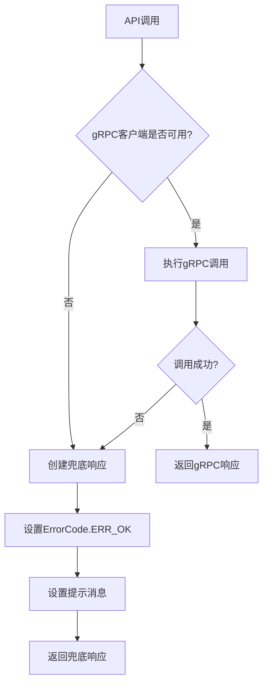
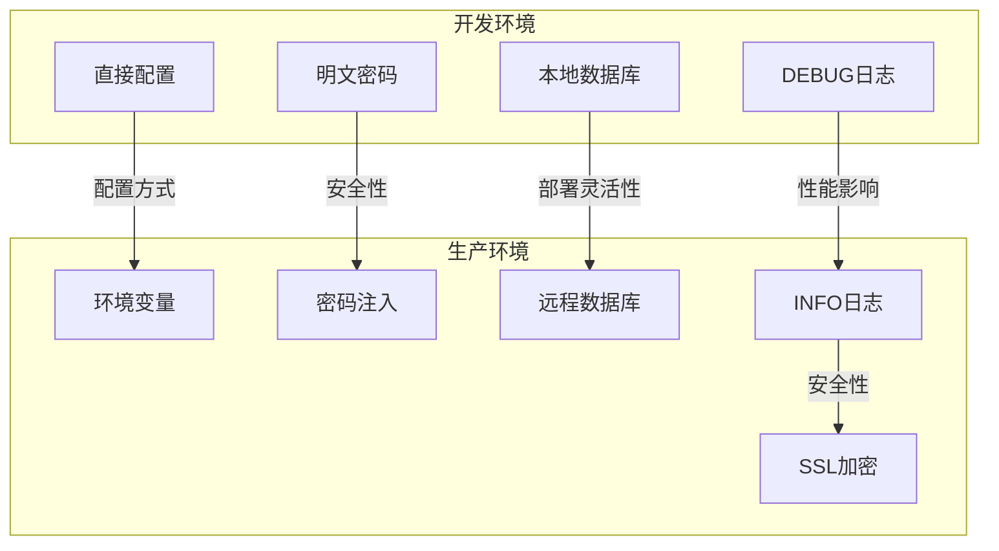
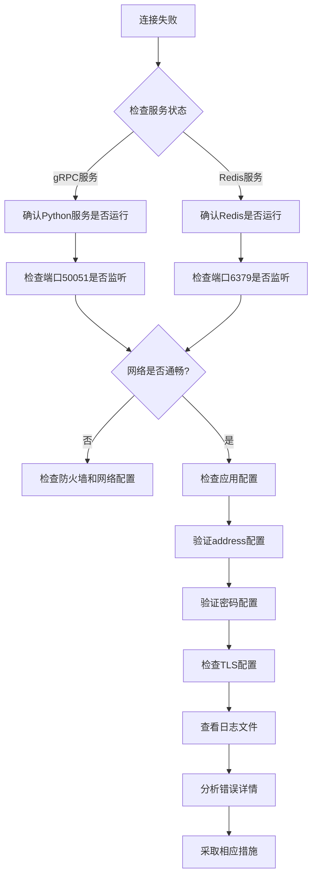

# 中间件配置

<cite>
**本文档引用的文件**  
- [application.yml](file://traffic-sim-server/src/main/resources/application.yml)
- [application-dev.yml](file://traffic-sim-server/src/main/resources/application-dev.yml)
- [application-prod.yml](file://traffic-sim-server/src/main/resources/application-prod.yml)
- [SimulationPythonGrpcClient.java](file://plugins/plugin-simulation/src/main/java/com/traffic/sim/plugin/simulation/grpc/SimulationPythonGrpcClient.java)
- [GrpcClientConfig.java](file://plugins/plugin-simulation/src/main/java/com/traffic/sim/plugin/simulation/config/GrpcClientConfig.java)
- [redis.conf](file://infrastructure/redis/redis.conf)
- [SimulationPluginProperties.java](file://plugins/plugin-simulation/src/main/java/com/traffic/sim/plugin/simulation/config/SimulationPluginProperties.java)
</cite>

## 目录
1. [引言](#引言)
2. [Redis中间件配置](#redis中间件配置)
3. [gRPC客户端配置](#grpc客户端配置)
4. [gRPC容错机制设计](#grpc容错机制设计)
5. [开发与生产环境配置差异](#开发与生产环境配置差异)
6. [中间件连接失败诊断](#中间件连接失败诊断)

## 引言
本文档详细说明交通仿真系统中Redis和gRPC客户端的中间件配置。重点涵盖gRPC客户端`python-service`的各项配置参数、作用及调优建议，分析系统在Python仿真服务不可用时的容错机制，并对比开发与生产环境配置的差异，提供连接失败的常见错误码和诊断步骤。

## Redis中间件配置

Redis作为系统的关键中间件，用于缓存和快速数据访问。其配置文件位于`infrastructure/redis/redis.conf`，主要配置项如下：

- **绑定地址**：`bind 0.0.0.0`，允许所有网络接口访问
- **端口**：`port 6379`，标准Redis端口
- **密码**：`requirepass redis123`，设置访问密码增强安全性
- **持久化配置**：
  - `save 900 1`：900秒内至少1个键改变时保存
  - `save 300 10`：300秒内至少10个键改变时保存
  - `save 60 10000`：60秒内至少10000个键改变时保存
- **AOF持久化**：`appendonly yes`启用AOF，`appendfsync everysec`每秒同步一次
- **内存管理**：`maxmemory 512mb`限制最大内存，`maxmemory-policy allkeys-lru`使用LRU淘汰策略
- **日志级别**：`loglevel notice`，记录重要事件
- **数据库数量**：`databases 16`，支持16个独立数据库

**Section sources**
- [redis.conf](file://infrastructure/redis/redis.conf#L1-L30)

## gRPC客户端配置

gRPC客户端用于与Python仿真服务通信，配置位于`application.yml`文件中，主要配置项如下：

### python-service配置项详解

```yaml
grpc:
  client:
    python-service:
      address: 'static://localhost:50051'
      negotiationType: plaintext
      enableKeepAlive: true
      keepAliveWithoutCalls: true
      keepAliveTime: 30s
      keepAliveTimeout: 5s
```

- **address（服务地址）**：`static://localhost:50051`，指定Python gRPC服务的地址和端口。`static://`前缀表示使用静态地址而非服务发现
- **negotiationType（传输安全）**：`plaintext`，表示不使用TLS加密。在生产环境中应考虑使用`tls`以增强安全性
- **enableKeepAlive**：`true`，启用TCP长连接保活机制，避免频繁建立连接的开销
- **keepAliveWithoutCalls**：`true`，即使没有活跃调用也保持连接，确保连接始终可用
- **keepAliveTime**：`30s`，客户端每30秒发送一次保活ping，建议根据网络稳定性调整
- **keepAliveTimeout**：`5s`，等待保活响应的超时时间，若超时则认为连接已断开

**调优建议**：
- 在高延迟网络中，可适当增加`keepAliveTime`至60s以减少网络流量
- 在不稳定网络中，可减少`keepAliveTimeout`至3s以更快检测连接故障
- 生产环境应启用TLS加密，将`negotiationType`设为`tls`

**Section sources**
- [application.yml](file://traffic-sim-server/src/main/resources/application.yml#L68-L81)

## gRPC容错机制设计

系统设计了完善的gRPC容错机制，确保在Python仿真服务不可用时不影响主应用启动和基本功能。

### 容错实现原理

1. **延迟初始化**：使用`@Lazy`注解延迟gRPC客户端的初始化，避免应用启动时因服务不可用而失败
2. **条件加载**：通过`@ConditionalOnProperty`注解控制gRPC客户端的加载，可通过配置`grpc.client.python-service.enabled=false`完全禁用
3. **运行时检查**：在每次调用前检查gRPC客户端可用性，若不可用则返回兜底数据
4. **兜底响应**：当gRPC调用失败时，返回预设的兜底数据，确保API调用不会中断

### 兜底数据处理流程



**Diagram sources**
- [SimulationPythonGrpcClient.java](file://plugins/plugin-simulation/src/main/java/com/traffic/sim/plugin/simulation/grpc/SimulationPythonGrpcClient.java#L80-L92)
- [SimulationPythonGrpcClient.java](file://plugins/plugin-simulation/src/main/java/com/traffic/sim/plugin/simulation/grpc/SimulationPythonGrpcClient.java#L166-L172)

**Section sources**
- [SimulationPythonGrpcClient.java](file://plugins/plugin-simulation/src/main/java/com/traffic/sim/plugin/simulation/grpc/SimulationPythonGrpcClient.java#L35-L73)
- [GrpcClientConfig.java](file://plugins/plugin-simulation/src/main/java/com/traffic/sim/plugin/simulation/config/GrpcClientConfig.java#L15-L33)

## 开发与生产环境配置差异

### 配置差异对比

| 配置项 | 开发环境 (application-dev.yml) | 生产环境 (application-prod.yml) |
|--------|-------------------------------|--------------------------------|
| 数据库URL | 直接指定localhost和数据库名 | 使用环境变量${DB_HOST}、${DB_NAME}等 |
| 认证信息 | 明文密码 | 环境变量注入密码 |
| 日志级别 | DEBUG，便于调试 | INFO，减少日志量 |
| 日志路径 | 默认路径 | 指定为`/var/log/traffic-sim/server.log` |
| SSL配置 | useSSL=false | useSSL=true，启用SSL加密 |

### 生产环境配置的健壮性和安全性

生产环境配置具有以下优势：

- **环境变量注入**：使用`${DB_HOST:localhost}`等语法，支持环境变量覆盖，便于容器化部署
- **SSL加密**：启用`useSSL=true`，确保数据库连接的安全性
- **集中日志**：日志输出到`/var/log`标准路径，便于日志收集和监控
- **配置解耦**：数据库连接信息与代码分离，提高安全性



**Diagram sources**
- [application-dev.yml](file://traffic-sim-server/src/main/resources/application-dev.yml#L1-L24)
- [application-prod.yml](file://traffic-sim-server/src/main/resources/application-prod.yml#L1-L29)

**Section sources**
- [application-dev.yml](file://traffic-sim-server/src/main/resources/application-dev.yml#L1-L24)
- [application-prod.yml](file://traffic-sim-server/src/main/resources/application-prod.yml#L1-L29)

## 中间件连接失败诊断

### 常见错误码

| 错误码 | 含义 | 可能原因 |
|--------|------|---------|
| UNAVAILABLE | 服务不可用 | gRPC服务未启动或网络不通 |
| DEADLINE_EXCEEDED | 调用超时 | 网络延迟高或服务处理慢 |
| UNAUTHENTICATED | 认证失败 | 密码错误或认证配置问题 |
| RESOURCE_EXHAUSTED | 资源耗尽 | Redis内存不足或连接数过多 |

### 诊断步骤



**Diagram sources**
- [application.yml](file://traffic-sim-server/src/main/resources/application.yml#L68-L81)
- [redis.conf](file://infrastructure/redis/redis.conf#L1-L30)

**Section sources**
- [SimulationPythonGrpcClient.java](file://plugins/plugin-simulation/src/main/java/com/traffic/sim/plugin/simulation/grpc/SimulationPythonGrpcClient.java#L148-L156)
- [redis.conf](file://infrastructure/redis/redis.conf#L1-L30)