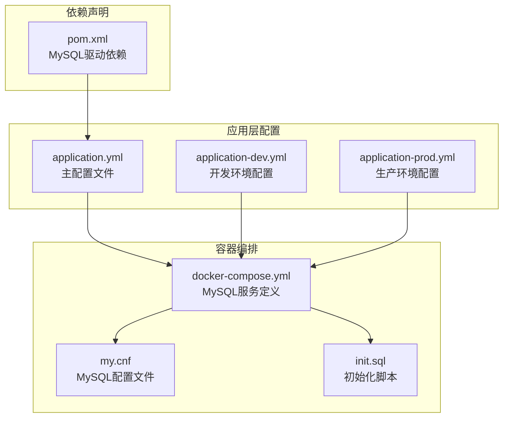
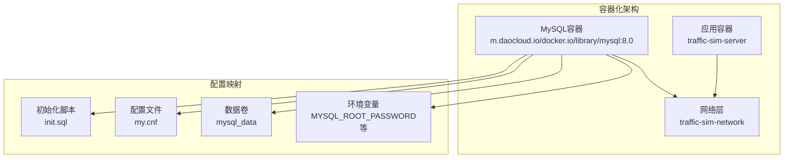
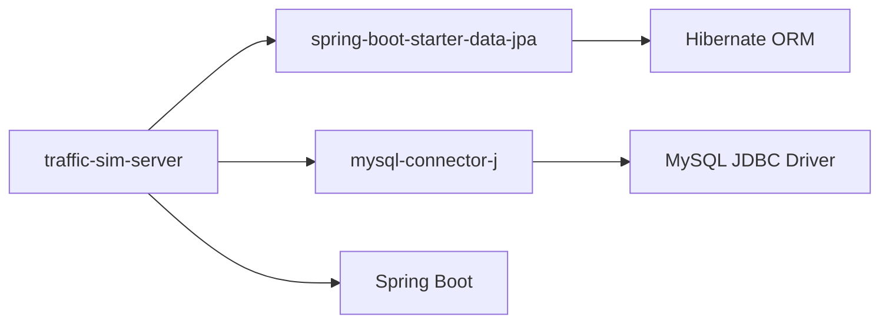
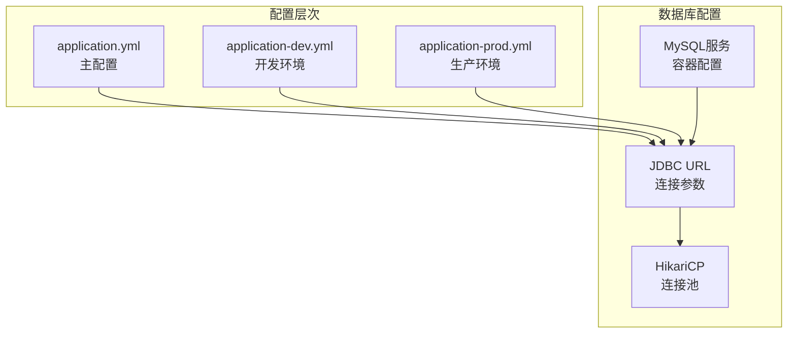

# MySQL配置

<cite>
**本文引用的文件**
- [application.yml](file://traffic-sim-server/src/main/resources/application.yml)
- [application-dev.yml](file://traffic-sim-server/src/main/resources/application-dev.yml)
- [application-prod.yml](file://traffic-sim-server/src/main/resources/application-prod.yml)
- [docker-compose.yml](file://infrastructure/docker-compose.yml)
- [my.cnf](file://infrastructure/mysql/conf/my.cnf)
- [init.sql](file://infrastructure/init.sql)
- [pom.xml](file://traffic-sim-server/pom.xml)
</cite>

## 目录
1. [简介](#简介)
2. [项目结构](#项目结构)
3. [核心组件](#核心组件)
4. [架构概览](#架构概览)
5. [详细组件分析](#详细组件分析)
6. [依赖分析](#依赖分析)
7. [性能考虑](#性能考虑)
8. [故障排查指南](#故障排查指南)
9. [结论](#结论)
10. [附录](#附录)

## 简介
本文档深入解析了交通仿真系统的MySQL数据库配置，重点涵盖以下方面：
- application.yml中datasource部分的JDBC连接参数详解
- HikariCP连接池核心参数配置说明
- 基于docker-compose.yml的容器化部署配置
- MySQL服务端配置（字符集、时区、初始化脚本）
- 常见问题排查方法
- JPA ddl-auto在不同环境中的使用风险

## 项目结构
本项目的数据库配置涉及多个层次的配置文件和容器编排文件：

**图表来源**
- [application.yml](file://traffic-sim-server/src/main/resources/application.yml#L1-L117)
- [docker-compose.yml](file://infrastructure/docker-compose.yml#L1-L253)
- [my.cnf](file://infrastructure/mysql/conf/my.cnf#L1-L39)
- [init.sql](file://infrastructure/init.sql#L1-L208)
- [pom.xml](file://traffic-sim-server/pom.xml#L68-L73)

**章节来源**
- [application.yml](file://traffic-sim-server/src/main/resources/application.yml#L1-L117)
- [docker-compose.yml](file://infrastructure/docker-compose.yml#L1-L253)

## 核心组件
本节详细解析MySQL数据库配置的核心要素：

### JDBC连接参数详解

#### useSSL=false 参数分析
- **配置位置**: application.yml第8行
- **作用机制**: 禁用SSL/TLS加密连接
- **安全影响**:
  - 开发环境中便于调试和测试
  - 生产环境中存在明文传输风险
  - 建议生产环境改为true并配置证书

#### serverTimezone=Asia/Shanghai 时区配置
- **配置位置**: application.yml第8行
- **作用机制**: 指定服务器时区为东八区
- **重要性**:
  - 确保Java应用与MySQL时区一致
  - 避免时间戳转换错误
  - 与Jackson配置GMT+8保持一致

#### allowPublicKeyRetrieval=true 认证机制
- **配置位置**: application.yml第8行
- **作用机制**: 允许从服务器检索公钥
- **应用场景**: 
  - MySQL 8.0+默认认证插件变化
  - 与mysql_native_password插件配合使用
  - 开发环境简化认证流程

### HikariCP连接池配置

#### 连接池参数详解
- **minimum-idle=5**: 确保至少保持5个空闲连接
- **maximum-pool-size=20**: 并发连接上限为20
- **connection-timeout=30000**: 获取连接超时30秒
- **idle-timeout=600000**: 空闲连接600秒后回收
- **max-lifetime=1800000**: 连接最长存活1800秒

**章节来源**
- [application.yml](file://traffic-sim-server/src/main/resources/application.yml#L5-L16)

## 架构概览
系统采用容器化部署，MySQL服务通过Docker Compose管理：

**图表来源**
- [docker-compose.yml](file://infrastructure/docker-compose.yml#L7-L37)
- [my.cnf](file://infrastructure/mysql/conf/my.cnf#L1-L39)

## 详细组件分析

### MySQL服务容器配置
基于docker-compose.yml的服务定义包含以下关键配置：

#### 环境变量配置
- **MYSQL_ROOT_PASSWORD**: root (根用户密码)
- **MYSQL_DATABASE**: traffic_sim (默认数据库)
- **MYSQL_USER**: traffic_sim (应用用户)
- **MYSQL_PASSWORD**: traffic_sim (应用用户密码)
- **TZ**: Asia/Shanghai (时区设置)

#### 数据卷挂载机制
- **mysql_data**: /var/lib/mysql (持久化数据存储)
- **init.sql**: /docker-entrypoint-initdb.d/init.sql (初始化脚本)
- **my.cnf**: /etc/mysql/conf.d (配置文件目录)

#### 启动命令参数
- **--character-set-server=utf8mb4**: 字符集设置
- **--collation-server=utf8mb4_unicode_ci**: 排序规则
- **--default-authentication-plugin=mysql_native_password**: 认证插件
- **--max_connections=1000**: 最大连接数
- **--innodb_buffer_pool_size=512M**: 缓冲池大小

### MySQL服务端配置分析

#### 字符集配置
my.cnf中的字符集设置确保：
- **utf8mb4**: 支持完整的UTF-8编码，包括emoji
- **utf8mb4_unicode_ci**: 标准化的排序规则
- **default-character-set**: 客户端和mysql工具默认字符集

#### 时区配置
- **default-time-zone='+8:00'**: 东八区时区设置
- **与应用配置一致性**: 确保数据库与应用时区同步

#### 性能优化参数
- **max_connections=1000**: 高并发支持
- **innodb_buffer_pool_size=512M**: InnoDB缓冲池
- **慢查询日志**: 便于性能分析和优化

### 初始化脚本执行机制
init.sql脚本按顺序执行，包含：
1. 数据库创建和字符集设置
2. 用户管理相关表结构
3. 地图管理和仿真任务表结构
4. 基础数据初始化（角色、权限）

**章节来源**
- [docker-compose.yml](file://infrastructure/docker-compose.yml#L13-L31)
- [my.cnf](file://infrastructure/mysql/conf/my.cnf#L1-L39)
- [init.sql](file://infrastructure/init.sql#L1-L208)

## 依赖分析

### 应用依赖关系

**图表来源**
- [pom.xml](file://traffic-sim-server/pom.xml#L44-L73)

### 配置依赖关系

**图表来源**
- [application.yml](file://traffic-sim-server/src/main/resources/application.yml#L5-L16)
- [application-dev.yml](file://traffic-sim-server/src/main/resources/application-dev.yml#L2-L6)
- [application-prod.yml](file://traffic-sim-server/src/main/resources/application-prod.yml#L2-L6)

**章节来源**
- [pom.xml](file://traffic-sim-server/pom.xml#L68-L73)

## 性能考虑

### 连接池性能调优
- **最小空闲连接**: 5个连接确保应用启动时的即时可用性
- **最大连接池**: 20个连接平衡并发需求和资源消耗
- **超时配置**: 30秒连接超时避免长时间阻塞
- **生命周期管理**: 合理的空闲和最大生命周期减少连接泄漏

### MySQL性能参数
- **缓冲池大小**: 512MB适合中等规模应用
- **最大连接数**: 1000支持高并发场景
- **慢查询日志**: 2秒阈值便于识别性能瓶颈

## 故障排查指南

### 连接失败排查
1. **检查容器状态**: `docker-compose ps`
2. **查看MySQL日志**: `docker-compose logs mysql`
3. **验证端口占用**: `netstat -an | grep 3306`
4. **确认凭据正确性**: 核对环境变量和应用配置

### 认证问题诊断
1. **检查认证插件**: 确认使用mysql_native_password
2. **验证公钥检索**: allowPublicKeyRetrieval配置
3. **核对时区设置**: serverTimezone一致性检查

### 性能问题分析
1. **监控连接池**: 观察活跃连接数和等待时间
2. **分析慢查询**: 检查慢查询日志配置
3. **评估缓冲池**: 监控Innodb缓冲池命中率

**章节来源**
- [application-prod.yml](file://traffic-sim-server/src/main/resources/application-prod.yml#L4-L6)

## 结论
本MySQL配置方案提供了完整的开发到生产的数据库解决方案：

### 配置优势
- **容器化部署**: 统一的环境配置和快速部署
- **字符集支持**: utf8mb4确保国际化兼容性
- **时区一致性**: 应用与数据库时区完全匹配
- **连接池优化**: 合理的连接池参数满足业务需求

### 安全建议
- **生产环境启用SSL**: 将useSSL=false改为true
- **凭证管理**: 使用环境变量而非硬编码密码
- **网络隔离**: 通过Docker网络限制访问范围

### 扩展性考虑
- **监控集成**: 添加数据库性能监控
- **备份策略**: 配置定期备份和恢复测试
- **容量规划**: 根据业务增长调整连接池和MySQL参数

## 附录

### 环境变量参考
- **DB_HOST**: 数据库主机地址
- **DB_PORT**: 数据库端口号
- **DB_NAME**: 数据库名称
- **DB_USERNAME**: 数据库用户名
- **DB_PASSWORD**: 数据库密码
- **SERVER_PORT**: 应用服务器端口

### 配置最佳实践
- **开发环境**: useSSL=false，便于调试
- **生产环境**: useSSL=true，启用TLS加密
- **连接池**: 根据QPS调整minimum-idle和maximum-pool-size
- **监控**: 启用慢查询日志和连接池监控