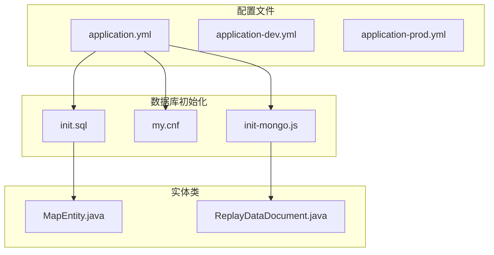
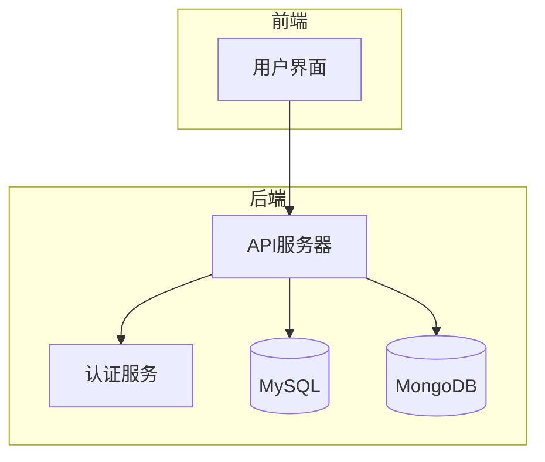
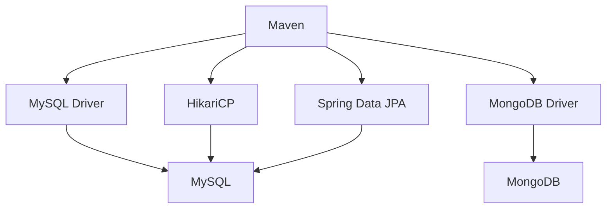

# 数据库配置

<cite>
**本文档引用的文件**   
- [application.yml](file://traffic-sim-server/src/main/resources/application.yml)
- [application-dev.yml](file://traffic-sim-server/src/main/resources/application-dev.yml)
- [application-prod.yml](file://traffic-sim-server/src/main/resources/application-prod.yml)
- [init.sql](file://infrastructure/init.sql)
- [my.cnf](file://infrastructure/mysql/conf/my.cnf)
- [docker-compose.yml](file://infrastructure/docker-compose.yml)
- [init-mongo.js](file://infrastructure/mongodb/init-mongo.js)
- [MapEntity.java](file://plugins/plugin-map/src/main/java/com/traffic/sim/plugin/map/entity/MapEntity.java)
- [ReplayDataDocument.java](file://plugins/plugin-engine-replay/src/main/java/com/traffic/sim/plugin/replay/document/ReplayDataDocument.java)
</cite>

## 目录
1. [简介](#简介)
2. [项目结构](#项目结构)
3. [核心组件](#核心组件)
4. [架构概述](#架构概述)
5. [详细组件分析](#详细组件分析)
6. [依赖分析](#依赖分析)
7. [性能考虑](#性能考虑)
8. [故障排除指南](#故障排除指南)
9. [结论](#结论)

## 简介
本文档详细解释了交通仿真系统中的数据库配置，重点分析了`application.yml`文件中MySQL和MongoDB的配置项。文档涵盖了MySQL数据源的JDBC URL参数含义、Hikari连接池的核心参数及其性能影响、MongoDB的两种配置方式的区别和使用场景，以及开发环境与生产环境配置的差异。此外，还提供了数据库连接故障排查指南和JPA ddl-auto: update的使用注意事项。

## 项目结构
本项目采用微服务架构，包含多个插件模块，每个模块负责不同的功能。数据库配置主要集中在`traffic-sim-server`模块的`src/main/resources`目录下，包括`application.yml`、`application-dev.yml`和`application-prod.yml`三个配置文件。MySQL和MongoDB的初始化脚本分别位于`infrastructure/mysql/conf/my.cnf`和`infrastructure/mongodb/init-mongo.js`。

**Diagram sources**
- [application.yml](file://traffic-sim-server/src/main/resources/application.yml)
- [init.sql](file://infrastructure/init.sql)
- [my.cnf](file://infrastructure/mysql/conf/my.cnf)
- [init-mongo.js](file://infrastructure/mongodb/init-mongo.js)
- [MapEntity.java](file://plugins/plugin-map/src/main/java/com/traffic/sim/plugin/map/entity/MapEntity.java)
- [ReplayDataDocument.java](file://plugins/plugin-engine-replay/src/main/java/com/traffic/sim/plugin/replay/document/ReplayDataDocument.java)

**Section sources**
- [application.yml](file://traffic-sim-server/src/main/resources/application.yml)
- [init.sql](file://infrastructure/init.sql)
- [my.cnf](file://infrastructure/mysql/conf/my.cnf)
- [init-mongo.js](file://infrastructure/mongodb/init-mongo.js)

## 核心组件
核心组件包括MySQL数据源配置、MongoDB配置、Hikari连接池配置和JPA配置。这些组件共同确保了系统的稳定性和性能。

**Section sources**
- [application.yml](file://traffic-sim-server/src/main/resources/application.yml)

## 架构概述
系统采用Spring Boot框架，通过`application.yml`文件进行数据库配置。MySQL用于存储结构化数据，如用户信息、地图信息和仿真任务信息；MongoDB用于存储非结构化数据，如回放数据和仿真数据。Hikari连接池用于管理MySQL连接，提高数据库访问性能。

**Diagram sources**
- [application.yml](file://traffic-sim-server/src/main/resources/application.yml)

## 详细组件分析
### MySQL数据源配置
MySQL数据源配置包括JDBC URL、用户名、密码和Hikari连接池参数。JDBC URL中的参数如`useSSL`、`serverTimezone`和`allowPublicKeyRetrieval`对连接的安全性和性能有重要影响。

**Section sources**
- [application.yml](file://traffic-sim-server/src/main/resources/application.yml)

### MongoDB配置
MongoDB配置支持URI模式和分离式配置两种方式。URI模式推荐使用，因为它可以包含认证信息，简化配置。分离式配置适用于需要更细粒度控制的场景。

**Section sources**
- [application.yml](file://traffic-sim-server/src/main/resources/application.yml)

### Hikari连接池配置
Hikari连接池配置包括`minimum-idle`、`maximum-pool-size`、`connection-timeout`等参数。这些参数直接影响数据库连接的性能和稳定性。

**Section sources**
- [application.yml](file://traffic-sim-server/src/main/resources/application.yml)

### JPA配置
JPA配置中的`ddl-auto: update`参数用于自动更新数据库表结构。虽然方便开发，但在生产环境中应谨慎使用，以避免意外的数据丢失。

**Section sources**
- [application.yml](file://traffic-sim-server/src/main/resources/application.yml)

## 依赖分析
系统依赖于MySQL和MongoDB数据库，以及Hikari连接池和Spring Data JPA。这些依赖通过Maven进行管理，确保版本的一致性和兼容性。

**Diagram sources**
- [pom.xml](file://pom.xml)

**Section sources**
- [pom.xml](file://pom.xml)

## 性能考虑
合理的数据库配置对系统性能至关重要。Hikari连接池的参数设置应根据实际负载进行调整，避免连接过多或过少。JDBC URL中的参数如`useSSL`和`serverTimezone`也会影响连接性能。

## 故障排除指南
### 连接超时
检查网络连接和数据库服务器状态，确保端口开放且服务正常运行。

### 认证失败
确认用户名和密码正确，检查数据库用户权限设置。

### 数据库初始化失败
确保初始化脚本语法正确，数据库字符集和排序规则设置正确。

**Section sources**
- [init.sql](file://infrastructure/init.sql)
- [my.cnf](file://infrastructure/mysql/conf/my.cnf)
- [init-mongo.js](file://infrastructure/mongodb/init-mongo.js)

## 结论
本文档详细介绍了交通仿真系统的数据库配置，涵盖了MySQL和MongoDB的配置项、Hikari连接池参数、JPA配置以及故障排除指南。通过合理的配置和管理，可以确保系统的稳定性和高性能。