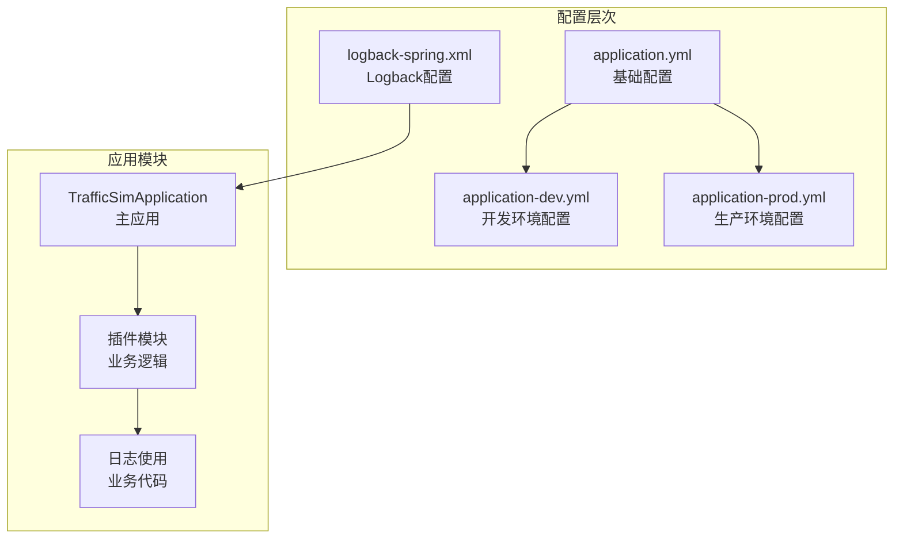
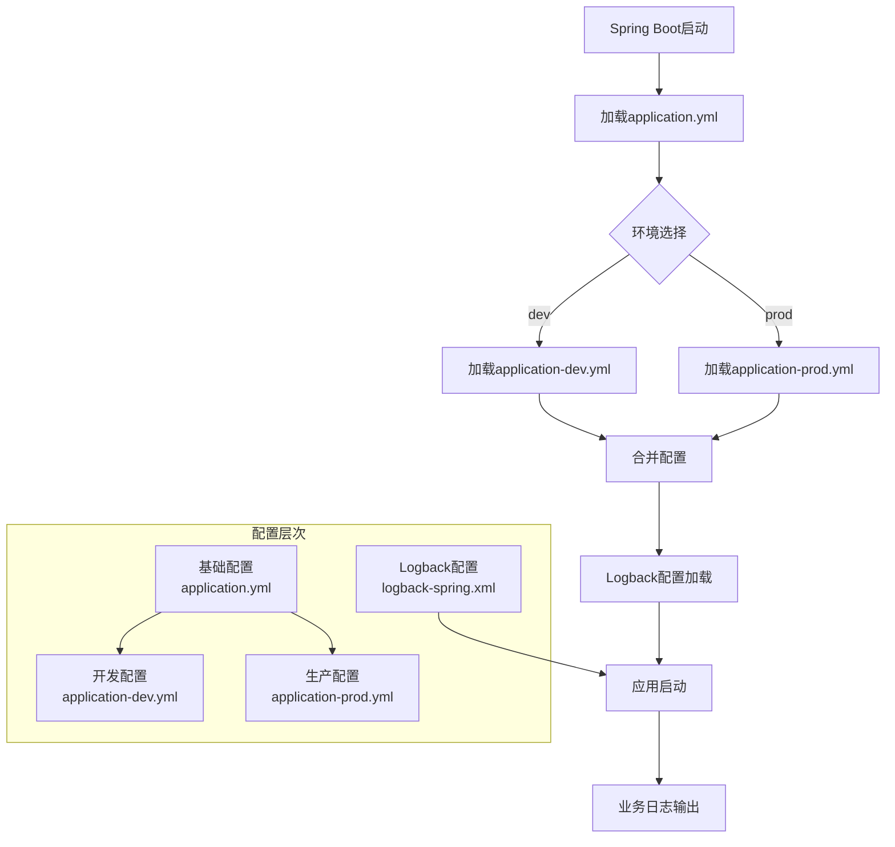
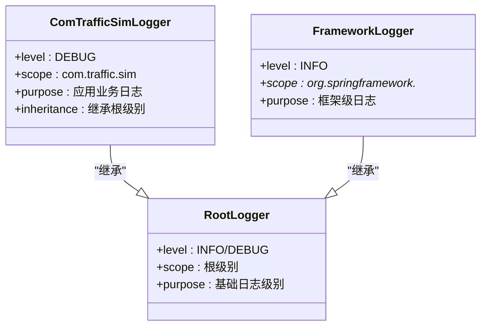
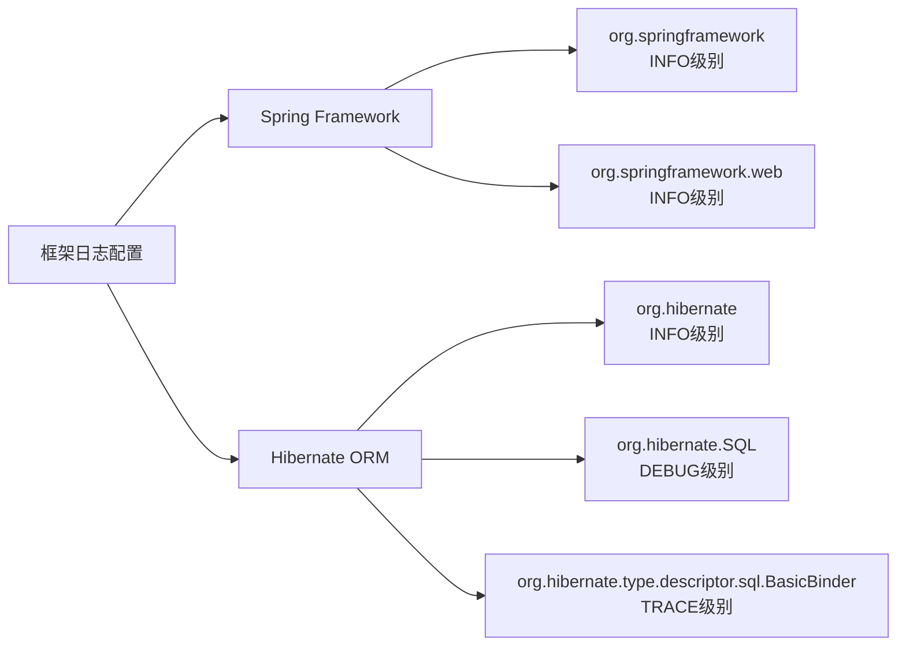
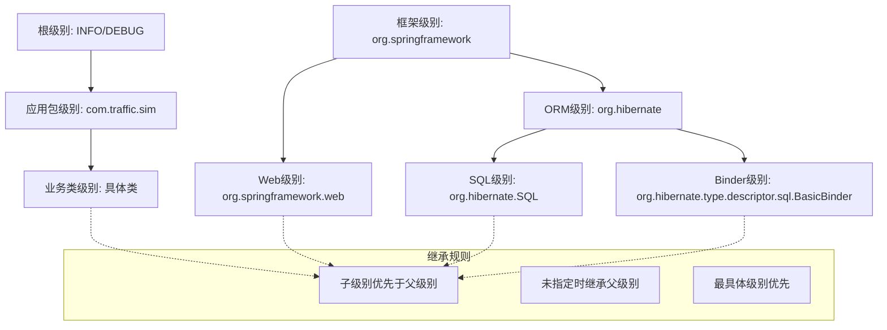
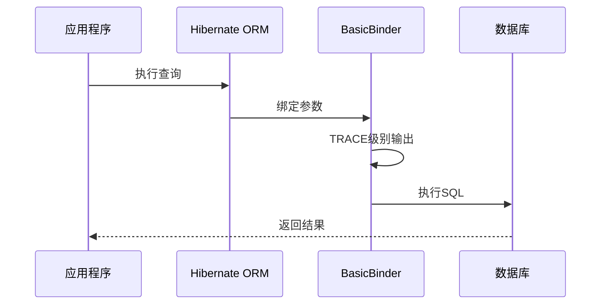
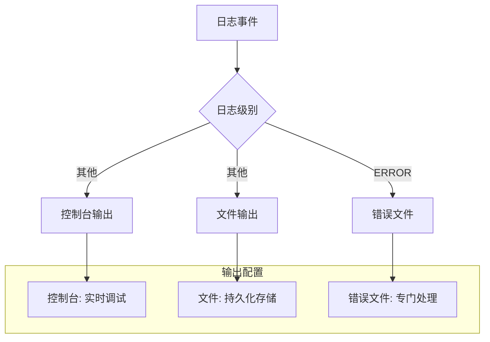
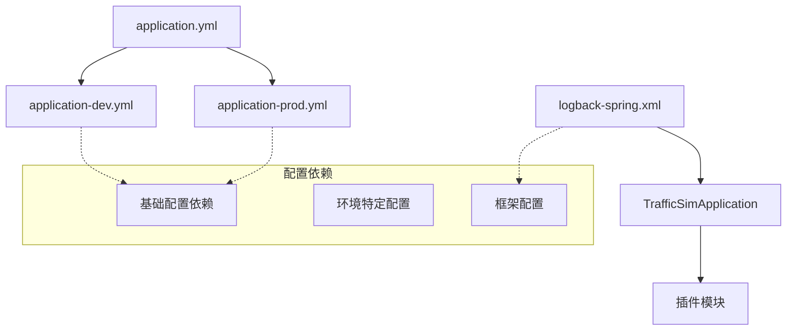
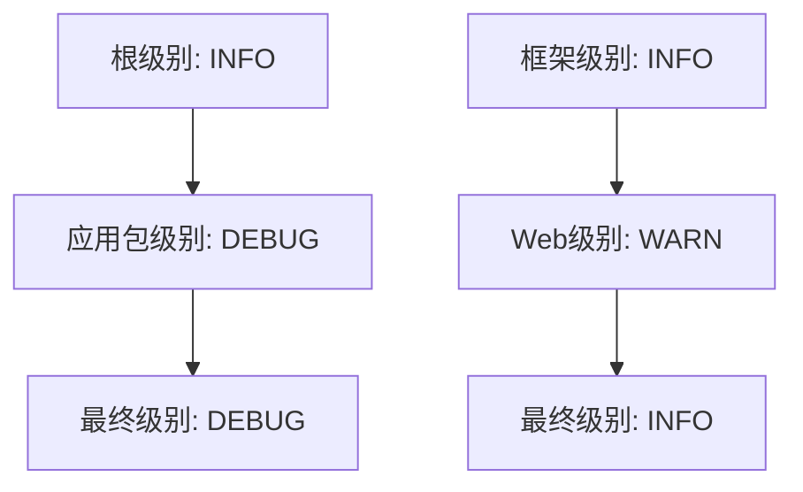
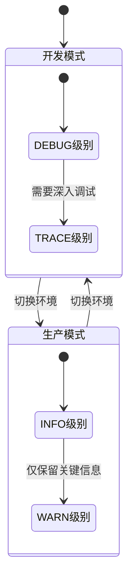

# 日志级别配置

<cite>
**本文档引用的文件**
- [application-dev.yml](file://traffic-sim-server/src/main/resources/application-dev.yml)
- [application-prod.yml](file://traffic-sim-server/src/main/resources/application-prod.yml)
- [application.yml](file://traffic-sim-server/src/main/resources/application.yml)
- [logback-spring.xml](file://traffic-sim-server/src/main/resources/logback-spring.xml)
- [TrafficSimApplication.java](file://traffic-sim-server/src/main/java/com/traffic/sim/TrafficSimApplication.java)
- [AuthServiceImpl.java](file://plugins/plugin-auth/src/main/java/com/traffic/sim/plugin/auth/service/AuthServiceImpl.java)
- [SimulationServiceImpl.java](file://plugins/plugin-simulation/src/main/java/com/traffic/sim/plugin/simulation/service/SimulationServiceImpl.java)
- [StatisticsServiceImpl.java](file://plugins/plugin-statistics/src/main/java/com/traffic/sim/plugin/statistics/service/StatisticsServiceImpl.java)
- [EngineWebSocketHandler.java](file://plugins/plugin-engine-manager/src/main/java/com/traffic/sim/plugin/engine/manager/websocket/EngineWebSocketHandler.java)
- [FrontendWebSocketHandler.java](file://plugins/plugin-engine-manager/src/main/java/com/traffic/sim/plugin/engine/manager/websocket/FrontendWebSocketHandler.java)
</cite>

## 目录
1. [简介](#简介)
2. [项目结构](#项目结构)
3. [核心组件](#核心组件)
4. [架构概览](#架构概览)
5. [详细组件分析](#详细组件分析)
6. [依赖关系分析](#依赖关系分析)
7. [性能考虑](#性能考虑)
8. [故障排除指南](#故障排除指南)
9. [结论](#结论)

## 简介

本项目采用分层日志级别配置策略，通过Spring Boot的多环境配置和Logback的灵活配置相结合，实现了开发环境与生产环境的日志级别差异化管理。该策略的核心目标是在开发阶段提供充足的调试信息，同时在生产环境中保持合理的日志输出量，避免对系统性能造成影响。

## 项目结构

项目采用模块化架构，日志配置分布在多个层次：



**图表来源**
- [application.yml](file://traffic-sim-server/src/main/resources/application.yml#L103-L117)
- [application-dev.yml](file://traffic-sim-server/src/main/resources/application-dev.yml#L17-L23)
- [application-prod.yml](file://traffic-sim-server/src/main/resources/application-prod.yml#L21-L28)
- [logback-spring.xml](file://traffic-sim-server/src/main/resources/logback-spring.xml#L1-L66)

**章节来源**
- [application.yml](file://traffic-sim-server/src/main/resources/application.yml#L1-L117)
- [application-dev.yml](file://traffic-sim-server/src/main/resources/application-dev.yml#L1-L24)
- [application-prod.yml](file://traffic-sim-server/src/main/resources/application-prod.yml#L1-L29)

## 核心组件

### 开发环境日志配置

开发环境配置采用高详细度的日志级别，确保开发者能够获得充分的调试信息：

- **根级别**: DEBUG
- **应用包级别**: DEBUG (com.traffic.sim)
- **Web框架级别**: DEBUG (org.springframework.web)

### 生产环境日志配置

生产环境配置注重性能和资源利用效率：

- **根级别**: INFO
- **应用包级别**: INFO (com.traffic.sim)
- **文件输出**: /var/log/traffic-sim/server.log

### Logback核心配置

Logback配置提供了完整的日志输出管道：

- **控制台输出**: 实时调试
- **文件输出**: 持久化日志
- **错误文件**: 专门的错误日志
- **滚动策略**: 大小和时间双重控制

**章节来源**
- [application-dev.yml](file://traffic-sim-server/src/main/resources/application-dev.yml#L17-L23)
- [application-prod.yml](file://traffic-sim-server/src/main/resources/application-prod.yml#L21-L28)
- [logback-spring.xml](file://traffic-sim-server/src/main/resources/logback-spring.xml#L1-L66)

## 架构概览

日志配置架构采用分层设计，确保配置的灵活性和可维护性：



**图表来源**
- [TrafficSimApplication.java](file://traffic-sim-server/src/main/java/com/traffic/sim/TrafficSimApplication.java#L24-L41)
- [application.yml](file://traffic-sim-server/src/main/resources/application.yml#L103-L117)
- [application-dev.yml](file://traffic-sim-server/src/main/resources/application-dev.yml#L17-L23)
- [application-prod.yml](file://traffic-sim-server/src/main/resources/application-prod.yml#L21-L28)

## 详细组件分析

### 包级别日志配置策略

#### 应用包级别配置

应用包级别配置是整个日志策略的核心，直接影响到业务功能的可观测性：



**图表来源**
- [logback-spring.xml](file://traffic-sim-server/src/main/resources/logback-spring.xml#L47-L51)
- [logback-spring.xml](file://traffic-sim-server/src/main/resources/logback-spring.xml#L54-L54)

#### 框架日志级别配置

框架日志级别配置体现了对Spring框架和Hibernate ORM的不同关注点：



**图表来源**
- [logback-spring.xml](file://traffic-sim-server/src/main/resources/logback-spring.xml#L56-L63)

**章节来源**
- [logback-spring.xml](file://traffic-sim-server/src/main/resources/logback-spring.xml#L54-L63)

### 日志级别继承机制

日志级别继承遵循严格的层次结构规则：



**图表来源**
- [application-dev.yml](file://traffic-sim-server/src/main/resources/application-dev.yml#L18-L22)
- [application-prod.yml](file://traffic-sim-server/src/main/resources/application-prod.yml#L22-L25)
- [logback-spring.xml](file://traffic-sim-server/src/main/resources/logback-spring.xml#L47-L63)

### TRACE级别调试价值

TRACE级别的配置具有特殊的调试价值，特别是在数据库操作方面：

#### SQL参数绑定调试

TRACE级别的BasicBinder配置提供了SQL参数绑定的详细信息：



**图表来源**
- [logback-spring.xml](file://traffic-sim-server/src/main/resources/logback-spring.xml#L63-L63)

**章节来源**
- [logback-spring.xml](file://traffic-sim-server/src/main/resources/logback-spring.xml#L60-L63)

### 日志输出管道

系统采用多管道输出策略，确保不同类型的信息得到适当的处理：



**图表来源**
- [logback-spring.xml](file://traffic-sim-server/src/main/resources/logback-spring.xml#L5-L44)

**章节来源**
- [logback-spring.xml](file://traffic-sim-server/src/main/resources/logback-spring.xml#L5-L44)

## 依赖关系分析

日志配置之间的依赖关系体现了配置的层次性和继承性：



**图表来源**
- [application.yml](file://traffic-sim-server/src/main/resources/application.yml#L103-L117)
- [application-dev.yml](file://traffic-sim-server/src/main/resources/application-dev.yml#L17-L23)
- [application-prod.yml](file://traffic-sim-server/src/main/resources/application-prod.yml#L21-L28)
- [logback-spring.xml](file://traffic-sim-server/src/main/resources/logback-spring.xml#L1-L66)

**章节来源**
- [application.yml](file://traffic-sim-server/src/main/resources/application.yml#L103-L117)
- [logback-spring.xml](file://traffic-sim-server/src/main/resources/logback-spring.xml#L1-L66)

## 性能考虑

### 开发环境优化

开发环境采用DEBUG级别配置，虽然提供了丰富的调试信息，但也需要注意性能影响：

- **内存占用**: DEBUG级别会产生大量日志数据
- **I/O开销**: 频繁的日志写入会影响系统性能
- **网络传输**: 远程调试时的日志传输成本

### 生产环境优化

生产环境采用INFO级别配置，平衡了可观测性和性能：

- **日志量控制**: 合理的日志级别避免了过度输出
- **文件管理**: 滚动策略确保磁盘空间的有效利用
- **错误隔离**: 错误文件分离提高了问题定位效率

## 故障排除指南

### 常见配置错误

#### 包名拼写错误

```mermaid
flowchart LR
A[正确配置] --> B[com.traffic.sim]
C[错误配置] --> D[com.traffic.sim.] // 多余点号
C --> E[com.traffic.simm] // 拼写错误
C --> F[com.traffic-sim] // 连字符错误
```

**排查步骤**:
1. 检查包名与实际代码包结构一致
2. 确认包名中没有多余的标点符号
3. 验证包名的大小写一致性

#### 层级冲突

当多个配置同时影响同一包时，会出现层级冲突：



**解决方案**:
1. 明确各层级的职责范围
2. 避免在同一包上设置相互矛盾的级别
3. 使用最具体的级别覆盖

#### 配置加载顺序

配置加载顺序影响最终的日志级别：

**章节来源**
- [application-dev.yml](file://traffic-sim-server/src/main/resources/application-dev.yml#L17-L23)
- [application-prod.yml](file://traffic-sim-server/src/main/resources/application-prod.yml#L21-L28)
- [logback-spring.xml](file://traffic-sim-server/src/main/resources/logback-spring.xml#L47-L63)

### 自定义包级别调整实践

#### 新增业务模块日志配置

当新增业务模块时，建议按照以下步骤进行配置：

1. **确定日志级别**: 根据业务重要性和调试需求选择合适的级别
2. **测试配置效果**: 在开发环境验证配置的有效性
3. **性能评估**: 评估新配置对系统性能的影响
4. **文档记录**: 记录配置变更的原因和预期效果

#### 调试模式切换

在开发过程中，可以通过以下方式快速切换调试模式：



**章节来源**
- [AuthServiceImpl.java](file://plugins/plugin-auth/src/main/java/com/traffic/sim/plugin/auth/service/AuthServiceImpl.java#L87-L200)
- [SimulationServiceImpl.java](file://plugins/plugin-simulation/src/main/java/com/traffic/sim/plugin/simulation/service/SimulationServiceImpl.java#L44-L143)
- [StatisticsServiceImpl.java](file://plugins/plugin-statistics/src/main/java/com/traffic/sim/plugin/statistics/service/StatisticsServiceImpl.java#L37-L79)

## 结论

本项目的日志级别配置策略体现了现代微服务架构的最佳实践。通过分层配置、继承机制和灵活的覆盖规则，实现了开发环境与生产环境的无缝切换。

### 关键优势

1. **环境适配**: 不同环境采用最适合的日志级别
2. **性能平衡**: 在可观测性和性能之间找到平衡点
3. **调试友好**: 提供足够的调试信息支持开发工作
4. **维护简便**: 清晰的配置层次降低了维护复杂度

### 最佳实践建议

1. **定期审查**: 定期审查日志配置的有效性和性能影响
2. **监控告警**: 建立基于日志的监控和告警机制
3. **文档维护**: 保持配置文档的及时更新
4. **团队培训**: 确保团队成员理解日志配置的重要性和使用方法

通过这种精心设计的日志配置策略，项目能够在保证系统稳定性的同时，提供足够的可观测性支持，为系统的长期发展奠定坚实的基础。