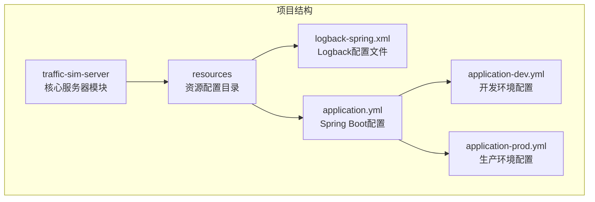
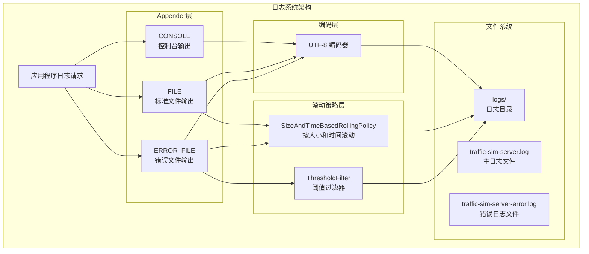
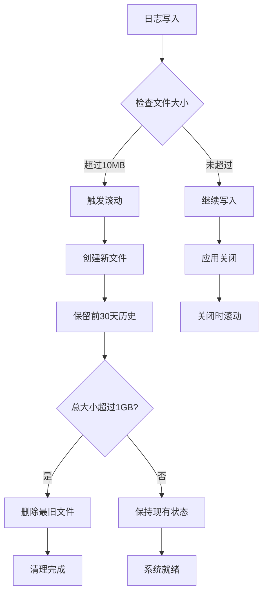
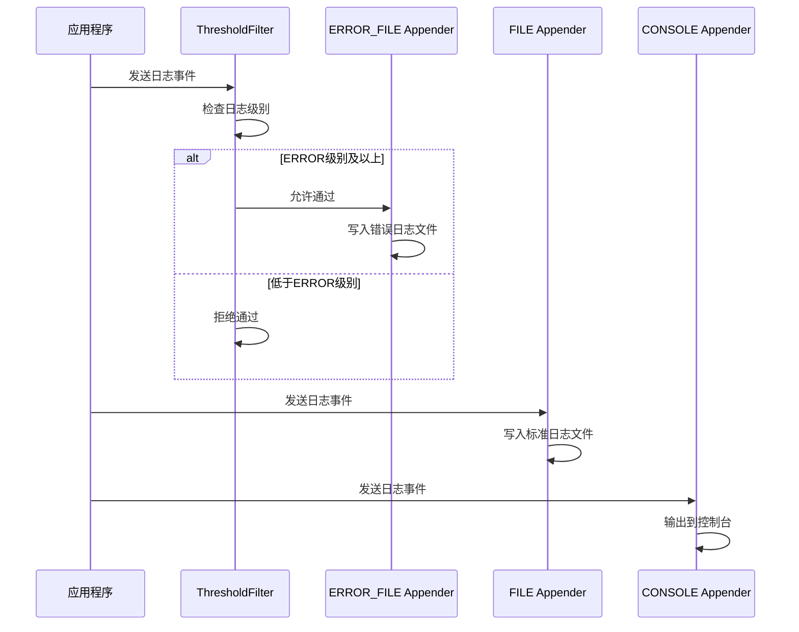
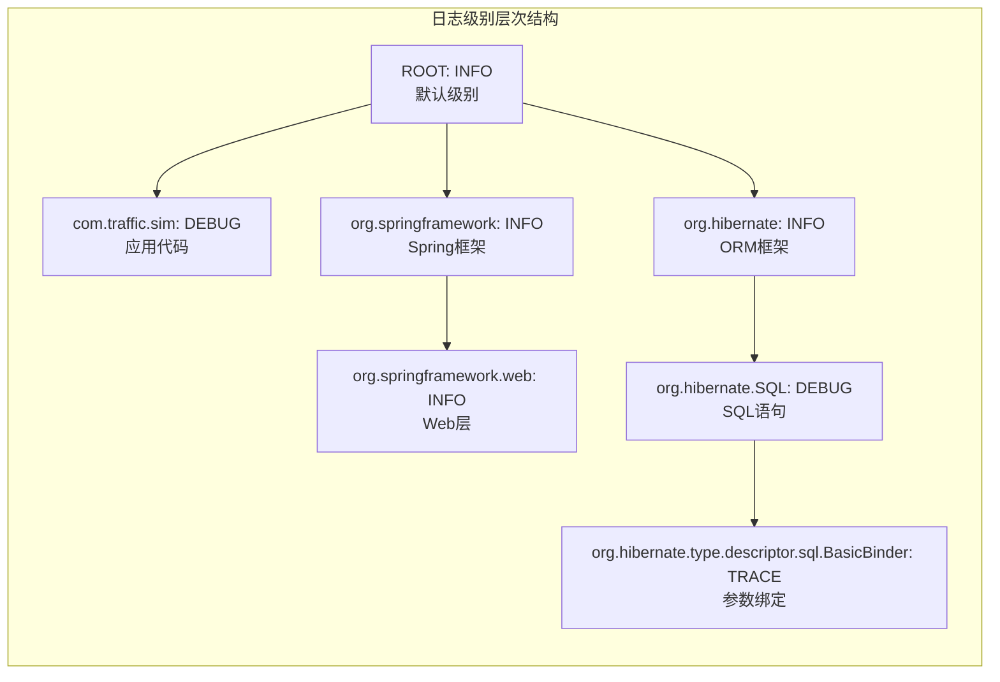
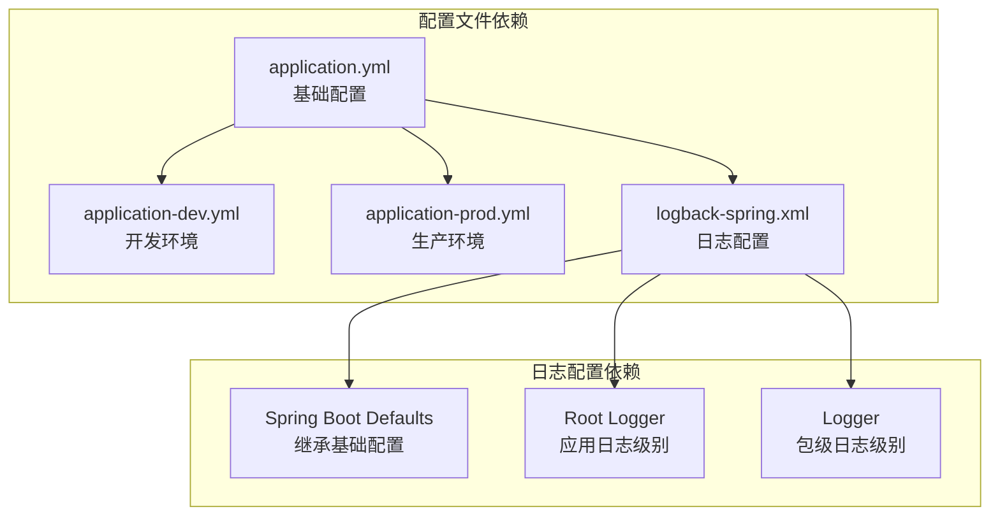
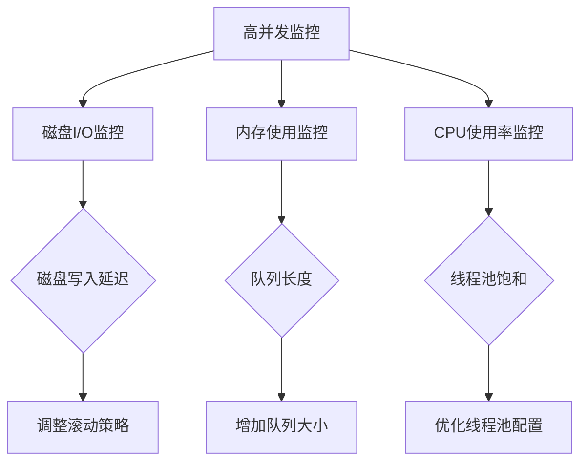

# 日志输出配置

<cite>
**本文档引用的文件**
- [logback-spring.xml](file://traffic-sim-server/src/main/resources/logback-spring.xml)
- [application.yml](file://traffic-sim-server/src/main/resources/application.yml)
- [application-dev.yml](file://traffic-sim-server/src/main/resources/application-dev.yml)
- [application-prod.yml](file://traffic-sim-server/src/main/resources/application-prod.yml)
- [TrafficSimApplication.java](file://traffic-sim-server/src/main/java/com/traffic/sim/TrafficSimApplication.java)
</cite>

## 目录
1. [简介](#简介)
2. [项目结构](#项目结构)
3. [核心组件](#核心组件)
4. [架构概览](#架构概览)
5. [详细组件分析](#详细组件分析)
6. [依赖关系分析](#依赖关系分析)
7. [性能考虑](#性能考虑)
8. [故障排除指南](#故障排除指南)
9. [结论](#结论)

## 简介

本文件深入解析了 `traffic-sim-server` 项目中的日志输出配置系统，重点分析了 Logback 中三种关键 Appender 的配置实现：CONSOLE 控制台输出、FILE 文件输出和 ERROR_FILE 错误日志输出。该配置系统采用 Spring Boot 的 Logback 集成，提供了完整的日志记录解决方案，包括 UTF-8 编码支持、按时间与大小的滚动策略、以及针对不同日志级别的差异化处理。

## 项目结构

该项目采用多模块 Maven 结构，日志配置位于核心服务器模块中：



**图表来源**
- [logback-spring.xml](file://traffic-sim-server/src/main/resources/logback-spring.xml#L1-L66)
- [application.yml](file://traffic-sim-server/src/main/resources/application.yml#L1-L117)

**章节来源**
- [logback-spring.xml](file://traffic-sim-server/src/main/resources/logback-spring.xml#L1-L66)
- [application.yml](file://traffic-sim-server/src/main/resources/application.yml#L1-L117)

## 核心组件

### Logback 配置概述

项目使用 Logback 作为日志实现框架，通过 `logback-spring.xml` 文件进行详细配置。该配置文件继承了 Spring Boot 的默认配置，然后在此基础上添加了自定义的日志输出策略。

### 三种核心 Appender 类型

系统配置了三种不同用途的 Appender：

1. **CONSOLE Appender** - 控制台输出，用于开发和调试阶段
2. **FILE Appender** - 标准日志文件输出，包含完整的日志信息
3. **ERROR_FILE Appender** - 错误日志专用输出，仅记录 ERROR 级别及以上的日志

**章节来源**
- [logback-spring.xml](file://traffic-sim-server/src/main/resources/logback-spring.xml#L5-L51)

## 架构概览



**图表来源**
- [logback-spring.xml](file://traffic-sim-server/src/main/resources/logback-spring.xml#L6-L44)

## 详细组件分析

### CONSOLE Appender 分析

CONSOLE Appender 是开发和调试阶段的主要日志输出工具，具有以下特点：

#### UTF-8 编码支持

- **字符集配置**：明确指定使用 UTF-8 字符集，确保国际化字符的正确显示
- **编码器设置**：通过 `<charset>UTF-8</charset>` 标签实现
- **兼容性保证**：支持中文、日文、韩文等多语言字符的完整显示

#### 日志格式化模式

- **时间戳格式**：`%d{yyyy-MM-dd HH:mm:ss.SSS}` 提供精确到毫秒的时间信息
- **线程信息**：`[%thread]` 显示当前执行线程名称
- **日志级别**：`%-5level` 左对齐显示日志级别（DEBUG/INFO/WARN/ERROR）
- **类名信息**：`%logger{50}` 显示类名，限制最大长度为50字符
- **消息内容**：`%msg` 显示实际日志消息
- **换行符**：`%n` 确保每条日志独立一行

**章节来源**
- [logback-spring.xml](file://traffic-sim-server/src/main/resources/logback-spring.xml#L6-L11)

### FILE Appender 分析

FILE Appender 负责标准日志的持久化存储，采用高级的滚动策略确保日志文件的有序管理和磁盘空间控制。

#### 滚动策略配置



**图表来源**
- [logback-spring.xml](file://traffic-sim-server/src/main/resources/logback-spring.xml#L14-L26)

#### 关键参数详解

- **文件路径**：`logs/traffic-sim-server.log` - 相对路径，自动创建 logs 目录
- **滚动策略**：`SizeAndTimeBasedRollingPolicy` - 同时基于时间和大小的滚动策略
- **文件命名模式**：`logs/traffic-sim-server.%d{yyyy-MM-dd}.%i.log` - 包含日期和序号
- **单文件大小限制**：`<maxFileSize>10MB</maxFileSize>` - 达到10MB时触发滚动
- **历史保留数量**：`<maxHistory>30</maxHistory>` - 最多保留30天的日志文件
- **总容量上限**：`<totalSizeCap>1GB</totalSizeCap>` - 防止磁盘空间无限增长

#### 滚动机制工作原理

1. **时间基滚动**：每天创建新的日志文件
2. **大小基滚动**：当单个文件达到10MB时创建新文件
3. **清理策略**：自动删除超过30天的历史文件
4. **容量控制**：当所有日志文件总和超过1GB时，优先删除最旧的文件

**章节来源**
- [logback-spring.xml](file://traffic-sim-server/src/main/resources/logback-spring.xml#L14-L26)

### ERROR_FILE Appender 分析

ERROR_FILE Appender 专门处理错误级别的日志，通过阈值过滤器实现日志级别的精确控制。

#### 过滤机制



**图表来源**
- [logback-spring.xml](file://traffic-sim-server/src/main/resources/logback-spring.xml#L29-L44)

#### 配置特点

- **过滤器类型**：`ch.qos.logback.classic.filter.ThresholdFilter`
- **过滤级别**：`<level>ERROR</level>` - 仅允许 ERROR 及以上级别的日志
- **独立存储**：错误日志单独写入 `logs/traffic-sim-server-error.log` 文件
- **容量限制**：总容量限制为 500MB，比标准日志文件更严格

#### 滚动策略一致性

ERROR_FILE Appender 采用了与 FILE Appender 相同的滚动策略：
- 同样的 `SizeAndTimeBasedRollingPolicy`
- 相同的 `maxFileSize` 和 `maxHistory` 设置
- 独立的 `totalSizeCap` 为 500MB

**章节来源**
- [logback-spring.xml](file://traffic-sim-server/src/main/resources/logback-spring.xml#L29-L44)

### 日志级别配置

系统通过根日志级别和特定包的日志级别实现了精细化的日志控制：



**图表来源**
- [logback-spring.xml](file://traffic-sim-server/src/main/resources/logback-spring.xml#L47-L63)

**章节来源**
- [logback-spring.xml](file://traffic-sim-server/src/main/resources/logback-spring.xml#L47-L63)

## 依赖关系分析

### 配置文件间的依赖关系



**图表来源**
- [application.yml](file://traffic-sim-server/src/main/resources/application.yml#L103-L117)
- [logback-spring.xml](file://traffic-sim-server/src/main/resources/logback-spring.xml#L3-L63)

### 环境特定配置

不同环境下的日志配置存在显著差异：

| 配置项 | 开发环境 | 生产环境 |
|--------|----------|----------|
| 根日志级别 | DEBUG | INFO |
| 应用包级别 | DEBUG | INFO |
| Web层级别 | DEBUG | INFO |
| 文件路径 | logs/traffic-sim-server.log | /var/log/traffic-sim/server.log |
| 文件大小限制 | 10MB | 10MB |
| 历史保留 | 30天 | 30天 |

**章节来源**
- [application-dev.yml](file://traffic-sim-server/src/main/resources/application-dev.yml#L17-L23)
- [application-prod.yml](file://traffic-sim-server/src/main/resources/application-prod.yml#L21-L28)

## 性能考虑

### 同步 vs 异步 Appender 性能对比

虽然当前配置使用同步 Appender，但在高并发场景下，异步 Appender 可以显著提升性能：

#### 同步 Appender 特点
- **优点**：实现简单，无额外开销，日志实时可见
- **缺点**：高并发时可能成为性能瓶颈，阻塞业务线程

#### 异步 Appender 优势
- **非阻塞写入**：通过队列缓冲，避免阻塞业务线程
- **批量处理**：减少磁盘 I/O 操作次数
- **背压控制**：防止日志风暴导致系统过载

### 高并发场景优化建议

#### 配置优化方案

1. **引入异步 Appender**
   ```xml
   <appender name="ASYNC_FILE" class="ch.qos.logback.classic.AsyncAppender">
       <appender-ref ref="FILE"/>
       <queueSize>1024</queueSize>
       <discardingThreshold>0</discardingThreshold>
   </appender>
   ```

2. **调整缓冲区大小**
   - 队列大小：根据峰值 QPS 调整至 1024-8192
   - 批处理大小：设置合理的批量写入阈值

3. **优化滚动策略**
   - 减少滚动频率：适当增大 `maxFileSize`
   - 延迟滚动：在业务低峰期进行滚动操作

#### 系统资源监控



## 故障排除指南

### 常见问题及解决方案

#### 日志文件无法创建

**问题现象**：应用程序启动时报错，提示无法创建日志文件

**可能原因**：
1. `logs/` 目录权限不足
2. 磁盘空间不足
3. 文件系统权限限制

**解决方案**：
1. 确保应用程序有写入权限
2. 检查磁盘空间是否充足
3. 在生产环境中使用绝对路径 `/var/log/traffic-sim/`

#### 日志编码问题

**问题现象**：控制台或文件中出现乱码

**可能原因**：
1. 终端编码不支持 UTF-8
2. 文件读取时编码设置错误

**解决方案**：
1. 确保终端使用 UTF-8 编码
2. 在查看文件时指定正确的编码格式

#### 磁盘空间耗尽

**问题现象**：系统磁盘空间持续增长

**可能原因**：
1. `totalSizeCap` 设置过大
2. 日志级别过高导致日志量激增

**解决方案**：
1. 调整 `totalSizeCap` 参数
2. 降低日志级别或优化日志输出
3. 定期清理历史日志

#### 性能问题诊断

**诊断步骤**：
1. 监控磁盘 I/O 操作
2. 检查日志文件大小增长速度
3. 分析日志级别分布
4. 评估滚动策略的有效性

**优化措施**：
1. 实施异步日志写入
2. 调整滚动策略参数
3. 优化日志格式和内容
4. 实施日志压缩和归档

**章节来源**
- [logback-spring.xml](file://traffic-sim-server/src/main/resources/logback-spring.xml#L14-L44)

## 结论

本日志配置系统通过精心设计的三种 Appender 实现了全面的日志管理需求：

1. **完整性**：覆盖从开发调试到生产监控的全生命周期
2. **可维护性**：清晰的滚动策略和容量控制机制
3. **可扩展性**：支持异步处理和环境特定配置
4. **可靠性**：完善的错误处理和性能监控能力

该配置系统为交通仿真系统的稳定运行提供了坚实的基础，能够有效支持高并发场景下的日志记录需求，同时确保系统资源的合理利用和长期可持续发展。