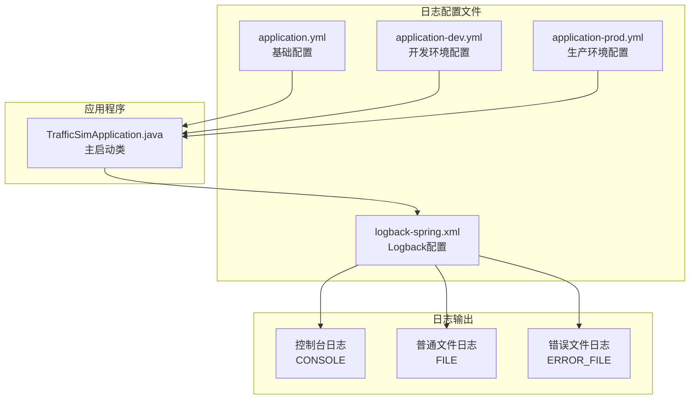
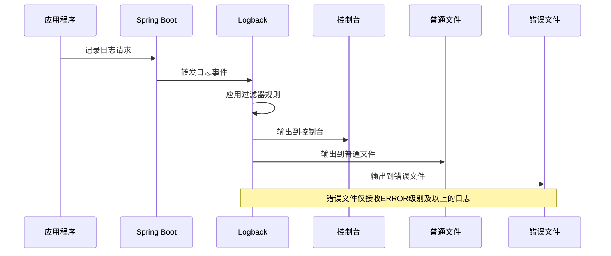
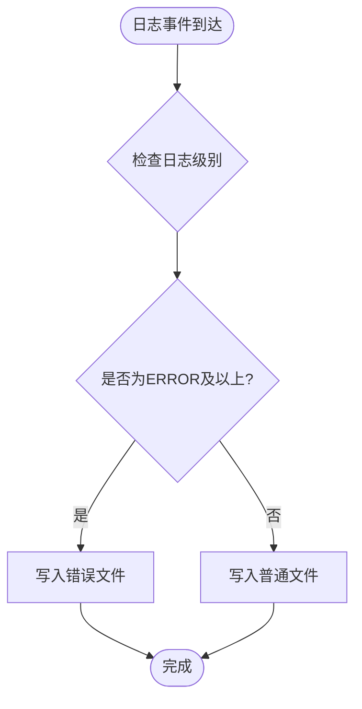
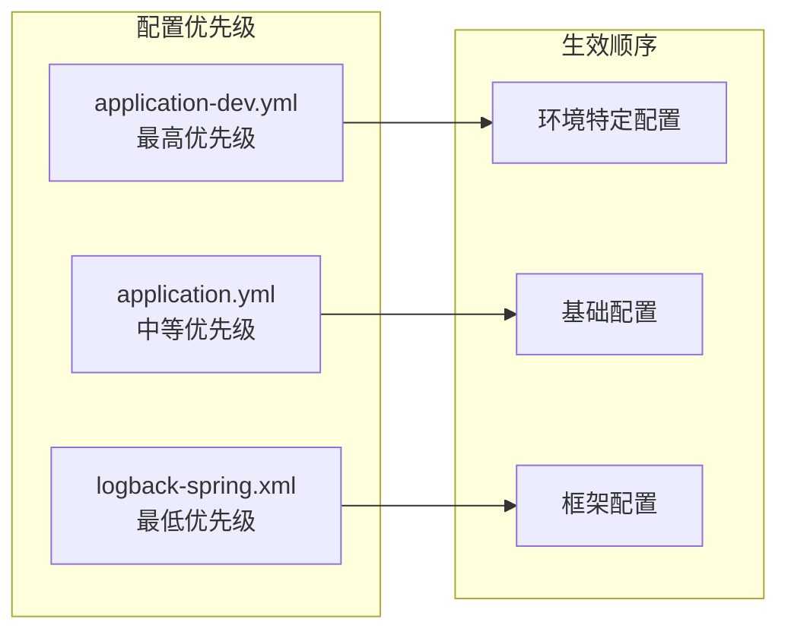
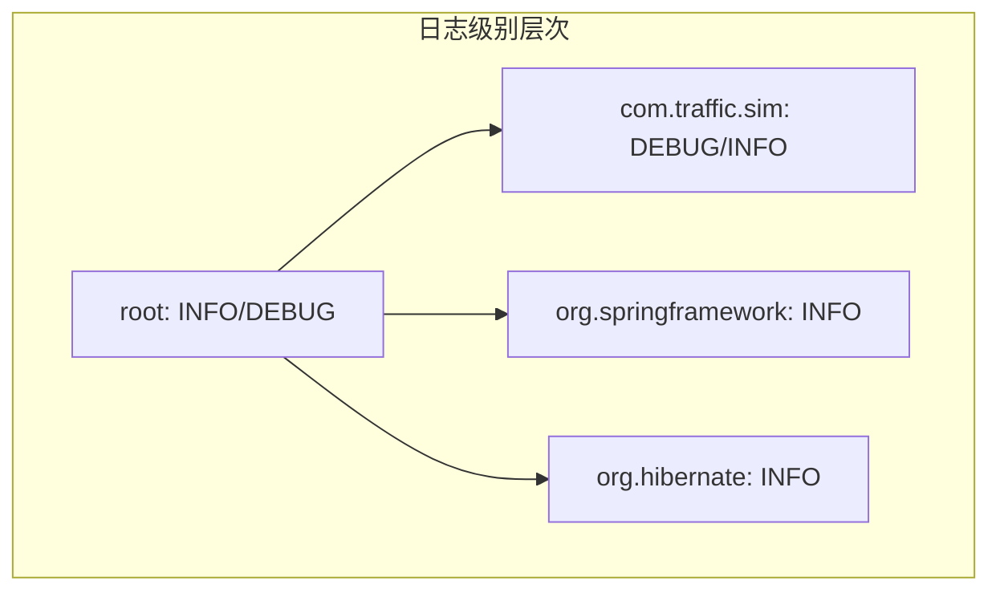
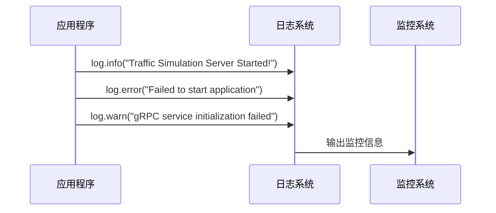

# 日志配置

<cite>
**本文档引用的文件**
- [application.yml](file://traffic-sim-server/src/main/resources/application.yml)
- [application-dev.yml](file://traffic-sim-server/src/main/resources/application-dev.yml)
- [application-prod.yml](file://traffic-sim-server/src/main/resources/application-prod.yml)
- [logback-spring.xml](file://traffic-sim-server/src/main/resources/logback-spring.xml)
- [TrafficSimApplication.java](file://traffic-sim-server/src/main/java/com/traffic/sim/TrafficSimApplication.java)
</cite>

## 目录
1. [简介](#简介)
2. [项目结构](#项目结构)
3. [核心组件](#核心组件)
4. [架构概览](#架构概览)
5. [详细组件分析](#详细组件分析)
6. [依赖关系分析](#依赖关系分析)
7. [性能考虑](#性能考虑)
8. [故障排除指南](#故障排除指南)
9. [结论](#结论)

## 简介

本文件详细介绍了交通模拟系统的日志配置方案，涵盖Spring Boot应用程序配置文件和Logback日志框架的完整配置体系。该系统采用多环境配置策略，通过不同的环境配置文件实现开发、测试和生产环境的日志级别差异化管理，并通过Logback的多种Appender实现日志的多样化输出和管理。

## 项目结构

交通模拟系统的日志配置主要分布在以下位置：



**图表来源**
- [application.yml](file://traffic-sim-server/src/main/resources/application.yml#L1-L117)
- [application-dev.yml](file://traffic-sim-server/src/main/resources/application-dev.yml#L1-L24)
- [application-prod.yml](file://traffic-sim-server/src/main/resources/application-prod.yml#L1-L29)
- [logback-spring.xml](file://traffic-sim-server/src/main/resources/logback-spring.xml#L1-L66)

**章节来源**
- [application.yml](file://traffic-sim-server/src/main/resources/application.yml#L1-L117)
- [application-dev.yml](file://traffic-sim-server/src/main/resources/application-dev.yml#L1-L24)
- [application-prod.yml](file://traffic-sim-server/src/main/resources/application-prod.yml#L1-L29)
- [logback-spring.xml](file://traffic-sim-server/src/main/resources/logback-spring.xml#L1-L66)

## 核心组件

### Spring Boot日志配置层次

系统采用三层日志配置架构：

1. **基础配置层** (`application.yml`)
   - 定义默认的日志级别和格式
   - 设置根日志级别为INFO
   - 配置应用特定包的日志级别为DEBUG

2. **环境配置层** (`application-dev.yml`, `application-prod.yml`)
   - 开发环境：所有日志级别降为DEBUG，便于调试
   - 生产环境：根级别提升至INFO，应用包级别为INFO，减少日志量

3. **框架配置层** (`logback-spring.xml`)
   - 定义具体的日志输出策略
   - 配置三种不同的Appender
   - 实现日志文件的滚动和管理

**章节来源**
- [application.yml](file://traffic-sim-server/src/main/resources/application.yml#L103-L117)
- [application-dev.yml](file://traffic-sim-server/src/main/resources/application-dev.yml#L17-L23)
- [application-prod.yml](file://traffic-sim-server/src/main/resources/application-prod.yml#L21-L28)

## 架构概览

系统日志架构采用分层设计，实现了配置的灵活性和可维护性：



**图表来源**
- [logback-spring.xml](file://traffic-sim-server/src/main/resources/logback-spring.xml#L47-L63)
- [TrafficSimApplication.java](file://traffic-sim-server/src/main/java/com/traffic/sim/TrafficSimApplication.java#L24-L41)

## 详细组件分析

### Logback配置详解

#### 控制台Appender (CONSOLE)

控制台Appender负责将日志输出到标准输出流，适用于开发和调试阶段：

```mermaid
classDiagram
class ConsoleAppender {
+encoder : PatternLayoutEncoder
+pattern : "%d{yyyy-MM-dd HH : mm : ss.SSS} [%thread] %-5level %logger{50} - %msg%n"
+charset : UTF-8
+immediateFlush : true
}
class PatternLayoutEncoder {
+pattern : 日志格式模式
+charset : 字符编码
}
ConsoleAppender --> PatternLayoutEncoder : 使用
```

**图表来源**
- [logback-spring.xml](file://traffic-sim-server/src/main/resources/logback-spring.xml#L5-L11)

#### 滚动文件Appender (FILE)

普通文件Appender实现了基于时间和大小的滚动策略：

```mermaid
classDiagram
class RollingFileAppender {
+file : logs/traffic-sim-server.log
+encoder : PatternLayoutEncoder
+rollingPolicy : SizeAndTimeBasedRollingPolicy
}
class SizeAndTimeBasedRollingPolicy {
+fileNamePattern : logs/traffic-sim-server.%d{yyyy-MM-dd}.%i.log
+maxFileSize : 10MB
+maxHistory : 30
+totalSizeCap : 1GB
}
RollingFileAppender --> SizeAndTimeBasedRollingPolicy : 使用
```

**图表来源**
- [logback-spring.xml](file://traffic-sim-server/src/main/resources/logback-spring.xml#L13-L26)

#### 错误文件Appender (ERROR_FILE)

错误文件Appender专门处理错误级别的日志，实现错误日志的独立存储：

```mermaid
classDiagram
class ErrorFileAppender {
+file : logs/traffic-sim-server-error.log
+encoder : PatternLayoutEncoder
+thresholdFilter : ThresholdFilter
+rollingPolicy : SizeAndTimeBasedRollingPolicy
}
class ThresholdFilter {
+level : ERROR
}
class SizeAndTimeBasedRollingPolicy {
+fileNamePattern : logs/traffic-sim-server-error.%d{yyyy-MM-dd}.%i.log
+maxFileSize : 10MB
+maxHistory : 30
+totalSizeCap : 500MB
}
ErrorFileAppender --> ThresholdFilter : 使用
ErrorFileAppender --> SizeAndTimeBasedRollingPolicy : 使用
```

**图表来源**
- [logback-spring.xml](file://traffic-sim-server/src/main/resources/logback-spring.xml#L28-L44)

### 滚动策略分析

#### SizeAndTimeBasedRollingPolicy配置

滚动策略结合了时间维度和大小维度的控制机制：

| 参数 | 值 | 说明 |
|------|-----|------|
| fileNamePattern | logs/traffic-sim-server.%d{yyyy-MM-dd}.%i.log | 按日期和序号命名的文件模式 |
| maxFileSize | 10MB | 单个文件的最大大小限制 |
| maxHistory | 30 | 保留的历史文件数量 |
| totalSizeCap | 1GB | 所有历史文件的总大小上限 |

#### 错误日志独立存储策略

错误文件Appender采用阈值过滤器，只接收ERROR级别及以上的日志：



**图表来源**
- [logback-spring.xml](file://traffic-sim-server/src/main/resources/logback-spring.xml#L29-L44)

### 环境配置差异

#### 开发环境配置

开发环境采用宽松的日志策略，便于问题排查：

- 根日志级别：DEBUG
- 应用包级别：DEBUG  
- Spring Web级别：DEBUG
- 日志输出：控制台 + 文件 + 错误文件

#### 生产环境配置

生产环境采用严格的日志策略，控制日志量：

- 根日志级别：INFO
- 应用包级别：INFO
- 日志输出：控制台 + 文件 + 错误文件
- 日志路径：/var/log/traffic-sim/server.log

**章节来源**
- [application-dev.yml](file://traffic-sim-server/src/main/resources/application-dev.yml#L17-L23)
- [application-prod.yml](file://traffic-sim-server/src/main/resources/application-prod.yml#L21-L28)

## 依赖关系分析

### 配置优先级关系

系统采用多层配置合并机制，确定最终的日志配置：



**图表来源**
- [application.yml](file://traffic-sim-server/src/main/resources/application.yml#L103-L117)
- [application-dev.yml](file://traffic-sim-server/src/main/resources/application-dev.yml#L17-L23)
- [application-prod.yml](file://traffic-sim-server/src/main/resources/application-prod.yml#L21-L28)

### 日志级别继承关系



**图表来源**
- [application.yml](file://traffic-sim-server/src/main/resources/application.yml#L105-L109)
- [application-dev.yml](file://traffic-sim-server/src/main/resources/application-dev.yml#L19-L22)
- [application-prod.yml](file://traffic-sim-server/src/main/resources/application-prod.yml#L23-L25)

**章节来源**
- [application.yml](file://traffic-sim-server/src/main/resources/application.yml#L103-L117)
- [application-dev.yml](file://traffic-sim-server/src/main/resources/application-dev.yml#L17-L23)
- [application-prod.yml](file://traffic-sim-server/src/main/resources/application-prod.yml#L21-L28)

## 性能考虑

### 日志级别优化

1. **开发环境优化**
   - DEBUG级别提供详细的调试信息
   - 适合本地开发和问题定位
   - 可能影响性能，不适合生产环境

2. **生产环境优化**
   - INFO级别平衡信息完整性和性能
   - 减少不必要的日志输出
   - 提高系统整体性能

### 文件滚动策略优化

1. **大小控制**
   - 单文件最大10MB，避免单个文件过大
   - 历史文件保留30个，平衡存储空间和历史记录

2. **总容量控制**
   - 普通文件总容量1GB
   - 错误文件总容量500MB
   - 防止磁盘空间被日志占用过多

### 输出性能优化

1. **异步输出**
   - 控制台输出即时可见
   - 文件输出批量写入
   - 错误文件独立处理

2. **字符集优化**
   - 统一使用UTF-8编码
   - 支持中文日志输出
   - 避免编码转换开销

## 故障排除指南

### 常见问题及解决方案

#### 日志级别不生效

**问题描述**：修改日志级别后，应用仍然输出相同级别的日志

**解决步骤**：
1. 检查环境配置文件是否正确加载
2. 验证配置文件的YAML格式
3. 确认配置项的正确性

#### 日志文件未生成

**问题描述**：应用启动后没有生成日志文件

**解决步骤**：
1. 检查日志目录权限
2. 验证文件路径配置
3. 确认磁盘空间充足

#### 日志滚动异常

**问题描述**：日志文件没有按预期滚动

**解决步骤**：
1. 检查磁盘空间是否足够
2. 验证文件权限设置
3. 确认时间同步状态

### 监控和诊断

#### 启动时的日志监控

应用程序启动时会输出启动成功和失败的信息：



**图表来源**
- [TrafficSimApplication.java](file://traffic-sim-server/src/main/java/com/traffic/sim/TrafficSimApplication.java#L27-L38)

**章节来源**
- [TrafficSimApplication.java](file://traffic-sim-server/src/main/java/com/traffic/sim/TrafficSimApplication.java#L24-L41)

## 结论

本日志配置方案通过多层次的设计实现了灵活且高效的日志管理：

1. **多环境支持**：开发、测试、生产环境采用不同的日志级别策略
2. **多样化输出**：控制台、普通文件、错误文件三种输出方式满足不同需求
3. **智能滚动**：基于时间和大小的滚动策略确保日志管理的有效性
4. **性能优化**：合理的配置在保证信息完整性的同时控制资源消耗

该配置方案为交通模拟系统的运维提供了坚实的基础，既满足了开发调试的需求，又保证了生产环境的稳定运行。