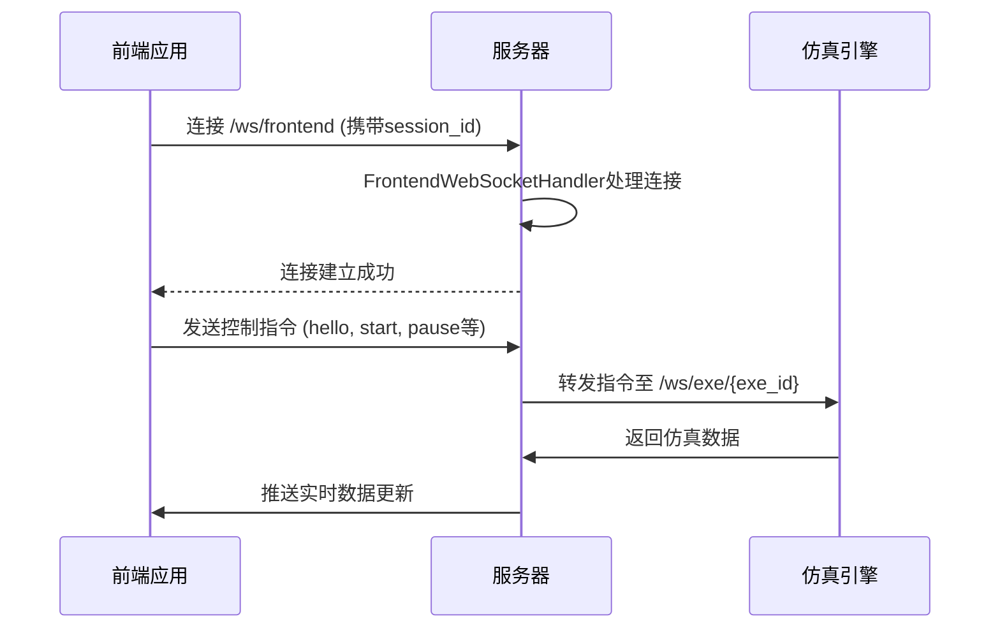
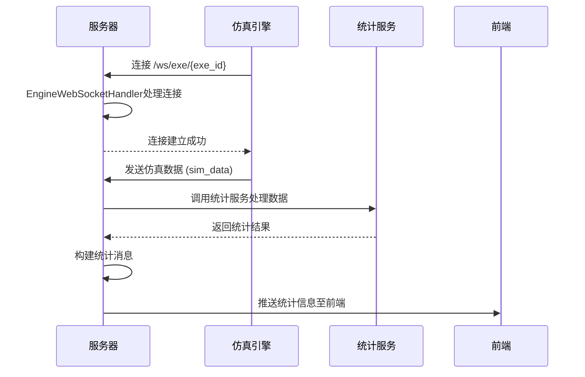
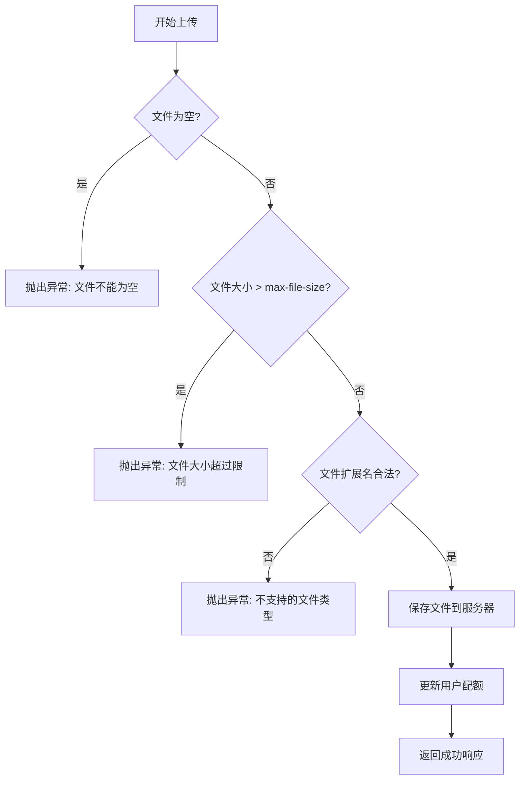
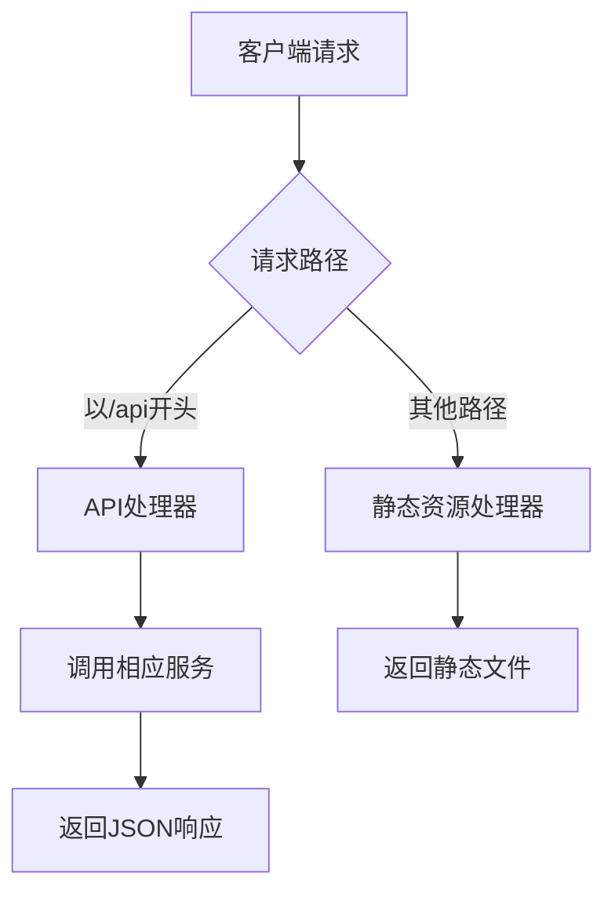

# 服务与通信配置

<cite>
**本文档引用文件**  
- [application.yml](file://traffic-sim-server/src/main/resources/application.yml)
- [application-dev.yml](file://traffic-sim-server/src/main/resources/application-dev.yml)
- [application-prod.yml](file://traffic-sim-server/src/main/resources/application-prod.yml)
- [WebSocketConfig.java](file://plugins/plugin-engine-manager/src/main/java/com/traffic/sim/plugin/engine/manager/config/WebSocketConfig.java)
- [FrontendWebSocketHandler.java](file://plugins/plugin-engine-manager/src/main/java/com/traffic/sim/plugin/engine/manager/websocket/FrontendWebSocketHandler.java)
- [EngineWebSocketHandler.java](file://plugins/plugin-engine-manager/src/main/java/com/traffic/sim/plugin/engine/manager/websocket/EngineWebSocketHandler.java)
- [EngineManagerProperties.java](file://plugins/plugin-engine-manager/src/main/java/com/traffic/sim/plugin/engine/manager/config/EngineManagerProperties.java)
- [MapPluginProperties.java](file://plugins/plugin-map/src/main/java/com/traffic/sim/plugin/map/config/MapPluginProperties.java)
- [MapServiceImpl.java](file://plugins/plugin-map/src/main/java/com/traffic/sim/plugin/map/service/MapServiceImpl.java)
- [MapApiController.java](file://plugins/plugin-map/src/main/java/com/traffic/sim/plugin/map/controller/MapApiController.java)
- [WebConfig.java](file://traffic-sim-server/src/main/java/com/traffic/sim/config/WebConfig.java)
</cite>

## 目录
1. [引言](#引言)
2. [WebSocket配置](#websocket配置)
3. [文件上传配置](#文件上传配置)
4. [API基础路径配置](#api基础路径配置)
5. [文件上传失败解决方案](#文件上传失败解决方案)
6. [WebSocket连接异常排查](#websocket连接异常排查)
7. [结论](#结论)

## 引言
本文档详细说明交通仿真系统中的服务与通信配置，重点阐述WebSocket实时通信机制、文件上传限制设置以及API请求路径配置。通过分析系统核心配置文件和相关组件，为开发和运维人员提供清晰的配置说明和问题排查指南。

## WebSocket配置

### frontend路径配置
`app.websocket.frontend` 配置项定义了前端WebSocket连接的路径，其值为 `/ws/frontend`。该路径用于建立前端用户界面与服务器之间的实时双向通信通道。

前端通过此连接接收仿真状态更新、统计信息等实时数据，并向服务器发送用户操作指令（如启动、暂停仿真）。连接建立时，系统从Cookie中提取 `id` 字段作为会话标识（session_id），用于关联用户会话。

**Diagram sources**
- [application.yml](file://traffic-sim-server/src/main/resources/application.yml#L93-L95)
- [FrontendWebSocketHandler.java](file://plugins/plugin-engine-manager/src/main/java/com/traffic/sim/plugin/engine/manager/websocket/FrontendWebSocketHandler.java#L19-L187)

**Section sources**
- [application.yml](file://traffic-sim-server/src/main/resources/application.yml#L92-L96)
- [WebSocketConfig.java](file://plugins/plugin-engine-manager/src/main/java/com/traffic/sim/plugin/engine/manager/config/WebSocketConfig.java#L25-L34)

### engine路径配置
`app.websocket.engine` 配置项定义了仿真引擎WebSocket连接的路径，其值为 `/ws/exe`。该路径用于服务器与Python仿真引擎之间的实时交互。

仿真引擎通过此路径连接到服务器，路径中包含 `{exe_id}` 参数，该参数与用户会话ID（session_id）对应。服务器通过 `extractExeId` 方法从URI中提取该ID，用于关联仿真会话。此连接用于接收前端转发的控制指令，并向服务器推送仿真过程中的实时数据。

**Diagram sources**
- [application.yml](file://traffic-sim-server/src/main/resources/application.yml#L96)
- [EngineWebSocketHandler.java](file://plugins/plugin-engine-manager/src/main/java/com/traffic/sim/plugin/engine/manager/websocket/EngineWebSocketHandler.java#L1-L272)

**Section sources**
- [application.yml](file://traffic-sim-server/src/main/resources/application.yml#L96)
- [EngineManagerProperties.java](file://plugins/plugin-engine-manager/src/main/java/com/traffic/sim/plugin/engine/manager/config/EngineManagerProperties.java#L26)

## 文件上传配置

### max-file-size配置
`app.upload.max-file-size` 配置项设置了单个文件上传的最大大小限制，当前值为 `100MB`。该配置直接影响地图文件上传功能，防止用户上传过大的文件导致服务器资源耗尽。

在 `MapServiceImpl` 服务中，系统会在文件上传前进行验证，如果文件大小超过此限制，将抛出业务异常并返回错误信息。此限制是Spring框架级别的配置，确保在文件上传过程中就能拦截超大文件。

**Diagram sources**
- [MapServiceImpl.java](file://plugins/plugin-map/src/main/java/com/traffic/sim/plugin/map/service/MapServiceImpl.java#L314-L323)
- [MapPluginProperties.java](file://plugins/plugin-map/src/main/java/com/traffic/sim/plugin/map/config/MapPluginProperties.java#L56)

**Section sources**
- [application.yml](file://traffic-sim-server/src/main/resources/application.yml#L100)
- [MapPluginProperties.java](file://plugins/plugin-map/src/main/java/com/traffic/sim/plugin/map/config/MapPluginProperties.java#L56)

### max-request-size配置
`app.upload.max-request-size` 配置项设置了整个HTTP请求的最大大小限制，当前值为 `100MB`。该配置不仅限制了单个文件的大小，还限制了整个上传请求（包括文件和其他表单数据）的总大小。

此配置是Spring Boot的 `multipart` 配置的一部分，确保服务器不会接收过大的请求体。当用户上传地图文件时，如果请求总大小超过此限制，Spring框架会在请求处理早期就拒绝该请求，返回HTTP 413（Payload Too Large）错误。

**Section sources**
- [application.yml](file://traffic-sim-server/src/main/resources/application.yml#L101)

## API基础路径配置
`server.servlet.context-path` 配置项设置了所有API请求的基础路径，当前值为 `/api`。这意味着所有后端API接口的完整路径都将以 `/api` 作为前缀。

例如，地图上传接口的实际访问路径为 `/api/api/map/upload`（由于控制器中也定义了 `/api` 前缀，实际为双重前缀，需注意配置一致性）。此配置使得API接口与静态资源或其他服务路径分离，便于反向代理和路径管理。

该配置在 `WebConfig` 类中通过跨域设置进一步增强，允许所有来源访问以 `/api` 开头的路径，支持常见的HTTP方法，并允许携带凭据。

**Diagram sources**
- [WebConfig.java](file://traffic-sim-server/src/main/java/com/traffic/sim/config/WebConfig.java#L20-L26)
- [application.yml](file://traffic-sim-server/src/main/resources/application.yml#L52)

**Section sources**
- [application.yml](file://traffic-sim-server/src/main/resources/application.yml#L52)
- [WebConfig.java](file://traffic-sim-server/src/main/java/com/traffic/sim/config/WebConfig.java#L19-L28)

## 文件上传失败解决方案

### 文件过大导致上传失败
当用户上传的地图文件超过 `max-file-size` 或 `max-request-size` 限制时，系统会拒绝上传请求。解决方案包括：

1. **调整配置限制**：在 `application.yml` 中适当增加 `max-file-size` 和 `max-request-size` 的值，但需考虑服务器内存和磁盘资源。
2. **前端文件大小验证**：在前端上传界面添加文件大小检查，提前告知用户文件过大，避免不必要的上传请求。
3. **分片上传**：实现文件分片上传机制，将大文件分割成多个小块分别上传，最后在服务器端合并。
4. **压缩文件**：提示用户在上传前对地图文件进行压缩，减小文件体积。

**Section sources**
- [application.yml](file://traffic-sim-server/src/main/resources/application.yml#L100-L101)
- [MapServiceImpl.java](file://plugins/plugin-map/src/main/java/com/traffic/sim/plugin/map/service/MapServiceImpl.java#L314-L323)

## WebSocket连接异常排查

### 连接建立失败
当WebSocket连接无法建立时，可能的原因和排查步骤包括：

1. **检查URL路径**：确认前端连接的路径是否为 `/ws/frontend`，仿真引擎连接的路径是否为 `/ws/exe/{exe_id}`。
2. **验证会话ID**：前端连接时确保Cookie中包含有效的 `id` 字段；仿真引擎连接时确保URI中包含正确的 `exe_id`。
3. **检查跨域配置**：确认 `WebConfig` 中的跨域设置是否允许当前来源访问WebSocket。
4. **查看日志信息**：检查服务器日志中 `FrontendWebSocketHandler` 和 `EngineWebSocketHandler` 的连接日志，定位具体错误原因。

### 消息传输异常
当WebSocket连接建立成功但消息无法正常传输时：

1. **检查消息格式**：确保发送的WebSocket消息符合 `WebSocketInfo` 结构，包含正确的 `type` 和 `ope` 字段。
2. **验证会话状态**：确认前端和引擎都已完成初始化握手（`hello` 消息交换）。
3. **查看网络状况**：检查网络连接是否稳定，是否存在防火墙或代理阻断WebSocket连接。
4. **监控服务器资源**：检查服务器内存和CPU使用情况，确保没有资源耗尽导致消息处理延迟或失败。

**Section sources**
- [FrontendWebSocketHandler.java](file://plugins/plugin-engine-manager/src/main/java/com/traffic/sim/plugin/engine/manager/websocket/FrontendWebSocketHandler.java#L43-L187)
- [EngineWebSocketHandler.java](file://plugins/plugin-engine-manager/src/main/java/com/traffic/sim/plugin/engine/manager/websocket/EngineWebSocketHandler.java#L53-L272)
- [WebConfig.java](file://traffic-sim-server/src/main/java/com/traffic/sim/config/WebConfig.java#L19-L28)

## 结论
本文档详细阐述了交通仿真系统中的关键服务与通信配置。WebSocket配置通过 `frontend` 和 `engine` 两个路径实现了前后端实时通信和仿真引擎交互的分离与协同。文件上传配置通过 `max-file-size` 和 `max-request-size` 有效控制了地图文件上传的大小限制，保障了系统稳定性。API基础路径配置通过 `context-path` 实现了接口的统一管理。针对可能出现的文件上传失败和WebSocket连接异常，提供了具体的解决方案和排查方法，为系统的稳定运行提供了保障。