# 配置管理

<cite>
**本文档中引用的文件**  
- [application.yml](file://traffic-sim-server/src/main/resources/application.yml)
- [application-dev.yml](file://traffic-sim-server/src/main/resources/application-dev.yml)
- [application-prod.yml](file://traffic-sim-server/src/main/resources/application-prod.yml)
- [logback-spring.xml](file://traffic-sim-server/src/main/resources/logback-spring.xml)
- [docker-compose.yml](file://infrastructure/docker-compose.yml)
- [docker-compose.core.yml](file://infrastructure/docker-compose.core.yml)
- [docker-compose.mongodb.yml](file://infrastructure/docker-compose.mongodb.yml)
- [init.sql](file://infrastructure/init.sql)
- [my.cnf](file://infrastructure/mysql/conf/my.cnf)
- [redis.conf](file://infrastructure/redis/redis.conf)
- [AuthPluginProperties.java](file://plugins/plugin-auth/src/main/java/com/traffic/sim/plugin/auth/config/AuthPluginProperties.java)
- [plugin-user\src\main\resources\application.yml](file://plugins/plugin-user/src/main/resources/application.yml)
</cite>

## 目录
1. [简介](#简介)
2. [项目结构](#项目结构)
3. [核心配置文件分析](#核心配置文件分析)
4. [服务器与端口配置](#服务器与端口配置)
5. [数据库连接配置](#数据库连接配置)
6. [Redis配置](#redis配置)
7. [日志配置](#日志配置)
8. [插件特定属性配置](#插件特定属性配置)
9. [Docker Compose基础设施配置](#docker-compose基础设施配置)
10. [配置最佳实践](#配置最佳实践)
11. [结论](#结论)

## 简介
本配置管理文档系统性地解释了交通仿真系统中的所有配置项，涵盖主应用配置文件`application.yml`及其环境特定文件（开发、生产环境），详细说明了服务器端口、数据库连接（MySQL, MongoDB）、Redis配置、日志设置以及各插件的特定属性。文档还深入分析了通过Docker Compose管理基础设施的配置策略，包括服务定义、网络和卷的配置。最后提供了配置最佳实践，重点关注敏感信息的管理和不同环境的配置策略。

## 项目结构
该项目采用模块化设计，主要分为前端、基础设施、地图转换服务、多个功能插件、通用组件和主服务器模块。基础设施目录包含完整的Docker配置，支持本地开发和生产环境部署。

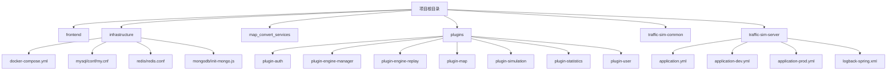

**Diagram sources**
- [infrastructure/docker-compose.yml](file://infrastructure/docker-compose.yml)
- [traffic-sim-server/src/main/resources/application.yml](file://traffic-sim-server/src/main/resources/application.yml)

**Section sources**
- [infrastructure](file://infrastructure)
- [traffic-sim-server](file://traffic-sim-server)

## 核心配置文件分析
系统使用Spring Boot的配置文件体系，通过`application.yml`作为基础配置，`application-dev.yml`和`application-prod.yml`分别覆盖开发和生产环境的特定配置。这种分层配置机制允许在不同环境中灵活调整参数，同时保持核心配置的一致性。

**Section sources**
- [traffic-sim-server/src/main/resources/application.yml](file://traffic-sim-server/src/main/resources/application.yml)
- [traffic-sim-server/src/main/resources/application-dev.yml](file://traffic-sim-server/src/main/resources/application-dev.yml)
- [traffic-sim-server/src/main/resources/application-prod.yml](file://traffic-sim-server/src/main/resources/application-prod.yml)

## 服务器与端口配置
服务器配置定义了应用的网络监听端口和上下文路径。在基础配置中，服务器端口设置为8080，上下文路径为`/api`，这意味着所有API端点都通过`http://localhost:8080/api`访问。

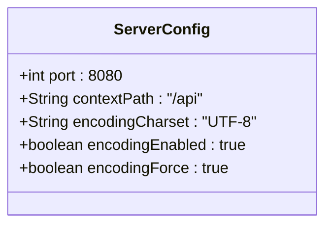

**Diagram sources**
- [traffic-sim-server/src/main/resources/application.yml](file://traffic-sim-server/src/main/resources/application.yml#L48-L57)

**Section sources**
- [traffic-sim-server/src/main/resources/application.yml](file://traffic-sim-server/src/main/resources/application.yml#L48-L57)

## 数据库连接配置
系统配置了MySQL和MongoDB两种数据库。MySQL作为主关系型数据库，用于存储用户、角色、权限等结构化数据；MongoDB作为文档数据库，用于存储地图等非结构化数据。

### MySQL配置
MySQL配置包括JDBC连接URL、用户名、密码以及Hikari连接池参数。连接URL中包含了时区、字符编码等重要参数，确保数据正确存储和读取。

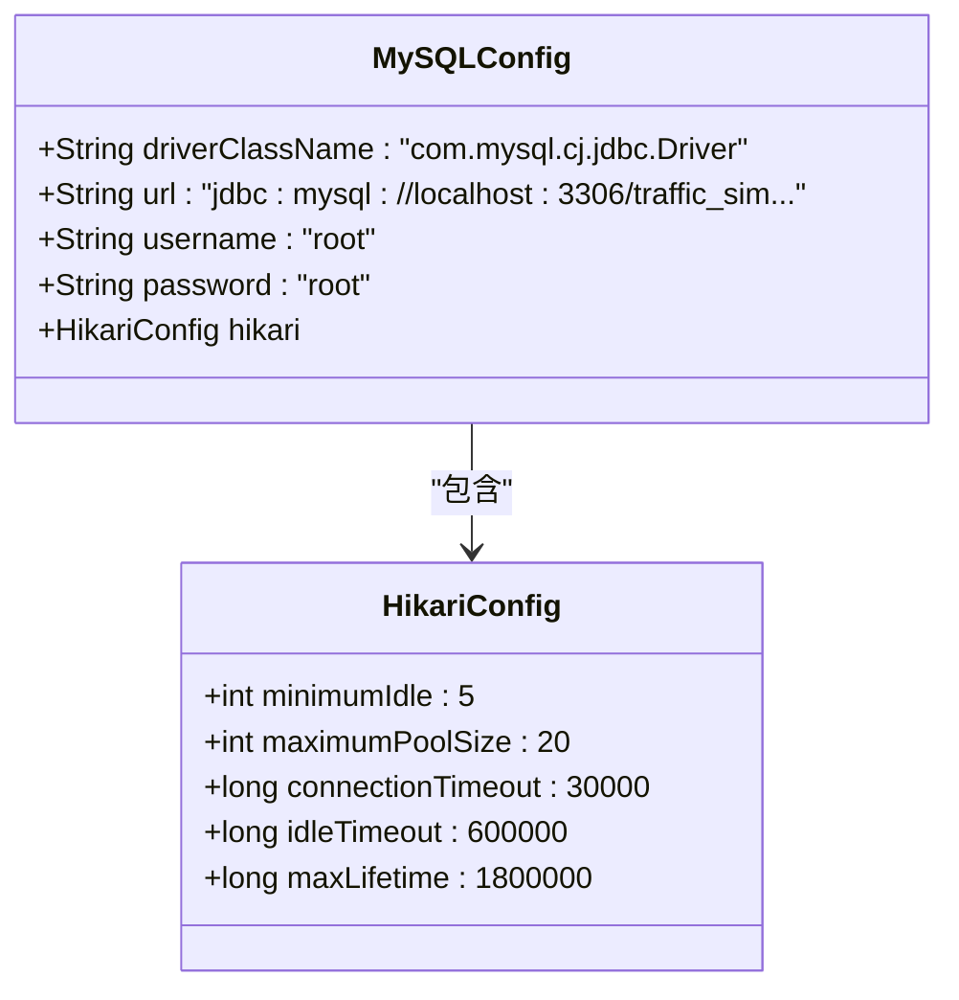

**Diagram sources**
- [traffic-sim-server/src/main/resources/application.yml](file://traffic-sim-server/src/main/resources/application.yml#L6-L17)
- [infrastructure/mysql/conf/my.cnf](file://infrastructure/mysql/conf/my.cnf)

**Section sources**
- [traffic-sim-server/src/main/resources/application.yml](file://traffic-sim-server/src/main/resources/application.yml#L6-L17)
- [infrastructure/mysql/conf/my.cnf](file://infrastructure/mysql/conf/my.cnf)
- [infrastructure/init.sql](file://infrastructure/init.sql)

### MongoDB配置
MongoDB配置使用URI方式，包含了认证信息和数据库名称。这种配置方式更加简洁，将所有连接信息集中在一个字符串中。

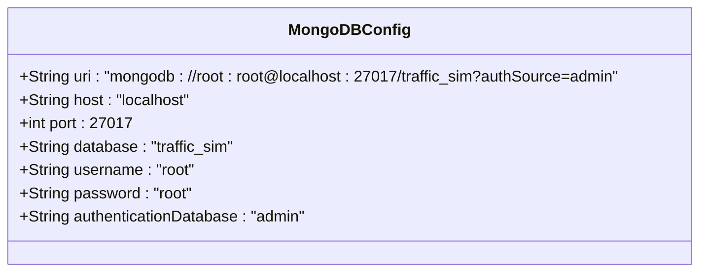

**Diagram sources**
- [traffic-sim-server/src/main/resources/application.yml](file://traffic-sim-server/src/main/resources/application.yml#L28-L40)

**Section sources**
- [traffic-sim-server/src/main/resources/application.yml](file://traffic-sim-server/src/main/resources/application.yml#L28-L40)
- [infrastructure/mongodb/init-mongo.js](file://infrastructure/mongodb/init-mongo.js)

## Redis配置
Redis配置主要在Docker Compose文件和Redis配置文件中定义。Redis作为缓存服务，配置了密码保护和AOF持久化机制，确保数据安全和可靠性。

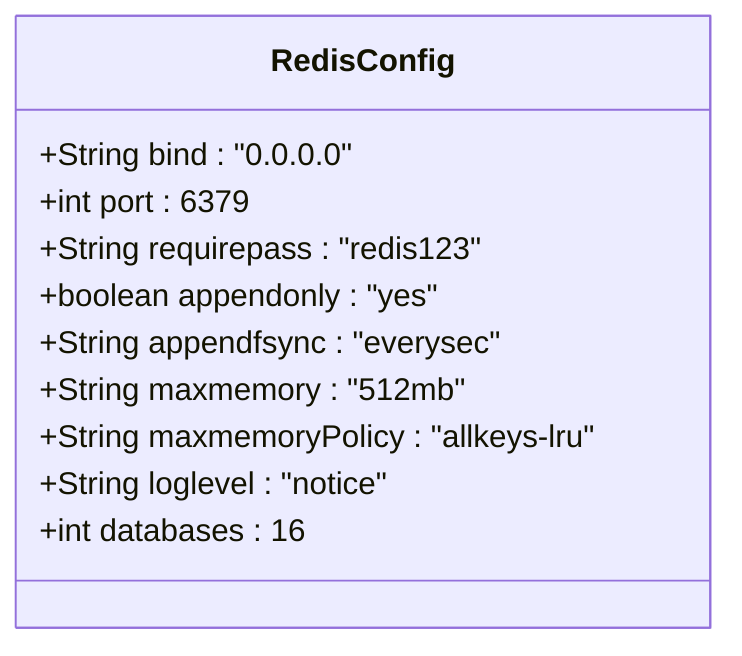

**Diagram sources**
- [infrastructure/redis/redis.conf](file://infrastructure/redis/redis.conf)
- [infrastructure/docker-compose.yml](file://infrastructure/docker-compose.yml#L71-L89)

**Section sources**
- [infrastructure/redis/redis.conf](file://infrastructure/redis/redis.conf)
- [infrastructure/docker-compose.yml](file://infrastructure/docker-compose.yml#L71-L89)

## 日志配置
系统使用Logback作为日志框架，通过`logback-spring.xml`文件进行详细配置。配置了控制台输出、文件输出和错误日志单独输出三种appender，实现了日志的分级管理和存储。

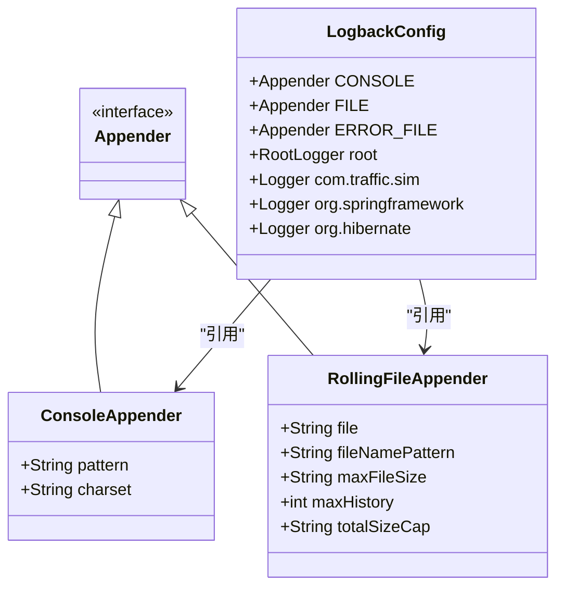

**Diagram sources**
- [traffic-sim-server/src/main/resources/logback-spring.xml](file://traffic-sim-server/src/main/resources/logback-spring.xml)
- [traffic-sim-server/src/main/resources/application.yml](file://traffic-sim-server/src/main/resources/application.yml#L104-L117)

**Section sources**
- [traffic-sim-server/src/main/resources/logback-spring.xml](file://traffic-sim-server/src/main/resources/logback-spring.xml)
- [traffic-sim-server/src/main/resources/application.yml](file://traffic-sim-server/src/main/resources/application.yml#L104-L117)

## 插件特定属性配置
系统采用插件化架构，每个插件都有自己的配置属性。这些配置通过`@ConfigurationProperties`注解绑定到Java类，实现了类型安全的配置管理。

### 认证插件配置
认证插件（plugin-auth）的配置包含了JWT、密码和验证码三个方面的设置。JWT配置是安全性的核心，定义了密钥、访问令牌和刷新令牌的过期时间。

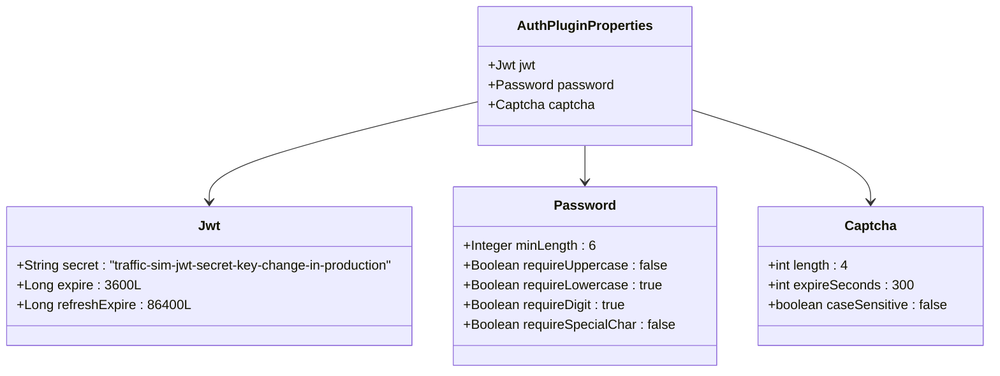

**Diagram sources**
- [plugins/plugin-auth/src/main/java/com/traffic/sim/plugin/auth/config/AuthPluginProperties.java](file://plugins/plugin-auth/src/main/java/com/traffic/sim/plugin/auth/config/AuthPluginProperties.java)
- [plugins/plugin-auth/src/main/resources/META-INF/spring/org.springframework.boot.autoconfigure.AutoConfiguration.imports](file://plugins/plugin-auth/src/main/resources/META-INF/spring/org.springframework.boot.autoconfigure.AutoConfiguration.imports)

**Section sources**
- [plugins/plugin-auth/src/main/java/com/traffic/sim/plugin/auth/config/AuthPluginProperties.java](file://plugins/plugin-auth/src/main/java/com/traffic/sim/plugin/auth/config/AuthPluginProperties.java)

### 用户插件配置
用户插件（plugin-user）的配置相对简单，主要定义了默认角色和密码加密方式。

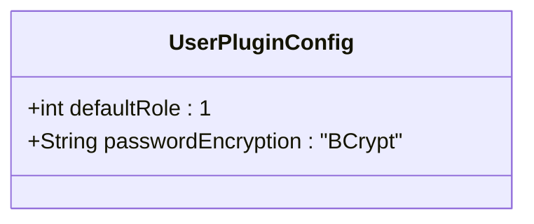

**Diagram sources**
- [plugins/plugin-user/src/main/resources/application.yml](file://plugins/plugin-user/src/main/resources/application.yml)

**Section sources**
- [plugins/plugin-user/src/main/resources/application.yml](file://plugins/plugin-user/src/main/resources/application.yml)

## Docker Compose基础设施配置
Docker Compose配置文件定义了整个系统的基础设施，包括MySQL、MongoDB、Redis、Kafka和Zookeeper等多个服务。通过`docker-compose.yml`文件，可以一键启动所有依赖服务。

### 主要服务定义
系统定义了多个核心服务，每个服务都有详细的配置，包括镜像、容器名称、环境变量、端口映射、数据卷和健康检查。

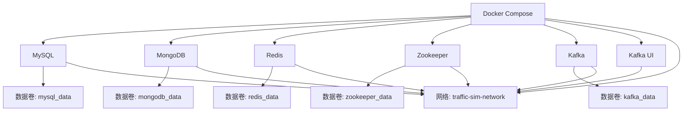

**Diagram sources**
- [infrastructure/docker-compose.yml](file://infrastructure/docker-compose.yml)
- [infrastructure/docker-compose.core.yml](file://infrastructure/docker-compose.core.yml)

**Section sources**
- [infrastructure/docker-compose.yml](file://infrastructure/docker-compose.yml)
- [infrastructure/docker-compose.core.yml](file://infrastructure/docker-compose.core.yml)
- [infrastructure/docker-compose.mongodb.yml](file://infrastructure/docker-compose.mongodb.yml)

### 网络与数据卷
系统定义了一个名为`traffic-sim-network`的自定义桥接网络，所有服务都连接到这个网络，实现了服务间的通信隔离和安全。同时，为每个持久化服务定义了独立的数据卷，确保数据的持久化存储。

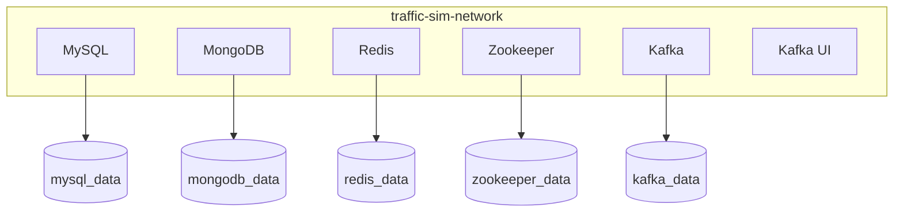

**Diagram sources**
- [infrastructure/docker-compose.yml](file://infrastructure/docker-compose.yml#L229-L252)

**Section sources**
- [infrastructure/docker-compose.yml](file://infrastructure/docker-compose.yml#L229-L252)

## 配置最佳实践
基于对系统配置的深入分析，以下是配置管理的最佳实践建议。

### 环境特定配置策略
系统采用了Spring Profile机制，通过`application-{profile}.yml`文件实现环境特定配置。开发环境使用`application-dev.yml`，生产环境使用`application-prod.yml`，基础配置在`application.yml`中定义。

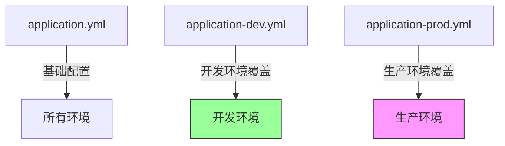

**Diagram sources**
- [traffic-sim-server/src/main/resources/application.yml](file://traffic-sim-server/src/main/resources/application.yml)
- [traffic-sim-server/src/main/resources/application-dev.yml](file://traffic-sim-server/src/main/resources/application-dev.yml)
- [traffic-sim-server/src/main/resources/application-prod.yml](file://traffic-sim-server/src/main/resources/application-prod.yml)

**Section sources**
- [traffic-sim-server/src/main/resources/application.yml](file://traffic-sim-server/src/main/resources/application.yml)
- [traffic-sim-server/src/main/resources/application-dev.yml](file://traffic-sim-server/src/main/resources/application-dev.yml)
- [traffic-sim-server/src/main/resources/application-prod.yml](file://traffic-sim-server/src/main/resources/application-prod.yml)

### 敏感信息管理
生产环境配置文件`application-prod.yml`使用了Spring的占位符`${}`语法，从环境变量中读取敏感信息，如数据库密码、MongoDB认证信息等。这是一种安全的最佳实践，避免了敏感信息硬编码在配置文件中。

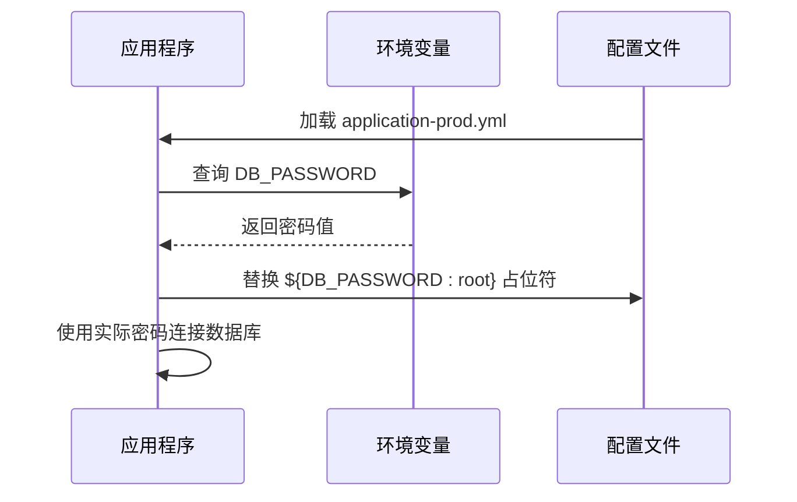

**Diagram sources**
- [traffic-sim-server/src/main/resources/application-prod.yml](file://traffic-sim-server/src/main/resources/application-prod.yml#L4-L6)
- [infrastructure/docker-compose.yml](file://infrastructure/docker-compose.yml#L14-L18)

**Section sources**
- [traffic-sim-server/src/main/resources/application-prod.yml](file://traffic-sim-server/src/main/resources/application-prod.yml#L4-L6)

### 配置继承与覆盖
Spring Boot的配置文件具有明确的优先级顺序：命令行参数 > JVM系统属性 > 环境变量 > 配置文件。在同一配置文件中，后定义的属性会覆盖先定义的属性。在多配置文件情况下，profile-specific文件会覆盖基础配置文件中的同名属性。

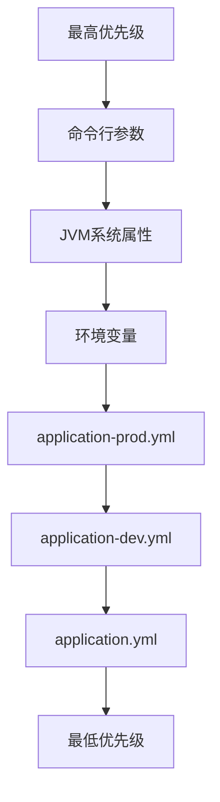

**Diagram sources**
- [traffic-sim-server/src/main/resources/application.yml](file://traffic-sim-server/src/main/resources/application.yml)
- [traffic-sim-server/src/main/resources/application-dev.yml](file://traffic-sim-server/src/main/resources/application-dev.yml)
- [traffic-sim-server/src/main/resources/application-prod.yml](file://traffic-sim-server/src/main/resources/application-prod.yml)

**Section sources**
- [traffic-sim-server/src/main/resources/application.yml](file://traffic-sim-server/src/main/resources/application.yml)
- [traffic-sim-server/src/main/resources/application-dev.yml](file://traffic-sim-server/src/main/resources/application-dev.yml)
- [traffic-sim-server/src/main/resources/application-prod.yml](file://traffic-sim-server/src/main/resources/application-prod.yml)

## 结论
本配置管理文档全面分析了交通仿真系统的配置体系，涵盖了从应用配置到基础设施配置的各个方面。系统采用了现代化的配置管理实践，包括分层配置、环境特定配置、敏感信息保护等。通过Docker Compose实现了基础设施即代码，确保了开发、测试和生产环境的一致性。插件化架构的配置设计体现了良好的模块化和可扩展性。建议在生产部署时严格遵循敏感信息管理最佳实践，使用环境变量或密钥管理服务来管理密码等敏感数据，确保系统的安全性。