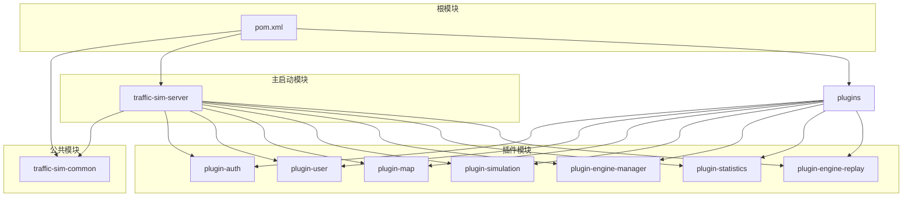
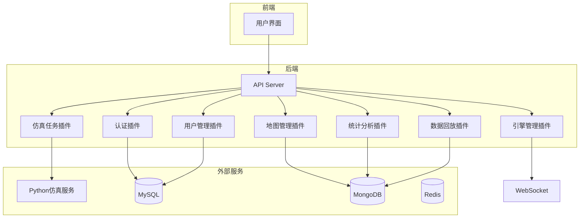
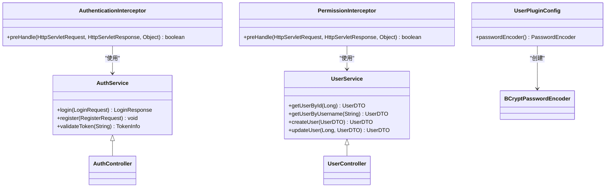
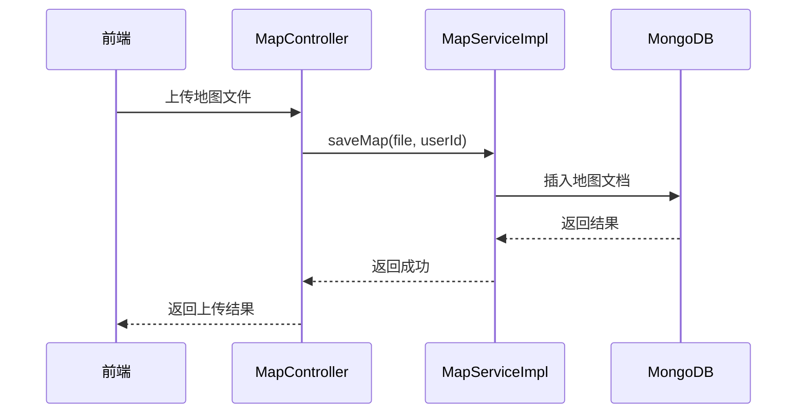
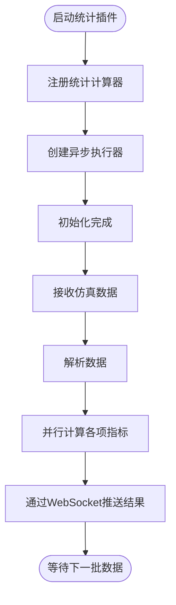
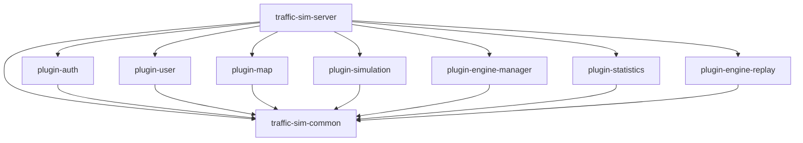

# 项目概述

<cite>
**本文档中引用的文件**  
- [pom.xml](file://pom.xml)
- [TrafficSimApplication.java](file://traffic-sim-server/src/main/java/com/traffic/sim/TrafficSimApplication.java)
- [application.yml](file://traffic-sim-server/src/main/resources/application.yml)
- [README.md](file://README.md)
- [AuthService.java](file://traffic-sim-common/src/main/java/com/traffic/sim/common/service/AuthService.java)
- [UserService.java](file://traffic-sim-common/src/main/java/com/traffic/sim/common/service/UserService.java)
- [SimulationService.java](file://traffic-sim-common/src/main/java/com/traffic/sim/common/service/SimulationService.java)
- [AuthPluginAutoConfiguration.java](file://plugins/plugin-auth/src/main/java/com/traffic/sim/plugin/auth/config/AuthPluginAutoConfiguration.java)
- [UserPluginConfig.java](file://plugins/plugin-user/src/main/java/com/traffic/sim/plugin/user/config/UserPluginConfig.java)
- [MapPluginConfig.java](file://plugins/plugin-map/src/main/java/com/traffic/sim/plugin/map/config/MapPluginConfig.java)
- [SimulationPluginProperties.java](file://plugins/plugin-simulation/src/main/java/com/traffic/sim/plugin/simulation/config/SimulationPluginProperties.java)
- [StatisticsPluginAutoConfiguration.java](file://plugins/plugin-statistics/src/main/java/com/traffic/sim/plugin/statistics/config/StatisticsPluginAutoConfiguration.java)
- [WebSocketConfig.java](file://plugins/plugin-engine-manager/src/main/java/com/traffic/sim/plugin/engine/manager/config/WebSocketConfig.java)
- [docker-compose.yml](file://infrastructure/docker-compose.yml)
</cite>

## 目录
1. [简介](#简介)
2. [项目结构](#项目结构)
3. [核心组件](#核心组件)
4. [架构概述](#架构概述)
5. [详细组件分析](#详细组件分析)
6. [依赖分析](#依赖分析)
7. [性能考虑](#性能考虑)
8. [故障排除指南](#故障排除指南)
9. [结论](#结论)

## 简介

交通仿真系统（traffic_sim_pib）是一个基于Spring Boot 3.x的插件化单体应用，旨在提供一个可扩展、可维护的交通仿真平台。该项目采用模块化设计，通过Maven依赖将各个功能插件集成到主应用中，实现功能的灵活组合与解耦。系统支持用户认证、地图管理、仿真任务调度、实时统计分析、数据回放等核心功能，并通过gRPC与Python仿真服务通信，利用MySQL和MongoDB双数据库架构分别存储结构化与非结构化数据。本文档旨在为初学者提供系统上下文，为高级开发者解析关键设计决策。

## 项目结构

该项目采用多模块Maven结构，分为公共模块、主启动模块和多个功能插件模块。整体结构清晰，职责分明，便于团队协作与独立开发。

**图示来源**  
- [pom.xml](file://pom.xml)

**本节来源**  
- [pom.xml](file://pom.xml)
- [README.md](file://README.md)

## 核心组件

系统由多个核心组件构成，每个组件负责特定的业务功能。`traffic-sim-common`模块定义了所有插件共享的接口、DTO、常量和工具类，确保各模块间的契约一致性。`traffic-sim-server`作为主启动模块，负责集成所有插件并启动Spring Boot应用。各功能插件（如认证、用户、地图、仿真等）通过实现common模块中的接口来提供具体业务逻辑。

**本节来源**  
- [AuthService.java](file://traffic-sim-common/src/main/java/com/traffic/sim/common/service/AuthService.java)
- [UserService.java](file://traffic-sim-common/src/main/java/com/traffic/sim/common/service/UserService.java)
- [SimulationService.java](file://traffic-sim-common/src/main/java/com/traffic/sim/common/service/SimulationService.java)

## 架构概述

系统采用插件化单体架构，所有模块在编译时通过Maven依赖打包为一个可执行的JAR文件。这种设计既保留了单体应用部署简单的优点，又具备了模块化开发的灵活性。系统通过Spring的自动配置机制加载各插件的配置类，如`AuthPluginAutoConfiguration`负责注册认证拦截器，`WebSocketConfig`配置WebSocket端点。插件间通过`traffic-sim-common`中定义的服务接口进行通信，避免了直接依赖，提高了模块的独立性。

**图示来源**  
- [AuthPluginAutoConfiguration.java](file://plugins/plugin-auth/src/main/java/com/traffic/sim/plugin/auth/config/AuthPluginAutoConfiguration.java)
- [WebSocketConfig.java](file://plugins/plugin-engine-manager/src/main/java/com/traffic/sim/plugin/engine/manager/config/WebSocketConfig.java)
- [application.yml](file://traffic-sim-server/src/main/resources/application.yml)

**本节来源**  
- [TrafficSimApplication.java](file://traffic-sim-server/src/main/java/com/traffic/sim/TrafficSimApplication.java)
- [application.yml](file://traffic-sim-server/src/main/resources/application.yml)

## 详细组件分析

### 认证与用户管理分析

认证插件（plugin-auth）负责处理用户登录、注册和JWT令牌管理。它通过`AuthenticationInterceptor`和`PermissionInterceptor`两个拦截器实现全局的认证和权限控制。用户插件（plugin-user）管理用户信息，使用BCryptPasswordEncoder对密码进行加密存储。两个插件通过`traffic-sim-common`中的`AuthService`和`UserService`接口与系统其他部分交互。

**图示来源**  
- [AuthService.java](file://traffic-sim-common/src/main/java/com/traffic/sim/common/service/AuthService.java)
- [UserService.java](file://traffic-sim-common/src/main/java/com/traffic/sim/common/service/UserService.java)
- [AuthPluginAutoConfiguration.java](file://plugins/plugin-auth/src/main/java/com/traffic/sim/plugin/auth/config/AuthPluginAutoConfiguration.java)
- [UserPluginConfig.java](file://plugins/plugin-user/src/main/java/com/traffic/sim/plugin/user/config/UserPluginConfig.java)

**本节来源**  
- [AuthPluginAutoConfiguration.java](file://plugins/plugin-auth/src/main/java/com/traffic/sim/plugin/auth/config/AuthPluginAutoConfiguration.java)
- [UserPluginConfig.java](file://plugins/plugin-user/src/main/java/com/traffic/sim/plugin/user/config/UserPluginConfig.java)

### 地图与仿真管理分析

地图插件（plugin-map）负责地图的上传、转换和存储，使用MongoDB来存储地图文件的元数据和内容。仿真插件（plugin-simulation）负责创建和管理仿真任务，通过gRPC与Python仿真服务通信。`SimulationPluginProperties`配置类定义了与Python服务通信的参数，如gRPC端口和超时时间。

**图示来源**  
- [MapPluginConfig.java](file://plugins/plugin-map/src/main/java/com/traffic/sim/plugin/map/config/MapPluginConfig.java)
- [SimulationPluginProperties.java](file://plugins/plugin-simulation/src/main/java/com/traffic/sim/plugin/simulation/config/SimulationPluginProperties.java)

**本节来源**  
- [MapPluginConfig.java](file://plugins/plugin-map/src/main/java/com/traffic/sim/plugin/map/config/MapPluginConfig.java)
- [SimulationPluginProperties.java](file://plugins/plugin-simulation/src/main/java/com/traffic/sim/plugin/simulation/config/SimulationPluginProperties.java)

### 统计分析与引擎管理分析

统计分析插件（plugin-statistics）负责在仿真过程中实时计算各项交通指标，如流量、速度、排队长度等。它通过`StatisticsPluginAutoConfiguration`注册所有`StatisticsCalculator`实现，并使用独立的线程池异步执行计算任务。引擎管理插件（plugin-engine-manager）通过WebSocket与前端和仿真引擎建立双向通信，实现仿真状态的实时推送和控制指令的下发。

**图示来源**  
- [StatisticsPluginAutoConfiguration.java](file://plugins/plugin-statistics/src/main/java/com/traffic/sim/plugin/statistics/config/StatisticsPluginAutoConfiguration.java)
- [WebSocketConfig.java](file://plugins/plugin-engine-manager/src/main/java/com/traffic/sim/plugin/engine/manager/config/WebSocketConfig.java)

**本节来源**  
- [StatisticsPluginAutoConfiguration.java](file://plugins/plugin-statistics/src/main/java/com/traffic/sim/plugin/statistics/config/StatisticsPluginAutoConfiguration.java)
- [WebSocketConfig.java](file://plugins/plugin-engine-manager/src/main/java/com/traffic/sim/plugin/engine/manager/config/WebSocketConfig.java)

## 依赖分析

系统依赖关系清晰，主模块`traffic-sim-server`通过Maven依赖引入所有插件模块和`traffic-sim-common`。各插件模块依赖`traffic-sim-common`以获取共享的接口和DTO。外部依赖包括Spring Boot 3.2.0、gRPC、JWT、Lombok等。基础设施通过Docker Compose统一管理MySQL、MongoDB、Redis、Kafka等服务，确保开发和生产环境的一致性。

**图示来源**  
- [pom.xml](file://pom.xml)

**本节来源**  
- [pom.xml](file://pom.xml)
- [docker-compose.yml](file://infrastructure/docker-compose.yml)

## 性能考虑

系统在设计时充分考虑了性能因素。使用Redis作为缓存层，减轻数据库压力；通过异步线程池处理耗时的统计计算任务，避免阻塞主线程；gRPC通信采用二进制协议，提高数据传输效率。数据库方面，MySQL用于存储用户、权限等结构化数据，MongoDB用于存储地图、仿真日志等非结构化或半结构化数据，充分发挥各自优势。WebSocket实现实时通信，避免了HTTP轮询的开销。

## 故障排除指南

常见问题包括数据库连接失败、gRPC服务不可用、WebSocket连接异常等。应首先检查`application.yml`中的配置是否正确，确保MySQL、MongoDB等服务已正常启动。对于gRPC问题，可检查Python仿真服务是否运行，并确认端口配置。日志文件位于`logs/traffic-sim-server.log`，可通过日志级别DEBUG获取详细信息。Docker Compose脚本提供了便捷的启停服务，可用于快速复现和解决问题。

**本节来源**  
- [application.yml](file://traffic-sim-server/src/main/resources/application.yml)
- [TrafficSimApplication.java](file://traffic-sim-server/src/main/java/com/traffic/sim/TrafficSimApplication.java)
- [docker-compose.yml](file://infrastructure/docker-compose.yml)

## 结论

交通仿真系统（traffic_sim_pib）通过插件化单体架构，成功实现了功能模块的解耦与复用。基于Spring Boot 3.x的现代技术栈，结合gRPC、WebSocket、双数据库等关键技术，构建了一个高性能、可扩展的仿真平台。该设计既满足了当前业务需求，又为未来功能扩展提供了良好的基础。建议在后续开发中进一步完善插件的热部署能力，以提升系统的灵活性。