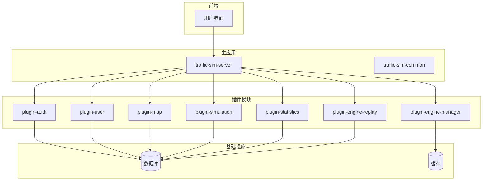
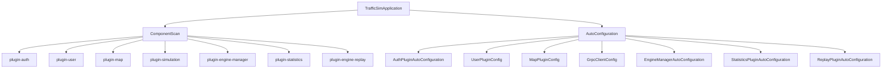
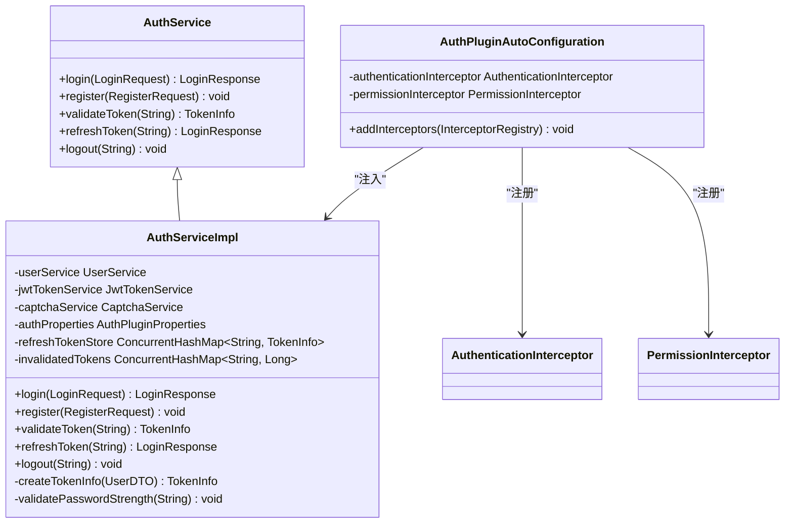
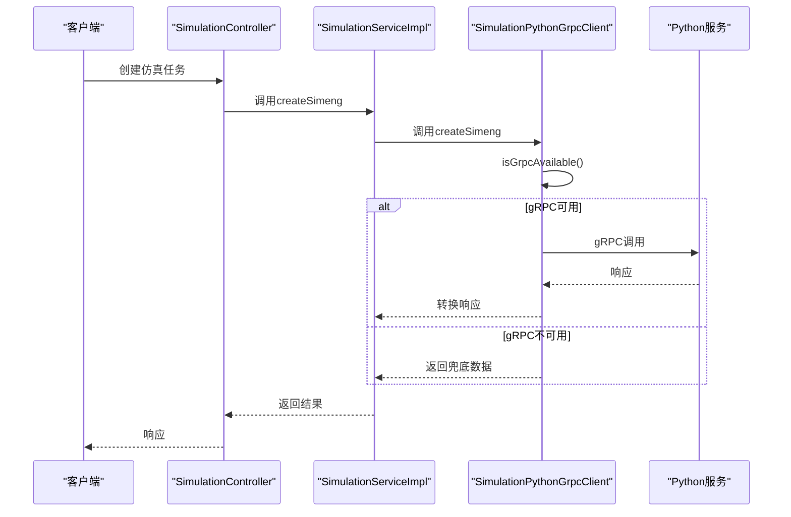
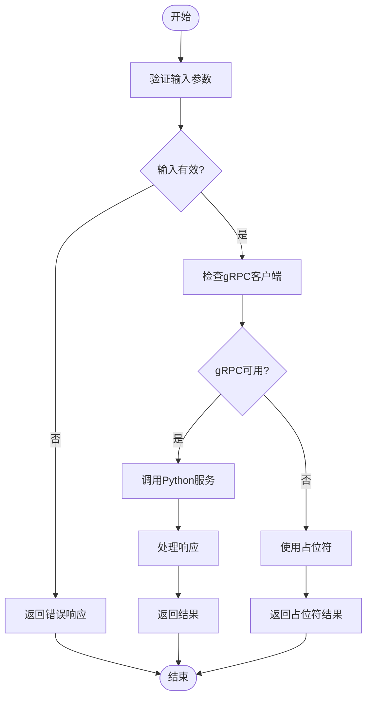
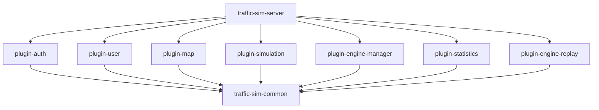

# 项目概述

<cite>
**本文档引用的文件**   
- [pom.xml](file://pom.xml)
- [TrafficSimApplication.java](file://traffic-sim-server/src/main/java/com/traffic/sim/TrafficSimApplication.java)
- [application.yml](file://traffic-sim-server/src/main/resources/application.yml)
- [README.md](file://README.md)
- [AuthPluginAutoConfiguration.java](file://plugins/plugin-auth/src/main/java/com/traffic/sim/plugin/auth/config/AuthPluginAutoConfiguration.java)
- [org.springframework.boot.autoconfigure.AutoConfiguration.imports](file://plugins/plugin-auth/src/main/resources/META-INF/spring/org.springframework.boot.autoconfigure.AutoConfiguration.imports)
- [python_service.proto](file://plugins/plugin-simulation/src/main/proto/python_service.proto)
- [CommonConfig.java](file://traffic-sim-common/src/main/java/com/traffic/sim/common/config/CommonConfig.java)
- [WebConfig.java](file://traffic-sim-server/src/main/java/com/traffic/sim/config/WebConfig.java)
- [AuthServiceImpl.java](file://plugins/plugin-auth/src/main/java/com/traffic/sim/plugin/auth/service/AuthServiceImpl.java)
- [SimulationPythonGrpcClient.java](file://plugins/plugin-simulation/src/main/java/com/traffic/sim/plugin/simulation/grpc/SimulationPythonGrpcClient.java)
- [MapPythonGrpcClient.java](file://plugins/plugin-map/src/main/java/com/traffic/sim/plugin/map/client/MapPythonGrpcClient.java)
- [LoginRequest.java](file://traffic-sim-common/src/main/java/com/traffic/sim/common/dto/LoginRequest.java)
- [AuthService.java](file://traffic-sim-common/src/main/java/com/traffic/sim/common/service/AuthService.java)
</cite>

## 目录
1. [简介](#简介)
2. [项目结构](#项目结构)
3. [核心组件](#核心组件)
4. [架构概述](#架构概述)
5. [详细组件分析](#详细组件分析)
6. [依赖分析](#依赖分析)
7. [性能考虑](#性能考虑)
8. [故障排除指南](#故障排除指南)
9. [结论](#结论)

## 简介
traffic_sim_pib项目是一个基于Spring Boot 3.x的插件化交通仿真平台，旨在为智能交通系统提供一个灵活、可扩展的仿真环境。该项目采用单体应用架构，通过插件化模块实现功能扩展，支持多种关键技术，包括Java、Spring Boot、MongoDB、Redis和gRPC。平台的设计目的是为了简化交通仿真系统的开发和维护，同时提供强大的功能和良好的用户体验。

## 项目结构
traffic_sim_pib项目的目录结构清晰，分为多个模块，每个模块负责不同的功能。主要模块包括`frontend`、`infrastructure`、`map_convert_services`、`plugins`、`traffic-sim-common`、`traffic-sim-server`等。这些模块共同构成了一个完整的交通仿真平台。

**图源**
- [pom.xml](file://pom.xml)
- [README.md](file://README.md)

**本节来源**
- [pom.xml](file://pom.xml)
- [README.md](file://README.md)

## 核心组件
traffic_sim_pib项目的核心组件包括主启动类`TrafficSimApplication`、公共模块`traffic-sim-common`、主启动模块`traffic-sim-server`以及各个插件模块。这些组件通过Spring Boot的自动配置和组件扫描机制协同工作，实现了平台的插件化架构。

**本节来源**
- [TrafficSimApplication.java](file://traffic-sim-server/src/main/java/com/traffic/sim/TrafficSimApplication.java)
- [CommonConfig.java](file://traffic-sim-common/src/main/java/com/traffic/sim/common/config/CommonConfig.java)
- [WebConfig.java](file://traffic-sim-server/src/main/java/com/traffic/sim/config/WebConfig.java)

## 架构概述
traffic_sim_pib项目采用单体应用架构，但通过插件化模块实现了功能的解耦和扩展。主启动模块`traffic-sim-server`负责应用的启动和全局配置管理，而各个插件模块则通过Maven依赖引入，编译时打包为一个JAR文件。这种设计使得平台既保持了单体应用的简单性，又具备了插件化架构的灵活性。

**图源**
- [TrafficSimApplication.java](file://traffic-sim-server/src/main/java/com/traffic/sim/TrafficSimApplication.java)
- [AuthPluginAutoConfiguration.java](file://plugins/plugin-auth/src/main/java/com/traffic/sim/plugin/auth/config/AuthPluginAutoConfiguration.java)
- [org.springframework.boot.autoconfigure.AutoConfiguration.imports](file://plugins/plugin-auth/src/main/resources/META-INF/spring/org.springframework.boot.autoconfigure.AutoConfiguration.imports)

## 详细组件分析
### 认证插件分析
认证插件`plugin-auth`负责用户的登录、注册和权限管理。该插件通过JWT令牌实现用户认证，并提供了验证码功能以增强安全性。插件的自动配置类`AuthPluginAutoConfiguration`注册了认证和权限拦截器，确保只有经过认证的用户才能访问受保护的资源。

#### 类图

**图源**
- [AuthServiceImpl.java](file://plugins/plugin-auth/src/main/java/com/traffic/sim/plugin/auth/service/AuthServiceImpl.java)
- [AuthPluginAutoConfiguration.java](file://plugins/plugin-auth/src/main/java/com/traffic/sim/plugin/auth/config/AuthPluginAutoConfiguration.java)

### 仿真插件分析
仿真插件`plugin-simulation`负责与Python仿真引擎的通信。该插件通过gRPC协议与Python服务进行交互，实现了仿真任务的创建和控制。为了提高系统的容错能力，插件在gRPC服务不可用时会返回兜底数据，确保应用的正常运行。

#### 序列图

**图源**
- [SimulationPythonGrpcClient.java](file://plugins/plugin-simulation/src/main/java/com/traffic/sim/plugin/simulation/grpc/SimulationPythonGrpcClient.java)
- [python_service.proto](file://plugins/plugin-simulation/src/main/proto/python_service.proto)

### 地图插件分析
地图插件`plugin-map`负责地图文件的上传和转换。该插件通过gRPC客户端调用Python服务进行地图格式转换，但由于gRPC客户端尚未完全实现，目前使用占位符实现。未来将完善gRPC客户端，实现与Python服务的无缝对接。

#### 流程图

**图源**
- [MapPythonGrpcClient.java](file://plugins/plugin-map/src/main/java/com/traffic/sim/plugin/map/client/MapPythonGrpcClient.java)

**本节来源**
- [AuthServiceImpl.java](file://plugins/plugin-auth/src/main/java/com/traffic/sim/plugin/auth/service/AuthServiceImpl.java)
- [SimulationPythonGrpcClient.java](file://plugins/plugin-simulation/src/main/java/com/traffic/sim/plugin/simulation/grpc/SimulationPythonGrpcClient.java)
- [MapPythonGrpcClient.java](file://plugins/plugin-map/src/main/java/com/traffic/sim/plugin/map/client/MapPythonGrpcClient.java)

## 依赖分析
traffic_sim_pib项目的依赖关系清晰，主启动模块`traffic-sim-server`通过Maven依赖引入各个插件模块，而插件模块之间通过`traffic-sim-common`模块中的接口定义进行通信。这种设计避免了插件间的直接依赖，提高了系统的可维护性和可扩展性。

**图源**
- [pom.xml](file://pom.xml)
- [plugins/pom.xml](file://plugins/pom.xml)

**本节来源**
- [pom.xml](file://pom.xml)
- [plugins/pom.xml](file://plugins/pom.xml)

## 性能考虑
traffic_sim_pib项目在设计时充分考虑了性能问题。通过使用Redis作为缓存，减少了数据库的访问压力；通过gRPC协议与Python服务进行高效通信，降低了网络延迟。此外，项目还通过异步处理和线程池优化了资源利用率，确保了系统的高性能。

## 故障排除指南
### gRPC集成失败
当gRPC服务不可用时，系统会自动返回兜底数据，确保应用的正常运行。如果遇到gRPC集成失败的问题，可以按照以下步骤进行排查：
1. 检查Python gRPC服务是否已启动。
2. 检查`application.yml`中的gRPC配置是否正确。
3. 查看日志文件，确认是否有gRPC相关的错误信息。
4. 如果问题仍然存在，可以在`application.yml`中设置`grpc.client.python-service.enabled=false`，禁用gRPC客户端并使用兜底数据。

**本节来源**
- [TrafficSimApplication.java](file://traffic-sim-server/src/main/java/com/traffic/sim/TrafficSimApplication.java)
- [SimulationPythonGrpcClient.java](file://plugins/plugin-simulation/src/main/java/com/traffic/sim/plugin/simulation/grpc/SimulationPythonGrpcClient.java)

## 结论
traffic_sim_pib项目通过插件化架构实现了交通仿真平台的灵活扩展，结合Spring Boot 3.x的强大功能，提供了一个高效、可靠的仿真环境。项目的设计充分考虑了可维护性、可扩展性和性能，适用于智能交通系统的仿真需求。未来，项目将继续完善gRPC客户端，增强系统的稳定性和功能。