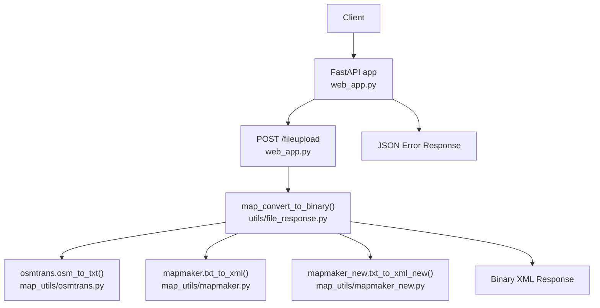
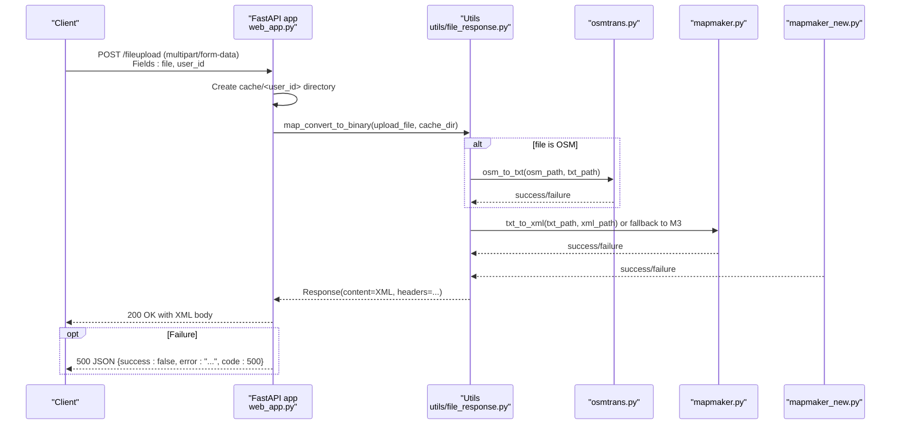
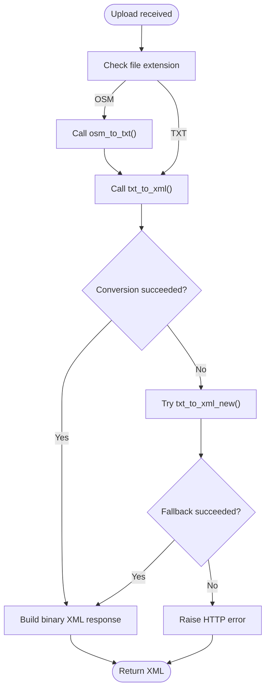
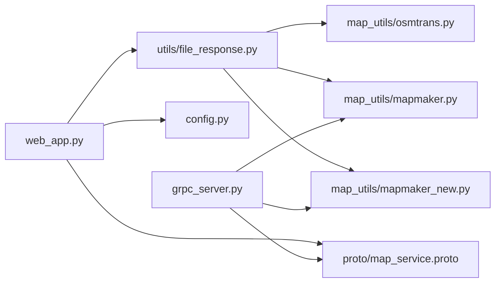

# REST API

<cite>
**Referenced Files in This Document**
- [web_app.py](file://web_app.py)
- [utils/file_response.py](file://utils/file_response.py)
- [proto/map_service.proto](file://proto/map_service.proto)
- [grpc_server.py](file://grpc_server.py)
- [config.py](file://config.py)
- [map_utils/osmtrans.py](file://map_utils/osmtrans.py)
- [map_utils/mapmaker.py](file://map_utils/mapmaker.py)
- [map_utils/mapmaker_new.py](file://map_utils/mapmaker_new.py)
</cite>

## Table of Contents
1. [Introduction](#introduction)
2. [Project Structure](#project-structure)
3. [Core Components](#core-components)
4. [Architecture Overview](#architecture-overview)
5. [Detailed Component Analysis](#detailed-component-analysis)
6. [Dependency Analysis](#dependency-analysis)
7. [Performance Considerations](#performance-considerations)
8. [Troubleshooting Guide](#troubleshooting-guide)
9. [Conclusion](#conclusion)
10. [Appendices](#appendices)

## Introduction
This document provides comprehensive API documentation for the REST interface of map_convert_services, focusing on the /fileupload endpoint. It explains how to upload map files (OSM/TXT), how the system processes them, and how clients receive the converted XML. It also covers error handling, security considerations, performance implications, and integration guidelines.

## Project Structure
The REST API is implemented using FastAPI and exposes a single endpoint for file upload and conversion. Internally, the conversion pipeline relies on:
- FastAPI route handler for /fileupload
- Utility functions for safe file handling and binary response
- gRPC service definition and server implementation for the actual conversion logic
- Map conversion utilities for OSM and TXT transformations

**Diagram sources**
- [web_app.py](file://web_app.py#L52-L81)
- [utils/file_response.py](file://utils/file_response.py#L8-L55)
- [map_utils/osmtrans.py](file://map_utils/osmtrans.py#L1-L1255)
- [map_utils/mapmaker.py](file://map_utils/mapmaker.py#L561-L610)
- [map_utils/mapmaker_new.py](file://map_utils/mapmaker_new.py#L708-L748)

**Section sources**
- [web_app.py](file://web_app.py#L1-L120)
- [utils/file_response.py](file://utils/file_response.py#L1-L107)
- [proto/map_service.proto](file://proto/map_service.proto#L1-L66)
- [grpc_server.py](file://grpc_server.py#L1-L283)

## Core Components
- FastAPI application and route handler for /fileupload
- Utility module for safe file path construction and binary response
- gRPC service definition and server for conversion logic
- Map conversion utilities for OSM and TXT formats

Key responsibilities:
- Validate and sanitize uploaded file names
- Save uploaded files to a per-user cache directory
- Convert OSM to TXT, then TXT to XML using either legacy or new conversion method
- Return converted XML as binary response with appropriate headers
- On failure, return structured JSON error response

**Section sources**
- [web_app.py](file://web_app.py#L52-L81)
- [utils/file_response.py](file://utils/file_response.py#L8-L55)
- [proto/map_service.proto](file://proto/map_service.proto#L1-L66)
- [grpc_server.py](file://grpc_server.py#L32-L194)

## Architecture Overview
The /fileupload endpoint orchestrates a synchronous conversion process:
- The client uploads a file and user_id
- The server saves the file to cache/<user_id>
- The server converts the file to XML using the conversion utilities
- The server returns the XML as a binary response

**Diagram sources**
- [web_app.py](file://web_app.py#L52-L81)
- [utils/file_response.py](file://utils/file_response.py#L8-L55)
- [map_utils/osmtrans.py](file://map_utils/osmtrans.py#L1-L1255)
- [map_utils/mapmaker.py](file://map_utils/mapmaker.py#L561-L610)
- [map_utils/mapmaker_new.py](file://map_utils/mapmaker_new.py#L708-L748)

## Detailed Component Analysis

### Endpoint Definition: POST /fileupload
- Method: POST
- Path: /fileupload
- Content-Type: multipart/form-data
- Request fields:
  - file: uploaded map file (OSM or TXT)
  - user_id: string identifier for user session
- Behavior:
  - Creates a per-user cache directory cache/<user_id>
  - Saves the uploaded file securely using a safe path
  - Converts the file to XML using the conversion pipeline
  - Returns the XML as a binary response with appropriate headers
- Error handling:
  - On exceptions, returns JSON with success=false, error message, and code 500

Response headers include:
- Content-Disposition: attachment; filename*=UTF-8''<safe_xml_filename>
- Content-Length: <size_bytes>
- X-Filename: <safe_xml_filename>
- X-File-Size: <size_bytes>
- X-Original-File: <safe_original_filename>
- X-Conversion-Method: "old" or "new"
- X-Success: "true"

Security:
- Uses get_safe_path() to sanitize filenames and prevent directory traversal
- Validates file extensions and raises HTTP exceptions for unsupported formats

**Section sources**
- [web_app.py](file://web_app.py#L52-L81)
- [utils/file_response.py](file://utils/file_response.py#L8-L55)

### Conversion Pipeline Details
- OSM to TXT: osmtrans.osm_to_txt() converts OSM to TXT
- TXT to XML: First attempts mapmaker.txt_to_xml(); if unsuccessful, falls back to mapmaker_new.txt_to_xml_new()
- Output: Converted XML bytes with filename and conversion method

**Diagram sources**
- [utils/file_response.py](file://utils/file_response.py#L8-L55)
- [map_utils/osmtrans.py](file://map_utils/osmtrans.py#L1-L1255)
- [map_utils/mapmaker.py](file://map_utils/mapmaker.py#L561-L610)
- [map_utils/mapmaker_new.py](file://map_utils/mapmaker_new.py#L708-L748)

**Section sources**
- [utils/file_response.py](file://utils/file_response.py#L8-L55)
- [map_utils/osmtrans.py](file://map_utils/osmtrans.py#L1-L1255)
- [map_utils/mapmaker.py](file://map_utils/mapmaker.py#L561-L610)
- [map_utils/mapmaker_new.py](file://map_utils/mapmaker_new.py#L708-L748)

### Security Considerations
- Directory traversal prevention:
  - get_safe_path() constructs a safe path by sanitizing filenames and joining with the base directory
  - This ensures uploaded files are stored strictly under the intended user directory
- File name encoding:
  - safe_filename_header() URL-encodes filenames for HTTP headers to avoid encoding issues
- Supported formats:
  - Only OSM and TXT are supported; invalid or unsupported formats trigger HTTP errors

**Section sources**
- [utils/file_response.py](file://utils/file_response.py#L84-L107)

### Error Handling
- JSON error response on server-side exceptions:
  - Fields: success (false), error (string), code (500)
- HTTP exceptions during conversion:
  - Invalid file name or unsupported format: 400
  - Source file not found: 404
  - Conversion failures: 503 (OSM->TXT or TXT->XML)
  - Output file creation failure: 500

**Section sources**
- [web_app.py](file://web_app.py#L52-L81)
- [utils/file_response.py](file://utils/file_response.py#L8-L55)

### Example cURL Commands
- Upload OSM file:
  - curl -X POST "http://localhost:8000/fileupload" -F "file=@/path/to/map.osm" -F "user_id=your_session_id"
- Upload TXT file:
  - curl -X POST "http://localhost:8000/fileupload" -F "file=@/path/to/map.txt" -F "user_id=your_session_id"

Notes:
- Replace localhost:8000 with your actual host and port
- Ensure user_id is a valid string identifier

**Section sources**
- [web_app.py](file://web_app.py#L52-L81)
- [config.py](file://config.py#L1-L21)

### Sample Request/Response
- Request:
  - POST /fileupload
  - multipart/form-data with fields:
    - file: map.osm or map.txt
    - user_id: string
- Successful Response:
  - Status: 200 OK
  - Body: XML bytes
  - Headers: Content-Disposition, Content-Length, X-Filename, X-File-Size, X-Original-File, X-Conversion-Method, X-Success
- Error Response:
  - Status: 500
  - Body: JSON {success:false, error:"...", code:500}

**Section sources**
- [web_app.py](file://web_app.py#L52-L81)
- [utils/file_response.py](file://utils/file_response.py#L8-L55)

### Integration Guidelines
- Client applications should:
  - Prepare multipart/form-data with file and user_id
  - Handle binary XML response and set appropriate file name from X-Filename header
  - Implement retry logic for transient conversion errors
  - Validate user_id to ensure per-user isolation
- Server configuration:
  - Host and port are configurable via environment variables (APP_HOST, APP_PORT)
  - Log home directory is configurable (LOG_HOME)

**Section sources**
- [web_app.py](file://web_app.py#L1-L120)
- [config.py](file://config.py#L1-L21)

## Dependency Analysis
The REST endpoint depends on:
- FastAPI route handler in web_app.py
- Safe file handling and binary response in utils/file_response.py
- Conversion utilities in map_utils/*
- gRPC service definition and server for internal conversion (not invoked by the REST endpoint)

**Diagram sources**
- [web_app.py](file://web_app.py#L1-L120)
- [utils/file_response.py](file://utils/file_response.py#L1-L107)
- [map_utils/osmtrans.py](file://map_utils/osmtrans.py#L1-L1255)
- [map_utils/mapmaker.py](file://map_utils/mapmaker.py#L561-L610)
- [map_utils/mapmaker_new.py](file://map_utils/mapmaker_new.py#L708-L748)
- [proto/map_service.proto](file://proto/map_service.proto#L1-L66)
- [grpc_server.py](file://grpc_server.py#L1-L283)
- [config.py](file://config.py#L1-L21)

**Section sources**
- [web_app.py](file://web_app.py#L1-L120)
- [utils/file_response.py](file://utils/file_response.py#L1-L107)
- [proto/map_service.proto](file://proto/map_service.proto#L1-L66)
- [grpc_server.py](file://grpc_server.py#L1-L283)
- [config.py](file://config.py#L1-L21)

## Performance Considerations
- Synchronous processing:
  - The /fileupload endpoint performs synchronous file processing, which blocks the request thread until conversion completes
  - Large files or heavy computations can lead to increased latency and reduced throughput
- Recommendations for large-scale deployments:
  - Offload conversion to a background job queue (e.g., Celery, Kafka) and return a job ID immediately
  - Poll for completion via a separate GET endpoint or push notifications
  - Scale workers horizontally and isolate user directories to prevent contention
  - Consider caching frequently accessed conversions and pre-warming conversion utilities

[No sources needed since this section provides general guidance]

## Troubleshooting Guide
Common issues and resolutions:
- Unsupported file format:
  - Symptom: 400 Bad Request
  - Cause: File extension not OSM or TXT
  - Resolution: Ensure file has .osm or .txt extension
- Invalid file name:
  - Symptom: 400 Bad Request
  - Cause: Missing or malformed filename
  - Resolution: Provide a valid filename with extension
- Source file not found:
  - Symptom: 404 Not Found
  - Cause: Missing input file path
  - Resolution: Verify upload path and cache directory permissions
- Conversion failures:
  - Symptom: 503 Service Unavailable (OSM->TXT) or 503/500 (TXT->XML)
  - Causes: Conversion utility errors or missing output file
  - Resolution: Retry after verifying input validity; check logs for detailed errors
- JSON error response:
  - Symptom: 500 Internal Server Error with JSON body
  - Cause: Unexpected server-side exception
  - Resolution: Inspect server logs and error message; ensure user_id is valid

**Section sources**
- [utils/file_response.py](file://utils/file_response.py#L8-L55)
- [web_app.py](file://web_app.py#L52-L81)

## Conclusion
The /fileupload endpoint provides a straightforward mechanism to upload map files and receive converted XML. It enforces safety through filename sanitization and supports robust error reporting. For production environments, consider asynchronous processing patterns to improve scalability and responsiveness.

[No sources needed since this section summarizes without analyzing specific files]

## Appendices

### API Reference: POST /fileupload
- Method: POST
- Path: /fileupload
- Content-Type: multipart/form-data
- Request fields:
  - file: uploaded map file (.osm or .txt)
  - user_id: string identifier for user session
- Response:
  - 200 OK with binary XML body and headers
  - 400/404/503/500 on error with JSON body
- Headers:
  - Content-Disposition: attachment; filename*=UTF-8''<safe_xml_filename>
  - Content-Length: <size_bytes>
  - X-Filename: <safe_xml_filename>
  - X-File-Size: <size_bytes>
  - X-Original-File: <safe_original_filename>
  - X-Conversion-Method: "old" or "new"
  - X-Success: "true"

**Section sources**
- [web_app.py](file://web_app.py#L52-L81)
- [utils/file_response.py](file://utils/file_response.py#L8-L55)